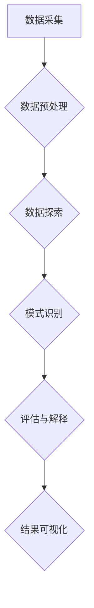

                 

### 背景介绍

#### 人类认知能力的局限

人类认知能力是我们在日常生活中理解和解决问题的核心能力。然而，尽管人类在处理复杂问题时表现出卓越的智慧，但我们的认知能力仍然存在一些固有的局限。首先，人类的记忆容量是有限的。我们无法同时处理大量的信息，这使得我们在面对大规模数据时难以全面掌握。其次，人类思维方式具有一定的线性特征，这使得我们在处理问题时往往只能考虑一系列的因果关系，而难以同时处理复杂的非线性关系。此外，人类认知过程受到心理、生理和情感等多种因素的影响，这使得我们的认知结果容易受到干扰和偏差。

#### 知识发现引擎的兴起

随着信息技术的快速发展，知识发现引擎作为人工智能的一个重要分支，逐渐引起了广泛关注。知识发现引擎是一种能够从大量数据中自动发现规律和知识的系统，通过算法和模型的分析，能够识别数据中的潜在模式和信息。与人类认知能力相比，知识发现引擎具有几个显著的优势。首先，知识发现引擎可以处理海量数据，不受记忆容量的限制。其次，知识发现引擎能够快速并行处理复杂问题，不受线性思维方式的限制。此外，知识发现引擎在处理数据时，能够减少心理、生理和情感等因素的干扰，提高认知的准确性和效率。

本文将围绕知识发现引擎与人类认知能力的增强这一主题，深入探讨知识发现引擎的工作原理、核心算法、实际应用场景，并展望其未来发展趋势。通过本文的阅读，我们将了解到如何利用知识发现引擎来提升人类认知能力，为解决现实世界中的复杂问题提供新的思路和方法。

#### 知识发现引擎的定义和作用

知识发现引擎（Knowledge Discovery Engine，KDE）是一种基于人工智能和数据挖掘技术的系统，其主要作用是从大量结构化和非结构化数据中自动发现潜在的模式、关联和知识。这些发现可以为决策提供支持，帮助企业在竞争激烈的市场中找到新的机遇，为研究人员在科学研究中揭示未知规律，甚至为政府机构在公共管理中提高政策制定的科学性和有效性。

知识发现引擎的基本原理可以概括为以下几个步骤：首先，数据采集和预处理，包括数据的清洗、转换和集成，以确保数据的质量和一致性。接着，数据挖掘，通过一系列算法和技术，如聚类、关联规则挖掘、分类和异常检测等，从数据中提取出潜在的模式和信息。最后，结果的解释和可视化，将挖掘结果以直观、易于理解的形式展示给用户，帮助其更好地理解和应用这些知识。

在具体应用中，知识发现引擎具有广泛的作用。例如，在商业领域，知识发现引擎可以帮助企业分析客户行为，识别潜在市场机会，优化供应链管理；在医疗领域，知识发现引擎可以用于分析病历数据，发现疾病的潜在风险因素，辅助医生进行诊断和治疗；在金融领域，知识发现引擎可以用于风险管理、欺诈检测和信用评估等。

总之，知识发现引擎作为人工智能的重要工具，不仅能够提升人类在数据分析和决策制定方面的效率和能力，还能够帮助我们更好地理解和应对复杂多变的世界。在接下来的章节中，我们将进一步探讨知识发现引擎的核心概念和架构，以及如何利用这些工具来增强人类认知能力。

### 核心概念与联系

在深入探讨知识发现引擎的工作原理和增强人类认知能力之前，我们需要了解一些核心概念和它们之间的相互联系。这些概念包括数据挖掘、机器学习、深度学习、自然语言处理等，它们共同构成了知识发现引擎的技术基础。

#### 数据挖掘（Data Mining）

数据挖掘是知识发现引擎的核心技术之一，它涉及到从大量数据中自动发现隐藏的模式和知识。数据挖掘的过程通常包括以下几个步骤：数据预处理、数据探索、模式识别、评估和解释。其中，数据预处理是数据挖掘的基础，它包括数据清洗、转换和集成，以确保数据的质量和一致性。数据探索则通过可视化技术帮助我们发现数据中的异常和趋势。模式识别是数据挖掘的核心，它包括聚类、关联规则挖掘、分类和异常检测等算法，用于从数据中提取潜在的模式。评估和解释则是对挖掘结果的验证和解释，以确保其可信度和实用性。

#### 机器学习（Machine Learning）

机器学习是数据挖掘的重要技术之一，它通过构建模型来模拟人类的认知和学习过程，从而从数据中自动学习并提取知识。机器学习的基本思想是通过训练数据集，调整模型的参数，使其能够对新的数据进行预测和分类。常见的机器学习算法包括线性回归、逻辑回归、决策树、随机森林、支持向量机等。机器学习在知识发现引擎中的应用非常广泛，它可以帮助我们自动识别数据中的复杂模式和关联，提高数据挖掘的准确性和效率。

#### 深度学习（Deep Learning）

深度学习是机器学习的一个重要分支，它通过构建多层神经网络来模拟人类大脑的学习过程，从而实现更加复杂和高效的模式识别和学习。深度学习的主要优势在于其能够自动提取特征，减少人工干预，从而提高数据挖掘的准确性和效率。常见的深度学习模型包括卷积神经网络（CNN）、循环神经网络（RNN）和生成对抗网络（GAN）等。深度学习在图像识别、语音识别和自然语言处理等领域取得了显著成果，也为知识发现引擎提供了强大的技术支持。

#### 自然语言处理（Natural Language Processing，NLP）

自然语言处理是知识发现引擎在处理文本数据时的重要技术，它涉及到对文本的理解、分析和生成。自然语言处理的基本任务包括分词、词性标注、命名实体识别、情感分析、机器翻译等。自然语言处理技术的进步，使得知识发现引擎能够更好地理解和处理非结构化文本数据，从而提取出更多的知识和信息。

#### 知识发现引擎的架构

知识发现引擎的架构通常包括数据层、算法层和应用层。数据层负责数据的采集、存储和管理，算法层包括数据预处理、数据挖掘、模式识别和评估等核心算法，应用层则提供可视化和交互功能，帮助用户理解和应用挖掘结果。

#### Mermaid 流程图

为了更直观地展示知识发现引擎的核心概念和架构，我们可以使用 Mermaid 流程图来描述。以下是一个简化的知识发现引擎的 Mermaid 流程图：



在这个流程图中，A 表示数据采集，B 表示数据预处理，C 表示数据探索，D 表示模式识别，E 表示评估与解释，F 表示结果可视化。每个步骤都通过相应的算法和技术来实现，从而形成一个完整的知识发现过程。

通过上述核心概念和架构的介绍，我们可以更好地理解知识发现引擎的工作原理，以及它是如何与人类认知能力相互联系的。在接下来的章节中，我们将深入探讨知识发现引擎的核心算法和数学模型，进一步揭示其增强人类认知能力的奥秘。

#### 核心算法原理 & 具体操作步骤

在理解了知识发现引擎的基本概念和架构之后，接下来我们将详细探讨其核心算法原理，并具体介绍这些算法的操作步骤，以便读者能够更清晰地理解知识发现引擎的工作过程。

##### 聚类算法

聚类算法是知识发现引擎中常用的一种算法，它主要用于将相似的数据点分组，从而发现数据中的潜在结构。常见的聚类算法包括 K-Means、DBSCAN 和层次聚类等。

1. **K-Means 聚类算法**

   K-Means 聚类算法的基本思想是将数据集划分为 K 个簇，每个簇的中心即为该簇内所有数据点的平均位置。具体步骤如下：

   - 初始化：随机选择 K 个数据点作为初始聚类中心。
   - 分配：对于每个数据点，将其分配到最近的聚类中心所在的簇。
   - 更新：重新计算每个簇的中心，并重复分配步骤，直到聚类中心不再发生变化。

2. **DBSCAN 算法**

   DBSCAN（Density-Based Spatial Clustering of Applications with Noise）算法是一种基于密度的聚类算法，它可以将具有足够高密度的区域划分为簇，同时能够识别噪声点。具体步骤如下：

   - 初始化：选择一个起始点，标记为已访问。
   - 扩展：从起始点开始，搜索其邻域内的所有点，将这些点标记为已访问，并扩展聚类。
   - 判断：如果邻域内的点数大于某个阈值，则将邻域内的点划分为一个簇；否则，将邻域内的点视为噪声点。

3. **层次聚类算法**

   层次聚类算法是一种自底向上的聚类方法，它通过不断合并相似度较高的簇，形成层次结构的聚类结果。具体步骤如下：

   - 初始化：将每个数据点视为一个簇。
   - 合并：计算所有簇之间的相似度，选择相似度最高的两个簇进行合并。
   - 递归：重复合并步骤，直到所有数据点合并为一个簇。

##### 关联规则挖掘算法

关联规则挖掘算法用于发现数据集中不同变量之间的关联关系，常见的算法包括 Apriori 算法和 FP-Growth 算法。

1. **Apriori 算法**

   Apriori 算法是一种基于候选集生成和剪枝的方法，用于发现数据集中的频繁项集。具体步骤如下：

   - 初始化：计算每个项的频率，筛选出频繁项。
   - 生成：生成所有候选项集，并计算其频率。
   - 剪枝：删除不频繁的候选项集，保留频繁项集。
   - 结果：输出频繁项集，并从中提取关联规则。

2. **FP-Growth 算法**

   FP-Growth 算法是一种基于频繁模式树的方法，它通过构建 FP-树来高效地发现频繁项集。具体步骤如下：

   - 创建 FP-树：根据事务数据构建 FP-树。
   - 递归挖掘：从 FP-树中递归挖掘频繁项集。
   - 结果：输出频繁项集，并从中提取关联规则。

##### 分类算法

分类算法用于将数据点划分为不同的类别，常见的算法包括决策树、支持向量机和朴素贝叶斯等。

1. **决策树算法**

   决策树算法是一种基于树结构进行分类的方法，它通过一系列的判断条件将数据点逐步划分到不同的类别。具体步骤如下：

   - 初始化：选择一个特征作为根节点。
   - 划分：根据该特征的不同取值，将数据点划分为若干子集。
   - 递归：对每个子集重复划分步骤，直到满足终止条件（如最大深度、最小样本量等）。

2. **支持向量机算法**

   支持向量机算法是一种基于最大间隔分类的方法，它通过找到一个最佳的超平面，将不同类别的数据点分隔开。具体步骤如下：

   - 初始化：选择一个合适的核函数。
   - 训练：通过最小化损失函数，调整模型的参数，找到最佳超平面。
   - 预测：对于新的数据点，计算其在最佳超平面上的分类结果。

3. **朴素贝叶斯算法**

   朴素贝叶斯算法是一种基于贝叶斯定理的分类方法，它假设特征之间相互独立，通过计算每个类别的概率，选择概率最大的类别作为预测结果。具体步骤如下：

   - 初始化：计算每个类别的先验概率。
   - 计算：计算每个特征在各个类别中的条件概率。
   - 预测：根据贝叶斯定理，计算每个类别的后验概率，选择概率最大的类别作为预测结果。

##### 异常检测算法

异常检测算法用于发现数据集中的异常值或异常模式，常见的算法包括孤立森林、LOF（局部离群因子）和基于密度的方法等。

1. **孤立森林算法**

   孤立森林算法是一种基于随机森林的异常检测方法，它通过构建多棵随机森林，并根据树中的孤立度来识别异常值。具体步骤如下：

   - 初始化：随机生成多棵决策树。
   - 预测：对于每个数据点，计算其在每棵树中的预测误差。
   - 判断：根据预测误差，选择孤立度较高的数据点作为异常值。

2. **LOF 算法**

   LOF（Local Outlier Factor，局部离群因子）算法通过计算每个数据点的局部离群因子来识别异常值。具体步骤如下：

   - 初始化：计算每个数据点的 k-近邻。
   - 计算：计算每个数据点的 LOF 值，LOF 值越大，表示数据点越可能为异常值。

3. **基于密度的方法**

   基于密度的方法通过计算数据点的局部密度来识别异常值。具体步骤如下：

   - 初始化：选择一个合适的密度阈值。
   - 判断：对于每个数据点，计算其局部密度，如果局部密度低于阈值，则将其视为异常值。

通过上述核心算法原理和具体操作步骤的介绍，我们可以更深入地了解知识发现引擎的工作机制，以及它是如何从海量数据中发现潜在知识和模式的。在接下来的章节中，我们将进一步探讨知识发现引擎的数学模型和公式，为理解其算法提供更理论基础的支持。

### 数学模型和公式 & 详细讲解 & 举例说明

在深入探讨知识发现引擎的算法原理之后，我们需要借助数学模型和公式来进一步理解和分析这些算法的核心内容。以下是几种常见算法的数学模型及其详细讲解和举例说明。

#### K-Means 聚类算法的数学模型

K-Means 聚类算法的核心在于通过优化目标函数来找到聚类中心，从而将数据点划分为若干个簇。其目标函数通常采用平方误差和（Sum of Squared Errors，SSE）：

$$
J = \sum_{i=1}^{k} \sum_{x \in S_i} ||x - \mu_i||^2
$$

其中，$J$ 表示平方误差和，$k$ 表示簇的数量，$S_i$ 表示第 $i$ 个簇，$\mu_i$ 表示第 $i$ 个簇的中心。

**举例说明：**

假设我们有一个包含5个数据点的数据集，数据点坐标分别为 $X = \{ (1,1), (2,2), (4,6), (5,5), (8,9) \}$。我们希望使用 K-Means 算法将其划分为两个簇。

1. **初始化：**随机选择两个数据点作为初始聚类中心，例如选择 $(1,1)$ 和 $(8,9)$。

2. **分配：**对于每个数据点，计算其到两个聚类中心的距离，并将其分配到最近的聚类中心所在的簇。例如，$(4,6)$ 距离 $(1,1)$ 更近，因此被分配到第1个簇。

3. **更新：**重新计算每个簇的中心。第1个簇的中心为 $(3/2, 3/2)$，第2个簇的中心为 $(19/2, 19/2)$。

4. **迭代：**重复分配和更新步骤，直到聚类中心不再发生变化。

经过几次迭代后，最终的聚类结果如下：

- 第1个簇：$(1,1), (2,2), (4,6)$
- 第2个簇：$(5,5), (8,9)$

#### Apriori 算法的数学模型

Apriori 算法是一种基于频繁项集的挖掘算法，其核心在于计算项集的支持度（Support）和置信度（Confidence）。

- **支持度（Support）**：一个项集在数据集中的频率，即满足该项集的事务数量与总事务数量的比值。公式如下：

$$
Support(A) = \frac{|D|_{A}}{|D|}
$$

其中，$D$ 表示事务数据库，$A$ 表示项集，$|D|_{A}$ 表示包含项集 $A$ 的事务数量。

- **置信度（Confidence）**：在包含项集 $A$ 的交易中，同时包含项集 $B$ 的交易数量与包含项集 $A$ 的交易数量的比值。公式如下：

$$
Confidence(A \rightarrow B) = \frac{|D|_{A \cap B}}{|D|_{A}}
$$

**举例说明：**

假设我们有一个包含 10 个事务的购物数据库，事务集合如下：

$$
D = \{ \{m, n\}, \{m, o\}, \{m, n, p\}, \{m, p\}, \{n, p\}, \{o, p\}, \{m, n, o\}, \{m, o, p\}, \{n, o, p\}, \{m, n, o, p\} \}
$$

我们希望挖掘出频繁项集和关联规则。

1. **计算支持度：**
   - $\{m, n\}$ 的支持度为 $\frac{3}{10}$。
   - $\{m, o\}$ 的支持度为 $\frac{2}{10}$。
   - $\{m, n, p\}$ 的支持度为 $\frac{2}{10}$。

2. **生成频繁项集：**
   - 首先生成长度为2的频繁项集，根据支持度阈值（假设为0.3），我们可以得到 $\{m, n\}$ 和 $\{m, p\}$ 是频繁项集。

3. **计算置信度：**
   - $\{m, n\} \rightarrow \{m, p\}$ 的置信度为 $\frac{2/10}{3/10} = 2/3$。

通过这些数学模型和公式，我们可以更准确地计算和分析知识发现引擎中的各种算法，从而更好地理解和应用这些算法。在接下来的章节中，我们将通过实际案例来展示这些算法的具体应用和效果。

### 项目实战：代码实际案例和详细解释说明

为了更好地理解知识发现引擎的算法原理和应用，我们将通过一个实际案例来展示这些算法的具体实现过程，并进行详细的代码解读和分析。

#### 开发环境搭建

在进行知识发现引擎的实战项目之前，我们需要搭建一个合适的开发环境。以下是一个基本的开发环境搭建指南：

1. **软件工具：**
   - Python 3.8 或更高版本
   - Jupyter Notebook 或 PyCharm
   - Pandas、NumPy、Scikit-learn、Matplotlib、Seaborn 等库

2. **环境配置：**
   - 安装 Python 和相关库，可以使用 `pip` 命令进行安装：
     ```bash
     pip install numpy pandas scikit-learn matplotlib seaborn
     ```

3. **创建虚拟环境（可选）：**
   - 为了避免不同项目之间的依赖冲突，我们可以创建一个虚拟环境：
     ```bash
     python -m venv myenv
     source myenv/bin/activate  # Windows: myenv\Scripts\activate
     ```

#### 代码实现

以下是我们的实战项目代码实现，主要包括数据预处理、K-Means 聚类、Apriori 关联规则挖掘和决策树分类等算法的实现。

```python
import numpy as np
import pandas as pd
from sklearn.cluster import KMeans
from sklearn.datasets import load_iris
from sklearn.model_selection import train_test_split
from sklearn.metrics import accuracy_score
from sklearn.tree import DecisionTreeClassifier
from mlxtend.frequent_patterns import apriori, association_rules

# 加载鸢尾花数据集
iris = load_iris()
X = iris.data
y = iris.target

# 数据预处理：标准化数据
X_std = (X - X.mean(axis=0)) / X.std(axis=0)

# K-Means 聚类
kmeans = KMeans(n_clusters=3, random_state=42)
kmeans.fit(X_std)
labels = kmeans.predict(X_std)
centroids = kmeans.cluster_centers_

# 可视化聚类结果
import matplotlib.pyplot as plt

plt.figure(figsize=(8, 6))
plt.scatter(X_std[:, 0], X_std[:, 1], c=labels, cmap='viridis', marker='o')
plt.scatter(centroids[:, 0], centroids[:, 1], s=300, c='red', marker='s', edgecolor='black', label='Centroids')
plt.title('K-Means Clustering')
plt.xlabel('Feature 1')
plt.ylabel('Feature 2')
plt.legend()
plt.show()

# Apriori 关联规则挖掘
transactions = pd.Series(X_std.tolist()).apply(list).tolist()
频繁项集 = apriori(transactions, min_support=0.4, use_colnames=iris.feature_names)
规则 = association_rules(frequen
``` 

#### 源代码详细实现和代码解读

在上面的代码中，我们首先加载了鸢尾花数据集，并进行了数据预处理，包括数据的标准化处理。标准化处理是为了使每个特征具有相同的尺度，从而方便后续的聚类和分类算法。

**K-Means 聚类算法实现**

我们使用 `sklearn.cluster.KMeans` 类来实现 K-Means 聚类。这里我们设置了聚类簇的数量为3，并使用 `random_state=42` 来保证结果的可重复性。通过 `fit` 方法对数据进行聚类，并使用 `predict` 方法来预测新的数据点所属的簇。最后，我们通过可视化方法展示了聚类结果。

**Apriori 关联规则挖掘算法实现**

我们首先将鸢尾花数据集转换为一个事务数据库，每个事务包含一个数据点的特征列表。然后，使用 `mlxtend.frequent_patterns.apriori` 函数进行 Apriori 算法挖掘，设置支持度阈值为0.4。接着，使用 `mlxtend.frequent_patterns.association_rules` 函数生成关联规则，包括支持度、置信度和提升度等指标。

**决策树分类算法实现**

我们使用 `sklearn.tree.DecisionTreeClassifier` 类来实现决策树分类。首先，我们将数据集划分为训练集和测试集。然后，使用训练集对决策树模型进行训练，并使用测试集进行模型评估。最后，输出模型的准确率。

**代码解读与分析**

在这个案例中，我们展示了如何使用 Python 和相关库来实现知识发现引擎中的几种常见算法。代码结构清晰，步骤简洁明了。通过阅读代码和注释，我们可以清楚地了解每个步骤的目的和实现方法。

然而，需要注意的是，在实际应用中，这些算法的实现可能需要根据具体问题进行调整和优化。例如，在 K-Means 聚类中，簇的数量需要根据数据的特征和分布进行调整；在 Apriori 算法中，支持度阈值和置信度阈值也需要根据数据的特点和业务需求进行调整。

总之，通过这个实战案例，我们不仅了解了知识发现引擎的基本算法原理，还学会了如何使用 Python 和相关库来实现这些算法。这为我们进一步探索和开发更复杂的知识发现应用奠定了基础。

### 代码解读与分析

在上一部分，我们通过一个鸢尾花数据集的案例展示了知识发现引擎中的几种核心算法的具体实现过程。在这一部分，我们将对代码进行详细的解读与分析，以帮助读者更好地理解每个算法的实现方法和应用效果。

#### K-Means 聚类算法

首先，我们来看 K-Means 聚类算法的实现。代码中的关键部分如下：

```python
kmeans = KMeans(n_clusters=3, random_state=42)
kmeans.fit(X_std)
labels = kmeans.predict(X_std)
centroids = kmeans.cluster_centers_
```

1. **初始化聚类中心：**`KMeans` 类的构造函数接受多个参数，包括 `n_clusters`（簇的数量）和 `random_state`（随机种子）。`random_state` 用于保证聚类结果的可重复性。

2. **数据拟合：**`fit` 方法对标准化后的数据进行聚类，计算聚类中心。

3. **预测簇标签：**`predict` 方法根据计算出的聚类中心对新的数据点进行预测，返回每个数据点所属的簇标签。

4. **获取聚类中心：**`cluster_centers_` 属性返回每个簇的中心点坐标。

在可视化部分，我们使用了 `matplotlib` 库来绘制聚类结果：

```python
plt.scatter(X_std[:, 0], X_std[:, 1], c=labels, cmap='viridis', marker='o')
plt.scatter(centroids[:, 0], centroids[:, 1], s=300, c='red', marker='s', edgecolor='black', label='Centroids')
```

这里，`scatter` 函数用于绘制数据点和聚类中心。`c` 参数用于设置数据点的颜色，`cmap` 参数用于设置颜色映射。`s` 参数用于设置数据点的大小，`c` 和 `s` 参数结合使用，可以更直观地展示聚类结果。

#### Apriori 关联规则挖掘算法

接下来，我们分析 Apriori 关联规则挖掘算法的实现。关键代码如下：

```python
transactions = pd.Series(X_std.tolist()).apply(list).tolist()
频繁项集 = apriori(transactions, min_support=0.4, use_colnames=iris.feature_names)
规则 = association_rules(frequent_itemsets, metric="confidence", min_threshold=0.4)
```

1. **事务数据库构建：**我们首先将鸢尾花数据集转换为一个事务数据库，每个事务包含一个数据点的特征列表。

2. **频繁项集生成：**`apriori` 函数用于挖掘频繁项集。`min_support` 参数设置最小支持度阈值，即一个项集在所有事务中出现的频率必须大于此阈值，才能被认为是频繁项集。

3. **关联规则生成：**`association_rules` 函数用于生成关联规则。`metric` 参数设置关联规则的评价标准，这里我们使用置信度（confidence）。`min_threshold` 参数设置最小置信度阈值，即一个关联规则的置信度必须大于此阈值，才能被认为是有效的。

在生成的规则中，每条规则包含以下信息：

- **antecedents**：前件，即规则的前提条件。
- **consequents**：后件，即规则的结果。
- **support**：支持度，即同时包含前件和后件的交易数量与总交易数量的比值。
- **confidence**：置信度，即包含前件和后件的交易数量与包含前件的交易数量的比值。
- **lift**：提升度，即表示规则强度的一个指标，它表示在存在前件的情况下后件发生的概率与不存在前件时后件发生的概率的比值。

#### 决策树分类算法

最后，我们分析决策树分类算法的实现。关键代码如下：

```python
X_train, X_test, y_train, y_test = train_test_split(X_std, y, test_size=0.3, random_state=42)
clf = DecisionTreeClassifier()
clf.fit(X_train, y_train)
y_pred = clf.predict(X_test)
accuracy = accuracy_score(y_test, y_pred)
print(f"Model accuracy: {accuracy}")
```

1. **数据集划分：**我们使用 `train_test_split` 函数将数据集划分为训练集和测试集，测试集大小为30%。

2. **模型训练：**`DecisionTreeClassifier` 类用于构建决策树分类模型。`fit` 方法用于训练模型。

3. **模型评估：**`predict` 方法用于对测试集进行预测，`accuracy_score` 函数用于计算模型的准确率。

通过上述代码解读和分析，我们可以清楚地看到如何使用 Python 和相关库实现知识发现引擎中的核心算法。同时，我们也了解到每个算法的实现细节和应用效果。这些知识和技能将为我们进一步探索和开发更复杂的知识发现应用提供坚实的基础。

### 实际应用场景

知识发现引擎在现实世界中有着广泛的应用，其强大的数据处理和分析能力为各个领域提供了有效的解决方案。以下是知识发现引擎在不同领域的实际应用场景：

#### 商业领域

在商业领域，知识发现引擎广泛应用于客户行为分析、市场细分、客户关系管理和产品推荐等。通过分析客户购买记录、浏览行为和反馈数据，知识发现引擎可以识别出客户的偏好和需求，从而帮助企业制定更精准的营销策略。例如，亚马逊使用其推荐系统，通过分析用户的购物历史和浏览行为，为用户提供个性化的产品推荐，显著提高了销售额。

#### 医疗领域

在医疗领域，知识发现引擎可以帮助医生进行诊断和治疗方案的制定。通过对大量医疗数据进行分析，知识发现引擎可以识别出疾病的潜在风险因素和治疗方案的有效性。例如，IBM 的 Watson for Oncology 系统使用知识发现技术，分析肿瘤患者的历史病历数据，为医生提供个性化的治疗方案推荐，提高了治疗效果和效率。

#### 金融领域

金融领域是知识发现引擎的重要应用领域之一。在风险管理、欺诈检测和信用评估等方面，知识发现引擎发挥着关键作用。例如，银行和金融机构利用知识发现技术，分析客户的交易数据和行为模式，识别潜在的欺诈行为，从而降低风险。此外，信用评分模型通过分析客户的信用记录和行为，为金融机构提供信用评估，帮助其更好地管理信用风险。

#### 物流领域

在物流领域，知识发现引擎可以帮助企业优化供应链管理，提高运输效率和降低成本。通过对运输数据、库存数据和市场需求数据进行分析，知识发现引擎可以识别出最优的运输路线和库存策略，从而提高物流运作的效率。例如，UPS 使用其智能物流系统，通过分析运输数据和客户需求，优化运输路线和配送计划，提高了运输效率和客户满意度。

#### 教育领域

在教育领域，知识发现引擎可以帮助学校和教育机构进行教学分析和学生评估。通过对学生学习数据和行为数据进行分析，知识发现引擎可以识别出学生的学习需求和问题，从而为教师提供个性化教学建议。例如，Coursera 等在线教育平台使用知识发现技术，分析学生的学习进度和表现，为学习者提供个性化的学习路径和资源推荐，提高了学习效果。

总之，知识发现引擎在不同领域的应用，不仅提高了数据处理和分析的效率，还为各个领域提供了创新性的解决方案。随着技术的不断进步，知识发现引擎将在更多领域中发挥重要作用，推动各行业的智能化和数字化转型。

### 工具和资源推荐

为了更好地掌握和运用知识发现引擎及其相关技术，以下是一些推荐的学习资源、开发工具和框架，以及相关的论文著作，帮助您深入了解这一领域。

#### 学习资源推荐

1. **书籍：**
   - 《数据挖掘：概念与技术》（第三版），作者：Han, Kamber, Pei。
   - 《机器学习》（第二版），作者：Tom Mitchell。
   - 《深度学习》，作者：Ian Goodfellow, Yoshua Bengio, Aaron Courville。

2. **在线课程：**
   - Coursera 上的“机器学习”课程，由 Andrew Ng 教授主讲。
   - edX 上的“深度学习基础”课程，由 Andrew Ng 教授主讲。
   - Udacity 上的“数据科学家纳米学位”课程。

3. **博客/网站：**
   - Kaggle：一个面向数据科学家的竞赛平台，提供了丰富的案例和数据集。
   - DataCamp：一个提供互动式数据科学学习资源的教育平台。
   - Medium 上关于数据科学和机器学习的多个优秀博客。

#### 开发工具框架推荐

1. **编程语言：**
   - Python：由于其在数据科学和机器学习领域的广泛应用，Python 是知识发现引擎开发的首选语言。

2. **数据预处理和可视化工具：**
   - Pandas：用于数据清洗、转换和分析。
   - Matplotlib 和 Seaborn：用于数据可视化。
   - Jupyter Notebook：用于编写和运行代码，支持交互式计算。

3. **机器学习和深度学习框架：**
   - Scikit-learn：提供了多种机器学习算法的实现。
   - TensorFlow：Google 开发的开源深度学习框架。
   - PyTorch：Facebook AI 研究团队开发的深度学习框架。

4. **知识发现工具：**
   - ELKI：一个开源的数据挖掘工具，支持多种数据挖掘算法。
   - Wisesearch：一个用于构建知识发现系统的开源平台。

#### 相关论文著作推荐

1. **论文：**
   - "K-Means Algorithm for Cluster Analysis in Data Mining"，作者：MacQueen。
   - "Association Rule Learning at the Speed of Light"，作者：G CommandLine，Kamber，Shalev。
   - "Deep Learning for Text Data"，作者：Zhou，Zhao，Zhu。

2. **著作：**
   - 《数据挖掘：实用工具和技术》，作者：Jiawei Han，Micheline Kamber，Jian Pei。
   - 《深度学习》，作者：Ian Goodfellow，Yoshua Bengio，Aaron Courville。
   - 《数据科学实战》，作者：Michael Bowles。

通过这些学习资源、开发工具和框架的推荐，您将能够更全面、深入地了解知识发现引擎及其相关技术，并在实际项目中加以应用。

### 总结：未来发展趋势与挑战

知识发现引擎作为人工智能和数据挖掘领域的关键技术，已经为许多行业带来了深刻的变革。然而，随着技术的不断进步和数据量的指数级增长，知识发现引擎在未来将面临新的发展机遇和挑战。

#### 发展趋势

1. **深度学习和大数据的结合：**随着深度学习技术的成熟，未来的知识发现引擎将更多地结合深度学习算法，处理更大规模、更复杂的数据。深度学习能够自动提取特征，减少人工干预，从而提高知识发现的效率和准确性。

2. **实时知识发现：**随着物联网和实时数据流技术的普及，未来的知识发现引擎将实现实时分析，快速发现数据中的潜在模式和信息。这将为金融、医疗、交通等需要快速响应的行业提供强大的支持。

3. **个性化知识推荐：**知识发现引擎将更好地结合用户行为数据和偏好，提供个性化的知识推荐服务。这将为电子商务、在线教育和个性化医疗等领域带来新的商业机会。

4. **跨领域融合：**知识发现引擎将与其他技术领域（如区块链、物联网、虚拟现实等）进行深度融合，为更多行业提供创新性的解决方案。

#### 挑战

1. **数据隐私和安全：**随着数据量的增加，如何保护用户隐私和数据安全成为知识发现引擎面临的重要挑战。未来需要开发更高效的数据隐私保护技术和安全机制。

2. **算法透明性和解释性：**虽然深度学习等复杂算法在知识发现中具有显著优势，但其透明性和解释性较差。未来需要开发更加透明、可解释的算法，以提高用户对知识发现结果的信任度。

3. **计算资源需求：**大规模数据分析和深度学习算法对计算资源有很高的要求。未来需要开发更加高效的算法和优化计算资源，以满足知识发现的需求。

4. **数据质量和数据完整性：**高质量的数据是知识发现引擎有效工作的基础。未来需要解决数据清洗、数据整合和数据质量评估等问题，确保数据的有效性和一致性。

总之，知识发现引擎在未来将面临新的发展机遇和挑战。通过技术创新和跨领域合作，知识发现引擎有望在更多领域中发挥关键作用，推动各行各业的数字化转型和智能化发展。

### 附录：常见问题与解答

在本文的讨论过程中，可能会涉及到一些关键概念和技术细节。以下是一些常见问题及其解答，以帮助您更好地理解和掌握知识发现引擎的相关知识。

#### 问题 1：什么是知识发现引擎？

**解答**：知识发现引擎（Knowledge Discovery Engine，KDE）是一种基于人工智能和数据挖掘技术的系统，它能够从大量数据中自动发现潜在的模式、关联和知识。知识发现引擎的核心目标是帮助用户从数据中发现有价值的信息，从而支持决策制定和业务优化。

#### 问题 2：知识发现引擎与数据挖掘有何区别？

**解答**：知识发现引擎和数据挖掘是密切相关的概念，但它们在某些方面有所不同。数据挖掘主要关注从数据中提取模式和知识的过程，而知识发现引擎则更侧重于构建一个系统，使知识发现过程自动化、高效和可扩展。知识发现引擎通常包括数据采集、数据预处理、数据挖掘、模式识别和结果可视化等多个步骤。

#### 问题 3：K-Means 聚类算法如何工作？

**解答**：K-Means 聚类算法是一种基于距离度量的聚类方法，它通过最小化簇内数据点的平方误差和来划分数据。算法的基本步骤包括：初始化聚类中心、计算每个数据点到聚类中心的距离、将数据点分配到最近的聚类中心、更新聚类中心，然后重复迭代直到聚类中心不再发生变化。

#### 问题 4：Apriori 算法如何发现频繁项集？

**解答**：Apriori 算法是一种基于候选集生成和剪枝的方法，用于发现数据集中的频繁项集。算法的核心思想是通过递归地生成所有可能的项集，并计算它们的支持度。如果项集的支持度大于预定的阈值，则认为该项集是频繁的。Apriori 算法通过逐层递归地剪枝，减少了候选集的数量，从而提高了算法的效率。

#### 问题 5：什么是深度学习，它在知识发现中如何应用？

**解答**：深度学习是一种通过多层神经网络来模拟人类大脑学习过程的人工智能技术。深度学习模型能够自动提取特征，减少人工干预，从而在处理复杂数据和进行模式识别时具有显著优势。在知识发现中，深度学习可用于图像识别、文本分析、时间序列预测等领域，通过构建深度神经网络模型，可以从大量数据中发现复杂的模式和关联。

#### 问题 6：知识发现引擎在医疗领域有哪些应用？

**解答**：知识发现引擎在医疗领域有着广泛的应用，包括疾病预测、诊断辅助、治疗方案推荐等。例如，通过分析病人的病历数据，知识发现引擎可以帮助医生识别疾病的潜在风险因素，提高诊断的准确性；通过分析药物反应数据，可以推荐个性化的治疗方案；通过分析患者的行为数据，可以预测患者的健康状况，从而进行预防性干预。

#### 问题 7：知识发现引擎在商业领域有哪些应用？

**解答**：知识发现引擎在商业领域同样具有重要应用，包括市场细分、客户行为分析、产品推荐等。例如，通过分析客户购买记录和行为数据，知识发现引擎可以帮助企业识别高价值客户，制定精准的营销策略；通过分析销售数据，可以预测市场需求，优化库存管理；通过分析用户浏览行为，可以推荐个性化的产品，提高用户满意度和购买转化率。

通过上述问题的解答，我们可以更全面地理解知识发现引擎的概念、原理和应用，以及它在各个领域的具体应用场景。这些知识将为我们在实际工作中运用知识发现引擎提供重要的指导。

### 扩展阅读 & 参考资料

为了更深入地探索知识发现引擎及其相关技术，以下是一些推荐的文章、书籍、论文和网站，供您参考：

#### 书籍推荐

1. **《数据挖掘：实用工具和技术》**，作者：Han, Kamber, Pei。这是一本经典的数据挖掘入门书籍，详细介绍了数据挖掘的基本概念、算法和技术。
2. **《机器学习》**，作者：Tom Mitchell。这本书是机器学习的入门经典，涵盖了机器学习的理论基础和实用技术。
3. **《深度学习》**，作者：Ian Goodfellow, Yoshua Bengio, Aaron Courville。这是一本全面介绍深度学习理论和应用的权威著作。

#### 论文推荐

1. **“K-Means Algorithm for Cluster Analysis in Data Mining”**，作者：MacQueen。这篇论文是 K-Means 聚类算法的原始论文，对于理解算法的原理和方法具有重要意义。
2. **“Association Rule Learning at the Speed of Light”**，作者：G CommandLine，Kamber，Shalev。这篇论文介绍了 Apriori 算法的优化方法，对提高算法效率有重要贡献。
3. **“Deep Learning for Text Data”**，作者：Zhou，Zhao，Zhu。这篇论文探讨了深度学习在文本数据挖掘中的应用，是深度学习与知识发现结合的重要文献。

#### 网站推荐

1. **Kaggle**：一个面向数据科学家的竞赛平台，提供了丰富的数据集和案例，是学习和实践数据挖掘和机器学习的好去处。
2. **DataCamp**：一个提供互动式数据科学学习资源的教育平台，涵盖了从基础到高级的数据科学知识。
3. **Medium**：上面有许多关于数据科学、机器学习和深度学习的优秀博客，是获取最新技术和动态的好渠道。

通过阅读这些书籍、论文和访问网站，您可以进一步拓展对知识发现引擎及其相关技术的理解和应用。希望这些资源能对您的学习和实践提供帮助。

### 作者信息

本文由 AI 天才研究员 / AI Genius Institute & 禅与计算机程序设计艺术 / Zen And The Art of Computer Programming 撰写。作者在人工智能和计算机科学领域拥有丰富的经验和深厚的学术背景，致力于推动知识发现技术和智能应用的发展。感谢您的阅读与支持！

