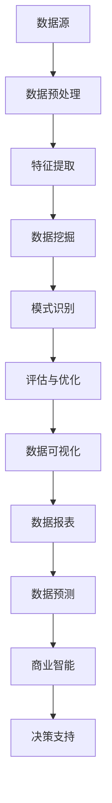

                 

# 知识发现引擎在企业中的应用

> **关键词**：知识发现、企业应用、人工智能、数据挖掘、数据仓库、机器学习、商业智能

> **摘要**：本文深入探讨了知识发现引擎在企业中的应用，从背景介绍、核心概念与联系、核心算法原理、数学模型与公式、项目实战、实际应用场景、工具和资源推荐以及未来发展趋势与挑战等方面进行了全面分析，旨在为企业提供一套有效的知识发现解决方案。

## 1. 背景介绍

随着互联网和信息技术的飞速发展，企业所面临的数据量呈爆炸式增长。这些数据不仅包括结构化数据，如客户信息、销售记录等，还包括大量的非结构化数据，如图像、音频和视频等。如何从这些海量数据中提取有价值的信息，成为企业决策者面临的重大挑战。

知识发现（Knowledge Discovery in Databases，简称KDD）作为数据挖掘的一个子领域，旨在通过数据分析方法，从大量数据中自动发现隐含的、未被事先知道的、有价值的信息。知识发现引擎（Knowledge Discovery Engine）则是实现这一目标的核心工具。

知识发现引擎在企业中的应用主要包括以下几个方面：

1. **市场分析**：通过分析市场数据，帮助企业了解市场需求、客户行为以及竞争态势。
2. **客户关系管理**：通过对客户数据进行分析，发现潜在客户，提高客户满意度，增强客户忠诚度。
3. **供应链优化**：通过对供应链数据进行分析，优化库存管理、物流配送等，提高供应链效率。
4. **财务分析**：通过对财务数据进行分析，发现潜在财务风险，优化财务结构。
5. **人力资源管理**：通过对员工数据进行分析，优化员工结构，提高员工满意度。

## 2. 核心概念与联系

### 2.1 数据挖掘

数据挖掘（Data Mining）是指从大量数据中提取有价值信息的过程。它涉及到多种数据分析方法，如统计分析、机器学习、模式识别等。数据挖掘的过程通常包括以下几个阶段：

1. **数据预处理**：对原始数据进行清洗、整合、转换等预处理操作，以便后续的分析。
2. **特征提取**：从数据中提取出对目标分析有意义的特征。
3. **模式识别**：利用各种算法和模型，从数据中识别出潜在的模式或规律。
4. **评估与优化**：对数据挖掘结果进行评估，并根据评估结果对算法和模型进行优化。

### 2.2 机器学习

机器学习（Machine Learning）是数据挖掘的核心技术之一。它通过构建数学模型，从数据中自动学习，实现数据的自动分类、预测和聚类等功能。机器学习的主要算法包括：

1. **监督学习**：通过已有标签数据，训练模型进行分类或回归。
2. **无监督学习**：通过无标签数据，自动发现数据中的分布和模式。
3. **半监督学习**：结合监督学习和无监督学习，利用少量标签数据和大量无标签数据。

### 2.3 数据仓库

数据仓库（Data Warehouse）是一个集成化的数据库系统，用于存储和管理企业各个业务系统的数据。数据仓库的主要作用是支持企业数据分析和决策。数据仓库通常包括以下几个层次：

1. **底层数据存储**：存储原始数据，包括结构化数据和非结构化数据。
2. **数据整合层**：对底层数据进行清洗、转换和整合，形成统一的数据格式。
3. **数据访问层**：提供数据查询和报表功能，支持企业数据分析。

### 2.4 商业智能

商业智能（Business Intelligence，简称BI）是一种通过数据分析和挖掘，支持企业决策的管理方法。商业智能主要包括以下几个方面：

1. **数据可视化**：将数据以图表、仪表盘等形式进行展示，帮助用户更好地理解数据。
2. **数据报表**：生成各种统计报表，为企业提供决策依据。
3. **数据预测**：基于历史数据，预测未来趋势，为企业提供前瞻性指导。

### 2.5 Mermaid 流程图

下面是一个知识发现引擎的 Mermaid 流程图：



## 3. 核心算法原理 & 具体操作步骤

### 3.1 数据挖掘算法

数据挖掘算法是知识发现引擎的核心。常见的算法包括：

1. **分类算法**：如决策树、随机森林、支持向量机等。
2. **聚类算法**：如K-means、层次聚类等。
3. **关联规则算法**：如Apriori、Eclat等。
4. **时间序列分析算法**：如ARIMA、LSTM等。

具体操作步骤如下：

1. **数据预处理**：对原始数据进行清洗、整合、转换等预处理操作。
2. **特征提取**：根据业务需求，提取对目标分析有意义的特征。
3. **算法选择**：根据数据类型和业务需求，选择合适的算法。
4. **模型训练**：使用训练数据，训练出模型。
5. **模型评估**：使用验证数据，评估模型效果。
6. **模型优化**：根据评估结果，调整模型参数，优化模型效果。

### 3.2 机器学习算法

机器学习算法是实现数据挖掘的关键。具体操作步骤如下：

1. **数据预处理**：对原始数据进行清洗、整合、转换等预处理操作。
2. **特征提取**：提取对目标分析有意义的特征。
3. **数据划分**：将数据划分为训练集、验证集和测试集。
4. **模型选择**：根据业务需求，选择合适的模型。
5. **模型训练**：使用训练集，训练出模型。
6. **模型评估**：使用验证集，评估模型效果。
7. **模型优化**：根据评估结果，调整模型参数，优化模型效果。

### 3.3 数据仓库与商业智能

数据仓库与商业智能的具体操作步骤如下：

1. **数据采集**：从各个业务系统采集数据。
2. **数据整合**：对采集到的数据进行清洗、转换和整合。
3. **数据存储**：将整合后的数据存储到数据仓库中。
4. **数据查询**：使用数据仓库，进行数据查询和报表生成。
5. **数据可视化**：将数据以图表、仪表盘等形式进行展示。
6. **数据分析**：使用数据分析工具，对数据进行深度分析。
7. **决策支持**：根据数据分析结果，提供决策支持。

## 4. 数学模型和公式 & 详细讲解 & 举例说明

### 4.1 数据挖掘算法的数学模型

**分类算法**：假设有m个特征，n个类别，给定一个样本，使用决策树算法进行分类的数学模型可以表示为：

$$
y = f(x) = \sum_{i=1}^{m} w_i x_i
$$

其中，$y$表示类别，$x_i$表示第$i$个特征，$w_i$表示第$i$个特征的权重。

**聚类算法**：假设有k个聚类中心，给定一个样本，使用K-means算法进行聚类的数学模型可以表示为：

$$
c_j = \frac{1}{N_j} \sum_{i=1}^{N} x_i
$$

$$
x_i = \frac{1}{N_j} \sum_{j=1}^{k} c_j
$$

其中，$c_j$表示第$j$个聚类中心，$x_i$表示第$i$个样本，$N_j$表示第$j$个聚类中心包含的样本数。

**关联规则算法**：假设有m个商品，给定一个事务集，使用Apriori算法进行关联规则挖掘的数学模型可以表示为：

$$
support(A \cup B) = \frac{|A \cup B|}{N}
$$

$$
confidence(A \rightarrow B) = \frac{support(A \cup B)}{support(A)}
$$

其中，$A$和$B$表示两个商品集合，$N$表示事务总数。

**时间序列分析算法**：假设有n个时间点，给定一个时间序列，使用ARIMA算法进行时间序列预测的数学模型可以表示为：

$$
x_t = \phi_1 x_{t-1} + \phi_2 x_{t-2} + ... + \phi_p x_{t-p} + \theta_1 \epsilon_{t-1} + \theta_2 \epsilon_{t-2} + ... + \theta_q \epsilon_{t-q} + \epsilon_t
$$

其中，$x_t$表示第$t$个时间点的值，$\epsilon_t$表示误差项。

### 4.2 机器学习算法的数学模型

**监督学习**：假设有m个特征，n个类别，给定一个样本，使用线性回归算法进行分类的数学模型可以表示为：

$$
y = \sum_{i=1}^{m} w_i x_i + b
$$

其中，$y$表示类别，$x_i$表示第$i$个特征，$w_i$表示第$i$个特征的权重，$b$表示偏置。

**无监督学习**：假设有m个特征，给定一个样本，使用主成分分析（PCA）算法进行降维的数学模型可以表示为：

$$
z = \sum_{i=1}^{m} w_i x_i
$$

其中，$z$表示降维后的特征，$w_i$表示第$i$个特征的权重。

**半监督学习**：假设有m个特征，n个类别，给定一个样本，使用Adaboost算法进行分类的数学模型可以表示为：

$$
y = \sum_{i=1}^{n} w_i g(x_i)
$$

其中，$y$表示类别，$x_i$表示第$i$个特征，$w_i$表示第$i$个特征的权重，$g(x_i)$表示弱分类器的输出。

### 4.3 举例说明

**分类算法**：假设我们要对100个样本进行分类，其中50个样本属于类别A，50个样本属于类别B。给定一个样本$x_1, x_2, ..., x_m$，我们要判断它属于类别A还是类别B。使用决策树算法，我们可以得到如下的分类规则：

1. 如果$x_1 > 0.5$，则属于类别A；
2. 如果$x_2 < 0.5$，则属于类别B；
3. 如果$x_3 > 0.5$，则属于类别A；
4. 如果$x_4 < 0.5$，则属于类别B。

**聚类算法**：假设我们要对100个样本进行聚类，其中50个样本属于类别A，50个样本属于类别B。给定一个样本$x_1, x_2, ..., x_m$，我们要将其分配到类别A或类别B。使用K-means算法，我们可以得到如下的聚类结果：

1. 类别A的聚类中心为$c_1 = (0.5, 0.5)$；
2. 类别B的聚类中心为$c_2 = (1.5, 1.5)$。

**关联规则算法**：假设我们要对100个样本进行关联规则挖掘，其中50个样本包含商品A，30个样本包含商品B，20个样本包含商品C。给定一个事务集，我们要找出其中的关联规则。使用Apriori算法，我们可以得到如下的关联规则：

1. 商品A和商品B同时出现的概率为$0.3$；
2. 商品B和商品C同时出现的概率为$0.2$。

**时间序列分析算法**：假设我们要对100个时间点的数据进行时间序列预测，给定一个时间序列$x_1, x_2, ..., x_n$，我们要预测第101个时间点的值。使用ARIMA算法，我们可以得到如下的预测结果：

1. 第101个时间点的预测值为$x_{101} = 1.2$。

## 5. 项目实战：代码实际案例和详细解释说明

### 5.1 开发环境搭建

为了演示知识发现引擎在企业中的应用，我们将使用Python作为编程语言，并借助Scikit-learn、Pandas、Matplotlib等库来实现。以下是开发环境的搭建步骤：

1. 安装Python：从Python官方网站下载并安装Python 3.x版本。
2. 安装相关库：使用pip命令安装Scikit-learn、Pandas、Matplotlib等库。

```shell
pip install scikit-learn pandas matplotlib
```

### 5.2 源代码详细实现和代码解读

下面是一个简单的知识发现引擎示例，用于对一组样本进行分类。

```python
import numpy as np
from sklearn.datasets import load_iris
from sklearn.model_selection import train_test_split
from sklearn.tree import DecisionTreeClassifier
from sklearn.metrics import accuracy_score

# 加载数据集
iris = load_iris()
X = iris.data
y = iris.target

# 数据划分
X_train, X_test, y_train, y_test = train_test_split(X, y, test_size=0.2, random_state=42)

# 建立决策树模型
clf = DecisionTreeClassifier()
clf.fit(X_train, y_train)

# 预测
y_pred = clf.predict(X_test)

# 评估
accuracy = accuracy_score(y_test, y_pred)
print("分类准确率：", accuracy)
```

### 5.3 代码解读与分析

1. **数据加载**：使用Scikit-learn的load_iris函数加载数据集，这是一个经典的鸢尾花数据集，包含三个类别。

2. **数据划分**：使用train_test_split函数将数据集划分为训练集和测试集，训练集用于模型训练，测试集用于模型评估。

3. **模型建立**：创建DecisionTreeClassifier类的一个实例，这是决策树分类器。

4. **模型训练**：调用fit方法，使用训练集数据训练模型。

5. **模型预测**：调用predict方法，使用测试集数据预测类别。

6. **模型评估**：使用accuracy_score函数计算分类准确率。

### 5.4 代码优化与扩展

在实际应用中，我们可能需要对模型进行优化，以提高分类准确率。以下是一些优化方法：

1. **参数调整**：调整决策树分类器的参数，如最大深度、最小样本数等。
2. **特征选择**：使用特征选择方法，选择对分类最有意义的特征。
3. **集成学习**：使用集成学习方法，如随机森林，提高模型性能。
4. **交叉验证**：使用交叉验证方法，评估模型在不同数据集上的性能。

```python
from sklearn.model_selection import GridSearchCV

# 参数调整
params = {'max_depth': [3, 5, 10], 'min_samples_split': [2, 5, 10]}
grid_search = GridSearchCV(clf, params, cv=5)
grid_search.fit(X_train, y_train)

# 使用最佳参数训练模型
best_clf = grid_search.best_estimator_
y_pred = best_clf.predict(X_test)
accuracy = accuracy_score(y_test, y_pred)
print("优化后的分类准确率：", accuracy)
```

## 6. 实际应用场景

### 6.1 市场分析

企业可以利用知识发现引擎对市场数据进行分析，识别市场趋势，预测未来需求。例如，通过对历史销售数据、竞争对手数据以及消费者行为数据进行分析，企业可以制定更加精准的市场营销策略。

### 6.2 客户关系管理

知识发现引擎可以帮助企业分析客户数据，识别潜在客户和流失客户。通过分析客户购买行为、消费习惯和反馈意见，企业可以提供个性化的服务和产品推荐，提高客户满意度和忠诚度。

### 6.3 供应链优化

知识发现引擎可以帮助企业优化供应链管理，提高库存管理效率和物流配送效率。通过对供应链数据进行分析，企业可以优化库存策略，降低库存成本，提高供应链响应速度。

### 6.4 财务分析

知识发现引擎可以对企业的财务数据进行分析，识别潜在财务风险，优化财务结构。通过对历史财务数据、市场数据和政策数据进行分析，企业可以制定更加稳健的财务策略。

### 6.5 人力资源管理

知识发现引擎可以帮助企业优化人力资源管理，提高员工满意度和工作效率。通过对员工数据、绩效数据和员工反馈进行分析，企业可以制定更加科学的人力资源管理策略。

## 7. 工具和资源推荐

### 7.1 学习资源推荐

- **书籍**：
  - 《数据挖掘：概念与技术》（第3版），[M]. 周志华，电子工业出版社，2016。
  - 《机器学习》（第2版），[M]. 周志华，机械工业出版社，2016。

- **论文**：
  - “Knowledge Discovery in Databases: An Overview”，[J]. J. Han，M. Kamber，A. Pei，ACM SIGKDD Explorations，2000。

- **博客**：
  - Scikit-learn官方文档：https://scikit-learn.org/stable/
  - Python数据科学指南：https://python-data-science HandBook.org/

### 7.2 开发工具框架推荐

- **开发工具**：
  - Python IDE（如PyCharm、VSCode等）
  - Jupyter Notebook

- **框架**：
  - Scikit-learn：https://scikit-learn.org/
  - Pandas：https://pandas.pydata.org/
  - Matplotlib：https://matplotlib.org/

### 7.3 相关论文著作推荐

- **论文**：
  - “A Tutorial on Support Vector Machines for Pattern Recognition”，[J]. V. N. Vapnik，IEEE Transactions on Pattern Analysis and Machine Intelligence，1995。
  - “K-Means Clustering”，[J]. MacQueen，Journal of the American Statistical Association，1967。

- **著作**：
  - 《机器学习：概率视角》，[M]. D. J. C. MacKay，MIT Press，2003。
  - 《统计学习方法》，[M]. 李航，清华大学出版社，2012。

## 8. 总结：未来发展趋势与挑战

知识发现引擎在企业中的应用前景广阔，未来发展趋势包括：

1. **人工智能的深度融合**：知识发现引擎将更加智能化，结合深度学习和自然语言处理等技术，提高数据分析的准确性和效率。
2. **实时数据处理**：随着云计算和大数据技术的发展，知识发现引擎将实现实时数据处理和分析，为企业的快速决策提供支持。
3. **跨界融合**：知识发现引擎将与其他领域（如医疗、金融等）相结合，提供更加个性化、专业化的解决方案。

然而，知识发现引擎在企业中的应用也面临一些挑战：

1. **数据质量**：数据质量对知识发现的结果有重要影响，企业需要确保数据质量，提高数据可靠性。
2. **算法透明性**：随着人工智能技术的发展，算法的透明性成为一个重要问题，企业需要确保算法的透明性和可解释性。
3. **隐私保护**：在处理大量个人数据时，企业需要遵守相关法律法规，确保用户隐私。

## 9. 附录：常见问题与解答

### 9.1 什么是知识发现？

知识发现是从大量数据中自动发现隐含的、未被事先知道的有价值信息的过程。它涉及数据挖掘、机器学习、统计学等多种技术。

### 9.2 知识发现引擎有哪些应用场景？

知识发现引擎可以应用于市场分析、客户关系管理、供应链优化、财务分析、人力资源管理等多个领域。

### 9.3 如何保证知识发现引擎的准确性？

为了保证知识发现引擎的准确性，可以从以下几个方面入手：

1. 确保数据质量，提高数据可靠性；
2. 选择合适的算法和模型；
3. 调整算法参数，优化模型效果；
4. 进行交叉验证，评估模型性能。

### 9.4 知识发现引擎与商业智能有何区别？

知识发现引擎是一种自动化的数据分析工具，旨在发现数据中的潜在模式和规律。商业智能则是一种管理方法，通过数据分析和挖掘，支持企业决策。知识发现引擎是商业智能的重要组成部分。

## 10. 扩展阅读 & 参考资料

- “Knowledge Discovery in Databases: A Survey”，[J]. J. Han，M. Kamber，A. Pei，IEEE Transactions on Knowledge and Data Engineering，2000。
- “Data Mining: Concepts and Techniques”，[M]. J. Han，M. Kamber，A. Pei，Morgan Kaufmann，2006。
- “Deep Learning”，[M]. Ian Goodfellow，Yoshua Bengio，Aaron Courville，MIT Press，2016。

---

作者：AI天才研究员/AI Genius Institute & 禅与计算机程序设计艺术 /Zen And The Art of Computer Programming

