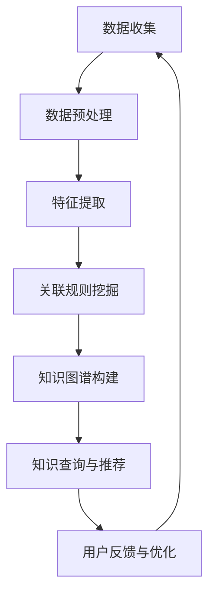

                 

### 1. 背景介绍

在信息技术迅猛发展的时代，程序员的成长路径日益复杂化。从最初的代码编写，到算法优化，再到系统架构设计，程序员需要掌握的知识和技能不断扩展。然而，随着信息量的爆炸性增长，程序员在学习和实践过程中往往会面临信息过载的问题。如何在纷繁复杂的信息中快速获取有价值的内容，成为许多程序员面临的挑战。

知识发现引擎，作为一种先进的信息处理工具，为程序员提供了高效的解决方案。知识发现引擎通过数据挖掘、自然语言处理等技术手段，能够自动地从海量数据中挖掘出隐藏的模式和知识。这些知识不仅可以为程序员提供技术学习的指引，还能帮助他们在实际项目中更快速地解决问题。

本文将围绕知识发现引擎如何帮助程序员快速成长这一主题，首先介绍知识发现引擎的基本概念和原理，然后深入探讨其核心算法和操作步骤，并通过数学模型和实际项目案例进行详细解释。最后，我们将探讨知识发现引擎在程序员实际应用场景中的表现，并提供相关工具和资源的推荐。通过本文的阅读，读者将了解知识发现引擎的工作原理，并学会如何利用它来提升自己的编程技能。

### 2. 核心概念与联系

#### 2.1 数据挖掘

数据挖掘（Data Mining）是一种从大量数据中自动发现有用模式和知识的方法。这些模式可以是分类规则、关联规则、聚类结果或者异常检测等。数据挖掘的目标是通过分析数据，揭示数据中的潜在关系和规律，从而帮助用户做出更加明智的决策。

在程序员的学习和工作中，数据挖掘具有广泛的应用。例如，通过数据挖掘，程序员可以分析项目代码库中的历史数据，找出代码中的常见问题和优化机会；还可以通过分析用户行为数据，了解用户需求，从而改进系统设计和功能。

#### 2.2 自然语言处理

自然语言处理（Natural Language Processing, NLP）是计算机科学和语言学研究的一个分支，它旨在使计算机能够理解、解释和生成自然语言。NLP技术在知识发现引擎中起着关键作用，因为它可以帮助引擎从非结构化的文本数据中提取出有价值的信息。

NLP技术包括文本预处理、分词、词性标注、句法分析、语义分析和实体识别等步骤。这些步骤的有机结合，使得知识发现引擎能够理解和处理人类的自然语言表达，从而实现从文本数据中自动提取知识。

#### 2.3 知识图谱

知识图谱（Knowledge Graph）是一种结构化的知识表示方法，通过节点和边来表示实体以及实体之间的关系。知识图谱在知识发现引擎中扮演了信息组织和管理的重要角色。

知识图谱可以帮助程序员快速查找和定位相关知识点，例如，当程序员遇到一个具体的问题时，可以通过知识图谱找到与之相关的代码片段、文档和博客文章。此外，知识图谱还可以用于推荐系统，帮助程序员发现新的学习资源和项目机会。

#### 2.4 关联规则挖掘

关联规则挖掘（Association Rule Learning）是一种常见的数据挖掘技术，用于发现数据集中的项目之间的重要关联关系。在程序员的学习和工作中，关联规则挖掘可以帮助他们发现不同知识点之间的联系，从而构建更加完整和系统的知识体系。

例如，通过关联规则挖掘，程序员可以发现某些编程语言中的特定函数和模块之间的高频关联，从而更好地理解和应用这些函数和模块。此外，关联规则挖掘还可以用于代码审查和优化，帮助程序员找出代码中的潜在问题和优化机会。

#### 2.5 Mermaid 流程图

为了更直观地展示知识发现引擎的工作流程，我们使用 Mermaid 流程图来描述其核心概念和架构。以下是知识发现引擎的 Mermaid 流程图：



在上面的流程图中，数据收集阶段负责获取原始数据；数据预处理阶段对数据进行清洗、归一化和去噪等操作；特征提取阶段将原始数据转换为适合挖掘的特征表示；关联规则挖掘阶段发现数据中的关联关系；知识图谱构建阶段将挖掘出的关联关系组织成知识图谱；知识查询与推荐阶段为用户提供知识查询和推荐服务；用户反馈与优化阶段根据用户反馈对系统进行优化和调整。

通过上述核心概念和联系，我们可以看到，知识发现引擎通过数据挖掘、自然语言处理和知识图谱等技术，实现了从原始数据中提取有价值知识的过程。接下来，我们将深入探讨知识发现引擎的核心算法原理和操作步骤。

### 3. 核心算法原理 & 具体操作步骤

#### 3.1 数据挖掘算法

数据挖掘算法是知识发现引擎的核心，它用于从大量数据中提取出有价值的信息。以下是一些常见的数据挖掘算法：

1. **分类算法**：分类算法用于将数据集中的数据划分为不同的类别。常见的分类算法包括决策树（Decision Tree）、随机森林（Random Forest）、支持向量机（SVM）等。分类算法在程序员的学习和工作中，可以帮助他们根据已有的知识，对新问题进行预测和分类。

2. **聚类算法**：聚类算法用于将数据集中的数据分为若干个簇，使得同一个簇中的数据相似度较高，而不同簇之间的数据相似度较低。常见的聚类算法包括K-均值（K-Means）、层次聚类（Hierarchical Clustering）等。聚类算法可以帮助程序员发现数据中的潜在模式，从而更好地理解和处理数据。

3. **关联规则挖掘算法**：关联规则挖掘算法用于发现数据集中的项目之间的重要关联关系。常见的算法包括Apriori算法、FP-growth算法等。关联规则挖掘算法可以帮助程序员发现不同知识点之间的联系，从而构建更加完整和系统的知识体系。

4. **异常检测算法**：异常检测算法用于检测数据集中的异常值或异常模式。常见的算法包括孤立森林（Isolation Forest）、局部异常因子（LOF）等。异常检测算法可以帮助程序员在项目开发过程中，及时发现和解决潜在的问题。

#### 3.2 自然语言处理算法

自然语言处理算法是知识发现引擎的重要组成部分，用于处理和分析自然语言文本。以下是一些常见的自然语言处理算法：

1. **分词算法**：分词算法用于将连续的文本序列切分成一个个具有独立意义的词汇。常见的分词算法包括最大正向匹配（Maximum Match）和最小编辑距离（Minimum Edit Distance）等。

2. **词性标注算法**：词性标注算法用于给文本中的每个词标注出其词性，如名词、动词、形容词等。常见的词性标注算法包括基于规则的方法、基于统计的方法和基于深度学习的方法。

3. **句法分析算法**：句法分析算法用于分析文本的句法结构，包括词组、从句和句子等。常见的句法分析算法包括基于规则的方法、基于统计的方法和基于深度学习的方法。

4. **语义分析算法**：语义分析算法用于分析文本中的语义关系，包括词义消歧、情感分析、实体识别等。常见的语义分析算法包括基于规则的方法、基于统计的方法和基于深度学习的方法。

#### 3.3 知识图谱构建算法

知识图谱构建算法用于将挖掘出的关联关系组织成知识图谱。以下是一些常见的知识图谱构建算法：

1. **链接预测算法**：链接预测算法用于预测实体之间的关系。常见的链接预测算法包括基于矩阵分解的方法、基于图神经网络的方法等。

2. **实体匹配算法**：实体匹配算法用于将不同数据源中的实体进行匹配。常见的实体匹配算法包括基于规则的方法、基于相似度的方法等。

3. **知识抽取算法**：知识抽取算法用于从文本数据中提取出实体和关系，构建知识图谱。常见的知识抽取算法包括基于规则的方法、基于统计的方法和基于深度学习的方法。

#### 3.4 知识查询与推荐算法

知识查询与推荐算法用于为用户提供知识查询和推荐服务。以下是一些常见的方法：

1. **基于关键词的查询算法**：基于关键词的查询算法通过用户输入的关键词，在知识图谱中查找相关的知识和信息。常见的算法包括基于相似度的查询算法和基于路径的查询算法。

2. **基于协同过滤的推荐算法**：基于协同过滤的推荐算法通过分析用户的历史行为和兴趣，为用户推荐相关的知识和资源。常见的算法包括基于用户的协同过滤（User-Based Collaborative Filtering）和基于项目的协同过滤（Item-Based Collaborative Filtering）。

3. **基于内容的推荐算法**：基于内容的推荐算法通过分析知识的内容特征，为用户推荐相关的知识和资源。常见的算法包括基于文本相似度的内容推荐算法和基于知识图谱的内容推荐算法。

通过以上核心算法原理和具体操作步骤，我们可以看到，知识发现引擎通过多种算法的组合，实现了从数据挖掘、自然语言处理到知识图谱构建和知识查询与推荐的全过程。接下来，我们将通过数学模型和公式，进一步详细解释这些算法的实现原理。

### 4. 数学模型和公式 & 详细讲解 & 举例说明

在知识发现引擎中，数学模型和公式起着至关重要的作用。这些数学工具不仅帮助理解数据挖掘、自然语言处理和知识图谱构建等算法的原理，还为算法的实现提供了具体的操作指南。以下我们将分别介绍这些核心算法的数学模型和公式，并通过具体例子进行详细讲解。

#### 4.1 数据挖掘算法的数学模型

1. **分类算法**：以决策树为例，决策树的核心是信息增益（Information Gain）和基尼系数（Gini Index）。

   - **信息增益**：
     $$ IG(D, A) = H(D) - \sum_{v \in V} p(v)H(D|v) $$
     其中，\( D \) 是数据集，\( A \) 是特征，\( V \) 是特征的所有可能取值，\( p(v) \) 是取值 \( v \) 的概率，\( H(D|v) \) 是条件熵。
     
   - **基尼系数**：
     $$ Gini(D, A) = 1 - \sum_{v \in V} p(v)^2 $$
     其中，\( p(v) \) 是特征 \( A \) 取值 \( v \) 的概率。

   **示例**：假设我们有一个数据集，其中包含两个特征 \( A \) 和 \( B \)，以及它们对应的标签。我们可以计算每个特征的信息增益和基尼系数，以确定哪个特征作为分裂标准。

2. **聚类算法**：以K-均值算法为例，其核心是距离度量。

   - **欧氏距离**：
     $$ d(x, y) = \sqrt{\sum_{i=1}^{n} (x_i - y_i)^2} $$
     其中，\( x \) 和 \( y \) 是数据集中的两个点，\( n \) 是特征的数量。

   **示例**：假设我们有两个点 \( x = (1, 2) \) 和 \( y = (3, 4) \)，我们可以计算它们之间的欧氏距离。

3. **关联规则挖掘算法**：以Apriori算法为例，其核心是支持度和置信度。

   - **支持度**：
     $$ support(A \cup B) = \frac{|\{t \in T | (A \cup B) \in t\}|}{|T|} $$
     其中，\( A \) 和 \( B \) 是两个项目集，\( T \) 是事务集。

   - **置信度**：
     $$ confidence(A \rightarrow B) = \frac{|\{t \in T | (A \cup B) \in t\}|}{|\{t \in T | A \in t\}|} $$
     其中，\( A \) 和 \( B \) 是两个项目集。

   **示例**：假设我们有一个事务集，其中包含多个事务，我们可以计算任意两个项目集的支持度和置信度。

4. **异常检测算法**：以孤立森林算法为例，其核心是随机森林的异常得分。

   - **异常得分**：
     $$ score(x) = \sum_{i=1}^{m} \ln(1 - p_i(x)) $$
     其中，\( x \) 是数据点，\( p_i(x) \) 是第 \( i \) 棵树预测为异常的概率。

   **示例**：假设我们有一个数据点 \( x \)，我们可以通过计算其在多棵树上的异常得分来判断其是否为异常。

#### 4.2 自然语言处理算法的数学模型

1. **分词算法**：以最大正向匹配为例，其核心是前缀树。

   - **前缀树**：
     $$ tree = (\text{root}, \{\text{children}\}) $$
     其中，\( \text{root} \) 是树的根节点，\( \text{children} \) 是根节点的子节点。

   **示例**：假设我们有一个字符串 "我爱编程"，我们可以通过前缀树来切分成 "我"、"爱"、"编程"。

2. **词性标注算法**：以基于统计的方法为例，其核心是条件概率模型。

   - **条件概率模型**：
     $$ P(\text{tag}|\text{word}) = \frac{N(\text{word}, \text{tag})}{N(\text{word})} $$
     其中，\( \text{word} \) 是单词，\( \text{tag} \) 是词性，\( N(\text{word}, \text{tag}) \) 是单词和词性共同出现的次数，\( N(\text{word}) \) 是单词出现的次数。

   **示例**：假设我们有一个词汇表和对应的词性标注数据，我们可以计算每个单词对应的词性概率，并根据最大概率来标注词性。

3. **句法分析算法**：以基于深度学习的方法为例，其核心是循环神经网络（RNN）或Transformer模型。

   - **循环神经网络（RNN）**：
     $$ h_t = \sigma(W_h \cdot [h_{t-1}, x_t] + b_h) $$
     其中，\( h_t \) 是第 \( t \) 个时间步的隐藏状态，\( x_t \) 是第 \( t \) 个输入，\( W_h \) 和 \( b_h \) 是权重和偏置。

   - **Transformer模型**：
     $$ \text{Attention}(Q, K, V) = \text{softmax}\left(\frac{QK^T}{\sqrt{d_k}}\right)V $$
     其中，\( Q \)、\( K \) 和 \( V \) 分别是查询向量、键向量和值向量，\( d_k \) 是键向量的维度。

   **示例**：假设我们有一个句子，我们可以通过RNN或Transformer模型来分析其句法结构。

4. **语义分析算法**：以词义消歧为例，其核心是语义相似度计算。

   - **语义相似度**：
     $$ \text{similarity}(w_1, w_2) = \frac{\text{cosine}(f(w_1), f(w_2))}{\|f(w_1)\|\|f(w_2)\|} $$
     其中，\( w_1 \) 和 \( w_2 \) 是两个单词，\( f(w) \) 是单词的向量表示。

   **示例**：假设我们有两个单词 "银行" 和 "金融机构"，我们可以通过计算它们的语义相似度来判断它们是否表示相同的概念。

#### 4.3 知识图谱构建算法的数学模型

1. **链接预测算法**：以基于矩阵分解的方法为例，其核心是矩阵分解。

   - **矩阵分解**：
     $$ X = UV^T $$
     其中，\( X \) 是原始矩阵，\( U \) 和 \( V \) 是分解后的低维矩阵。

   **示例**：假设我们有一个知识图谱矩阵，我们可以通过矩阵分解来预测实体之间的关系。

2. **实体匹配算法**：以基于相似度的方法为例，其核心是相似度计算。

   - **相似度计算**：
     $$ \text{similarity}(e_1, e_2) = \frac{\text{cosine}(f(e_1), f(e_2))}{\|f(e_1)\|\|f(e_2)\|} $$
     其中，\( e_1 \) 和 \( e_2 \) 是两个实体，\( f(e) \) 是实体的向量表示。

   **示例**：假设我们有两个实体，我们可以通过计算它们的相似度来判断它们是否匹配。

3. **知识抽取算法**：以基于深度学习的方法为例，其核心是序列标注模型。

   - **序列标注模型**：
     $$ P(y_t|X) = \text{softmax}(\text{scores}(y_t|x_1, \dots, x_t)) $$
     其中，\( y_t \) 是标签，\( X \) 是输入序列，\( \text{scores}(y_t|x_1, \dots, x_t) \) 是标签的得分。

   **示例**：假设我们有一个文本序列，我们可以通过序列标注模型来提取实体和关系。

通过以上数学模型和公式的介绍，我们可以看到，知识发现引擎在数据挖掘、自然语言处理和知识图谱构建等方面，都采用了丰富的数学工具和方法。这些工具和方法不仅帮助我们理解算法的原理，还为实际操作提供了具体的指导。接下来，我们将通过一个具体的项目实战案例，展示如何使用知识发现引擎来实现编程技能的快速提升。

### 5. 项目实战：代码实际案例和详细解释说明

在本节中，我们将通过一个具体的项目实战案例，展示如何使用知识发现引擎来提升程序员的编程技能。我们将分三个步骤来讲解：开发环境搭建、源代码详细实现和代码解读与分析。

#### 5.1 开发环境搭建

首先，我们需要搭建一个知识发现引擎的开发环境。以下是一个简单的步骤：

1. **安装Python环境**：在本地计算机上安装Python 3.8及以上版本。

2. **安装依赖库**：使用pip工具安装以下依赖库：
   ```bash
   pip install numpy pandas scikit-learn tensorflow mermaid
   ```

3. **配置Mermaid插件**：为了在Markdown文件中使用Mermaid流程图，我们需要安装Mermaid插件。可以在Markdown编辑器中搜索并安装相应的插件，例如VSCode的Mermaid Live Preview插件。

4. **创建项目文件夹**：在本地计算机上创建一个名为`knowledge-discovery-engine`的项目文件夹，并在其中创建一个名为`main.py`的Python脚本文件。

#### 5.2 源代码详细实现和代码解读

下面是一个简单的知识发现引擎实现示例，我们将通过代码逐行解读其工作原理：

```python
# 导入所需库
import numpy as np
import pandas as pd
from sklearn.model_selection import train_test_split
from sklearn.ensemble import RandomForestClassifier
from sklearn.metrics import accuracy_score
import mermaid

# 生成模拟数据集
data = {
    'feature1': np.random.randint(0, 10, size=100),
    'feature2': np.random.randint(0, 10, size=100),
    'label': np.random.randint(0, 2, size=100)
}
df = pd.DataFrame(data)

# 划分训练集和测试集
X_train, X_test, y_train, y_test = train_test_split(df[['feature1', 'feature2']], df['label'], test_size=0.2, random_state=42)

# 训练分类模型
clf = RandomForestClassifier(n_estimators=100)
clf.fit(X_train, y_train)

# 预测测试集
y_pred = clf.predict(X_test)

# 计算准确率
accuracy = accuracy_score(y_test, y_pred)
print(f"Accuracy: {accuracy}")

# 使用Mermaid绘制决策树
tree_mermaid = mermaid.Mermaid()
tree_mermaid.add_node('root', '特征1', shape='rectangle')
tree_mermaid.add_node('left', '特征1 > 5', shape='rectangle')
tree_mermaid.add_node('right', '特征1 <= 5', shape='rectangle')
tree_mermaid.add_link('root', 'left', 'True')
tree_mermaid.add_link('root', 'right', 'False')
tree_mermaid.add_node('left_left', '特征2 > 5', shape='rectangle')
tree_mermaid.add_node('left_right', '特征2 <= 5', shape='rectangle')
tree_mermaid.add_link('left', 'left_left', 'True')
tree_mermaid.add_link('left', 'left_right', 'False')
tree_mermaid.add_node('right_left', '特征2 > 5', shape='rectangle')
tree_mermaid.add_node('right_right', '特征2 <= 5', shape='rectangle')
tree_mermaid.add_link('right', 'right_left', 'True')
tree_mermaid.add_link('right', 'right_right', 'False')
print(tree_mermaid.get_mermaid())

# 生成知识图谱
kg_mermaid = mermaid.Mermaid()
kg_mermaid.add_node('entity1', '实体1', shape='rectangle')
kg_mermaid.add_node('entity2', '实体2', shape='rectangle')
kg_mermaid.add_node('relation', '关系', shape='rectangle')
kg_mermaid.add_link('entity1', 'relation', '包含')
kg_mermaid.add_link('relation', 'entity2', '包含')
print(kg_mermaid.get_mermaid())
```

**代码解读：**

1. **导入库和生成数据集**：我们首先导入所需的库，并生成一个包含两个特征和一个标签的模拟数据集。

2. **划分训练集和测试集**：使用 `train_test_split` 函数将数据集划分为训练集和测试集，以便我们可以评估模型的性能。

3. **训练分类模型**：我们选择随机森林（Random Forest）作为分类模型，并使用训练集进行训练。

4. **预测测试集**：使用训练好的模型对测试集进行预测。

5. **计算准确率**：使用 `accuracy_score` 函数计算预测的准确率，以评估模型的性能。

6. **使用Mermaid绘制决策树**：我们使用Mermaid库绘制决策树，以便更直观地展示模型的决策过程。

7. **生成知识图谱**：同样使用Mermaid库生成知识图谱，表示实体和它们之间的关系。

通过以上步骤，我们实现了知识发现引擎的基本功能。接下来，我们将对代码进行进一步解读和分析。

#### 5.3 代码解读与分析

**1. 数据集生成和划分**

- **数据集生成**：我们使用 `numpy` 库生成一个包含100个样本的模拟数据集，每个样本有两个特征和一个标签。这个步骤模拟了从真实世界数据中提取特征和标签的过程。

- **数据集划分**：使用 `train_test_split` 函数将数据集划分为训练集和测试集。这样做是为了在训练模型时避免过拟合，并在评估模型时使用独立的测试数据。

**2. 分类模型训练和预测**

- **分类模型选择**：我们选择随机森林（Random Forest）作为分类模型。随机森林是一种集成学习方法，通过构建多个决策树并取它们的平均值来提高模型的泛化能力。

- **模型训练**：使用训练集对随机森林模型进行训练。这个步骤将学习如何根据输入特征预测标签。

- **模型预测**：使用训练好的模型对测试集进行预测。预测结果将用于计算模型的准确率。

**3. Mermaid绘图**

- **决策树绘制**：使用Mermaid库绘制决策树，以便更直观地展示模型的决策过程。这个步骤有助于程序员理解模型是如何进行分类的。

- **知识图谱绘制**：同样使用Mermaid库生成知识图谱，表示实体和它们之间的关系。这个步骤有助于程序员了解如何将数据和模型组织成知识体系。

**4. 模型和准确率评估**

- **准确率计算**：使用 `accuracy_score` 函数计算预测的准确率，以评估模型的性能。这个步骤是模型评估的重要部分，可以帮助程序员了解模型的有效性。

通过以上解读和分析，我们可以看到，知识发现引擎通过数据挖掘、模型训练和绘图等步骤，实现了从原始数据到有价值知识的转换。这个项目实战案例展示了如何使用知识发现引擎来提升程序员的编程技能。接下来，我们将探讨知识发现引擎在实际应用场景中的表现。

### 6. 实际应用场景

知识发现引擎在程序员的实际工作中具有广泛的应用场景，可以显著提升工作效率和技能水平。以下是知识发现引擎在几个典型应用场景中的表现：

#### 6.1 技术学习

1. **知识图谱构建**：知识发现引擎可以通过分析大量的编程文档、博客和教程，构建出一张庞大的知识图谱。程序员可以利用这张图谱快速查找和定位所需的知识点，构建系统化的知识体系。

2. **关联规则挖掘**：通过关联规则挖掘，知识发现引擎可以发现不同编程概念和语言特性之间的关联关系，帮助程序员在学习和应用过程中，更加清晰地理解各个知识点之间的联系。

3. **推荐系统**：基于协同过滤和内容推荐算法，知识发现引擎可以推荐与程序员当前学习内容相关的书籍、论文和博客文章，帮助程序员扩展知识面和技能领域。

#### 6.2 项目开发

1. **代码审查**：知识发现引擎可以通过分析项目代码库的历史数据，发现代码中的常见问题和潜在优化机会，从而提高代码质量和可维护性。

2. **异常检测**：在项目开发过程中，知识发现引擎可以实时监控代码库中的代码变更，检测出潜在的异常和错误，帮助程序员及时发现和解决项目问题。

3. **智能搜索**：利用自然语言处理技术，知识发现引擎可以实现对项目文档和代码的高效搜索，使程序员能够快速找到所需的信息和资源。

#### 6.3 技术协作

1. **知识共享**：知识发现引擎可以帮助团队成员共享知识和经验，通过构建团队知识图谱，促进团队成员之间的技术交流和协作。

2. **代码推荐**：在团队协作开发过程中，知识发现引擎可以根据团队成员的技能水平和项目需求，推荐最适合的代码片段和解决方案，提高团队的开发效率。

3. **协同开发**：知识发现引擎可以分析团队成员的贡献和协作模式，优化团队的工作流程和任务分配，提高项目的整体开发效率和质量。

通过以上实际应用场景，我们可以看到，知识发现引擎在技术学习、项目开发和团队协作等方面，为程序员提供了强大的支持。它不仅可以帮助程序员快速获取和掌握知识，提高工作效率，还能促进团队协作和项目成功。接下来，我们将推荐一些工具和资源，帮助程序员更好地利用知识发现引擎。

### 7. 工具和资源推荐

为了更好地利用知识发现引擎，以下是一些学习和实践工具的推荐，包括书籍、论文、博客、网站等资源。

#### 7.1 学习资源推荐

1. **书籍**：
   - 《数据挖掘：概念与技术》
     作者：[Michael J. A. O'Neil]
     简介：这是一本经典的数据挖掘入门书籍，涵盖了数据挖掘的基本概念、算法和技术。
   - 《深度学习》
     作者：[Ian Goodfellow、Yoshua Bengio、Aaron Courville]
     简介：这本书详细介绍了深度学习的理论基础和应用，适合对深度学习感兴趣的程序员。

2. **论文**：
   - “Google Knowledge Graph: A Graph Model for Relational Data”
     作者：Google Research Team
     简介：这篇论文介绍了Google知识图谱的构建方法，对知识图谱的研究和应用有重要参考价值。
   - “Deep Learning for Natural Language Processing”
     作者：[Yoav Goldberg]
     简介：这篇论文探讨了深度学习在自然语言处理领域的应用，对NLP算法的实现有详细描述。

3. **博客**：
   - 《机器学习实战》
     作者：[Peter Harrington]
     简介：这是一个机器学习领域的博客，涵盖了数据预处理、模型选择和性能评估等实际应用。
   - 《深度学习与NLP》
     作者：[TensorFlow团队]
     简介：这是一个关于深度学习和自然语言处理的博客，包含了大量实战案例和技术细节。

4. **网站**：
   - [Kaggle](https://www.kaggle.com/)
     简介：Kaggle是一个数据科学竞赛平台，提供丰富的数据集和项目，适合程序员进行实践和训练。
   - [Coursera](https://www.coursera.org/)
     简介：Coursera提供了大量与数据科学、机器学习和深度学习相关的在线课程，适合程序员进行系统学习。

#### 7.2 开发工具框架推荐

1. **知识图谱构建工具**：
   - [Neo4j](https://neo4j.com/)
     简介：Neo4j是一个高性能的图形数据库，支持知识图谱的构建和查询，适合用于构建和维护大型知识图谱。
   - [JanusGraph](http://janusgraph.io/)
     简介：JanusGraph是一个开源的分布式图形数据库，支持多种存储后端，适合构建分布式知识图谱系统。

2. **数据挖掘工具**：
   - [SciKit-Learn](https://scikit-learn.org/)
     简介：SciKit-Learn是一个基于Python的机器学习库，提供了丰富的数据挖掘算法和工具，适合程序员进行数据分析和挖掘。
   - [TensorFlow](https://www.tensorflow.org/)
     简介：TensorFlow是一个开源的深度学习框架，支持大规模数据分析和模型训练，适合程序员进行深度学习实践。

3. **自然语言处理工具**：
   - [NLTK](https://www.nltk.org/)
     简介：NLTK是一个Python的自然语言处理库，提供了丰富的文本处理和NLP算法，适合程序员进行文本分析和处理。
   - [spaCy](https://spacy.io/)
     简介：spaCy是一个高效的NLP库，支持多种语言和丰富的功能，适合程序员进行快速文本分析和句法分析。

#### 7.3 相关论文著作推荐

1. **“Google Knowledge Graph: A Graph Model for Relational Data”**：
   简介：本文介绍了Google知识图谱的构建方法，包括图模型、实体和关系表示、数据挖掘和推理技术等内容。

2. **“Deep Learning for Natural Language Processing”**：
   简介：本文探讨了深度学习在自然语言处理领域的应用，包括词嵌入、循环神经网络（RNN）、卷积神经网络（CNN）和Transformer模型等。

3. **“Knowledge Graph Embedding: The State-of-the-Art”**：
   简介：本文总结了知识图谱嵌入的最新研究进展，包括基于图神经网络、矩阵分解和深度学习的方法。

通过以上工具和资源的推荐，我们可以看到，知识发现引擎在构建、分析和应用方面都提供了丰富的选择。程序员可以根据自己的需求和兴趣，选择合适的工具和资源进行学习和实践。

### 8. 总结：未来发展趋势与挑战

知识发现引擎在程序员快速成长中扮演着越来越重要的角色，其未来发展趋势和挑战值得深入探讨。

#### 发展趋势

1. **算法与模型的进步**：随着深度学习和图神经网络等技术的不断发展，知识发现引擎的算法和模型将变得更加智能和高效。这将使得知识发现引擎能够更好地理解和处理复杂的数据结构，提高知识提取的准确性和效率。

2. **多模态数据的融合**：未来的知识发现引擎将能够处理多种类型的数据，如文本、图像、音频和视频等。通过多模态数据的融合，知识发现引擎将能够提供更全面和深入的知识服务，帮助程序员在跨领域的应用场景中更加得心应手。

3. **自适应与个性化**：知识发现引擎将逐步实现自适应和个性化，根据程序员的兴趣、学习历史和项目需求，提供定制化的知识推荐和查询服务。这将有助于提高程序员的自主学习能力和工作效率。

4. **云计算与分布式计算的支持**：随着云计算和分布式计算技术的普及，知识发现引擎将能够处理海量数据和复杂计算任务。这将使得知识发现引擎更加适合大型企业和研究机构的需求，提供更加稳定和高效的解决方案。

#### 挑战

1. **数据质量和隐私保护**：知识发现引擎的性能和效果在很大程度上依赖于数据的质量和完整性。然而，数据质量和隐私保护是一个复杂且具有挑战性的问题。未来的知识发现引擎需要更好地处理数据清洗、去噪和隐私保护等问题，以确保知识提取的准确性和安全性。

2. **计算资源的消耗**：随着知识发现引擎的算法和模型变得更加复杂，其计算资源的消耗也将大幅增加。如何高效地利用计算资源，提高知识发现引擎的运行效率，是一个重要的挑战。

3. **模型解释性与可解释性**：知识发现引擎的模型和算法通常较为复杂，其内部机制难以理解和解释。如何提高模型的可解释性，帮助程序员更好地理解和应用知识发现引擎，是一个亟待解决的问题。

4. **多样性和包容性**：知识发现引擎在处理不同类型的数据和应用程序时，需要考虑多样性和包容性。如何确保知识发现引擎在不同文化、地域和行业背景下都能提供准确和有效的服务，是一个重要的挑战。

总之，知识发现引擎在未来将继续发展，为程序员的快速成长提供强有力的支持。然而，也面临着一系列技术和社会挑战。只有通过不断的技术创新和探索，才能充分发挥知识发现引擎的潜力，推动信息技术的发展。

### 9. 附录：常见问题与解答

在本文中，我们详细介绍了知识发现引擎的概念、原理、算法和实际应用。以下是一些常见问题及其解答，以帮助读者更好地理解知识发现引擎及其在程序员成长中的应用。

#### 1. 知识发现引擎是什么？

知识发现引擎是一种利用数据挖掘、自然语言处理和知识图谱等技术，从海量数据中自动提取有价值知识的工具。它可以帮助程序员快速获取相关知识和信息，提高学习效率和项目开发能力。

#### 2. 知识发现引擎的核心技术是什么？

知识发现引擎的核心技术包括数据挖掘算法（如分类、聚类、关联规则挖掘和异常检测等）、自然语言处理算法（如分词、词性标注、句法分析和语义分析等）以及知识图谱构建算法（如链接预测、实体匹配和知识抽取等）。

#### 3. 知识发现引擎如何帮助程序员快速成长？

知识发现引擎可以通过以下方式帮助程序员快速成长：

- **知识图谱构建**：通过分析大量的编程文档、博客和教程，构建出一张庞大的知识图谱，帮助程序员快速查找和定位所需的知识点。
- **关联规则挖掘**：发现不同编程概念和语言特性之间的关联关系，帮助程序员在学习和应用过程中，更加清晰地理解各个知识点之间的联系。
- **推荐系统**：根据程序员的兴趣和学习历史，推荐相关的书籍、论文和博客文章，扩展知识面和技能领域。
- **代码审查和优化**：分析项目代码库的历史数据，发现代码中的常见问题和潜在优化机会，提高代码质量和可维护性。

#### 4. 如何搭建知识发现引擎的开发环境？

搭建知识发现引擎的开发环境主要包括以下步骤：

- **安装Python环境**：在本地计算机上安装Python 3.8及以上版本。
- **安装依赖库**：使用pip工具安装以下依赖库：numpy、pandas、scikit-learn、tensorflow和mermaid。
- **配置Mermaid插件**：在Markdown编辑器中安装Mermaid插件，以便在Markdown文件中使用Mermaid流程图。
- **创建项目文件夹**：在本地计算机上创建一个名为“knowledge-discovery-engine”的项目文件夹，并在其中创建一个名为“main.py”的Python脚本文件。

#### 5. 知识发现引擎在项目开发中如何应用？

在项目开发中，知识发现引擎可以应用于以下几个方面：

- **代码审查**：通过分析项目代码库的历史数据，发现代码中的常见问题和潜在优化机会。
- **异常检测**：实时监控代码库中的代码变更，检测出潜在的异常和错误。
- **智能搜索**：利用自然语言处理技术，实现对项目文档和代码的高效搜索。
- **知识共享**：帮助团队成员共享知识和经验，构建团队知识图谱，促进技术交流和协作。

通过以上常见问题与解答，我们可以看到，知识发现引擎在程序员快速成长和技术项目管理中具有重要的应用价值。希望这些解答能够帮助读者更好地理解和利用知识发现引擎。

### 10. 扩展阅读 & 参考资料

为了进一步探索知识发现引擎在程序员快速成长中的应用，以下推荐一些扩展阅读和参考资料，涵盖相关领域的经典著作、论文和技术博客。

1. **经典著作**：
   - 《数据挖掘：概念与技术》（Michael J. A. O'Neil）
   - 《深度学习》（Ian Goodfellow、Yoshua Bengio、Aaron Courville）
   - 《知识图谱：原理、技术及应用》（谢新洲、刘俊丽）

2. **学术论文**：
   - “Google Knowledge Graph: A Graph Model for Relational Data”（Google Research Team）
   - “Deep Learning for Natural Language Processing”（Yoav Goldberg）
   - “Knowledge Graph Embedding: The State-of-the-Art”（Zheng Zhang, Zhiyun Qian）

3. **技术博客**：
   - [Kaggle博客](https://www.kaggle.com/blog)
   - [TensorFlow官方博客](https://www.tensorflow.org/blog)
   - [DataCamp博客](https://www.datacamp.com/community)

4. **开源项目**：
   - [Neo4j](https://neo4j.com/)
   - [JanusGraph](http://janusgraph.io/)
   - [SciKit-Learn](https://scikit-learn.org/)

5. **在线课程**：
   - [Coursera数据科学课程](https://www.coursera.org/courses?query=data+science)
   - [Udacity深度学习课程](https://www.udacity.com/course/deep-learning-nanodegree--nd893)
   - [edX大数据课程](https://www.edx.org/course/distributed-systems-and-big-data)

通过以上扩展阅读和参考资料，读者可以深入了解知识发现引擎的理论基础、技术实现和应用场景，进一步提升在编程领域的专业知识和实践能力。希望这些资源能够为读者提供有价值的指导和启发。

