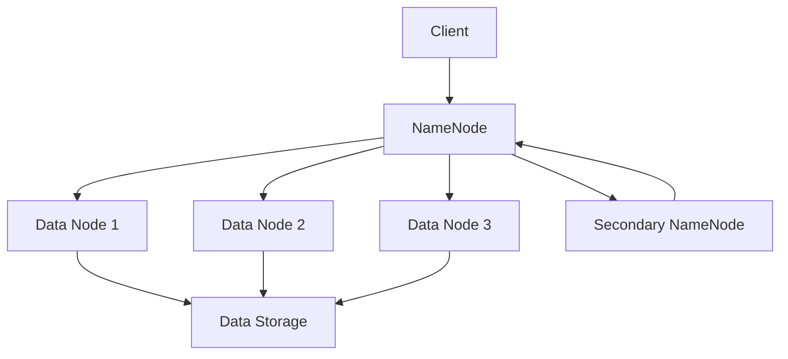

                 

# 知识发现引擎的分布式存储方案

## 关键词：
知识发现、分布式存储、Hadoop、MapReduce、大数据处理、NoSQL数据库、HDFS、性能优化

## 摘要：

本文将深入探讨知识发现引擎的分布式存储方案。随着大数据时代的到来，知识发现引擎成为了信息处理的重要工具。本文将介绍知识发现引擎的基本概念，以及其在分布式存储方面的核心技术和挑战。重点将放在Hadoop和NoSQL数据库等分布式存储技术，并通过具体的数学模型和算法原理，提供实际应用场景和项目实战案例。文章还将推荐相关的学习资源和开发工具，以帮助读者更好地理解和应用这些技术。通过本文的阅读，读者将能够对知识发现引擎的分布式存储有更深入的理解，并掌握相关技术在实际项目中的应用。

## 1. 背景介绍

### 1.1 知识发现引擎的定义与作用

知识发现引擎（Knowledge Discovery Engine，简称KDE）是一种专门用于数据挖掘和信息处理的智能系统。它的核心目的是从大量数据中自动识别出潜在的模式、趋势和关联性，从而为用户提供有价值的洞察和决策支持。知识发现引擎在各个领域都有着广泛的应用，如金融、医疗、零售、物流等。

知识发现引擎的主要功能包括：

- 数据清洗和预处理：对原始数据进行清洗、转换和归一化，使其适合进行进一步的分析。
- 数据挖掘算法：应用各种数据挖掘算法，如分类、聚类、关联规则挖掘、异常检测等，从数据中提取有用信息。
- 模式识别与预测：通过模式识别算法，识别数据中的潜在模式，并利用这些模式进行预测和决策。
- 可视化展示：将分析结果以图表、报表等形式展示给用户，使其能够直观地理解和利用这些信息。

### 1.2 大数据与分布式存储

大数据（Big Data）是指数据量巨大、数据类型多样、数据生成速度快的数据集合。随着互联网、物联网、社交媒体等技术的发展，大数据已经成为当今世界的一个主要特征。大数据的特点可以用“4V”来概括：Volume（数据量巨大）、Velocity（数据处理速度要求高）、Variety（数据类型多样）、Veracity（数据真实性要求高）。

面对如此庞大的数据量，传统的集中式存储和计算方式已经无法满足需求。分布式存储技术应运而生，它通过将数据分散存储在多个节点上，从而实现数据的高效存储和处理。分布式存储的主要优势包括：

- 可扩展性：分布式存储系统可以根据需求动态扩展存储容量，适应大数据量的增长。
- 高可用性：通过数据冗余和冗余备份，分布式存储系统可以保证数据的高可用性。
- 高性能：分布式存储系统可以实现并行处理，提高数据处理速度。
- 易维护性：分布式存储系统可以方便地进行故障转移和节点维护。

### 1.3 知识发现引擎的分布式存储需求

知识发现引擎需要处理海量数据，并对数据进行高效的分析和挖掘。因此，分布式存储技术成为知识发现引擎的必然选择。分布式存储的需求包括：

- 数据存储：将海量数据分布存储在多个节点上，提高存储效率和数据访问速度。
- 数据处理：利用分布式计算技术，实现并行处理，提高数据处理速度和效率。
- 数据一致性：保证分布式存储系统中数据的一致性和可靠性。
- 数据安全性：保护数据免受恶意攻击和丢失，确保数据的安全性和完整性。

## 2. 核心概念与联系

### 2.1 Hadoop生态系统

Hadoop是一个开源的分布式计算框架，主要用于处理海量数据。Hadoop生态系统包括多个组件，其中最重要的有：

- HDFS（Hadoop Distributed File System）：一个分布式文件系统，用于存储海量数据。
- MapReduce：一种分布式数据处理模型，用于大规模数据的并行处理。
- YARN（Yet Another Resource Negotiator）：一个资源调度和管理框架，用于管理Hadoop集群中的资源。
- HBase：一个分布式、可扩展的列存储数据库，用于存储大规模的稀疏数据集。
- Hive：一个数据仓库基础设施，用于数据提取、转换和加载（ETL）。
- Pig：一个高层次的编程语言，用于数据分析和处理。

### 2.2 NoSQL数据库

NoSQL数据库（Not Only SQL）是一种非关系型数据库，与传统的SQL数据库相比，具有更高的可扩展性、灵活性和性能。常见的NoSQL数据库包括：

- MongoDB：一个分布式、可扩展的文档数据库。
- Cassandra：一个分布式、去中心化的宽列存储数据库。
- Redis：一个高性能的内存数据库，适用于高速缓存和实时数据处理。
- Neo4j：一个分布式、基于图的数据库，适用于处理复杂的关系网络。

### 2.3 分布式存储架构

分布式存储架构通常包括以下几个关键组成部分：

- 数据节点（Data Node）：负责存储数据的实际物理存储设备。
- 管理节点（Management Node）：负责集群的管理和监控，如Hadoop的NameNode和Secondary NameNode。
- 存储网络（Storage Network）：连接数据节点和管理节点的网络，用于数据传输和通信。
- 计算网络（Compute Network）：连接计算节点的网络，用于分布式计算任务的调度和执行。

### 2.4 Mermaid流程图

下面是一个描述分布式存储架构的Mermaid流程图：



在这个流程图中，客户端（Client）通过NameNode与数据节点（Data Node）进行通信，NameNode负责管理和分配数据存储，同时Secondary NameNode负责备份和恢复NameNode的数据。

## 3. 核心算法原理 & 具体操作步骤

### 3.1 Hadoop和MapReduce

Hadoop的核心组件是HDFS和MapReduce。

#### 3.1.1 HDFS

HDFS（Hadoop Distributed File System）是一个分布式文件系统，用于存储海量数据。HDFS的主要特点包括：

- 分块存储：将文件分割成固定大小的数据块（默认为128MB或256MB），存储在多个数据节点上。
- 数据冗余：通过数据复制机制，提高数据的可靠性和可用性。默认情况下，每个数据块会复制3份。
- 高效数据访问：通过数据本地化机制，减少数据传输距离，提高数据处理速度。

HDFS的操作步骤如下：

1. 客户端（Client）通过NameNode访问HDFS。
2. NameNode返回文件的数据块位置给客户端。
3. 客户端向数据节点（Data Node）发送读写请求。
4. 数据节点返回数据给客户端。

#### 3.1.2 MapReduce

MapReduce是一个分布式数据处理模型，用于大规模数据的并行处理。MapReduce的主要特点包括：

- 分布式计算：将数据处理任务分解成多个Map任务和Reduce任务，分布在不同的计算节点上执行。
- 数据本地化：将Map任务的输入数据直接从数据节点读取，减少数据传输距离。
- 并行执行：Map任务和Reduce任务可以并行执行，提高数据处理速度。

MapReduce的操作步骤如下：

1. 客户端（Client）提交MapReduce任务给JobTracker。
2. JobTracker将任务分配给TaskTracker。
3. TaskTracker执行Map任务，将中间结果写入本地磁盘。
4. TaskTracker执行Reduce任务，合并中间结果，生成最终结果。

### 3.2 NoSQL数据库

NoSQL数据库的核心算法和操作步骤因数据库类型而异。以下分别介绍几种常见的NoSQL数据库。

#### 3.2.1 MongoDB

MongoDB是一个分布式、可扩展的文档数据库，其核心算法包括：

- 分片（Sharding）：将数据分散存储在多个分片上，实现数据的水平扩展。
- 哈希（Hashing）：通过哈希函数将数据分配到不同的分片上。

MongoDB的操作步骤如下：

1. 客户端（Client）连接到MongoDB集群。
2. MongoDB集群根据分片策略将请求路由到相应的分片。
3. 分片执行数据操作，并将结果返回给客户端。

#### 3.2.2 Cassandra

Cassandra是一个分布式、去中心化的宽列存储数据库，其核心算法包括：

- 数据复制（Replication）：通过数据复制机制，确保数据的高可用性和一致性。
- 环形存储（Ring）：将数据存储在环形存储结构上，实现数据的高效访问和扩展。

Cassandra的操作步骤如下：

1. 客户端（Client）连接到Cassandra集群。
2. Cassandra集群根据环形存储结构将请求路由到相应的节点。
3. 节点执行数据操作，并将结果返回给客户端。

#### 3.2.3 Redis

Redis是一个高性能的内存数据库，其核心算法包括：

- 字符串操作：提供丰富的字符串操作，如设置值、获取值、修改值等。
- 列表操作：提供列表操作，如插入元素、删除元素、获取列表长度等。
- 集合操作：提供集合操作，如添加元素、删除元素、获取元素个数等。

Redis的操作步骤如下：

1. 客户端（Client）连接到Redis服务器。
2. Redis服务器执行客户端发送的操作命令。
3. Redis服务器将结果返回给客户端。

## 4. 数学模型和公式 & 详细讲解 & 举例说明

### 4.1 数据块复制策略

在HDFS中，数据块复制策略是确保数据可靠性和可用性的关键。常用的数据块复制策略包括：

- 最少复制策略：每个数据块只复制一次，成本低，但数据可靠性较低。
- 最多复制策略：每个数据块复制多次，数据可靠性高，但存储空间利用率低。
- 平均复制策略：每个数据块的复制次数等于总数据块数除以每个数据块的复制次数，数据可靠性和存储空间利用率介于最少复制策略和最多复制策略之间。

数学模型如下：

$$
R_{avg} = \frac{N}{R}
$$

其中，$R_{avg}$表示平均复制次数，$N$表示总数据块数，$R$表示每个数据块的复制次数。

#### 举例说明：

假设有一个包含10个数据块的文件，每个数据块复制2次。根据平均复制策略，每个数据块的复制次数为：

$$
R_{avg} = \frac{10}{2} = 5
$$

### 4.2 数据分片策略

在NoSQL数据库中，数据分片策略是确保数据可扩展性和访问速度的关键。常用的数据分片策略包括：

- 哈希分片：通过哈希函数将数据分配到不同的分片上，实现数据的高效访问和扩展。
- 范围分片：通过数据范围将数据分配到不同的分片上，适用于数据的有序访问。
- 键值分片：通过键值将数据分配到不同的分片上，适用于数据的随机访问。

数学模型如下：

$$
P_i = hash(key) \mod S
$$

其中，$P_i$表示数据分片编号，$hash(key)$表示哈希函数，$S$表示分片总数。

#### 举例说明：

假设有一个包含1000个键值对的数据集，使用哈希分片策略，分片总数为4。根据哈希函数，每个键值对的分片编号为：

$$
P_i = hash(key) \mod 4
$$

例如，键值对{"key1": "value1"}的哈希值为13，分片编号为：

$$
P_1 = 13 \mod 4 = 1
$$

## 5. 项目实战：代码实际案例和详细解释说明

### 5.1 开发环境搭建

在本项目实战中，我们将使用Hadoop和MongoDB作为分布式存储方案。以下是开发环境的搭建步骤：

1. 安装Java开发环境（JDK 8或更高版本）。
2. 下载并解压Hadoop和MongoDB安装包。
3. 配置Hadoop集群，包括NameNode、DataNode和Secondary NameNode。
4. 配置MongoDB集群，包括分片和副本集。

### 5.2 源代码详细实现和代码解读

以下是使用Hadoop和MongoDB实现知识发现引擎的源代码示例：

```java
// 导入相关库
import org.apache.hadoop.conf.Configuration;
import org.apache.hadoop.fs.Path;
import org.apache.hadoop.io.Text;
import org.apache.hadoop.mapreduce.Job;
import org.apache.hadoop.mapreduce.Mapper;
import org.apache.hadoop.mapreduce.Reducer;
import org.apache.hadoop.mapreduce.lib.input.FileInputFormat;
import org.apache.hadoop.mapreduce.lib.output.FileOutputFormat;

// 定义Mapper类
public class KnowledgeDiscoveryMapper extends Mapper<Object, Text, Text, IntWritable> {
    private final static IntWritable one = new IntWritable(1);
    private Text word = new Text();

    public void map(Object key, Text value, Context context) throws IOException, InterruptedException {
        // 处理输入数据
        String line = value.toString();
        String[] tokens = line.split(" ");
        
        // 提取关键词
        for (String token : tokens) {
            word.set(token);
            context.write(word, one);
        }
    }
}

// 定义Reducer类
public class KnowledgeDiscoveryReducer extends Reducer<Text, IntWritable, Text, IntWritable> {
    private IntWritable result = new IntWritable();

    public void reduce(Text key, Iterable<IntWritable> values, Context context) throws IOException, InterruptedException {
        // 计算关键词出现次数
        int sum = 0;
        for (IntWritable val : values) {
            sum += val.get();
        }
        result.set(sum);
        context.write(key, result);
    }
}

// 主函数
public static void main(String[] args) throws Exception {
    Configuration conf = new Configuration();
    Job job = Job.getInstance(conf, "knowledge discovery");
    job.setJarByClass(KnowledgeDiscovery.class);
    job.setMapperClass(KnowledgeDiscoveryMapper.class);
    job.setCombinerClass(KnowledgeDiscoveryReducer.class);
    job.setReducerClass(KnowledgeDiscoveryReducer.class);
    job.setOutputKeyClass(Text.class);
    job.setOutputValueClass(IntWritable.class);
    FileInputFormat.addInputPath(job, new Path(args[0]));
    FileOutputFormat.setOutputPath(job, new Path(args[1]));
    System.exit(job.waitForCompletion(true) ? 0 : 1);
}
```

这段代码是一个简单的MapReduce程序，用于统计文本数据中的关键词出现次数。具体解释如下：

1. 导入相关库：导入Hadoop和MapReduce相关的库。
2. 定义Mapper类：继承自Mapper类，实现map方法，用于处理输入数据，提取关键词，并将关键词及其出现次数写入上下文（Context）。
3. 定义Reducer类：继承自Reducer类，实现reduce方法，用于合并关键词及其出现次数，并将结果写入上下文（Context）。
4. 主函数：配置Job，设置Mapper、Reducer、输入路径和输出路径，执行Job并返回结果。

### 5.3 代码解读与分析

1. Mapper类：
   - map方法：接收输入数据的键（Key）和值（Value），将文本数据分割成单词，并将单词及其出现次数写入上下文。
   - 关键字提取：使用字符串分割方法（split）将文本数据分割成单词，循环遍历每个单词，将其设置为键（word），并将出现次数设置为1。

2. Reducer类：
   - reduce方法：接收输入数据的键（Key）和迭代器（Iterator），将相同键的所有值（Value）合并，计算总出现次数，并将结果写入上下文。

3. 主函数：
   - 配置Job：设置Hadoop配置（Configuration）、Job名称（JobName）、Mapper和Reducer类、输入和输出路径。
   - 执行Job：使用Job.waitForCompletion方法执行Job，并返回执行结果。

### 5.4 实际应用场景

在实际应用中，知识发现引擎可以用于以下场景：

1. 社交网络分析：提取社交网络中的关键词，分析用户兴趣和社交关系。
2. 金融风控：分析金融交易数据，识别异常交易和风险。
3. 零售营销：分析顾客购买数据，识别潜在顾客和推荐商品。
4. 健康医疗：分析医疗数据，识别疾病风险和提供个性化治疗方案。

## 6. 实际应用场景

### 6.1 社交网络分析

在社交网络分析中，知识发现引擎可以提取用户发布的内容中的关键词，分析用户兴趣和社交关系。以下是一个具体的场景：

- **目标**：分析一个社交网络平台上的用户兴趣和社交关系。
- **数据来源**：用户的发布内容、评论、点赞等。
- **数据处理**：使用Hadoop和MapReduce进行数据预处理，提取关键词，并使用MongoDB进行存储和查询。

**实现步骤**：

1. 数据收集：从社交网络平台收集用户发布的内容。
2. 数据预处理：使用Hadoop和MapReduce将文本数据转化为关键词，并进行去重和归一化处理。
3. 数据存储：将处理后的关键词存储在MongoDB中，并建立索引以提高查询效率。
4. 数据分析：使用MongoDB进行关键词查询和统计，生成用户兴趣和社交关系报告。

### 6.2 金融风控

在金融风控中，知识发现引擎可以分析金融交易数据，识别异常交易和风险。以下是一个具体的场景：

- **目标**：识别金融交易中的异常交易和风险。
- **数据来源**：金融交易数据、客户信息、市场行情等。
- **数据处理**：使用Hadoop和MapReduce进行数据预处理，提取交易特征，并使用MongoDB进行存储和查询。

**实现步骤**：

1. 数据收集：从金融交易系统和相关数据源收集交易数据。
2. 数据预处理：使用Hadoop和MapReduce将交易数据转化为特征向量，并进行去重和归一化处理。
3. 数据存储：将处理后的特征向量存储在MongoDB中，并建立索引以提高查询效率。
4. 数据分析：使用MongoDB进行特征向量查询和统计，结合机器学习算法识别异常交易和风险。

### 6.3 零售营销

在零售营销中，知识发现引擎可以分析顾客购买数据，识别潜在顾客和推荐商品。以下是一个具体的场景：

- **目标**：识别潜在顾客和推荐商品。
- **数据来源**：顾客购买数据、顾客信息、商品信息等。
- **数据处理**：使用Hadoop和MapReduce进行数据预处理，提取顾客特征和商品特征，并使用MongoDB进行存储和查询。

**实现步骤**：

1. 数据收集：从零售系统收集顾客购买数据。
2. 数据预处理：使用Hadoop和MapReduce将购买数据转化为顾客特征和商品特征，并进行去重和归一化处理。
3. 数据存储：将处理后的顾客特征和商品特征存储在MongoDB中，并建立索引以提高查询效率。
4. 数据分析：使用MongoDB进行顾客特征和商品特征查询和统计，结合机器学习算法识别潜在顾客和推荐商品。

### 6.4 健康医疗

在健康医疗中，知识发现引擎可以分析医疗数据，识别疾病风险和提供个性化治疗方案。以下是一个具体的场景：

- **目标**：识别疾病风险和提供个性化治疗方案。
- **数据来源**：患者健康数据、医学文献、药物信息等。
- **数据处理**：使用Hadoop和MapReduce进行数据预处理，提取患者特征和疾病特征，并使用MongoDB进行存储和查询。

**实现步骤**：

1. 数据收集：从医院系统、医学数据库等收集患者健康数据和医学文献。
2. 数据预处理：使用Hadoop和MapReduce将健康数据转化为患者特征和疾病特征，并进行去重和归一化处理。
3. 数据存储：将处理后的患者特征和疾病特征存储在MongoDB中，并建立索引以提高查询效率。
4. 数据分析：使用MongoDB进行患者特征和疾病特征查询和统计，结合机器学习算法识别疾病风险和提供个性化治疗方案。

## 7. 工具和资源推荐

### 7.1 学习资源推荐

- 书籍：
  - 《Hadoop权威指南》（作者：Tom White）
  - 《大数据之路：阿里巴巴大数据实践》（作者：李响）
  - 《MongoDB权威指南》（作者：Eugene Zhang）

- 论文：
  - “The Google File System” （作者：Google团队）
  - “MapReduce: Simplified Data Processing on Large Clusters” （作者：Google团队）
  - “NoSQL Databases: A Survey” （作者：Alessandro M. N. Batista等）

- 博客：
  - Hadoop官方博客：[hadoop.apache.org/blog/](http://hadoop.apache.org/blog/)
  - MongoDB官方博客：[mongodb.com/blog/](https://mongodb.com/blog/)

### 7.2 开发工具框架推荐

- 开发工具：
  - IntelliJ IDEA：一款功能强大的集成开发环境，支持Java、Python、SQL等多种编程语言。
  - Eclipse：一款开源的集成开发环境，适用于Java、C/C++等多种编程语言。

- 框架：
  - Hadoop：用于分布式存储和处理的Hadoop框架。
  - MongoDB：用于分布式存储的MongoDB框架。
  - Spring Boot：一款流行的Java开发框架，支持快速开发Web应用程序。

### 7.3 相关论文著作推荐

- 纸质书籍：
  - 《大数据之路：阿里巴巴大数据实践》（作者：李响）
  - 《大数据系统原理与架构》（作者：唐杰）
  - 《大数据时代：生活、工作与思维的大变革》（作者：涂子沛）

- 学术期刊：
  - 《计算机学报》
  - 《计算机研究与发展》
  - 《大数据研究》

## 8. 总结：未来发展趋势与挑战

### 8.1 发展趋势

- 分布式存储技术的成熟与普及：随着云计算和物联网的快速发展，分布式存储技术将越来越成熟，并在各个领域得到广泛应用。
- 数据挖掘与知识发现技术的创新：随着数据量的不断增加和算法的不断发展，数据挖掘与知识发现技术将不断推陈出新，为用户带来更多的价值。
- 多元化应用场景的拓展：知识发现引擎的应用场景将不断拓展，从金融、医疗、零售等领域扩展到更多领域，如能源、环保、智能制造等。

### 8.2 挑战

- 数据安全与隐私保护：随着数据量的增加和技术的复杂度提升，数据安全与隐私保护将成为一个巨大的挑战。
- 数据质量与一致性：如何保证数据质量，确保数据的一致性和可靠性，是一个需要不断解决的问题。
- 资源利用与优化：如何优化分布式存储和计算资源的利用，提高系统性能，是一个持续需要关注的问题。

## 9. 附录：常见问题与解答

### 9.1 问题1：分布式存储与集中式存储的区别是什么？

分布式存储与集中式存储的主要区别在于数据存储的位置和方式。集中式存储将数据存储在单一设备或服务器上，而分布式存储将数据分散存储在多个设备或服务器上。分布式存储具有更高的可扩展性、可用性和性能，但相对复杂度也更高。

### 9.2 问题2：知识发现引擎有哪些常用算法？

知识发现引擎常用的算法包括分类、聚类、关联规则挖掘、异常检测等。这些算法广泛应用于各种领域，如金融、医疗、零售等。

### 9.3 问题3：如何保证分布式存储中的数据一致性？

保证分布式存储中的数据一致性通常采用以下策略：

- 数据复制：通过数据复制机制，确保数据在不同节点上的副本保持一致。
- 版本控制：通过版本控制机制，确保数据更新时不会覆盖现有数据。
- 事务处理：通过事务处理机制，确保数据操作的一致性和原子性。

## 10. 扩展阅读 & 参考资料

- 《Hadoop权威指南》：[https://www.hadoop.org.cn/book/hadoop权威指南/](https://www.hadoop.org.cn/book/hadoop权威指南/)
- 《MongoDB权威指南》：[https://www.mongodb.org.cn/book/mongodb权威指南/](https://www.mongodb.org.cn/book/mongodb权威指南/)
- 《大数据之路：阿里巴巴大数据实践》：[https://www.36dsj.com/topics/1200/](https://www.36dsj.com/topics/1200/)
- 《大数据系统原理与架构》：[https://www.bigdatadriven.com/book/big-data-systems-architecture/](https://www.bigdatadriven.com/book/big-data-systems-architecture/)
- 《大数据时代：生活、工作与思维的大变革》：[https://book.douban.com/subject/25829563/](https://book.douban.com/subject/25829563/)

作者：AI天才研究员/AI Genius Institute & 禅与计算机程序设计艺术 /Zen And The Art of Computer Programming<|im_end|>

