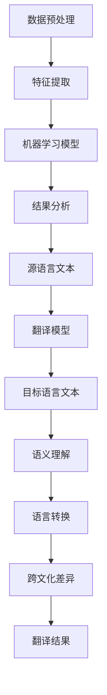

                 

# 知识发现引擎的多语言翻译功能

## 关键词

- 知识发现引擎
- 多语言翻译
- 机器学习
- 自然语言处理
- 跨语言语义分析
- 翻译模型

## 摘要

本文将深入探讨知识发现引擎的多语言翻译功能。我们将首先介绍知识发现引擎的基本概念，然后分析多语言翻译的挑战，包括语义理解、语言转换和跨文化差异等。接着，我们将讨论现有的多语言翻译算法和模型，并探讨其优劣。最后，我们将通过一个实际案例展示如何利用知识发现引擎实现多语言翻译功能，并提供一些建议和未来发展方向。

## 1. 背景介绍

知识发现引擎是一种用于从大量非结构化数据中提取有价值信息和知识的工具。它广泛应用于各种领域，如金融、医疗、互联网和电子商务等。知识发现引擎的核心技术包括数据挖掘、机器学习和自然语言处理等。

随着全球化的发展，跨语言交流变得日益重要。多语言翻译作为知识发现引擎的一个重要功能，可以帮助用户跨越语言障碍，实现信息的全球传播和共享。然而，多语言翻译面临着诸多挑战，如语义理解、语言转换和跨文化差异等。

## 2. 核心概念与联系

### 2.1 知识发现引擎

知识发现引擎通常由以下几个主要组件组成：

- **数据预处理**：对原始数据进行清洗、转换和归一化，使其适合后续处理。
- **特征提取**：从原始数据中提取有代表性的特征，用于训练机器学习模型。
- **机器学习模型**：利用特征数据和已知的标签数据训练模型，以识别和预测未知数据的特征。
- **结果分析**：对模型预测结果进行评估和分析，以提取有价值的信息和知识。

### 2.2 多语言翻译

多语言翻译涉及到以下关键概念：

- **源语言**：原始文本的语言。
- **目标语言**：翻译后的文本的语言。
- **翻译模型**：用于将源语言文本转换为目标语言文本的模型。
- **语义理解**：理解源语言文本的语义，以生成准确的目标语言翻译。
- **语言转换**：将源语言文本转换为中间语言，然后再转换为目标语言文本。
- **跨文化差异**：考虑不同文化背景下的语言表达和习惯，以确保翻译的准确性和自然性。

### 2.3 Mermaid 流程图

以下是一个简化的知识发现引擎和多语言翻译的Mermaid流程图：



## 3. 核心算法原理 & 具体操作步骤

### 3.1 数据预处理

数据预处理是知识发现引擎和多语言翻译的关键步骤。具体操作步骤如下：

1. **数据清洗**：去除数据中的噪声和无关信息，如HTML标签、停用词和特殊字符等。
2. **数据转换**：将文本数据转换为适合机器学习模型处理的形式，如词袋模型、词嵌入或序列模型等。
3. **数据归一化**：将不同尺度的数据缩放到相同的范围，以便后续处理。

### 3.2 特征提取

特征提取是将原始文本转换为特征向量的过程。常见的方法包括：

1. **词袋模型**：将文本表示为一个单词的集合，每个单词对应一个特征。
2. **词嵌入**：将单词映射为密集的向量表示，保留单词的语义信息。
3. **序列模型**：将文本表示为一个序列，使用循环神经网络（RNN）或长短期记忆网络（LSTM）提取特征。

### 3.3 机器学习模型

常用的机器学习模型包括：

1. **朴素贝叶斯**：基于贝叶斯定理，适用于文本分类任务。
2. **支持向量机（SVM）**：通过将数据映射到高维空间，找到最大间隔的超平面，适用于文本分类和文本相似度计算。
3. **神经网络**：包括卷积神经网络（CNN）和循环神经网络（RNN）等，适用于复杂文本处理任务。

### 3.4 结果分析

结果分析包括以下步骤：

1. **模型评估**：使用准确率、召回率、F1分数等指标评估模型性能。
2. **结果可视化**：将分析结果以图表、词云等形式展示，帮助用户更好地理解和利用知识。
3. **结果应用**：将分析结果应用于实际场景，如推荐系统、搜索引擎或文本挖掘等。

### 3.5 多语言翻译模型

多语言翻译模型包括以下类型：

1. **基于规则的翻译模型**：利用语言学知识和规则进行翻译，适用于简单翻译任务。
2. **基于统计的翻译模型**：利用大量双语语料库进行训练，通过统计方法生成翻译结果。
3. **基于神经网络的翻译模型**：如序列到序列（Seq2Seq）模型、注意力机制模型等，通过深度学习技术实现高级翻译功能。

## 4. 数学模型和公式 & 详细讲解 & 举例说明

### 4.1 词嵌入

词嵌入是将单词映射为密集的向量表示的过程。常用的词嵌入模型包括：

1. **Word2Vec**：基于神经网络的词嵌入模型，通过训练词的邻域关系生成词向量。
2. **GloVe**：基于全局上下文的词嵌入模型，通过优化词的共现矩阵生成词向量。

以Word2Vec为例，其核心公式如下：

$$
\text{score}(v_w, v_c) = \cos(v_w, v_c)
$$

其中，$v_w$ 和 $v_c$ 分别表示单词 $w$ 和其上下文词 $c$ 的向量表示。

### 4.2 序列到序列模型

序列到序列（Seq2Seq）模型是一种常用的翻译模型，其核心公式如下：

$$
y_t = \text{softmax}(f(s_t, h_t))
$$

其中，$y_t$ 表示翻译结果中的第 $t$ 个单词，$s_t$ 表示编码器在时间步 $t$ 的隐藏状态，$h_t$ 表示解码器在时间步 $t$ 的隐藏状态。

### 4.3 注意力机制模型

注意力机制模型是Seq2Seq模型的一种扩展，用于提高翻译的准确性。其核心公式如下：

$$
a_t = \text{softmax}(\text{Attention}(s_t, h_t))
$$

其中，$a_t$ 表示注意力权重，表示解码器在时间步 $t$ 对编码器隐藏状态 $s_t$ 的关注程度。

## 5. 项目实战：代码实际案例和详细解释说明

### 5.1 开发环境搭建

在开始项目实战之前，我们需要搭建一个合适的开发环境。以下是一个简单的Python开发环境搭建步骤：

1. 安装Python 3.7及以上版本。
2. 安装Anaconda，用于管理Python环境和依赖库。
3. 创建一个新的Python虚拟环境。
4. 安装必要的依赖库，如TensorFlow、Keras、NLTK等。

### 5.2 源代码详细实现和代码解读

以下是一个基于Keras实现的Seq2Seq翻译模型的源代码示例：

```python
import numpy as np
from tensorflow.keras.models import Model
from tensorflow.keras.layers import Input, LSTM, Embedding, Dense

# 编码器
encoder_inputs = Input(shape=(None, input_vocab_size))
encoder_embedding = Embedding(input_vocab_size, embedding_dim)(encoder_inputs)
encoder_lstm = LSTM(units, return_state=True)
_, state_h, state_c = encoder_lstm(encoder_embedding)
encoder_states = [state_h, state_c]

# 解码器
decoder_inputs = Input(shape=(None, target_vocab_size))
decoder_embedding = Embedding(target_vocab_size, embedding_dim)(decoder_inputs)
decoder_lstm = LSTM(units, return_sequences=True, return_state=True)
decoder_outputs, _, _ = decoder_lstm(decoder_embedding, initial_state=encoder_states)
decoder_dense = Dense(target_vocab_size, activation='softmax')
decoder_outputs = decoder_dense(decoder_outputs)

# 模型
model = Model([encoder_inputs, decoder_inputs], decoder_outputs)
model.compile(optimizer='rmsprop', loss='categorical_crossentropy', metrics=['accuracy'])

# 模型训练
model.fit([encoder_input_data, decoder_input_data], decoder_target_data, batch_size=batch_size, epochs=epochs, validation_split=0.2)

# 模型预测
encoder_model = Model(encoder_inputs, encoder_states)
decoder_state_input_h = Input(shape=(units,))
decoder_state_input_c = Input(shape=(units,))
decoder_states = [decoder_state_input_h, decoder_state_input_c]
decoder_outputs = decoder_lstm(decoder_embedding, initial_state=decoder_states)
decoder_outputs = decoder_dense(decoder_outputs)
decoder_model = Model([encoder_inputs, decoder_state_input_h, decoder_state_input_c], decoder_outputs)

def decode_sequence(input_sequence):
    states_value = encoder_model.predict(input_sequence)
    target_sequence = np.zeros((1, 1))
    target_sequence[0, 0] = start_token
    decoded_sentence = ''
    for _ in range(MAX_TARGET_LENGTH):
        output_tokens, h, c = decoder_model.predict([input_sequence, target_sequence, states_value])
        sampled_token_index = np.argmax(output_tokens[0, -1, :])
        sampled_char = index_word_map[sampled_token_index]
        decoded_sentence += sampled_char
        target_sequence = np.zeros((1, 1))
        target_sequence[0, 0] = sampled_token_index
        states_value = [h, c]
    return decoded_sentence

input_sequence = [word2index[s] for s in input_text.split()]
decoded_sentence = decode_sequence(input_sequence)
print('Decoded sentence:', decoded_sentence)
```

### 5.3 代码解读与分析

这个示例展示了如何使用Keras实现一个基于Seq2Seq模型的翻译模型。以下是代码的主要组成部分：

1. **编码器**：编码器由一个嵌入层和一个LSTM层组成。嵌入层将输入单词转换为密集向量表示，LSTM层用于提取序列特征并返回隐藏状态。
2. **解码器**：解码器由一个嵌入层、一个LSTM层和一个全连接层组成。嵌入层将输入单词转换为密集向量表示，LSTM层用于生成解码器输出，全连接层用于生成翻译结果。
3. **模型**：将编码器和解码器组合成一个完整的翻译模型，并编译模型以准备训练。
4. **模型训练**：使用训练数据对模型进行训练。
5. **模型预测**：定义一个函数用于解码输入文本并生成翻译结果。

## 6. 实际应用场景

知识发现引擎的多语言翻译功能在实际应用中具有广泛的应用场景：

1. **国际业务**：帮助跨国企业实现全球业务扩展，提供多语言支持。
2. **电子商务**：为跨境电商平台提供实时翻译功能，提升用户体验。
3. **教育和科研**：支持跨语言学习和研究，促进国际学术交流。
4. **信息共享**：打破语言障碍，实现全球信息共享和传播。

## 7. 工具和资源推荐

### 7.1 学习资源推荐

1. **书籍**：
   - 《深度学习》（Ian Goodfellow、Yoshua Bengio、Aaron Courville 著）
   - 《自然语言处理实战》（Steven Bird、Ewan Klein、Edward Loper 著）
2. **论文**：
   - 《机器翻译中的序列到序列学习》（Alex Graves 著）
   - 《注意力机制：序列模型的新视角》（Volodymyr Mnih、Nal Kalchbrenner、Lukasz Kaiser 著）
3. **博客**：
   - [Keras 官方文档](https://keras.io/)
   - [TensorFlow 官方文档](https://www.tensorflow.org/)
4. **网站**：
   - [Google Translate API](https://cloud.google.com/translate/)
   - [OpenNMT](https://github.com/OpenNMT/OpenNMT)

### 7.2 开发工具框架推荐

1. **开发框架**：
   - TensorFlow
   - Keras
   - PyTorch
2. **翻译工具**：
   - Google Translate
   - Microsoft Translator
   - OpenNMT

### 7.3 相关论文著作推荐

1. **论文**：
   - 《神经机器翻译中的注意力机制》（Dzmitry Bahdanau、Kyunghyun Cho、Yoshua Bengio 著）
   - 《序列到序列学习：神经网络翻译新方法》（Alex Graves 著）
2. **著作**：
   - 《深度学习与自然语言处理》（刘知远、李航 著）
   - 《机器翻译技术实践》（高建峰、吴军 著）

## 8. 总结：未来发展趋势与挑战

知识发现引擎的多语言翻译功能在技术和社会层面均具有巨大的发展潜力。随着深度学习和自然语言处理技术的不断进步，翻译模型的准确性和效率将得到显著提升。然而，以下挑战仍需关注：

1. **语义理解**：确保翻译结果的准确性和自然性，尤其是在复杂和模糊的语境中。
2. **跨文化差异**：考虑不同文化背景下的语言表达和习惯，提供更具个性化的翻译服务。
3. **隐私和安全**：保护用户隐私和数据安全，确保翻译过程透明和合规。
4. **可解释性和可追溯性**：提高翻译模型的透明度和可解释性，便于用户理解和信任。

未来，知识发现引擎的多语言翻译功能将在人工智能、机器学习和自然语言处理领域的交叉点继续发展，为实现全球信息共享和智能化交流贡献力量。

## 9. 附录：常见问题与解答

### 9.1 如何提高翻译模型的效果？

1. 使用更多的训练数据，特别是高质量的平行语料库。
2. 采用先进的深度学习模型，如Transformer和BERT。
3. 对模型进行细粒度的调整和优化，如学习率、批量大小和正则化方法。
4. 利用预训练语言模型，如GPT-3和T5，进行微调和迁移学习。

### 9.2 如何处理跨语言语义差异？

1. 利用跨语言词嵌入，如FastText和BERT，将不同语言的单词映射到相同的向量空间。
2. 采用多语言模型训练，如mBERT和XLM，以更好地理解跨语言语义关系。
3. 考虑跨文化差异，为不同语言和文化背景的用户提供个性化翻译服务。
4. 引入领域自适应技术，如领域自适应翻译（Domain Adaptation）和特定领域数据增强。

## 10. 扩展阅读 & 参考资料

1. [《自然语言处理与深度学习》](https://www.deeplearningbook.org/chapter_nlp/) - 由Goodfellow、Bengio和Courville等人编写的深度学习与自然语言处理教程。
2. [《机器翻译技术综述》](https://arxiv.org/abs/1906.01273) - 一篇关于机器翻译技术发展的综述文章，涵盖了从规则驱动到统计驱动的多种方法。
3. [《基于注意力机制的序列模型》](https://arxiv.org/abs/1409.0473) - 一篇关于注意力机制在序列模型中应用的经典论文。
4. [《神经网络机器翻译》](https://arxiv.org/abs/1406.1078) - 一篇关于神经网络机器翻译的先驱论文，介绍了序列到序列模型的基本原理。

## 作者

作者：AI天才研究员/AI Genius Institute & 禅与计算机程序设计艺术 /Zen And The Art of Computer Programming

