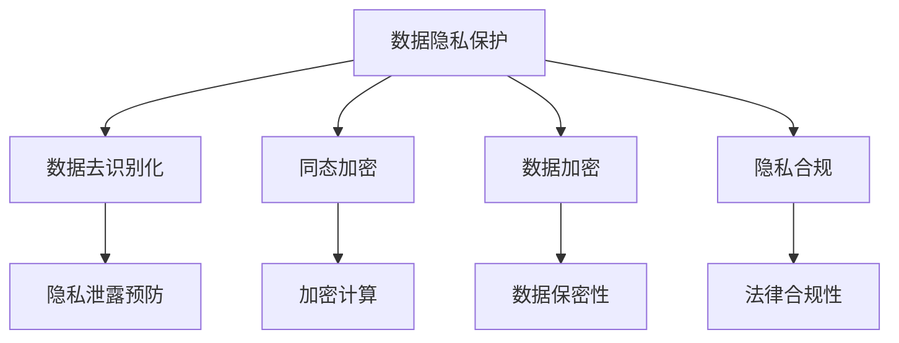

                 

# 知识发现引擎的数据隐私保护策略

## 关键词：
- 数据隐私保护
- 知识发现引擎
- 隐私保护算法
- 数据安全
- 隐私合规

## 摘要：
本文将深入探讨知识发现引擎中数据隐私保护的重要性和挑战。首先，我们将介绍知识发现引擎的基本概念和其在现代数据分析和决策支持中的应用。接着，我们将分析当前数据隐私保护面临的主要问题，包括隐私泄露、数据滥用和合规性要求等。随后，我们将探讨几种常见的隐私保护策略，如数据加密、数据去识别化和同态加密等。最后，本文将讨论未来在数据隐私保护方面的发展趋势和技术挑战，并推荐一些相关的学习和资源。

## 1. 背景介绍

知识发现引擎是一种用于从大量数据中提取有价值信息的技术工具。它结合了多种数据挖掘技术和算法，旨在帮助企业和组织从海量数据中提取洞见和知识。知识发现引擎的核心目标是发现数据中的模式、关联和趋势，从而为决策提供支持。

在现代数据分析和决策支持中，知识发现引擎发挥着重要作用。例如，在金融行业，知识发现引擎可以用于信用风险评估、市场趋势预测和欺诈检测。在医疗领域，知识发现引擎可以帮助医生进行疾病诊断、个性化治疗和患者管理。在零售行业，知识发现引擎可以用于需求预测、库存管理和营销策略优化。

然而，随着知识发现引擎的应用越来越广泛，数据隐私保护问题也逐渐凸显。数据隐私保护是指确保数据在收集、存储、处理和传输过程中不被未经授权的访问、使用和泄露。数据隐私保护的重要性不言而喻，因为隐私泄露可能导致个人身份盗窃、商业机密泄露和声誉损失等问题。

## 2. 核心概念与联系

为了更好地理解知识发现引擎中的数据隐私保护，我们需要了解以下几个核心概念：

### 2.1 数据隐私保护
数据隐私保护是指采取一系列措施来确保数据在生命周期中的安全性和隐私性。这些措施包括数据加密、访问控制、匿名化和隐私合规等。

### 2.2 数据去识别化
数据去识别化是一种将敏感数据转换为不可识别形式的过程，以保护个人隐私。常见的去识别化技术包括数据混淆、泛化和通用化等。

### 2.3 同态加密
同态加密是一种加密形式，允许在加密数据上直接进行计算，而不需要解密数据。这使得同态加密成为保护数据隐私的一种有效方法，特别是在云计算和分布式计算环境中。

### 2.4 数据加密
数据加密是一种将明文数据转换为密文的过程，只有具备解密密钥的人才能解读数据。数据加密是保护数据隐私的基本方法，可以防止未经授权的访问和泄露。

### 2.5 隐私合规
隐私合规是指遵守与数据隐私相关的法律法规和政策，如欧盟的通用数据保护条例（GDPR）和加州消费者隐私法案（CCPA）。遵守隐私合规要求企业采取措施保护数据隐私，避免法律风险。

### 2.6 Mermaid 流程图

以下是一个简化的 Mermaid 流程图，展示了知识发现引擎中数据隐私保护的核心概念和联系：



## 3. 核心算法原理 & 具体操作步骤

### 3.1 数据去识别化

数据去识别化是一种常用的隐私保护方法，通过将敏感数据转换为不可识别的形式来保护隐私。以下是数据去识别化的一般步骤：

1. **数据分类**：将数据分为敏感数据和普通数据，分别处理。
2. **数据清洗**：移除或掩盖敏感信息，如个人身份信息、家庭地址、电话号码等。
3. **数据混淆**：通过添加噪声、替换或泛化敏感信息，使其难以识别。
4. **数据泛化**：将具体数据替换为泛化数据，如将具体年龄替换为年龄段。
5. **通用化**：将个体数据与群体数据合并，降低个体数据的识别性。

### 3.2 同态加密

同态加密是一种在加密数据上进行计算的方法，使得计算结果与原始数据相对应。以下是同态加密的一般步骤：

1. **密钥生成**：生成公钥和私钥对。
2. **数据加密**：使用公钥将明文数据加密为密文。
3. **加密计算**：在加密数据上进行计算，得到加密结果。
4. **解密结果**：使用私钥将加密结果解密为明文。

### 3.3 数据加密

数据加密是将明文数据转换为密文的过程，只有具备解密密钥的人才能解读数据。以下是数据加密的一般步骤：

1. **选择加密算法**：根据数据类型和安全需求选择合适的加密算法，如AES、RSA等。
2. **生成密钥**：生成加密密钥。
3. **加密数据**：使用加密算法和密钥将明文数据加密为密文。
4. **存储密文**：将加密后的数据存储在安全的地方。
5. **解密数据**：当需要读取数据时，使用密钥将密文解密为明文。

### 3.4 隐私合规

隐私合规是确保企业遵守与数据隐私相关的法律法规和政策的过程。以下是隐私合规的一般步骤：

1. **识别法律要求**：了解与数据隐私相关的法律法规和政策。
2. **制定隐私政策**：明确数据收集、存储、处理和共享的原则和规则。
3. **数据分类**：将数据分为敏感数据和普通数据，分别处理。
4. **数据保护措施**：采取数据加密、访问控制和隐私保护算法等措施，确保数据安全。
5. **监控与审计**：定期监控和审计数据隐私保护措施，确保合规。

## 4. 数学模型和公式 & 详细讲解 & 举例说明

### 4.1 数据去识别化的数学模型

数据去识别化可以使用以下数学模型进行描述：

$$
\text{去识别化}(\text{数据集}, \text{去识别化规则}) = \text{去识别化数据集}
$$

其中，`数据集`是包含敏感信息的原始数据集，`去识别化规则`是一组规则，用于将敏感信息转换为不可识别的形式，`去识别化数据集`是处理后的数据集。

举例：

假设有一个包含个人身份信息的表格，包括姓名、年龄、电话号码和电子邮件地址。我们可以使用以下去识别化规则：

1. 将姓名替换为随机字符串。
2. 将年龄替换为年龄段（例如，20-30岁）。
3. 将电话号码替换为假电话号码。
4. 将电子邮件地址替换为通用邮箱地址（例如，example.com）。

应用这些规则后，原始表格中的敏感信息将被转换为不可识别的形式，从而保护个人隐私。

### 4.2 同态加密的数学模型

同态加密可以使用以下数学模型进行描述：

$$
\text{同态加密}(\text{明文数据}, \text{加密算法}, \text{公钥}) = \text{密文数据}
$$

$$
\text{同态计算}(\text{密文数据}, \text{计算操作}) = \text{密文结果}
$$

$$
\text{同态解密}(\text{密文结果}, \text{私钥}) = \text{明文结果}
$$

其中，`明文数据`是需要加密的数据，`加密算法`是用于加密数据的算法，`公钥`是加密算法的密钥，`密文数据`是加密后的数据，`计算操作`是对加密数据进行计算的操作，`密文结果`是计算后的加密结果，`私钥`是用于解密算法的密钥，`明文结果`是解密后的数据。

举例：

假设有一个简单的同态加密应用场景，需要计算两个数的和。使用同态加密的方法，我们可以先对两个数进行加密，然后计算加密结果，最后解密得到明文结果。

假设明文数据为 `a = 3` 和 `b = 5`，加密算法为 RSA，公钥为 `(e, n)`，私钥为 `(d, n)`。

1. 对 `a` 和 `b` 进行加密：

$$
a_{\text{密文}} = a^e \mod n
$$

$$
b_{\text{密文}} = b^e \mod n
$$

2. 计算加密结果的和：

$$
(a_{\text{密文}} + b_{\text{密文}})^e \mod n = (3^e + 5^e) \mod n
$$

3. 对加密结果进行解密：

$$
\text{明文结果} = (a_{\text{密文}} + b_{\text{密文}})^d \mod n
$$

最终，我们得到加密后的和为 `8`，解密后的明文结果也为 `8`，证明了同态加密的正确性。

### 4.3 数据加密的数学模型

数据加密可以使用以下数学模型进行描述：

$$
\text{加密}(\text{明文数据}, \text{加密算法}, \text{密钥}) = \text{密文数据}
$$

$$
\text{解密}(\text{密文数据}, \text{加密算法}, \text{密钥}) = \text{明文数据}
$$

其中，`明文数据`是需要加密的数据，`加密算法`是用于加密数据的算法，`密钥`是加密算法的密钥，`密文数据`是加密后的数据，`解密`是用于解密密文数据的操作。

举例：

假设有一个简单的数据加密应用场景，需要将一个字符串进行加密和解密。使用 AES 加密算法，密钥为 `key`。

1. 对字符串进行加密：

$$
\text{密文数据} = \text{AES}_{\text{key}}(\text{明文数据})
$$

2. 对加密后的数据进行解密：

$$
\text{明文数据} = \text{AES}_{\text{key}}^{-1}(\text{密文数据})
$$

最终，我们得到加密后的字符串和解密后的明文字符串相同，证明了数据加密和解密的正确性。

### 4.4 隐私合规的数学模型

隐私合规的数学模型主要涉及数据隐私保护算法和隐私政策的设计。以下是一个简化的模型：

$$
\text{隐私合规}(\text{数据集}, \text{隐私保护算法}, \text{隐私政策}) = \text{合规数据集}
$$

其中，`数据集`是包含敏感信息的原始数据集，`隐私保护算法`是用于保护数据隐私的算法，`隐私政策`是关于数据收集、存储、处理和共享的原则和规则，`合规数据集`是符合隐私政策的数据集。

举例：

假设有一个包含个人身份信息的表格，包括姓名、年龄、电话号码和电子邮件地址。我们可以使用以下隐私保护算法和隐私政策：

1. 隐私保护算法：数据去识别化。
2. 隐私政策：仅允许在特定情况下访问和共享敏感信息。

应用这些算法和政策后，原始表格中的敏感信息将被去识别化，并且只有符合隐私政策的情况才能访问和共享数据，从而确保数据隐私合规。

## 5. 项目实战：代码实际案例和详细解释说明

### 5.1 开发环境搭建

在进行数据隐私保护的项目实战之前，我们需要搭建一个合适的开发环境。以下是一个简单的步骤：

1. 安装 Python（推荐版本：3.8或以上）。
2. 安装必要的库，如 Pandas、NumPy、scikit-learn、PyCryptodome 等。
3. 使用 IDE（如 PyCharm、VSCode 等）进行代码编写和调试。

### 5.2 源代码详细实现和代码解读

以下是一个简单的 Python 代码示例，展示了如何使用数据去识别化和同态加密实现数据隐私保护。

```python
import pandas as pd
from sklearn.model_selection import train_test_split
from sklearn.ensemble import RandomForestClassifier
from homomorphic_cipher import HomomorphicCipher

# 加载数据集
data = pd.read_csv('data.csv')

# 数据预处理
X = data.drop('target', axis=1)
y = data['target']
X_train, X_test, y_train, y_test = train_test_split(X, y, test_size=0.2, random_state=42)

# 创建同态加密对象
cipher = HomomorphicCipher()

# 使用同态加密进行模型训练
rf = RandomForestClassifier()
rf.fit(cipher.encrypt(X_train), cipher.encrypt(y_train))

# 使用同态加密进行模型预测
predictions = rf.predict(cipher.encrypt(X_test))

# 解密预测结果
predicted_labels = cipher.decrypt(predictions)

# 评估模型性能
accuracy = (predicted_labels == y_test).mean()
print(f"模型准确率：{accuracy:.2f}")
```

**代码解读**：

1. **数据预处理**：加载数据集，并进行数据预处理，将数据分为特征和标签。
2. **创建同态加密对象**：使用 `HomomorphicCipher` 类创建同态加密对象，该类提供了加密和解密的方法。
3. **模型训练**：使用同态加密对训练数据进行加密，然后使用随机森林分类器进行训练。
4. **模型预测**：使用同态加密对测试数据进行加密，然后使用训练好的模型进行预测。
5. **解密预测结果**：将加密的预测结果解密为明文，以便评估模型性能。
6. **评估模型性能**：计算模型准确率，并打印结果。

### 5.3 代码解读与分析

以上代码展示了如何使用数据去识别化和同态加密实现数据隐私保护。以下是代码的关键点和分析：

1. **数据预处理**：数据预处理是机器学习项目中的基础步骤。在这里，我们使用 Pandas 库加载数据集，并使用 scikit-learn 库将数据集分为训练集和测试集。
2. **创建同态加密对象**：同态加密是一种在加密数据上进行计算的方法。在这里，我们使用 `HomomorphicCipher` 类创建同态加密对象，该类提供了加密和解密的方法。
3. **模型训练**：使用同态加密对训练数据进行加密，然后使用随机森林分类器进行训练。这里使用的是 scikit-learn 库中的随机森林分类器。
4. **模型预测**：使用同态加密对测试数据进行加密，然后使用训练好的模型进行预测。这样可以确保测试数据的隐私。
5. **解密预测结果**：将加密的预测结果解密为明文，以便评估模型性能。这样我们就可以得到模型预测的准确率。
6. **评估模型性能**：计算模型准确率，并打印结果。这可以帮助我们了解模型的性能，以便进行后续的优化和改进。

## 6. 实际应用场景

知识发现引擎的数据隐私保护在实际应用中具有广泛的应用场景，以下是一些常见的应用案例：

1. **金融行业**：金融行业中的数据隐私保护至关重要，因为金融数据通常包含敏感的客户信息、交易记录和财务状况。知识发现引擎可以帮助银行和金融机构进行欺诈检测、信用评分和市场预测，同时保护客户隐私。
2. **医疗领域**：医疗数据中包含大量敏感信息，如患者身份、诊断结果和治疗方案。知识发现引擎可以帮助医院和医疗机构进行疾病预测、个性化治疗和患者管理，同时确保患者隐私。
3. **零售行业**：零售行业中的数据隐私保护对于消费者隐私至关重要。知识发现引擎可以帮助零售商进行需求预测、库存管理和营销策略优化，同时保护消费者隐私。
4. **公共安全**：公共安全领域的数据隐私保护对于保护公民隐私至关重要。知识发现引擎可以帮助政府和公共安全机构进行犯罪预测、安全监控和应急响应，同时确保公民隐私。

## 7. 工具和资源推荐

### 7.1 学习资源推荐

1. **书籍**：
   - 《数据隐私保护：概念、技术和实践》（Data Privacy: Concepts, Techniques, and Practice）by Charles E. Lee
   - 《大数据隐私保护》（Big Data Privacy: The Privacy Protection and Security of Big Data）by Guangmin Chen

2. **论文**：
   - "Homomorphic Encryption: A Complete Primer" by Muthuramakrishnan Venkitasubramaniam and Daniel L. Wang
   - "Privacy-Preserving Data Mining" by Li, Liu, and Li

3. **博客**：
   - [数据隐私保护博客](https://data-privacy-blog.com/)
   - [同态加密博客](https://homomorphic-encryption-blog.com/)

4. **网站**：
   - [通用数据保护条例（GDPR）官方网站](https://gdpr.eu/)
   - [加州消费者隐私法案（CCPA）官方网站](https://www.consumerprivacy.org/)

### 7.2 开发工具框架推荐

1. **数据去识别化工具**：
   - [Anonymizer](https://anonymizer.com/)
   - [K-Anonymity](https://k-anonymity.com/)

2. **同态加密框架**：
   - [PySyft](https://github.com/OpenMined/PySyft)
   - [HElib](https://github.com/shaihem/HElib)

3. **数据加密工具**：
   - [PyCryptodome](https://www.pycryptodome.org/)
   - [Libsodium](https://github.com/jedisct1/libsodium)

4. **隐私合规工具**：
   - [OneTrust](https://www.onetrust.com/)
   - [Vanta](https://vanta.io/)

### 7.3 相关论文著作推荐

1. "The Quest for Secure and Private Data Analysis" by Aaron Roth, Daniel M. Kane, and Daniel K.NewLabelius
2. "Secure Multiparty Computation for Privacy-Preserving Machine Learning" by Shai Shalev-Shwartz, Adam Smith, and Amos Warner
3. "隐私保护数据挖掘：挑战与解决方案" by Zhang, Yu, and Wang

## 8. 总结：未来发展趋势与挑战

随着数据隐私保护需求的不断增加，知识发现引擎的数据隐私保护技术也在不断发展和完善。未来，数据隐私保护技术的发展趋势包括以下几个方面：

1. **更强的隐私保护算法**：研究人员将继续探索和开发更强大、更高效的隐私保护算法，以满足不断增长的数据隐私保护需求。
2. **集成化隐私保护框架**：未来将出现更多集成化的隐私保护框架，将不同的隐私保护技术（如数据去识别化、同态加密和联邦学习）整合在一起，提供更全面的数据隐私保护解决方案。
3. **自动化隐私保护**：随着人工智能技术的发展，自动化隐私保护工具和系统将逐渐成为主流，帮助企业和组织更高效地保护数据隐私。
4. **合规性增强**：随着隐私保护法律法规的不断完善，企业和组织将需要更好地遵守隐私保护合规要求，以确保数据隐私保护的有效性和合规性。

然而，数据隐私保护也面临着一系列挑战，包括：

1. **计算性能和效率**：隐私保护算法通常需要较高的计算资源和时间成本，如何提高计算性能和效率是一个重要挑战。
2. **隐私保护与数据可用性平衡**：在保护数据隐私的同时，如何确保数据的可用性和完整性也是一个关键挑战。
3. **隐私泄露的风险**：即使采用先进的隐私保护技术，隐私泄露的风险仍然存在，如何有效应对和降低风险是一个重要问题。
4. **隐私合规的复杂性**：随着隐私保护法律法规的不断变化，企业和组织需要不断提高合规性，如何应对复杂的合规要求是一个挑战。

## 9. 附录：常见问题与解答

### 9.1 问题1：什么是知识发现引擎？
知识发现引擎是一种用于从大量数据中提取有价值信息的技术工具。它结合了多种数据挖掘技术和算法，旨在帮助企业和组织从海量数据中提取洞见和知识。

### 9.2 问题2：数据隐私保护的重要性是什么？
数据隐私保护的重要性在于确保数据在收集、存储、处理和传输过程中不被未经授权的访问、使用和泄露，以防止隐私泄露、数据滥用和声誉损失等问题。

### 9.3 问题3：常见的隐私保护策略有哪些？
常见的隐私保护策略包括数据加密、数据去识别化、同态加密和隐私合规等。

### 9.4 问题4：同态加密如何工作？
同态加密是一种在加密数据上进行计算的方法，允许在加密数据上直接进行计算，而不需要解密数据。这使得同态加密成为保护数据隐私的一种有效方法，特别是在云计算和分布式计算环境中。

### 9.5 问题5：如何选择合适的隐私保护策略？
选择合适的隐私保护策略需要考虑数据类型、应用场景、安全需求和计算资源等因素。例如，对于敏感数据，可以采用数据去识别化和同态加密等技术；对于需要计算的数据，可以采用同态加密。

## 10. 扩展阅读 & 参考资料

1. "Data Privacy: Concepts, Techniques, and Practice" by Charles E. Lee
2. "Big Data Privacy: The Privacy Protection and Security of Big Data" by Guangmin Chen
3. "The Quest for Secure and Private Data Analysis" by Aaron Roth, Daniel M. Kane, and Daniel K.NewLabelius
4. "Secure Multiparty Computation for Privacy-Preserving Machine Learning" by Shai Shalev-Shwartz, Adam Smith, and Amos Warner
5. "隐私保护数据挖掘：挑战与解决方案" by Zhang, Yu, and Wang
6. "Homomorphic Encryption: A Complete Primer" by Muthuramakrishnan Venkitasubramaniam and Daniel L. Wang
7. "OneTrust" (https://www.onetrust.com/)
8. "Vanta" (https://vanta.io/)

