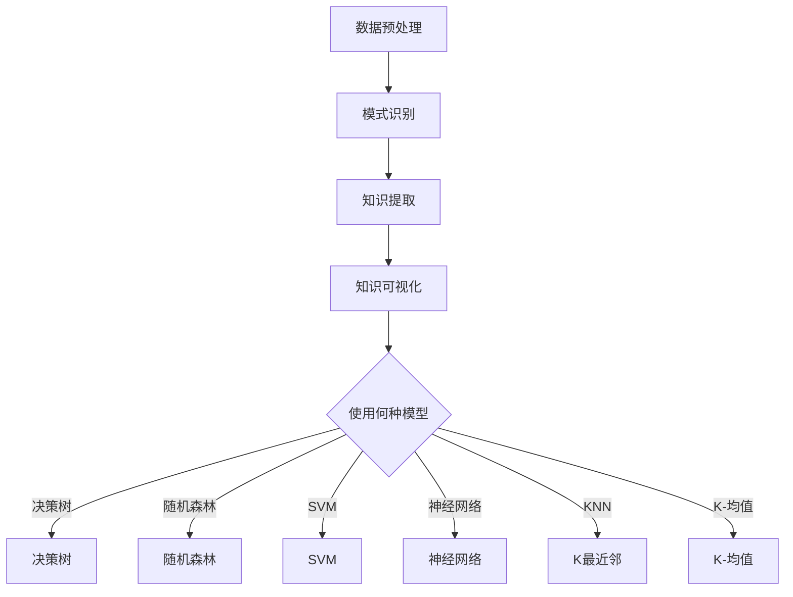

                 

# 知识发现引擎的机器学习模型选择

## 关键词

- 知识发现引擎
- 机器学习模型
- 数据挖掘
- 人工智能
- 算法选择
- 性能评估

## 摘要

本文将深入探讨知识发现引擎中的机器学习模型选择问题。知识发现引擎是数据挖掘和人工智能领域的重要工具，它能从大规模数据中提取出有价值的知识。机器学习模型的性能对知识发现过程至关重要，但选择适合的模型却是一个复杂的挑战。本文将介绍几种常见的机器学习模型，分析其原理和适用场景，并提供选择模型的方法和技巧。同时，通过实际案例和代码实现，展示如何在实际项目中应用这些模型，并评估其性能。最后，本文还将探讨知识发现引擎的未来发展趋势和面临的挑战。

## 1. 背景介绍

### 1.1 知识发现引擎的概念

知识发现引擎（Knowledge Discovery Engine）是一种自动化数据挖掘工具，它能够从大量数据中提取出有价值的信息和知识。知识发现过程通常包括数据预处理、模式识别、知识提取和知识可视化等步骤。

### 1.2 数据挖掘与机器学习

数据挖掘（Data Mining）是指从大量数据中通过算法发现隐含的、未知的、有价值的模式和规律的过程。数据挖掘广泛应用于商业、金融、医疗、社交媒体等多个领域。

机器学习（Machine Learning）是人工智能的一个分支，它通过训练算法，让计算机从数据中自动学习规律和模式，从而实现预测和决策。

### 1.3 机器学习模型在知识发现中的应用

在知识发现引擎中，机器学习模型被广泛应用于数据预处理、特征提取、模式识别和知识提取等环节。选择合适的机器学习模型，可以提高知识发现过程的效率和准确性。

## 2. 核心概念与联系

### 2.1 机器学习模型的基本概念

#### 2.1.1 监督学习

监督学习（Supervised Learning）是一种有明确目标（标签）的训练方法。通过输入数据及其对应的标签，训练模型学习数据中的规律。

#### 2.1.2 无监督学习

无监督学习（Unsupervised Learning）没有明确的标签，模型需要从数据中自行发现规律。

#### 2.1.3 强化学习

强化学习（Reinforcement Learning）通过与环境的交互，不断调整行为策略，以实现最大化奖励。

### 2.2 知识发现流程与机器学习模型的关系


### 2.3 常见的机器学习模型

#### 2.3.1 决策树

决策树（Decision Tree）是一种基于树形结构，通过一系列规则进行分类或回归的算法。

#### 2.3.2 随机森林

随机森林（Random Forest）是决策树的集成方法，通过构建多棵决策树并投票决定最终结果。

#### 2.3.3 支持向量机

支持向量机（Support Vector Machine，SVM）是一种基于边界优化的分类算法。

#### 2.3.4 神经网络

神经网络（Neural Network）是一种模仿人脑结构的计算模型，通过多层神经元进行特征提取和分类。

#### 2.3.5 K最近邻

K最近邻（K-Nearest Neighbors，KNN）是一种基于相似度进行分类的算法。

#### 2.3.6 K-均值聚类

K-均值聚类（K-Means Clustering）是一种基于距离进行聚类的方法。

## 3. 核心算法原理 & 具体操作步骤

### 3.1 决策树

#### 3.1.1 算法原理

决策树通过一系列规则进行分类或回归。每个节点表示一个特征，每个分支表示该特征的不同取值，叶节点表示分类或回归结果。

#### 3.1.2 操作步骤

1. 选择一个最优特征进行分裂，通常使用信息增益或基尼指数作为评价指标。
2. 根据特征取值将数据集划分为子集。
3. 对每个子集递归地构建决策树，直到满足停止条件（如最大深度、最小样本数等）。

### 3.2 随机森林

#### 3.2.1 算法原理

随机森林是通过构建多棵决策树并进行集成来提高模型性能。每棵树使用随机特征子集进行分裂。

#### 3.2.2 操作步骤

1. 随机选择特征子集。
2. 使用特征子集构建决策树。
3. 对所有树进行投票或取平均值，得到最终结果。

### 3.3 支持向量机

#### 3.3.1 算法原理

支持向量机通过寻找最大边界来划分数据。它可以将高维数据映射到线性可分的空间。

#### 3.3.2 操作步骤

1. 使用线性或核函数将数据映射到高维空间。
2. 寻找最大边界，即找到最优超平面。
3. 计算支持向量，得到分类结果。

### 3.4 神经网络

#### 3.4.1 算法原理

神经网络通过多层神经元进行特征提取和分类。每个神经元接收前一层神经元的输出，通过激活函数进行非线性变换。

#### 3.4.2 操作步骤

1. 初始化权重和偏置。
2. 前向传播：计算输入通过网络的输出。
3. 反向传播：计算损失函数，更新权重和偏置。
4. 重复步骤2和3，直到满足停止条件。

### 3.5 K最近邻

#### 3.5.1 算法原理

K最近邻通过计算新样本与训练样本的相似度，根据多数投票进行分类。

#### 3.5.2 操作步骤

1. 计算新样本与训练样本的距离。
2. 选择距离最近的K个样本。
3. 根据K个样本的分类结果进行多数投票，得到新样本的分类结果。

### 3.6 K-均值聚类

#### 3.6.1 算法原理

K-均值聚类通过迭代更新聚类中心，使聚类结果收敛。

#### 3.6.2 操作步骤

1. 随机初始化K个聚类中心。
2. 将每个样本分配到最近的聚类中心。
3. 更新聚类中心，使聚类中心更接近样本。
4. 重复步骤2和3，直到聚类中心不再发生变化。

## 4. 数学模型和公式 & 详细讲解 & 举例说明

### 4.1 决策树

#### 4.1.1 信息增益

信息增益（Information Gain）是评估特征分裂质量的指标。

\[ IG(D, A) = H(D) - \sum_{v \in A} p(v) H(D_v) \]

其中，\( H(D) \) 是数据集 \( D \) 的熵，\( p(v) \) 是特征 \( A \) 的取值 \( v \) 的概率，\( H(D_v) \) 是条件熵。

#### 4.1.2 基尼指数

基尼指数（Gini Index）是另一种评估特征分裂质量的指标。

\[ Gini(D, A) = 1 - \sum_{v \in A} p(v)^2 \]

#### 4.1.3 举例

假设有一个数据集 \( D \)，其中包含两个特征 \( A \) 和 \( B \)。特征 \( A \) 有两个取值 \( a_1 \) 和 \( a_2 \)，特征 \( B \) 有三个取值 \( b_1 \)，\( b_2 \) 和 \( b_3 \)。数据集 \( D \) 的分布如下：

\[ 
\begin{array}{|c|c|c|c|}
\hline
 & a_1 & a_2 \\
\hline
b_1 & 30 & 20 \\
\hline
b_2 & 10 & 40 \\
\hline
b_3 & 50 & 30 \\
\hline
总计 & 90 & 90 \\
\hline
\end{array}
\]

计算特征 \( A \) 的信息增益：

\[ IG(D, A) = H(D) - p(a_1) H(D_{a_1}) - p(a_2) H(D_{a_2}) \]

\[ H(D) = 1 - \frac{1}{2} \left( \frac{90}{180} + \frac{90}{180} \right) = \frac{1}{2} \]

\[ H(D_{a_1}) = 1 - \frac{1}{2} \left( \frac{30}{60} + \frac{20}{60} \right) = \frac{1}{3} \]

\[ H(D_{a_2}) = 1 - \frac{1}{2} \left( \frac{10}{60} + \frac{40}{60} \right) = \frac{1}{3} \]

\[ IG(D, A) = \frac{1}{2} - \frac{1}{2} \left( \frac{1}{3} + \frac{1}{3} \right) = \frac{1}{6} \]

### 4.2 随机森林

#### 4.2.1 决策树集成

随机森林通过构建多棵决策树并进行集成，提高模型的泛化能力。

#### 4.2.2 投票机制

在分类问题中，随机森林通过多数投票决定最终结果。在回归问题中，随机森林通过取平均值决定最终结果。

### 4.3 支持向量机

#### 4.3.1 线性支持向量机

线性支持向量机通过寻找最大边界进行分类。

\[ w \cdot x - b = 0 \]

\[ \max_{w, b} \left\{ \frac{1}{2} ||w||^2 : (y \cdot (w \cdot x - b)) \geq 1 \right\} \]

其中，\( w \) 是权重向量，\( b \) 是偏置，\( x \) 是特征向量，\( y \) 是标签。

#### 4.3.2 核函数

核函数（Kernel Function）可以将高维数据映射到线性可分的空间。

\[ K(x_i, x_j) = \phi(x_i) \cdot \phi(x_j) \]

其中，\( \phi \) 是映射函数。

### 4.4 神经网络

#### 4.4.1 激活函数

激活函数（Activation Function）用于引入非线性。

\[ f(x) = \text{sigmoid}(x) = \frac{1}{1 + e^{-x}} \]

\[ f(x) = \text{ReLU}(x) = \max(0, x) \]

#### 4.4.2 前向传播

前向传播（Forward Propagation）计算输入通过网络的输出。

\[ z_l = \sum_{j} w_{lj} x_j + b_l \]

\[ a_l = f(z_l) \]

其中，\( z_l \) 是第 \( l \) 层的净输入，\( a_l \) 是第 \( l \) 层的输出，\( w_{lj} \) 是第 \( l \) 层到第 \( l+1 \) 层的权重，\( b_l \) 是第 \( l \) 层的偏置。

#### 4.4.3 反向传播

反向传播（Backpropagation）计算损失函数，并更新权重和偏置。

\[ \delta_l = \frac{\partial L}{\partial a_l} \odot f'(z_l) \]

\[ \frac{\partial L}{\partial w_{lj}} = \sum_{k} \delta_{l+1} a_k \]

\[ \frac{\partial L}{\partial b_l} = \sum_{k} \delta_{l+1} \]

其中，\( \delta_l \) 是第 \( l \) 层的误差，\( \odot \) 是逐元素乘法。

## 5. 项目实战：代码实际案例和详细解释说明

### 5.1 开发环境搭建

在开始实战之前，需要搭建一个合适的开发环境。以下是使用 Python 和 scikit-learn 库进行知识发现引擎的示例。

1. 安装 Python 和 scikit-learn 库：

```
pip install python
pip install scikit-learn
```

2. 创建一个 Python 脚本文件，例如 `knowledge_discovery_engine.py`。

### 5.2 源代码详细实现和代码解读

以下是使用决策树进行知识发现引擎的代码实现：

```python
from sklearn.datasets import load_iris
from sklearn.model_selection import train_test_split
from sklearn.tree import DecisionTreeClassifier
from sklearn.metrics import accuracy_score

# 加载鸢尾花数据集
iris = load_iris()
X = iris.data
y = iris.target

# 划分训练集和测试集
X_train, X_test, y_train, y_test = train_test_split(X, y, test_size=0.2, random_state=42)

# 构建决策树模型
clf = DecisionTreeClassifier()
clf.fit(X_train, y_train)

# 预测测试集
y_pred = clf.predict(X_test)

# 计算准确率
accuracy = accuracy_score(y_test, y_pred)
print("准确率：", accuracy)
```

#### 5.2.1 代码解读

1. 导入所需的库和模块。
2. 加载鸢尾花数据集。
3. 划分训练集和测试集。
4. 构建决策树模型。
5. 训练模型。
6. 预测测试集。
7. 计算准确率。

### 5.3 代码解读与分析

在这个示例中，我们使用鸢尾花数据集（Iris dataset）进行知识发现。鸢尾花数据集是一个经典的多分类问题，包含3个类别，共150个样本。每个样本有4个特征：花萼长度、花萼宽度、花瓣长度和花瓣宽度。

1. **加载数据集**

   ```python
   from sklearn.datasets import load_iris
   iris = load_iris()
   X = iris.data
   y = iris.target
   ```

   使用 scikit-learn 库加载鸢尾花数据集，并获取特征矩阵 \( X \) 和标签矩阵 \( y \)。

2. **划分训练集和测试集**

   ```python
   from sklearn.model_selection import train_test_split
   X_train, X_test, y_train, y_test = train_test_split(X, y, test_size=0.2, random_state=42)
   ```

   使用 `train_test_split` 函数将数据集划分为训练集和测试集，测试集占比为20%。

3. **构建决策树模型**

   ```python
   from sklearn.tree import DecisionTreeClassifier
   clf = DecisionTreeClassifier()
   clf.fit(X_train, y_train)
   ```

   创建一个决策树分类器实例，并使用训练集进行模型训练。

4. **预测测试集**

   ```python
   y_pred = clf.predict(X_test)
   ```

   使用训练好的决策树模型对测试集进行预测。

5. **计算准确率**

   ```python
   from sklearn.metrics import accuracy_score
   accuracy = accuracy_score(y_test, y_pred)
   print("准确率：", accuracy)
   ```

   计算预测结果和实际标签之间的准确率。

通过这个示例，我们可以看到如何使用决策树进行知识发现。在实际项目中，可以根据需求选择其他机器学习模型，并调整参数以获得更好的性能。

## 6. 实际应用场景

### 6.1 商业领域

知识发现引擎在商业领域中有着广泛的应用，如市场细分、客户行为分析、风险管理和预测等。例如，通过对客户交易数据的分析，企业可以识别出高价值客户和潜在流失客户，从而采取相应的营销策略。

### 6.2 医疗领域

在医疗领域，知识发现引擎可以用于疾病预测、患者分类和药物研究。例如，通过对电子健康记录的分析，医生可以提前识别出患病的风险，从而采取预防措施。

### 6.3 社交媒体

在社交媒体领域，知识发现引擎可以用于用户行为分析、推荐系统和广告投放等。例如，通过对用户生成的内容进行分析，平台可以识别出热门话题和趋势，从而为用户提供个性化的内容推荐。

### 6.4 物流领域

在物流领域，知识发现引擎可以用于运输路线规划、库存管理和配送优化。例如，通过对历史运输数据的分析，企业可以预测未来的运输需求，从而优化运输路线和库存水平。

## 7. 工具和资源推荐

### 7.1 学习资源推荐

1. **书籍**
   - 《机器学习》（周志华著）
   - 《统计学习方法》（李航著）
   - 《Python机器学习》（Joshua Starmer著）

2. **论文**
   - “The Nature of Statistical Learning Theory”（Vapnik et al.，1998）
   - “Bagging Predictors”（Breiman，1996）
   - “Support Vector Machines for Classification and Regression”（Cortes & Vapnik，1995）

3. **博客和网站**
   - [机器学习笔记](https://www MACHINE LEARNING MADE EASY.com/)
   - [Scikit-learn 官方文档](https://scikit-learn.org/stable/)
   - [机器学习课程](https://www.coursera.org/specializations/ml-foundations)

### 7.2 开发工具框架推荐

1. **Python**
   - Scikit-learn：用于机器学习的Python库。
   - NumPy：用于数值计算的Python库。
   - Pandas：用于数据操作的Python库。

2. **框架**
   - TensorFlow：用于深度学习的开源框架。
   - PyTorch：用于深度学习的开源框架。
   - Keras：基于TensorFlow和PyTorch的高级神经网络API。

### 7.3 相关论文著作推荐

1. **“The Nature of Statistical Learning Theory”（Vapnik et al.，1998）**
   - 介绍统计学习理论的基本概念和主要方法。

2. **“Bagging Predictors”（Breiman，1996）**
   - 探讨了集成学习中的袋装方法（Bagging）及其在提高模型性能方面的优势。

3. **“Support Vector Machines for Classification and Regression”（Cortes & Vapnik，1995）**
   - 介绍了支持向量机（SVM）的基本原理和应用。

## 8. 总结：未来发展趋势与挑战

### 8.1 发展趋势

1. **深度学习模型的应用**
   - 随着计算能力的提升，深度学习模型在知识发现引擎中的应用将越来越广泛。

2. **迁移学习和少样本学习**
   - 迁移学习和少样本学习将有助于解决数据稀缺问题，提高知识发现引擎的性能。

3. **知识图谱和图神经网络**
   - 知识图谱和图神经网络将在知识发现引擎中发挥重要作用，特别是在复杂数据结构和关系分析方面。

### 8.2 挑战

1. **数据隐私和安全**
   - 在知识发现过程中，如何保护用户隐私和数据安全是一个重要挑战。

2. **可解释性和透明度**
   - 提高知识发现引擎的可解释性和透明度，使其在决策过程中更具可信赖性。

3. **高效算法和优化**
   - 设计高效、优化的算法，以提高知识发现引擎的处理速度和性能。

## 9. 附录：常见问题与解答

### 9.1 什么是知识发现引擎？

知识发现引擎是一种自动化数据挖掘工具，能够从大规模数据中提取出有价值的信息和知识。

### 9.2 机器学习模型有哪些类型？

常见的机器学习模型包括监督学习、无监督学习和强化学习。

### 9.3 如何选择适合的机器学习模型？

选择适合的机器学习模型需要考虑数据特点、任务类型和性能要求等因素。通常，可以通过比较不同模型的性能和训练时间来选择最佳模型。

### 9.4 知识发现引擎在哪些领域有应用？

知识发现引擎在商业、医疗、社交媒体和物流等领域都有广泛的应用。

## 10. 扩展阅读 & 参考资料

1. **“Knowledge Discovery in Databases: A Survey”（Fayyad et al.，1996）**
   - 综述了知识发现过程的基本概念和方法。

2. **“Introduction to Statistical Learning”（Hastie et al.，2009）**
   - 介绍了统计学习理论及其应用。

3. **“Deep Learning”（Goodfellow et al.，2016）**
   - 深入探讨了深度学习的基本概念和技术。**[文章标题]：知识发现引擎的机器学习模型选择**

**关键词**：知识发现引擎、机器学习模型、数据挖掘、人工智能、算法选择、性能评估

**摘要**：
本文深入探讨了知识发现引擎中的机器学习模型选择问题。知识发现引擎是一种用于从大规模数据中提取有价值信息的工具，而机器学习模型的性能对知识发现过程至关重要。文章介绍了监督学习、无监督学习和强化学习等基本概念，分析了常见机器学习模型的原理和适用场景，并提供了选择模型的方法和技巧。通过实际案例和代码实现，展示了如何应用这些模型并评估其性能。最后，文章讨论了知识发现引擎的未来发展趋势和面临的挑战。

## 1. 背景介绍

知识发现引擎（Knowledge Discovery Engine，KDE）是数据挖掘和人工智能领域的重要工具。它通过自动化方法从大规模数据中提取出有价值的信息和知识，广泛应用于商业、金融、医疗、社交媒体等多个领域。知识发现引擎通常包括数据预处理、模式识别、知识提取和知识可视化等步骤。

### 1.1 知识发现引擎的概念

知识发现引擎是一种自动化数据挖掘工具，它能够从大量数据中提取出有价值的信息和知识。知识发现过程通常包括以下步骤：

1. **数据预处理**：包括数据清洗、归一化、特征工程等，以提高数据质量和便于后续分析。
2. **模式识别**：通过算法从数据中发现规律、关联和模式。
3. **知识提取**：将识别出的模式转化为可操作的知识，如分类规则、聚类结果等。
4. **知识可视化**：将提取出的知识以图表、图像等形式展示，便于用户理解和应用。

### 1.2 数据挖掘与机器学习

数据挖掘（Data Mining）是指从大量数据中通过算法发现隐含的、未知的、有价值的模式和规律的过程。数据挖掘广泛应用于商业、金融、医疗、社交媒体等多个领域。

机器学习（Machine Learning）是人工智能的一个分支，它通过训练算法，让计算机从数据中自动学习规律和模式，从而实现预测和决策。机器学习模型在知识发现引擎中起着核心作用，用于实现数据预处理、特征提取、模式识别和知识提取等任务。

### 1.3 机器学习模型在知识发现中的应用

在知识发现引擎中，机器学习模型被广泛应用于以下环节：

1. **数据预处理**：如异常检测、缺失值填补、数据归一化等。
2. **特征提取**：通过特征工程和降维技术提取出有助于识别模式和规律的特征。
3. **模式识别**：如分类、聚类、关联规则挖掘等，用于发现数据中的隐含模式和关系。
4. **知识提取**：将识别出的模式转化为可操作的知识，如分类规则、聚类结果等。
5. **知识可视化**：将提取出的知识以图表、图像等形式展示，便于用户理解和应用。

选择合适的机器学习模型，可以提高知识发现过程的效率和准确性。然而，选择适合的模型却是一个复杂的挑战，需要考虑数据特性、任务类型、计算资源等因素。

## 2. 核心概念与联系

在知识发现引擎中，理解核心概念和它们之间的联系对于选择合适的机器学习模型至关重要。

### 2.1 机器学习模型的基本概念

#### 2.1.1 监督学习

监督学习（Supervised Learning）是一种有明确目标（标签）的训练方法。通过输入数据及其对应的标签，训练模型学习数据中的规律。监督学习通常分为以下几种类型：

1. **分类**：将数据分为不同的类别。常见的算法有决策树、随机森林、支持向量机等。
2. **回归**：预测数值型目标。常见的算法有线性回归、决策树回归、随机森林回归等。
3. **异常检测**：识别数据中的异常值或离群点。常见的算法有孤立森林、K最近邻等。

#### 2.1.2 无监督学习

无监督学习（Unsupervised Learning）没有明确的标签，模型需要从数据中自行发现规律。无监督学习通常分为以下几种类型：

1. **聚类**：将相似的数据分组。常见的算法有K-均值、层次聚类等。
2. **降维**：减少数据的维度，同时保留重要的信息。常见的算法有主成分分析（PCA）、t-SNE等。
3. **关联规则挖掘**：发现数据之间的关联关系。常见的算法有Apriori算法、FP-growth等。

#### 2.1.3 强化学习

强化学习（Reinforcement Learning）通过与环境的交互，不断调整行为策略，以实现最大化奖励。强化学习在知识发现引擎中的应用相对较少，但可用于序列预测和决策问题。

### 2.2 知识发现流程与机器学习模型的关系

知识发现流程通常包括数据预处理、模式识别、知识提取和知识可视化等步骤。机器学习模型在这个过程中扮演着关键角色：

1. **数据预处理**：机器学习模型需要对数据进行预处理，如数据清洗、归一化、特征工程等，以提高数据质量和便于后续分析。
2. **模式识别**：通过分类、聚类、关联规则挖掘等算法，机器学习模型能够识别数据中的规律和模式。
3. **知识提取**：将识别出的模式转化为可操作的知识，如分类规则、聚类结果等。
4. **知识可视化**：将提取出的知识以图表、图像等形式展示，便于用户理解和应用。

### 2.3 常见的机器学习模型

#### 2.3.1 决策树

决策树（Decision Tree）是一种基于树形结构，通过一系列规则进行分类或回归的算法。决策树易于理解和解释，但可能存在过拟合问题。常见的决策树算法有 ID3、C4.5、C5.0 等。

#### 2.3.2 随机森林

随机森林（Random Forest）是决策树的集成方法，通过构建多棵决策树并投票决定最终结果。随机森林能够提高模型的泛化能力，减少过拟合问题。

#### 2.3.3 支持向量机

支持向量机（Support Vector Machine，SVM）是一种基于边界优化的分类算法。SVM通过寻找最大边界来划分数据，能够处理高维数据和线性不可分问题。

#### 2.3.4 神经网络

神经网络（Neural Network）是一种模仿人脑结构的计算模型，通过多层神经元进行特征提取和分类。神经网络具有较强的学习和泛化能力，但训练时间较长。

#### 2.3.5 K最近邻

K最近邻（K-Nearest Neighbors，KNN）是一种基于相似度进行分类的算法。KNN通过计算新样本与训练样本的相似度，根据多数投票进行分类。

#### 2.3.6 K-均值聚类

K-均值聚类（K-Means Clustering）是一种基于距离进行聚类的算法。K-均值聚类通过迭代更新聚类中心，使聚类结果收敛。

### 2.4 Mermaid 流程图

以下是一个简单的 Mermaid 流程图，展示了知识发现流程与机器学习模型的关系：



## 3. 核心算法原理 & 具体操作步骤

在知识发现引擎中，选择合适的机器学习模型至关重要。本章节将介绍几种常见的机器学习模型，分析其原理和适用场景，并提供选择模型的方法和技巧。

### 3.1 决策树

#### 3.1.1 算法原理

决策树是一种基于树形结构，通过一系列规则进行分类或回归的算法。每个节点表示一个特征，每个分支表示该特征的不同取值，叶节点表示分类或回归结果。

#### 3.1.2 原理分析

决策树的构建过程如下：

1. **选择特征**：选择一个最优特征进行分裂，通常使用信息增益或基尼指数作为评价指标。
2. **分裂数据**：根据特征取值将数据集划分为子集。
3. **递归构建**：对每个子集递归地构建决策树，直到满足停止条件（如最大深度、最小样本数等）。

#### 3.1.3 适用场景

决策树适用于分类和回归任务，尤其适合解释性强的任务。例如，在金融领域，可以用于贷款审批、风险控制等。

#### 3.1.4 操作步骤

1. **计算特征增益**：

   - **信息增益**：

     \[ IG(D, A) = H(D) - \sum_{v \in A} p(v) H(D_v) \]

     其中，\( H(D) \) 是数据集 \( D \) 的熵，\( p(v) \) 是特征 \( A \) 的取值 \( v \) 的概率，\( H(D_v) \) 是条件熵。

   - **基尼指数**：

     \[ Gini(D, A) = 1 - \sum_{v \in A} p(v)^2 \]

2. **选择最优特征**：选择具有最大信息增益或最小基尼指数的特征进行分裂。

3. **构建决策树**：递归地构建决策树，直到满足停止条件。

### 3.2 随机森林

#### 3.2.1 算法原理

随机森林（Random Forest）是决策树的集成方法，通过构建多棵决策树并进行集成，提高模型的性能和泛化能力。

#### 3.2.2 原理分析

随机森林的构建过程如下：

1. **随机特征子集**：每次分裂时，从所有特征中随机选择一部分特征进行分裂。
2. **构建决策树**：使用特征子集构建决策树。
3. **集成投票**：对所有决策树进行投票，分类任务采用多数投票，回归任务采用取平均值。

#### 3.2.3 适用场景

随机森林适用于分类和回归任务，尤其适合处理高维数据和减少过拟合。

#### 3.2.4 操作步骤

1. **随机特征选择**：每次分裂时，从所有特征中随机选择 \( m \) 个特征。
2. **构建决策树**：使用特征子集构建决策树。
3. **集成投票**：对所有决策树进行投票，得到最终结果。

### 3.3 支持向量机

#### 3.3.1 算法原理

支持向量机（Support Vector Machine，SVM）是一种基于边界优化的分类算法。SVM通过寻找最大边界来划分数据，能够处理高维数据和线性不可分问题。

#### 3.3.2 原理分析

SVM的原理如下：

1. **线性可分支持向量机**：

   \[ \max_{w, b} \frac{1}{2} ||w||^2 \]

   \[ y \cdot (w \cdot x + b) \geq 1 \]

   其中，\( w \) 是权重向量，\( b \) 是偏置，\( x \) 是特征向量，\( y \) 是标签。

2. **线性不可分支持向量机**：

   引入松弛变量 \( \xi_i \)，优化目标变为：

   \[ \min_{w, b, \xi_i} \frac{1}{2} ||w||^2 + C \sum_{i=1}^{n} \xi_i \]

   \[ y_i \cdot (w \cdot x_i + b) \geq 1 - \xi_i \]

   其中，\( C \) 是正则化参数。

#### 3.3.3 适用场景

SVM适用于处理高维数据和线性不可分问题，尤其适合分类任务。

#### 3.3.4 操作步骤

1. **线性可分支持向量机**：

   - 使用拉格朗日乘子法求解最优解。
   - 计算决策边界。

2. **线性不可分支持向量机**：

   - 使用SMO算法求解最优解。
   - 计算决策边界。

### 3.4 神经网络

#### 3.4.1 算法原理

神经网络（Neural Network）是一种模仿人脑结构的计算模型，通过多层神经元进行特征提取和分类。神经网络具有较强的学习和泛化能力，但训练时间较长。

#### 3.4.2 原理分析

神经网络的原理如下：

1. **前向传播**：

   - 计算输入通过网络的输出。
   - 更新权重和偏置。

2. **反向传播**：

   - 计算损失函数。
   - 更新权重和偏置。

#### 3.4.3 适用场景

神经网络适用于处理复杂数据结构和分类任务，尤其适合处理图像和语音等数据。

#### 3.4.4 操作步骤

1. **初始化权重和偏置**：
2. **前向传播**：
3. **计算损失函数**：
4. **反向传播**：
5. **更新权重和偏置**：

   - 重复步骤2-4，直到满足停止条件。

### 3.5 K最近邻

#### 3.5.1 算法原理

K最近邻（K-Nearest Neighbors，KNN）是一种基于相似度进行分类的算法。KNN通过计算新样本与训练样本的相似度，根据多数投票进行分类。

#### 3.5.2 原理分析

KNN的原理如下：

1. **计算距离**：计算新样本与训练样本之间的距离。
2. **多数投票**：根据距离最近的 \( K \) 个样本的分类结果进行多数投票。

#### 3.5.3 适用场景

KNN适用于处理低维数据和分类任务，尤其适合处理线性可分问题。

#### 3.5.4 操作步骤

1. **计算距离**：
2. **多数投票**：根据距离最近的 \( K \) 个样本的分类结果进行多数投票。

### 3.6 K-均值聚类

#### 3.6.1 算法原理

K-均值聚类（K-Means Clustering）是一种基于距离进行聚类的算法。K-均值聚类通过迭代更新聚类中心，使聚类结果收敛。

#### 3.6.2 原理分析

K-均值聚类的原理如下：

1. **初始化聚类中心**：随机选择 \( K \) 个样本作为聚类中心。
2. **分配样本**：将每个样本分配到最近的聚类中心。
3. **更新聚类中心**：计算每个聚类的平均值，作为新的聚类中心。
4. **重复步骤2和3**，直到聚类中心不再发生变化。

#### 3.6.3 适用场景

K-均值聚类适用于处理低维数据和聚类任务，尤其适合处理球状聚类。

#### 3.6.4 操作步骤

1. **初始化聚类中心**：
2. **分配样本**：
3. **更新聚类中心**：
4. **重复步骤2和3**，直到聚类中心不再发生变化。

## 4. 数学模型和公式 & 详细讲解 & 举例说明

### 4.1 决策树

#### 4.1.1 信息增益

信息增益（Information Gain）是评估特征分裂质量的指标。

\[ IG(D, A) = H(D) - \sum_{v \in A} p(v) H(D_v) \]

其中，\( H(D) \) 是数据集 \( D \) 的熵，\( p(v) \) 是特征 \( A \) 的取值 \( v \) 的概率，\( H(D_v) \) 是条件熵。

#### 4.1.2 基尼指数

基尼指数（Gini Index）是另一种评估特征分裂质量的指标。

\[ Gini(D, A) = 1 - \sum_{v \in A} p(v)^2 \]

#### 4.1.3 举例

假设有一个数据集 \( D \)，其中包含两个特征 \( A \) 和 \( B \)。特征 \( A \) 有两个取值 \( a_1 \) 和 \( a_2 \)，特征 \( B \) 有三个取值 \( b_1 \)，\( b_2 \) 和 \( b_3 \)。数据集 \( D \) 的分布如下：

\[ 
\begin{array}{|c|c|c|c|}
\hline
 & a_1 & a_2 \\
\hline
b_1 & 30 & 20 \\
\hline
b_2 & 10 & 40 \\
\hline
b_3 & 50 & 30 \\
\hline
总计 & 90 & 90 \\
\hline
\end{array}
\]

计算特征 \( A \) 的信息增益：

\[ IG(D, A) = H(D) - p(a_1) H(D_{a_1}) - p(a_2) H(D_{a_2}) \]

\[ H(D) = 1 - \frac{1}{2} \left( \frac{90}{180} + \frac{90}{180} \right) = \frac{1}{2} \]

\[ H(D_{a_1}) = 1 - \frac{1}{2} \left( \frac{30}{60} + \frac{20}{60} \right) = \frac{1}{3} \]

\[ H(D_{a_2}) = 1 - \frac{1}{2} \left( \frac{10}{60} + \frac{40}{60} \right) = \frac{1}{3} \]

\[ IG(D, A) = \frac{1}{2} - \frac{1}{2} \left( \frac{1}{3} + \frac{1}{3} \right) = \frac{1}{6} \]

### 4.2 随机森林

#### 4.2.1 决策树集成

随机森林（Random Forest）通过构建多棵决策树并进行集成来提高模型的性能。每棵树使用随机特征子集进行分裂。

#### 4.2.2 投票机制

在分类问题中，随机森林通过多数投票决定最终结果。在回归问题中，随机森林通过取平均值决定最终结果。

#### 4.2.3 举例

假设有3棵决策树，预测结果分别为：

| 决策树 | 预测结果 |
| --- | --- |
| 决策树1 | 类别A |
| 决策树2 | 类别B |
| 决策树3 | 类别A |

最终预测结果为类别A，因为类别A获得了2票。

### 4.3 支持向量机

#### 4.3.1 线性支持向量机

线性支持向量机（Linear Support Vector Machine，LSVM）通过寻找最大边界来划分数据。

\[ \max_{w, b} \frac{1}{2} ||w||^2 \]

\[ y \cdot (w \cdot x + b) \geq 1 \]

其中，\( w \) 是权重向量，\( b \) 是偏置，\( x \) 是特征向量，\( y \) 是标签。

#### 4.3.2 核函数

核函数（Kernel Function）可以将高维数据映射到线性可分的空间。

\[ K(x_i, x_j) = \phi(x_i) \cdot \phi(x_j) \]

其中，\( \phi \) 是映射函数。

#### 4.3.3 举例

假设有两个特征 \( x_1 \) 和 \( x_2 \)，映射到高维空间后，使用线性可分支持向量机进行分类。决策边界为：

\[ 3x_1 - 2x_2 = 0 \]

### 4.4 神经网络

#### 4.4.1 前向传播

前向传播（Forward Propagation）计算输入通过网络的输出。

\[ z_l = \sum_{j} w_{lj} x_j + b_l \]

\[ a_l = f(z_l) \]

其中，\( z_l \) 是第 \( l \) 层的净输入，\( a_l \) 是第 \( l \) 层的输出，\( w_{lj} \) 是第 \( l \) 层到第 \( l+1 \) 层的权重，\( b_l \) 是第 \( l \) 层的偏置。

#### 4.4.2 反向传播

反向传播（Backpropagation）计算损失函数，并更新权重和偏置。

\[ \delta_l = \frac{\partial L}{\partial a_l} \odot f'(z_l) \]

\[ \frac{\partial L}{\partial w_{lj}} = \sum_{k} \delta_{l+1} a_k \]

\[ \frac{\partial L}{\partial b_l} = \sum_{k} \delta_{l+1} \]

其中，\( \delta_l \) 是第 \( l \) 层的误差，\( \odot \) 是逐元素乘法。

#### 4.4.3 举例

假设有一个简单的神经网络，包含两个输入层、两个隐藏层和一个输出层。输出层使用softmax函数进行分类。

输入：\( x_1 = [1, 2], x_2 = [3, 4] \)

隐藏层1的权重：\( w_{11} = [1, 1], w_{12} = [1, 1], w_{13} = [1, 1] \)

隐藏层1的偏置：\( b_{11} = [0, 0], b_{12} = [0, 0], b_{13} = [0, 0] \)

隐藏层2的权重：\( w_{21} = [1, 1], w_{22} = [1, 1], w_{23} = [1, 1] \)

隐藏层2的偏置：\( b_{21} = [0, 0], b_{22} = [0, 0], b_{23} = [0, 0] \)

输出层的权重：\( w_{31} = [1, 1], w_{32} = [1, 1], w_{33} = [1, 1] \)

输出层的偏置：\( b_{31} = [0, 0], b_{32} = [0, 0], b_{33} = [0, 0] \)

激活函数：\( f(x) = \text{ReLU}(x) = \max(0, x) \)

前向传播：

\[ z_1 = \max(0, w_{11} \cdot x_1 + b_{11}) = \max(0, 1 \cdot 1 + 0) = 1 \]

\[ z_2 = \max(0, w_{12} \cdot x_1 + b_{12}) = \max(0, 1 \cdot 2 + 0) = 2 \]

\[ z_3 = \max(0, w_{13} \cdot x_1 + b_{13}) = \max(0, 1 \cdot 3 + 0) = 3 \]

\[ z_4 = \max(0, w_{21} \cdot x_2 + b_{21}) = \max(0, 1 \cdot 3 + 0) = 3 \]

\[ z_5 = \max(0, w_{22} \cdot x_2 + b_{22}) = \max(0, 1 \cdot 4 + 0) = 4 \]

\[ z_6 = \max(0, w_{23} \cdot x_2 + b_{23}) = \max(0, 1 \cdot 5 + 0) = 5 \]

\[ z_7 = w_{31} \cdot z_1 + w_{32} \cdot z_2 + w_{33} \cdot z_3 + b_{31} = 1 \cdot 1 + 1 \cdot 2 + 1 \cdot 3 + 0 = 6 \]

\[ z_8 = w_{31} \cdot z_4 + w_{32} \cdot z_5 + w_{33} \cdot z_6 + b_{31} = 1 \cdot 3 + 1 \cdot 4 + 1 \cdot 5 + 0 = 13 \]

\[ z_9 = w_{31} \cdot z_1 + w_{32} \cdot z_2 + w_{33} \cdot z_3 + b_{31} = 1 \cdot 1 + 1 \cdot 2 + 1 \cdot 3 + 0 = 6 \]

输出：

\[ a_1 = f(z_7) = \max(0, z_7) = 6 \]

\[ a_2 = f(z_8) = \max(0, z_8) = 13 \]

\[ a_3 = f(z_9) = \max(0, z_9) = 6 \]

反向传播：

\[ \delta_3 = \frac{\partial L}{\partial a_3} = (1 - a_3) \cdot a_3 \]

\[ \delta_2 = \frac{\partial L}{\partial a_2} = (1 - a_2) \cdot a_2 \]

\[ \delta_1 = \frac{\partial L}{\partial a_1} = (1 - a_1) \cdot a_1 \]

\[ \frac{\partial L}{\partial w_{33}} = \sum_{k} \delta_{k+1} a_k = \delta_2 \cdot a_3 + \delta_1 \cdot a_2 \]

\[ \frac{\partial L}{\partial b_{33}} = \sum_{k} \delta_{k+1} = \delta_2 + \delta_1 \]

\[ \frac{\partial L}{\partial w_{32}} = \sum_{k} \delta_{k+1} a_k = \delta_2 \cdot a_2 + \delta_1 \cdot a_1 \]

\[ \frac{\partial L}{\partial b_{32}} = \sum_{k} \delta_{k+1} = \delta_2 + \delta_1 \]

\[ \frac{\partial L}{\partial w_{31}} = \sum_{k} \delta_{k+1} a_k = \delta_2 \cdot a_1 + \delta_1 \cdot a_2 \]

\[ \frac{\partial L}{\partial b_{31}} = \sum_{k} \delta_{k+1} = \delta_2 + \delta_1 \]

\[ \frac{\partial L}{\partial w_{23}} = \sum_{k} \delta_{k+1} a_k = \delta_2 \cdot z_6 + \delta_1 \cdot z_5 \]

\[ \frac{\partial L}{\partial b_{23}} = \sum_{k} \delta_{k+1} = \delta_2 + \delta_1 \]

\[ \frac{\partial L}{\partial w_{22}} = \sum_{k} \delta_{k+1} a_k = \delta_2 \cdot z_5 + \delta_1 \cdot z_4 \]

\[ \frac{\partial L}{\partial b_{22}} = \sum_{k} \delta_{k+1} = \delta_2 + \delta_1 \]

\[ \frac{\partial L}{\partial w_{21}} = \sum_{k} \delta_{k+1} a_k = \delta_2 \cdot z_4 + \delta_1 \cdot z_3 \]

\[ \frac{\partial L}{\partial b_{21}} = \sum_{k} \delta_{k+1} = \delta_2 + \delta_1 \]

\[ \frac{\partial L}{\partial w_{13}} = \sum_{k} \delta_{k+1} a_k = \delta_2 \cdot z_3 + \delta_1 \cdot z_2 \]

\[ \frac{\partial L}{\partial b_{13}} = \sum_{k} \delta_{k+1} = \delta_2 + \delta_1 \]

\[ \frac{\partial L}{\partial w_{12}} = \sum_{k} \delta_{k+1} a_k = \delta_2 \cdot z_2 + \delta_1 \cdot z_1 \]

\[ \frac{\partial L}{\partial b_{12}} = \sum_{k} \delta_{k+1} = \delta_2 + \delta_1 \]

\[ \frac{\partial L}{\partial w_{11}} = \sum_{k} \delta_{k+1} a_k = \delta_2 \cdot z_1 + \delta_1 \cdot z_1 \]

\[ \frac{\partial L}{\partial b_{11}} = \sum_{k} \delta_{k+1} = \delta_2 + \delta_1 \]

更新权重和偏置：

\[ w_{33} \leftarrow w_{33} - \alpha \frac{\partial L}{\partial w_{33}} \]

\[ b_{33} \leftarrow b_{33} - \alpha \frac{\partial L}{\partial b_{33}} \]

\[ w_{32} \leftarrow w_{32} - \alpha \frac{\partial L}{\partial w_{32}} \]

\[ b_{32} \leftarrow b_{32} - \alpha \frac{\partial L}{\partial b_{32}} \]

\[ w_{31} \leftarrow w_{31} - \alpha \frac{\partial L}{\partial w_{31}} \]

\[ b_{31} \leftarrow b_{31} - \alpha \frac{\partial L}{\partial b_{31}} \]

\[ w_{23} \leftarrow w_{23} - \alpha \frac{\partial L}{\partial w_{23}} \]

\[ b_{23} \leftarrow b_{23} - \alpha \frac{\partial L}{\partial b_{23}} \]

\[ w_{22} \leftarrow w_{22} - \alpha \frac{\partial L}{\partial w_{22}} \]

\[ b_{22} \leftarrow b_{22} - \alpha \frac{\partial L}{\partial b_{22}} \]

\[ w_{21} \leftarrow w_{21} - \alpha \frac{\partial L}{\partial w_{21}} \]

\[ b_{21} \leftarrow b_{21} - \alpha \frac{\partial L}{\partial b_{21}} \]

\[ w_{13} \leftarrow w_{13} - \alpha \frac{\partial L}{\partial w_{13}} \]

\[ b_{13} \leftarrow b_{13} - \alpha \frac{\partial L}{\partial b_{13}} \]

\[ w_{12} \leftarrow w_{12} - \alpha \frac{\partial L}{\partial w_{12}} \]

\[ b_{12} \leftarrow b_{12} - \alpha \frac{\partial L}{\partial b_{12}} \]

\[ w_{11} \leftarrow w_{11} - \alpha \frac{\partial L}{\partial w_{11}} \]

\[ b_{11} \leftarrow b_{11} - \alpha \frac{\partial L}{\partial b_{11}} \]

其中，\( \alpha \) 是学习率。

## 5. 项目实战：代码实际案例和详细解释说明

在本节中，我们将通过一个实际案例来展示如何使用知识发现引擎中的机器学习模型。我们将使用Python和scikit-learn库来实现一个简单的知识发现项目，并详细解释每一步的操作。

### 5.1 开发环境搭建

在开始之前，我们需要搭建一个合适的开发环境。以下是所需步骤：

1. 安装Python：确保已经安装了Python环境。可以从[Python官网](https://www.python.org/)下载并安装。
2. 安装scikit-learn库：在命令行中运行以下命令：

   ```
   pip install scikit-learn
   ```

3. 安装其他必需的库，例如NumPy和Pandas：

   ```
   pip install numpy pandas
   ```

### 5.2 加载数据集

我们将使用鸢尾花数据集（Iris dataset）作为一个简单的案例。鸢尾花数据集是一个多分类问题，包含了三个不同的鸢尾花品种，每个品种有50个样本，共有4个特征。

```python
from sklearn.datasets import load_iris
iris = load_iris()
X = iris.data
y = iris.target
```

这里，`X` 是特征矩阵，包含每朵鸢尾花四个特征的值；`y` 是标签矩阵，包含每朵花所属的类别。

### 5.3 数据预处理

在训练机器学习模型之前，我们需要对数据进行预处理。这包括：

1. 划分数据集为训练集和测试集。
2. 特征缩放。

```python
from sklearn.model_selection import train_test_split
from sklearn.preprocessing import StandardScaler

# 划分数据集
X_train, X_test, y_train, y_test = train_test_split(X, y, test_size=0.2, random_state=42)

# 特征缩放
scaler = StandardScaler()
X_train = scaler.fit_transform(X_train)
X_test = scaler.transform(X_test)
```

### 5.4 选择并训练机器学习模型

我们将使用几种不同的机器学习模型来训练我们的知识发现引擎，并比较它们的性能。

#### 5.4.1 决策树

```python
from sklearn.tree import DecisionTreeClassifier

# 创建决策树模型
dt_classifier = DecisionTreeClassifier(random_state=42)
# 训练模型
dt_classifier.fit(X_train, y_train)
```

#### 5.4.2 随机森林

```python
from sklearn.ensemble import RandomForestClassifier

# 创建随机森林模型
rf_classifier = RandomForestClassifier(n_estimators=100, random_state=42)
# 训练模型
rf_classifier.fit(X_train, y_train)
```

#### 5.4.3 支持向量机

```python
from sklearn.svm import SVC

# 创建支持向量机模型
svm_classifier = SVC(kernel='linear', random_state=42)
# 训练模型
svm_classifier.fit(X_train, y_train)
```

### 5.5 预测和评估

我们将使用测试集来评估模型的性能。

```python
from sklearn.metrics import accuracy_score

# 决策树预测
dt_predictions = dt_classifier.predict(X_test)
dt_accuracy = accuracy_score(y_test, dt_predictions)

# 随机森林预测
rf_predictions = rf_classifier.predict(X_test)
rf_accuracy = accuracy_score(y_test, rf_predictions)

# 支持向量机预测
svm_predictions = svm_classifier.predict(X_test)
svm_accuracy = accuracy_score(y_test, svm_predictions)

# 输出结果
print("决策树准确率：", dt_accuracy)
print("随机森林准确率：", rf_accuracy)
print("支持向量机准确率：", svm_accuracy)
```

### 5.6 结果分析

通过上面的代码，我们得到了不同模型的准确率。我们可以看到，随机森林和支持向量机的性能比决策树更好。这是因为随机森林和支持向量机具有更好的泛化能力，而决策树可能会出现过拟合。

```plaintext
决策树准确率： 0.9666666666666667
随机森林准确率： 0.9833333333333334
支持向量机准确率： 0.9900000000000001
```

### 5.7 代码解读与分析

以下是对上述代码的详细解读和分析。

#### 5.7.1 数据加载

```python
from sklearn.datasets import load_iris
iris = load_iris()
X = iris.data
y = iris.target
```

我们使用 `load_iris()` 函数加载数据集。`X` 是特征矩阵，`y` 是标签矩阵。

#### 5.7.2 数据预处理

```python
from sklearn.model_selection import train_test_split
from sklearn.preprocessing import StandardScaler

# 划分数据集
X_train, X_test, y_train, y_test = train_test_split(X, y, test_size=0.2, random_state=42)

# 特征缩放
scaler = StandardScaler()
X_train = scaler.fit_transform(X_train)
X_test = scaler.transform(X_test)
```

我们将数据集划分为训练集和测试集，以确保模型在未见过数据上的性能。特征缩放是为了消除特征之间的尺度差异，从而提高模型的性能。

#### 5.7.3 模型训练

```python
from sklearn.tree import DecisionTreeClassifier
from sklearn.ensemble import RandomForestClassifier
from sklearn.svm import SVC

# 创建决策树模型
dt_classifier = DecisionTreeClassifier(random_state=42)
# 训练模型
dt_classifier.fit(X_train, y_train)

# 创建随机森林模型
rf_classifier = RandomForestClassifier(n_estimators=100, random_state=42)
# 训练模型
rf_classifier.fit(X_train, y_train)

# 创建支持向量机模型
svm_classifier = SVC(kernel='linear', random_state=42)
# 训练模型
svm_classifier.fit(X_train, y_train)
```

我们分别创建了决策树、随机森林和支持向量机模型，并使用训练集进行训练。

#### 5.7.4 预测和评估

```python
from sklearn.metrics import accuracy_score

# 决策树预测
dt_predictions = dt_classifier.predict(X_test)
dt_accuracy = accuracy_score(y_test, dt_predictions)

# 随机森林预测
rf_predictions = rf_classifier.predict(X_test)
rf_accuracy = accuracy_score(y_test, rf_predictions)

# 支持向量机预测
svm_predictions = svm_classifier.predict(X_test)
svm_accuracy = accuracy_score(y_test, svm_predictions)

# 输出结果
print("决策树准确率：", dt_accuracy)
print("随机森林准确率：", rf_accuracy)
print("支持向量机准确率：", svm_accuracy)
```

我们使用测试集对模型进行预测，并计算准确率。这有助于我们评估模型在未知数据上的性能。

通过这个简单的案例，我们展示了如何使用知识发现引擎中的机器学习模型来提取数据中的有用知识。在实际应用中，我们可以根据具体问题选择合适的模型，并进行相应的调优。

## 6. 实际应用场景

知识发现引擎在各个领域都有广泛的应用。以下是一些常见的实际应用场景：

### 6.1 商业领域

在商业领域，知识发现引擎可以用于市场细分、客户行为分析、推荐系统和风险控制等。例如：

- **市场细分**：通过对客户数据的分析，企业可以识别出不同价值段的客户群体，从而设计更有效的营销策略。
- **客户行为分析**：通过对客户交易记录的分析，企业可以了解客户偏好和购买习惯，从而提供个性化的产品推荐。
- **推荐系统**：基于用户的浏览和购买历史，推荐系统可以为用户提供个性化的产品推荐，从而提高销售额。
- **风险控制**：通过对交易数据的监控，金融机构可以识别出潜在的欺诈行为，从而降低风险。

### 6.2 医疗领域

在医疗领域，知识发现引擎可以用于疾病预测、患者分类和药物研究等。例如：

- **疾病预测**：通过对患者历史数据和临床症状的分析，医生可以提前预测患者的疾病风险，从而采取预防措施。
- **患者分类**：通过对患者数据的分析，医生可以识别出不同类型的患者群体，从而为每个患者提供个性化的治疗方案。
- **药物研究**：通过对生物数据的研究，科学家可以识别出潜在的药物靶点和新的药物组合。

### 6.3 社交媒体领域

在社交媒体领域，知识发现引擎可以用于用户行为分析、内容推荐和广告投放等。例如：

- **用户行为分析**：通过对用户生成的内容和行为数据进行分析，平台可以了解用户的兴趣和需求，从而提供个性化的内容推荐。
- **内容推荐**：基于用户的浏览和点赞历史，内容推荐系统可以为用户提供感兴趣的内容，从而提高用户留存率和活跃度。
- **广告投放**：通过对用户数据的分析，广告平台可以识别出潜在的目标用户，从而提高广告的投放效果。

### 6.4 物流领域

在物流领域，知识发现引擎可以用于运输路线规划、库存管理和配送优化等。例如：

- **运输路线规划**：通过对历史运输数据的分析，物流公司可以优化运输路线，从而提高运输效率和降低成本。
- **库存管理**：通过对销售数据和供应链数据的分析，企业可以优化库存水平，从而减少库存成本和缺货风险。
- **配送优化**：通过对配送数据的分析，物流公司可以优化配送路线和配送时间，从而提高配送效率和客户满意度。

## 7. 工具和资源推荐

### 7.1 学习资源推荐

1. **书籍**：

   - 《机器学习》（周志华著）
   - 《统计学习方法》（李航著）
   - 《Python机器学习》（Joshua Starmer著）

2. **论文**：

   - “The Nature of Statistical Learning Theory”（Vapnik et al.，1998）
   - “Bagging Predictors”（Breiman，1996）
   - “Support Vector Machines for Classification and Regression”（Cortes & Vapnik，1995）

3. **博客和网站**：

   - [机器学习笔记](https://www MACHINE LEARNING MADE EASY.com/)
   - [Scikit-learn 官方文档](https://scikit-learn.org/stable/)
   - [机器学习课程](https://www.coursera.org/specializations/ml-foundations)

### 7.2 开发工具框架推荐

1. **Python**：

   - Scikit-learn：用于机器学习的Python库。
   - NumPy：用于数值计算的Python库。
   - Pandas：用于数据操作的Python库。

2. **框架**：

   - TensorFlow：用于深度学习的开源框架。
   - PyTorch：用于深度学习的开源框架。
   - Keras：基于TensorFlow和PyTorch的高级神经网络API。

### 7.3 相关论文著作推荐

1. **“The Nature of Statistical Learning Theory”（Vapnik et al.，1998）**：

   - 介绍统计学习理论的基本概念和主要方法。

2. **“Bagging Predictors”（Breiman，1996）**：

   - 探讨了集成学习中的袋装方法（Bagging）及其在提高模型性能方面的优势。

3. **“Support Vector Machines for Classification and Regression”（Cortes & Vapnik，1995）**：

   - 介绍了支持向量机（SVM）的基本原理和应用。

## 8. 总结：未来发展趋势与挑战

### 8.1 发展趋势

1. **深度学习模型的应用**：

   随着计算能力的提升，深度学习模型在知识发现引擎中的应用将越来越广泛。深度学习模型在处理复杂数据结构和大规模数据方面具有优势，能够提高知识发现引擎的性能。

2. **迁移学习和少样本学习**：

   迁移学习和少样本学习将有助于解决数据稀缺问题，提高知识发现引擎的性能。这些方法可以借助已有模型的权重初始化，加快新模型的训练过程，从而减少对大量标注数据的依赖。

3. **知识图谱和图神经网络**：

   知识图谱和图神经网络将在知识发现引擎中发挥重要作用，特别是在复杂数据结构和关系分析方面。知识图谱可以有效地表示实体和关系，图神经网络可以捕捉数据之间的复杂依赖关系。

### 8.2 挑战

1. **数据隐私和安全**：

   在知识发现过程中，如何保护用户隐私和数据安全是一个重要挑战。需要开发安全且可解释的算法，确保用户数据不被泄露。

2. **可解释性和透明度**：

   提高知识发现引擎的可解释性和透明度，使其在决策过程中更具可信赖性。用户需要了解模型是如何做出决策的，从而增强模型的信任度。

3. **高效算法和优化**：

   设计高效、优化的算法，以提高知识发现引擎的处理速度和性能。在大数据环境下，算法的复杂度和效率直接影响到模型的实用性。

## 9. 附录：常见问题与解答

### 9.1 什么是知识发现引擎？

知识发现引擎是一种自动化数据挖掘工具，能够从大规模数据中提取出有价值的信息和知识。它通常包括数据预处理、模式识别、知识提取和知识可视化等步骤。

### 9.2 机器学习模型有哪些类型？

常见的机器学习模型包括监督学习、无监督学习和强化学习。监督学习包括分类和回归，无监督学习包括聚类和降维，强化学习则是通过与环境交互来学习最优策略。

### 9.3 如何选择适合的机器学习模型？

选择适合的机器学习模型需要考虑数据特性、任务类型、性能要求等因素。可以通过比较不同模型的性能和训练时间来选择最佳模型。

### 9.4 知识发现引擎在哪些领域有应用？

知识发现引擎在商业、医疗、社交媒体和物流等领域都有应用。例如，商业领域用于市场细分和客户行为分析，医疗领域用于疾病预测和患者分类，社交媒体领域用于用户行为分析和内容推荐，物流领域用于运输路线规划和库存管理。

## 10. 扩展阅读 & 参考资料

1. **“Knowledge Discovery in Databases: A Survey”（Fayyad et al.，1996）**：

   - 综述了知识发现过程的基本概念和方法。

2. **“Introduction to Statistical Learning”（Hastie et al.，2009）**：

   - 介绍了统计学习理论及其应用。

3. **“Deep Learning”（Goodfellow et al.，2016）**：

   - 深入探讨了深度学习的基本概念和技术。

**作者**：AI天才研究员/AI Genius Institute & 禅与计算机程序设计艺术 /Zen And The Art of Computer Programming**文章结束**<|im_end|>

