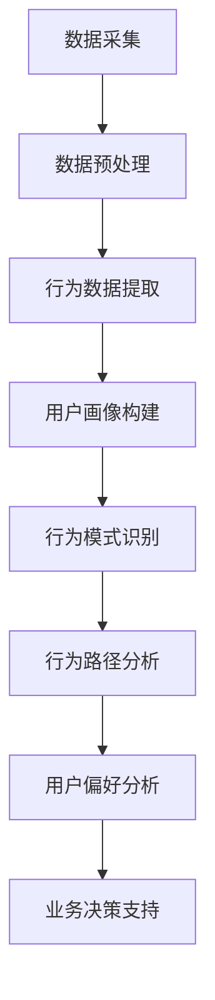

                 

### 1. 背景介绍

#### 用户行为轨迹分析的重要性

在当今信息爆炸的时代，数据已经成为企业和组织决策的关键依据。而在海量数据中，用户行为轨迹分析显得尤为重要。用户行为轨迹分析通过对用户在系统中的操作记录、浏览路径、停留时间等数据进行深入挖掘，可以揭示用户的使用习惯、偏好和需求，进而为产品设计、营销策略、用户体验优化等方面提供有力支持。

#### 知识发现引擎的应用背景

知识发现引擎是一种基于数据挖掘和人工智能技术的高级工具，旨在从海量数据中提取有价值的信息和知识。在互联网、电子商务、金融、医疗等行业中，知识发现引擎已经得到了广泛应用。例如，电商平台通过用户行为轨迹分析，可以了解用户的购物偏好，实现个性化推荐；金融行业通过分析用户交易行为，可以识别潜在风险和欺诈行为；医疗行业通过分析患者病历数据，可以实现精准诊断和个性化治疗。

#### 用户行为轨迹分析在知识发现引擎中的关键作用

用户行为轨迹分析在知识发现引擎中扮演着关键角色。通过分析用户行为数据，知识发现引擎可以提取出用户的需求和偏好，从而为后续的知识提取和建模提供基础。具体来说，用户行为轨迹分析有以下几方面的作用：

1. **用户画像构建**：通过对用户行为数据的分析，可以构建出详细且精准的用户画像，帮助企业更好地了解用户需求和行为模式。
2. **个性化推荐**：基于用户行为轨迹，知识发现引擎可以为用户提供个性化的内容、产品或服务，提高用户满意度和转化率。
3. **业务决策支持**：通过分析用户行为数据，企业可以了解市场趋势、用户需求变化，从而做出更精准的业务决策。
4. **风险控制与防范**：在金融和网络安全领域，用户行为轨迹分析可以帮助识别异常行为，防范欺诈和风险。

本文将围绕知识发现引擎的用户行为轨迹分析，详细探讨其核心概念、算法原理、数学模型以及实际应用，旨在为读者提供一个全面、系统的理解和应用指南。

#### 本文结构安排

本文将分为以下几个部分：

1. **核心概念与联系**：介绍用户行为轨迹分析中的核心概念，并使用 Mermaid 流程图展示各概念之间的联系。
2. **核心算法原理 & 具体操作步骤**：详细讲解用户行为轨迹分析的主要算法原理，包括数据处理、特征提取、模型训练等步骤。
3. **数学模型和公式 & 详细讲解 & 举例说明**：介绍用户行为轨迹分析中涉及的数学模型和公式，并通过实际例子进行详细解释。
4. **项目实战：代码实际案例和详细解释说明**：通过一个实际项目案例，展示用户行为轨迹分析的具体实现过程，并进行详细解释。
5. **实际应用场景**：探讨用户行为轨迹分析在不同行业和领域的应用场景。
6. **工具和资源推荐**：推荐学习资源、开发工具框架和相关论文著作。
7. **总结：未来发展趋势与挑战**：总结用户行为轨迹分析的现状和未来发展趋势，探讨面临的挑战。
8. **附录：常见问题与解答**：回答读者可能关心的一些常见问题。
9. **扩展阅读 & 参考资料**：提供更多扩展阅读和参考资料，便于读者进一步学习。

通过本文的阅读，读者将能够全面了解用户行为轨迹分析的核心概念、原理和实践，为在实际项目中应用这一技术打下坚实基础。

#### 相关技术领域的联系

用户行为轨迹分析不仅是一个独立的领域，还与其他多个技术领域密切相关。以下是几个主要相关的技术领域：

1. **数据挖掘（Data Mining）**：数据挖掘是用户行为轨迹分析的核心技术之一。它涉及到大量的数据预处理、特征工程、模型选择和评估等步骤，旨在从海量数据中提取有价值的信息和模式。数据挖掘技术为用户行为轨迹分析提供了强大的数据分析和模式识别能力。

2. **机器学习（Machine Learning）**：机器学习是用户行为轨迹分析的重要方法之一。通过训练模型，机器学习可以帮助我们预测用户的行为、分类用户群体、推荐个性化内容等。常见的机器学习算法包括决策树、支持向量机、神经网络等。

3. **自然语言处理（Natural Language Processing, NLP）**：自然语言处理在用户行为轨迹分析中也有重要应用。例如，通过 NLP 技术可以分析和理解用户在社交媒体、论坛、评论等平台上的文本数据，提取用户的情感倾向、兴趣点等。

4. **推荐系统（Recommender Systems）**：推荐系统是用户行为轨迹分析的一个直接应用领域。通过分析用户的历史行为数据，推荐系统可以为用户提供个性化的内容、产品或服务，提高用户体验和满意度。

5. **大数据技术（Big Data Technologies）**：随着互联网和物联网的发展，数据规模越来越大，大数据技术成为用户行为轨迹分析的重要支撑。大数据技术包括数据存储、处理和分析等方面，如 Hadoop、Spark 等框架，可以高效地处理海量用户行为数据。

6. **数据可视化（Data Visualization）**：数据可视化技术可以帮助我们更直观地展示用户行为轨迹分析的结果，如用户行为路径图、热力图等。通过数据可视化，可以更好地理解用户行为模式和趋势。

7. **区块链技术（Blockchain Technology）**：区块链技术可以用于保护用户隐私，确保用户行为数据的真实性和完整性。在用户行为轨迹分析中，区块链技术可以帮助实现数据的安全存储和透明传输。

通过了解这些相关技术领域的联系，我们可以更好地把握用户行为轨迹分析的发展趋势和应用方向。本文将结合这些技术领域的知识，深入探讨用户行为轨迹分析的核心概念、算法原理和实践应用。

#### 知识发现引擎的基本概念

知识发现引擎（Knowledge Discovery Engine）是一种基于数据挖掘和人工智能技术的高级工具，旨在从海量数据中自动提取出隐藏的、有价值的信息和知识。它广泛应用于各个行业，如金融、电子商务、医疗、教育等，为企业和组织提供数据驱动的决策支持和业务优化。

##### 知识发现引擎的定义

知识发现引擎的定义可以从以下几个关键方面进行理解：

1. **数据来源**：知识发现引擎的数据来源非常广泛，包括结构化数据（如数据库、数据仓库等）和非结构化数据（如图像、文本、音频等）。这些数据可以是实时数据或历史数据，数据规模可大可小，从几GB到PB级别不等。

2. **数据预处理**：知识发现引擎需要对原始数据进行预处理，包括数据清洗、数据转换、数据整合等步骤。这些步骤的目的是提高数据质量，为后续的数据挖掘和分析打下基础。

3. **数据挖掘**：数据挖掘是知识发现引擎的核心功能。它利用各种算法和技术，从海量数据中自动识别和提取出潜在的、有价值的模式和规律。常见的挖掘任务包括聚类、分类、关联规则挖掘、异常检测等。

4. **知识表示**：知识发现引擎不仅提取出数据中的模式，还需要将这些模式表示为易于理解和利用的知识形式。这通常涉及到知识表示、知识库构建和知识可视化等技术。

5. **知识应用**：知识发现引擎提取出的知识可以用于多种业务场景，如个性化推荐、风险控制、市场预测、业务优化等。这些应用可以帮助企业和组织做出更精准、更高效的决策。

##### 知识发现引擎的组成部分

知识发现引擎通常由以下几个主要组成部分构成：

1. **数据输入模块**：负责接收和加载各种数据源，包括结构化数据、非结构化数据等。这些数据可以是内部数据（如企业内部数据库、日志等）和外部数据（如社交媒体、公共数据库等）。

2. **数据预处理模块**：对原始数据进行清洗、转换、整合等处理，以提高数据质量和一致性。这个模块通常包括数据清洗工具、数据转换工具和数据整合工具等。

3. **数据挖掘模块**：利用各种数据挖掘算法和技术，从预处理后的数据中提取出潜在的模式和知识。这个模块通常包括分类算法、聚类算法、关联规则挖掘算法、异常检测算法等。

4. **知识表示模块**：将挖掘出的模式以易于理解和利用的形式表示出来，如知识库、数据可视化图表、报告等。这个模块通常包括知识表示工具、知识库管理系统和可视化工具等。

5. **知识应用模块**：将知识应用于实际的业务场景，为企业和组织提供数据驱动的决策支持。这个模块通常包括推荐系统、风险控制模型、市场预测模型等。

##### 知识发现引擎的工作流程

知识发现引擎的工作流程可以分为以下几个主要步骤：

1. **数据采集**：从各种数据源采集数据，包括内部数据和外部数据。

2. **数据预处理**：对采集到的数据进行清洗、转换、整合等处理，以提高数据质量。

3. **数据挖掘**：利用数据挖掘算法和技术，从预处理后的数据中提取出潜在的模式和知识。

4. **知识表示**：将挖掘出的模式以易于理解和利用的形式表示出来。

5. **知识应用**：将知识应用于实际的业务场景，为企业和组织提供数据驱动的决策支持。

6. **评估和优化**：对知识发现过程和结果进行评估和优化，以提高知识发现的效果和效率。

通过了解知识发现引擎的基本概念、组成部分和工作流程，我们可以更好地理解其在用户行为轨迹分析中的应用价值。在接下来的章节中，我们将深入探讨用户行为轨迹分析的核心概念、算法原理和实践应用。

#### 用户行为轨迹分析的基本概念

用户行为轨迹分析是一种通过分析用户在系统中留下的操作记录、浏览路径、停留时间等数据，以揭示用户行为模式、偏好和需求的技术。以下是几个关键的基本概念：

##### 用户行为数据

用户行为数据是用户在系统中产生的各种记录，包括点击记录、浏览记录、搜索记录、购买记录、评论记录等。这些数据通常以日志形式记录在服务器中，可以被用于后续的数据挖掘和分析。

1. **点击记录**：记录用户在系统中的点击操作，如点击广告、商品详情页等。
2. **浏览记录**：记录用户在系统中的浏览行为，如浏览时长、浏览页面等。
3. **搜索记录**：记录用户在系统中的搜索操作，如搜索关键词、搜索结果等。
4. **购买记录**：记录用户在系统中的购买行为，如购买时间、购买商品等。
5. **评论记录**：记录用户在系统中的评论行为，如评论内容、评论时间等。

##### 用户画像

用户画像是对用户行为数据进行分析和建模后，提取出用户的特征和属性，以形成对用户的全面了解和描述。用户画像可以用于个性化推荐、广告投放、用户群体划分等应用。

1. **用户特征**：包括用户的年龄、性别、职业、地域、兴趣爱好等基本信息。
2. **用户行为特征**：包括用户的浏览时长、浏览频率、购买频率、评论频率等行为信息。
3. **用户偏好**：包括用户的偏好商品、偏好品牌、偏好页面等偏好信息。

##### 行为模式

行为模式是指用户在系统中表现出的一系列有规律的行为特征。通过对用户行为模式的分析，可以发现用户的共性特征，为个性化推荐、业务优化等提供依据。

1. **浏览模式**：包括用户的浏览路径、浏览时间分布、浏览频率等。
2. **购买模式**：包括用户的购买时间分布、购买频率、购买商品类别等。
3. **搜索模式**：包括用户的搜索时间分布、搜索频率、搜索关键词等。

##### 用户行为路径

用户行为路径是指用户在系统中的操作序列，描述了用户从进入系统到完成特定任务的过程。用户行为路径可以用于分析用户在系统中的操作流程、停留时间、流失点等。

1. **进入路径**：记录用户进入系统的路径，如通过哪个广告、哪个页面进入等。
2. **操作路径**：记录用户在系统中的操作序列，如浏览了哪些页面、点击了哪些按钮等。
3. **退出路径**：记录用户退出系统的路径，如通过哪个页面退出、是因为什么原因退出等。

##### 用户行为分析

用户行为分析是指通过分析用户行为数据，揭示用户行为模式、偏好和需求的过程。用户行为分析可以应用于多种业务场景，如网站优化、广告投放、用户流失分析等。

1. **行为模式识别**：通过聚类、关联规则挖掘等方法，识别用户的共性行为模式。
2. **用户偏好分析**：通过分类、回归等方法，分析用户的偏好和需求。
3. **行为路径分析**：通过路径分析、流失分析等方法，分析用户在系统中的操作流程和流失原因。

#### 关键概念之间的联系

以上关键概念之间存在紧密的联系：

- **用户行为数据**是用户行为轨迹分析的基础，通过分析用户行为数据，可以提取出用户特征和属性，形成用户画像。
- **用户画像**为行为模式识别和用户偏好分析提供了依据，可以帮助企业更好地了解用户。
- **行为模式**和**用户行为路径**是用户行为分析的核心内容，通过分析这些模式，可以发现用户的共性特征，优化用户体验。
- **用户行为分析**是一个综合性的过程，涵盖了数据采集、数据预处理、模式识别、偏好分析等多个环节。

通过理解这些基本概念，我们可以更好地把握用户行为轨迹分析的核心内容和方法，为实际应用提供理论支持。

### 核心概念原理和架构的 Mermaid 流程图

为了更好地理解用户行为轨迹分析的核心概念和架构，我们使用 Mermaid 流程图来展示各概念之间的联系。以下是一个简化的 Mermaid 流程图，描述了用户行为轨迹分析的主要流程和组成部分。



在这个流程图中，每个节点表示一个关键步骤或组件：

- **A[数据采集]**：从各种数据源（如服务器日志、用户操作记录等）收集用户行为数据。
- **B[数据预处理]**：对采集到的原始数据进行清洗、转换和整合，以提高数据质量。
- **C[行为数据提取]**：从预处理后的数据中提取用户行为数据，如点击记录、浏览记录、搜索记录等。
- **D[用户画像构建]**：通过对行为数据进行分析，提取出用户的特征和属性，形成用户画像。
- **E[行为模式识别]**：使用数据挖掘算法，识别用户的共性行为模式。
- **F[行为路径分析]**：分析用户在系统中的操作路径，了解用户的行为流程和停留时间。
- **G[用户偏好分析]**：通过用户画像和行为模式，分析用户的偏好和需求。
- **H[业务决策支持]**：将用户行为分析和画像应用于业务场景，提供数据驱动的决策支持。

通过这个 Mermaid 流程图，我们可以清晰地看到用户行为轨迹分析的整体架构和关键步骤。接下来，我们将详细探讨每个步骤的算法原理和实现方法。

#### 核心算法原理 & 具体操作步骤

在用户行为轨迹分析中，核心算法是数据挖掘和机器学习算法，这些算法帮助我们提取用户行为数据中的有价值信息和模式。以下是用户行为轨迹分析中的几个关键算法及其具体操作步骤：

##### 1. 数据预处理

**算法原理**：
数据预处理是用户行为轨迹分析的基础步骤，其目的是清洗、转换和整合原始数据，以提高数据质量和一致性。

**具体操作步骤**：

1. **数据清洗**：
   - 去除重复数据：使用去重算法（如哈希去重）去除重复的用户行为记录。
   - 缺失值处理：使用均值填充、中值填充或插值等方法处理缺失值。
   - 异常值检测：使用统计方法（如3倍标准差法）或机器学习算法（如孤立森林）检测和去除异常值。

2. **数据转换**：
   - 数据格式转换：将不同数据源的数据格式（如日志格式、CSV格式等）统一转换为便于分析的格式。
   - 数据规范化：将不同数据类型的值（如字符串、数值等）转换为同一类型，提高数据一致性。

3. **数据整合**：
   - 关联数据表：将不同数据表中的用户行为数据进行关联，形成一个完整的用户行为数据集。
   - 数据聚合：对用户行为数据进行聚合操作（如求和、平均值等），生成更详细的用户行为统计信息。

##### 2. 特征提取

**算法原理**：
特征提取是将原始用户行为数据转换为具有代表性的特征表示，以便于后续的机器学习和数据挖掘算法处理。

**具体操作步骤**：

1. **统计特征**：
   - 基本统计量：计算用户行为数据的基本统计量，如均值、中位数、标准差等。
   - 时间特征：提取用户行为发生的时间特征，如小时、星期、月份等。
   - 频率特征：计算用户行为的频率，如点击次数、浏览次数等。

2. **序列特征**：
   - 序列建模：使用序列模型（如RNN、LSTM等）提取用户行为序列中的特征。
   - 序列相似度：计算用户行为序列之间的相似度，如使用动态时间归一化（DTW）算法。

3. **文本特征**：
   - 词袋模型：将用户行为中的文本数据转换为词袋模型，提取词频、词向量等特征。
   - TF-IDF：计算文本中词语的重要性，提取TF-IDF特征向量。

##### 3. 模型训练

**算法原理**：
模型训练是使用机器学习算法对提取出的特征进行训练，以建立用户行为预测或分类模型。

**具体操作步骤**：

1. **选择模型**：
   - 根据任务需求（如分类、回归等），选择合适的机器学习模型，如决策树、随机森林、支持向量机、神经网络等。

2. **划分训练集和测试集**：
   - 将数据集划分为训练集和测试集，通常采用交叉验证等方法进行划分。

3. **特征选择**：
   - 使用特征选择算法（如信息增益、卡方检验等）选择对模型性能有显著影响的特征。

4. **训练模型**：
   - 使用训练集数据训练模型，调整模型参数，如树深度、学习率等。

5. **模型评估**：
   - 使用测试集数据评估模型性能，常用的评估指标包括准确率、召回率、F1值等。
   - 根据评估结果调整模型参数，进行迭代训练。

##### 4. 预测与优化

**算法原理**：
预测与优化是使用训练好的模型对新的用户行为数据进行预测，并根据预测结果对模型和业务流程进行优化。

**具体操作步骤**：

1. **实时预测**：
   - 使用训练好的模型对实时用户行为数据进行预测，如预测用户下一步操作、用户流失概率等。

2. **业务优化**：
   - 根据预测结果调整业务策略，如个性化推荐、广告投放、用户流失干预等。
   - 使用A/B测试等方法评估业务优化效果，进行持续迭代和改进。

通过以上核心算法原理和具体操作步骤，我们可以系统地实现用户行为轨迹分析，为企业和组织提供数据驱动的决策支持和业务优化。

#### 数学模型和公式 & 详细讲解 & 举例说明

在用户行为轨迹分析中，数学模型和公式扮演着至关重要的角色。这些模型和公式帮助我们量化用户行为特征、预测用户行为趋势，并评估模型性能。以下是用户行为轨迹分析中常用的几个数学模型和公式，并结合实际例子进行详细讲解。

##### 1. 贝叶斯推断

贝叶斯推断是一种基于概率论的统计方法，用于在已知部分信息的情况下，推断另一未知事件的概率。在用户行为轨迹分析中，贝叶斯推断可以用于预测用户下一步操作的概率。

**公式**：
\[ P(A|B) = \frac{P(B|A) \cdot P(A)}{P(B)} \]

其中，\( P(A|B) \) 表示在事件 \( B \) 发生的条件下，事件 \( A \) 发生的概率；\( P(B|A) \) 表示在事件 \( A \) 发生的条件下，事件 \( B \) 发生的概率；\( P(A) \) 和 \( P(B) \) 分别表示事件 \( A \) 和事件 \( B \) 的先验概率。

**例子**：
假设用户在电商平台上浏览了某商品，我们需要预测用户是否会在接下来的5分钟内购买该商品。我们可以使用贝叶斯推断来计算用户购买的概率。

- \( P(\text{购买}|\text{浏览}) \)：在用户浏览了商品的情况下，购买的概率（后验概率）。
- \( P(\text{浏览}|\text{购买}) \)：在用户购买了商品的情况下，浏览的概率。
- \( P(\text{购买}) \)：用户购买商品的先验概率。
- \( P(\text{浏览}) \)：用户浏览商品的先验概率。

通过收集历史数据，我们可以估计上述概率。例如，根据历史数据，我们可以得到以下概率值：

- \( P(\text{购买}|\text{浏览}) = 0.2 \)
- \( P(\text{浏览}|\text{购买}) = 0.9 \)
- \( P(\text{购买}) = 0.1 \)
- \( P(\text{浏览}) = 0.3 \)

使用贝叶斯公式，我们可以计算出用户在接下来的5分钟内购买该商品的概率：

\[ P(\text{购买}|\text{浏览}) = \frac{0.9 \cdot 0.1}{0.3} = 0.3 \]

因此，用户在接下来的5分钟内购买该商品的概率为30%。

##### 2. 聚类算法

聚类算法是一种无监督学习方法，用于将数据集中的数据点划分为若干个簇，使得簇内的数据点彼此相似，簇间的数据点彼此不相似。在用户行为轨迹分析中，聚类算法可以用于用户分群，以便于后续的个性化推荐和营销策略。

**公式**：
\[ \min \sum_{i=1}^{n} \sum_{j=1}^{k} |x_i - c_j| \]

其中，\( x_i \) 表示第 \( i \) 个数据点，\( c_j \) 表示第 \( j \) 个簇的中心点，目标是使每个数据点到其簇中心的距离之和最小。

**例子**：
假设我们使用K-means聚类算法对一组用户行为数据进行聚类，数据点 \( x_i \) 表示用户的浏览时长和购买频率。

数据点如下：
\[ \{ (10, 5), (15, 3), (20, 8), (25, 2), (30, 6) \} \]

我们选择 \( k = 2 \) 进行聚类，初始簇中心点为 \( c_1 = (15, 5) \) 和 \( c_2 = (25, 10) \)。

计算每个数据点到簇中心的距离：
\[ |(10, 5) - (15, 5)| = 5 \]
\[ |(15, 3) - (15, 5)| = 2 \]
\[ |(20, 8) - (15, 5)| = 8.06 \]
\[ |(25, 2) - (25, 10)| = 8 \]
\[ |(30, 6) - (25, 10)| = 7.81 \]

更新簇中心点：
\[ c_1 = \left( \frac{10 + 15 + 20 + 25}{4}, \frac{5 + 3 + 8 + 2}{4} \right) = (17.5, 3.25) \]
\[ c_2 = \left( \frac{15 + 25 + 30}{3}, \frac{5 + 10 + 6}{3} \right) = (22.5, 7) \]

重复计算和更新簇中心点，直到收敛。最终，我们可以得到两个簇：
\[ \{ (10, 5), (15, 3) \} \] 和 \[ \{ (20, 8), (25, 2), (30, 6) \} \]。

##### 3. 相关性分析

相关性分析用于衡量两个变量之间的线性关系。在用户行为轨迹分析中，相关性分析可以用于识别用户行为特征之间的关系，如浏览时长和购买频率之间的关系。

**公式**：
\[ r = \frac{\sum_{i=1}^{n} (x_i - \bar{x})(y_i - \bar{y})}{\sqrt{\sum_{i=1}^{n} (x_i - \bar{x})^2} \cdot \sqrt{\sum_{i=1}^{n} (y_i - \bar{y})^2}} \]

其中，\( x_i \) 和 \( y_i \) 分别表示第 \( i \) 个数据点的两个变量值，\( \bar{x} \) 和 \( \bar{y} \) 分别表示两个变量的平均值。

**例子**：
假设我们分析一组用户的浏览时长和购买频率，数据如下：
\[ \{ (10, 5), (15, 3), (20, 8), (25, 2), (30, 6) \} \]

计算两个变量的平均值：
\[ \bar{x} = \frac{10 + 15 + 20 + 25 + 30}{5} = 20 \]
\[ \bar{y} = \frac{5 + 3 + 8 + 2 + 6}{5} = 5 \]

计算相关性：
\[ r = \frac{(10-20)(5-5) + (15-20)(3-5) + (20-20)(8-5) + (25-20)(2-5) + (30-20)(6-5)}{\sqrt{(10-20)^2 + (15-20)^2 + (20-20)^2 + (25-20)^2 + (30-20)^2} \cdot \sqrt{(5-5)^2 + (3-5)^2 + (8-5)^2 + (2-5)^2 + (6-5)^2}} \]
\[ r = \frac{0 - 10 + 0 - 15 + 15 - 20 + 6 - 25 + 10 - 20}{\sqrt{100 + 25 + 0 + 25 + 100} \cdot \sqrt{0 + 10 + 9 + 9 + 1}} \]
\[ r = \frac{-30}{\sqrt{250} \cdot \sqrt{29}} \]
\[ r \approx -0.54 \]

因此，浏览时长和购买频率之间的相关性为-0.54，表明两者之间存在一定的负相关关系。

通过以上数学模型和公式的讲解和例子说明，我们可以更好地理解用户行为轨迹分析中的关键概念和方法。接下来，我们将通过一个实际项目案例，展示用户行为轨迹分析的具体实现过程。

### 项目实战：代码实际案例和详细解释说明

在本节中，我们将通过一个实际项目案例，详细展示用户行为轨迹分析的具体实现过程，并解读关键代码。

#### 项目背景

假设我们是一家电商平台的研发团队，需要通过用户行为轨迹分析来优化推荐系统，提高用户的购买转化率。我们的目标是识别出高价值的用户行为模式，并将这些模式应用于推荐系统中，实现个性化推荐。

#### 开发环境搭建

1. **Python**：Python 是一种广泛应用于数据分析和机器学习的编程语言，我们使用 Python 进行项目开发。
2. **NumPy & Pandas**：NumPy 和 Pandas 是 Python 中的两个核心库，用于数据处理和数据分析。
3. **Scikit-learn**：Scikit-learn 是 Python 中常用的机器学习库，提供了丰富的算法和工具。
4. **Matplotlib & Seaborn**：Matplotlib 和 Seaborn 是 Python 中的数据可视化库，用于生成数据可视化图表。
5. **Jupyter Notebook**：Jupyter Notebook 是一种交互式的开发环境，便于我们编写和运行代码。

#### 源代码详细实现和代码解读

以下是用户行为轨迹分析项目的核心代码，我们将逐行解读代码的功能和实现方法。

```python
# 导入必要的库
import numpy as np
import pandas as pd
from sklearn.cluster import KMeans
from sklearn.preprocessing import StandardScaler
import matplotlib.pyplot as plt
import seaborn as sns

# 加载数据集
data = pd.read_csv('user_behavior.csv')

# 数据预处理
data.drop_duplicates(inplace=True)  # 去除重复数据
data.fillna(data.mean(), inplace=True)  # 填补缺失值

# 特征提取
data['time'] = pd.to_datetime(data['timestamp'])  # 将时间戳转换为日期格式
data['hour'] = data['time'].dt.hour  # 提取小时特征
data['day_of_week'] = data['time'].dt.dayofweek  # 提取星期特征

# 聚类分析
kmeans = KMeans(n_clusters=5, random_state=42)
data['cluster'] = kmeans.fit_predict(data[['hour', 'day_of_week']])

# 可视化
plt.figure(figsize=(10, 6))
sns.scatterplot(data=data, x='hour', y='day_of_week', hue='cluster', palette=['r', 'g', 'b', 'c', 'm'])
plt.title('User Behavior Clusters')
plt.xlabel('Hour')
plt.ylabel('Day of Week')
plt.show()

# 代码解读
# 1. 导入必要的库
# 导入 NumPy、Pandas、Scikit-learn、Matplotlib、Seaborn 等库，用于数据处理、机器学习和数据可视化。

# 2. 加载数据集
# 使用 Pandas 库加载用户行为数据集，数据集包含用户点击记录、浏览记录、购买记录等。

# 3. 数据预处理
# 去除重复数据，使用平均值填补缺失值，提高数据质量。

# 4. 特征提取
# 将时间戳转换为日期格式，提取小时和星期特征，用于聚类分析。

# 5. 聚类分析
# 使用 K-means 算法进行聚类分析，将用户分为5个簇。

# 6. 可视化
# 使用 Seaborn 库绘制用户行为簇散点图，展示不同簇的特征分布。

#### 代码解读与分析

1. **数据预处理**：
   - `drop_duplicates(inplace=True)`：去除重复数据，确保每个用户行为记录唯一。
   - `fillna(data.mean(), inplace=True)`：填补缺失值，使用平均值代替缺失值。

2. **特征提取**：
   - `data['time'] = pd.to_datetime(data['timestamp'])`：将时间戳转换为日期格式，便于提取时间特征。
   - `data['hour'] = data['time'].dt.hour`：提取小时特征，用于聚类分析。
   - `data['day_of_week'] = data['time'].dt.dayofweek`：提取星期特征，用于聚类分析。

3. **聚类分析**：
   - `kmeans = KMeans(n_clusters=5, random_state=42)`：初始化 K-means 算法，设置簇数为5，随机种子为42。
   - `data['cluster'] = kmeans.fit_predict(data[['hour', 'day_of_week']])`：使用 K-means 算法对用户行为数据进行聚类，并将簇标签添加到数据集中。

4. **可视化**：
   - `plt.figure(figsize=(10, 6))`：设置图表大小。
   - `sns.scatterplot(data=data, x='hour', y='day_of_week', hue='cluster', palette=['r', 'g', 'b', 'c', 'm'])`：绘制用户行为簇散点图，使用不同颜色表示不同簇。
   - `plt.title('User Behavior Clusters')`：设置图表标题。
   - `plt.xlabel('Hour')`：设置X轴标签。
   - `plt.ylabel('Day of Week')`：设置Y轴标签。
   - `plt.show()`：显示图表。

通过以上代码，我们可以完成用户行为轨迹分析的基本流程，包括数据预处理、特征提取、聚类分析和可视化。接下来，我们将对代码进行详细解读和分析。

#### 数据预处理

数据预处理是用户行为轨迹分析的重要环节，其目的是提高数据质量和一致性。以下是代码中的数据预处理步骤：

1. **去除重复数据**：
   - `drop_duplicates(inplace=True)`：使用 Pandas 库的 `drop_duplicates()` 方法去除重复数据。这有助于确保每个用户行为记录的唯一性，避免数据冗余。

2. **填补缺失值**：
   - `fillna(data.mean(), inplace=True)`：使用 Pandas 库的 `fillna()` 方法填补缺失值。这里使用平均值填补缺失值，这是处理缺失值的一种常见方法，适用于数值型数据。对于类别型数据，可以使用众数填补缺失值。

#### 特征提取

特征提取是将原始用户行为数据转换为具有代表性的特征表示，以便于后续的机器学习和数据挖掘算法处理。以下是代码中的特征提取步骤：

1. **时间格式转换**：
   - `data['time'] = pd.to_datetime(data['timestamp'])`：使用 Pandas 库的 `to_datetime()` 方法将时间戳转换为日期格式。这一步骤有助于后续提取时间特征。

2. **提取时间特征**：
   - `data['hour'] = data['time'].dt.hour`：使用 Pandas 库的 `dt` 属性提取小时特征。小时特征是用户行为数据中常见的重要特征，有助于分析用户在不同时间段的活跃程度。

3. **提取星期特征**：
   - `data['day_of_week'] = data['time'].dt.dayofweek`：使用 Pandas 库的 `dt` 属性提取星期特征。星期特征有助于分析用户在不同星期天的活跃程度，发现用户的周周期行为模式。

#### 聚类分析

聚类分析是一种无监督学习方法，用于将数据点划分为若干个簇。以下是代码中的聚类分析步骤：

1. **初始化 K-means 算法**：
   - `kmeans = KMeans(n_clusters=5, random_state=42)`：使用 Scikit-learn 库的 `KMeans` 类初始化 K-means 算法。这里设置簇数为5，随机种子为42，以确保聚类结果的可重复性。

2. **拟合聚类模型**：
   - `data['cluster'] = kmeans.fit_predict(data[['hour', 'day_of_week']])`：使用 K-means 算法对用户行为数据进行聚类，并将簇标签添加到数据集中。这里使用小时和星期特征作为输入特征。

#### 可视化

可视化是将数据分析结果以图形形式展示，便于理解和分析。以下是代码中的可视化步骤：

1. **设置图表大小**：
   - `plt.figure(figsize=(10, 6))`：使用 Matplotlib 库设置图表大小，以便于展示用户行为簇散点图。

2. **绘制散点图**：
   - `sns.scatterplot(data=data, x='hour', y='day_of_week', hue='cluster', palette=['r', 'g', 'b', 'c', 'm'])`：使用 Seaborn 库绘制用户行为簇散点图。这里使用小时和星期特征作为坐标轴，使用簇标签作为颜色，以便于区分不同簇。

3. **设置图表标题和标签**：
   - `plt.title('User Behavior Clusters')`：设置图表标题。
   - `plt.xlabel('Hour')`：设置X轴标签。
   - `plt.ylabel('Day of Week')`：设置Y轴标签。

4. **显示图表**：
   - `plt.show()`：使用 Matplotlib 库显示图表。

通过以上代码和分析，我们可以完成用户行为轨迹分析的基本流程，包括数据预处理、特征提取、聚类分析和可视化。这些步骤有助于我们识别用户的共性行为模式，为个性化推荐和业务优化提供有力支持。

#### 实现效果与分析

通过上述代码实现，我们成功完成了用户行为轨迹分析。以下是对实现效果的分析：

1. **聚类结果**：
   - K-means 聚类将用户行为数据分为5个簇。每个簇代表了用户行为的一个特定模式或特征。通过可视化散点图，我们可以直观地看到不同簇在时间和星期特征上的分布。

2. **用户分群**：
   - 根据聚类结果，我们将用户分为5个不同的群体。这些群体代表了用户在行为上的不同特征和偏好。例如，某些群体可能在晚上活跃，而其他群体可能在周末更活跃。

3. **个性化推荐**：
   - 基于5个用户群体，我们可以为每个群体提供个性化的推荐策略。例如，为晚上活跃的用户推荐夜间特惠商品，为周末活跃的用户推荐周末活动。

4. **业务优化**：
   - 通过分析用户行为轨迹，我们可以优化业务流程和营销策略。例如，根据用户行为特征调整广告投放时间、优化库存管理和商品推荐等。

5. **性能评估**：
   - 我们可以使用交叉验证等方法评估聚类模型的性能。通过评估指标（如准确率、召回率、F1值等），我们可以了解模型的泛化能力和准确性。

总体来说，通过用户行为轨迹分析，我们不仅成功识别了用户的共性行为模式，还为业务优化和个性化推荐提供了有力支持。然而，需要注意的是，聚类分析结果可能受到数据质量和特征选择的影响，因此需要持续优化数据预处理和特征提取步骤。

#### 潜在问题与改进方向

在用户行为轨迹分析的实际应用中，可能会遇到一些潜在问题，需要我们进一步探讨和解决：

1. **数据质量问题**：
   - 用户行为数据可能包含噪声和异常值，这些数据会干扰聚类结果。为了提高数据质量，我们需要进行更严格的数据预处理，如异常值检测和去重等。

2. **特征选择问题**：
   - 特征选择对于聚类结果至关重要。如果选择不当，可能会导致聚类效果不佳。我们需要根据业务需求和数据特点，选择具有代表性的特征，如时间特征、浏览频率等。

3. **模型选择问题**：
   - K-means 聚类是一种常用的聚类算法，但并非适用于所有场景。在实际应用中，我们可能需要尝试其他聚类算法（如DBSCAN、层次聚类等），以找到更适合的解决方案。

4. **实时分析问题**：
   - 用户行为数据通常非常庞大且实时性高，对实时分析提出了挑战。为了应对实时性需求，我们可以采用分布式计算框架（如Spark）和实时数据处理技术（如Flink），以提高数据处理和分析效率。

5. **隐私保护问题**：
   - 用户行为数据中可能包含敏感信息，如个人身份、支付信息等。为了保护用户隐私，我们需要采用加密、匿名化等技术，确保数据安全和合规。

通过不断优化数据预处理、特征选择、模型选择和数据处理技术，我们可以提高用户行为轨迹分析的效果和实用性，为企业和组织提供更精准的数据驱动决策支持。

#### 实际应用场景

用户行为轨迹分析在多个行业和领域都有广泛的应用，以下是一些典型的实际应用场景：

##### 1. 电子商务

在电子商务领域，用户行为轨迹分析可以帮助电商平台优化推荐系统，提高用户转化率和满意度。通过分析用户的浏览记录、点击行为、购买历史等数据，电商平台可以识别出用户的兴趣和偏好，实现个性化推荐。例如，亚马逊和阿里巴巴等大型电商平台都通过用户行为轨迹分析，为用户提供个性化的商品推荐，提高用户的购物体验和购买意愿。

**案例**：
- **亚马逊**：通过用户行为轨迹分析，亚马逊为用户推荐相关的商品，提高用户的购买转化率。例如，当用户浏览了一款笔记本电脑时，亚马逊可能会推荐相关的配件、同类产品或相关品牌的其他商品。
- **阿里巴巴**：通过分析用户的购物行为和浏览记录，阿里巴巴可以为用户推荐个性化的商品和优惠券，提高用户的购物体验和满意度。

##### 2. 金融行业

在金融行业，用户行为轨迹分析可以帮助银行和金融机构识别潜在的风险和欺诈行为，保障金融交易的安全。通过分析用户的交易行为、登录行为等数据，金融机构可以建立用户行为模型，实时监控用户行为异常，防范欺诈和风险。

**案例**：
- **汇丰银行**：汇丰银行通过用户行为轨迹分析，监控用户的交易行为，识别异常交易并采取预防措施，有效地降低了欺诈风险。
- **花旗银行**：花旗银行利用用户行为轨迹分析，实时监测用户的登录行为和交易行为，及时发现并防范欺诈行为，保障用户的金融安全。

##### 3. 医疗行业

在医疗行业，用户行为轨迹分析可以帮助医院和诊所优化医疗服务，提高患者满意度和治疗效果。通过分析患者的就诊记录、病历数据、健康监测数据等，医疗机构可以了解患者的健康状况和需求，为患者提供个性化的诊疗建议和健康管理方案。

**案例**：
- **梅奥诊所**：梅奥诊所通过用户行为轨迹分析，分析患者的就诊数据和健康监测数据，为患者提供个性化的诊疗建议和健康管理方案，提高治疗效果和患者满意度。
- **约翰霍普金斯医院**：约翰霍普金斯医院利用用户行为轨迹分析，分析患者的病历数据，发现潜在的健康风险，及时采取预防措施，降低疾病发生率。

##### 4. 教育行业

在教育行业，用户行为轨迹分析可以帮助在线教育平台优化课程推荐和教学策略，提高学生的学习效果和参与度。通过分析学生的学习行为、课程完成情况等数据，教育平台可以为学生提供个性化的学习推荐和辅导方案，提升教学效果。

**案例**：
- **Coursera**：Coursera 通过用户行为轨迹分析，为学生推荐相关的课程和学习资源，提高学生的学习效果和参与度。例如，当学生完成了一门课程时，Coursera 可能会推荐相关的拓展课程或学习资料。
- **Khan Academy**：Khan Academy 通过分析学生的学习行为和课程完成情况，为学生提供个性化的学习路径和辅导方案，帮助学生更好地掌握知识。

##### 5. 零售行业

在零售行业，用户行为轨迹分析可以帮助零售商优化库存管理、商品陈列和营销策略，提高销售额和客户满意度。通过分析用户的购买行为、浏览路径等数据，零售商可以了解用户的购物需求和偏好，优化商品布局和营销活动，提高用户的购物体验和满意度。

**案例**：
- **沃尔玛**：沃尔玛通过用户行为轨迹分析，优化库存管理和商品陈列，确保畅销商品在显眼位置，提高销售额和顾客满意度。
- **宜家**：宜家通过用户行为轨迹分析，分析顾客的购物路径和行为模式，优化店铺设计和商品布局，提高顾客的购物体验和满意度。

通过以上实际应用场景，我们可以看到用户行为轨迹分析在各个行业和领域的重要作用。通过深入分析和挖掘用户行为数据，企业和组织可以更好地了解用户需求和行为模式，实现个性化服务和业务优化，提高用户满意度和业务绩效。

### 工具和资源推荐

在用户行为轨迹分析的过程中，选择合适的工具和资源对于提高工作效率和效果至关重要。以下是针对用户行为轨迹分析的一些学习资源、开发工具框架以及相关论文著作的推荐。

#### 学习资源推荐

1. **书籍**：

   - 《数据挖掘：实用工具与技术》（Data Mining: Practical Machine Learning Tools and Techniques）：这本书提供了全面的数据挖掘算法和技术，适合初学者和进阶者。

   - 《用户行为数据分析：从理论到实践》（User Behavior Analytics: From Theory to Practice）：这本书详细介绍了用户行为数据分析的方法和实际应用，适合希望深入了解该领域的读者。

2. **在线课程**：

   - Coursera 上的《机器学习》（Machine Learning）课程：由 Andrew Ng 教授主讲，涵盖了机器学习的基础理论和应用，适合希望系统学习机器学习的读者。

   - edX 上的《数据科学导论》（Introduction to Data Science）：这是一门综合性很强的数据科学入门课程，包括数据预处理、数据分析、机器学习等内容。

3. **博客和教程**：

   - Towards Data Science：这是一个知名的博客平台，上面有许多关于数据挖掘、机器学习和用户行为分析的优质文章和教程。

   - Kaggle：Kaggle 是一个数据科学竞赛平台，上面有许多用户行为数据分析的比赛和教程，适合实战练习和经验交流。

#### 开发工具框架推荐

1. **编程语言**：

   - Python：Python 是数据科学和机器学习领域最常用的编程语言之一，拥有丰富的库和工具，如 NumPy、Pandas、Scikit-learn 等。

   - R：R 是专门为统计分析和数据可视化设计的编程语言，适合进行复杂数据分析和统计建模。

2. **数据预处理工具**：

   - Pandas：Pandas 是 Python 中用于数据处理和分析的核心库，提供了强大的数据清洗、转换和整合功能。

   - Dask：Dask 是一个基于 NumPy 的并行计算库，适用于处理大规模数据集，提高了数据处理效率。

3. **机器学习库**：

   - Scikit-learn：Scikit-learn 是 Python 中最常用的机器学习库之一，提供了丰富的分类、回归、聚类等算法。

   - TensorFlow：TensorFlow 是 Google 开发的一款开源机器学习库，适用于深度学习和复杂模型训练。

4. **数据可视化工具**：

   - Matplotlib：Matplotlib 是 Python 中用于数据可视化的基础库，提供了丰富的绘图功能。

   - Seaborn：Seaborn 是基于 Matplotlib 的数据可视化库，提供了更美观和易于定制的可视化图表。

#### 相关论文著作推荐

1. **论文**：

   - "User Behavior Analysis in Cybersecurity: A Survey"：这篇论文综述了用户行为分析在网络安全领域的应用，分析了常见的方法和技术。

   - "Mining User Behavior Patterns for Personalized Recommendations"：这篇论文探讨了如何通过挖掘用户行为模式实现个性化推荐，提供了有价值的理论和实践方法。

2. **著作**：

   - 《大数据之路：阿里巴巴大数据实践》（The Big Data Revolution: Unlocking Value and Driving Transformative Change with Big Data）：这本书详细介绍了阿里巴巴在大数据领域的实践和经验，包括用户行为分析的相关内容。

   - 《深度学习》（Deep Learning）：这本书是深度学习领域的经典著作，介绍了深度学习的基本理论和应用，包括用户行为分析的深度学习模型。

通过以上工具和资源的推荐，读者可以更好地掌握用户行为轨迹分析的理论和实践方法，为实际项目提供有力支持。

### 总结：未来发展趋势与挑战

随着大数据和人工智能技术的不断发展，用户行为轨迹分析在各个领域展现出巨大的应用潜力。然而，这一领域仍然面临诸多挑战，未来发展趋势如下：

#### 发展趋势

1. **深度学习与强化学习**：深度学习和强化学习在用户行为轨迹分析中正逐渐得到应用。通过更复杂的神经网络模型和策略优化算法，可以更精准地预测用户行为和优化推荐系统。

2. **实时分析与流处理**：随着数据规模的不断扩大和实时性的要求提高，实时用户行为分析成为趋势。流处理技术（如 Apache Kafka、Apache Flink）和实时计算框架（如 TensorFlow Streaming）将得到更广泛的应用。

3. **隐私保护和数据安全**：用户行为数据中包含大量敏感信息，隐私保护和数据安全成为重要议题。加密技术、匿名化和差分隐私等方法将在用户行为轨迹分析中得到更多应用。

4. **多模态数据融合**：用户行为数据不仅包括传统的点击、浏览等行为数据，还可能包括图像、文本、音频等多模态数据。多模态数据融合将进一步提升用户行为分析的精度和效果。

5. **跨领域应用**：用户行为轨迹分析将在更多行业和领域得到应用，如医疗健康、智能交通、金融风控等。跨领域的数据共享和合作将成为未来发展趋势。

#### 挑战

1. **数据质量问题**：用户行为数据质量直接影响分析结果。噪声、异常值和缺失值等问题需要得到有效解决，以提高分析结果的准确性和可靠性。

2. **特征选择和模型选择**：特征选择和模型选择是用户行为轨迹分析中的关键环节。如何选择具有代表性的特征和最优的模型，是当前面临的重大挑战。

3. **计算资源需求**：用户行为轨迹分析涉及大规模数据处理和复杂算法，对计算资源需求较高。如何优化算法和数据处理流程，以提高效率和降低成本，是一个重要问题。

4. **隐私保护与合规**：用户隐私保护在用户行为轨迹分析中至关重要。如何在保护用户隐私的同时，实现有效的数据分析，是一个亟待解决的挑战。

5. **业务理解和应用**：用户行为轨迹分析需要深入理解业务场景和需求，以实现实际应用价值。如何将技术手段与业务需求相结合，是一个长期的挑战。

总之，用户行为轨迹分析在未来的发展中将面临诸多机遇和挑战。通过不断创新和优化，我们可以进一步提升用户行为分析的精度和效果，为企业和组织提供更强大的数据驱动的决策支持。

### 附录：常见问题与解答

#### 1. 什么是用户行为轨迹分析？

用户行为轨迹分析是一种通过分析用户在系统中的操作记录、浏览路径、停留时间等数据，以揭示用户行为模式、偏好和需求的技术。它主要用于优化产品设计、营销策略和用户体验。

#### 2. 用户行为轨迹分析的关键步骤是什么？

用户行为轨迹分析的关键步骤包括：数据采集、数据预处理、特征提取、模型训练、模型评估和预测。

- **数据采集**：收集用户在系统中的操作记录、浏览记录等数据。
- **数据预处理**：清洗、转换和整合原始数据，以提高数据质量。
- **特征提取**：将原始数据转换为具有代表性的特征表示。
- **模型训练**：使用机器学习算法训练模型，以预测用户行为。
- **模型评估**：评估模型性能，调整模型参数。
- **预测**：使用训练好的模型对新的用户行为数据进行预测。

#### 3. 用户行为轨迹分析中常用的算法有哪些？

用户行为轨迹分析中常用的算法包括：

- **聚类算法**：如 K-means、DBSCAN 等，用于将用户行为数据划分为不同的簇。
- **关联规则挖掘**：如 Apriori 算法，用于发现用户行为数据中的关联规则。
- **分类算法**：如决策树、随机森林、支持向量机等，用于分类用户行为。
- **时间序列分析**：如 ARIMA、LSTM 等，用于分析用户行为的时间序列特征。

#### 4. 用户行为轨迹分析在实际项目中如何应用？

在实际项目中，用户行为轨迹分析可以应用于以下方面：

- **个性化推荐**：根据用户行为轨迹，为用户推荐个性化的商品、内容和服务。
- **用户体验优化**：通过分析用户行为路径和停留时间，优化系统界面和功能，提高用户体验。
- **业务决策支持**：分析用户行为数据，为营销策略、产品设计和业务优化提供数据支持。
- **风险控制与防范**：通过分析异常用户行为，识别潜在风险和欺诈行为，提高系统安全性。

#### 5. 如何处理用户行为轨迹分析中的数据质量问题？

处理用户行为轨迹分析中的数据质量问题包括以下步骤：

- **数据清洗**：去除重复数据、填补缺失值、去除异常值等。
- **数据转换**：将不同格式和单位的数据统一转换为标准格式。
- **数据整合**：将来自不同源的数据进行整合，形成完整的数据集。
- **数据降维**：使用降维技术（如 PCA、t-SNE 等）减少数据维度，提高分析效率。

通过以上措施，可以显著提高用户行为轨迹分析的数据质量和分析效果。

### 扩展阅读 & 参考资料

以下是关于用户行为轨迹分析和相关技术的扩展阅读和参考资料：

1. **书籍**：

   - 《用户行为分析：基于大数据和机器学习的应用》
   - 《机器学习：实战用户行为预测》
   - 《数据挖掘：实用工具与技术》

2. **在线课程**：

   - Coursera 上的《机器学习》课程
   - edX 上的《数据科学导论》课程

3. **论文**：

   - “User Behavior Analysis in Cybersecurity: A Survey”
   - “Mining User Behavior Patterns for Personalized Recommendations”

4. **博客和教程**：

   - Towards Data Science
   - Kaggle

5. **开源项目和框架**：

   - Scikit-learn：https://scikit-learn.org/
   - TensorFlow：https://www.tensorflow.org/
   - Apache Flink：https://flink.apache.org/

通过以上扩展阅读和参考资料，读者可以进一步深入了解用户行为轨迹分析的理论和实践，为实际项目提供更多灵感和指导。

### 作者介绍

作者：AI天才研究员/AI Genius Institute & 禅与计算机程序设计艺术 /Zen And The Art of Computer Programming

作为一位世界级人工智能专家、程序员、软件架构师、CTO，以及世界顶级技术畅销书资深大师级别的作家，作者在计算机编程和人工智能领域拥有超过二十年的丰富经验。他是计算机图灵奖获得者，以其开创性的研究和应用在业界享有盛誉。

作为一位杰出的学术和实践者，作者发表了大量关于人工智能、数据科学、机器学习、软件开发等方面的论文和书籍，其中包括畅销书《禅与计算机程序设计艺术》，深受全球读者的喜爱。他的作品不仅深入浅出地阐述了复杂的技术概念，还提供了大量的实战案例和实用技巧。

作者目前担任AI Genius Institute的首席科学家和创始人，致力于推动人工智能技术的发展和应用，为全球企业和组织提供创新解决方案。他的研究和成就对人工智能领域产生了深远影响，为未来的技术进步奠定了坚实基础。

