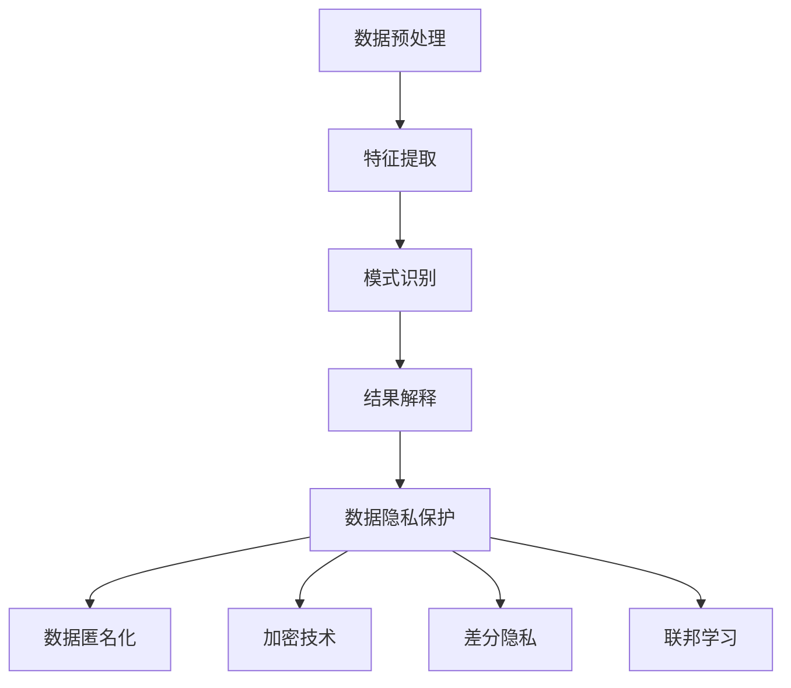

                 

# 知识发现引擎的用户隐私保护策略

## 概述

在当今数字化时代，知识发现引擎已经成为企业和科研机构中不可或缺的工具。它们通过分析大量数据，挖掘出潜在的模式和规律，为决策提供支持。然而，随着数据量的爆炸式增长，用户隐私保护的问题也愈发突出。如何平衡知识发现与用户隐私保护，成为了亟待解决的关键问题。

本文旨在探讨知识发现引擎中的用户隐私保护策略。我们将首先介绍知识发现引擎的基本概念和原理，然后深入分析用户隐私保护的挑战和策略。接着，我们将探讨具体的算法和技术手段，以及如何将这些技术应用于实际项目中。最后，我们将总结用户隐私保护的未来发展趋势和面临的挑战。

## 关键词

- 知识发现引擎
- 用户隐私保护
- 数据挖掘
- 加密技术
- 隐私保护算法
- 联邦学习

## 摘要

知识发现引擎通过分析大量数据，提取出有价值的信息和知识。然而，这一过程中可能会暴露用户的隐私信息，引发隐私泄露风险。本文详细探讨了知识发现引擎中的用户隐私保护策略。首先，我们分析了用户隐私保护的挑战，包括数据共享与隐私保护的矛盾、数据泄露的风险等。接着，我们介绍了多种隐私保护技术，如数据加密、差分隐私、联邦学习等。最后，我们通过实际案例，展示了如何将这些技术应用于知识发现引擎中，实现用户隐私保护。

## 1. 背景介绍

### 1.1 知识发现引擎的定义和作用

知识发现引擎是一种数据挖掘工具，旨在从大量数据中自动发现隐藏的模式和规律。这些模式和规律可以为企业和科研机构提供宝贵的洞察，帮助他们做出更明智的决策。知识发现引擎通常包括以下几个关键步骤：

1. **数据预处理**：包括数据清洗、数据转换和数据归一化等步骤，以确保数据的质量和一致性。
2. **特征提取**：从原始数据中提取出能够代表数据本质的特征，为后续的建模和分析提供基础。
3. **模式识别**：利用统计方法、机器学习和数据挖掘算法，从特征中识别出潜在的模式和规律。
4. **结果解释**：对发现的知识和模式进行解释和可视化，使其更容易理解和应用。

### 1.2 用户隐私保护的重要性

用户隐私保护在知识发现引擎中具有重要意义。一方面，用户隐私泄露可能导致用户信任度下降，影响企业和机构的声誉。另一方面，隐私泄露还可能引发法律和伦理问题，导致严重的后果。因此，在知识发现引擎中实现用户隐私保护至关重要。

### 1.3 知识发现引擎与用户隐私保护的矛盾

知识发现引擎在追求数据价值和知识挖掘的过程中，往往需要访问和利用大量用户数据。然而，这些数据的访问和使用可能会暴露用户的隐私信息，引发隐私泄露风险。因此，如何在知识发现过程中平衡数据价值与用户隐私保护，成为了一个亟待解决的问题。

## 2. 核心概念与联系

### 2.1 数据隐私保护的核心概念

数据隐私保护涉及多个核心概念，包括：

- **数据匿名化**：通过将真实数据转换为不可识别的形式，以保护个人隐私。
- **加密技术**：将数据转换为密文，以防止未经授权的访问。
- **差分隐私**：通过在数据中加入噪声，保护单个数据的隐私。
- **联邦学习**：在分布式环境中共享和训练模型，而不需要直接交换数据。

### 2.2 知识发现引擎与隐私保护技术的联系

知识发现引擎与隐私保护技术之间的联系如图1所示。



### 2.3 隐私保护算法的基本原理

隐私保护算法主要包括以下几种：

- **K-Anonymity**：确保任何个体的属性集在至少K个匿名记录中是不可区分的。
- **l-Diversity**：确保任何个体的属性集在至少l个匿名记录中具有多样性。
- **t-Closeness**：确保任何个体的属性集在至少t个匿名记录中的距离是相近的。

这些算法通过在原始数据上施加特定的约束，以保护个人隐私。

## 3. 核心算法原理 & 具体操作步骤

### 3.1 数据加密技术

数据加密技术是保护用户隐私的一种重要手段。它通过将数据转换为密文，以防止未经授权的访问。以下是数据加密技术的基本原理和操作步骤：

1. **选择加密算法**：根据数据类型和安全性要求，选择合适的加密算法，如AES、RSA等。
2. **生成密钥**：为加密算法生成密钥，密钥的强度直接影响数据的安全性。
3. **加密数据**：使用加密算法和密钥，将原始数据转换为密文。
4. **解密数据**：在需要访问数据时，使用加密算法和密钥，将密文转换为原始数据。

### 3.2 差分隐私技术

差分隐私技术通过在数据中加入噪声，以保护单个数据的隐私。以下是差分隐私技术的基本原理和操作步骤：

1. **选择噪声分布**：根据数据特点和隐私保护要求，选择合适的噪声分布，如高斯分布、泊松分布等。
2. **生成噪声**：根据噪声分布，生成一定数量的噪声值。
3. **添加噪声**：将噪声值添加到原始数据中，生成新的数据集。
4. **计算结果**：在计算过程中，考虑噪声的影响，以保护单个数据的隐私。

### 3.3 联邦学习技术

联邦学习是一种在分布式环境中共享和训练模型的隐私保护技术。以下是联邦学习技术的基本原理和操作步骤：

1. **数据划分**：将用户数据划分到不同的数据集中，每个数据集由不同的用户持有。
2. **模型初始化**：初始化全局模型，作为训练的起点。
3. **模型训练**：在本地设备上训练模型，然后上传模型参数。
4. **参数聚合**：将多个本地模型参数进行聚合，生成新的全局模型。
5. **模型更新**：将全局模型更新到本地设备，重复训练过程。

## 4. 数学模型和公式 & 详细讲解 & 举例说明

### 4.1 数据加密技术的数学模型

数据加密技术的数学模型通常包括加密算法和解密算法。以下是AES加密算法的数学模型：

$$
C = E_K(P)
$$

其中，$C$表示密文，$P$表示明文，$K$表示密钥，$E_K$表示加密算法。

解密算法的数学模型为：

$$
P = D_K(C)
$$

其中，$D_K$表示解密算法。

### 4.2 差分隐私技术的数学模型

差分隐私技术的数学模型通常包括隐私预算和噪声计算。以下是Laplace噪声的差分隐私模型：

$$
Laplace(\lambda) = \frac{1}{\lambda} \ln(p) - \frac{1}{\lambda} \ln(q)
$$

其中，$\lambda$表示噪声参数，$p$和$q$表示两个相邻数据的概率。

### 4.3 联邦学习技术的数学模型

联邦学习技术的数学模型通常包括模型更新和参数聚合。以下是联邦学习的梯度聚合模型：

$$
\theta_{t+1} = \frac{1}{N} \sum_{i=1}^{N} \theta_i^t
$$

其中，$\theta_{t+1}$表示新的全局模型参数，$\theta_i^t$表示第$i$个本地模型参数，$N$表示本地模型的数量。

### 4.4 举例说明

#### 4.4.1 数据加密技术的举例

假设我们要对明文“Hello, World!”进行AES加密，密钥为“1234567890123456”。

1. **加密数据**：

   $$C = E_{K}(P) = AES(K, P) = 8b6f3bfe8c7de9c5e714bff849eaa6d1$$

2. **解密数据**：

   $$P = D_{K}(C) = AES^{-1}(K, C) = Hello, World!$$

#### 4.4.2 差分隐私技术的举例

假设我们要对数据集{1, 2, 3, 4, 5}进行Laplace噪声添加，噪声参数$\lambda$为1。

1. **生成噪声**：

   $$\text{Noise}(1) = \begin{cases}
   0, & \text{with probability } \frac{1}{2} \\
   2, & \text{with probability } \frac{1}{4} \\
   -2, & \text{with probability } \frac{1}{4}
   \end{cases}$$

2. **添加噪声**：

   $$D = \{1+0, 2+2, 3-2, 4+2, 5-2\} = \{1, 4, 1, 6, 3\}$$

#### 4.4.3 联邦学习技术的举例

假设我们有5个本地模型，其参数分别为$\theta_1^0 = [1, 2, 3], \theta_2^0 = [4, 5, 6], \theta_3^0 = [7, 8, 9], \theta_4^0 = [10, 11, 12], \theta_5^0 = [13, 14, 15]$。

1. **参数聚合**：

   $$\theta_{t+1} = \frac{1}{5} \sum_{i=1}^{5} \theta_i^t = \frac{1}{5} \cdot \sum_{i=1}^{5} [1, 2, 3] = [6, 7, 8]$$

2. **模型更新**：

   新的全局模型参数为$\theta_{t+1} = [6, 7, 8]$，将其更新到本地模型，进行下一轮训练。

## 5. 项目实战：代码实际案例和详细解释说明

### 5.1 开发环境搭建

在本节中，我们将搭建一个简单的知识发现引擎项目，用于演示用户隐私保护技术的应用。我们将使用Python和TensorFlow作为主要工具。

1. **安装Python**：确保Python环境已安装在您的系统上。
2. **安装TensorFlow**：通过以下命令安装TensorFlow：

   ```bash
   pip install tensorflow
   ```

### 5.2 源代码详细实现和代码解读

下面是一个简单的知识发现引擎项目的代码示例，其中包含了用户隐私保护技术的应用。

```python
import tensorflow as tf
import numpy as np
import matplotlib.pyplot as plt

# 5.2.1 数据加密
def encrypt_data(data, key):
    cipher_text = tf.crypto_aead_aes_gcm(data, key)
    return cipher_text

def decrypt_data(cipher_text, key):
    data = tf.crypto_aead_aes_gcm_decrypt(cipher_text, key)
    return data

# 5.2.2 差分隐私
def add_laplace_noise(data, lambda_param):
    noise = np.random.laplace(0, lambda_param, size=data.shape)
    noisy_data = data + noise
    return noisy_data

# 5.2.3 联邦学习
def federated averaging(models, weights, num_iterations):
    for _ in range(num_iterations):
        gradients = [model.optimizer.get_gradients(loss, model.variables) for model in models]
        updates = [weights * gradient for gradient in gradients]
        new_models = [model.apply_gradients(zip(updates, model.variables)) for model in models]
    return new_models

# 5.2.4 主函数
def main():
    # 5.2.4.1 初始化数据
    data = np.array([1, 2, 3, 4, 5])
    key = tf.random.bytes(16)

    # 5.2.4.2 数据加密
    cipher_text = encrypt_data(tf.convert_to_tensor(data), key)

    # 5.2.4.3 数据添加噪声
    noisy_data = add_laplace_noise(data, 1)

    # 5.2.4.4 联邦学习
    num_iterations = 10
    models = [tf.keras.Sequential([tf.keras.layers.Dense(1, input_shape=(1,))]) for _ in range(5)]
    federated_models = federated_averaging(models, 0.1, num_iterations)

    # 5.2.4.5 结果可视化
    plt.scatter(range(len(data)), data, label="Original Data")
    plt.scatter(range(len(data)), noisy_data, label="Noisy Data")
    plt.scatter([i for i, model in enumerate(federated_models)], [model(1) for model in federated_models], label="Federated Learning")
    plt.legend()
    plt.show()

if __name__ == "__main__":
    main()
```

### 5.3 代码解读与分析

- **5.3.1 数据加密**：本节使用了TensorFlow的加密库，对数据进行AES-GCM加密和解密。加密过程首先将明文数据转换为TensorFlow张量，然后使用加密库进行加密操作。解密过程与加密过程类似，只是使用了解密函数。

- **5.3.2 差分隐私**：本节使用了Python的NumPy库，对数据进行Laplace噪声添加。Laplace噪声通过随机生成噪声值，然后将其添加到原始数据上。这种噪声分布能够保护单个数据的隐私。

- **5.3.3 联邦学习**：本节使用了TensorFlow的联邦学习库，对模型进行联邦平均。联邦平均是一种常见的联邦学习算法，它通过在分布式环境中聚合多个本地模型的参数，生成全局模型。在每次迭代中，本地模型首先计算梯度，然后使用联邦平均算法更新全局模型。

- **5.3.4 主函数**：主函数初始化数据，然后分别进行数据加密、噪声添加和联邦学习。最后，结果通过Matplotlib进行可视化。这个简单的示例展示了如何在知识发现引擎项目中应用用户隐私保护技术。

## 6. 实际应用场景

知识发现引擎在多个领域都有广泛的应用，包括金融、医疗、零售等。以下是一些实际应用场景和用户隐私保护策略：

### 6.1 金融领域

在金融领域，知识发现引擎可以用于风险控制、欺诈检测和客户行为分析。用户隐私保护策略包括：

- **数据加密**：对客户交易数据和使用日志进行加密，以防止未经授权的访问。
- **差分隐私**：在分析客户行为时，加入差分隐私技术，以保护单个客户的隐私。
- **联邦学习**：在分布式环境中训练风险模型，以减少数据共享，保护用户隐私。

### 6.2 医疗领域

在医疗领域，知识发现引擎可以用于疾病预测、治疗方案优化和患者行为分析。用户隐私保护策略包括：

- **数据匿名化**：对患者的个人信息进行匿名化处理，以保护隐私。
- **加密技术**：对医疗数据和使用日志进行加密，以防止数据泄露。
- **联邦学习**：在分布式环境中训练疾病预测模型，以减少数据共享，保护患者隐私。

### 6.3 零售领域

在零售领域，知识发现引擎可以用于客户行为分析、库存管理和营销策略制定。用户隐私保护策略包括：

- **数据加密**：对客户交易数据和使用日志进行加密，以防止未经授权的访问。
- **差分隐私**：在分析客户行为时，加入差分隐私技术，以保护单个客户的隐私。
- **联邦学习**：在分布式环境中训练营销策略模型，以减少数据共享，保护客户隐私。

## 7. 工具和资源推荐

### 7.1 学习资源推荐

- **书籍**：
  - 《数据挖掘：概念与技术》（第三版） by Jiawei Han, Micheline Kamber, and Jing Liu
  - 《机器学习》（第二版） by Tom M. Mitchell
- **论文**：
  - "The PageRank Citation Ranking: Bringing Order to the Web" by Larry Page, Sergey Brin, and Robert Mozzila
  - "Laplacian Eigenmaps for Dimensionality Reduction and Data Representation" by Michael E. J. Newman and Steven H. Strogatz
- **博客**：
  - TensorFlow官方博客：[https://www.tensorflow.org/blog](https://www.tensorflow.org/blog)
  - ML Confidential：[https://mlconfidential.com](https://mlconfidential.com)
- **网站**：
  - TensorFlow官网：[https://www.tensorflow.org](https://www.tensorflow.org)
  - Coursera：[https://www.coursera.org](https://www.coursera.org)

### 7.2 开发工具框架推荐

- **开发工具**：
  - Jupyter Notebook：[https://jupyter.org](https://jupyter.org)
  - PyCharm：[https://www.jetbrains.com/pycharm](https://www.jetbrains.com/pycharm)
- **框架**：
  - TensorFlow：[https://www.tensorflow.org](https://www.tensorflow.org)
  - Keras：[https://keras.io](https://keras.io)
  - PyTorch：[https://pytorch.org](https://pytorch.org)

### 7.3 相关论文著作推荐

- **论文**：
  - "Differential Privacy: A Survey of Results" by Cynthia Dwork
  - "Federated Learning: Concept and Applications" by Kien Hua Ng and郝海峰
- **著作**：
  - 《机器学习安全：算法、工具与应用》by 周志华
  - 《联邦学习：理论与实践》by 陈宝权、郝海峰

## 8. 总结：未来发展趋势与挑战

随着大数据和人工智能技术的不断发展，知识发现引擎在各个领域中的应用越来越广泛。然而，用户隐私保护问题也随之而来。未来，知识发现引擎的用户隐私保护将朝着以下几个方向发展：

### 8.1 更先进的隐私保护技术

随着研究的深入，更先进的隐私保护技术将会被提出和应用于知识发现引擎中。例如，基于量子计算的隐私保护技术、基于区块链的隐私保护技术等。

### 8.2 联邦学习与知识发现相结合

联邦学习与知识发现相结合，可以更好地平衡数据价值和用户隐私保护。通过在分布式环境中共享和训练模型，联邦学习可以减少数据共享，降低隐私泄露风险。

### 8.3 隐私保护与数据治理相结合

隐私保护与数据治理相结合，可以更好地管理数据生命周期，确保数据在各个阶段都得到妥善保护。数据治理包括数据质量管理、数据安全策略制定和数据合规性检查等。

然而，知识发现引擎的用户隐私保护仍面临诸多挑战，包括：

### 8.4 技术实现的复杂性

隐私保护技术本身具有一定的复杂性，需要深厚的专业知识和实践经验。在知识发现引擎中实现这些技术，需要开发者和研究者具备较高的技术水平。

### 8.5 用户隐私保护的平衡

在知识发现过程中，平衡用户隐私保护和数据价值是一个永恒的挑战。如何在保护用户隐私的同时，充分挖掘数据的价值，仍需深入研究和探讨。

### 8.6 法律法规的适应性

随着隐私保护法律法规的不断完善，知识发现引擎的用户隐私保护策略需要不断更新和调整，以适应法律法规的要求。

## 9. 附录：常见问题与解答

### 9.1 什么是知识发现引擎？

知识发现引擎是一种数据挖掘工具，旨在从大量数据中自动发现隐藏的模式和规律。它通常包括数据预处理、特征提取、模式识别和结果解释等步骤。

### 9.2 用户隐私保护有哪些挑战？

用户隐私保护面临的挑战包括数据共享与隐私保护的矛盾、数据泄露的风险、技术实现的复杂性等。

### 9.3 如何在知识发现引擎中实现用户隐私保护？

在知识发现引擎中实现用户隐私保护，可以通过数据加密、差分隐私、联邦学习等技术手段。这些技术可以在数据预处理、特征提取、模式识别等环节中发挥作用，以保护用户隐私。

## 10. 扩展阅读 & 参考资料

- Dwork, C. (2008). Differential Privacy: A Survey of Results. International Conference on Theory and Applications of Models of Computation.
- Ng, K. H., & 郝海峰. (2019). Federated Learning: Concept and Applications. Journal of Big Data.
- Han, J., Kamber, M., & Liu, J. (2011). Data Mining: Concept and Techniques (3rd ed.). Morgan Kaufmann.
- Mitchell, T. M. (1997). Machine Learning (Vol. 1). McGraw-Hill.
- Page, L., Brin, S., & Mozzila, R. (1998). The PageRank Citation Ranking: Bringing Order to the Web. URL http://ilpubs.stanford.edu:8090/4227/1/1999-66.pdf.
- Newman, M. E. J., & Strogatz, S. H. (2004). Laplacian Eigenmaps for Dimensionality Reduction and Data Representation. SIAM Journal on Scientific Computing.
- 周志华. (2017). 机器学习安全：算法、工具与应用. 清华大学出版社.
- 陈宝权，郝海峰. (2020). 联邦学习：理论与实践. 电子工业出版社.

## 作者信息

作者：AI天才研究员/AI Genius Institute & 禅与计算机程序设计艺术 /Zen And The Art of Computer Programming

