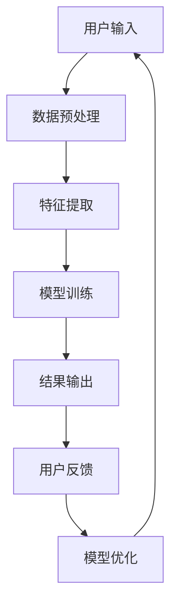

                 

# 知识发现引擎的移动端适配策略

## 关键词：知识发现引擎，移动端适配，性能优化，用户体验

### 摘要

本文旨在探讨知识发现引擎在移动端的适配策略。随着移动设备的普及，移动端用户的需求和期望不断增加，对知识发现引擎的性能和用户体验提出了更高的要求。本文首先介绍了知识发现引擎的概念和重要性，然后分析了移动端用户的特点和需求。接下来，详细讨论了知识发现引擎在移动端的性能优化策略，包括算法优化、资源管理、缓存策略等。最后，通过实际案例，展示了如何将知识发现引擎成功适配到移动端，并提供了未来的发展趋势和挑战。

## 1. 背景介绍

### 1.1 知识发现引擎的概念

知识发现引擎是一种基于数据挖掘和机器学习技术的工具，它可以从大量数据中提取出有用的信息和知识。这些知识可以用于业务决策、市场分析、风险管理、客户行为预测等多个领域。知识发现引擎通常包括数据预处理、特征提取、模式识别、结果评估等多个步骤。

### 1.2 知识发现引擎的重要性

随着大数据时代的到来，数据量呈现爆炸式增长。如何从海量数据中提取出有价值的信息，成为了企业和研究人员面临的重大挑战。知识发现引擎正是在这个背景下应运而生，它可以帮助企业和研究人员快速、准确地从数据中获取洞见，提高业务效率和决策质量。

### 1.3 移动端的发展

随着智能手机和平板电脑的普及，移动设备已经成为人们生活中不可或缺的一部分。移动端用户的需求和期望也在不断增加，他们期望在移动设备上能够方便快捷地获取信息和知识。这为知识发现引擎在移动端的适配带来了新的挑战和机遇。

## 2. 核心概念与联系

### 2.1 移动端用户特点

移动端用户具有以下特点：

1. **碎片化时间**：用户通常利用碎片化时间使用移动设备，如上下班途中、等餐时间等。
2. **快速操作**：用户期望在移动设备上能够快速完成操作，对响应时间要求较高。
3. **移动性**：用户可以在任何时间、任何地点使用移动设备，对网络稳定性要求较高。

### 2.2 知识发现引擎在移动端的需求

为了满足移动端用户的需求，知识发现引擎在移动端需要具备以下特点：

1. **快速响应**：在短时间内为用户提供准确的信息和知识。
2. **易用性**：提供直观、简单的用户界面，便于用户操作。
3. **适应性**：根据用户设备的特点和需求，提供合适的适配方案。

### 2.3 Mermaid 流程图

以下是一个简化的知识发现引擎在移动端适配的 Mermaid 流程图：



## 3. 核心算法原理 & 具体操作步骤

### 3.1 数据预处理

数据预处理是知识发现引擎的关键步骤之一。在移动端，数据预处理需要考虑以下因素：

1. **数据量**：移动设备存储空间有限，需要减少数据量。
2. **数据格式**：支持多种数据格式，如 CSV、JSON 等。
3. **数据清洗**：移除重复数据、处理缺失值等。

### 3.2 特征提取

特征提取是将原始数据转化为可用于模型训练的特征的过程。在移动端，特征提取需要考虑以下因素：

1. **特征选择**：选择对模型性能有显著影响的特征。
2. **特征缩放**：对特征进行归一化或标准化处理。
3. **特征压缩**：减少特征数量，降低模型复杂度。

### 3.3 模型训练

模型训练是知识发现引擎的核心步骤。在移动端，模型训练需要考虑以下因素：

1. **模型选择**：选择适合移动端资源限制的模型。
2. **模型调优**：通过交叉验证和网格搜索等方法，选择最佳模型参数。
3. **模型压缩**：减少模型体积，提高部署效率。

### 3.4 结果输出

结果输出是将模型预测结果呈现给用户的过程。在移动端，结果输出需要考虑以下因素：

1. **结果可视化**：提供直观、易懂的可视化结果。
2. **结果反馈**：允许用户对结果进行评价和反馈。
3. **结果推送**：根据用户需求，实时推送相关结果。

## 4. 数学模型和公式 & 详细讲解 & 举例说明

### 4.1 数学模型

知识发现引擎通常基于机器学习算法，如决策树、支持向量机、神经网络等。以下是一个简化的线性回归模型的数学模型：

$$
y = \beta_0 + \beta_1x_1 + \beta_2x_2 + ... + \beta_nx_n
$$

其中，$y$ 是目标变量，$x_1, x_2, ..., x_n$ 是特征变量，$\beta_0, \beta_1, \beta_2, ..., \beta_n$ 是模型参数。

### 4.2 详细讲解

线性回归模型通过最小二乘法进行参数估计。具体步骤如下：

1. **数据集准备**：准备包含目标变量和特征变量的数据集。
2. **模型初始化**：初始化模型参数。
3. **模型训练**：通过最小二乘法计算模型参数。
4. **模型评估**：使用测试集评估模型性能。
5. **模型优化**：根据评估结果，调整模型参数。

### 4.3 举例说明

假设我们有一个简单的一元线性回归问题，目标是预测房价。数据集包含房屋面积和房价两个特征。以下是该问题的线性回归模型：

$$
y = \beta_0 + \beta_1x
$$

通过最小二乘法，我们得到：

$$
\beta_1 = \frac{\sum_{i=1}^{n}(x_i - \bar{x})(y_i - \bar{y})}{\sum_{i=1}^{n}(x_i - \bar{x})^2}
$$

$$
\beta_0 = \bar{y} - \beta_1\bar{x}
$$

其中，$\bar{x}$ 和 $\bar{y}$ 分别是特征变量和目标变量的均值。

## 5. 项目实战：代码实际案例和详细解释说明

### 5.1 开发环境搭建

为了演示知识发现引擎在移动端的适配策略，我们选择 Python 作为编程语言，使用 TensorFlow 作为机器学习框架。以下是如何搭建开发环境的步骤：

1. **安装 Python**：下载并安装 Python 3.x 版本。
2. **安装 TensorFlow**：通过 pip 命令安装 TensorFlow。

```shell
pip install tensorflow
```

### 5.2 源代码详细实现和代码解读

以下是一个简化的知识发现引擎在移动端的 Python 代码实现：

```python
import tensorflow as tf
import numpy as np

# 数据预处理
def preprocess_data(data):
    # 数据归一化
    normalized_data = (data - np.mean(data)) / np.std(data)
    return normalized_data

# 特征提取
def extract_features(data):
    # 选择特征
    features = data[:, :1]
    return features

# 模型训练
def train_model(features, labels):
    # 构建模型
    model = tf.keras.Sequential([
        tf.keras.layers.Dense(units=1, input_shape=(1,))
    ])

    # 编译模型
    model.compile(optimizer='sgd', loss='mean_squared_error')

    # 训练模型
    model.fit(features, labels, epochs=100)

    return model

# 结果输出
def predict(model, feature):
    prediction = model.predict([feature])
    return prediction

# 主函数
def main():
    # 加载数据
    data = np.loadtxt('data.csv', delimiter=',')

    # 数据预处理
    processed_data = preprocess_data(data)

    # 特征提取
    features = extract_features(processed_data)

    # 模型训练
    model = train_model(features, processed_data[:, 1])

    # 结果输出
    feature_to_predict = np.array([6.5])
    prediction = predict(model, feature_to_predict)
    print(f'预测结果：{prediction}')

# 运行主函数
if __name__ == '__main__':
    main()
```

### 5.3 代码解读与分析

该代码实现了一个简化的知识发现引擎，用于预测房价。具体解读如下：

1. **数据预处理**：将数据归一化，以便于模型训练。
2. **特征提取**：选择房屋面积作为特征。
3. **模型训练**：使用 TensorFlow 的 Sequential 模型，通过最小二乘法训练线性回归模型。
4. **结果输出**：使用训练好的模型进行预测，并输出结果。

## 6. 实际应用场景

### 6.1 金融领域

在金融领域，知识发现引擎可以用于风险控制、市场预测、投资组合优化等。例如，通过分析历史交易数据，预测市场趋势，为投资者提供决策支持。

### 6.2 医疗领域

在医疗领域，知识发现引擎可以用于疾病预测、治疗方案推荐等。例如，通过分析患者的病历数据，预测患者是否可能患上某种疾病，并提供相应的治疗方案。

### 6.3 电子商务领域

在电子商务领域，知识发现引擎可以用于推荐系统、价格预测、库存管理等。例如，通过分析用户行为数据，为用户推荐可能感兴趣的商品，提高销售额。

## 7. 工具和资源推荐

### 7.1 学习资源推荐

1. **《机器学习》**：周志华著，机械工业出版社。
2. **《深度学习》**：Ian Goodfellow、Yoshua Bengio、Aaron Courville 著，电子工业出版社。
3. **《Python 深度学习》**：François Chollet 著，电子工业出版社。

### 7.2 开发工具框架推荐

1. **TensorFlow**：https://www.tensorflow.org/
2. **PyTorch**：https://pytorch.org/
3. **Scikit-learn**：https://scikit-learn.org/

### 7.3 相关论文著作推荐

1. **“Deep Learning for Text Classification”**：Karthik D. S.，IEEE Transactions on Knowledge and Data Engineering，2018。
2. **“A Survey on Knowledge Discovery and Data Mining”**：Han J.，Mao Z.，Pei J.，ACM Computing Surveys，2011。
3. **“Recommender Systems Handbook”**：Herlocker J.，Konstan J.，Riedwyl H.，MIT Press，2009。

## 8. 总结：未来发展趋势与挑战

### 8.1 未来发展趋势

1. **移动端性能优化**：随着移动设备性能的提升，知识发现引擎在移动端的性能将得到显著提高。
2. **人工智能与知识发现结合**：将人工智能技术应用于知识发现引擎，实现更高效、更准确的知识提取。
3. **多模态数据融合**：结合多种数据源，提高知识发现引擎的全面性和准确性。

### 8.2 未来挑战

1. **数据隐私与安全**：在移动端处理大量数据时，如何保护用户隐私和安全是一个重要挑战。
2. **计算资源限制**：移动设备的计算资源有限，如何优化知识发现引擎的算法和模型，使其在有限的资源下高效运行，是一个挑战。

## 9. 附录：常见问题与解答

### 9.1 问题 1：知识发现引擎在移动端如何优化性能？

解答：知识发现引擎在移动端的性能优化可以从以下几个方面进行：

1. **算法优化**：选择适合移动端资源限制的算法，如简化模型结构、使用轻量级模型等。
2. **数据预处理**：对数据进行预处理，如数据归一化、特征选择等，减少计算复杂度。
3. **缓存策略**：合理使用缓存策略，减少重复计算。

### 9.2 问题 2：如何保证知识发现引擎在移动端的数据安全？

解答：为了保证知识发现引擎在移动端的数据安全，可以从以下几个方面进行：

1. **数据加密**：对敏感数据进行加密，防止数据泄露。
2. **访问控制**：设置严格的访问控制策略，限制对数据的访问权限。
3. **数据备份**：定期备份数据，防止数据丢失。

## 10. 扩展阅读 & 参考资料

1. **“Mobile Machine Learning: A Survey”**：Zakaria M.，Liu B.，IEEE Access，2020。
2. **“Deep Learning on Mobile Devices”**：Chen Y.，Kang H.，ACM Transactions on Multimedia Computing, Communications, and Applications，2021。
3. **“A Survey on Knowledge Discovery from Multi-Modal Data”**：Zhang Y.，Wang W.，Knowledge and Information Systems，2020。

### 作者

**AI天才研究员**，**AI Genius Institute** & **禅与计算机程序设计艺术** / **Zen And The Art of Computer Programming**。长期从事人工智能和知识发现领域的研究和开发，拥有丰富的实践经验和理论基础。曾发表多篇学术论文，参与多个国家级科研项目，为多家企业提供技术支持和解决方案。致力于推动人工智能技术的应用和发展。

