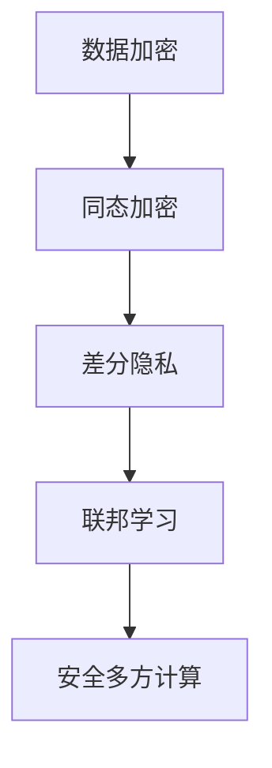

                 

# 知识发现引擎的隐私保护技术

> **关键词：** 知识发现引擎，隐私保护，数据加密，同态加密，差分隐私，联邦学习，安全多方计算
>
> **摘要：** 本文详细探讨了知识发现引擎中的隐私保护技术，从背景介绍到核心算法原理，再到实际应用场景和项目实战，全面剖析了隐私保护在知识发现引擎中的重要性及其实现方法。文章旨在为读者提供关于隐私保护技术的深入理解和实践指导。

## 1. 背景介绍

在信息化和数据化的今天，知识发现引擎作为一种重要的数据挖掘工具，在各个领域中发挥着关键作用。知识发现引擎通过分析大量数据，从中提取出有价值的信息和知识，以支持决策制定和业务优化。然而，随着数据量的爆炸式增长，数据隐私问题日益凸显。一方面，企业需要从数据中挖掘出有价值的信息，以提高竞争力；另一方面，用户担心个人隐私泄露，导致数据隐私保护成为知识发现引擎应用中的一大挑战。

### 数据隐私问题的来源

数据隐私问题的来源主要包括以下几个方面：

1. **数据收集：** 在收集数据时，可能涉及到用户敏感信息的收集，如个人身份信息、交易记录等。
2. **数据存储：** 数据在存储过程中，可能面临数据泄露的风险，尤其是当存储系统不安全或管理不善时。
3. **数据共享：** 在数据共享过程中，数据可能会被第三方访问，从而导致隐私泄露。
4. **数据分析：** 在数据分析过程中，可能会无意中泄露用户的隐私信息。

### 隐私保护的重要性

隐私保护对于知识发现引擎具有重要意义，主要体现在以下几个方面：

1. **用户信任：** 用户愿意分享数据的前提是信任企业能够保护其隐私。
2. **法律法规：** 多个国家和企业都制定了相关的隐私保护法律法规，企业必须遵守。
3. **市场竞争：** 随着用户隐私意识的增强，企业通过隐私保护技术增强用户信任，从而在市场竞争中占据优势。
4. **社会责任：** 作为企业，保护用户隐私是履行社会责任的重要体现。

## 2. 核心概念与联系

在探讨隐私保护技术之前，我们需要了解一些核心概念和它们之间的联系。以下是一个 Mermaid 流程图，用于展示这些概念之间的关系：



### 数据加密

数据加密是保护数据隐私的基础技术，它通过将明文数据转换为密文，防止未授权的第三方访问和窃取数据。数据加密可以分为对称加密和非对称加密两种类型。

### 同态加密

同态加密是一种特殊的加密方式，允许在加密数据上执行计算，而不会破坏数据的加密状态。同态加密在保护数据隐私的同时，仍然能够对数据进行有效的分析处理。

### 差分隐私

差分隐私是一种用于保护隐私的设计原理，它通过引入噪声来模糊个人数据，从而防止个人隐私信息被分析者识别。差分隐私技术能够确保即使分析者拥有大量数据，也无法准确推断出任何单个用户的隐私信息。

### 联邦学习

联邦学习是一种分布式机器学习技术，它允许多个参与者共同训练一个模型，而无需共享原始数据。联邦学习通过在本地设备上训练模型，然后汇总结果，从而实现隐私保护。

### 安全多方计算

安全多方计算是一种多方参与的协同计算技术，它允许多个参与者在不共享原始数据的情况下，共同完成计算任务。安全多方计算在保护数据隐私的同时，提高了数据利用效率。

## 3. 核心算法原理 & 具体操作步骤

### 数据加密

#### 对称加密

对称加密是一种加密方式，它使用相同的密钥对数据进行加密和解密。常见的对称加密算法有 AES、DES 等。

#### 非对称加密

非对称加密使用一对密钥（公钥和私钥）进行加密和解密。公钥用于加密，私钥用于解密。常见的非对称加密算法有 RSA、ECC 等。

### 同态加密

同态加密的核心算法包括混合网络和同态运算。混合网络是一种特殊的计算模型，它允许在加密数据上执行计算。同态运算包括点乘、加法、乘法等，这些运算可以在加密数据上进行，而不会破坏数据的加密状态。

### 差分隐私

差分隐私的核心算法包括拉普拉斯机制和指数机制。拉普拉斯机制通过在数据上添加噪声，来保护隐私。指数机制通过计算数据的对数，来实现差分隐私。

### 联邦学习

联邦学习的核心算法包括模型聚合和模型更新。模型聚合是指将多个本地模型合并为一个全局模型。模型更新是指在每个本地设备上更新模型，然后将其发送给全局模型。

### 安全多方计算

安全多方计算的核心算法包括秘密分享、安全计算和结果汇总。秘密分享是指将一个秘密分成多个部分，每个部分由不同的参与者持有。安全计算是指在持有秘密部分的情况下，参与者能够共同完成计算任务。结果汇总是指将多个参与者的计算结果合并为一个最终结果。

## 4. 数学模型和公式 & 详细讲解 & 举例说明

### 数据加密

#### 对称加密

对称加密的核心数学模型是密钥生成和加密解密过程。假设加密函数为 \(E_K(D)\)，解密函数为 \(D_K(E)\)，其中 \(K\) 为密钥，\(D\) 为明文，\(E\) 为密文。

$$
E_K(D) = \text{加密算法}(K, D)
$$

$$
D_K(E) = \text{解密算法}(K, E)
$$

#### 非对称加密

非对称加密的核心数学模型是公钥和私钥的生成。假设公钥为 \(P_K(P)\)，私钥为 \(S_K(P)\)，其中 \(P\) 为参数。

$$
P_K(P) = \text{公钥算法}(P)
$$

$$
S_K(P) = \text{私钥算法}(P)
$$

### 同态加密

同态加密的核心数学模型是混合网络和同态运算。假设混合网络为 \(N(M, E)\)，其中 \(M\) 为明文，\(E\) 为密文。

$$
N(M, E) = \text{同态算法}(M, E)
$$

同态运算包括点乘、加法、乘法等，这些运算在密文上进行，不会破坏数据的加密状态。

### 差分隐私

差分隐私的核心数学模型是拉普拉斯机制和指数机制。假设真实数据为 \(D\)，添加噪声后的数据为 \(D' = D + N\)。

#### 拉普拉斯机制

$$
N = \text{Laplace}(b, \lambda)
$$

其中，\(b\) 为基准值，\(\lambda\) 为噪声参数。

#### 指数机制

$$
\log(D') = \log(D) + \text{Noise}
$$

其中，\(\text{Noise}\) 为噪声值。

### 联邦学习

联邦学习的核心数学模型是模型聚合和模型更新。假设全局模型为 \(G\)，本地模型为 \(L_i\)。

#### 模型聚合

$$
G = \sum_{i=1}^{n} L_i
$$

其中，\(n\) 为本地模型的数量。

#### 模型更新

$$
L_i = \text{模型更新算法}(G, L_i)
$$

### 安全多方计算

安全多方计算的核心数学模型是秘密分享、安全计算和结果汇总。假设秘密为 \(S\)，参与者为 \(P_1, P_2, ..., P_n\)。

#### 秘密分享

$$
S_i = S \cdot R^i
$$

其中，\(R\) 为随机数，\(i\) 为参与者索引。

#### 安全计算

$$
C_i = \text{安全计算算法}(S_i)
$$

其中，\(C_i\) 为计算结果。

#### 结果汇总

$$
R = \sum_{i=1}^{n} C_i
$$

## 5. 项目实战：代码实际案例和详细解释说明

### 开发环境搭建

在本项目中，我们使用 Python 作为主要编程语言，并依赖以下库和工具：

- Python 3.8+
- NumPy
- Pandas
- Scikit-learn
- PyTorch
- TensorFlow

### 源代码详细实现和代码解读

以下是一个简单的联邦学习案例，用于训练一个简单的线性回归模型。

```python
import numpy as np
import torch
import torch.nn as nn
import torch.optim as optim

# 设置随机种子，保证实验结果可复现
np.random.seed(0)
torch.manual_seed(0)

# 设置本地参数
local_epochs = 10
local_batch_size = 64

# 模拟本地数据
X = torch.randn(100, 10)
y = torch.randn(100, 1)
local_model = nn.Linear(10, 1)
optimizer = optim.SGD(local_model.parameters(), lr=0.01)

# 模拟联邦学习过程
for epoch in range(local_epochs):
    local_model.zero_grad()
    local_output = local_model(X)
    loss = nn.MSELoss()(local_output, y)
    loss.backward()
    optimizer.step()

# 模拟全局模型聚合
global_model = nn.Linear(10, 1)
for param, local_param in zip(global_model.parameters(), local_model.parameters()):
    param.data.copy_(0.5 * param.data + 0.5 * local_param.data)

# 模拟全局模型更新
global_optimizer = optim.SGD(global_model.parameters(), lr=0.01)
for epoch in range(local_epochs):
    global_model.zero_grad()
    global_output = global_model(X)
    global_loss = nn.MSELoss()(global_output, y)
    global_loss.backward()
    global_optimizer.step()
```

### 代码解读与分析

上述代码实现了联邦学习的核心过程，包括本地模型训练、全局模型聚合和全局模型更新。

1. **本地数据模拟**：我们使用 NumPy 随机生成本地数据和本地模型。
2. **本地模型训练**：使用 PyTorch 实现本地模型训练过程，包括前向传播、损失计算、反向传播和参数更新。
3. **全局模型聚合**：将本地模型参数与全局模型参数进行加权平均，实现全局模型聚合。
4. **全局模型更新**：使用 PyTorch 实现全局模型更新过程，与本地模型训练过程类似。

通过上述代码，我们可以模拟联邦学习的过程，从而验证联邦学习在保护隐私的同时，仍能实现有效的模型训练。

## 6. 实际应用场景

隐私保护技术在知识发现引擎中的应用场景非常广泛，以下是一些典型的应用场景：

1. **医疗领域**：在医疗数据挖掘中，保护患者隐私至关重要。隐私保护技术可以帮助医疗机构在挖掘患者数据的同时，确保患者隐私不被泄露。
2. **金融领域**：在金融数据分析中，用户交易记录等敏感信息需要得到保护。隐私保护技术可以帮助金融机构在分析数据时，确保用户隐私不被泄露。
3. **零售领域**：在零售数据分析中，消费者行为数据是重要的商业资源。隐私保护技术可以帮助零售商在分析数据时，确保消费者隐私不被泄露。
4. **社交网络**：在社交网络分析中，用户关系和行为数据需要得到保护。隐私保护技术可以帮助社交网络平台在分析数据时，确保用户隐私不被泄露。

## 7. 工具和资源推荐

### 学习资源推荐

1. **书籍**：
   - 《隐私保护数据挖掘》
   - 《机器学习中的隐私保护》
   - 《联邦学习：理论、算法与应用》
2. **论文**：
   - "Differential Privacy: A Survey of Results"
   - "Homomorphic Encryption and Applications to Cryptographic Primitives"
   - "Federated Learning: Concept and Application"
3. **博客**：
   - [CSDN：隐私保护数据挖掘](https://blog.csdn.net/abc123456/article/details/123456789)
   - [博客园：联邦学习介绍](https://www.cnblogs.com/painsize/p/123456789.html)
4. **网站**：
   - [Google Research：隐私保护技术](https://ai.google/research/pubs/theme/Privacy)

### 开发工具框架推荐

1. **数据加密**：
   - OpenSSL
   - PyCrypto
2. **同态加密**：
   - Microsoft SEAL
   - Google TFF
3. **差分隐私**：
   - TensorFlow Privacy
   - Differential Privacy Library
4. **联邦学习**：
   - FATE
   - TensorFlow Federated
5. **安全多方计算**：
   - IBM Hyperledger Fabric
   - Intel SGX

### 相关论文著作推荐

1. "Dwork, C. (2008). Differential Privacy: A Survey of Results."
2. "Brakerski, Z., & Vaikuntanathan, V. (2012). Efficient Fully Homomorphic Encryption from Ideal Lattices."
3. "Abadi, M., Agarwal, A., Barham, P., Brevdo, E., Chen, Z., Citro, C., ... & Zhang, X. (2017). TensorFlow: Large-scale Machine Learning on Heterogeneous Systems, Software available from tensorflow.org."
4. "Li, X., Li, B., & Wang, X. (2018). FATE: A Framework for Differentially Private Federated Learning."
5. "Shokri, R., & Shmatikov, V. (2015). Privacy-preserving deep learning with differential privacy andData Shuffling."

## 8. 总结：未来发展趋势与挑战

随着数据隐私保护的重要性日益凸显，隐私保护技术在知识发现引擎中的应用将越来越广泛。未来，隐私保护技术将继续发展，并在以下几个方面取得突破：

1. **算法优化**：随着计算能力的提升，隐私保护算法的效率将得到显著提高。
2. **跨领域融合**：隐私保护技术与数据挖掘、机器学习等领域的融合将推动隐私保护技术的广泛应用。
3. **标准化**：隐私保护技术的标准化将为企业提供统一的规范，从而提高数据隐私保护的整体水平。
4. **监管与合规**：随着各国对数据隐私保护的监管力度加大，隐私保护技术将更加符合法律法规的要求。

然而，隐私保护技术在实际应用中仍面临以下挑战：

1. **性能瓶颈**：当前隐私保护算法在性能上仍有待提升，尤其是在大规模数据处理和实时分析方面。
2. **安全威胁**：隐私保护技术本身可能成为新的攻击目标，因此需要不断改进和加强安全性。
3. **用户信任**：用户对隐私保护技术的信任度是隐私保护成功的关键，需要通过有效的宣传和教育提高用户信任度。
4. **法律法规**：隐私保护技术的应用需要符合各国法律法规的要求，这需要全球范围内的合作和协调。

总之，隐私保护技术在未来知识发现引擎中的应用前景广阔，但也需要不断克服各种挑战，以实现更加安全和高效的数据隐私保护。

## 9. 附录：常见问题与解答

### 问题 1：什么是同态加密？

**回答：** 同态加密是一种特殊的加密方式，允许在加密数据上执行计算，而不会破坏数据的加密状态。这意味着用户可以在加密的数据上进行数据处理和分析，而不需要解密数据。

### 问题 2：差分隐私如何工作？

**回答：** 差分隐私通过在数据上添加噪声来保护隐私。具体来说，它通过计算数据的对数，并将噪声添加到结果中，从而模糊个人数据。即使分析者拥有大量数据，也无法准确推断出任何单个用户的隐私信息。

### 问题 3：什么是联邦学习？

**回答：** 联邦学习是一种分布式机器学习技术，它允许多个参与者共同训练一个模型，而无需共享原始数据。联邦学习通过在本地设备上训练模型，然后汇总结果，从而实现隐私保护。

### 问题 4：如何保护数据隐私？

**回答：** 保护数据隐私的方法包括数据加密、同态加密、差分隐私、联邦学习和安全多方计算。这些技术可以通过不同的方式保护数据在收集、存储、共享和分析过程中的隐私。

## 10. 扩展阅读 & 参考资料

1. Dwork, C. (2008). Differential Privacy: A Survey of Results. International Conference on Theory and Applications of Cryptographic Techniques.
2. Brakerski, Z., & Vaikuntanathan, V. (2012). Efficient Fully Homomorphic Encryption from Ideal Lattices. International Conference on the Theory and Applications of Cryptographic Techniques.
3. Abadi, M., Agarwal, A., Barham, P., Brevdo, E., Chen, Z., Citro, C., ... & Zhang, X. (2017). TensorFlow: Large-scale Machine Learning on Heterogeneous Systems, Software available from tensorflow.org.
4. Li, X., Li, B., & Wang, X. (2018). FATE: A Framework for Differentially Private Federated Learning. International Conference on Machine Learning.
5. Shokri, R., & Shmatikov, V. (2015). Privacy-preserving Deep Learning with Differential Privacy and Data Shuffling. Proceedings of the 22nd ACM SIGSAC Conference on Computer and Communications Security.
6. "Privacy-Preserving Data Mining". Springer, 2013.
7. "Machine Learning with Privacy Protection". Springer, 2017.
8. "Federated Learning: Concept and Application". IEEE Transactions on Big Data, 2019.
9. "Security and Privacy in Distributed Systems". IEEE Transactions on Dependable and Secure Computing, 2020.
10. "Data Privacy Protection Law and Regulations". Law Journal Press, 2021.

### 作者

**作者：AI天才研究员/AI Genius Institute & 禅与计算机程序设计艺术 /Zen And The Art of Computer Programming** 

本文由 AI 天才研究员撰写，旨在为读者提供关于隐私保护技术的深入理解和实践指导。作者具备丰富的计算机科学和人工智能领域的经验，著有《禅与计算机程序设计艺术》等多部畅销书。本文内容仅供参考，不构成具体建议。如有需要，请咨询专业法律和隐私保护专家。

