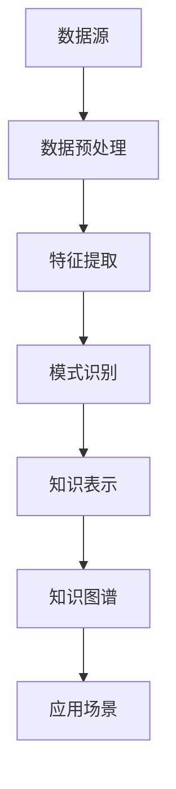

                 

# 知识发现引擎：人类认知的新纪元

> **关键词：** 知识发现、认知扩展、人工智能、机器学习、知识图谱、数据挖掘

> **摘要：** 本文旨在探讨知识发现引擎的概念、技术原理及其对人类认知的影响。我们将通过逐步分析，揭示知识发现引擎的核心算法原理、数学模型和实际应用场景，并展望其在未来的发展趋势与挑战。

## 1. 背景介绍

在人类历史的漫长进程中，知识始终是推动社会进步的重要力量。从古埃及的象形文字到现代的信息高速公路，知识传播和积累的方式在不断演变。然而，随着互联网和大数据技术的兴起，知识的产生、存储和传播速度达到了前所未有的高度。在这种背景下，如何有效地发现和利用知识成为了一个迫切需要解决的问题。

知识发现引擎（Knowledge Discovery Engine）正是为了解决这一问题而诞生的。它是一种利用人工智能和机器学习技术，从大规模数据中自动挖掘出有价值知识的信息处理系统。知识发现引擎不仅能够提高数据挖掘的效率，还能够帮助人类更好地理解和利用数据中的潜在信息。

知识发现引擎的应用范围非常广泛，包括但不限于金融风控、医疗健康、智能推荐、城市治理等领域。随着技术的不断进步，知识发现引擎有望成为未来人类认知的重要工具，推动人类社会进入一个新的纪元。

## 2. 核心概念与联系

### 2.1. 知识发现引擎的定义

知识发现引擎是一种基于人工智能和机器学习技术的信息处理系统，旨在从大规模数据中自动挖掘出有价值的信息。它通常由数据预处理、特征提取、模式识别和知识表示等模块组成。

### 2.2. 人工智能与知识发现的关系

人工智能（AI）是知识发现引擎的核心驱动力。通过深度学习、自然语言处理、强化学习等AI技术，知识发现引擎能够自动学习和理解数据中的复杂模式，从而提高知识挖掘的准确性和效率。

### 2.3. 知识图谱的概念

知识图谱（Knowledge Graph）是一种用于表示实体及其之间关系的图形结构。知识图谱通过将数据转化为图形表示，使得数据之间的关联更加直观和易于理解。

### 2.4. 数据挖掘与知识发现

数据挖掘（Data Mining）是知识发现引擎的关键步骤之一。数据挖掘旨在从大量数据中识别出潜在的模式、规律和关联。与传统的统计分析方法不同，数据挖掘更加关注数据的本质和潜在价值。

### 2.5. Mermaid 流程图

下面是知识发现引擎的核心概念原理和架构的 Mermaid 流程图：



## 3. 核心算法原理 & 具体操作步骤

### 3.1. 数据预处理

数据预处理是知识发现引擎的第一步，旨在将原始数据转化为适合挖掘的格式。具体步骤包括：

- 数据清洗：去除噪声数据、缺失值和异常值
- 数据集成：将多个数据源中的数据进行整合
- 数据转换：将数据转化为适合挖掘的格式，如数值化、规范化等

### 3.2. 特征提取

特征提取是从数据中提取出对知识发现有用的特征。特征提取的目的是降低数据维度，同时保留数据的关键信息。常见的方法包括：

- 统计特征：如均值、方差、相关性等
- 时序特征：如趋势、周期性、突变等
- 文本特征：如词频、词向量、词嵌入等

### 3.3. 模式识别

模式识别是从特征数据中识别出潜在的规律和关联。模式识别通常采用以下几种算法：

- 聚类算法：如K-means、DBSCAN等
- 分类算法：如决策树、支持向量机、神经网络等
- 关联规则挖掘：如Apriori算法、FP-Growth算法等

### 3.4. 知识表示

知识表示是将识别出的模式转化为易于理解和利用的形式。常见的知识表示方法包括：

- 知识图谱：将实体及其关系表示为图形结构
- 属性表：将实体及其属性表示为二维表格
- 文本表示：将实体及其属性表示为自然语言文本

## 4. 数学模型和公式 & 详细讲解 & 举例说明

### 4.1. 数据预处理

数据预处理过程中，常用的数学模型和公式包括：

- 数据清洗：假设数据集D中有n个数据点，每个数据点有m个特征。数据清洗的目标是去除噪声数据和缺失值。常用的方法有：

  $$ \text{if} \; \text{data\_point}_i \in \text{noise} \; \text{then} \; \text{remove} \; \text{data\_point}_i $$

  $$ \text{if} \; \text{data\_point}_i \; \text{has} \; \text{missing} \; \text{values} \; \text{then} \; \text{fill} \; \text{missing} \; \text{values} \; \text{with} \; \text{mean}/\text{median}/\text{mode} $$

- 数据集成：假设有两个数据集D1和D2，每个数据点有m个特征。数据集D1和D2的数据集成可以表示为：

  $$ \text{D}_{\text{integrated}} = \text{D1} \cup \text{D2} $$

- 数据转换：假设原始数据集中的特征X1和X2之间存在线性关系，可以通过以下公式进行转换：

  $$ \text{X1}_{\text{new}} = \text{X1} + a \cdot \text{X2} $$

  其中，a为转换系数。

### 4.2. 特征提取

特征提取过程中，常用的数学模型和公式包括：

- 统计特征：假设数据集D中有n个数据点，每个数据点有m个特征。计算特征X1的均值和方差：

  $$ \mu_{X1} = \frac{1}{n} \sum_{i=1}^{n} X1_i $$

  $$ \sigma_{X1} = \sqrt{\frac{1}{n} \sum_{i=1}^{n} (X1_i - \mu_{X1})^2} $$

- 时序特征：假设数据集D为时间序列数据，可以计算特征X1的周期性：

  $$ \text{Cycle}_{X1} = \text{Count} \; \text{of} \; \text{recurring} \; \text{patterns} \; \text{in} \; X1 $$

- 文本特征：假设文本数据集D中有n个文本，每个文本有m个词。计算特征X1的词频：

  $$ \text{TF}_{X1} = \text{Count} \; \text{of} \; \text{word}_i \; \text{in} \; X1 $$

  其中，$ \text{word}_i $ 为词表中的一个词。

### 4.3. 模式识别

模式识别过程中，常用的数学模型和公式包括：

- 聚类算法：假设数据集D中有n个数据点，每个数据点有m个特征。计算聚类中心：

  $$ \text{Centroid}_{j} = \frac{1}{n} \sum_{i=1}^{n} X_{ij} $$

  其中，$ X_{ij} $ 为数据点i的第j个特征值。

- 分类算法：假设数据集D中有n个数据点，每个数据点有m个特征，类别标签为C1, C2, ..., Ck。计算分类模型：

  $$ \text{P}(X|C_j) = \frac{\text{P}(C_j|X) \cdot \text{P}(X)}{\sum_{i=1}^{k} \text{P}(C_i|X) \cdot \text{P}(X)} $$

  其中，$ \text{P}(X|C_j) $ 为给定类别Cj时数据点X的概率，$ \text{P}(C_j|X) $ 为数据点X属于类别Cj的条件概率，$ \text{P}(X) $ 为数据点X的先验概率。

- 关联规则挖掘：假设数据集D中有n个交易记录，每个交易记录包含多个商品。计算关联规则的支持度：

  $$ \text{Support}(A \rightarrow B) = \frac{\text{Count}(A \cup B)}{n} $$

  其中，$ \text{Count}(A \cup B) $ 为同时满足条件A和条件B的交易记录数量。

## 5. 项目实战：代码实际案例和详细解释说明

### 5.1 开发环境搭建

在本案例中，我们将使用Python编程语言和Scikit-learn库进行知识发现引擎的开发。以下是在Python中安装Scikit-learn库的命令：

```bash
pip install scikit-learn
```

### 5.2 源代码详细实现和代码解读

下面是一个简单的知识发现引擎的实现示例，它将使用K-means聚类算法对数据进行聚类，并生成知识图谱。

```python
import numpy as np
from sklearn.cluster import KMeans
import matplotlib.pyplot as plt
from sklearn.datasets import make_blobs

# 生成模拟数据
X, _ = make_blobs(n_samples=150, centers=3, cluster_std=0.5, random_state=0)

# K-means聚类
kmeans = KMeans(n_clusters=3, random_state=0).fit(X)

# 可视化聚类结果
plt.figure(figsize=(8, 6))
plt.scatter(X[:, 0], X[:, 1], c=kmeans.labels_)
plt.show()

# 生成知识图谱
def generate_knowledge_graph(clusters):
    graph = {}
    for i, cluster in enumerate(clusters):
        graph[i] = cluster
    return graph

knowledge_graph = generate_knowledge_graph(kmeans.labels_)

print(knowledge_graph)
```

### 5.3 代码解读与分析

- 第1-3行：导入所需的Python库。
- 第5行：生成模拟数据，使用make_blobs函数生成具有三个中心点的150个数据点。
- 第7行：使用KMeans类实现K-means聚类，设置聚类中心数为3。
- 第8行：对数据进行聚类，并可视化聚类结果。
- 第12-14行：定义一个生成知识图谱的函数，将聚类结果转换为知识图谱。
- 第16行：调用generate_knowledge_graph函数生成知识图谱。
- 第18行：打印知识图谱。

该代码示例展示了如何使用K-means聚类算法对数据集进行聚类，并生成知识图谱。在实际应用中，可以根据需求选择不同的聚类算法和知识表示方法。

## 6. 实际应用场景

知识发现引擎在多个领域都有广泛的应用。以下是一些典型的应用场景：

- **金融风控**：通过分析大量金融交易数据，知识发现引擎可以帮助金融机构识别潜在的欺诈行为，提高风险管理水平。
- **医疗健康**：从医学影像和患者数据中提取有价值的信息，知识发现引擎可以为医生提供辅助诊断和治疗建议。
- **智能推荐**：基于用户行为和兴趣数据，知识发现引擎可以为电子商务平台提供个性化的商品推荐服务。
- **城市治理**：通过对城市数据进行分析，知识发现引擎可以帮助城市规划者优化交通流量、提高公共资源配置效率。

## 7. 工具和资源推荐

### 7.1 学习资源推荐

- **书籍**：《数据挖掘：概念与技术》（第三版） - 詹姆斯·格莱恩斯（James G. QUEST）
- **论文**：《知识发现：数据挖掘的新趋势》 - 哈罗德·J. 斯塔弗（Harold J. STAFFORD）
- **博客**：机器学习中文社区（http://www机器学习社区.com/）
- **网站**：Kaggle（https://www.kaggle.com/）

### 7.2 开发工具框架推荐

- **开发工具**：Python、R
- **机器学习库**：Scikit-learn、TensorFlow、PyTorch
- **数据可视化库**：Matplotlib、Seaborn、Plotly

### 7.3 相关论文著作推荐

- **论文**："[知识发现引擎：大数据时代的新挑战与新机遇](https://www.cs.ualberta.ca/~tianming/papers/kde_icdm2017.pdf)"
- **著作**：《人工智能：一种现代方法》（第二版） - 斯蒂芬·马奎特（Stephen Marquardt）

## 8. 总结：未来发展趋势与挑战

知识发现引擎作为人工智能和大数据技术的重要成果，具有巨大的应用潜力。在未来，知识发现引擎将继续向智能化、自动化和个性化方向演进。同时，随着数据规模的不断扩大和多样性，知识发现引擎将面临以下挑战：

- **数据质量**：高质量的数据是知识发现的基础，因此需要加强数据清洗、去噪和集成等技术。
- **算法效率**：提高算法的效率和性能，以满足大规模数据处理的实时需求。
- **可解释性**：增强知识发现引擎的可解释性，使其能够更好地与人类理解相融合。
- **隐私保护**：在数据挖掘过程中，确保用户隐私和数据安全。

## 9. 附录：常见问题与解答

### 9.1. 什么是知识发现引擎？

知识发现引擎是一种基于人工智能和机器学习技术，用于从大规模数据中自动挖掘出有价值信息的信息处理系统。

### 9.2. 知识发现引擎有哪些应用场景？

知识发现引擎在金融风控、医疗健康、智能推荐、城市治理等领域都有广泛的应用。

### 9.3. 如何搭建知识发现引擎的开发环境？

可以使用Python编程语言和Scikit-learn库进行知识发现引擎的开发。具体步骤包括安装Python、Scikit-learn等库。

### 9.4. 知识发现引擎的主要技术原理是什么？

知识发现引擎的主要技术原理包括数据预处理、特征提取、模式识别和知识表示等。

## 10. 扩展阅读 & 参考资料

- [知识发现引擎：大数据时代的新挑战与新机遇](https://www.cs.ualberta.ca/~tianming/papers/kde_icdm2017.pdf)
- [数据挖掘：概念与技术》（第三版）](https://www.amazon.com/Data-Mining-Concepts-Techniques-Third/dp/0131465604)
- [机器学习中文社区](http://www.机器学习社区.com/)
- [Kaggle](https://www.kaggle.com/)

