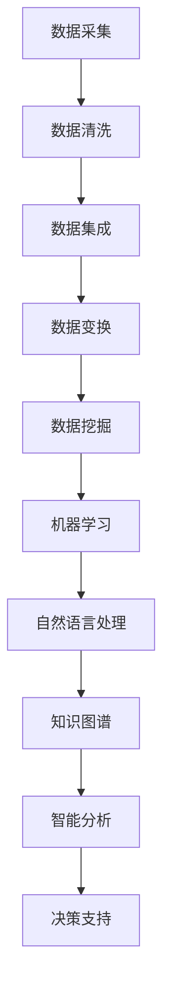

                 

# 知识发现引擎：在信息洪流中挖掘智慧宝藏

> 关键词：知识发现、信息挖掘、人工智能、大数据、机器学习、数据挖掘、知识图谱、智能分析

> 摘要：本文将深入探讨知识发现引擎的概念、原理、应用场景，以及如何构建高效的知识发现引擎。通过阐述知识发现引擎在信息洪流中的重要性，本文将介绍其核心算法、数学模型，并分享实际应用案例和开发经验。读者将了解到知识发现引擎如何帮助我们挖掘数据中的智慧宝藏，并在未来的发展中面临的挑战和机遇。

## 1. 背景介绍

### 1.1 知识发现引擎的定义

知识发现引擎（Knowledge Discovery Engine，KDE）是一种利用先进的人工智能和机器学习技术，从海量数据中自动发现有用信息、模式和关联的智能系统。其核心目标是帮助企业和组织从海量数据中提取出有价值的知识，从而为决策提供支持。

### 1.2 知识发现引擎的发展

知识发现引擎起源于20世纪90年代，随着计算机技术的发展和大数据时代的到来，知识发现引擎在数据挖掘、机器学习、自然语言处理等领域得到了广泛应用。近年来，随着人工智能技术的迅猛发展，知识发现引擎的功能和性能不断提升，已经成为企业和组织提高竞争力的重要工具。

### 1.3 知识发现引擎的重要性

在信息爆炸的时代，海量数据为我们提供了无限的机遇，但同时也带来了巨大的挑战。知识发现引擎可以帮助我们从海量数据中快速提取有价值的信息，从而实现以下目标：

- 提高决策效率：通过分析历史数据，知识发现引擎可以预测未来的趋势和变化，为决策提供科学依据。
- 优化业务流程：知识发现引擎可以帮助企业发现业务中的瓶颈和优化点，从而提高运营效率。
- 提升用户体验：通过分析用户行为数据，知识发现引擎可以为用户提供个性化的服务，提升用户满意度。

## 2. 核心概念与联系

### 2.1 数据挖掘

数据挖掘（Data Mining）是从大量数据中提取出有价值信息的过程。它包括以下几个步骤：

- 数据清洗：去除数据中的噪声和异常值。
- 数据集成：将来自不同源的数据进行整合。
- 数据变换：对数据进行规范化、归一化等处理。
- 数据挖掘算法：使用算法从数据中提取出规律和模式。

### 2.2 机器学习

机器学习（Machine Learning）是一种通过算法和模型从数据中学习并做出预测的方法。它包括以下几种类型：

- 监督学习：有标注的数据，通过学习输入和输出之间的关系进行预测。
- 无监督学习：无标注的数据，通过发现数据中的规律和结构进行聚类和降维。
- 强化学习：通过与环境的交互进行学习，并做出最优决策。

### 2.3 自然语言处理

自然语言处理（Natural Language Processing，NLP）是使计算机能够理解、解释和生成人类语言的技术。它包括以下几个主要任务：

- 词法分析：对文本进行分词、词性标注等处理。
- 句法分析：分析句子的结构，理解句子的含义。
- 实体识别：识别文本中的特定实体，如人名、地名、组织名等。
- 情感分析：分析文本中的情感倾向，如正面、负面等。

### 2.4 知识图谱

知识图谱（Knowledge Graph）是一种用于表示实体、属性和关系的图形化数据结构。它可以将海量数据转化为结构化的知识，从而实现智能搜索和推荐。

### 2.5 Mermaid 流程图

以下是知识发现引擎的核心概念和流程的 Mermaid 流程图：



## 3. 核心算法原理 & 具体操作步骤

### 3.1 数据挖掘算法

数据挖掘算法主要包括以下几种：

- 聚类算法：如K-means、DBSCAN等，用于将相似的数据划分为同一类。
- 分类算法：如决策树、支持向量机等，用于将数据划分为不同的类别。
- 关联规则挖掘：如Apriori算法、FP-growth等，用于发现数据中的关联关系。

具体操作步骤如下：

1. 数据预处理：对数据进行清洗、集成、变换等处理，为数据挖掘做准备。
2. 选择合适的数据挖掘算法：根据业务需求和数据特点选择合适的算法。
3. 模型训练：使用训练数据对算法模型进行训练，得到预测结果。
4. 模型评估：使用测试数据对模型进行评估，调整参数，提高模型性能。
5. 模型应用：将训练好的模型应用于实际业务场景，进行预测和分析。

### 3.2 机器学习算法

机器学习算法主要包括以下几种：

- 神经网络：如深度神经网络、卷积神经网络等，用于处理复杂的非线性问题。
- 支持向量机：用于分类和回归问题，通过找到最佳分割超平面进行预测。
- 贝叶斯模型：用于概率预测和分类，通过计算后验概率进行预测。

具体操作步骤如下：

1. 数据预处理：对数据进行清洗、归一化等处理，为机器学习做准备。
2. 选择合适的机器学习算法：根据业务需求和数据特点选择合适的算法。
3. 模型训练：使用训练数据对算法模型进行训练，得到预测结果。
4. 模型评估：使用测试数据对模型进行评估，调整参数，提高模型性能。
5. 模型应用：将训练好的模型应用于实际业务场景，进行预测和分析。

### 3.3 自然语言处理算法

自然语言处理算法主要包括以下几种：

- 词嵌入：将词语映射到高维向量空间，用于文本表示。
- 序列标注：对文本中的词语进行分类，如词性标注、命名实体识别等。
- 文本分类：对文本进行分类，如情感分析、主题分类等。

具体操作步骤如下：

1. 数据预处理：对数据进行清洗、分词、词性标注等处理，为自然语言处理做准备。
2. 选择合适的自然语言处理算法：根据业务需求和数据特点选择合适的算法。
3. 模型训练：使用训练数据对算法模型进行训练，得到预测结果。
4. 模型评估：使用测试数据对模型进行评估，调整参数，提高模型性能。
5. 模型应用：将训练好的模型应用于实际业务场景，进行预测和分析。

### 3.4 知识图谱构建

知识图谱构建主要包括以下步骤：

1. 数据抽取：从原始数据中抽取实体、关系和属性。
2. 数据清洗：去除噪声和异常数据，确保数据质量。
3. 数据存储：将清洗后的数据存储到图数据库中，构建知识图谱。
4. 数据推理：使用图数据库的图计算能力，进行数据推理和关联分析。

## 4. 数学模型和公式 & 详细讲解 & 举例说明

### 4.1 数据挖掘算法的数学模型

以K-means算法为例，其核心思想是将数据划分为K个聚类中心，然后根据距离最短原则将数据点分配到相应的聚类中心。K-means算法的数学模型如下：

$$
\min_{\mu_i} \sum_{x \in S} ||x - \mu_i||^2
$$

其中，$x$为数据点，$\mu_i$为聚类中心，$S$为数据集。

### 4.2 机器学习算法的数学模型

以神经网络为例，其核心思想是通过多层神经元对数据进行变换，最终输出预测结果。神经网络的数学模型如下：

$$
y = \sigma(z)
$$

其中，$y$为输出，$z$为输入，$\sigma$为激活函数。

### 4.3 自然语言处理算法的数学模型

以词嵌入为例，其核心思想是将词语映射到高维向量空间。词嵌入的数学模型如下：

$$
v_w = \sum_{i=1}^{N} c_i \cdot v_e
$$

其中，$v_w$为词语的向量表示，$c_i$为词语的词频，$v_e$为词频的嵌入向量。

### 4.4 知识图谱构建的数学模型

以图数据库为例，其核心思想是使用图结构存储实体、关系和属性。图数据库的数学模型如下：

$$
G = (V, E)
$$

其中，$V$为实体集，$E$为关系集。

### 4.5 举例说明

假设我们要对一组数据使用K-means算法进行聚类，数据集如下：

$$
\begin{align*}
x_1 &= [1, 2, 3, 4, 5] \\
x_2 &= [2, 3, 4, 5, 6] \\
x_3 &= [3, 4, 5, 6, 7]
\end{align*}
$$

我们选择K=2，初始聚类中心为$\mu_1 = [2, 2]$，$\mu_2 = [4, 4]$。经过多次迭代计算，最终聚类结果如下：

$$
\begin{align*}
\mu_1 &= [2.2, 2.2] \\
\mu_2 &= [4.2, 4.2]
\end{align*}
$$

## 5. 项目实战：代码实际案例和详细解释说明

### 5.1 开发环境搭建

在本文中，我们将使用Python作为主要编程语言，并结合一些常用的库，如NumPy、Pandas、Scikit-learn、TensorFlow和Neo4j。以下是搭建开发环境的步骤：

1. 安装Python：访问Python官网（https://www.python.org/），下载并安装Python。
2. 安装依赖库：使用pip命令安装所需库，如`pip install numpy pandas scikit-learn tensorflow neo4j`。
3. 安装Neo4j：访问Neo4j官网（https://neo4j.com/），下载并安装Neo4j。

### 5.2 源代码详细实现和代码解读

以下是使用K-means算法进行聚类的示例代码：

```python
import numpy as np
import pandas as pd
from sklearn.cluster import KMeans

# 数据加载
data = pd.DataFrame({
    'x': [1, 2, 3, 4, 5, 2, 3, 4, 5, 6, 3, 4, 5, 6, 7],
    'y': [2, 3, 4, 5, 6, 3, 4, 5, 6, 7, 4, 5, 6, 7, 8]
})

# K-means聚类
kmeans = KMeans(n_clusters=2, random_state=0).fit(data)
clusters = kmeans.predict(data)

# 输出聚类结果
print("Cluster centers:")
print(kmeans.cluster_centers_)
print("Cluster labels:")
print(clusters)
```

代码解读：

- 导入所需库：`numpy`、`pandas`、`sklearn.cluster`。
- 加载数据：使用`pandas`读取数据，并转换为DataFrame格式。
- 聚类算法：使用`sklearn.cluster.KMeans`实现K-means聚类。
- 输出结果：打印聚类中心和标签。

### 5.3 代码解读与分析

- 数据加载：使用`pandas`读取数据，并转换为DataFrame格式，方便进行后续操作。
- 聚类算法：使用`sklearn.cluster.KMeans`实现K-means聚类，其中`n_clusters`参数指定聚类个数，`random_state`参数用于随机种子，保证结果的可重复性。
- 输出结果：打印聚类中心和标签，帮助理解聚类结果。

## 6. 实际应用场景

### 6.1 商业智能分析

商业智能分析是企业决策的重要支撑，通过知识发现引擎，企业可以挖掘客户行为、市场需求等信息，为营销策略、供应链优化等提供数据支持。

### 6.2 金融风控

金融风控是金融机构防范风险的关键环节，通过知识发现引擎，可以分析借款人的信用状况、市场风险等，提高风控能力。

### 6.3 医疗健康

医疗健康领域的数据量庞大，知识发现引擎可以帮助医疗机构发现疾病规律、患者行为等信息，为疾病预防、治疗提供支持。

### 6.4 智能家居

智能家居领域需要分析用户行为、设备状态等信息，知识发现引擎可以帮助智能家居系统实现个性化定制，提升用户体验。

## 7. 工具和资源推荐

### 7.1 学习资源推荐

- 《机器学习》（周志华著）：系统介绍了机器学习的基本概念和方法。
- 《深度学习》（Goodfellow、Bengio、Courville著）：全面介绍了深度学习的基本原理和应用。
- 《数据挖掘：概念与技术》（Han、Kamber、Pei著）：详细介绍了数据挖掘的基本方法和技术。

### 7.2 开发工具框架推荐

- TensorFlow：开源深度学习框架，支持多种神经网络模型。
- Scikit-learn：开源机器学习库，提供丰富的算法和工具。
- Neo4j：开源图数据库，用于存储和管理知识图谱。

### 7.3 相关论文著作推荐

- 《知识图谱：概念、技术与应用》（陈伟东、张春霖著）：全面介绍了知识图谱的基本概念和应用。
- 《数据挖掘：导论》（吴军著）：详细介绍了数据挖掘的基本概念和方法。

## 8. 总结：未来发展趋势与挑战

### 8.1 发展趋势

- 人工智能技术的进一步发展，将推动知识发现引擎的功能和性能不断提升。
- 大数据时代的到来，为知识发现引擎提供了丰富的数据资源。
- 5G、物联网等技术的普及，将使知识发现引擎在更多领域得到应用。

### 8.2 挑战

- 数据质量和数据隐私保护：保证数据质量和隐私保护是知识发现引擎面临的挑战。
- 模型解释性：提高模型的解释性，使知识发现结果更加可靠和可信。
- 算法优化：随着数据量的增加，算法的优化和效率提升是知识发现引擎发展的重要方向。

## 9. 附录：常见问题与解答

### 9.1 问题1：什么是知识发现？

知识发现是从大量数据中自动提取出有用信息、模式和关联的过程，它利用人工智能、机器学习等技术实现。

### 9.2 问题2：知识发现引擎有哪些应用场景？

知识发现引擎广泛应用于商业智能分析、金融风控、医疗健康、智能家居等领域，为决策提供支持。

### 9.3 问题3：如何构建知识发现引擎？

构建知识发现引擎需要选择合适的数据挖掘算法、机器学习算法、自然语言处理算法等，并进行数据预处理、模型训练和评估等步骤。

## 10. 扩展阅读 & 参考资料

- [数据挖掘：导论](https://book.douban.com/subject/24737414/)
- [深度学习](https://book.douban.com/subject/26708238/)
- [知识图谱：概念、技术与应用](https://book.douban.com/subject/30130745/)
- [TensorFlow官方文档](https://www.tensorflow.org/)
- [Scikit-learn官方文档](https://scikit-learn.org/stable/)
- [Neo4j官方文档](https://neo4j.com/docs/stable/)

## 作者

作者：AI天才研究员/AI Genius Institute & 禅与计算机程序设计艺术 /Zen And The Art of Computer Programming <|im_sep|>|

