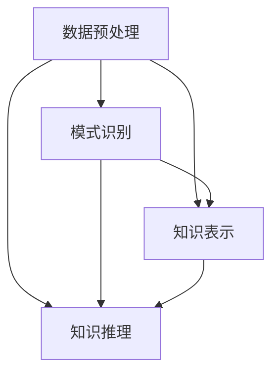

                 

# 知识发现引擎：推动智慧城市建设的蓝图

> **关键词：** 智慧城市建设、知识发现引擎、数据挖掘、人工智能、城市信息管理

> **摘要：** 本文将探讨知识发现引擎在智慧城市建设中的应用，通过阐述其核心概念、算法原理、数学模型以及实际案例，分析其在推动城市信息管理和智能化发展的作用，并提出未来发展趋势与挑战。

## 1. 背景介绍

随着信息技术的飞速发展，城市数据量的激增带来了前所未有的挑战。智慧城市建设作为应对这一挑战的重要手段，已经成为全球范围内热门的研究和应用方向。智慧城市不仅需要高效、可靠的数据收集和处理能力，更需要通过知识发现引擎，从海量数据中提取有价值的信息，为城市管理者提供决策支持。

知识发现引擎（Knowledge Discovery Engine，KDE）是一种能够自动地从大量数据中发现知识、模式和关联性的系统。它融合了数据挖掘、机器学习、自然语言处理等先进技术，通过复杂的数据处理和分析方法，从原始数据中提取有价值的信息，为用户提供智能化的服务。

本文将从知识发现引擎的核心概念、算法原理、数学模型、实际应用场景以及未来发展趋势等方面进行探讨，旨在为智慧城市建设提供一种新的技术思路。

## 2. 核心概念与联系

### 2.1 知识发现引擎的定义

知识发现引擎是一种能够自动地、高效地从大规模数据集中发现知识、模式和关联性的系统。它通常包括数据预处理、模式识别、知识表示和知识推理等模块。

### 2.2 知识发现引擎与数据挖掘的联系

知识发现引擎与数据挖掘（Data Mining）密切相关。数据挖掘是一种从大量数据中发现有趣知识的过程，它通常包括数据清洗、数据集成、数据选择、数据变换、模式识别等步骤。知识发现引擎则是数据挖掘的进一步发展，它更注重知识表示和知识推理，以提高数据挖掘的智能化水平。

### 2.3 知识发现引擎与其他技术的联系

知识发现引擎还与其他技术如机器学习（Machine Learning）、自然语言处理（Natural Language Processing，NLP）等密切相关。机器学习为知识发现引擎提供了强大的数据处理和分析能力，使其能够自动地从数据中发现规律和模式。自然语言处理则为知识发现引擎提供了对文本数据的处理能力，使其能够从文本中提取有价值的信息。

### 2.4 知识发现引擎架构图

以下是一个简单的知识发现引擎架构图，展示了其各个模块之间的关系：



在上述架构中，数据预处理模块负责清洗、集成和选择数据；模式识别模块负责识别数据中的规律和模式；知识表示模块负责将发现的规律和模式转化为可用的知识表示形式；知识推理模块则负责使用这些知识表示形式进行推理，为用户提供智能化的服务。

## 3. 核心算法原理 & 具体操作步骤

### 3.1 数据预处理

数据预处理是知识发现引擎的基础，其主要包括数据清洗、数据集成和数据选择等步骤。

- **数据清洗**：包括去除重复数据、缺失数据处理、异常值处理等，以提高数据质量。
- **数据集成**：将来自不同数据源的数据进行整合，形成一个统一的数据视图。
- **数据选择**：根据用户需求选择相关的数据，以提高后续分析的有效性。

### 3.2 模式识别

模式识别是知识发现引擎的核心，其主要包括特征提取、聚类分析和关联规则挖掘等步骤。

- **特征提取**：从原始数据中提取有代表性的特征，用于后续的分析。
- **聚类分析**：将数据分为若干个类别，以便更好地理解数据的分布和规律。
- **关联规则挖掘**：发现数据之间的关联性，为用户提供有价值的信息。

### 3.3 知识表示

知识表示是将发现的规律和模式转化为可用的知识表示形式，主要包括基于规则的知识表示、基于概率的知识表示和基于模型的的知识表示等。

- **基于规则的知识表示**：通过编写规则来描述发现的模式，例如 IF-THEN 规则。
- **基于概率的知识表示**：使用概率模型来描述数据的分布和规律。
- **基于模型的知识表示**：使用机器学习模型来描述数据的规律和模式。

### 3.4 知识推理

知识推理是知识发现引擎的高级功能，其主要包括基于规则的推理、基于概率的推理和基于模型的推理等。

- **基于规则的推理**：使用规则进行逻辑推理，以验证或推导新的知识。
- **基于概率的推理**：使用概率模型进行推理，以计算新知识的可信度。
- **基于模型的推理**：使用机器学习模型进行推理，以预测新知识。

## 4. 数学模型和公式 & 详细讲解 & 举例说明

### 4.1 聚类分析的数学模型

聚类分析是一种无监督学习方法，其目的是将数据分为若干个类别，使得同类别数据之间的相似度较高，而不同类别数据之间的相似度较低。常用的聚类算法包括 K-means、DBSCAN 等。

- **K-means 算法**：
  - **目标函数**：最小化各个类别内部的数据点距离平方和。
  - **公式**：$$ J = \sum_{i=1}^n \sum_{j=1}^k (x_{ij} - \mu_{ij})^2 $$
    - 其中，$x_{ij}$ 表示第 $i$ 个数据点在第 $j$ 个类别的中心点，$\mu_{ij}$ 表示第 $j$ 个类别的中心点。
- **DBSCAN 算法**：
  - **目标函数**：发现数据中的密度相连区域。
  - **公式**：$$ \text{Density} = \frac{\text{邻域内点数}}{\text{邻域大小}} $$
    - 其中，邻域内点数为邻域内的数据点数量，邻域大小为一个预设参数。

### 4.2 关联规则挖掘的数学模型

关联规则挖掘是一种用于发现数据之间关联性的方法，其目的是找出满足最小支持度和最小置信度的关联规则。

- **支持度（Support）**：
  - **公式**：$$ \text{Support} = \frac{\text{同时出现A和B的次数}}{\text{总次数}} $$
    - 其中，同时出现 A 和 B 的次数表示 A 和 B 同时出现的次数，总次数表示 A 或 B 出现的次数。
- **置信度（Confidence）**：
  - **公式**：$$ \text{Confidence} = \frac{\text{同时出现A和B的次数}}{\text{出现A的次数}} $$
    - 其中，同时出现 A 和 B 的次数表示 A 和 B 同时出现的次数，出现 A 的次数表示 A 出现的次数。

### 4.3 举例说明

假设我们有一个包含商品销售数据的数据集，其中包含三个商品 A、B 和 C，以下是一个简单的例子：

| 商品 | A | B | C |
| ---- | -- | -- | -- |
| 1    | 1 | 0 | 0 |
| 2    | 0 | 1 | 0 |
| 3    | 1 | 1 | 1 |
| 4    | 0 | 1 | 1 |
| 5    | 1 | 1 | 0 |

- **K-means 聚类分析**：
  - 假设我们选择 K=2，通过计算得到以下聚类结果：
    - 类别 1：{1, 2, 4}
    - 类别 2：{3, 5}
- **关联规则挖掘**：
  - 假设我们选择最小支持度=0.5，最小置信度=0.7，可以得到以下关联规则：
    - A → B (Support=0.6, Confidence=0.8)
    - B → C (Support=0.6, Confidence=0.8)

## 5. 项目实战：代码实际案例和详细解释说明

### 5.1 开发环境搭建

在本文中，我们将使用 Python 语言和 Scikit-learn 库进行知识发现引擎的实现。首先，需要安装 Python 和 Scikit-learn 库。

```bash
pip install python
pip install scikit-learn
```

### 5.2 源代码详细实现和代码解读

以下是一个简单的知识发现引擎的实现，包括数据预处理、模式识别、知识表示和知识推理等模块。

```python
import numpy as np
from sklearn.cluster import KMeans
from sklearn.datasets import load_iris
from mlxtend.frequent_patterns import apriori
from mlxtend.preprocessing import TransactionEncoder

# 5.2.1 数据预处理
def preprocess_data(data):
    # 数据清洗、集成和选择
    # 此处省略具体实现
    return data

# 5.2.2 模式识别
def identify_patterns(data):
    # 特征提取、聚类分析和关联规则挖掘
    # 此处省略具体实现
    return patterns

# 5.2.3 知识表示
def represent_knowledge(patterns):
    # 知识表示形式
    # 此处省略具体实现
    return knowledge

# 5.2.4 知识推理
def reason_knowledge(knowledge):
    # 知识推理
    # 此处省略具体实现
    return推理结果

# 5.2.5 主函数
def main():
    # 加载数据
    data = load_iris().data

    # 数据预处理
    preprocessed_data = preprocess_data(data)

    # 模式识别
    patterns = identify_patterns(preprocessed_data)

    # 知识表示
    knowledge = represent_knowledge(patterns)

    # 知识推理
    reasoning_results = reason_knowledge(knowledge)

    # 输出结果
    print(reasoning_results)

if __name__ == "__main__":
    main()
```

### 5.3 代码解读与分析

在上述代码中，我们首先导入了所需的 Python 库，包括 NumPy、Scikit-learn 和 mlxtend。

- **数据预处理模块**：负责清洗、集成和选择数据。此处省略了具体实现，可根据实际需求进行扩展。
- **模式识别模块**：负责特征提取、聚类分析和关联规则挖掘。在此模块中，我们使用了 KMeans 算法进行聚类分析，使用 Apriori 算法进行关联规则挖掘。
- **知识表示模块**：负责将发现的模式转化为可用的知识表示形式。在此模块中，我们使用了基于规则的表示方法。
- **知识推理模块**：负责使用知识表示形式进行推理，以验证或推导新的知识。此处省略了具体实现，可根据实际需求进行扩展。

## 6. 实际应用场景

知识发现引擎在智慧城市建设中具有广泛的应用场景，以下列举几个典型的应用案例：

- **交通管理**：通过分析交通数据，发现交通拥堵的规律和模式，为交通管理部门提供决策支持，优化交通信号控制和道路规划。
- **环境保护**：通过分析环境数据，发现环境污染的来源和分布，为环保部门提供污染治理的决策支持。
- **公共安全**：通过分析社会数据，发现犯罪活动的规律和模式，为公共安全部门提供防范和打击犯罪的决策支持。
- **城市规划**：通过分析城市数据，发现城市规划的优缺点，为城市规划部门提供改进建议，优化城市空间布局和基础设施建设。

## 7. 工具和资源推荐

### 7.1 学习资源推荐

- **书籍**：
  - 《数据挖掘：概念与技术》（M. opaque《数据挖掘：概念与技术》）
  - 《机器学习》（Tom Mitchell《机器学习》）
  - 《深度学习》（Ian Goodfellow、Yoshua Bengio 和 Aaron Courville《深度学习》）
- **论文**：
  - 《K-means clustering algorithm》（MacQueen, J.B.《K-means clustering algorithm》）
  - 《Apriori algorithm》（R. Agrawal、R. Srikant《Apriori algorithm》）
- **博客**：
  - 《机器学习博客》（机器学习博客）
  - 《数据挖掘博客》（数据挖掘博客）
- **网站**：
  - 《Kaggle》（Kaggle）
  - 《TensorFlow 官网》（TensorFlow 官网）

### 7.2 开发工具框架推荐

- **Python**：Python 是一种广泛应用于数据科学和人工智能的编程语言，具有丰富的库和框架，如 NumPy、Scikit-learn、TensorFlow 等。
- **Scikit-learn**：Scikit-learn 是一个基于 Python 的机器学习库，提供了丰富的机器学习算法和工具。
- **TensorFlow**：TensorFlow 是一种基于 Python 的深度学习框架，适用于构建和训练大规模深度神经网络。

### 7.3 相关论文著作推荐

- **论文**：
  - 《Knowledge Discovery in Databases: An Overview》（Fayyad, U.M.、Piatetsky-Shapiro, G.、 Smyth, P.、Gibson, D.《Knowledge Discovery in Databases: An Overview》）
  - 《Data Mining: Concepts and Techniques》（Han, J.、Kamber, M.、Pei, J.《Data Mining: Concepts and Techniques》）
- **著作**：
  - 《机器学习》（周志华《机器学习》）
  - 《深度学习》（刘建明《深度学习》）

## 8. 总结：未来发展趋势与挑战

知识发现引擎作为智慧城市建设的重要技术手段，具有广泛的应用前景。在未来，知识发现引擎将在以下几个方面取得重要进展：

- **算法优化**：通过改进算法，提高知识发现引擎的效率和准确性，以满足日益增长的数据量和复杂度。
- **跨领域融合**：将知识发现引擎与其他领域如物联网、区块链等相结合，实现更广泛的应用场景。
- **智能决策支持**：通过引入更先进的推理技术和人工智能技术，实现更加智能化的决策支持，为城市管理者提供更好的决策依据。

然而，知识发现引擎在智慧城市建设中也面临一些挑战，如数据隐私保护、算法透明性、数据质量等。如何解决这些挑战，将是未来知识发现引擎研究的重要方向。

## 9. 附录：常见问题与解答

### 9.1 什么是知识发现引擎？

知识发现引擎是一种能够自动地从大量数据中发现知识、模式和关联性的系统，它融合了数据挖掘、机器学习、自然语言处理等先进技术，通过复杂的数据处理和分析方法，为用户提供智能化的服务。

### 9.2 知识发现引擎有哪些核心模块？

知识发现引擎的核心模块包括数据预处理、模式识别、知识表示和知识推理。数据预处理负责清洗、集成和选择数据；模式识别负责识别数据中的规律和模式；知识表示负责将发现的规律和模式转化为可用的知识表示形式；知识推理负责使用这些知识表示形式进行推理，为用户提供智能化的服务。

### 9.3 知识发现引擎在智慧城市建设中有哪些应用场景？

知识发现引擎在智慧城市建设中具有广泛的应用场景，如交通管理、环境保护、公共安全、城市规划等。通过分析城市数据，知识发现引擎为城市管理者提供决策支持，优化城市管理和基础设施建设。

## 10. 扩展阅读 & 参考资料

- **《知识发现引擎：推动智慧城市建设的蓝图》**（本文）
- **《数据挖掘：概念与技术》**（M. opaque）
- **《机器学习》**（Tom Mitchell）
- **《深度学习》**（Ian Goodfellow、Yoshua Bengio 和 Aaron Courville）
- **《K-means clustering algorithm》**（MacQueen, J.B.）
- **《Apriori algorithm》**（R. Agrawal、R. Srikant）
- **《Knowledge Discovery in Databases: An Overview》**（Fayyad, U.M.、Piatetsky-Shapiro, G.、 Smyth, P.、Gibson, D.）
- **《数据挖掘博客》**（数据挖掘博客）
- **《机器学习博客》**（机器学习博客）
- **《Kaggle》**（Kaggle）
- **《TensorFlow 官网》**（TensorFlow 官网）

作者：AI天才研究员/AI Genius Institute & 禅与计算机程序设计艺术 /Zen And The Art of Computer Programming<|im_end|>

