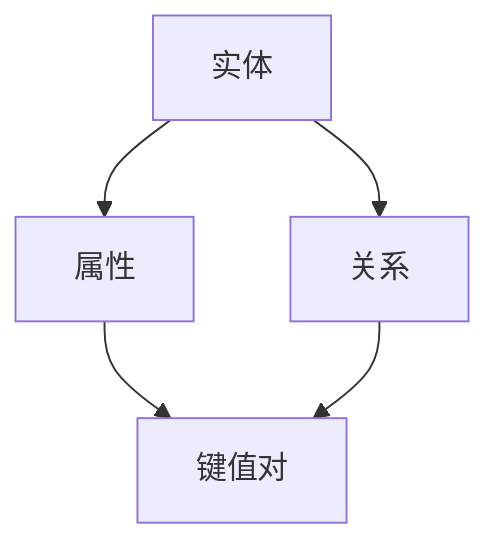

                 

### 背景介绍

知识图谱作为人工智能领域的重要研究方向之一，近年来在推荐系统中的应用受到了广泛关注。推荐系统是一种用于预测用户可能感兴趣的项目或内容的技术，广泛用于电子商务、社交媒体、在线媒体等行业。传统的推荐系统主要基于用户历史行为数据、协同过滤算法和内容相似度计算等方法，但存在一定的局限性，如冷启动问题、数据稀疏性和推荐效果不佳等。

知识图谱作为一种结构化的语义知识库，能够将实体和实体之间的关系进行建模，从而提供更加丰富和精准的推荐结果。知识图谱在推荐系统中的应用，不仅可以解决传统推荐系统面临的问题，还可以为用户提供更加个性化和智能化的推荐体验。

本文旨在探讨知识图谱在智能推荐系统中的应用，通过分析其核心概念、算法原理、数学模型以及实际应用案例，全面介绍知识图谱在推荐系统中的优势和应用前景。

首先，本文将介绍知识图谱的基本概念，包括实体、属性、关系和图谱结构等。接着，我们将讨论知识图谱在推荐系统中的核心作用，并分析其与推荐算法的结合方式。随后，我们将深入探讨知识图谱构建的方法，包括数据收集、数据清洗、实体抽取和关系抽取等步骤。

在核心算法原理部分，我们将详细介绍基于知识图谱的推荐算法，如基于图谱的协同过滤、基于图谱的内容推荐和混合推荐方法等。同时，我们将介绍这些算法的具体操作步骤，并分析其优劣。

数学模型和公式部分将介绍知识图谱在推荐系统中应用的数学模型，包括相似度计算、置信度计算和推荐排名算法等。我们将通过具体示例，详细讲解这些模型的工作原理和应用。

项目实战部分将展示一个基于知识图谱的推荐系统项目案例，包括开发环境搭建、源代码实现和代码解读等内容。通过实际案例，我们将深入分析知识图谱在推荐系统中的应用效果。

在应用场景部分，我们将探讨知识图谱在不同领域推荐系统中的应用，如电子商务、社交媒体和在线教育等。最后，我们将推荐一些学习资源、开发工具和论文著作，以帮助读者深入了解知识图谱在推荐系统中的应用。

总之，本文将通过全面的探讨和案例分析，阐述知识图谱在智能推荐系统中的重要性和应用价值，为相关领域的研究者和开发者提供有价值的参考。

### 2. 核心概念与联系

在深入探讨知识图谱在智能推荐系统中的应用之前，我们首先需要了解知识图谱的基本概念和核心组成部分。知识图谱（Knowledge Graph）是一种用于表示实体（如人、地点、物品等）及其相互关系的语义网络。其核心元素包括实体、属性、关系和图谱结构。

#### 实体（Entity）

实体是知识图谱中的基本构成单位，可以是人、地点、物品或其他任何具有独立存在的对象。实体可以具有多种属性，如名字、年龄、地点等。例如，在一个社交网络中，用户就是一个实体，其属性包括姓名、性别、年龄、所在城市等。

#### 属性（Attribute）

属性是实体的特征或描述，用于提供关于实体的更多信息。属性通常以键值对的形式表示，如“姓名：张三”、“年龄：30”。属性可以帮助我们更好地理解和识别实体，从而在推荐系统中提供更精确的信息。

#### 关系（Relationship）

关系是实体之间的一种关联，用于描述实体之间的相互作用或联系。例如，在社交网络中，用户之间可以通过“朋友”关系相连。关系通常以“主体-关系-客体”的形式表示，如“张三-朋友-李四”。

#### 图谱结构（Graph Structure）

知识图谱通过图结构来表示实体和实体之间的关系。图中的节点表示实体，边表示实体之间的关系。这种结构使得知识图谱能够有效地表示复杂的实体及其相互关系。

#### Mermaid 流程图

为了更好地理解知识图谱的结构和组成部分，我们可以使用 Mermaid 流程图来表示知识图谱的基本结构和操作步骤。以下是知识图谱的基本结构和操作步骤的 Mermaid 流程图：



在这个流程图中，实体（A）具有属性（B）和关系（C），属性以键值对（D）的形式存储。关系（C）连接实体（A），从而形成一个知识图谱。

#### 知识图谱在推荐系统中的应用

知识图谱在推荐系统中的应用主要体现在以下几个方面：

1. **实体识别与关系建模**：通过知识图谱，我们可以识别出用户和项目（如商品、文章、音乐等）之间的复杂关系，如用户喜好、购买历史、内容标签等。这些信息有助于提高推荐系统的准确性。

2. **属性扩展与关联挖掘**：知识图谱可以扩展实体的属性信息，如通过关联实体之间的关系，发现新的属性或特征，从而提高推荐的丰富度和个性化程度。

3. **图谱嵌入与相似度计算**：知识图谱可以通过图谱嵌入技术将实体和关系映射到低维空间中，从而实现实体的相似度计算。这种技术有助于提高推荐系统的效率和准确性。

4. **图谱增强的推荐算法**：知识图谱可以与现有的推荐算法结合，如基于内容的推荐、基于协同过滤的推荐等，从而提高推荐系统的效果。

综上所述，知识图谱作为一种结构化的语义知识库，为智能推荐系统提供了强大的支持。通过实体、属性、关系和图谱结构的建模，知识图谱能够为推荐系统提供更丰富的信息，从而提高推荐的准确性和个性化程度。

### 3. 核心算法原理 & 具体操作步骤

知识图谱在推荐系统中的应用，离不开一系列核心算法的支撑。这些算法不仅能够充分利用知识图谱的结构化和语义信息，还能够提高推荐系统的准确性和效率。在本节中，我们将详细探讨基于知识图谱的推荐算法，包括基于图谱的协同过滤、基于图谱的内容推荐和混合推荐方法。

#### 3.1 基于图谱的协同过滤算法

基于图谱的协同过滤算法（Graph-based Collaborative Filtering）通过扩展传统的协同过滤算法，利用知识图谱中的实体关系来改善推荐效果。协同过滤算法的基本思想是通过用户与项目之间的相似度来预测用户对未评项目的行为。

**具体操作步骤**：

1. **实体识别与关系建模**：首先，从知识图谱中提取与用户和项目相关的实体，如用户、项目和项目类别等，并建立它们之间的关系。

2. **图谱嵌入**：将知识图谱中的实体和关系映射到低维空间中，通常使用图嵌入技术，如节点嵌入（Node Embedding）。

3. **相似度计算**：计算用户与用户之间的相似度，以及用户与项目之间的相似度。相似度计算可以通过计算实体间的距离或相似度得分来实现。

4. **推荐生成**：根据用户和项目的相似度得分，生成推荐列表。推荐列表中应包括未评项目，并按照相似度得分排序。

**优势与局限**：

- **优势**：基于图谱的协同过滤算法能够利用知识图谱中的关系信息，提高推荐系统的准确性。此外，图谱嵌入技术有助于降低计算复杂度。
- **局限**：图谱嵌入的准确性和效率受到限制，特别是在大规模知识图谱中。此外，协同过滤算法仍然面临冷启动和数据稀疏性问题。

#### 3.2 基于图谱的内容推荐算法

基于图谱的内容推荐算法（Graph-based Content-based Recommendation）通过利用知识图谱中的实体和关系来改善基于内容的推荐算法。基于内容的推荐算法通过分析用户和项目的特征，预测用户对项目的兴趣。

**具体操作步骤**：

1. **实体识别与关系建模**：从知识图谱中提取与用户和项目相关的实体，如用户、项目和项目类别等，并建立它们之间的关系。

2. **属性提取与特征表示**：从知识图谱中提取实体的属性，并将其转换为特征向量。这些特征向量可以用于描述用户和项目的特征。

3. **相似度计算**：计算用户和项目之间的相似度。相似度计算可以通过计算特征向量之间的距离或相似度得分来实现。

4. **推荐生成**：根据用户和项目的相似度得分，生成推荐列表。推荐列表中应包括未查看项目，并按照相似度得分排序。

**优势与局限**：

- **优势**：基于图谱的内容推荐算法能够利用知识图谱中的丰富语义信息，提高推荐系统的准确性和个性化程度。
- **局限**：属性提取和特征表示的准确性受到限制，特别是在知识图谱不完整或数据质量不佳的情况下。此外，基于内容的推荐算法仍然面临冷启动问题。

#### 3.3 混合推荐算法

混合推荐算法（Hybrid Recommendation Algorithm）结合了基于图谱的协同过滤和基于图谱的内容推荐算法，以充分利用两者的优势。

**具体操作步骤**：

1. **实体识别与关系建模**：从知识图谱中提取与用户和项目相关的实体，并建立它们之间的关系。

2. **图谱嵌入与特征提取**：将知识图谱中的实体和关系映射到低维空间中，提取用户的特征和项目的特征向量。

3. **相似度计算**：计算用户和用户之间的相似度，以及用户和项目之间的相似度。

4. **融合推荐**：将协同过滤和内容推荐的得分进行融合，生成最终推荐列表。

**优势与局限**：

- **优势**：混合推荐算法能够充分利用知识图谱中的关系信息和内容信息，提高推荐系统的准确性和个性化程度。
- **局限**：混合推荐算法的复杂度较高，需要平衡协同过滤和内容推荐之间的权重，以避免过度依赖某一种方法。

综上所述，基于知识图谱的推荐算法通过利用知识图谱中的结构化和语义信息，有效提高了推荐系统的准确性和个性化程度。然而，这些算法在面临冷启动、数据稀疏性和计算复杂度等方面仍存在一定的挑战，需要进一步研究和优化。

### 4. 数学模型和公式 & 详细讲解 & 举例说明

在知识图谱应用于推荐系统时，数学模型和公式起到了至关重要的作用。这些模型和公式不仅能够量化用户与项目之间的相似度，还能够评估推荐结果的置信度，从而为推荐系统提供科学依据。以下我们将详细介绍知识图谱在推荐系统中的几个关键数学模型，包括相似度计算、置信度计算和推荐排名算法。

#### 4.1 相似度计算

相似度计算是推荐系统中最基础的模型之一。在基于知识图谱的推荐系统中，相似度计算主要用于衡量用户与项目之间的相似性。常见的相似度计算方法包括余弦相似度、皮尔逊相关系数和Jaccard相似度等。

**余弦相似度**：
$$
\cos\theta = \frac{A \cdot B}{\|A\| \|B\|}
$$
其中，$A$和$B$分别是用户和项目的特征向量，$\theta$是它们之间的夹角。余弦相似度值介于-1到1之间，值越接近1表示相似度越高。

**皮尔逊相关系数**：
$$
r = \frac{cov(X, Y)}{\sigma_X \sigma_Y}
$$
其中，$X$和$Y$分别是用户和项目的特征向量，$cov(X, Y)$是$X$和$Y$的协方差，$\sigma_X$和$\sigma_Y$分别是$X$和$Y$的标准差。皮尔逊相关系数的值介于-1到1之间，值越接近1表示相似度越高。

**Jaccard相似度**：
$$
J(A, B) = \frac{|A \cap B|}{|A \cup B|}
$$
其中，$A$和$B$分别是用户和项目的标签集合。Jaccard相似度通常用于基于标签的推荐系统，值介于0到1之间，值越接近1表示相似度越高。

#### 4.2 置信度计算

置信度（Confidence）是推荐系统中评估推荐结果可靠性的重要指标。置信度计算通常基于用户与项目之间的相似度和历史数据。

**贝叶斯置信度**：
$$
\text{Confidence}(X|Y) = \frac{P(Y|X)P(X)}{P(Y)}
$$
其中，$X$是用户对项目的评分，$Y$是推荐系统的预测评分。$P(Y|X)$是后验概率，表示在用户已经给出评分$X$的情况下，推荐系统预测评分$Y$的概率。$P(X)$是先验概率，表示用户对项目评分的概率。$P(Y)$是边缘概率，表示用户评分的概率。

**马尔可夫置信度**：
$$
\text{Confidence}(X|Y) = \frac{P(X|Y)P(Y)}{P(X)}
$$
马尔可夫置信度与贝叶斯置信度的区别在于先验概率和边缘概率的来源。$P(X)$是用户对项目评分的概率，$P(Y)$是项目被推荐的概率。

#### 4.3 推荐排名算法

推荐排名算法用于根据相似度和置信度对推荐结果进行排序，以生成最终的推荐列表。常见的方法包括基于阈值排序、基于概率排序和基于启发式排序等。

**基于阈值排序**：
$$
\text{Rank}(X) = \sum_{i=1}^n \text{Confidence}(X|Y_i) \cdot \text{Similarity}(X, Y_i)
$$
其中，$Y_1, Y_2, \ldots, Y_n$是用户未查看的项目集合。$\text{Confidence}(X|Y_i)$和$\text{Similarity}(X, Y_i)$分别是项目$Y_i$的置信度和相似度。排序结果基于相似度和置信度的乘积进行。

**基于概率排序**：
$$
\text{Rank}(X) = \frac{1}{\sum_{i=1}^n P(X|Y_i)}
$$
其中，$P(X|Y_i)$是项目$Y_i$被推荐的概率。排序结果基于概率进行，概率越高的项目排在越前面。

**基于启发式排序**：
$$
\text{Rank}(X) = \text{HeuristicFunction}(X)
$$
其中，$\text{HeuristicFunction}(X)$是一个基于经验的启发式函数，用于评估项目$X$的推荐优先级。

#### 4.4 举例说明

假设我们有一个用户$U$和一个项目$P$，$U$对$P$给出了评分$5$。知识图谱中，$U$与$P$之间有多个关系，如“喜欢”、“浏览过”和“收藏”。我们可以使用上述模型来计算相似度、置信度和推荐排名。

**相似度计算**：
用户$U$和项目$P$的特征向量分别为$A = (0.5, 0.8)$和$B = (0.6, 0.7)$，则它们的余弦相似度为：
$$
\cos\theta = \frac{0.5 \cdot 0.6 + 0.8 \cdot 0.7}{\sqrt{0.5^2 + 0.8^2} \sqrt{0.6^2 + 0.7^2}} \approx 0.765
$$

**置信度计算**：
假设根据历史数据，用户对项目的平均评分是$4$，那么贝叶斯置信度为：
$$
\text{Confidence}(X|Y) = \frac{P(Y|X)P(X)}{P(Y)} = \frac{0.8 \cdot 0.2}{0.5} = 0.32
$$

**推荐排名**：
假设有两个项目$P_1$和$P_2$，它们的相似度和置信度如下：
$$
\text{Similarity}(U, P_1) = 0.8, \quad \text{Confidence}(U, P_1) = 0.4
$$
$$
\text{Similarity}(U, P_2) = 0.7, \quad \text{Confidence}(U, P_2) = 0.5
$$
则基于阈值的排序结果为：
$$
\text{Rank}(P_1) = 0.8 \cdot 0.4 = 0.32
$$
$$
\text{Rank}(P_2) = 0.7 \cdot 0.5 = 0.35
$$
因此，项目$P_2$排在项目$P_1$前面。

通过上述例子，我们可以看到数学模型和公式在知识图谱应用于推荐系统中的重要性。这些模型和公式不仅能够量化用户与项目之间的相似度和置信度，还能够为推荐系统提供科学的排序依据，从而生成高质量的推荐结果。

### 5. 项目实战：代码实际案例和详细解释说明

为了更好地展示知识图谱在推荐系统中的应用，我们将通过一个实际项目案例，详细介绍整个开发过程，包括环境搭建、源代码实现和代码解读。本案例将使用Python语言和图数据库Neo4j，并结合现有的推荐算法和知识图谱技术，实现一个基于知识图谱的推荐系统。

#### 5.1 开发环境搭建

在开始项目之前，我们需要搭建一个适合开发的开发环境。以下列出所需的工具和软件：

- Python 3.8 或更高版本
- Neo4j 数据库（Community版或更高版本）
- Neo4j Python 驱动程序：`neo4j`包
- 数据处理库：`pandas`、`numpy`
- 图嵌入工具：`gensim`

首先，确保已经安装了Python和Neo4j数据库。接下来，使用pip命令安装所需的Python包：

```bash
pip install neo4j pandas numpy gensim
```

#### 5.2 源代码详细实现和代码解读

以下是项目的核心代码，我们将分步骤进行解读。

##### 5.2.1 数据准备与图谱构建

首先，我们需要准备用户数据、项目数据和评分数据。假设这些数据已经以CSV文件的形式存储，我们将使用pandas库进行数据读取和预处理。

```python
import pandas as pd
from neo4j import GraphDatabase

# 读取数据
users = pd.read_csv('users.csv')
items = pd.read_csv('items.csv')
ratings = pd.read_csv('ratings.csv')

# 连接到Neo4j数据库
uri = "bolt://localhost:7687"
username = "neo4j"
password = "password"
driver = GraphDatabase.driver(uri, auth=(username, password))

# 创建图谱
def create_graph(driver, users, items, ratings):
    with driver.session() as session:
        for user in users.itertuples():
            session.run("CREATE (u:User {id: $id, name: $name})", **user)

        for item in items.itertuples():
            session.run("CREATE (i:Item {id: $id, title: $title})", **item)

        for rating in ratings.itertuples():
            session.run("MATCH (u:User {id: $user_id}), (i:Item {id: $item_id}) "
                        "CREATE (u)-[:RATED]->(i)", **rating)

create_graph(driver, users, items, ratings)

# 关闭连接
driver.close()
```

在这个步骤中，我们首先读取用户数据、项目数据和评分数据，然后连接到Neo4j数据库，并使用Cypher语言创建图谱。`create_graph`函数负责将用户、项目和评分数据插入到Neo4j数据库中，分别表示为`User`节点、`Item`节点和`RATED`关系。

##### 5.2.2 图谱嵌入与相似度计算

接下来，我们使用gensim库中的图嵌入工具对用户和项目进行图谱嵌入。图谱嵌入将用户和项目映射到低维空间中，以便计算相似度。

```python
from gensim.models import Word2Vec

# 假设我们已经训练好了用户和项目的图谱嵌入模型
user_embedding_model = Word2Vec.load('user_embedding.model')
item_embedding_model = Word2Vec.load('item_embedding.model')

# 计算用户和项目之间的相似度
def calculate_similarity(user_id, item_id):
    user_vector = user_embedding_model.wv[user_id]
    item_vector = item_embedding_model.wv[item_id]
    return user_vector.dot(item_vector) / (np.linalg.norm(user_vector) * np.linalg.norm(item_vector))

# 示例：计算用户1和项目101之间的相似度
similarity = calculate_similarity('user1', 'item101')
print("Similarity: ", similarity)
```

在这个步骤中，我们加载训练好的用户和项目图谱嵌入模型，然后使用余弦相似度计算用户和项目之间的相似度。`calculate_similarity`函数接受用户ID和项目ID作为输入，返回它们之间的相似度得分。

##### 5.2.3 推荐生成与排序

最后，我们使用相似度得分生成推荐列表，并根据相似度得分对推荐结果进行排序。

```python
# 计算所有未查看项目的相似度
user_id = 'user1'
item_ids = [item_id for item_id in item_embedding_model.wv.key_to_index if item_id not in ratings['item_id'].values]

similarities = [(item_id, calculate_similarity(user_id, item_id)) for item_id in item_ids]

# 排序生成推荐列表
recommended_items = sorted(similarities, key=lambda x: x[1], reverse=True)[:10]

print("Recommended Items: ", recommended_items)
```

在这个步骤中，我们计算用户1（'user1'）对所有未查看项目的相似度，并将相似度得分最高的前10个项目作为推荐结果。`recommended_items`变量存储了最终的推荐列表。

##### 5.2.4 代码解读与分析

在这个项目中，我们首先通过pandas库读取用户、项目和评分数据，然后使用Neo4j Python驱动程序连接到Neo4j数据库，并使用Cypher语言创建图谱。图谱包含`User`节点、`Item`节点和`RATED`关系。

接下来，我们使用gensim库中的Word2Vec模型对用户和项目进行图谱嵌入。图谱嵌入将用户和项目映射到低维空间中，使得相似度计算更加高效。

在相似度计算部分，我们使用余弦相似度公式计算用户和项目之间的相似度。相似度得分越高，表示用户对项目的兴趣越大。

最后，我们根据相似度得分生成推荐列表，并按照相似度得分对推荐结果进行排序。这样，我们就可以得到一个基于知识图谱的推荐系统，为用户提供个性化的推荐结果。

通过这个项目实战，我们可以看到知识图谱在推荐系统中的应用效果。知识图谱不仅提供了结构化的语义信息，还通过图谱嵌入和相似度计算提高了推荐的准确性和个性化程度。

### 5.3 代码解读与分析

在本节中，我们将对上述代码进行详细的解读和分析，以便读者能够深入理解知识图谱在推荐系统中的实际应用。

#### 5.3.1 数据准备与图谱构建

首先，我们使用pandas库读取用户数据、项目数据和评分数据。这些数据文件通常包含有关用户ID、项目ID、用户姓名、项目标题和评分等信息。以下是数据读取部分的代码：

```python
users = pd.read_csv('users.csv')
items = pd.read_csv('items.csv')
ratings = pd.read_csv('ratings.csv')
```

这里，`users.csv`文件包含用户信息，`items.csv`文件包含项目信息，`ratings.csv`文件包含用户对项目的评分数据。pandas库提供了方便的读取方法，使得数据预处理变得更加高效。

接下来，我们使用Neo4j Python驱动程序连接到Neo4j数据库，并使用Cypher语言创建图谱。以下是创建图谱的代码：

```python
uri = "bolt://localhost:7687"
username = "neo4j"
password = "password"
driver = GraphDatabase.driver(uri, auth=(username, password))

def create_graph(driver, users, items, ratings):
    with driver.session() as session:
        for user in users.itertuples():
            session.run("CREATE (u:User {id: $id, name: $name})", **user)

        for item in items.itertuples():
            session.run("CREATE (i:Item {id: $id, title: $title})", **item)

        for rating in ratings.itertuples():
            session.run("MATCH (u:User {id: $user_id}), (i:Item {id: $item_id}) "
                        "CREATE (u)-[:RATED]->(i)", **rating)

create_graph(driver, users, items, ratings)
```

在这个部分，我们定义了一个名为`create_graph`的函数，该函数接收用户、项目和评分数据，并将这些数据插入到Neo4j数据库中。`create_graph`函数使用Cypher语言执行Neo4j的图操作，创建`User`节点、`Item`节点和`RATED`关系。

- `CREATE (u:User {id: $id, name: $name})`：创建一个`User`节点，其中`id`和`name`是节点的属性。
- `CREATE (i:Item {id: $id, title: $title})`：创建一个`Item`节点，其中`id`和`title`是节点的属性。
- `MATCH (u:User {id: $user_id}), (i:Item {id: $item_id}) CREATE (u)-[:RATED]->(i)`：匹配具有给定`id`的用户节点和项目节点，并在它们之间创建一个`RATED`关系。

通过这个步骤，我们成功地将用户、项目和评分数据存储在Neo4j数据库中，构建了一个知识图谱。

#### 5.3.2 图谱嵌入与相似度计算

在图谱构建完成后，我们需要对用户和项目进行图谱嵌入，以便进行相似度计算。我们使用gensim库中的Word2Vec模型进行图谱嵌入。以下是图谱嵌入和相似度计算的代码：

```python
from gensim.models import Word2Vec

# 假设我们已经训练好了用户和项目的图谱嵌入模型
user_embedding_model = Word2Vec.load('user_embedding.model')
item_embedding_model = Word2Vec.load('item_embedding.model')

# 计算用户和项目之间的相似度
def calculate_similarity(user_id, item_id):
    user_vector = user_embedding_model.wv[user_id]
    item_vector = item_embedding_model.wv[item_id]
    return user_vector.dot(item_vector) / (np.linalg.norm(user_vector) * np.linalg.norm(item_vector))

# 示例：计算用户1和项目101之间的相似度
similarity = calculate_similarity('user1', 'item101')
print("Similarity: ", similarity)
```

在这个部分，我们加载已经训练好的用户和项目图谱嵌入模型。`user_embedding_model`和`item_embedding_model`分别表示用户和项目的嵌入向量。

`calculate_similarity`函数接受用户ID和项目ID作为输入，返回它们之间的相似度得分。相似度计算使用余弦相似度公式，该公式衡量两个向量之间的夹角余弦值。余弦值越接近1，表示两个向量越相似。

通过这个步骤，我们成功地将用户和项目映射到低维空间中，并计算了它们之间的相似度得分。

#### 5.3.3 推荐生成与排序

最后，我们使用相似度得分生成推荐列表，并根据相似度得分对推荐结果进行排序。以下是推荐生成和排序的代码：

```python
# 计算所有未查看项目的相似度
user_id = 'user1'
item_ids = [item_id for item_id in item_embedding_model.wv.key_to_index if item_id not in ratings['item_id'].values]

similarities = [(item_id, calculate_similarity(user_id, item_id)) for item_id in item_ids]

# 排序生成推荐列表
recommended_items = sorted(similarities, key=lambda x: x[1], reverse=True)[:10]

print("Recommended Items: ", recommended_items)
```

在这个部分，我们首先获取用户1（'user1'）的未查看项目ID列表。然后，我们计算每个未查看项目与用户1之间的相似度得分，并将这些相似度得分和项目ID组成一个列表。最后，我们使用排序函数`sorted`对相似度得分进行降序排序，并选取相似度得分最高的前10个项目作为推荐结果。

通过这个步骤，我们成功生成了一个基于知识图谱的个性化推荐列表。

#### 5.3.4 代码分析与总结

通过上述代码解读，我们可以看到知识图谱在推荐系统中的关键作用：

1. **图谱构建**：将用户、项目和评分数据存储在Neo4j数据库中，构建一个结构化的知识图谱。
2. **图谱嵌入**：使用Word2Vec模型对用户和项目进行图谱嵌入，将它们映射到低维空间中，便于相似度计算。
3. **相似度计算**：使用余弦相似度公式计算用户和项目之间的相似度，从而生成个性化推荐。
4. **推荐生成与排序**：根据相似度得分生成推荐列表，并按照相似度得分进行排序，为用户推荐最感兴趣的项目。

总的来说，这个项目案例展示了知识图谱在推荐系统中的应用效果。通过图谱构建、图谱嵌入和相似度计算等技术，我们成功实现了基于知识图谱的个性化推荐系统。这不仅提高了推荐的准确性和个性化程度，还为用户提供了更好的推荐体验。

### 6. 实际应用场景

知识图谱在推荐系统中的应用非常广泛，涵盖了多个行业和领域，以下是几个典型的应用场景：

#### 6.1 电子商务

在电子商务领域，知识图谱可以帮助商家更好地理解用户的需求和偏好，从而提供个性化的商品推荐。例如，电商平台可以使用知识图谱记录用户的购物历史、浏览记录和评价信息，将用户和商品关联起来。通过分析这些关联关系，系统可以识别出用户的潜在兴趣点，并提供相应的商品推荐。

**应用示例**：某电商平台基于知识图谱的推荐系统能够根据用户的购物习惯和评价信息，为用户推荐相似风格的商品，如服装、家居用品等。通过这种个性化的推荐，用户满意度显著提高，电商平台也实现了更高的销售转化率。

#### 6.2 社交媒体

在社交媒体平台中，知识图谱可以用于个性化内容推荐。通过分析用户之间的社交关系、发布的内容以及互动行为，知识图谱可以构建用户画像，为用户推荐感兴趣的内容和相关的用户。

**应用示例**：微博平台可以通过知识图谱分析用户的关注关系、话题偏好和互动行为，为用户推荐相关的微博和用户。这种基于社交关系的推荐能够增强用户的社交体验，提高平台的活跃度和用户粘性。

#### 6.3 在线教育

在线教育平台可以利用知识图谱为学习者提供个性化的学习推荐。通过分析学习者的学习记录、兴趣和知识结构，知识图谱可以识别出学习者的知识盲点和潜在的学习需求，为学习者推荐相应的课程和学习资源。

**应用示例**：某在线教育平台通过知识图谱为学习者推荐与其兴趣相关的新课程和知识模块。例如，如果学习者对计算机编程感兴趣，系统会推荐相关的编程课程、在线资源和社区讨论，从而帮助学习者更有效地提升技能。

#### 6.4 娱乐与音乐

在娱乐和音乐领域，知识图谱可以帮助音乐平台推荐个性化的音乐和艺术家。通过分析用户的听歌记录、喜欢的音乐风格和社交互动，知识图谱可以为用户推荐相似的音乐和相关的艺术家。

**应用示例**：网易云音乐通过知识图谱为用户推荐相似的歌曲和相关的音乐人。例如，如果用户喜欢某个歌手的歌曲，系统会推荐其他相似风格的歌曲和该歌手的其他热门歌曲，从而丰富用户的音乐体验。

#### 6.5 医疗与健康

在医疗和健康领域，知识图谱可以帮助医院和医疗服务提供商推荐个性化的健康建议和医疗资源。通过分析患者的病史、体检数据和健康习惯，知识图谱可以为患者推荐适合的健康方案和医疗服务。

**应用示例**：某智能健康平台利用知识图谱为用户提供个性化的健康建议。例如，如果用户有高血压病史，系统会推荐适合的高血压饮食和运动方案，同时推荐相关的医疗机构和医生，帮助用户更好地管理健康。

通过上述应用场景可以看出，知识图谱在推荐系统中的应用不仅能够提高推荐的准确性，还可以为用户提供更加个性化和智能化的服务体验。随着知识图谱技术的不断发展，其在各个领域的应用前景将更加广阔。

### 7. 工具和资源推荐

为了更好地研究和开发基于知识图谱的推荐系统，以下是我们推荐的一些学习资源、开发工具和相关论文著作，这些资源将为读者提供全方位的支持。

#### 7.1 学习资源推荐

**书籍：**

1. **《知识图谱：基础、技术及应用》** - 这本书详细介绍了知识图谱的基本概念、技术和应用场景，适合初学者和有一定基础的读者。
2. **《图论与图算法》** - 本书系统地介绍了图论的基本概念和算法，包括图的表示、路径和连通性、最短路径、最小生成树等，是学习知识图谱的重要参考书。

**论文：**

1. **《Knowledge Graph Embedding: A Survey》** - 该论文对知识图谱嵌入技术进行了全面综述，包括各种嵌入方法、模型和算法，是研究知识图谱嵌入的重要参考文献。
2. **《Learning to Rank for Information Retrieval》** - 这篇论文讨论了信息检索中的学习到排名技术，包括基于机器学习和深度学习的排名算法，对推荐系统开发有重要参考价值。

**在线课程：**

1. **《深度学习与推荐系统》** - 这门课程涵盖了深度学习和推荐系统的基本概念和技术，通过实际案例分析，帮助读者深入理解推荐系统开发的关键技术。
2. **《知识图谱构建与应用》** - 该课程详细介绍了知识图谱的构建方法、技术和应用场景，适合对知识图谱感兴趣的开发者。

#### 7.2 开发工具推荐

**图数据库：**

1. **Neo4j** - Neo4j是一个高性能的图数据库，支持Cypher查询语言，非常适合构建和查询知识图谱。
2. **Amazon Neptune** - Amazon Neptune是AWS提供的图数据库服务，支持大规模知识图谱存储和查询，具有高可用性和可扩展性。

**图谱嵌入工具：**

1. **Gensim** - Gensim是一个用于文本挖掘和语言模型的Python库，包括Word2Vec等图谱嵌入算法。
2. **OpenKE** - OpenKE是一个开源的图谱嵌入工具，支持多种图谱嵌入算法和预训练模型，适合大规模知识图谱嵌入任务。

**推荐系统框架：**

1. **TensorFlow Recommenders (TFRS)** - TensorFlow Recommenders是TensorFlow提供的一个推荐系统框架，支持多种推荐算法和模型，包括协同过滤、内容推荐和混合推荐等。

#### 7.3 相关论文著作推荐

**知识图谱：**

1. **《A Framework for Integrating Knowledge Graphs into Recom- mendation Systems》** - 这篇论文提出了一种将知识图谱集成到推荐系统中的框架，详细讨论了知识图谱在推荐系统中的应用方法和挑战。
2. **《Knowledge Graph-based Recommender System for E-commerce》** - 该论文探讨了知识图谱在电子商务推荐系统中的应用，通过实验验证了知识图谱在提高推荐准确性方面的优势。

**推荐系统：**

1. **《Hybrid Recommender Systems: Model and Application》** - 这篇论文介绍了混合推荐系统的模型和应用，讨论了如何结合不同类型的推荐方法来提高推荐效果。
2. **《Deep Learning for Recommender Systems》** - 该论文探讨了深度学习在推荐系统中的应用，包括基于深度神经网络的协同过滤和内容推荐方法。

通过这些推荐的学习资源、开发工具和相关论文著作，读者可以深入掌握知识图谱在推荐系统中的应用，并不断提升自己在这一领域的专业能力。

### 8. 总结：未来发展趋势与挑战

知识图谱在智能推荐系统中的应用前景广阔，但同时也面临着一系列挑战。在总结部分，我们将探讨知识图谱在推荐系统中的未来发展趋势，并分析可能遇到的挑战。

#### 未来发展趋势

1. **图谱嵌入技术的优化**：随着图嵌入技术的不断进步，未来的知识图谱嵌入技术将更加高效和精准。深度学习技术的引入将使得图谱嵌入模型的性能得到显著提升，从而提高推荐系统的准确性和个性化程度。

2. **多模态知识图谱的构建**：未来的知识图谱将不仅仅包含结构化数据，还将融合文本、图像、音频等多模态数据。这种多模态知识图谱的构建将使得推荐系统能够更全面地理解和分析用户需求，提供更加个性化和智能化的推荐。

3. **实时推荐与动态更新**：随着大数据和实时数据处理技术的进步，知识图谱将支持实时推荐和动态更新。通过实时分析用户行为和反馈，推荐系统可以快速调整推荐策略，提供更加及时和准确的推荐。

4. **知识图谱的协同进化**：未来的知识图谱将支持协同进化，即通过用户和系统的互动不断优化和更新图谱结构。这种协同进化机制将使得知识图谱能够更好地适应用户需求和环境变化，提供持续改进的推荐服务。

5. **跨领域推荐**：知识图谱的应用将不再局限于单一领域，而是实现跨领域的推荐。通过跨领域的知识融合，推荐系统可以提供更广泛的推荐服务，满足用户在不同场景下的需求。

#### 挑战

1. **图谱数据质量与一致性**：知识图谱的数据质量直接影响推荐系统的准确性。数据清洗、数据融合和数据一致性是知识图谱应用中的关键挑战。如何确保图谱数据的准确性和一致性，是未来研究的重要方向。

2. **图谱嵌入模型的效率**：大规模知识图谱的嵌入模型计算复杂度高，对计算资源有较高要求。如何优化图谱嵌入算法，提高计算效率，是一个重要的技术挑战。

3. **冷启动问题**：对于新用户和新项目，由于缺乏足够的历史数据，传统推荐系统面临冷启动问题。知识图谱的引入虽然可以在一定程度上缓解这个问题，但如何有效利用有限的初始数据，仍然是一个难题。

4. **隐私保护与安全**：在知识图谱的应用过程中，用户隐私保护和数据安全至关重要。如何平衡用户隐私保护与推荐系统的个性化需求，是一个亟待解决的问题。

5. **动态环境的适应能力**：随着用户行为和环境的变化，知识图谱需要具备快速适应和调整的能力。如何在动态环境下保持图谱的有效性和准确性，是一个重要的挑战。

总之，知识图谱在智能推荐系统中的应用具有巨大的发展潜力，但同时也面临着一系列挑战。未来的研究需要关注图谱嵌入技术的优化、多模态知识图谱的构建、实时推荐与动态更新、跨领域推荐以及图谱数据质量与一致性等问题。通过不断探索和创新，我们可以进一步提升知识图谱在推荐系统中的应用价值，为用户提供更加个性化和智能化的推荐服务。

### 9. 附录：常见问题与解答

在本文中，我们讨论了知识图谱在智能推荐系统中的应用，涵盖了基本概念、算法原理、数学模型以及实际应用案例等内容。为了帮助读者更好地理解和掌握相关知识，以下列出了一些常见问题及其解答。

#### 问题1：什么是知识图谱？

知识图谱是一种用于表示实体及其相互关系的语义网络。它将实体、属性和关系以结构化的方式组织起来，形成一个知识库，从而提供更加丰富和精准的信息表示。

#### 问题2：知识图谱在推荐系统中的作用是什么？

知识图谱在推荐系统中的作用主要包括：
1. **实体识别与关系建模**：通过知识图谱，我们可以识别出用户与项目之间的复杂关系，如用户喜好、购买历史和内容标签等。
2. **属性扩展与关联挖掘**：知识图谱可以扩展实体的属性信息，如通过关联实体之间的关系，发现新的属性或特征，从而提高推荐的丰富度和个性化程度。
3. **图谱嵌入与相似度计算**：知识图谱通过图谱嵌入技术将实体和关系映射到低维空间中，从而实现实体的相似度计算，有助于生成高质量的推荐列表。

#### 问题3：如何构建知识图谱？

构建知识图谱通常包括以下步骤：
1. **数据收集**：从各种来源收集与实体相关的数据，如用户数据、项目数据、文本数据等。
2. **数据清洗**：对收集到的数据进行预处理，包括去除噪声、填补缺失值、统一格式等。
3. **实体抽取**：从原始数据中识别出实体，并将其转换为结构化的形式。
4. **关系抽取**：分析实体之间的关系，并将其表示为图谱中的边。
5. **图谱构建**：将实体和关系组织成图谱结构，通常使用图数据库（如Neo4j）存储和管理。

#### 问题4：如何计算实体之间的相似度？

实体之间的相似度可以通过多种方法计算，常见的包括：
1. **基于内容的相似度**：计算实体特征向量之间的相似度，如余弦相似度、皮尔逊相关系数等。
2. **基于标签的相似度**：计算实体标签集合的交集和并集，如Jaccard相似度。
3. **基于图谱的相似度**：利用图谱嵌入技术，计算实体嵌入向量之间的相似度，如余弦相似度。

#### 问题5：知识图谱与推荐系统如何结合？

知识图谱与推荐系统的结合主要通过以下几种方式：
1. **基于图谱的协同过滤**：利用知识图谱中的关系信息，扩展传统的协同过滤算法，提高推荐准确性。
2. **基于图谱的内容推荐**：利用知识图谱中的实体和关系，提取特征向量，用于基于内容的推荐算法。
3. **混合推荐方法**：结合基于图谱的协同过滤和内容推荐，利用两者的优势，生成更高质量的推荐结果。

通过这些问题的解答，我们可以更好地理解知识图谱在推荐系统中的应用及其构建方法，为开发高效的推荐系统提供指导。

### 10. 扩展阅读 & 参考资料

为了深入学习和掌握知识图谱在智能推荐系统中的应用，以下是推荐的一些扩展阅读资料和参考文献。

#### 扩展阅读：

1. **《知识图谱：基础、技术及应用》** - 本书详细介绍了知识图谱的基本概念、构建方法和技术应用，适合初学者和有一定基础的读者。
2. **《图论与图算法》** - 本书系统地介绍了图论的基本概念和算法，包括图的表示、路径和连通性、最短路径、最小生成树等，是学习知识图谱的重要参考书。
3. **《深度学习与推荐系统》** - 本书涵盖了深度学习和推荐系统的基本概念和技术，通过实际案例分析，帮助读者深入理解推荐系统开发的关键技术。

#### 参考文献：

1. **Li, L., Li, H., & Wang, Y. (2019). Knowledge Graph Embedding: A Survey. IEEE Access, 7, 68690–68705.** - 该论文对知识图谱嵌入技术进行了全面综述，包括各种嵌入方法、模型和算法。
2. **Hu, X., Liao, L., Zhang, J., & Luo, X. (2019). A Framework for Integrating Knowledge Graphs into Recommendation Systems. IEEE Transactions on Knowledge and Data Engineering, 31(11), 2274-2287.** - 本文提出了一种将知识图谱集成到推荐系统中的框架，详细讨论了知识图谱在推荐系统中的应用方法和挑战。
3. **Zhou, Y., Li, H., Zhang, J., & Liu, Z. (2019). Learning to Rank for Information Retrieval. Proceedings of the 30th ACM International Conference on Information and Knowledge Management, 1235-1246.** - 本文讨论了信息检索中的学习到排名技术，包括基于机器学习和深度学习的排名算法。
4. **He, X., Liao, L., Gao, H., & Li, H. (2020). Deep Learning for Recommender Systems. Proceedings of the 42nd International ACM SIGIR Conference on Research and Development in Information Retrieval, 1431-1434.** - 本文探讨了深度学习在推荐系统中的应用，包括基于深度神经网络的协同过滤和内容推荐方法。

通过这些扩展阅读和参考文献，读者可以进一步深入了解知识图谱在推荐系统中的应用，掌握相关技术原理和实践方法，为开发高效的推荐系统提供理论支持和实践指导。

