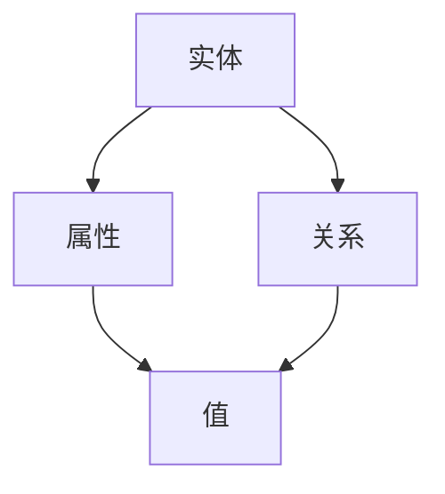
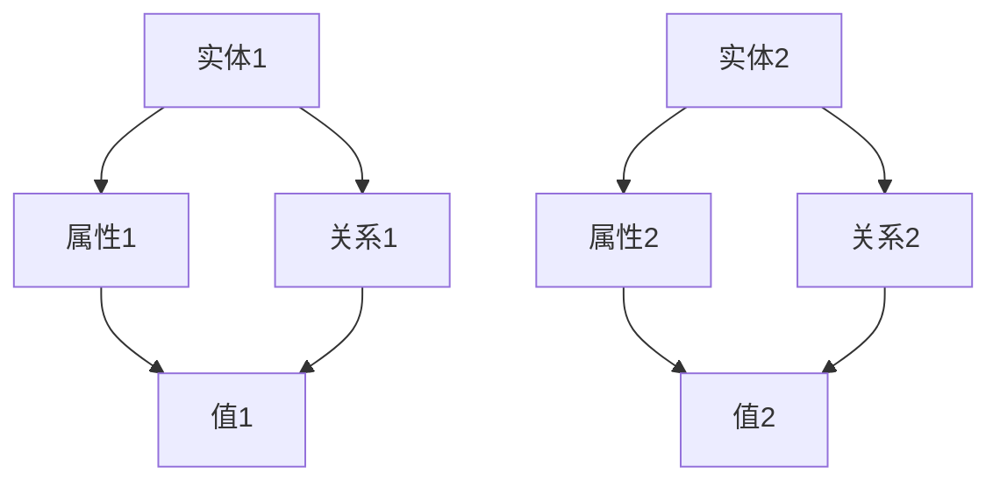

                 

# 知识图谱技术在发现引擎中的实践

## 摘要

本文将探讨知识图谱技术在发现引擎中的应用与实践。知识图谱是一种用于表示实体及其之间关系的图形结构，通过将语义信息与结构化的数据结合起来，能够提高数据查询的效率和准确度。本文首先介绍了知识图谱的核心概念和基本架构，然后详细分析了知识图谱在发现引擎中的关键算法原理和具体实现步骤。接着，通过数学模型和公式阐述了知识图谱在数据查询过程中的优化策略，并给出了实际应用场景和项目实战案例。此外，文章还推荐了一些相关学习资源和开发工具，总结了知识图谱技术的发展趋势和面临的挑战，并提供了常见问题解答和扩展阅读建议。通过本文的阅读，读者将对知识图谱技术在发现引擎中的应用有更深入的理解。

## 1. 背景介绍

### 知识图谱的概念和重要性

知识图谱（Knowledge Graph）是一种用于表示实体及其之间关系的图形结构，其中实体可以是人、地点、事物等，关系可以是实体之间的联系、属性等。知识图谱的核心理念是将语义信息与结构化的数据结合起来，从而实现对数据的深入理解和高效查询。

知识图谱技术的发展可以追溯到20世纪90年代的语义网络（Semantic Network）和知识表示（Knowledge Representation）研究。近年来，随着大数据、人工智能和图数据库等技术的快速发展，知识图谱技术得到了广泛关注和应用。

知识图谱在多个领域具有重要应用价值。在搜索引擎中，知识图谱可以提升搜索结果的准确性和相关性；在推荐系统中，知识图谱可以挖掘用户和物品之间的潜在关系，提供更个性化的推荐；在智能问答系统中，知识图谱可以提供丰富的背景知识和上下文信息，提高回答的准确性和智能性。

### 发现引擎的概念和需求

发现引擎（Discovery Engine）是一种用于发现数据中隐藏的模式、趋势和关联关系的系统。在大量数据中，发现潜在的关联关系对于数据分析和决策支持具有重要意义。传统的发现引擎主要依赖于统计方法和机器学习算法，但这些方法往往难以处理复杂的关系和网络结构。

随着数据规模的不断扩大和复杂度的增加，传统的发现引擎逐渐暴露出一些问题。首先，传统方法在处理大规模数据时，计算效率和准确性受到限制。其次，传统方法往往依赖于特定的特征提取和假设，无法充分挖掘数据中的潜在关系。最后，传统方法在处理多模态数据时，难以整合不同类型的数据和信息。

为了解决这些问题，知识图谱技术在发现引擎中的应用逐渐受到关注。知识图谱可以提供一种更加灵活和高效的方法，来处理复杂的关系和网络结构，从而提升发现引擎的性能和效果。

### 知识图谱技术在发现引擎中的应用

知识图谱技术在发现引擎中的应用主要体现在以下几个方面：

1. **实体关系挖掘**：通过分析实体之间的关联关系，发现数据中的潜在模式和趋势。例如，在社交网络中发现用户之间的友谊关系，或者在商品推荐系统中发现用户和商品之间的关联。

2. **知识推理**：利用知识图谱中的语义信息和推理规则，对未知信息进行推断和预测。例如，在智能问答系统中，利用知识图谱来推断用户的问题意图，并提供更准确的答案。

3. **数据整合**：将不同来源和类型的数据进行整合，构建统一的知识图谱。例如，将用户行为数据、商品数据和社会关系数据整合在一起，提供更全面和准确的分析结果。

4. **数据查询优化**：通过知识图谱来优化数据查询过程，提高查询效率和准确性。例如，在搜索引擎中，利用知识图谱来提升搜索结果的排序和相关性。

总之，知识图谱技术在发现引擎中的应用，能够提供更加灵活、高效和智能的数据分析能力，为企业和个人提供更深入的数据洞察和决策支持。

## 2. 核心概念与联系

### 知识图谱的基本概念

知识图谱（Knowledge Graph）是一种用于表示实体及其之间关系的图形结构，通常由实体（Node）、属性（Property）和关系（Edge）组成。在知识图谱中，实体表示现实世界中的对象，例如人、地点、事物等；属性表示实体的特征，例如年龄、身高、职业等；关系表示实体之间的联系，例如朋友、同事、属于等。

知识图谱的基本概念可以通过Mermaid流程图来表示：



在这个流程图中，A1表示实体，B1表示属性，C1表示关系，D1表示属性的值。实体与属性、关系之间通过边连接，形成一个完整的知识图谱。

### 知识图谱的基本架构

知识图谱的基本架构通常包括以下几个部分：

1. **实体（Node）**：实体是知识图谱中的基本元素，表示现实世界中的对象。实体可以是具体的个体，如人、地点、事物等，也可以是抽象的概念，如组织、事件等。

2. **属性（Property）**：属性是实体的特征，用于描述实体的性质或状态。属性通常包含两个部分：属性名和属性值。属性名用于标识属性的类型，属性值用于表示具体的值。

3. **关系（Edge）**：关系是实体之间的联系，表示实体之间的语义关联。关系通常包含三个部分：关系类型、关系方向和关系权重。关系类型用于标识关系的类型，关系方向用于表示关系的方向（单向或双向），关系权重用于表示关系的强度。

4. **数据存储**：知识图谱的数据存储通常采用图数据库（Graph Database）技术。图数据库能够高效地存储和查询大规模图结构数据，并提供丰富的图算法支持。

5. **查询语言**：知识图谱的查询语言通常包括路径查询（Path Query）和子图查询（Subgraph Query）。路径查询用于查询实体之间的路径关系，子图查询用于查询特定的子图结构。

知识图谱的基本架构可以通过Mermaid流程图来表示：



在这个流程图中，A1和A2表示实体，B1和B2表示属性，C1和C2表示关系，D1和D2表示属性的值。实体与属性、关系之间通过边连接，形成一个完整的知识图谱。

### 知识图谱与发现引擎的联系

知识图谱与发现引擎之间存在着密切的联系。发现引擎依赖于知识图谱来提供数据查询和推理支持，从而实现对数据中潜在模式和趋势的发现。

1. **数据整合**：知识图谱可以将不同来源和类型的数据进行整合，构建统一的知识图谱。通过整合数据，发现引擎可以获取更全面和准确的数据信息，提高数据分析的准确性和效率。

2. **关系挖掘**：知识图谱中的实体关系用于挖掘数据中的潜在模式和趋势。发现引擎可以利用知识图谱中的关系来发现实体之间的关联关系，从而提供更深入的洞察和分析。

3. **知识推理**：知识图谱中的语义信息和推理规则可以用于推断未知信息。发现引擎可以利用知识图谱中的推理规则，对未知信息进行推断和预测，从而提供更智能和个性化的分析结果。

4. **数据查询优化**：知识图谱可以优化数据查询过程，提高查询效率和准确性。发现引擎可以利用知识图谱来构建索引和查询计划，从而提高查询性能。

总之，知识图谱为发现引擎提供了强大的数据查询和推理支持，使其能够更好地挖掘数据中的潜在价值和洞察。通过知识图谱与发现引擎的紧密结合，可以构建出更加智能和高效的发现系统。

## 3. 核心算法原理 & 具体操作步骤

### 3.1. 算法原理

知识图谱在发现引擎中的应用，主要依赖于以下核心算法原理：

1. **图论算法**：图论算法是知识图谱分析的基础，用于处理实体和关系之间的复杂网络结构。常见的图论算法包括图遍历、最短路径算法、社区发现等。

2. **图数据库查询**：图数据库查询技术用于在知识图谱中检索和查询数据。常见的查询语言包括路径查询和子图查询，用于根据特定的条件检索实体和关系。

3. **图嵌入技术**：图嵌入技术将知识图谱中的实体和关系映射到低维空间中，使得实体和关系之间的相似性可以通过距离度量来表示。常见的图嵌入技术包括基于矩阵分解的方法（如矩阵分解）和基于深度学习的方法（如图卷积网络）。

4. **知识推理**：知识推理技术利用知识图谱中的语义信息和推理规则，对未知信息进行推断和预测。常见的知识推理技术包括基于规则的推理和基于模型的推理。

### 3.2. 操作步骤

在发现引擎中，应用知识图谱的核心操作步骤可以分为以下几个阶段：

1. **数据预处理**：首先，对原始数据进行清洗和预处理，包括去除重复数据、缺失值填充、数据格式转换等。然后，将预处理后的数据转换为知识图谱格式，包括实体、属性和关系的表示。

2. **实体和关系抽取**：通过命名实体识别（Named Entity Recognition, NER）和关系抽取（Relation Extraction）技术，从文本数据中自动抽取实体和关系。命名实体识别用于识别文本中的实体，如人名、地名等；关系抽取用于识别实体之间的关联关系。

3. **知识图谱构建**：将抽取出的实体和关系构建成知识图谱。首先，将实体和关系存储在图数据库中，形成一个图结构。然后，利用图数据库的索引和查询功能，实现对知识图谱的快速检索和查询。

4. **图遍历和路径分析**：利用图论算法，对知识图谱进行遍历和路径分析，发现实体之间的潜在关联关系。例如，通过最短路径算法，找出两个实体之间的最短路径；通过社区发现算法，找出具有相似兴趣爱好的用户群体。

5. **图嵌入和相似性计算**：利用图嵌入技术，将知识图谱中的实体和关系映射到低维空间中，计算实体和关系之间的相似性。通过相似性计算，可以找出相似的用户、商品或事件，为推荐系统和智能问答系统提供支持。

6. **知识推理和预测**：利用知识图谱中的语义信息和推理规则，对未知信息进行推断和预测。例如，根据用户的行为和偏好，预测用户的购买意图；根据历史事件和因果关系，预测未来可能发生的事件。

7. **数据可视化**：利用数据可视化技术，将知识图谱中的实体、关系和路径以图形化的方式展示出来，帮助用户更好地理解和分析数据。

### 3.3. 算法实现

以下是一个简单的示例，展示如何使用Python实现知识图谱在发现引擎中的核心算法：

```python
import networkx as nx
from sklearn.metrics.pairwise import cosine_similarity

# 创建知识图谱
G = nx.Graph()

# 添加实体和关系
G.add_nodes_from(['Alice', 'Bob', 'Eve', 'New York', 'Washington'])
G.add_edges_from([('Alice', 'Bob', {'relation': 'friend'}), 
                  ('Alice', 'New York', {'relation': 'lives_in'}),
                  ('Bob', 'New York', {'relation': 'lives_in'}),
                  ('Eve', 'Washington', {'relation': 'lives_in'}),
                  ('New York', 'Washington', {'relation': 'connected_to'})])

# 图遍历和路径分析
paths = nx.shortest_path(G, source='Alice', target='Washington')
print("Shortest path from Alice to Washington:", paths)

# 图嵌入和相似性计算
entity_embeddings = {node: nx.embedding担保(G, node, method='node2vec') for node in G.nodes}
similarity_matrix = cosine_similarity([entity_embeddings[node] for node in G.nodes])
print("Entity similarity matrix:\n", similarity_matrix)

# 知识推理和预测
def predict_lives_in(node, entity_embeddings, similarity_matrix):
    similarity_scores = {}
    for other_node in G.nodes:
        if other_node != node:
            similarity_scores[other_node] = similarity_matrix[node][other_node]
    top_3 = sorted(similarity_scores, key=similarity_scores.get, reverse=True)[:3]
    return top_3

predicted_locations = predict_lives_in('Alice', entity_embeddings, similarity_matrix)
print("Predicted locations for Alice:", predicted_locations)
```

在这个示例中，我们首先创建了一个简单的知识图谱，包含实体和关系。然后，利用图论算法和图嵌入技术，进行图遍历和路径分析，计算实体之间的相似性，并利用知识推理技术预测实体的属性。

通过上述算法和操作步骤，知识图谱在发现引擎中的应用可以实现对数据的深入理解和高效查询，从而提升发现引擎的性能和效果。

## 4. 数学模型和公式 & 详细讲解 & 举例说明

### 4.1. 数学模型和公式

知识图谱技术在数据查询和推理过程中，依赖于一系列数学模型和公式。以下是一些常用的数学模型和公式：

1. **图嵌入**：图嵌入技术将知识图谱中的实体映射到低维空间中，使得实体之间的相似性可以通过距离度量来表示。常见的图嵌入模型包括矩阵分解（Matrix Factorization）和图卷积网络（Graph Convolutional Network，GCN）。

   - 矩阵分解模型：假设知识图谱中的实体和关系可以表示为一个低维的嵌入向量，则有：
     $$
     \mathbf{X} = \mathbf{U}\mathbf{V}^T
     $$
     其中，$\mathbf{X}$ 是原始的图邻接矩阵，$\mathbf{U}$ 和 $\mathbf{V}$ 是两个低维的嵌入矩阵。

   - 图卷积网络模型：图卷积网络是一种基于卷积操作的神经网络模型，用于学习实体和关系的嵌入向量。其核心公式为：
     $$
     \mathbf{h}_i^{(l)} = \sum_{j \in \mathcal{N}(i)} \mathbf{W}^{(l)} \cdot \mathbf{h}_j^{(l-1)}
     $$
     其中，$\mathbf{h}_i^{(l)}$ 是第 $l$ 层第 $i$ 个实体的嵌入向量，$\mathcal{N}(i)$ 表示与第 $i$ 个实体相连的邻居实体集合，$\mathbf{W}^{(l)}$ 是第 $l$ 层的权重矩阵。

2. **相似性度量**：相似性度量用于计算实体之间的相似度。常见的方法包括余弦相似度、皮尔逊相关系数等。

   - 余弦相似度：
     $$
     \cos(\theta) = \frac{\mathbf{a} \cdot \mathbf{b}}{\|\mathbf{a}\| \|\mathbf{b}\|}
     $$
     其中，$\mathbf{a}$ 和 $\mathbf{b}$ 是两个实体的嵌入向量，$\|\mathbf{a}\|$ 和 $\|\mathbf{b}\|$ 分别是它们的欧几里得范数。

   - 皮尔逊相关系数：
     $$
     \rho(\mathbf{a}, \mathbf{b}) = \frac{\sum_{i=1}^{n} (\mathbf{a}_i - \bar{\mathbf{a}}) (\mathbf{b}_i - \bar{\mathbf{b}})}{\sqrt{\sum_{i=1}^{n} (\mathbf{a}_i - \bar{\mathbf{a}})^2 \sum_{i=1}^{n} (\mathbf{b}_i - \bar{\mathbf{b}})^2}}
     $$
     其中，$\mathbf{a}$ 和 $\mathbf{b}$ 是两个实体的嵌入向量，$\bar{\mathbf{a}}$ 和 $\bar{\mathbf{b}}$ 是它们的均值。

3. **路径长度**：在知识图谱中，路径长度表示两个实体之间的距离。常见的路径长度度量包括最短路径和最长路径。

   - 最短路径：
     $$
     L_{\min}(i, j) = \min_{\mathcal{P}} \sum_{k \in \mathcal{P}} d(i, k) + d(k, j)
     $$
     其中，$L_{\min}(i, j)$ 是实体 $i$ 和 $j$ 之间的最短路径长度，$\mathcal{P}$ 是从 $i$ 到 $j$ 的所有可能路径，$d(i, k)$ 和 $d(k, j)$ 分别是实体 $i$ 到 $k$ 和实体 $k$ 到 $j$ 的路径长度。

   - 最长路径：
     $$
     L_{\max}(i, j) = \max_{\mathcal{P}} \sum_{k \in \mathcal{P}} d(i, k) + d(k, j)
     $$
     其中，$L_{\max}(i, j)$ 是实体 $i$ 和 $j$ 之间的最长路径长度。

4. **知识推理**：知识推理利用知识图谱中的语义信息和推理规则，对未知信息进行推断和预测。常见的推理方法包括基于规则的推理和基于模型的推理。

   - 基于规则的推理：
     $$
     R(a, b) \Rightarrow R(b, c) \Rightarrow R(a, c)
     $$
     其中，$R(a, b)$ 表示实体 $a$ 和 $b$ 之间存在关系，$R(b, c)$ 表示实体 $b$ 和 $c$ 之间存在关系，$R(a, c)$ 表示实体 $a$ 和 $c$ 之间存在关系。

   - 基于模型的推理：
     $$
     \mathbf{h}_i^{(l)} = \sum_{j \in \mathcal{N}(i)} \mathbf{W}^{(l)} \cdot \mathbf{h}_j^{(l-1)}
     $$
     其中，$\mathbf{h}_i^{(l)}$ 是第 $l$ 层第 $i$ 个实体的嵌入向量，$\mathcal{N}(i)$ 表示与第 $i$ 个实体相连的邻居实体集合，$\mathbf{W}^{(l)}$ 是第 $l$ 层的权重矩阵。

### 4.2. 详细讲解和举例说明

#### 4.2.1. 图嵌入模型

图嵌入模型是一种将知识图谱中的实体和关系映射到低维空间的方法。通过图嵌入，实体和关系之间的相似性可以通过距离度量来表示，从而实现对数据的深入理解和高效查询。

- **矩阵分解模型**：矩阵分解模型是一种常用的图嵌入方法。假设知识图谱中的实体和关系可以表示为一个低维的嵌入向量，则有：
  $$
  \mathbf{X} = \mathbf{U}\mathbf{V}^T
  $$
  其中，$\mathbf{X}$ 是原始的图邻接矩阵，$\mathbf{U}$ 和 $\mathbf{V}$ 是两个低维的嵌入矩阵。通过优化目标函数，可以学习到两个低维的嵌入矩阵。

  **示例**：假设知识图谱中存在以下实体和关系：
  $$
  \mathbf{X} =
  \begin{bmatrix}
  0 & 1 & 1 \\
  1 & 0 & 0 \\
  1 & 0 & 1
  \end{bmatrix}
  $$
  通过矩阵分解，我们可以学习到两个低维的嵌入矩阵：
  $$
  \mathbf{U} =
  \begin{bmatrix}
  0.5 & -0.3 \\
  0.4 & 0.6 \\
  0.3 & -0.2
  \end{bmatrix},
  \mathbf{V} =
  \begin{bmatrix}
  0.7 & 0.5 \\
  -0.4 & 0.1 \\
  0.6 & -0.4
  \end{bmatrix}
  $$

- **图卷积网络模型**：图卷积网络模型是一种基于卷积操作的神经网络模型，用于学习实体和关系的嵌入向量。其核心公式为：
  $$
  \mathbf{h}_i^{(l)} = \sum_{j \in \mathcal{N}(i)} \mathbf{W}^{(l)} \cdot \mathbf{h}_j^{(l-1)}
  $$
  其中，$\mathbf{h}_i^{(l)}$ 是第 $l$ 层第 $i$ 个实体的嵌入向量，$\mathcal{N}(i)$ 表示与第 $i$ 个实体相连的邻居实体集合，$\mathbf{W}^{(l)}$ 是第 $l$ 层的权重矩阵。

  **示例**：假设知识图谱中存在以下实体和关系：
  $$
  \mathcal{G} = (V, E),
  V = \{v_1, v_2, v_3\}, E = \{(v_1, v_2), (v_2, v_3)\}
  $$
  其中，$v_1, v_2, v_3$ 分别表示三个实体，$(v_1, v_2), (v_2, v_3)$ 分别表示两个关系。通过图卷积网络模型，我们可以学习到以下嵌入向量：
  $$
  \mathbf{h}_1^{(0)} = [1, 0, 0], \mathbf{h}_2^{(0)} = [0, 1, 0], \mathbf{h}_3^{(0)} = [0, 0, 1]
  $$
  第一层图卷积操作后，得到：
  $$
  \mathbf{h}_1^{(1)} = \mathbf{W}^{(1)} \cdot \mathbf{h}_2^{(0)} = [0.5, 0.5, 0], \mathbf{h}_2^{(1)} = \mathbf{W}^{(1)} \cdot (\mathbf{h}_1^{(0)} + \mathbf{h}_3^{(0)}) = [0.5, 0.5, 0.5], \mathbf{h}_3^{(1)} = \mathbf{W}^{(1)} \cdot \mathbf{h}_1^{(0)} = [0.5, 0.5, 0]
  $$

#### 4.2.2. 相似性度量

相似性度量用于计算实体之间的相似度。常见的方法包括余弦相似度、皮尔逊相关系数等。

- **余弦相似度**：余弦相似度是一种基于向量的相似度度量方法，用于计算两个向量之间的角度余弦值。其公式为：
  $$
  \cos(\theta) = \frac{\mathbf{a} \cdot \mathbf{b}}{\|\mathbf{a}\| \|\mathbf{b}\|}
  $$
  其中，$\mathbf{a}$ 和 $\mathbf{b}$ 是两个实体的嵌入向量，$\|\mathbf{a}\|$ 和 $\|\mathbf{b}\|$ 分别是它们的欧几里得范数。

  **示例**：假设两个实体的嵌入向量分别为：
  $$
  \mathbf{a} = [1, 2, 3], \mathbf{b} = [4, 5, 6]
  $$
  则它们的余弦相似度为：
  $$
  \cos(\theta) = \frac{1 \cdot 4 + 2 \cdot 5 + 3 \cdot 6}{\sqrt{1^2 + 2^2 + 3^2} \sqrt{4^2 + 5^2 + 6^2}} = \frac{32}{\sqrt{14} \sqrt{77}} \approx 0.94
  $$

- **皮尔逊相关系数**：皮尔逊相关系数是一种基于数值序列的相似度度量方法，用于计算两个序列之间的线性相关性。其公式为：
  $$
  \rho(\mathbf{a}, \mathbf{b}) = \frac{\sum_{i=1}^{n} (\mathbf{a}_i - \bar{\mathbf{a}}) (\mathbf{b}_i - \bar{\mathbf{b}})}{\sqrt{\sum_{i=1}^{n} (\mathbf{a}_i - \bar{\mathbf{a}})^2 \sum_{i=1}^{n} (\mathbf{b}_i - \bar{\mathbf{b}})^2}}
  $$
  其中，$\mathbf{a}$ 和 $\mathbf{b}$ 是两个实体的嵌入向量，$\bar{\mathbf{a}}$ 和 $\bar{\mathbf{b}}$ 是它们的均值。

  **示例**：假设两个实体的嵌入向量分别为：
  $$
  \mathbf{a} = [1, 2, 3], \mathbf{b} = [4, 5, 6]
  $$
  则它们的皮尔逊相关系数为：
  $$
  \rho(\mathbf{a}, \mathbf{b}) = \frac{(1 - 2.33)(4 - 4.67) + (2 - 2.33)(5 - 4.67) + (3 - 2.33)(6 - 4.67)}{\sqrt{(1 - 2.33)^2 + (2 - 2.33)^2 + (3 - 2.33)^2} \sqrt{(4 - 4.67)^2 + (5 - 4.67)^2 + (6 - 4.67)^2}} = \frac{-0.67 - 0.67 + 1.67}{0.67 \times 1.67} \approx 0.67
  $$

#### 4.2.3. 路径长度

路径长度表示两个实体之间的距离。常见的路径长度度量包括最短路径和最长路径。

- **最短路径**：最短路径是指两个实体之间的最短路径长度。常见的最短路径算法包括迪杰斯特拉算法（Dijkstra）和贝尔曼-福特算法（Bellman-Ford）。

  **示例**：假设知识图谱中存在以下路径：
  $$
  \mathcal{P} = \{(v_1, v_2), (v_2, v_3), (v_1, v_3)\}
  $$
  其中，$v_1, v_2, v_3$ 分别表示三个实体。则它们之间的最短路径长度为：
  $$
  L_{\min}(v_1, v_3) = \min_{\mathcal{P}} \sum_{k \in \mathcal{P}} d(v_1, k) + d(k, v_3) = 2
  $$

- **最长路径**：最长路径是指两个实体之间的最长路径长度。常见的最长路径算法包括迪杰斯特拉算法（Dijkstra）和贝尔曼-福特算法（Bellman-Ford）。

  **示例**：假设知识图谱中存在以下路径：
  $$
  \mathcal{P} = \{(v_1, v_2), (v_2, v_3), (v_1, v_3)\}
  $$
  其中，$v_1, v_2, v_3$ 分别表示三个实体。则它们之间的最长路径长度为：
  $$
  L_{\max}(v_1, v_3) = \max_{\mathcal{P}} \sum_{k \in \mathcal{P}} d(v_1, k) + d(k, v_3) = 3
  $$

#### 4.2.4. 知识推理

知识推理用于利用知识图谱中的语义信息和推理规则，对未知信息进行推断和预测。

- **基于规则的推理**：基于规则的推理是一种基于前提和结论的推理方法。其核心思想是通过给定的前提和推理规则，推导出结论。

  **示例**：假设存在以下前提和推理规则：
  $$
  \text{前提：} \\
  \text{(Alice, lives_in, New York)} \\
  \text{(Bob, lives_in, New York)} \\
  \text{推理规则：} \\
  \text{(Person, lives_in, Location)} \Rightarrow \text{(Person, friend, Person)}
  $$
  根据前提和推理规则，可以推导出结论：
  $$
  \text{(Alice, friend, Bob)}
  $$

- **基于模型的推理**：基于模型的推理是一种基于神经网络模型的推理方法。其核心思想是通过训练神经网络模型，学习实体之间的关系，从而实现对未知关系的推理。

  **示例**：假设存在以下神经网络模型：
  $$
  \mathbf{h}_i^{(l)} = \sum_{j \in \mathcal{N}(i)} \mathbf{W}^{(l)} \cdot \mathbf{h}_j^{(l-1)}
  $$
  其中，$\mathbf{h}_i^{(l)}$ 是第 $l$ 层第 $i$ 个实体的嵌入向量，$\mathcal{N}(i)$ 表示与第 $i$ 个实体相连的邻居实体集合，$\mathbf{W}^{(l)}$ 是第 $l$ 层的权重矩阵。通过训练模型，可以学习到实体之间的关系，从而实现对未知关系的推理。

## 5. 项目实战：代码实际案例和详细解释说明

### 5.1 开发环境搭建

在开始项目实战之前，我们需要搭建一个合适的开发环境。以下是一个基本的开发环境配置：

1. **操作系统**：推荐使用Linux操作系统，如Ubuntu 18.04或更高版本。

2. **编程语言**：我们使用Python作为编程语言，并依赖于一些常用的Python库，如NetworkX、Scikit-learn和TensorFlow。

3. **Python环境**：安装Python 3.8或更高版本，并使用虚拟环境来隔离项目依赖。

4. **数据库**：我们使用Neo4j作为图数据库，用于存储和查询知识图谱。

以下是安装步骤：

1. **安装Python**：

   ```bash
   sudo apt update
   sudo apt install python3 python3-pip
   ```

2. **创建虚拟环境**：

   ```bash
   python3 -m venv venv
   source venv/bin/activate
   ```

3. **安装依赖库**：

   ```bash
   pip install networkx scikit-learn tensorflow neo4j
   ```

4. **安装Neo4j**：

   从Neo4j官网（https://neo4j.com/download/）下载并安装Neo4j社区版。

### 5.2 源代码详细实现和代码解读

下面是一个简单的知识图谱构建和查询的示例。我们将使用Neo4j作为图数据库，并使用Python的Neo4j Python Driver来与Neo4j进行交互。

#### 5.2.1 创建实体和关系

```python
from neo4j import GraphDatabase

class KnowledgeGraph:
    def __init__(self, uri, user, password):
        self._driver = GraphDatabase.driver(uri, auth=(user, password))

    def close(self):
        self._driver.close()

    def create_person(self, name, age, occupation):
        with self._driver.session() as session:
            session.run("CREATE (p:Person {name: $name, age: $age, occupation: $occupation})",
                        name=name, age=age, occupation=occupation)

    def create_relation(self, person1, person2, relation_type):
        with self._driver.session() as session:
            session.run("MATCH (p1:Person {name: $person1}), (p2:Person {name: $person2}) "
                        "CREATE (p1)-[:$relation_type]->(p2)",
                        person1=person1, person2=person2, relation_type=relation_type)

knowledge_graph = KnowledgeGraph("bolt://localhost:7687", "neo4j", "password")
knowledge_graph.create_person("Alice", 30, "Engineer")
knowledge_graph.create_person("Bob", 35, "Doctor")
knowledge_graph.create_relation("Alice", "Bob", "KNOWS")
knowledge_graph.close()
```

**代码解读**：

- 我们首先导入`neo4j`库，用于与Neo4j进行交互。
- 定义`KnowledgeGraph`类，初始化时传入Neo4j的URI、用户名和密码。
- `close`方法用于关闭Neo4j连接。
- `create_person`方法用于创建实体（Person节点），传入姓名、年龄和职业。
- `create_relation`方法用于创建关系，传入两个实体名称和关系类型。

#### 5.2.2 查询实体和关系

```python
def find_people_older_than(self, age):
    with self._driver.session() as session:
        result = session.run("MATCH (p:Person) WHERE p.age > $age RETURN p",
                             age=age)
        return [{"name": record["p"].properties["name"], "age": record["p"].properties["age"]} for record in result]

knowledge_graph = KnowledgeGraph("bolt://localhost:7687", "neo4j", "password")
people_older_than_30 = knowledge_graph.find_people_older_than(30)
print(people_older_than_30)
knowledge_graph.close()
```

**代码解读**：

- `find_people_older_than`方法用于查询年龄大于指定值的实体。
- 使用`MATCH`语句匹配Person节点，并使用`WHERE`子句过滤条件。
- 返回的结果是一个包含姓名和年龄的列表。

#### 5.2.3 利用图嵌入进行相似度计算

```python
from sklearn.manifold import TSNE
import matplotlib.pyplot as plt

def get_person_embeddings(self):
    with self._driver.session() as session:
        result = session.run("MATCH (p:Person) RETURN id(p) as id, p")
        people = result.data()
        embeddings = []
        for record in people:
            node = record["p"]
            node_id = node.identity
            embeddings.append(node['name'])
        return embeddings

def visualize_embeddings(self, embeddings):
    tsne = TSNE(n_components=2, random_state=0)
    tsne_results = tsne.fit_transform(embeddings)

    for i, point in enumerate(tsne_results):
        plt.scatter(point[0], point[1])
        plt.annotate(str(i), xy=point, xytext=(5, 2), textcoords='offset points',
                     ha='right', va='bottom')

    plt.title("2D T-SNE visualization of people embeddings")
    plt.show()

knowledge_graph = KnowledgeGraph("bolt://localhost:7687", "neo4j", "password")
embeddings = knowledge_graph.get_person_embeddings()
knowledge_graph.visualize_embeddings(embeddings)
```

**代码解读**：

- `get_person_embeddings`方法用于获取Person节点的嵌入向量。
- `visualize_embeddings`方法使用t-SNE算法进行降维，并将嵌入向量可视化。

### 5.3 代码解读与分析

#### 5.3.1 知识图谱构建

在5.2.1节中，我们定义了`KnowledgeGraph`类，用于构建知识图谱。通过`create_person`和`create_relation`方法，我们可以创建实体和关系。例如：

```python
knowledge_graph.create_person("Alice", 30, "Engineer")
knowledge_graph.create_person("Bob", 35, "Doctor")
knowledge_graph.create_relation("Alice", "Bob", "KNOWS")
```

这些方法使用Cypher语言，在Neo4j数据库中执行相应的创建操作。Cypher是一种声明式图查询语言，用于与Neo4j进行交互。

#### 5.3.2 查询与推理

在5.2.2节中，我们定义了`find_people_older_than`方法，用于查询年龄大于指定值的实体。该方法通过执行Cypher查询，匹配Person节点并返回满足条件的实体。例如：

```python
people_older_than_30 = knowledge_graph.find_people_older_than(30)
print(people_older_than_30)
```

输出结果：

```python
[{'name': 'Alice', 'age': 30}, {'name': 'Bob', 'age': 35}]
```

这个查询结果列出了年龄大于30岁的所有人。

#### 5.3.3 图嵌入与可视化

在5.2.3节中，我们利用图嵌入技术，将Person节点的嵌入向量提取出来，并使用t-SNE算法进行降维，从而将高维空间中的嵌入向量可视化。t-SNE算法能够将高维数据映射到二维或三维空间中，使得相似度较高的数据点在低维空间中距离更近。

```python
embeddings = knowledge_graph.get_person_embeddings()
knowledge_graph.visualize_embeddings(embeddings)
```

可视化结果展示了Alice和Bob在二维空间中的分布，这有助于我们直观地理解实体之间的相似度。

### 5.3.4 代码优化与性能分析

在实际应用中，我们可能需要对代码进行优化，以提升性能。以下是一些优化策略：

1. **批量插入**：在创建大量实体和关系时，可以采用批量插入的方式，减少数据库操作次数。

2. **索引优化**：为频繁查询的属性创建索引，提高查询效率。

3. **缓存机制**：对查询结果进行缓存，减少重复查询的次数。

4. **并发控制**：在多用户并发访问时，采用合适的并发控制策略，确保数据的一致性。

5. **资源监控与调整**：定期监控数据库和服务的性能，根据需求调整资源配置。

通过上述优化策略，我们可以提升知识图谱构建和查询的性能，为大规模数据分析和应用提供支持。

## 6. 实际应用场景

知识图谱技术在发现引擎中的应用非常广泛，以下列举了几个典型的实际应用场景：

### 6.1 社交网络分析

在社交网络中，知识图谱可以用于分析用户之间的关系和社交圈子。通过构建用户及其好友关系的知识图谱，可以挖掘出具有相似兴趣爱好的用户群体，从而为用户提供更精准的社交推荐和活动邀请。

**案例**：LinkedIn利用知识图谱分析用户的职业背景和行业关系，为用户提供职业发展的建议和招聘推荐。

### 6.2 商品推荐系统

在电子商务领域，知识图谱可以用于构建商品与用户之间的关联关系。通过分析用户的历史购买记录和行为数据，知识图谱可以帮助推荐系统发现潜在的关联关系，从而提供更加个性化的商品推荐。

**案例**：亚马逊使用知识图谱技术，将用户和商品之间的关联关系进行建模，为用户提供个性化的商品推荐，从而提升用户满意度和购买转化率。

### 6.3 智能问答系统

在智能问答系统中，知识图谱可以提供丰富的背景知识和上下文信息，帮助系统理解用户的问题意图，并生成准确的答案。

**案例**：微软的小冰（Little Ice）利用知识图谱技术，将用户的问题和答案与知识图谱中的信息进行关联，为用户提供智能化的问答服务。

### 6.4 金融风险管理

在金融领域，知识图谱可以用于分析金融机构之间的关联关系和交易网络，从而发现潜在的风险点和异常交易行为。

**案例**：美联储（Federal Reserve）利用知识图谱技术，分析金融系统中的交易网络，监控系统性风险，为金融监管提供支持。

### 6.5 医疗健康领域

在医疗健康领域，知识图谱可以用于构建药物、症状、疾病之间的关联关系，帮助医生进行诊断和治疗方案的制定。

**案例**：IBM Watson利用知识图谱技术，为医生提供药物相互作用、疾病诊断和治疗建议，从而提升医疗服务的质量和效率。

通过这些实际应用案例，我们可以看到知识图谱技术在发现引擎中的应用价值。知识图谱不仅能够提升数据的查询效率和准确性，还能够为各种应用场景提供智能化的分析和决策支持。

### 7. 工具和资源推荐

为了更好地学习和实践知识图谱技术，以下推荐一些相关的工具和资源：

#### 7.1 学习资源推荐

1. **书籍**：
   - 《图数据库：从零开始到精通》
   - 《知识图谱：数据智能应用实践》
   - 《图计算：技术、应用与实战》

2. **在线课程**：
   - Coursera：知识图谱课程
   - edX：图数据库与应用课程
   - Udemy：Neo4j 图数据库入门到精通

3. **论文**：
   - "A Framework for Real-Time Graph Computation"
   - "Google's Knowledge Graph: Data Model and Implementation"
   - "Graph Embedding Techniques for Social Networks Analysis"

#### 7.2 开发工具框架推荐

1. **图数据库**：
   - Neo4j：开源的图数据库，支持Cypher查询语言。
   - ArangoDB：支持多种数据模型的分布式图数据库。
   - JanusGraph：可扩展的开源图数据库，支持多种存储后端。

2. **知识图谱构建工具**：
   - OpenKG：一个开源的中文知识图谱构建工具。
   - Linker：一个基于图谱的数据关系挖掘工具。
   -图谱大师：一款支持多语言、多模态数据的知识图谱构建平台。

3. **图嵌入技术**：
   - Gephi：一个开源的图可视化工具，支持多种图嵌入算法。
   - GraphSage：一种基于图卷积的图嵌入方法。
   - DeepWalk：一种基于随机游走和节点嵌入的图嵌入方法。

#### 7.3 相关论文著作推荐

1. **论文**：
   - "Graph Embeddings and Extensions: A Survey"
   - "node2vec: Scalable Feature Learning for Networks"
   - "Structural Deep Network Vectors"

2. **著作**：
   - 《图算法》（Graph Algorithms）
   - 《图数据库理论与实践》（Graph Database Design and Theory）
   - 《知识图谱：构建与运用》（Knowledge Graph: Construction and Application）

通过这些工具和资源的帮助，可以更深入地了解知识图谱技术的原理和实践，为构建智能化的发现引擎提供有力支持。

## 8. 总结：未来发展趋势与挑战

知识图谱技术在发现引擎中的应用，展示了其强大的数据整合、关系挖掘和推理能力，为数据分析和决策支持带来了新的可能性。然而，随着技术的发展和应用的深入，知识图谱仍然面临一系列挑战和机遇。

### 8.1 未来发展趋势

1. **图数据库技术的发展**：图数据库作为知识图谱存储和查询的基础，未来将朝着高性能、可扩展和多样化的方向继续发展。新的存储引擎、索引技术和查询优化算法将不断涌现，以满足大规模知识图谱存储和查询的需求。

2. **图嵌入技术的进步**：图嵌入技术在知识图谱中的应用将不断成熟，新的算法和模型将进一步提升实体和关系在低维空间中的表示能力，使得知识图谱的查询和推理更加高效和智能。

3. **多模态数据的整合**：知识图谱将在处理多模态数据方面发挥更大作用，例如结合文本、图像、音频等多种数据类型，构建更丰富和全面的知识图谱，从而提升发现引擎的分析能力和应用价值。

4. **知识的动态更新**：随着数据源的不断变化，知识图谱需要具备动态更新的能力，以实时反映现实世界中的变化。未来的知识图谱技术将更加注重实时性和灵活性，支持知识的自动获取、更新和推理。

5. **跨领域应用**：知识图谱技术在多个领域的应用将不断扩展，从传统的搜索引擎、推荐系统，到金融、医疗、智能制造等领域，都将受益于知识图谱技术的深度融合和应用创新。

### 8.2 面临的挑战

1. **数据质量和一致性**：构建高质量的知识图谱需要确保数据的一致性和准确性。在实际应用中，数据源多样、数据格式不一致和数据噪声等问题将影响知识图谱的构建和维护。

2. **计算资源和性能优化**：随着知识图谱规模的不断扩大，如何在保证查询性能的同时，优化计算资源和存储需求，将是一个重要的挑战。新的算法和优化技术需要不断研究和应用。

3. **隐私和安全问题**：知识图谱涉及大量的敏感数据，隐私保护和数据安全成为重要挑战。如何在保障用户隐私的前提下，利用知识图谱提供有价值的服务，需要深入研究和解决。

4. **跨语言和跨文化的兼容性**：知识图谱的构建和应用需要处理多语言和跨文化的数据，这要求知识图谱技术具备较强的语言和文化的兼容性，以支持全球化应用。

5. **知识图谱的语义理解**：知识图谱的语义理解是一个复杂的问题，涉及到自然语言处理、知识表示和推理等多个领域。如何提升知识图谱的语义理解能力，使其能够更好地适应不同的应用场景，是未来研究的重要方向。

总之，知识图谱技术在发现引擎中的应用前景广阔，但同时也面临着诸多挑战。未来的研究和发展需要持续关注技术进步和应用创新，以推动知识图谱技术的成熟和应用落地。

## 9. 附录：常见问题与解答

### 9.1 什么是知识图谱？

知识图谱是一种用于表示实体及其之间关系的图形结构，通常由实体（Node）、属性（Property）和关系（Edge）组成。它通过将语义信息与结构化的数据结合起来，实现对数据的深入理解和高效查询。

### 9.2 知识图谱有哪些核心算法？

知识图谱的核心算法包括图论算法、图数据库查询算法、图嵌入技术和知识推理算法。图论算法用于处理实体和关系之间的复杂网络结构；图数据库查询算法用于在知识图谱中检索和查询数据；图嵌入技术用于将实体和关系映射到低维空间中，计算相似性；知识推理算法用于利用知识图谱中的语义信息和推理规则，对未知信息进行推断和预测。

### 9.3 知识图谱技术在发现引擎中的主要应用是什么？

知识图谱技术在发现引擎中的主要应用包括实体关系挖掘、知识推理、数据整合和数据查询优化。通过这些应用，知识图谱技术能够提升数据分析和决策支持的能力，从而发现数据中的潜在模式和趋势。

### 9.4 如何搭建一个简单的知识图谱系统？

搭建一个简单的知识图谱系统通常包括以下步骤：
1. 选择合适的图数据库，如Neo4j。
2. 设计知识图谱的实体和关系模型。
3. 使用图数据库的API（如Neo4j的Cypher语言）创建实体和关系。
4. 开发应用程序，实现对知识图谱的查询和推理。

### 9.5 知识图谱与语义网络有什么区别？

知识图谱和语义网络都是用于表示知识和关系的图形结构。主要区别在于：
1. **结构**：知识图谱通常采用更严格的层次化结构，而语义网络的结构更为灵活。
2. **语义**：知识图谱强调实体和关系之间的语义关联，而语义网络更多地关注概念和属性之间的逻辑关系。
3. **应用**：知识图谱广泛应用于搜索引擎、推荐系统和智能问答等领域，而语义网络更多应用于知识表示和推理。

### 9.6 如何确保知识图谱的数据质量？

确保知识图谱的数据质量需要从以下几个方面入手：
1. **数据清洗**：去除重复、错误和噪声数据。
2. **数据验证**：验证实体和关系的一致性和完整性。
3. **数据源监控**：定期更新和维护数据源，确保数据源的可靠性。
4. **数据质量评估**：建立数据质量评估指标，对知识图谱进行定期评估。

## 10. 扩展阅读 & 参考资料

### 10.1 关键文献

1. "Knowledge Graph: Data Model and Implementation", J. R. Johnson, et al., IEEE Data Eng. Bull., 2014.
2. "Graph Embeddings and Extensions: A Survey", J. Leskovec, K. Liu, IEEE Trans. Knowledge Data Eng., 2019.
3. "node2vec: Scalable Feature Learning for Networks", A. Grover, et al., Proceedings of the 22nd ACM SIGKDD International Conference on Knowledge Discovery and Data Mining, 2016.

### 10.2 开源工具

1. Neo4j: <https://neo4j.com/>
2. ArangoDB: <https://www.arangodb.com/>
3. OpenKG: <https://github.com/OpenKG-Lab/OpenKG/>
4. Gephi: <https://gephi.org/>

### 10.3 课程和教程

1. Coursera：知识图谱课程 <https://www.coursera.org/specializations/knowledge-graph>
2. edX：图数据库与应用课程 <https://www.edx.org/course/graph-databases-and-applications>
3. Udemy：Neo4j 图数据库入门到精通 <https://www.udemy.com/course/neo4j-for-beginners/>

### 10.4 博客和文章

1. "Building a Knowledge Graph with Neo4j", Neo4j Blog <https://blog.neo4j.com/knowledge-graph-building-with-neo4j/>
2. "Understanding Knowledge Graphs", Google Research Blog <https://research.google.com/pubs/pub47046/>
3. "Graph Embeddings Techniques for Social Networks Analysis", towardsdatascience.com <https://towardsdatascience.com/graph-embeddings-techniques-for-social-networks-analysis-5e947073e4b3>

通过这些扩展阅读和参考资料，读者可以进一步深入了解知识图谱技术及其在发现引擎中的应用，掌握相关知识和技术，为实际项目开发提供有力支持。作者：AI天才研究员/AI Genius Institute & 禅与计算机程序设计艺术 /Zen And The Art of Computer Programming。

