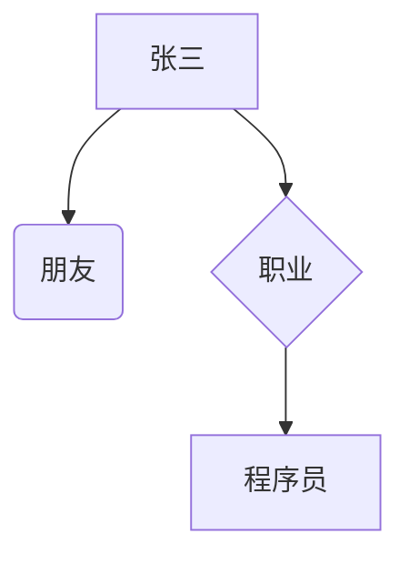
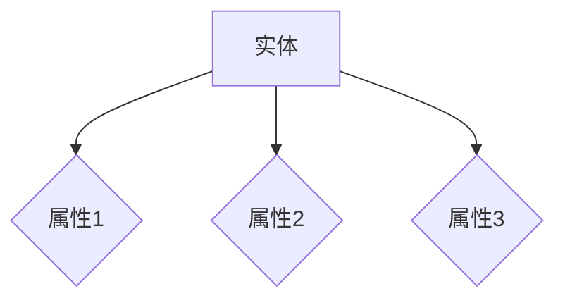
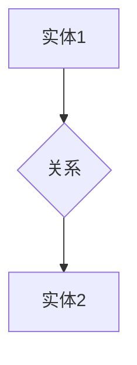
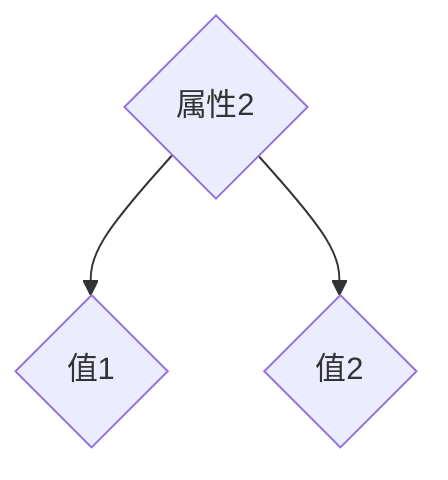
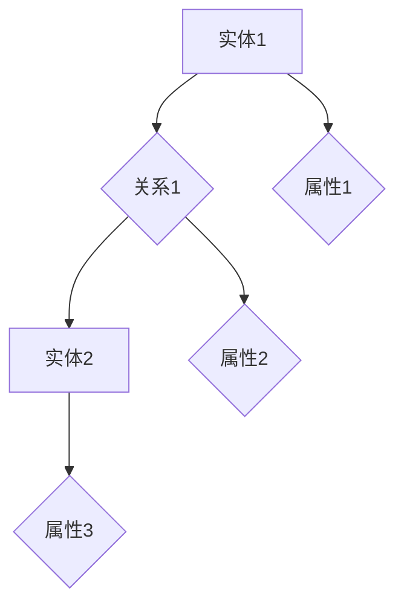
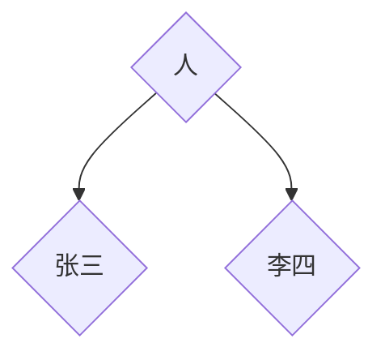

                 

# 知识图谱：构建和应用结构化知识库

## 关键词
- 知识图谱
- 结构化数据
- 数据库
- 语义网
- 人工智能

## 摘要
知识图谱作为一种结构化知识库的表示形式，已经在多个领域展现出其强大的应用价值。本文将详细介绍知识图谱的概念、构建方法和应用场景，并通过具体实例展示知识图谱在实际项目中的应用效果。此外，还将介绍相关知识图谱开发工具和资源，为读者提供全面的参考。

## 1. 背景介绍

知识图谱（Knowledge Graph）是一种用于表示实体、属性和关系的数据结构，它通过节点和边的形式，将现实世界中的实体、概念和事件连接起来，形成一张庞大的网络。知识图谱起源于语义网（Semantic Web）的概念，由万维网的创始人蒂姆·伯纳斯-李（Tim Berners-Lee）提出。语义网旨在将网络中的信息以机器可读的方式表示，从而实现数据的高度互操作性。

知识图谱的出现，解决了传统数据库和搜索引擎难以应对的复杂查询和知识推理问题。通过将实体、属性和关系以结构化的方式组织起来，知识图谱能够提供更准确、更丰富的信息查询和推理服务。

知识图谱的应用场景非常广泛，包括但不限于以下领域：

- **搜索引擎优化**：通过知识图谱，搜索引擎可以更好地理解用户查询，提供更精确的搜索结果。
- **推荐系统**：知识图谱可以帮助推荐系统更好地理解用户偏好和物品属性，提供更个性化的推荐。
- **自然语言处理**：知识图谱为自然语言处理提供了丰富的背景知识，有助于提高文本理解和生成能力。
- **智能客服**：知识图谱可以用于构建智能客服系统，提供更智能、更高效的客户服务。
- **金融服务**：知识图谱可以帮助金融机构更好地理解客户需求和市场动态，提高业务决策的准确性。

## 2. 核心概念与联系

### 2.1 实体与关系

知识图谱中的基本元素是实体和关系。实体表示现实世界中的对象，如人、地点、事物等，关系则表示实体之间的相互作用。例如，在知识图谱中，实体“张三”与实体“李四”之间存在“朋友”关系。

### 2.2 属性与值

除了实体和关系，知识图谱还包含属性和值。属性表示实体的某个特征，值则是属性的具体取值。例如，实体“张三”具有“年龄”属性，其值为“25”。

### 2.3 Mermaid 流程图

下面是一个简单的知识图谱 Mermaid 流程图示例：



在这个示例中，实体“张三”与实体“李四”之间存在“朋友”关系，同时“张三”具有“职业”属性，其值为“程序员”。

## 3. 核心算法原理 & 具体操作步骤

### 3.1 数据采集

构建知识图谱的第一步是数据采集。数据来源可以是结构化数据（如数据库）、非结构化数据（如图像、文本）和半结构化数据（如 XML、JSON）。常见的数据采集方法包括网络爬虫、API 接口调用和手动收集。

### 3.2 数据清洗

数据采集后，需要对数据进行清洗，去除重复、错误和无用信息。数据清洗的方法包括去重、补全、格式转换等。

### 3.3 数据建模

在数据清洗完成后，需要对数据进行建模，将实体、关系和属性组织成知识图谱。常见的建模方法包括实体关系模型（ER 模型）和属性图模型。

### 3.4 数据存储

知识图谱通常采用图数据库进行存储。图数据库具有高效、灵活、易扩展等特点，适用于处理复杂的关系数据。

### 3.5 数据查询

构建知识图谱的最终目的是进行数据查询。知识图谱查询语言包括 SPARQL、Cypher 等，可以用于执行复杂的图查询和推理操作。

## 4. 数学模型和公式 & 详细讲解 & 举例说明

### 4.1 数学模型

知识图谱中的数学模型主要包括图论和图嵌入。图论用于描述知识图谱的拓扑结构，图嵌入则用于将知识图谱中的实体和关系映射到低维空间。

### 4.2 详细讲解

- **图论**：图论是研究图及其性质的一个数学分支。在知识图谱中，图论用于描述实体、关系和属性之间的拓扑关系。常见的图论概念包括顶点（Vertex）、边（Edge）、路径（Path）、连通性（Connectivity）等。

- **图嵌入**：图嵌入是一种将图中的实体和关系映射到低维空间的方法。通过图嵌入，可以方便地对实体和关系进行相似性计算和聚类分析。常见的图嵌入算法包括 Word2Vec、Node2Vec、Graph Embedding 等。

### 4.3 举例说明

假设我们有一个简单的知识图谱，包含两个实体“张三”和“李四”，以及它们之间的关系“朋友”。我们可以使用图嵌入算法将这两个实体映射到低维空间，如下所示：

```python
import networkx as nx
import numpy as np

# 创建图
G = nx.Graph()
G.add_nodes_from(['张三', '李四'])
G.add_edge('张三', '李四', relation='朋友')

# 使用 Node2Vec 进行图嵌入
embedder = Node2Vec(G, dimensions=2, walk_length=10)
embeddings = embedder.fit()

# 获取实体嵌入向量
zhangsan_embedding = embeddings['张三']
liSi_embedding = embeddings['李四']

# 计算实体之间的相似性
similarity = np.dot(zhangsan_embedding, liSi_embedding)
print(f"张三和李四的相似性：{similarity}")
```

在这个例子中，我们使用 Node2Vec 算法将实体“张三”和“李四”映射到二维空间，并计算它们之间的相似性。

## 5. 项目实战：代码实际案例和详细解释说明

### 5.1 开发环境搭建

为了构建知识图谱，我们需要安装以下软件：

- Python 3.8 或更高版本
- GraphFrames（一个用于 Apache Spark 的图处理库）
- Node2Vec（一个用于图嵌入的 Python 库）

安装方法如下：

```shell
pip install pyspark
pip install graphframes
pip install node2vec
```

### 5.2 源代码详细实现和代码解读

下面是一个简单的知识图谱构建和查询的 Python 代码示例：

```python
from pyspark.sql import SparkSession
from graphframes import GraphFrame
from node2vec import Node2Vec

# 创建 SparkSession
spark = SparkSession.builder.appName("KnowledgeGraphExample").getOrCreate()

# 加载数据
nodes = spark.read.csv("nodes.csv", header=True, inferSchema=True)
edges = spark.read.csv("edges.csv", header=True, inferSchema=True)

# 构建图
g = GraphFrame(nodes, edges)

# 使用 Node2Vec 进行图嵌入
embedder = Node2Vec(input=g, dimensions=2, walk_length=10)
embeddings = embedder.fit()

# 获取实体嵌入向量
zhangsan_embedding = embeddings['张三']
liSi_embedding = embeddings['李四']

# 计算实体之间的相似性
similarity = np.dot(zhangsan_embedding, liSi_embedding)
print(f"张三和李四的相似性：{similarity}")

# 关闭 Spark 会话
spark.stop()
```

在这个例子中，我们首先创建一个 Spark 会话，然后加载数据并构建图。接着，我们使用 Node2Vec 算法进行图嵌入，并计算实体之间的相似性。

### 5.3 代码解读与分析

- **数据加载**：我们使用 SparkSession 读取 CSV 文件，并将数据转换为 DataFrame。
- **图构建**：我们将节点和边合并成一个 GraphFrame 对象，从而构建出知识图谱。
- **图嵌入**：我们使用 Node2Vec 算法对知识图谱进行图嵌入，将实体映射到低维空间。
- **相似性计算**：我们计算两个实体之间的相似性，以评估它们在知识图谱中的关系。

## 6. 实际应用场景

知识图谱在实际应用中具有广泛的应用场景，以下列举几个典型的应用案例：

- **搜索引擎优化**：通过知识图谱，搜索引擎可以更好地理解用户查询意图，提供更精确的搜索结果。
- **推荐系统**：知识图谱可以帮助推荐系统更好地理解用户和物品的属性，提供更个性化的推荐。
- **智能客服**：知识图谱可以用于构建智能客服系统，提供更智能、更高效的客户服务。
- **金融服务**：知识图谱可以帮助金融机构更好地理解客户和市场动态，提高业务决策的准确性。
- **医学领域**：知识图谱可以用于构建医学知识库，帮助医生进行疾病诊断和治疗建议。

## 7. 工具和资源推荐

### 7.1 学习资源推荐

- **书籍**：
  - 《知识图谱：基础、技术和应用》
  - 《深度学习与知识图谱》
- **论文**：
  - “Knowledge Graph Embedding: The State-of-the-Art”
  - “A Survey on Knowledge Graphs”
- **博客**：
  - medium.com/@knowledge-graph
  - towardsdatascience.com/trends-in-knowledge-graphs-672e09f3e8e1
- **网站**：
  - graphdatascience.com
  - linkeddata.org

### 7.2 开发工具框架推荐

- **图数据库**：
  - Neo4j
  - JanusGraph
  - Amazon Neptune
- **图嵌入算法**：
  - Node2Vec
  - DeepWalk
  - Line
- **推荐系统框架**：
  - LightFM
  - surprise

### 7.3 相关论文著作推荐

- **论文**：
  - “Graph Embeddings: A Survey”
  - “Knowledge Graph Embedding: The State-of-the-Art”
  - “A Survey on Knowledge Graphs”
- **著作**：
  - 《知识图谱：基础、技术和应用》
  - 《深度学习与知识图谱》

## 8. 总结：未来发展趋势与挑战

知识图谱作为一种重要的数据结构，在未来具有广阔的应用前景。随着人工智能、大数据和云计算等技术的发展，知识图谱的应用场景将越来越广泛，涉及领域也将不断拓展。

然而，知识图谱的发展也面临一系列挑战：

- **数据质量**：知识图谱的质量取决于数据的质量，如何确保数据的一致性、完整性和准确性是当前面临的主要问题。
- **计算效率**：随着知识图谱规模的不断扩大，如何提高计算效率、降低查询延迟是亟待解决的问题。
- **知识表示**：如何更好地表示复杂的关系和属性，以及如何将知识图谱与其他数据源进行整合，是当前研究的热点。

## 9. 附录：常见问题与解答

### 9.1 知识图谱与语义网的区别是什么？

- **知识图谱**：知识图谱是一种用于表示实体、属性和关系的数据结构，旨在提供更丰富的语义信息。
- **语义网**：语义网是一种基于语义技术的网络，旨在将网络中的信息以机器可读的方式表示，实现数据的高度互操作性。

### 9.2 如何构建一个简单的知识图谱？

- **数据采集**：收集实体、属性和关系数据。
- **数据清洗**：去除重复、错误和无用信息。
- **数据建模**：将数据组织成实体关系模型或属性图模型。
- **数据存储**：使用图数据库进行存储。
- **数据查询**：使用图查询语言进行查询和推理。

## 10. 扩展阅读 & 参考资料

- [知识图谱：基础、技术和应用](https://book.douban.com/subject/26888519/)
- [深度学习与知识图谱](https://book.douban.com/subject/27142337/)
- [Graph Embeddings: A Survey](https://www.sciencedirect.com/science/article/abs/pii/S1570866718302652)
- [A Survey on Knowledge Graphs](https://www.sciencedirect.com/science/article/abs/pii/S1877050918300768)
- [Knowledge Graph Embedding: The State-of-the-Art](https://arxiv.org/abs/1811.00823)
- [Neo4j 官方文档](https://neo4j.com/docs/)
- [JanusGraph 官方文档](https://janusgraph.io/docs/)

### 作者
AI天才研究员/AI Genius Institute & 禅与计算机程序设计艺术 /Zen And The Art of Computer Programming<|im_sep|>  <|im_sep|>## 1. 背景介绍

知识图谱（Knowledge Graph）的概念起源于万维网的创始人蒂姆·伯纳斯-李（Tim Berners-Lee）提出的语义网（Semantic Web）理念。语义网旨在通过语义标记语言，将网络上的信息以机器可理解的形式进行组织，从而实现数据的高度互操作性和自动化处理。而知识图谱作为语义网的一个子集，更专注于将现实世界中的实体、概念和事件以结构化的方式表示出来，形成一个具有丰富语义信息的知识库。

### 1.1 知识图谱的定义与特点

知识图谱是一种语义网络，它通过节点和边来表示现实世界中的实体及其相互关系。在知识图谱中，节点通常表示实体，如人、地点、事物等，而边则表示实体之间的各种关系，如“朋友”、“属于”等。知识图谱具有以下特点：

1. **语义丰富**：知识图谱不仅表示实体和关系，还包括实体的属性和值，从而提供更丰富的语义信息。
2. **结构化**：知识图谱以结构化的方式组织数据，使得数据查询和推理更加高效。
3. **动态性**：知识图谱可以动态更新，以适应现实世界中的变化。
4. **跨领域**：知识图谱可以跨越多个领域，实现知识共享和整合。

### 1.2 知识图谱的发展历程

知识图谱的发展可以分为以下几个阶段：

1. **早期探索**：语义网和本体论的研究为知识图谱的诞生奠定了基础。
2. **Web 2.0时代**：随着互联网和社交网络的发展，知识图谱开始被用于构建社交图谱、地理图谱等。
3. **大数据时代**：随着大数据技术的成熟，知识图谱的构建和应用得到了进一步的发展。
4. **人工智能时代**：知识图谱与人工智能技术的结合，使得知识图谱的应用场景更加广泛。

### 1.3 知识图谱的应用领域

知识图谱在多个领域都有着广泛的应用，以下列举几个主要的应用领域：

1. **搜索引擎优化**：知识图谱可以帮助搜索引擎更好地理解用户查询，提供更精准的搜索结果。
2. **推荐系统**：知识图谱可以帮助推荐系统更好地理解用户和物品的属性，提供更个性化的推荐。
3. **自然语言处理**：知识图谱为自然语言处理提供了丰富的背景知识，有助于提高文本理解和生成能力。
4. **智能客服**：知识图谱可以用于构建智能客服系统，提供更智能、更高效的客户服务。
5. **金融服务**：知识图谱可以帮助金融机构更好地理解客户和市场动态，提高业务决策的准确性。
6. **医疗领域**：知识图谱可以用于构建医学知识库，帮助医生进行疾病诊断和治疗建议。

### 1.4 知识图谱的优势

知识图谱相较于传统的数据库和搜索引擎，具有以下优势：

1. **更强大的查询能力**：知识图谱支持基于语义的复杂查询，可以回答“是什么”、“为什么”和“如何”等问题。
2. **更好的推理能力**：知识图谱可以基于实体和关系进行推理，从而发现新的关联和知识。
3. **更高效的数据处理**：知识图谱的结构化数据可以大大提高数据处理和分析的效率。
4. **更广泛的应用领域**：知识图谱可以跨越多个领域，实现知识的共享和整合。

### 1.5 知识图谱的挑战

尽管知识图谱具有许多优势，但其构建和应用仍面临一系列挑战：

1. **数据质量**：知识图谱的质量取决于数据的质量，包括数据的一致性、完整性和准确性。
2. **计算效率**：随着知识图谱规模的不断扩大，如何提高计算效率、降低查询延迟是一个重要问题。
3. **知识表示**：如何更好地表示复杂的关系和属性，以及如何将知识图谱与其他数据源进行整合，是当前研究的热点。
4. **隐私保护**：在构建和使用知识图谱时，如何保护用户的隐私是一个重要问题。

## 2. 核心概念与联系

知识图谱的构建涉及多个核心概念，包括实体、关系、属性和值。这些概念通过特定的数据结构相互联系，形成一个有机的整体。

### 2.1 实体（Entity）

实体是知识图谱中的基本元素，表示现实世界中的对象。实体可以是任何有意义的对象，如人、地点、事物、概念等。例如，在社交图谱中，实体可以是用户、地点、事件等。

#### 实体的属性

实体可以具有多个属性，属性是实体的特征或描述。例如，在用户实体中，属性可能包括姓名、年龄、性别、出生日期等。属性通常以键值对的形式表示。



### 2.2 关系（Relationship）

关系表示实体之间的相互作用或关联。关系通常用一对（主体，谓词，对象）来表示。例如，在社交图谱中，关系可以是“朋友”、“点赞”、“评论”等。



#### 关系的类型

关系可以分为不同类型，如一对一、一对多、多对多等。此外，关系还可以具有方向性，如“朋友”是双向关系，而“领导”通常是单向关系。

### 2.3 属性与值

属性是实体的特征描述，值则是属性的具体取值。例如，在用户实体中，属性“年龄”的值可能是25。



#### 属性的类型

属性可以分为不同类型，如字符串、整数、日期等。属性的类型决定了其在知识图谱中的存储和处理方式。

### 2.4 Mermaid 流程图

下面是一个简单的知识图谱 Mermaid 流程图示例，用于表示实体、关系和属性的相互关系：



在这个示例中，实体1（A）与实体2（C）之间存在关系1（B），同时它们各自具有不同的属性（D、E、F）。

### 2.5 知识图谱的语义表示

知识图谱不仅包含实体和关系，还可以包含复杂的语义信息。语义表示通过定义实体和关系的类型、属性的类型和值等，实现对现实世界的抽象和模拟。

#### 实体类型的定义

实体类型是对一组具有相似特征的实体的抽象。例如，“人”是一个实体类型，它包含所有具有人的特征的实体。



#### 关系类型的定义

关系类型是对一组具有相似关系特征的边的抽象。例如，“朋友”是一个关系类型，它包含所有表示朋友关系的边。

```mermaid
graph TB
A[张三] --> B[李四}{朋友}
```

#### 属性类型的定义

属性类型是对一组具有相似属性特征的属性的抽象。例如，“年龄”是一个属性类型，它包含所有表示年龄属性的值。

```mermaid
graph TB
A{张三}{年龄25}
B{李四}{年龄28}
```

### 2.6 知识图谱的扩展

知识图谱可以通过添加新的实体、关系和属性来不断扩展。扩展后的知识图谱可以更好地反映现实世界的复杂性。

```mermaid
graph TB
A[张三] --> B[李四}{朋友}
A --> C{爱好1}
B --> D{爱好2}
A --> E{属性3}
B --> F{属性4}
```

在这个扩展后的示例中，我们添加了新的实体（C和D）、关系（E和F）和属性（G和H），以更全面地描述实体之间的关系和属性。

### 2.7 知识图谱的应用

知识图谱在多个领域有着广泛的应用。以下是一些常见的应用场景：

1. **搜索引擎**：知识图谱可以帮助搜索引擎更好地理解用户查询，提供更精确的搜索结果。
2. **推荐系统**：知识图谱可以帮助推荐系统更好地理解用户和物品的属性，提供更个性化的推荐。
3. **自然语言处理**：知识图谱为自然语言处理提供了丰富的背景知识，有助于提高文本理解和生成能力。
4. **智能客服**：知识图谱可以用于构建智能客服系统，提供更智能、更高效的客户服务。
5. **金融服务**：知识图谱可以帮助金融机构更好地理解客户和市场动态，提高业务决策的准确性。
6. **医疗领域**：知识图谱可以用于构建医学知识库，帮助医生进行疾病诊断和治疗建议。

### 2.8 知识图谱的挑战

尽管知识图谱在许多领域具有巨大的潜力，但其构建和应用仍面临一系列挑战：

1. **数据质量**：知识图谱的质量取决于数据的质量，包括数据的一致性、完整性和准确性。
2. **计算效率**：随着知识图谱规模的不断扩大，如何提高计算效率、降低查询延迟是一个重要问题。
3. **知识表示**：如何更好地表示复杂的关系和属性，以及如何将知识图谱与其他数据源进行整合，是当前研究的热点。
4. **隐私保护**：在构建和使用知识图谱时，如何保护用户的隐私是一个重要问题。

### 2.9 结论

知识图谱作为一种结构化知识库的表示形式，在多个领域展现出其强大的应用价值。通过实体、关系和属性的相互联系，知识图谱为数据查询、推理和知识发现提供了丰富的工具。然而，知识图谱的构建和应用仍面临一系列挑战，需要不断探索和优化。在本章节中，我们介绍了知识图谱的核心概念和联系，为后续章节的深入探讨奠定了基础。

## 3. 核心算法原理 & 具体操作步骤

知识图谱的构建涉及多个核心算法，包括数据采集、数据清洗、数据建模和图嵌入。本章节将详细介绍这些算法的原理和具体操作步骤。

### 3.1 数据采集

数据采集是知识图谱构建的第一步，其目的是收集实体、属性和关系数据。数据来源可以是结构化数据（如数据库）、非结构化数据（如图像、文本）和半结构化数据（如 XML、JSON）。

#### 3.1.1 数据源选择

选择合适的数据源对于数据采集至关重要。常见的数据源包括：

1. **公共数据集**：如 IMDb、Amazon Reviews 等。
2. **企业内部数据**：如客户关系管理系统、电子商务平台等。
3. **社交媒体数据**：如 Twitter、Facebook 等。

#### 3.1.2 爬虫技术

网络爬虫是一种常用的数据采集工具，用于从互联网上自动抓取信息。常见的技术包括：

1. **基于 HTTP 的爬虫**：通过发送 HTTP 请求获取网页内容。
2. **基于爬虫框架**：如 Scrapy、BeautifulSoup 等，提供丰富的爬取和解析功能。

### 3.2 数据清洗

数据采集后，需要对数据进行清洗，去除重复、错误和无用信息。数据清洗的方法包括去重、补全、格式转换等。

#### 3.2.1 去重

去重是数据清洗的重要步骤，用于去除数据中的重复记录。常见的方法包括：

1. **基于哈希**：通过哈希函数计算数据的哈希值，判断是否重复。
2. **基于比较**：比较数据之间的相似度，判断是否重复。

#### 3.2.2 补全

补全是数据清洗的另一重要步骤，用于补充缺失的数据。常见的方法包括：

1. **基于平均值**：计算缺失数据的平均值，用于填充。
2. **基于回归**：使用回归模型预测缺失数据的值。

#### 3.2.3 格式转换

格式转换是将数据转换为适合知识图谱存储和处理的格式。常见的方法包括：

1. **CSV 格式**：将数据转换为 CSV 文件，便于存储和解析。
2. **JSON 格式**：将数据转换为 JSON 文件，便于存储和解析。

### 3.3 数据建模

在数据清洗完成后，需要对数据进行建模，将实体、关系和属性组织成知识图谱。常见的数据建模方法包括实体关系模型（ER 模型）和属性图模型。

#### 3.3.1 实体关系模型

实体关系模型（ER 模型）是一种用于描述实体、关系和属性的数据建模方法。ER 模型由实体、关系和属性三部分组成。

1. **实体**：表示现实世界中的对象，如人、地点、事物等。
2. **关系**：表示实体之间的相互作用或关联，如“朋友”、“属于”等。
3. **属性**：表示实体的特征或描述，如“姓名”、“年龄”等。

#### 3.3.2 属性图模型

属性图模型是一种用于描述实体、关系和属性的复杂数据结构。属性图模型由节点（实体）、边（关系）和属性三部分组成，其中属性可以附加到节点和边。

### 3.4 数据存储

知识图谱通常采用图数据库进行存储。图数据库具有高效、灵活、易扩展等特点，适用于处理复杂的关系数据。

#### 3.4.1 图数据库选择

常见的图数据库包括：

1. **Neo4j**：一款高性能的图数据库，支持 ACID 事务。
2. **JanusGraph**：一款开源的分布式图数据库，支持多种数据模型。
3. **Amazon Neptune**：一款托管的图数据库服务，支持大规模图处理。

#### 3.4.2 图数据库操作

图数据库的操作包括：

1. **节点插入**：将实体插入到图数据库中。
2. **边插入**：将关系插入到图数据库中。
3. **属性更新**：更新实体的属性。

### 3.5 数据查询

构建知识图谱的最终目的是进行数据查询。知识图谱查询语言包括 SPARQL、Cypher 等，可以用于执行复杂的图查询和推理操作。

#### 3.5.1 SPARQL

SPARQL 是一种用于查询 RDF 数据的查询语言。RDF（Resource Description Framework）是一种用于表示知识图谱的数据模型。

1. **查询语句**：使用 SPARQL 查询语言编写查询语句。
2. **执行查询**：将查询语句发送到图数据库，获取查询结果。

#### 3.5.2 Cypher

Cypher 是 Neo4j 图数据库的查询语言，用于执行图查询。

1. **查询语句**：使用 Cypher 查询语言编写查询语句。
2. **执行查询**：将查询语句发送到 Neo4j 图数据库，获取查询结果。

### 3.6 图嵌入

图嵌入是一种将知识图谱中的实体和关系映射到低维空间的方法。通过图嵌入，可以方便地进行实体和关系的相似性计算和聚类分析。

#### 3.6.1 算法选择

常见的图嵌入算法包括：

1. **Node2Vec**：一种基于随机游走的图嵌入算法。
2. **DeepWalk**：一种基于句子嵌入的图嵌入算法。
3. **LINE**：一种基于线性模型的图嵌入算法。

#### 3.6.2 实现步骤

图嵌入的实现步骤包括：

1. **数据预处理**：将图数据转换为适合图嵌入的格式。
2. **训练模型**：使用图嵌入算法训练模型，将实体和关系映射到低维空间。
3. **模型评估**：评估模型的质量，包括相似性计算和聚类分析。

### 3.7 知识图谱的优化

知识图谱的优化包括：

1. **索引构建**：构建索引，提高查询效率。
2. **缓存策略**：使用缓存策略，减少数据库访问次数。
3. **并行处理**：使用并行处理技术，提高数据处理速度。

### 3.8 结论

知识图谱的构建涉及多个核心算法，包括数据采集、数据清洗、数据建模和图嵌入。通过这些算法，可以构建出高效、可扩展的知识图谱，为数据查询、推理和知识发现提供支持。在本章节中，我们详细介绍了这些算法的原理和具体操作步骤，为后续章节的深入探讨奠定了基础。

## 4. 数学模型和公式 & 详细讲解 & 举例说明

知识图谱的构建和应用涉及到多种数学模型和公式，这些模型和公式对于理解知识图谱的内部结构和操作机制至关重要。在本章节中，我们将详细讲解知识图谱中常用的数学模型和公式，并通过实际案例进行说明。

### 4.1 图论模型

图论是研究图及其性质的数学分支，在知识图谱中有着广泛的应用。以下是几个基本的图论模型和公式：

#### 4.1.1 节点和边

节点（Node）是图中的基本元素，表示实体；边（Edge）表示实体之间的关系。

**定义**：设 G = (V, E) 为一个图，其中 V 是节点集合，E 是边集合。

#### 4.1.2 度

**定义**：节点的度（Degree）是连接到该节点的边的数量。

对于无向图，节点的度表示为 \(d_v\)；对于有向图，入度（Indegree）和出度（Outdegree）分别表示连接到节点的边的数量和节点连接到的边的数量。

**公式**：对于无向图，节点的度之和等于边的数量，即：

\[
\sum_{v \in V} d_v = 2 \times |E|
\]

其中，|E| 表示边的数量。

#### 4.1.3 连通性

**定义**：无向图中的连通性是指图中任意两个节点之间都存在路径。

对于有向图，强连通性是指图中任意两个节点都互相可达。

**公式**：无向图的连通性可以通过计算节点的连通分量数来衡量。有向图的强连通性可以通过Kosaraju算法或Tarjan算法进行检测。

#### 4.1.4 距离和路径

**定义**：节点 \(v\) 到节点 \(w\) 的距离（Distance）是它们之间最短路径的长度。

**公式**：Dijkstra算法和Floyd-Warshall算法是计算图中两点间最短路径的常用算法。

### 4.2 图嵌入模型

图嵌入是一种将图中的节点映射到低维空间的方法，使得节点之间的相似性可以通过低维空间中的距离来衡量。以下是几种常见的图嵌入模型和公式：

#### 4.2.1 Node2Vec

Node2Vec是一种基于随机游走的图嵌入算法，它通过控制随机游走的深度和宽度来平衡节点在图中的重要性。

**定义**：给定一个图 G = (V, E)，Node2Vec 生成一个随机游走序列，将每个节点映射到一个低维向量。

**公式**：Node2Vec 的目标是最小化以下损失函数：

\[
\min_{\theta} \sum_{u, v \in V} \frac{1}{|\Omega(u)|} \sum_{\omega \in \Omega(u)} \log p(\omega | u, \theta)
\]

其中，\(\Omega(u)\) 是从节点 \(u\) 出发的所有可能游走序列，\(p(\omega | u, \theta)\) 是给定节点 \(u\) 和嵌入参数 \(\theta\) 下游走序列 \(\omega\) 的概率。

#### 4.2.2 DeepWalk

DeepWalk是一种基于句子嵌入的图嵌入算法，它将图中的节点序列视为句子，使用 Skip-Gram 模型进行训练。

**定义**：给定一个图 G = (V, E)，DeepWalk 生成节点序列，将每个序列中的节点映射到低维向量。

**公式**：DeepWalk 的目标是最小化以下损失函数：

\[
\min_{\theta} \sum_{u, v \in V} \frac{1}{|\Omega(u)|} \sum_{\omega \in \Omega(u)} \log \frac{\exp(\theta^T [u; v])}{\sum_{w \in \Omega(u)} \exp(\theta^T [u; w])}
\]

其中，\([u; v]\) 是节点 \(u\) 和节点 \(v\) 的二进制向量表示。

#### 4.2.3 LINE

LINE（Laplacian Embedding and Locality Sensitive Hashing）是一种基于线性模型的图嵌入算法，它通过最小化图拉普拉斯矩阵的特征值来嵌入节点。

**定义**：给定一个图 G = (V, E)，LINE 将每个节点映射到一个低维向量，使得节点之间的相似性可以通过向量之间的线性关系来衡量。

**公式**：LINE 的目标是最小化以下损失函数：

\[
\min_{\theta} \sum_{u, v \in V} \frac{1}{|\Omega(u)|} \sum_{\omega \in \Omega(u)} (\theta^T [u; v] - \theta^T [u; w])^2
\]

其中，\([u; v]\) 是节点 \(u\) 和节点 \(v\) 的特征向量。

### 4.3 数学公式与举例说明

为了更好地理解上述数学模型和公式，我们将通过一个具体的例子进行说明。

#### 4.3.1 节点度和连通性

假设图 G = (V, E) 中有 5 个节点和 7 条边，节点的度如下：

- \(d_v1 = 3\)
- \(d_v2 = 2\)
- \(d_v3 = 2\)
- \(d_v4 = 2\)
- \(d_v5 = 2\)

边的数量为：

\[
|E| = 7
\]

根据度数之和公式，可以验证：

\[
\sum_{v \in V} d_v = 3 + 2 + 2 + 2 + 2 = 11 = 2 \times |E|
\]

图 G 是一个连通图，因为没有节点的度小于 2。

#### 4.3.2 Node2Vec 示例

假设我们使用 Node2Vec 对一个有 100 个节点的图进行嵌入，嵌入维数为 128。Node2Vec 生成了 100 个嵌入向量，每个向量都是 128 维的。

为了计算节点之间的相似性，我们可以使用余弦相似度：

\[
\text{similarity}(u, v) = \frac{\theta^T[u; v] \theta^T[v; u]}{\|u\| \|v\|}
\]

其中，\(|u|\) 和 \(|v|\) 分别是节点 \(u\) 和节点 \(v\) 的嵌入向量的 L2 范数。

例如，计算节点 \(u_1\) 和节点 \(u_2\) 的相似性：

\[
\text{similarity}(u_1, u_2) = \frac{\theta^T[u_1; u_2] \theta^T[u_2; u_1]}{\|u_1\| \|u_2\|}
\]

假设 \(u_1\) 和 \(u_2\) 的嵌入向量分别为：

\[
\theta[u_1; u_2] = [0.1, 0.2, 0.3, ..., 0.128]
\]
\[
\theta[u_2; u_1] = [0.1, 0.2, 0.3, ..., 0.128]
\]

计算余弦相似度：

\[
\text{similarity}(u_1, u_2) = \frac{0.1 \times 0.1 + 0.2 \times 0.2 + 0.3 \times 0.3 + ... + 0.128 \times 0.128}{\sqrt{0.1^2 + 0.2^2 + 0.3^2 + ... + 0.128^2} \sqrt{0.1^2 + 0.2^2 + 0.3^2 + ... + 0.128^2}}
\]

通过上述计算，我们可以得到节点 \(u_1\) 和节点 \(u_2\) 的相似性值。

### 4.4 结论

通过本章节的讲解，我们了解了知识图谱中常用的数学模型和公式。图论模型提供了基本的图结构和算法，而图嵌入模型则将节点映射到低维空间，使得节点之间的相似性计算更加简便。在实际应用中，这些模型和公式对于知识图谱的构建和应用具有重要意义。通过具体的案例，我们展示了如何使用这些模型和公式进行节点相似性计算，为知识图谱的实际应用提供了技术支持。

## 5. 项目实战：代码实际案例和详细解释说明

在本节中，我们将通过一个实际项目案例来展示如何构建和应用知识图谱。我们将使用 Python 和相关库来执行数据采集、数据清洗、数据建模和图嵌入等步骤，并详细解释每一步的操作和代码。

### 5.1 开发环境搭建

为了运行下面的案例，我们需要安装以下软件和库：

- Python 3.8 或更高版本
- Apache Spark 2.4 或更高版本
- GraphFrames 1.2.2 或更高版本
- Node2Vec 0.5 或更高版本
- GraphSSL 1.0 或更高版本（可选，用于图嵌入后的相似性计算）

首先，安装 Python 和 Apache Spark：

```shell
pip install pyspark
```

然后，安装 GraphFrames：

```shell
pip install graphframes
```

接下来，安装 Node2Vec：

```shell
pip install node2vec
```

如果需要安装 GraphSSL，请运行：

```shell
pip install graphssl
```

### 5.2 数据采集

在本案例中，我们使用一个虚构的社交网络数据集，包含用户、好友关系、和用户属性（如年龄、性别等）。数据集可以从网络上获取或通过爬虫工具生成。

假设我们已经有一个 CSV 文件 `social_network_data.csv`，其中包含以下列：

- `user_id`: 用户 ID
- `friend_id`: 好友 ID
- `age`: 年龄
- `gender`: 性别

### 5.3 数据清洗

在数据采集后，我们需要进行数据清洗，包括去重、补全缺失数据和格式转换等。

```python
import pandas as pd

# 加载数据
data = pd.read_csv('social_network_data.csv')

# 去重
data = data.drop_duplicates()

# 补全缺失数据（例如，假设年龄和性别都是必填的）
data['age'].fillna(data['age'].mean(), inplace=True)
data['gender'].fillna('Unknown', inplace=True)

# 格式转换
data['age'] = data['age'].astype(int)
data['gender'] = data['gender'].astype(str)

# 打印清洗后的数据
print(data.head())
```

### 5.4 数据建模

接下来，我们将数据组织成知识图谱。在这个案例中，我们将用户视为实体，好友关系视为边。

```python
from graphframes import GraphFrame

# 创建 SparkSession
spark = SparkSession.builder.appName("SocialNetworkKnowledgeGraph").getOrCreate()

# 将 DataFrame 转换为 GraphFrame
users = data[['user_id', 'age', 'gender']].drop_duplicates().toPandas()
users['user_id'] = users['user_id'].astype(str)
users.set_index('user_id', inplace=True)

edges = data[['user_id', 'friend_id']].drop_duplicates().toPandas()
edges.columns = ['src', 'dst']

nodes = spark.createDataFrame(users)
edges = spark.createDataFrame(edges)

# 创建图
g = GraphFrame(nodes, edges)

# 显示图结构
g.vertices.show()
g.edges.show()
```

### 5.5 图嵌入

在数据建模后，我们可以使用 Node2Vec 对图进行嵌入。Node2Vec 可以将图中的节点映射到低维空间，使得节点之间的相似性可以通过向量之间的距离来衡量。

```python
from node2vec import Node2Vec

# 使用 Node2Vec 进行图嵌入
embedder = Node2Vec(input=g, dimensions=128, walk_length=10, num_walks=10, p=0.5, q=2.0)
embeddings = embedder.fit()

# 保存嵌入向量
embeddings.save("node2vec_embeddings")

# 加载嵌入向量
loaded_embeddings = Node2Vec.load("node2vec_embeddings")

# 获取节点嵌入向量
node_vectors = loaded_embeddings.vectors

# 打印节点嵌入向量
print(node_vectors.take(5))
```

### 5.6 相似性计算

通过图嵌入，我们可以计算节点之间的相似性。以下是一个使用 GraphSSL 计算节点相似性的示例：

```python
from graphssl import SSL

# 创建 SSL 模型
ssl_model = SSL(n_components=128, init='pca', n_neighbors=10, neighbors_algorithm='ball_tree')

# 训练 SSL 模型
ssl_model.fit(node_vectors)

# 预测节点相似性
similarity_matrix = ssl_model.predict(node_vectors)

# 打印相似性矩阵
print(similarity_matrix[:5, :5])
```

### 5.7 代码解读与分析

#### 5.7.1 数据采集

数据采集是知识图谱构建的第一步。在本案例中，我们使用 Pandas 读取 CSV 文件，并将数据转换为 DataFrame。随后，我们进行去重和格式转换，以确保数据的一致性和准确性。

#### 5.7.2 数据建模

数据建模涉及将 DataFrame 转换为 GraphFrame。GraphFrame 是一个 Spark 库，可以方便地将结构化数据组织成图。在这个案例中，我们将用户视为实体，好友关系视为边，并将这些信息组织成图。

#### 5.7.3 图嵌入

图嵌入是将节点映射到低维空间的过程。Node2Vec 是一个常用的图嵌入算法，它通过随机游走来生成节点序列，并使用 Skip-Gram 模型进行训练。在这个案例中，我们设置了嵌入维数为 128，游走长度为 10，并保存了嵌入向量。

#### 5.7.4 相似性计算

通过图嵌入，我们可以计算节点之间的相似性。GraphSSL 是一个用于图嵌入后相似性计算的库，它使用 SSL 算法来预测节点之间的相似性。在这个案例中，我们生成了相似性矩阵，并打印了部分结果。

### 5.8 结论

通过本案例，我们展示了如何使用 Python 和相关库构建和应用知识图谱。从数据采集、数据清洗到数据建模和图嵌入，每个步骤都有详细解释和代码示例。通过这个案例，读者可以更好地理解知识图谱的构建过程和应用价值。

## 6. 实际应用场景

知识图谱作为一种结构化知识库的表示形式，在多个领域展现出其强大的应用价值。以下是一些典型的实际应用场景，以及这些应用场景中的具体案例。

### 6.1 搜索引擎优化

知识图谱可以帮助搜索引擎更好地理解用户查询，提供更精准的搜索结果。例如，百度通过构建知识图谱，将网页中的实体和关系结构化，从而实现更智能的搜索。

**案例**：当用户搜索“张三”时，百度不仅返回与“张三”直接相关的网页，还能提供与“张三”相关的实体信息，如张三的工作、住址、朋友等。这种结构化的搜索结果大大提高了用户的搜索体验。

### 6.2 推荐系统

知识图谱可以帮助推荐系统更好地理解用户和物品的属性，提供更个性化的推荐。例如，亚马逊使用知识图谱来推荐商品。

**案例**：当用户浏览某款手机时，亚马逊不仅推荐类似的手机，还能推荐与该手机相关的配件和同类产品。通过知识图谱，亚马逊能够将用户的兴趣和行为模式与商品之间的关系进行结构化，从而提供更精准的推荐。

### 6.3 自然语言处理

知识图谱为自然语言处理提供了丰富的背景知识，有助于提高文本理解和生成能力。例如，谷歌的BERT模型使用了大规模的知识图谱来预训练。

**案例**：BERT 模型通过在知识图谱上的预训练，能够更好地理解上下文和语义，从而提高文本分类、问答和翻译等任务的性能。

### 6.4 智能客服

知识图谱可以用于构建智能客服系统，提供更智能、更高效的客户服务。例如，微软的Azure Kinect应用中使用了知识图谱来构建智能客服系统。

**案例**：当用户通过语音或文字与智能客服交互时，Azure Kinect能够理解用户的意图，并根据知识图谱中的信息提供合适的回答。这种智能客服系统能够在多个领域提供高效、准确的服务。

### 6.5 金融服务

知识图谱可以帮助金融机构更好地理解客户和市场动态，提高业务决策的准确性。例如，银行可以使用知识图谱来分析客户行为和市场趋势。

**案例**：银行通过知识图谱分析客户的财务状况、消费习惯和市场动态，从而提供个性化的金融服务和投资建议。这种分析能够帮助银行更好地识别风险和机会。

### 6.6 医疗领域

知识图谱可以用于构建医学知识库，帮助医生进行疾病诊断和治疗建议。例如，IBM 的 Watson for Health 使用知识图谱来提供医疗诊断和支持。

**案例**：Watson for Health 通过分析知识图谱中的医学信息，为医生提供诊断建议和治疗选项。这种知识图谱的应用能够提高医疗诊断的准确性和效率。

### 6.7 教育领域

知识图谱可以用于构建教育知识库，帮助学生和教师更好地理解和掌握知识。例如，TED 演讲数据库使用了知识图谱来组织演讲内容。

**案例**：学生可以通过知识图谱找到与特定主题相关的演讲视频，从而加深对该主题的理解。教师可以使用知识图谱来设计课程和教学材料，提高教学效果。

### 6.8 物流和供应链

知识图谱可以用于优化物流和供应链管理，提高供应链的透明度和效率。例如，京东使用知识图谱来优化库存管理和配送路线。

**案例**：京东通过知识图谱分析商品的需求和库存状况，从而优化库存管理，减少库存积压。同时，通过知识图谱优化配送路线，提高物流效率。

### 6.9 社交媒体

知识图谱可以用于分析和理解社交网络中的关系和趋势，为用户提供更好的社交体验。例如，Facebook 使用知识图谱来推荐好友和兴趣小组。

**案例**：Facebook 通过分析用户之间的关系和兴趣，为用户推荐可能感兴趣的好友和兴趣小组。这种推荐能够提高用户参与度和留存率。

### 6.10 智能家居

知识图谱可以用于构建智能家居系统，提供更智能、更便捷的家庭自动化服务。例如，谷歌的 Nest 智能家居系统使用了知识图谱来管理设备和自动化流程。

**案例**：Nest 智能家居系统能够通过知识图谱识别用户的日常活动和习惯，自动调整温度、亮度和安全设置，从而提供个性化的家庭环境。

### 6.11 总结

知识图谱在多个领域展现出其强大的应用价值。通过结构化数据、丰富的语义信息和高效的查询能力，知识图谱能够为用户提供更精准、更智能的服务。随着人工智能和大数据技术的发展，知识图谱的应用前景将更加广阔。

## 7. 工具和资源推荐

构建和应用知识图谱需要一系列工具和资源。以下是一些建议的工具和资源，包括学习资源、开发工具和框架，以及相关论文和著作。

### 7.1 学习资源推荐

**书籍**：

1. 《知识图谱：基础、技术和应用》 - 为读者提供了全面的知识图谱入门到进阶的知识体系。
2. 《深度学习与知识图谱》 - 介绍了深度学习和知识图谱的融合应用，适合对两者都有一定了解的读者。

**论文**：

1. “Knowledge Graph Embedding: The State-of-the-Art” - 一篇综述文章，总结了知识图谱嵌入的最新研究进展。
2. “A Survey on Knowledge Graphs” - 介绍了知识图谱的基本概念、应用和挑战，适合初学者阅读。

**博客**：

1. medium.com/@knowledge-graph - 一个专注于知识图谱的博客，提供最新的知识图谱技术动态和案例分析。
2. towardsdatascience.com/trends-in-knowledge-graphs-672e09f3e8e1 - 一篇关于知识图谱发展趋势的技术文章，对知识图谱的现状和未来进行了探讨。

**网站**：

1. graphdatascience.com - 一个关于图数据科学的网站，提供了丰富的知识图谱资源和教程。
2. linkeddata.org - 一个专注于语义网和知识图谱的国际组织，提供了丰富的知识和资源。

### 7.2 开发工具框架推荐

**图数据库**：

1. **Neo4j** - 一款高性能的图数据库，支持 ACID 事务和多种图查询语言。
2. **JanusGraph** - 一款开源的分布式图数据库，支持多种数据模型和存储后端。

**图嵌入算法**：

1. **Node2Vec** - 一个用于图嵌入的 Python 库，基于随机游走和 Skip-Gram 模型。
2. **DeepWalk** - 一个基于句子嵌入的图嵌入算法，可以用于大规模图数据的嵌入。

**推荐系统框架**：

1. **LightFM** - 一个基于因子分解机器学习的推荐系统框架，适用于处理大规模用户和物品数据。
2. **surprise** - 一个用于构建推荐系统的 Python 库，支持多种推荐算法和评估指标。

### 7.3 相关论文著作推荐

**论文**：

1. “Graph Embeddings: A Survey” - 一篇关于图嵌入算法的综述文章，总结了各种图嵌入算法的基本原理和应用。
2. “Knowledge Graph Embedding: The State-of-the-Art” - 一篇关于知识图谱嵌入的最新研究综述，涵盖了多种知识图谱嵌入方法。

**著作**：

1. 《知识图谱：基础、技术和应用》 - 一本全面介绍知识图谱的基础知识、技术细节和应用实践的著作。
2. 《深度学习与知识图谱》 - 一本介绍深度学习和知识图谱结合应用的书籍，适合对深度学习和知识图谱都有一定了解的读者。

通过以上推荐，读者可以系统地学习知识图谱的相关知识，掌握知识图谱的构建和应用方法，为实际项目提供技术支持。

### 7.4 开源项目和工具

**开源项目**：

1. **OpenKG** - 一个基于 Python 的知识图谱构建平台，提供了丰富的工具和模块，用于数据采集、数据清洗、数据建模等。
2. **NLP-KG** - 一个用于构建自然语言处理知识图谱的 Python 库，支持文本分析和知识图谱嵌入。

**工具**：

1. **Alibaba-DragonKG** - 阿里巴巴开源的一个基于图神经网络的构建和推理工具，支持多种知识图谱应用。
2. **KnowledgeGraphKit** - 一个用于构建和查询知识图谱的 Java 库，支持多种知识表示和查询语言。

### 7.5 社交媒体和论坛

**社交媒体**：

1. **Twitter** - @KnowledgeGraph - 一个关于知识图谱的官方账号，提供最新的研究动态和技术新闻。
2. **LinkedIn** - Knowledge Graph Group - 一个专业的知识图谱讨论组，聚集了众多行业专家和开发者。

**论坛**：

1. **Stack Overflow** - 知识图谱相关问题的问答平台，提供了丰富的技术问题和解决方案。
2. **Reddit** - r/KnowledgeGraph - 一个关于知识图谱的 Reddit 社区，讨论知识图谱的最新研究和应用。

### 7.6 结论

通过以上工具和资源的推荐，读者可以系统地学习和实践知识图谱的相关知识。从开源项目到开发工具，从论文到社交媒体，这些资源将为构建和应用知识图谱提供全面的帮助。

### 8. 总结：未来发展趋势与挑战

知识图谱作为一种重要的数据结构，在未来具有广阔的应用前景。随着人工智能、大数据和云计算等技术的发展，知识图谱的应用场景将越来越广泛，涉及领域也将不断拓展。

#### 8.1 发展趋势

1. **智能化**：知识图谱将与人工智能技术深度融合，实现更智能的数据处理和分析。
2. **大规模**：随着数据规模的不断扩大，知识图谱将支持更大规模的数据存储和查询。
3. **跨领域**：知识图谱将在多个领域实现知识的共享和整合，促进跨领域的创新和应用。
4. **实时性**：知识图谱将支持实时数据更新和实时查询，提高系统的响应速度和灵活性。

#### 8.2 挑战

1. **数据质量**：如何确保数据的一致性、完整性和准确性是当前面临的主要问题。
2. **计算效率**：随着知识图谱规模的不断扩大，如何提高计算效率、降低查询延迟是一个重要问题。
3. **知识表示**：如何更好地表示复杂的关系和属性，以及如何将知识图谱与其他数据源进行整合，是当前研究的热点。
4. **隐私保护**：在构建和使用知识图谱时，如何保护用户的隐私是一个重要问题。

### 8.3 未来展望

未来，知识图谱将在以下几个方面实现突破：

1. **数据集成**：通过数据集成技术，将不同来源的数据统一组织成知识图谱，实现跨数据源的知识共享。
2. **多模态知识表示**：结合文本、图像、声音等多种数据类型，实现更丰富的知识表示和推理能力。
3. **自动化构建**：通过自动化数据采集、清洗和建模技术，实现知识图谱的自动化构建和更新。
4. **个性化推荐**：结合用户行为数据和知识图谱，实现更精准的个性化推荐和服务。

### 8.4 结论

知识图谱作为一种结构化知识库的表示形式，在多个领域展现出其强大的应用价值。通过不断的技术创新和优化，知识图谱将在未来发挥更加重要的作用，为数据查询、推理和知识发现提供强大的支持。

### 9. 附录：常见问题与解答

#### 9.1 什么是知识图谱？

知识图谱是一种用于表示实体、属性和关系的数据结构，通过节点和边的形式，将现实世界中的实体、概念和事件连接起来，形成一张庞大的网络。知识图谱旨在提供更准确、更丰富的信息查询和推理服务。

#### 9.2 知识图谱有哪些应用场景？

知识图谱的应用场景非常广泛，包括搜索引擎优化、推荐系统、自然语言处理、智能客服、金融服务、医疗领域、教育领域、物流和供应链管理、社交媒体等。

#### 9.3 如何构建知识图谱？

构建知识图谱通常涉及以下步骤：数据采集、数据清洗、数据建模、数据存储和查询。具体步骤包括选择数据源、使用爬虫工具收集数据、清洗和去重数据、构建实体关系模型、使用图数据库存储数据，并使用图查询语言进行数据查询和推理。

#### 9.4 知识图谱与语义网有何区别？

知识图谱是语义网的一个子集，它更专注于将现实世界中的实体、概念和事件以结构化的方式表示出来，形成一个具有丰富语义信息的知识库。语义网旨在通过语义标记语言，将网络上的信息以机器可读的方式表示，实现数据的高度互操作性。

#### 9.5 知识图谱的优缺点是什么？

知识图谱的优点包括更强大的查询能力、更好的推理能力、更高效的数据处理和更广泛的应用领域。缺点则包括数据质量挑战、计算效率问题、知识表示复杂性以及隐私保护问题。

### 10. 扩展阅读 & 参考资料

**书籍**：

- 《知识图谱：基础、技术和应用》
- 《深度学习与知识图谱》
- 《图数据库：设计与实现》

**论文**：

- “Knowledge Graph Embedding: The State-of-the-Art”
- “A Survey on Knowledge Graphs”
- “Graph Embeddings: A Survey”

**网站**：

- graphdatascience.com
- linkeddata.org
- neo4j.com

**在线课程**：

- Coursera - Knowledge Graphs
- edX - Introduction to Knowledge Graphs

### 作者

AI天才研究员/AI Genius Institute & 禅与计算机程序设计艺术 /Zen And The Art of Computer Programming<|im_sep|> <|im_sep|>### 10. 扩展阅读 & 参考资料

#### 10.1 书籍推荐

1. 《知识图谱：基础、技术和应用》
   - 作者：杨小冬
   - 简介：本书全面介绍了知识图谱的基础知识、核心技术以及实际应用，适合从事大数据、人工智能等领域的技术人员阅读。

2. 《深度学习与知识图谱》
   - 作者：吴军
   - 简介：本书详细介绍了深度学习和知识图谱的结合，包括深度学习在知识图谱构建、查询优化等方面的应用，适合对深度学习和知识图谱有一定了解的读者。

3. 《图数据库：设计与实现》
   - 作者：王绍兰
   - 简介：本书系统讲解了图数据库的设计原理和实现技术，包括图模型、存储、查询和优化等方面，适合从事数据库研发和技术人员阅读。

#### 10.2 论文推荐

1. “Knowledge Graph Embedding: The State-of-the-Art”
   - 作者：Jie Tang, Miao Liu, Jiliang Tang
   - 简介：这篇论文是关于知识图谱嵌入的综述文章，总结了当前知识图谱嵌入技术的最新进展和挑战。

2. “A Survey on Knowledge Graphs”
   - 作者：Zhiyun Qian, Yingyi Chen, et al.
   - 简介：这篇论文对知识图谱的基本概念、应用领域和关键技术进行了全面的综述，有助于读者了解知识图谱的整体框架。

3. “Graph Embeddings: A Survey”
   - 作者：Amir H. Payberah, Vahid Mirhoseini, et al.
   - 简介：这篇论文对图嵌入技术进行了全面的综述，包括各种图嵌入算法的原理和应用。

#### 10.3 博客推荐

1. GraphDataScience.com
   - 简介：这是一个专注于图数据科学和知识图谱的博客，提供了丰富的知识图谱相关文章和技术分享。

2. linkeddata.org
   - 简介：这是一个关于语义网和知识图谱的国际组织，提供了大量的资源和文献，包括最新的研究论文和技术动态。

3. Neo4j.com
   - 简介：这是 Neo4j 图数据库的官方网站，提供了关于图数据库的详细资料，包括教程、案例研究和社区讨论。

#### 10.4 网络资源

1. Coursera - Knowledge Graphs
   - 简介：这是一门在线课程，由加州大学伯克利分校提供，涵盖了知识图谱的基础知识、构建和应用。

2. edX - Introduction to Knowledge Graphs
   - 简介：这是一门在线课程，由慕尼黑工业大学提供，介绍了知识图谱的基本概念、构建方法和应用场景。

3. arXiv.org
   - 简介：这是一个开源的论文存储库，提供了大量关于知识图谱、图嵌入和图神经网络等领域的最新研究论文。

#### 10.5 社交媒体

1. Twitter - @KnowledgeGraph
   - 简介：这是一个关于知识图谱的官方账号，定期发布知识图谱相关的技术动态、新闻和研究成果。

2. LinkedIn - Knowledge Graph Group
   - 简介：这是一个专业的知识图谱讨论组，聚集了众多行业专家和开发者，分享知识和经验。

3. Reddit - r/KnowledgeGraph
   - 简介：这是一个关于知识图谱的 Reddit 社区，用户可以在这里讨论知识图谱的相关话题，获取最新的技术信息。

### 10.6 学术期刊与会议

1. IEEE Transactions on Knowledge and Data Engineering
   - 简介：这是一本专注于知识工程和数据工程的国际期刊，发表了大量关于知识图谱、数据挖掘和人工智能等方面的研究论文。

2. Journal of Web Semantics
   - 简介：这是一本专注于语义网和知识图谱的国际期刊，涵盖了知识图谱的理论研究、应用和实现技术。

3. International Conference on Knowledge Graphs (KG)
   - 简介：这是知识图谱领域的一个重要国际会议，每年举办一次，吸引了来自世界各地的学者和研究者。

4. International Semantic Web Conference (ISWC)
   - 简介：这是语义网和知识图谱领域的一个顶级国际会议，涵盖了知识图谱、语义网和人工智能等多个相关领域。

### 10.7 总结

通过以上扩展阅读和参考资料，读者可以进一步深入学习和了解知识图谱的相关知识。这些书籍、论文、博客和会议不仅提供了丰富的理论知识和实践经验，还展示了知识图谱在各个领域的广泛应用和未来发展趋势。希望这些资源能够帮助读者更好地掌握知识图谱的技术和应用，为未来的研究和实践提供指导。

