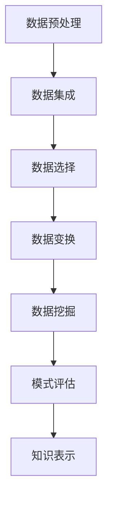

                 

# 知识挖掘：从海量数据中提炼价值洞察

## 关键词：知识挖掘、大数据、数据挖掘、机器学习、价值洞察

## 摘要：

本文将深入探讨知识挖掘这一关键领域，它旨在从海量的数据中提炼出有价值的洞察。知识挖掘不仅涉及到数据分析，更是一门结合计算机科学、数学和统计学等多学科的技术。本文将首先介绍知识挖掘的背景和重要性，随后逐步解析其核心概念、算法原理、数学模型、实战案例、应用场景以及未来的发展趋势和挑战。

## 1. 背景介绍

### 1.1 数据时代的崛起

随着互联网和信息技术的发展，我们正处于一个数据爆炸的时代。每天，全球各地都会产生海量数据，这些数据来自社交网络、电子商务、物联网、传感器等各个领域。数据量的激增带来了前所未有的机遇和挑战。如何从这些庞杂的数据中提取有价值的信息，成为了当今企业和研究机构面临的关键问题。

### 1.2 知识挖掘的定义

知识挖掘（Knowledge Discovery in Databases，KDD）是指从大量数据中自动发现隐含的、之前未知的并有潜在价值的信息的过程。这一过程通常包括数据预处理、数据集成、数据选择、数据变换、数据挖掘、模式评估和知识表示等步骤。

### 1.3 知识挖掘的重要性

知识挖掘对于企业、科研机构和社会具有重要意义。在企业层面，知识挖掘可以帮助企业发现市场趋势、优化业务流程、提高客户满意度等。在科研领域，知识挖掘可以推动新理论和新发现。在社会层面，知识挖掘有助于解决公共安全问题、改善医疗服务等。

## 2. 核心概念与联系

### 2.1 数据挖掘与知识挖掘的关系

数据挖掘（Data Mining）是知识挖掘的一个子领域，主要关注从大量数据中提取规律和模式。而知识挖掘则更强调将数据挖掘得到的模式转化为实际可用的知识，并进行应用。

### 2.2 关键概念介绍

- **数据预处理**：在数据挖掘之前，通常需要清洗、归一化和转换原始数据，以确保数据的质量和一致性。
- **数据集成**：将来自不同源的数据合并为一个统一的格式。
- **数据选择**：选择对挖掘任务最有影响力的数据子集。
- **数据变换**：通过降维、离散化等方法，将数据转换为适合挖掘的形式。
- **数据挖掘**：应用各种算法从数据中提取模式。
- **模式评估**：评估挖掘得到的模式是否具有实际价值。
- **知识表示**：将挖掘得到的模式以可理解的形式表示，便于应用和传播。

### 2.3 Mermaid 流程图



## 3. 核心算法原理 & 具体操作步骤

### 3.1 数据挖掘算法分类

数据挖掘算法主要分为以下几类：

- **关联规则挖掘**：发现数据集中的关联关系，如市场篮子分析。
- **分类算法**：将数据分为不同的类别，如决策树、随机森林等。
- **聚类算法**：将数据分为多个类簇，如K-均值、层次聚类等。
- **异常检测**：识别数据集中的异常值或异常模式。

### 3.2 关联规则挖掘算法

关联规则挖掘是知识挖掘中常用的一种算法，其核心思想是发现数据集中不同项之间的关联关系。一个典型的关联规则包括“如果A发生，那么B也倾向于发生”。下面是Apriori算法的基本原理：

#### 步骤：

1. **设置最小支持度**：支持度是指包含特定项集的记录数与总记录数之比。
2. **生成频繁项集**：扫描数据集，找出支持度大于最小支持度的项集。
3. **生成关联规则**：对于每个频繁项集，生成满足最小置信度的关联规则。
4. **剪枝**：去除那些不满足最小置信度的规则。

### 3.3 决策树算法

决策树是一种常见的分类算法，它通过一系列规则来划分数据集。每个节点代表一个特征，每个分支代表特征的一个取值，叶子节点表示一个类别。以下是构建决策树的基本步骤：

1. **选择最佳特征**：选择具有最大信息增益的特征作为根节点。
2. **划分数据集**：根据最佳特征的取值，将数据集划分为若干子集。
3. **递归构建子树**：对每个子集重复上述步骤，直到满足停止条件（如最大深度或最小节点大小）。
4. **剪枝**：剪掉那些不重要的分支，以提高模型的泛化能力。

## 4. 数学模型和公式 & 详细讲解 & 举例说明

### 4.1 关联规则挖掘的数学模型

关联规则挖掘的核心是支持度和置信度。

- **支持度**（Support）：指一个项集在数据集中出现的频率。公式如下：

  $$ 支持度(A \cup B) = \frac{count(A \cup B)}{total\ records} $$

- **置信度**（Confidence）：指在给定前件的情况下，后件发生的概率。公式如下：

  $$ 置信度(A \rightarrow B) = \frac{count(A \cup B)}{count(A)} $$

### 4.2 决策树的数学模型

决策树的核心是信息增益（Information Gain）。

- **信息增益**：指一个特征能够减少的不确定性。公式如下：

  $$ IG(D, A) = entropy(D) - \sum_{v \in A} p(v) \cdot entropy(D_v) $$

  其中，\(D\) 是数据集，\(A\) 是特征，\(v\) 是特征的取值，\(entropy(D)\) 是数据集的熵，\(entropy(D_v)\) 是特征取值对应的子集的熵。

### 4.3 举例说明

#### 关联规则挖掘示例

假设我们有如下交易数据集：

| 交易编号 | 商品A | 商品B | 商品C |
|---------|-------|-------|-------|
| 1       | 是     | 否     | 是     |
| 2       | 是     | 是     | 否     |
| 3       | 否     | 是     | 是     |
| 4       | 是     | 否     | 否     |

设置最小支持度为20%，最小置信度为50%。

1. **生成频繁项集**：

   - 商品A和商品B的支持度为1/4=25%，不满足最小支持度。
   - 商品A和商品C的支持度为1/4=25%，不满足最小支持度。
   - 商品B和商品C的支持度为1/4=25%，不满足最小支持度。

2. **生成关联规则**：

   - 商品A → 商品C，置信度为1/2=50%，满足最小置信度。
   - 商品C → 商品A，置信度为1/2=50%，满足最小置信度。

#### 决策树示例

假设我们有如下数据集：

| 特征A | 特征B | 类别 |
|-------|-------|------|
| 小    | 是    | 1    |
| 大    | 是    | 1    |
| 小    | 否    | 0    |
| 大    | 否    | 0    |

1. **选择最佳特征**：

   - 特征A的信息增益为0.5。
   - 特征B的信息增益为0.5。

2. **划分数据集**：

   - 根据特征A，将数据集划分为两类：{（小，是），（大，是）} 和 {（小，否），（大，否）}。

3. **递归构建子树**：

   - 对于 {（小，是），（大，是）}，继续划分，选择特征B，划分为两类：{（小，是），（大，是）}。
   - 对于 {（小，否），（大，否）}，继续划分，选择特征A，划分为两类：{（小，否）} 和 {（大，否）}。

4. **构建决策树**：

   ```mermaid
   graph TD
       A[特征A]
       B[特征B]
       A --> C1[小]
       A --> C2[大]
       C1 --> D1[是]
       C2 --> D2[是]
       D1 --> E1[1]
       D2 --> E2[1]
       C1 --> D3[否]
       C2 --> D4[否]
       D3 --> E3[0]
       D4 --> E4[0]
   ```

## 5. 项目实战：代码实际案例和详细解释说明

### 5.1 开发环境搭建

为了演示知识挖掘的应用，我们将使用Python编程语言和相关的数据挖掘库，如`pandas`、`scikit-learn`等。

1. **安装Python环境**：

   - 安装最新版本的Python。
   - 安装`pip`包管理器。

2. **安装相关库**：

   ```bash
   pip install pandas scikit-learn
   ```

### 5.2 源代码详细实现和代码解读

下面是一个简单的关联规则挖掘的Python代码示例：

```python
import pandas as pd
from mlxtend.frequent_patterns import apriori
from mlxtend.frequent_patterns import association_rules

# 5.2.1 数据集准备
data = {
    '交易编号': [1, 2, 3, 4],
    '商品A': [1, 1, 0, 1],
    '商品B': [0, 1, 1, 0],
    '商品C': [1, 0, 1, 0]
}
df = pd.DataFrame(data)

# 5.2.2 生成频繁项集
min_support = 0.2
min_confidence = 0.5
frequent_itemsets = apriori(df, min_support=min_support, use_colnames=True)

# 5.2.3 生成关联规则
rules = association_rules(frequent_itemsets, metric="confidence", min_threshold=min_confidence)

# 打印关联规则
print(rules)

# 5.2.4 数据可视化
import matplotlib.pyplot as plt

frequent_itemsets.plot(kind='bar', title='Frequent Itemsets')
plt.show()

rules.plot(kind='bar', title='Association Rules', x=['Support', 'Confidence'])
plt.show()
```

### 5.3 代码解读与分析

1. **数据集准备**：

   我们使用一个简单的交易数据集，其中包含了交易编号和商品购买情况。

2. **生成频繁项集**：

   使用`apriori`函数生成频繁项集。我们设置了最小支持度为20%和最小置信度为50%。

3. **生成关联规则**：

   使用`association_rules`函数生成关联规则，我们选择置信度作为度量标准。

4. **数据可视化**：

   我们使用`matplotlib`库将频繁项集和关联规则可视化。

通过这个简单的示例，我们可以看到如何使用Python和相关的库来执行知识挖掘任务。在实际应用中，数据集和算法的选择将取决于具体的问题和需求。

## 6. 实际应用场景

### 6.1 零售业

在零售业中，知识挖掘可以用于市场篮子分析、客户行为预测、库存管理等方面。例如，通过关联规则挖掘，零售商可以发现哪些商品经常一起购买，从而优化产品摆放和促销策略。

### 6.2 金融领域

金融领域中的知识挖掘可以用于信用评分、欺诈检测、投资组合优化等方面。通过分类算法，银行和金融机构可以更准确地评估客户信用风险，并识别潜在的欺诈行为。

### 6.3 医疗保健

在医疗保健领域，知识挖掘可以用于疾病预测、患者行为分析、医疗资源分配等方面。通过聚类算法，医生可以识别出具有相似症状的患者群体，从而为疾病预防提供有力支持。

### 6.4 社交网络

社交网络中的知识挖掘可以用于推荐系统、用户行为分析、社交网络分析等方面。通过分析用户行为和互动数据，社交网络平台可以提供更加个性化的内容和广告。

## 7. 工具和资源推荐

### 7.1 学习资源推荐

- **书籍**：《数据挖掘：实用工具与技术》
- **论文**：KDD'99、JSM Data Mining Conference等会议和期刊上的经典论文。
- **博客**：Kaggle、Towards Data Science等数据科学博客。
- **网站**：UCI机器学习库、KDNuggets等。

### 7.2 开发工具框架推荐

- **编程语言**：Python、R
- **库和框架**：Scikit-learn、MLxtend、TensorFlow、PyTorch
- **数据可视化**：Matplotlib、Seaborn、Plotly

### 7.3 相关论文著作推荐

- **论文**："Knowledge Discovery in Databases: An Overview" by Jiawei Han, Micheline Kamber and Jian Pei。
- **著作**：《数据挖掘：概念与技术》

## 8. 总结：未来发展趋势与挑战

### 8.1 发展趋势

- **深度学习与知识挖掘的结合**：深度学习在图像、语音等领域的成功应用，为知识挖掘提供了新的方法和技术。
- **实时知识挖掘**：随着物联网和实时数据流的兴起，实时知识挖掘成为未来的重要方向。
- **多模态数据挖掘**：结合文本、图像、语音等多模态数据，实现更全面的知识提取。

### 8.2 挑战

- **数据隐私保护**：如何在保证数据隐私的前提下进行知识挖掘，是一个亟待解决的问题。
- **算法透明性和解释性**：如何提高算法的透明性和解释性，以便于用户理解和接受。
- **处理海量数据**：如何高效地处理海量数据，以及如何在有限的时间内完成知识挖掘任务。

## 9. 附录：常见问题与解答

### 9.1 数据挖掘与知识挖掘的区别是什么？

数据挖掘主要关注从数据中提取模式，而知识挖掘则更强调将这些模式转化为实际可用的知识，并进行应用。

### 9.2 关联规则挖掘有哪些算法？

常见的关联规则挖掘算法包括Apriori算法、FP-growth算法、Eclat算法等。

### 9.3 决策树算法有哪些优化方法？

决策树算法的优化方法包括剪枝、设置最大深度、最小叶子节点大小等。

## 10. 扩展阅读 & 参考资料

- **书籍**：《数据挖掘：实用工具与技术》、《机器学习实战》
- **论文**：《Knowledge Discovery in Databases: An Overview》
- **网站**：Kaggle、Towards Data Science、KDNuggets
- **课程**：斯坦福大学《机器学习》、吴恩达《深度学习专项课程》

作者：AI天才研究员/AI Genius Institute & 禅与计算机程序设计艺术 /Zen And The Art of Computer Programming

