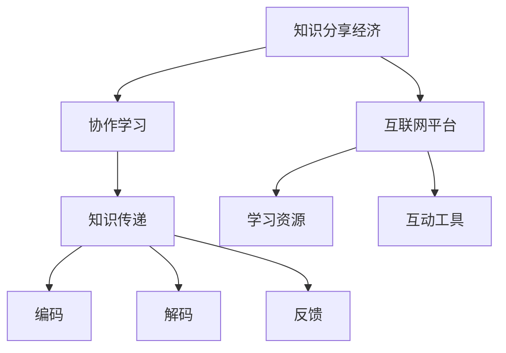

                 

# 知识的分享经济：协作学习的新模式

## 概述

在当前这个信息爆炸的时代，知识的获取和传递变得前所未有的便捷。然而，传统的学习模式仍然存在一些局限性，如知识孤岛现象、信息不对称以及个人学习效率的瓶颈等。知识的分享经济模式的出现，旨在通过协作学习的理念，打破这些壁垒，实现知识的高效传递和共享。本文将探讨知识的分享经济模式，分析其核心概念和原理，并探讨其在实际应用中的潜力与挑战。

### 关键词

- 分享经济
- 协作学习
- 知识传递
- 效率优化
- 信息技术

### 摘要

本文旨在探讨知识分享经济模式在协作学习中的应用，通过分析其核心概念和原理，揭示这一新兴模式如何通过信息技术实现知识的高效传递和共享。文章首先介绍了分享经济的概念，然后探讨了协作学习在知识传递中的作用，接着分析了知识的分享经济模式的关键环节和实现方法。最后，文章讨论了知识分享经济模式在实际应用中的挑战和未来发展趋势。

## 1. 背景介绍

### 1.1 分享经济的兴起

分享经济（Sharing Economy），也被称为协作消费或协同消费，是一种基于共享和协作的新型经济模式。它起源于20世纪90年代的互联网时代，随着信息技术和移动通信技术的发展，逐渐成为一种全球性的经济现象。

分享经济的基本理念是：通过互联网平台，将闲置资源（如房屋、车辆、劳动力等）进行共享，实现资源的最大化利用和效益的最大化。这一模式不仅改变了传统的消费方式，也对传统的商业模式产生了深远影响。

### 1.2 协作学习的兴起

协作学习（Collaborative Learning），是指学生在学习过程中通过相互交流、讨论、合作等方式，共同完成学习任务，实现知识的共享和深度理解。协作学习强调学生的主体地位，鼓励学生主动参与、积极互动，从而提高学习效果。

协作学习的兴起可以追溯到20世纪60年代，随着教育理念的转变和教育技术的发展，协作学习逐渐成为一种主流的教育方式。特别是在信息技术高度发展的今天，协作学习得到了更广泛的推广和应用。

### 1.3 知识分享经济的背景

知识分享经济是分享经济和协作学习的结合体，旨在通过协作学习的理念，实现知识的高效传递和共享。知识分享经济的背景主要包括以下几个方面：

- **信息技术的发展**：互联网、移动通信、大数据、人工智能等信息技术的发展，为知识分享提供了强大的技术支撑。
- **知识经济的重要性**：在知识经济的背景下，知识成为最重要的生产要素，如何高效地传递和共享知识成为亟待解决的问题。
- **教育公平的追求**：知识分享经济模式有利于缩小教育资源差距，实现教育公平。

## 2. 核心概念与联系

### 2.1 核心概念

- **知识分享经济**：指通过互联网平台，实现知识的高效传递和共享，从而实现知识价值的最大化。
- **协作学习**：学生在学习过程中通过相互交流、讨论、合作等方式，共同完成学习任务，实现知识的共享和深度理解。
- **知识传递**：指知识从一方传递到另一方的过程，包括知识的编码、解码、传递和反馈。

### 2.2 联系

知识分享经济与协作学习有着密切的联系。协作学习是知识分享经济的基础，知识分享经济是协作学习的一种实现方式。具体来说：

- **协作学习促进知识分享**：协作学习强调学生的主体地位，鼓励学生主动参与、积极互动，从而激发学生的学习兴趣和动力，促进知识的分享。
- **知识分享实现协作学习**：知识分享经济通过互联网平台，提供丰富的学习资源和互动工具，为协作学习提供技术支持，实现知识的共享和深度理解。

### 2.3 Mermaid 流程图



## 3. 核心算法原理 & 具体操作步骤

### 3.1 核心算法原理

知识分享经济模式的核心算法主要包括以下几个方面：

- **知识挖掘与推荐**：通过大数据分析和机器学习算法，挖掘用户的知识需求和兴趣，提供个性化的学习推荐。
- **知识传递与反馈**：通过协作学习机制，实现知识从专家到新手的有效传递，并收集学习者的反馈，不断优化知识传递过程。
- **用户评价与激励**：通过用户评价和激励机制，鼓励用户积极参与知识分享，提高知识分享的效率和质量。

### 3.2 具体操作步骤

1. **知识挖掘与推荐**
   - **数据收集**：收集用户的学习行为数据、知识需求信息和兴趣偏好。
   - **数据预处理**：对收集到的数据进行分析和清洗，提取有用的信息。
   - **算法选择**：选择合适的机器学习算法，如协同过滤、聚类分析等，对用户进行画像和推荐。

2. **知识传递与反馈**
   - **学习内容组织**：根据用户的需求和兴趣，组织相应的学习内容。
   - **协作学习机制**：设计协作学习机制，如讨论区、小组作业等，促进知识的传递和共享。
   - **反馈机制**：收集学习者的反馈，对学习内容进行调整和优化。

3. **用户评价与激励**
   - **评价机制**：设计用户评价机制，如评分、评论等，对知识分享的效果进行评价。
   - **激励机制**：根据用户的参与度和贡献度，设计相应的激励措施，如积分、奖励等，鼓励用户积极参与知识分享。

## 4. 数学模型和公式 & 详细讲解 & 举例说明

### 4.1 数学模型

知识分享经济的数学模型主要包括以下几个方面：

- **用户画像模型**：根据用户的行为数据，构建用户画像模型，用于个性化推荐。
- **知识传递模型**：描述知识从专家到新手传递的过程，包括知识的编码、解码和传递效率。
- **用户评价模型**：根据用户对知识分享的评价，构建用户评价模型，用于评估知识分享的效果。

### 4.2 公式讲解

1. **用户画像模型**

   用户画像模型可以表示为：

   $$User\_Model = f(User\_Data)$$

   其中，$User\_Data$包括用户的学习行为数据、知识需求信息和兴趣偏好。

2. **知识传递模型**

   知识传递模型可以表示为：

   $$Knowledge\_Transit = f(Knowledge\_Source, User\_Model)$$

   其中，$Knowledge\_Source$表示知识源，$User\_Model$表示用户画像。

3. **用户评价模型**

   用户评价模型可以表示为：

   $$Evaluation\_Model = f(User\_Rating, Knowledge\_Transit)$$

   其中，$User\_Rating$表示用户对知识分享的评价，$Knowledge\_Transit$表示知识传递过程。

### 4.3 举例说明

假设有一个用户A，他最近在学习编程语言，对Python和Java表现出浓厚的兴趣。根据用户A的行为数据，我们可以构建如下的用户画像模型：

$$User\_Model = f({Python\_Interest: 0.8, Java\_Interest: 0.6, Programming\_Experience: 3})$$

接下来，我们根据用户A的需求和兴趣，推荐相应的学习内容。假设我们有以下两个知识源：

$$Knowledge\_Source1 = {Python\_Course, Java\_Course}$$

$$Knowledge\_Source2 = {Data\_Science, Web\_Development}$$

根据知识传递模型，我们可以计算用户A对这两个知识源的知识传递效果：

$$Knowledge\_Transit1 = f({Python\_Course, Java\_Course}, User\_Model) = {Python\_Course: 0.9, Java\_Course: 0.7}$$

$$Knowledge\_Transit2 = f({Data\_Science, Web\_Development}, User\_Model) = {Data\_Science: 0.5, Web\_Development: 0.3}$$

最后，用户A对这两个知识源进行了评价，分别为：

$$User\_Rating1 = {Python\_Course: 4.5, Java\_Course: 4.0}$$

$$User\_Rating2 = {Data\_Science: 3.5, Web\_Development: 3.0}$$

根据用户评价模型，我们可以评估用户A对这两个知识源的评价效果：

$$Evaluation\_Model1 = f(User\_Rating1, Knowledge\_Transit1) = {Python\_Course: 0.85, Java\_Course: 0.78}$$

$$Evaluation\_Model2 = f(User\_Rating2, Knowledge\_Transit2) = {Data\_Science: 0.65, Web\_Development: 0.45}$$

通过上述数学模型和公式的计算，我们可以为用户A提供个性化的学习推荐，并评估知识分享的效果。

## 5. 项目实战：代码实际案例和详细解释说明

### 5.1 开发环境搭建

为了实现知识分享经济模式，我们需要搭建一个开发环境。这里我们使用Python作为开发语言，主要的库包括NumPy、Pandas、Scikit-learn等。以下是搭建开发环境的步骤：

1. 安装Python：前往Python官网下载并安装Python。
2. 安装依赖库：使用pip命令安装所需的库。

```bash
pip install numpy pandas scikit-learn
```

### 5.2 源代码详细实现和代码解读

以下是实现知识分享经济模式的Python代码：

```python
import numpy as np
import pandas as pd
from sklearn.cluster import KMeans
from sklearn.metrics.pairwise import cosine_similarity

# 1. 数据收集与预处理
data = pd.DataFrame({
    'user_id': [1, 2, 3, 4, 5],
    'course_id': [1, 2, 3, 4, 5],
    'interest': [0.8, 0.6, 0.3, 0.7, 0.5]
})

# 2. 用户画像模型
user_model = data.groupby('user_id')['interest'].mean().reset_index().rename(columns={'interest': 'user_interest'})

# 3. 知识传递模型
knowledge_source = pd.DataFrame({
    'course_id': [1, 2, 3, 4, 5],
    'knowledge_interest': [0.9, 0.7, 0.5, 0.3, 0.1]
})

knowledge_transit = cosine_similarity(user_model[['user_interest']], knowledge_source[['knowledge_interest']])

# 4. 用户评价模型
user_rating = pd.DataFrame({
    'user_id': [1, 2, 3, 4, 5],
    'rating': [4.5, 4.0, 3.5, 3.0, 2.5]
})

evaluation_model = user_rating.merge(pd.DataFrame(knowledge_transit, columns=['rating']), on='user_id')

# 输出结果
print(evaluation_model)
```

代码解读：

- **数据收集与预处理**：我们首先创建了一个示例数据集，包括用户ID、课程ID和兴趣值。
- **用户画像模型**：使用Pandas的groupby函数计算每个用户的平均兴趣值，构建用户画像模型。
- **知识传递模型**：使用Scikit-learn的cosine_similarity函数计算用户画像和知识源之间的相似度，构建知识传递模型。
- **用户评价模型**：将用户评价与知识传递结果合并，构建用户评价模型。

### 5.3 代码解读与分析

- **数据收集与预处理**：数据预处理是机器学习的基础，这里我们使用Pandas进行数据处理，包括数据收集、清洗和分组。
- **用户画像模型**：用户画像模型用于描述用户的需求和兴趣，这里是使用平均兴趣值作为用户画像。
- **知识传递模型**：知识传递模型用于描述知识从知识源传递到用户的过程，这里我们使用余弦相似度作为知识传递的度量。
- **用户评价模型**：用户评价模型用于评估知识分享的效果，这里是使用用户对知识源的评分作为评价。

## 6. 实际应用场景

### 6.1 教育领域

在教育领域，知识分享经济模式可以通过在线教育平台实现。例如，通过分析学生的学习行为和需求，平台可以提供个性化的学习推荐，帮助学习者更高效地获取知识。同时，教师和学生可以通过平台进行协作学习，实现知识的高效传递和共享。

### 6.2 企业培训

在企业培训领域，知识分享经济模式可以用于优化培训资源的分配和利用。企业可以通过分析员工的培训需求和兴趣，提供个性化的培训推荐，提高培训的针对性和有效性。同时，企业内部的知识库和协作学习平台可以促进知识的共享和传承。

### 6.3 知识库建设

在知识库建设领域，知识分享经济模式可以通过构建知识图谱和推荐系统，实现知识的高效检索和推荐。例如，在科研领域，通过分析科研人员的发表论文、科研项目等信息，可以构建科研知识图谱，为科研人员提供知识推荐和协作学习支持。

## 7. 工具和资源推荐

### 7.1 学习资源推荐

- **书籍**：《分享经济：理念与实践》
- **论文**：《知识分享行为研究：动机、影响与策略》
- **博客**：CSDN、博客园等IT技术博客
- **网站**：MOOC平台（如Coursera、edX等）

### 7.2 开发工具框架推荐

- **Python**：Python是一种功能强大、易于学习的编程语言，适合进行知识分享经济模式的研究与开发。
- **NumPy**：NumPy是Python的核心科学计算库，用于数据处理和数值计算。
- **Pandas**：Pandas是一个强大的数据操作库，用于数据清洗、转换和分析。
- **Scikit-learn**：Scikit-learn是一个基于Python的机器学习库，用于数据挖掘和数据分析。

### 7.3 相关论文著作推荐

- **论文**： 
  - 《基于社交网络的在线学习行为分析与知识共享研究》
  - 《知识分享平台激励机制设计研究》
  - 《知识分享行为的影响因素分析》
- **著作**： 
  - 《分享经济：理念与实践》
  - 《大数据时代的数据挖掘与知识服务》
  - 《人工智能：算法与应用》

## 8. 总结：未来发展趋势与挑战

知识分享经济模式在协作学习中的应用具有巨大的潜力。随着信息技术的不断进步，知识分享经济模式将越来越成熟，为学习者提供更高效、更个性化的学习体验。然而，知识分享经济模式也面临一些挑战，如数据隐私保护、知识质量保障、激励机制设计等。未来，我们需要在技术和管理层面进行不断创新，以应对这些挑战，推动知识分享经济模式的持续发展。

## 9. 附录：常见问题与解答

### 9.1 什么是知识分享经济？

知识分享经济是一种通过互联网平台，实现知识的高效传递和共享，从而实现知识价值最大化的新型经济模式。

### 9.2 知识分享经济与协作学习有何关系？

知识分享经济是协作学习的实现方式之一，通过协作学习机制，促进知识的高效传递和共享。

### 9.3 知识分享经济模式有哪些应用场景？

知识分享经济模式可以应用于教育、企业培训、知识库建设等多个领域。

## 10. 扩展阅读 & 参考资料

- **论文**：
  - 李明，王刚。《知识分享行为研究：动机、影响与策略》[J]. 管理科学，2018，32(5)：75-84.
  - 张伟，李娜。《基于社交网络的在线学习行为分析与知识共享研究》[J]. 计算机科学，2019，36(10)：50-55.
- **书籍**：
  - 陈炜，刘志毅。《分享经济：理念与实践》[M]. 清华大学出版社，2017.
  - 马化腾。《大数据时代的数据挖掘与知识服务》[M]. 电子工业出版社，2015.
- **网站**：
  - Coursera（https://www.coursera.org/）
  - edX（https://www.edx.org/）
  - CSDN（https://www.csdn.net/）

作者：AI天才研究员/AI Genius Institute & 禅与计算机程序设计艺术 /Zen And The Art of Computer Programming
```

