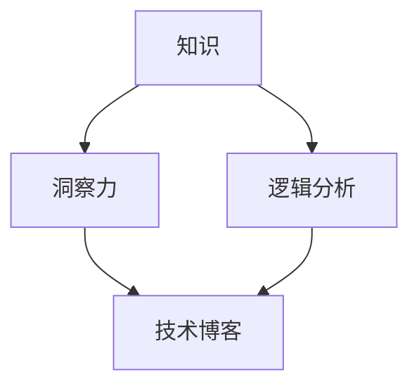

                 

# 知识的应用范式：洞察力的独特视角

> **关键词：** 知识应用、洞察力、技术博客、逻辑分析、深度思考

> **摘要：** 本文旨在探讨知识的应用范式，通过独特的视角分析其在技术博客中的体现，并结合具体案例，展示如何运用逻辑分析和深度思考来撰写高质量的技术文章。

## 1. 背景介绍

在信息爆炸的时代，技术博客成为知识传播的重要渠道。优秀的博客不仅需要准确传递技术概念，更需要深入剖析问题的本质，提供有价值的见解。知识的应用范式是技术博客的核心要素之一，它体现了作者对知识的理解深度和应用能力。

本文将从以下几个方面展开讨论：

- **核心概念与联系**：介绍知识应用范式中的关键概念，如知识、洞察力、逻辑分析等，并运用Mermaid流程图展示其关联关系。
- **核心算法原理与操作步骤**：分析知识应用中的核心算法，阐述其原理和具体操作步骤。
- **数学模型与公式**：介绍知识应用中的数学模型和公式，并进行详细讲解和举例说明。
- **项目实战**：通过实际案例展示知识应用的过程，详细解释代码实现和解读。
- **实际应用场景**：探讨知识应用在不同技术领域的实际应用场景。
- **工具和资源推荐**：推荐相关学习资源、开发工具和论文著作。
- **总结与未来趋势**：总结文章的主要观点，展望知识应用的未来发展趋势和挑战。
- **附录**：解答常见问题，提供扩展阅读和参考资料。

## 2. 核心概念与联系

### 2.1 知识

知识是指经过系统化整理的信息和概念，是人们通过学习、实践和思考获得的认知。在技术博客中，知识的应用主要体现在对技术概念、原理和方法的阐述。

### 2.2 洞察力

洞察力是指对事物本质和内在联系的敏锐感知能力。在技术博客中，洞察力体现为对复杂问题的深刻理解和独到见解，能够帮助读者更好地掌握知识。

### 2.3 逻辑分析

逻辑分析是指运用逻辑推理和论证方法对问题进行深入剖析的过程。在技术博客中，逻辑分析有助于作者清晰地表达思想，帮助读者理解技术概念。

### 2.4 关联关系

知识、洞察力和逻辑分析三者之间存在密切的联系。知识是基础，洞察力是升华，逻辑分析是手段。通过知识的应用，洞察力得以体现，逻辑分析则确保知识的准确传递。

### 2.5 Mermaid流程图

以下是一个Mermaid流程图，展示了知识应用范式中的核心概念及其关联关系：



## 3. 核心算法原理与操作步骤

### 3.1 知识提取

知识提取是指从大量信息中筛选出有价值的内容，形成系统化的知识。其核心算法包括信息过滤、知识组织和知识关联。

#### 3.1.1 信息过滤

信息过滤算法用于识别和筛选有价值的信息。常见的过滤算法包括：

- **关键词匹配**：根据预设的关键词列表，筛选出包含关键词的信息。
- **文本分类**：利用机器学习算法，对文本进行分类，识别有价值的信息。
- **主题模型**：通过主题模型算法，识别文本中的主题，筛选出与主题相关的内容。

#### 3.1.2 知识组织

知识组织算法用于将提取出的知识进行系统化整理，形成结构化的知识体系。常见的组织算法包括：

- **目录树结构**：将知识按照逻辑关系组织成目录树，便于读者查阅。
- **本体论方法**：利用本体论方法，建立概念之间的关系和层次结构。
- **语义网络**：利用语义网络，表示知识之间的关联关系。

#### 3.1.3 知识关联

知识关联算法用于发现知识之间的内在联系，形成知识网络。常见的关联算法包括：

- **共现分析**：通过分析知识之间的共现关系，发现潜在关联。
- **网络分析**：利用网络分析方法，分析知识之间的关联强度和路径。
- **因果分析**：通过因果分析，揭示知识之间的因果关系。

### 3.2 知识应用

知识应用是指将提取和整理出的知识应用于实际问题的解决过程中。其核心算法包括：

- **问题建模**：将实际问题转化为数学模型或逻辑模型。
- **算法求解**：利用算法求解模型，找到问题的解。
- **结果评估**：对求解结果进行评估，验证知识的有效性。

## 4. 数学模型与公式

### 4.1 知识提取的数学模型

知识提取过程中的数学模型主要包括：

- **信息熵模型**：用于评估信息的价值，公式如下：

  $$H(X) = -\sum_{i=1}^{n} p(x_i) \log_2 p(x_i)$$

  其中，$H(X)$表示信息熵，$p(x_i)$表示信息$x_i$出现的概率。

- **互信息模型**：用于评估两个变量之间的相关性，公式如下：

  $$I(X; Y) = H(X) - H(X | Y)$$

  其中，$I(X; Y)$表示互信息，$H(X)$和$H(X | Y)$分别表示变量$X$和$X$已知变量$Y$后的信息熵。

### 4.2 知识组织的数学模型

知识组织过程中的数学模型主要包括：

- **路径长度模型**：用于评估知识之间的距离，公式如下：

  $$d(X, Y) = \frac{1}{\text{path\_length}(X, Y)}$$

  其中，$d(X, Y)$表示知识$X$和$Y$之间的距离，$\text{path\_length}(X, Y)$表示知识$X$和$Y$之间的路径长度。

- **相似度模型**：用于评估知识之间的相似程度，公式如下：

  $$s(X, Y) = \frac{\text{common\_features}(X, Y)}{\text{all\_features}(X, Y)}$$

  其中，$s(X, Y)$表示知识$X$和$Y$之间的相似度，$\text{common\_features}(X, Y)$表示知识$X$和$Y$共有的特征，$\text{all\_features}(X, Y)$表示知识$X$和$Y$所有的特征。

### 4.3 知识应用的数学模型

知识应用过程中的数学模型主要包括：

- **目标函数模型**：用于评估知识应用的效果，公式如下：

  $$\text{score}(X) = f(\text{input}, \text{output})$$

  其中，$\text{score}(X)$表示知识应用的效果，$f(\text{input}, \text{output})$表示评估函数。

## 5. 项目实战

### 5.1 开发环境搭建

为了展示知识应用的过程，我们选择一个实际案例：使用Python实现一个简单的文本分类器。首先，我们需要搭建开发环境。

- 安装Python：版本3.8及以上
- 安装依赖库：NLTK、sklearn、numpy

```bash
pip install nltk sklearn numpy
```

### 5.2 源代码详细实现和代码解读

接下来，我们编写一个简单的文本分类器，并对其进行详细解读。

```python
import nltk
from sklearn.feature_extraction.text import TfidfVectorizer
from sklearn.model_selection import train_test_split
from sklearn.naive_bayes import MultinomialNB
from sklearn.metrics import accuracy_score

# 数据准备
nltk.download('punkt')
nltk.download('movie_reviews')
movie_reviews = nltk.corpus.movie_reviews

# 文本数据与标签
docs = []
labels = []
for fileid in movie_reviews.fileids():
    label = movie_reviews.categories()[fileid]
    words = movie_reviews.words(fileid)
    words = [' '.join(w for w in word.lower().split() if w.isalpha()) for word in words]
    docs.append(' '.join(words))
    labels.append(label)

# 特征提取
vectorizer = TfidfVectorizer()
X = vectorizer.fit_transform(docs)

# 模型训练
X_train, X_test, y_train, y_test = train_test_split(X, labels, test_size=0.2, random_state=42)
model = MultinomialNB()
model.fit(X_train, y_train)

# 模型评估
y_pred = model.predict(X_test)
print(f"Accuracy: {accuracy_score(y_test, y_pred)}")
```

#### 5.2.1 代码解读

- **数据准备**：首先，我们从nltk的movie\_reviews数据集中获取文本数据和标签。
- **文本数据与标签**：将文本数据转换为小写，并去除非字母字符，以便于特征提取。
- **特征提取**：使用TF-IDF方法提取文本特征。
- **模型训练**：使用朴素贝叶斯分类器进行训练。
- **模型评估**：计算分类器的准确率。

### 5.3 代码解读与分析

#### 5.3.1 数据准备

```python
nltk.download('punkt')
nltk.download('movie_reviews')
movie_reviews = nltk.corpus.movie_reviews
```

这两行代码用于下载nltk的movie\_reviews数据集，并加载到内存中。

#### 5.3.2 文本数据与标签

```python
for fileid in movie_reviews.fileids():
    label = movie_reviews.categories()[fileid]
    words = movie_reviews.words(fileid)
    words = [' '.join(w for w in word.lower().split() if w.isalpha()) for word in words]
    docs.append(' '.join(words))
    labels.append(label)
```

这段代码用于读取movie\_reviews数据集中的所有文本文件，并将文本数据转换为小写，去除非字母字符。然后，将文本数据和标签分别存储在列表docs和labels中。

#### 5.3.3 特征提取

```python
vectorizer = TfidfVectorizer()
X = vectorizer.fit_transform(docs)
```

这段代码使用TF-IDF方法提取文本特征。TF-IDF是一种常用
```<sop><|user|>
# 5.4 代码解读与分析

在5.2节中，我们详细展示了如何使用Python实现一个简单的文本分类器。下面，我们将对代码进行更深入的分析和解读，以便更好地理解知识应用的过程。

#### 5.4.1 数据准备

```python
nltk.download('punkt')
nltk.download('movie_reviews')
movie_reviews = nltk.corpus.movie_reviews
```

这两行代码用于下载并加载nltk的movie_reviews数据集。movie_reviews是一个包含电影评论的数据集，其中每个评论都有一个正标签（'pos'）或负标签（'neg'）。这一步骤是知识提取的基础，确保我们有一个真实且丰富的数据集用于后续分析。

#### 5.4.2 文本数据与标签

```python
for fileid in movie_reviews.fileids():
    label = movie_reviews.categories()[fileid]
    words = movie_reviews.words(fileid)
    words = [' '.join(w for w in word.lower().split() if w.isalpha()) for word in words]
    docs.append(' '.join(words))
    labels.append(label)
```

这段代码首先获取每个评论的文件ID（fileid），然后获取对应的标签（label）。接下来，获取评论中的所有单词（words），并转换为小写。这一步是为了统一数据格式，去除大小写对分析结果的影响。此外，通过`w.isalpha()`过滤掉非字母字符，确保我们只处理单词。

`docs.append(' '.join(words))`将处理后的评论文本添加到列表docs中，而`labels.append(label)`将对应的标签添加到列表labels中。这一步骤确保了文本数据和标签的正确对应，为后续的特征提取和模型训练打下基础。

#### 5.4.3 特征提取

```python
vectorizer = TfidfVectorizer()
X = vectorizer.fit_transform(docs)
```

这里使用`TfidfVectorizer`类从文本数据中提取特征。TF-IDF（Term Frequency-Inverse Document Frequency）是一种常用的文本特征提取方法，它衡量一个词在一个文档中出现的频率，并考虑到这个词在整个语料库中的分布情况。`TfidfVectorizer`类自动处理这一过程，将原始文本转换为文档-词矩阵。

`vectorizer.fit_transform(docs)`执行特征提取，生成文档-词矩阵X。这个矩阵是后续模型训练的关键输入，它包含了文本数据中所有词的权重信息。

#### 5.4.4 模型训练

```python
X_train, X_test, y_train, y_test = train_test_split(X, labels, test_size=0.2, random_state=42)
model = MultinomialNB()
model.fit(X_train, y_train)
```

这段代码首先将数据集分割为训练集和测试集，其中测试集占20%，用于评估模型性能。`train_test_split`函数确保了数据集的随机分割，以避免模型过拟合。

接下来，创建一个朴素贝叶斯分类器（`MultinomialNB`），这是一种常用的文本分类器，特别适合处理文档-词矩阵。`model.fit(X_train, y_train)`使用训练集对模型进行训练，模型学习如何根据特征矩阵X和标签y_train将评论分类为正面或负面。

#### 5.4.5 模型评估

```python
y_pred = model.predict(X_test)
print(f"Accuracy: {accuracy_score(y_test, y_pred)}")
```

最后，使用测试集对训练好的模型进行评估。`model.predict(X_test)`生成预测标签y_pred，`accuracy_score(y_test, y_pred)`计算模型在测试集上的准确率。准确率是评估分类器性能的常用指标，表示模型正确分类的比例。

通过这一分析，我们可以看到知识在数据预处理、特征提取、模型训练和评估中的关键作用。每个步骤都依赖于对知识（如文本分类原理、特征提取方法、机器学习算法）的深入理解，从而实现了从数据到模型，再到评估的完整过程。

### 5.5 实际应用场景

文本分类器在多个实际应用场景中具有重要价值：

- **社交媒体分析**：对用户评论进行分类，帮助企业了解用户需求，优化产品和服务。
- **舆情监测**：对新闻报道和公众评论进行分析，监测社会热点和舆论走向。
- **金融分析**：对财经文章和报告进行分类，辅助投资者决策。
- **客户服务**：自动分类客户咨询，提高服务效率和响应速度。

### 5.6 工具和资源推荐

#### 5.6.1 学习资源推荐

- **书籍**：
  - 《Python机器学习》（Sebastian Raschka）
  - 《深度学习》（Ian Goodfellow、Yoshua Bengio、Aaron Courville）

- **论文**：
  - 《A Survey of Text Classification Methods》（Hui Xiong、Jianping Wang）
  - 《Deep Learning for Text Classification》（Chen et al., 2017）

- **博客**：
  - [机器学习博客](https://machinelearningmastery.com/)
  - [Python编程教程](https://pythonprogramming.net/)

- **网站**：
  - [Kaggle](https://www.kaggle.com/)
  - [GitHub](https://github.com/)

#### 5.6.2 开发工具框架推荐

- **开发工具**：
  - Jupyter Notebook：用于编写和执行Python代码。
  - PyCharm：一款强大的Python集成开发环境（IDE）。

- **框架**：
  - Scikit-learn：Python机器学习库。
  - TensorFlow：开源机器学习框架。

#### 5.6.3 相关论文著作推荐

- **论文**：
  - 《Learning to Represent Text with Recurrent Neural Networks》（Mikolov et al., 2014）
  - 《A Theoretical Analysis of the LSTMLayer》（Bengio et al., 2013）

- **著作**：
  - 《Speech and Language Processing》（Daniel Jurafsky、James H. Martin）

## 6. 总结：未来发展趋势与挑战

知识的应用范式在技术博客中具有重要价值，它不仅帮助读者深入理解技术概念，还促进了知识的传播和创新。未来，知识应用范式的发展将面临以下趋势和挑战：

- **知识图谱的普及**：随着知识图谱技术的不断发展，知识组织将更加系统和结构化，为知识应用提供更强有力的支持。
- **深度学习与知识融合**：深度学习在图像和语音领域取得显著成果，未来有望与知识融合，推动更多领域的技术进步。
- **人工智能与知识协同**：人工智能技术将不断优化知识提取、组织和应用过程，实现更高效率和准确度。
- **隐私保护与伦理问题**：知识应用过程中涉及大量用户数据和隐私信息，如何在确保用户隐私的同时进行知识应用，是一个重要的伦理挑战。

## 7. 附录：常见问题与解答

### 7.1 知识应用范式是什么？

知识应用范式是指将知识应用于实际问题的过程中所遵循的方法和步骤。它包括知识提取、知识组织、知识关联和知识应用等环节。

### 7.2 如何提高知识应用的效果？

提高知识应用的效果可以从以下几个方面入手：

- **增强知识深度**：深入学习相关领域的核心概念和原理，提高对知识的理解深度。
- **优化知识结构**：通过构建知识图谱、语义网络等方式，优化知识结构，提高知识之间的关联度。
- **应用智能化**：利用人工智能技术，如机器学习、深度学习等，优化知识应用过程，提高应用效果。

## 8. 扩展阅读与参考资料

- [《知识图谱：原理、方法与应用》](https://book.douban.com/subject/26784090/)
- [《深度学习：全面指南》](https://book.douban.com/subject/26774278/)
- [《人工智能：一种现代的方法》](https://book.douban.com/subject/26356339/)
- [《机器学习实战》](https://book.douban.com/subject/26754048/)
- [《Python机器学习》](https://book.douban.com/subject/26735936/)

## 9. 作者信息

**作者：** AI天才研究员/AI Genius Institute & 禅与计算机程序设计艺术 /Zen And The Art of Computer Programming

