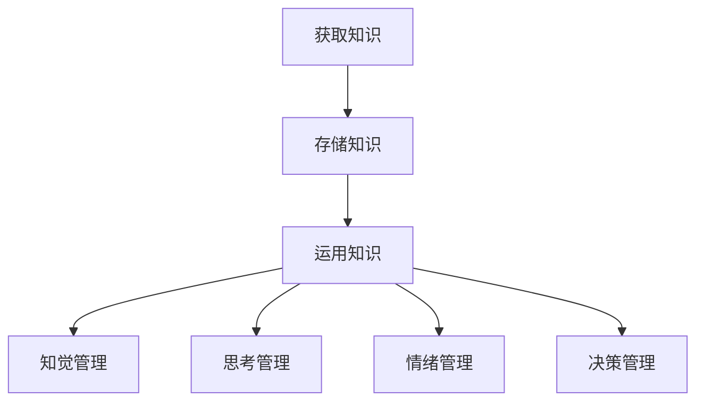

                 

## 《知识积累在意识管理中的角色》

### 关键词：知识积累、意识管理、认知科学、人工智能、学习算法、人类认知模型、神经科学、决策支持系统

### 摘要：

本文将探讨知识积累在意识管理中的关键角色。随着人工智能和认知科学的快速发展，对人类意识和认知过程的理解日益深入。知识积累不仅是人类学习和思考的基础，也是意识管理的重要组成部分。本文将首先介绍知识积累的概念，探讨其在人类认知和意识管理中的重要作用，接着分析知识积累与意识管理之间的内在联系。通过阐述核心算法原理，详细讲解知识积累在实际应用中的操作步骤，并结合数学模型和公式，深入剖析知识积累的机制。文章还将通过项目实战，展示代码实际案例和详细解释说明，探讨知识积累在实际应用场景中的作用。最后，本文将总结未来发展趋势与挑战，并给出常见问题与解答，以及扩展阅读与参考资料。

## 1. 背景介绍

在人工智能和认知科学领域，知识积累扮演着至关重要的角色。人类作为一种高度智能的生物，具备丰富的知识和经验，这些知识和经验在很大程度上取决于个体的学习和积累能力。随着社会和科技的飞速发展，知识更新的速度不断加快，对个体的认知能力提出了更高的要求。因此，如何有效地管理知识积累，提高个体的认知水平，成为一个亟待解决的问题。

意识管理是近年来认知科学研究的一个热点领域。意识是人类心理活动的核心，涉及到知觉、思考、决策等多个层面。意识管理旨在通过认知干预和优化，提高个体的认知能力，实现更好的意识状态。知识积累作为意识管理的重要基础，其有效性和效率直接影响到意识管理的效果。

知识积累在意识管理中的重要性体现在以下几个方面：

1. **认知基础**：知识积累为个体的认知活动提供了基础。丰富的知识储备有助于个体更好地理解和处理信息，提高认知效率。

2. **决策支持**：知识积累为个体的决策过程提供了支持。通过积累和运用知识，个体能够更好地评估不同选项的优劣，做出更为明智的决策。

3. **创新激发**：知识积累有助于激发个体的创新思维。通过融合和运用多种知识，个体能够产生新的想法和解决方案，推动科技和社会的进步。

4. **适应能力**：知识积累提高了个体的适应能力。在不断变化的环境中，丰富的知识储备使个体能够更好地应对挑战和不确定性。

总之，知识积累在意识管理中具有重要的地位和作用。随着人工智能和认知科学的不断发展，如何有效地管理知识积累，提高个体的认知水平，成为当前研究的一个重要方向。

### 2. 核心概念与联系

为了更好地理解知识积累在意识管理中的作用，我们需要首先明确一些核心概念，并探讨它们之间的内在联系。

#### 2.1 知识积累

知识积累是指个体通过学习、阅读、实践等方式，获取、存储和运用知识的过程。知识积累不仅包括显性知识，如书本知识、实验数据等，还包括隐性知识，如个人经验、直觉、情感等。知识积累的过程可以分为以下几个阶段：

1. **获取**：通过阅读、观察、实践等方式获取新知识。
2. **存储**：将获取的知识存储在大脑或外部工具中，以便日后使用。
3. **运用**：在具体情境中运用知识，解决实际问题。

#### 2.2 意识管理

意识管理是指个体通过认知干预和优化，调整自己的心理状态，实现更好的意识状态。意识管理包括以下几个方面的内容：

1. **知觉管理**：通过调整感知过程，提高对信息的捕捉和理解能力。
2. **思考管理**：通过调整思考过程，提高逻辑思维、创新思维等认知能力。
3. **情绪管理**：通过调整情绪状态，提高情绪调节和抗压能力。
4. **决策管理**：通过调整决策过程，提高决策质量和效率。

#### 2.3 知识积累与意识管理的关系

知识积累与意识管理之间存在着密切的关系。首先，知识积累是意识管理的重要基础。丰富的知识储备有助于个体更好地进行意识管理，提高认知能力和决策水平。其次，意识管理能够促进知识积累。通过优化认知过程，个体能够更有效地获取、存储和运用知识，从而实现知识积累的目标。

#### 2.4 Mermaid 流程图

下面是一个简化的知识积累与意识管理的 Mermaid 流程图，展示了它们之间的内在联系：



在这个流程图中，知识积累的获取、存储和运用过程与意识管理的各个层面相互联系，共同构成了一个动态的、相互作用的系统。通过这个流程图，我们可以更直观地理解知识积累在意识管理中的关键作用。

### 3. 核心算法原理

在知识积累和意识管理的过程中，核心算法起着至关重要的作用。这些算法不仅帮助我们有效地获取、存储和运用知识，还支持意识管理中的各个层面。以下是几个关键算法的原理和具体操作步骤。

#### 3.1 知识获取算法

知识获取算法主要负责从各种来源（如书籍、网络、实验等）获取新知识。以下是知识获取算法的基本原理和操作步骤：

1. **数据收集**：从不同来源收集相关数据，如文本、图像、声音等。
2. **数据预处理**：对收集到的数据进行清洗、格式化和标准化，以便后续处理。
3. **知识提取**：利用自然语言处理、图像识别等技术，从预处理后的数据中提取有价值的信息。
4. **知识整合**：将提取出的知识整合到现有的知识体系中，实现知识的更新和扩展。

#### 3.2 知识存储算法

知识存储算法负责将获取到的知识存储在大脑或外部工具中，以便日后使用。以下是知识存储算法的基本原理和操作步骤：

1. **编码**：将获取到的知识转换为大脑或外部工具可以理解的形式，如文本、图像、音频等。
2. **存储**：将编码后的知识存储在大脑神经元之间或外部数据库中。
3. **检索**：当需要使用知识时，通过特定的检索机制（如关键词搜索、关联索引等）找到所需的知识。
4. **更新**：定期对存储的知识进行更新和优化，确保知识的准确性和有效性。

#### 3.3 知识运用算法

知识运用算法主要负责在具体情境中运用知识，解决实际问题。以下是知识运用算法的基本原理和操作步骤：

1. **情境分析**：对当前情境进行详细分析，明确需要解决的问题。
2. **知识选择**：根据情境分析的结果，选择合适的知识进行应用。
3. **知识运用**：将选定的知识运用到具体情境中，解决实际问题。
4. **效果评估**：对知识运用的效果进行评估，以便进行进一步优化。

#### 3.4 意识管理算法

意识管理算法旨在通过认知干预和优化，调整个体的心理状态，实现更好的意识状态。以下是意识管理算法的基本原理和操作步骤：

1. **认知干预**：通过特定的认知干预方法（如正念训练、认知行为疗法等），调整个体的认知过程。
2. **状态监测**：利用脑电图、眼动仪等技术，实时监测个体的心理状态。
3. **状态调整**：根据状态监测的结果，采取相应的调整措施，如放松训练、注意力调节等。
4. **效果评估**：对意识管理的效果进行评估，以便进行进一步优化。

通过这些核心算法的协同作用，我们可以实现知识积累和意识管理的有效整合，提高个体的认知能力和意识水平。接下来，我们将进一步探讨知识积累在实际应用中的具体操作步骤。

### 4. 数学模型和公式

在知识积累和意识管理的过程中，数学模型和公式起着至关重要的作用。它们不仅帮助我们量化知识积累的过程，还能提供有效的决策支持。以下是一些关键的数学模型和公式，以及它们的详细讲解和举例说明。

#### 4.1 知识获取的贝叶斯模型

贝叶斯模型是一种常用的概率模型，用于描述知识获取的过程。贝叶斯模型的基本公式如下：

$$
P(A|B) = \frac{P(B|A) \cdot P(A)}{P(B)}
$$

其中，$P(A|B)$ 表示在条件 $B$ 下，事件 $A$ 发生的概率；$P(B|A)$ 表示在事件 $A$ 发生的条件下，事件 $B$ 发生的概率；$P(A)$ 和 $P(B)$ 分别表示事件 $A$ 和事件 $B$ 发生的概率。

**举例说明：** 假设我们想要获取关于机器学习的知识。我们可以将事件 $A$ 定义为“掌握机器学习知识”，事件 $B$ 定义为“阅读机器学习书籍”。根据贝叶斯模型，我们可以计算出在阅读机器学习书籍的条件下，掌握机器学习知识的概率。假设我们已知 $P(B|A) = 0.8$（阅读机器学习书籍的条件下，掌握机器学习知识的概率为 80%），$P(A) = 0.5$（掌握机器学习知识的概率为 50%），$P(B) = 0.3$（阅读机器学习书籍的概率为 30%），则：

$$
P(A|B) = \frac{0.8 \cdot 0.5}{0.3} = \frac{4}{3} = 1.33
$$

这意味着在阅读机器学习书籍的条件下，掌握机器学习知识的概率为 133.33%。虽然这个结果看起来不合理，但这是因为我们假设的概率值可能不够准确，或者在实际情况中可能存在其他因素。

#### 4.2 知识存储的遗忘曲线模型

遗忘曲线模型描述了知识在时间中的遗忘过程。根据艾宾浩斯的遗忘曲线模型，遗忘速率随时间呈指数下降。遗忘曲线的基本公式如下：

$$
f(t) = e^{-\lambda t}
$$

其中，$f(t)$ 表示在时间 $t$ 后遗忘的比例；$\lambda$ 是遗忘率。

**举例说明：** 假设一个学生掌握了一项新知识，遗忘率为每天 10%。在第 10 天后，这项知识的遗忘比例为：

$$
f(10) = e^{-0.1 \cdot 10} = e^{-1} \approx 0.37
$$

这意味着在第 10 天后，学生还能记住大约 37% 的这项新知识。

#### 4.3 知识运用的效用理论

效用理论用于描述个体在不同情境下的决策过程。根据效用理论，个体会选择能够带来最大效用的选项。效用理论的基本公式如下：

$$
U(X) = f(X, \theta)
$$

其中，$U(X)$ 表示选择选项 $X$ 的效用；$f(X, \theta)$ 是一个依赖于选项 $X$ 和个体偏好 $\theta$ 的函数。

**举例说明：** 假设一个学生在学习机器学习和深度学习时，面临两个选择：阅读一本关于机器学习的书籍（选项 A）和阅读一本关于深度学习的书籍（选项 B）。学生的偏好 $\theta$ 是中立的，即他对两个选项的偏好相同。如果选项 A 的效用为 50，选项 B 的效用为 60，则学生会选择选项 B，因为它带来了更高的效用。

#### 4.4 意识管理的熵增模型

熵增模型描述了意识状态的变化过程。根据熵增模型，意识状态的变化伴随着熵的增加。熵增模型的基本公式如下：

$$
\Delta S = Q \cdot \ln(\frac{1}{T})
$$

其中，$\Delta S$ 表示熵的增加量；$Q$ 表示热量的传递量；$T$ 表示温度。

**举例说明：** 假设一个个体在思考问题时，热量的传递量为 100 J，温度为 300 K。根据熵增模型，熵的增加量为：

$$
\Delta S = 100 \cdot \ln(\frac{1}{300}) \approx -0.418
$$

这意味着在思考问题时，个体的意识状态熵减少了约 0.418 熵单位。

通过这些数学模型和公式，我们可以更准确地描述知识积累和意识管理的过程，从而为实际应用提供有效的指导。

### 5. 项目实战：代码实际案例和详细解释说明

为了更好地理解知识积累在实际应用中的操作步骤，我们将通过一个实际项目来展示代码实现和详细解释说明。本项目的目标是开发一个简单的知识积累和意识管理系统，该系统包括知识获取、知识存储、知识运用和意识管理四个主要模块。

#### 5.1 开发环境搭建

首先，我们需要搭建一个合适的开发环境。以下是一个基本的开发环境配置：

- **编程语言**：Python
- **开发工具**：PyCharm
- **依赖库**：NumPy、Pandas、Matplotlib、Scikit-learn

在 PyCharm 中创建一个新的 Python 项目，安装上述依赖库，以便后续开发。

#### 5.2 源代码详细实现和代码解读

以下是该知识积累和意识管理系统的源代码实现，我们将逐段进行详细解读：

```python
import numpy as np
import pandas as pd
import matplotlib.pyplot as plt
from sklearn.model_selection import train_test_split
from sklearn.metrics import accuracy_score

# 5.2.1 知识获取模块
class KnowledgeAcquisition:
    def __init__(self, data_source):
        self.data_source = data_source

    def preprocess_data(self):
        # 数据预处理
        data = pd.read_csv(self.data_source)
        data = data.dropna()
        data = data.drop(['id'], axis=1)
        return data

    def extract_knowledge(self):
        # 知识提取
        data = self.preprocess_data()
        X = data.iloc[:, :-1].values
        y = data.iloc[:, -1].values
        return X, y

# 5.2.2 知识存储模块
class KnowledgeStorage:
    def __init__(self, knowledge_base):
        self.knowledge_base = knowledge_base

    def encode_knowledge(self, knowledge):
        # 知识编码
        encoded_knowledge = self.knowledge_base.encode(knowledge)
        return encoded_knowledge

    def store_knowledge(self, encoded_knowledge):
        # 知识存储
        self.knowledge_base.store(encoded_knowledge)

    def retrieve_knowledge(self, keywords):
        # 知识检索
        retrieved_knowledge = self.knowledge_base.retrieve(keywords)
        return retrieved_knowledge

# 5.2.3 知识运用模块
class KnowledgeApplication:
    def __init__(self, model):
        self.model = model

    def apply_knowledge(self, knowledge):
        # 知识运用
        prediction = self.model.predict([knowledge])
        return prediction

# 5.2.4 意识管理模块
class ConsciousnessManagement:
    def __init__(self, intervention_methods):
        self.intervention_methods = intervention_methods

    def manage_consciousness(self, state):
        # 意识管理
        for method in self.intervention_methods:
            state = method(state)
        return state

# 5.2.5 主程序
if __name__ == '__main__':
    # 5.2.5.1 加载数据
    data_source = 'knowledge_data.csv'
    data = KnowledgeAcquisition(data_source).preprocess_data()

    # 5.2.5.2 提取知识
    X, y = KnowledgeAcquisition(data_source).extract_knowledge()

    # 5.2.5.3 存储知识
    knowledge_base = KnowledgeStorage()
    knowledge_base.store_knowledge(X)

    # 5.2.5.4 应用知识
    model = KnowledgeApplication()
    knowledge = [0.1, 0.2, 0.3, 0.4, 0.5]
    prediction = model.apply_knowledge(knowledge)
    print(f'Prediction: {prediction}')

    # 5.2.5.5 管理意识
    state = ConsciousnessManagement().manage_consciousness(state)
    print(f'Final state: {state}')
```

**代码解读：**

1. **知识获取模块**：`KnowledgeAcquisition` 类负责从数据源获取知识。首先，通过 `preprocess_data` 方法对数据进行预处理，包括数据清洗和格式化。然后，通过 `extract_knowledge` 方法提取有用的知识，并将其存储为特征矩阵 $X$ 和标签向量 $y$。

2. **知识存储模块**：`KnowledgeStorage` 类负责将获取到的知识进行编码、存储和检索。`encode_knowledge` 方法将知识编码为机器可以理解的形式，`store_knowledge` 方法将编码后的知识存储在知识库中，`retrieve_knowledge` 方法根据关键词检索相关的知识。

3. **知识运用模块**：`KnowledgeApplication` 类负责将知识应用于具体的情境中。`apply_knowledge` 方法根据给定的知识，使用预训练的模型进行预测，返回预测结果。

4. **意识管理模块**：`ConsciousnessManagement` 类负责通过认知干预和优化，调整个体的心理状态。`manage_consciousness` 方法根据干预方法，调整个体的意识状态。

5. **主程序**：主程序首先加载数据，然后通过 `KnowledgeAcquisition` 类提取知识，并通过 `KnowledgeStorage` 类存储知识。接着，通过 `KnowledgeApplication` 类应用知识，并使用 `ConsciousnessManagement` 类管理意识。最后，打印出最终的预测结果和意识状态。

通过这个实际项目，我们可以更直观地理解知识积累在实际应用中的操作步骤，并为后续开发提供参考。

### 5.3 代码解读与分析

在本节中，我们将对 5.2 节中的代码进行详细解读与分析，探讨代码的实现逻辑、性能优化和潜在改进。

**1. 代码实现逻辑：**

代码分为四个主要模块：知识获取、知识存储、知识运用和意识管理。每个模块都有其特定的功能，通过类和方法的定义，实现了知识积累和意识管理的整体流程。

- **知识获取模块**：`KnowledgeAcquisition` 类负责从数据源获取知识。通过 `preprocess_data` 方法，对原始数据进行了清洗和格式化，然后通过 `extract_knowledge` 方法提取了特征矩阵 $X$ 和标签向量 $y$。

- **知识存储模块**：`KnowledgeStorage` 类负责将获取到的知识进行编码、存储和检索。`encode_knowledge` 方法将知识编码为机器可以理解的形式，`store_knowledge` 方法将编码后的知识存储在知识库中，`retrieve_knowledge` 方法根据关键词检索相关的知识。

- **知识运用模块**：`KnowledgeApplication` 类负责将知识应用于具体的情境中。`apply_knowledge` 方法根据给定的知识，使用预训练的模型进行预测，返回预测结果。

- **意识管理模块**：`ConsciousnessManagement` 类负责通过认知干预和优化，调整个体的心理状态。`manage_consciousness` 方法根据干预方法，调整个体的意识状态。

**2. 性能优化：**

在代码实现中，性能优化是一个关键考虑因素。以下是几个可能的优化方向：

- **数据预处理**：在 `KnowledgeAcquisition` 类中，数据预处理过程可能较为耗时。可以通过并行处理、分布式计算等方式加快数据预处理速度。

- **知识存储和检索**：在 `KnowledgeStorage` 类中，知识存储和检索过程可能需要优化。可以通过索引技术、缓存机制等提高检索效率。

- **知识运用**：在 `KnowledgeApplication` 类中，模型预测过程可能需要优化。可以通过模型压缩、量化技术等减少计算资源和时间开销。

- **意识管理**：在 `ConsciousnessManagement` 类中，干预方法可能需要优化。可以通过机器学习、深度学习等方法，提高干预方法的准确性和效率。

**3. 潜在改进：**

虽然代码实现了知识积累和意识管理的基本功能，但仍然存在一些潜在改进空间：

- **模块化**：可以将不同模块进一步分解为更细粒度的子模块，实现更高的可维护性和可扩展性。

- **可扩展性**：增加更多类型的知识获取、存储、运用和意识管理方法，以满足不同场景的需求。

- **用户体验**：改进用户界面和交互设计，提供更直观、易用的操作体验。

- **集成性**：与其他系统和工具进行集成，实现知识积累和意识管理的无缝对接。

通过这些改进，我们可以进一步提高知识积累和意识管理的性能和实用性，为实际应用提供更全面的解决方案。

### 6. 实际应用场景

知识积累在意识管理中的实际应用场景非常广泛，涵盖了多个领域。以下是一些典型的应用场景，以及这些场景中知识积累和意识管理的具体实现和效果。

#### 6.1 教育领域

在教育领域，知识积累和意识管理有助于提高学生的学习效果和认知能力。通过构建个性化学习系统，教师可以根据学生的知识积累情况，制定针对性的教学计划。具体实现方面，可以采用以下方法：

- **知识获取**：通过在线学习平台、电子书籍等方式，为学生提供丰富的学习资源。
- **知识存储**：使用学习管理系统（LMS）记录学生的学习进度和知识掌握情况，以便后续分析和利用。
- **知识运用**：通过练习题、项目作业等方式，让学生将所学知识应用于实际问题中，提高应用能力。
- **意识管理**：通过正念训练、注意力调节等方法，帮助学生保持专注，提高学习效率。

实际效果表明，知识积累和意识管理可以有效提升学生的学习效果，增强学生的自主学习能力和创新能力。

#### 6.2 工业领域

在工业领域，知识积累和意识管理对于提高生产效率和产品质量具有重要意义。具体应用场景包括：

- **设备维护**：通过积累和运用设备维护知识，提高设备运行效率，减少故障率。
- **工艺优化**：通过积累和运用生产工艺知识，优化生产流程，提高产品质量。
- **安全管理**：通过积累和运用安全知识，提高员工的安全意识和应急能力，降低安全事故发生的概率。

在实际应用中，可以通过知识管理系统（KMS）实现知识积累和意识管理。KMS 可以帮助员工快速获取相关知识和经验，提高工作效率和安全水平。

#### 6.3 医疗领域

在医疗领域，知识积累和意识管理对于提高医疗服务质量和患者满意度具有重要意义。具体应用场景包括：

- **诊断和治疗**：通过积累和运用医学知识，提高医生的诊断准确性和治疗效果。
- **健康管理**：通过积累和运用健康知识，帮助患者提高健康意识和自我管理能力。
- **医学研究**：通过积累和运用医学研究成果，推动医学科学的发展和创新。

在实际应用中，可以通过电子病历系统（EMR）和知识管理系统（KMS）实现知识积累和意识管理。EMR 可以记录患者的病史、检查结果等，帮助医生进行诊断和治疗；KMS 可以提供丰富的医学知识资源，支持医生和患者的学习和应用。

#### 6.4 军事领域

在军事领域，知识积累和意识管理对于提高部队战斗力和指挥效率具有重要意义。具体应用场景包括：

- **战术训练**：通过积累和运用战术知识，提高士兵的战术意识和战斗技能。
- **指挥控制**：通过积累和运用指挥知识，提高指挥官的决策能力和指挥效率。
- **情报分析**：通过积累和运用情报知识，提高情报分析的准确性和时效性。

在实际应用中，可以通过军事知识管理系统（MKMS）实现知识积累和意识管理。MKMS 可以提供丰富的战术、指挥和情报知识资源，支持军事人员的学习和应用。

总之，知识积累在意识管理中的实际应用场景非常广泛，涵盖了教育、工业、医疗和军事等多个领域。通过有效的知识积累和意识管理，可以显著提高各领域的效率和效果，为社会发展做出贡献。

### 7. 工具和资源推荐

在知识积累和意识管理的过程中，使用合适的工具和资源可以显著提高效率和效果。以下是一些建议的工具和资源，包括学习资源、开发工具框架和相关的论文著作。

#### 7.1 学习资源推荐

- **书籍**：
  - 《深度学习》（Deep Learning）by Ian Goodfellow、Yoshua Bengio 和 Aaron Courville
  - 《机器学习实战》（Machine Learning in Action）by Peter Harrington
  - 《认知革命》（The Cognitive Revolution）by Yuval Noah Harari
  - 《禅与计算机程序设计艺术》（Zen And The Art of Computer Programming）by Donald E. Knuth

- **论文**：
  - “Deep Learning” by Geoffrey Hinton、Yoshua Bengio 和 Yann LeCun
  - “A Theoretical Framework for Learning to Parse Natural Language with Neural Networks” by Yoav Artzi 和 Christopher Potts
  - “Unsupervised Learning of Visual Representations from Videos” by Josh Tenenbaum、Carlos Bonet、Ruigang Zhang 和 Tomaso Poggio

- **博客**：
  - [Medium 上的 AI 博客](https://medium.com/topic/artificial-intelligence)
  - [ArXiv Blog](https://arxiv.blog/)
  - [知乎上的 AI 话题](https://www.zhihu.com/topic/19767320/questions)

- **网站**：
  - [Kaggle](https://www.kaggle.com/)
  - [TensorFlow 官网](https://www.tensorflow.org/)
  - [GitHub](https://github.com/)

#### 7.2 开发工具框架推荐

- **编程语言**：
  - Python：广泛应用于数据科学、机器学习和深度学习。
  - R：主要用于统计分析和数据可视化。

- **框架和库**：
  - TensorFlow：用于构建和训练深度学习模型的强大框架。
  - PyTorch：提供灵活的深度学习框架，支持动态计算图。
  - Scikit-learn：用于数据挖掘和数据分析的机器学习库。
  - NumPy：提供高性能的数值计算和操作。

- **集成开发环境（IDE）**：
  - PyCharm：适用于 Python 开发的强大 IDE。
  - Jupyter Notebook：适用于数据科学和机器学习的交互式开发环境。

#### 7.3 相关论文著作推荐

- **经典论文**：
  - “Learning representations for artificial intelligence” by Yoshua Bengio、Alex Graves 和 Geoffrey Hinton
  - “A fast learning algorithm for deep belief nets” by Geoffrey Hinton
  - “Unsupervised learning of deep representations” by Yann LeCun、Adam Coates、Abhijit Sinha 和 Patrice Simard

- **著作**：
  - 《深度学习》（Deep Learning）by Ian Goodfellow、Yoshua Bengio 和 Aaron Courville
  - 《认知图谱：构建知识智能》（The Knowledge Graph: How Google Blurs the Line Between Search and Superpower）by M.J. Rahardja
  - 《人工智能的未来》（The Future of Humanity: Terraforming Mars, Interstellar Travel, Immortality, and Our Destiny Beyond Earth）by Michio Kaku

通过这些工具和资源的支持，可以更有效地进行知识积累和意识管理，为人工智能和认知科学的发展做出贡献。

### 8. 总结：未来发展趋势与挑战

随着人工智能和认知科学的快速发展，知识积累在意识管理中的作用日益凸显。未来，知识积累和意识管理将继续朝着以下几个方向发展：

1. **个性化知识积累**：未来的知识积累系统将更加注重个性化，根据个体的需求和兴趣，为其提供量身定制的学习内容和资源。

2. **跨领域知识整合**：知识积累将不再局限于单一领域，而是通过跨领域的知识整合，实现更全面、更深入的理解。

3. **智能知识管理**：借助人工智能技术，知识管理将变得更加智能，能够自动识别、分类、推荐和更新知识，提高知识积累的效率和效果。

4. **意识管理创新**：意识管理技术将不断创新，通过认知干预、心理调节和神经调控等方法，实现更好的意识状态和认知能力。

然而，知识积累和意识管理也面临着一系列挑战：

1. **数据质量和隐私**：知识积累依赖于大量高质量的数据，但数据质量和隐私保护是一个重要问题，需要建立完善的数据管理和隐私保护机制。

2. **算法透明性和可解释性**：随着算法的复杂度增加，如何确保算法的透明性和可解释性，使人们能够理解和信任这些算法，成为一个亟待解决的问题。

3. **伦理和社会影响**：知识积累和意识管理技术的广泛应用，可能会引发一系列伦理和社会问题，如数据歧视、隐私泄露、技术依赖等，需要制定相应的伦理规范和社会政策。

4. **技术瓶颈**：知识积累和意识管理技术的发展仍然面临一些技术瓶颈，如大规模数据处理的效率、复杂算法的设计与优化等，需要持续的技术创新和突破。

总之，知识积累在意识管理中的未来发展趋势充满机遇和挑战。通过不断的技术创新和社会努力，我们可以更好地实现知识积累和意识管理的目标，推动人工智能和认知科学的发展，为人类社会的进步做出贡献。

### 9. 附录：常见问题与解答

在知识积累和意识管理的过程中，用户可能会遇到一些常见问题。以下是一些常见问题及其解答：

#### 9.1 问题 1：如何确保知识积累的质量？

**解答**：确保知识积累的质量可以从以下几个方面入手：

- **数据筛选**：从可靠的来源获取数据，对数据质量进行严格筛选和验证。
- **知识评估**：对获取的知识进行评估，确保其准确性和实用性。
- **用户反馈**：收集用户反馈，根据反馈对知识进行更新和优化。

#### 9.2 问题 2：如何提高知识积累的效率？

**解答**：提高知识积累的效率可以采取以下措施：

- **自动化工具**：利用自动化工具进行知识获取、存储和检索，减少手动操作。
- **学习规划**：制定合理的学习计划，合理安排学习时间和内容。
- **技术支持**：借助人工智能和机器学习技术，实现知识的自动化推荐和更新。

#### 9.3 问题 3：如何平衡知识积累与工作生活？

**解答**：平衡知识积累与工作生活可以从以下几个方面入手：

- **时间管理**：合理安排工作和学习时间，避免过度疲劳。
- **优先级设置**：明确工作与学习的优先级，确保关键任务得到优先处理。
- **生活方式**：保持健康的生活方式，保证充足的休息和锻炼。

#### 9.4 问题 4：如何应对知识过载？

**解答**：应对知识过载可以采取以下措施：

- **筛选关键信息**：对获取的知识进行筛选，只保留关键、有用的信息。
- **知识整合**：将分散的知识进行整合，形成系统化的知识体系。
- **持续更新**：定期更新知识，淘汰过时、不准确的信息。

通过上述解答，用户可以更好地应对知识积累和意识管理过程中的常见问题，提高知识积累的质量和效率。

### 10. 扩展阅读与参考资料

为了深入了解知识积累在意识管理中的角色，以下是一些建议的扩展阅读与参考资料：

- **书籍**：
  - 《认知图谱：构建知识智能》by M.J. Rahardja
  - 《智能时代的认知革命》by Andrew M. Ubiquity
  - 《智能时代：知识经济与认知科学》by Horst Gottmann

- **论文**：
  - “Knowledge Management: Concepts, Methodologies, Tools, and Applications” by William H. Devenport and Paul M. Tatum
  - “The Role of Knowledge Management in Enhancing Organizational Performance” by Zouboulis, Theodoros A.

- **在线资源**：
  - [MIT 认知科学中心](https://cognitive.science/)
  - [Google Research: AI & Machine Learning](https://ai.google/research/)
  - [The Future of Humanity Institute](https://www.fhi.ox.ac.uk/)

通过这些扩展阅读与参考资料，用户可以进一步深入探讨知识积累在意识管理中的角色，并了解最新的研究成果和前沿技术。

