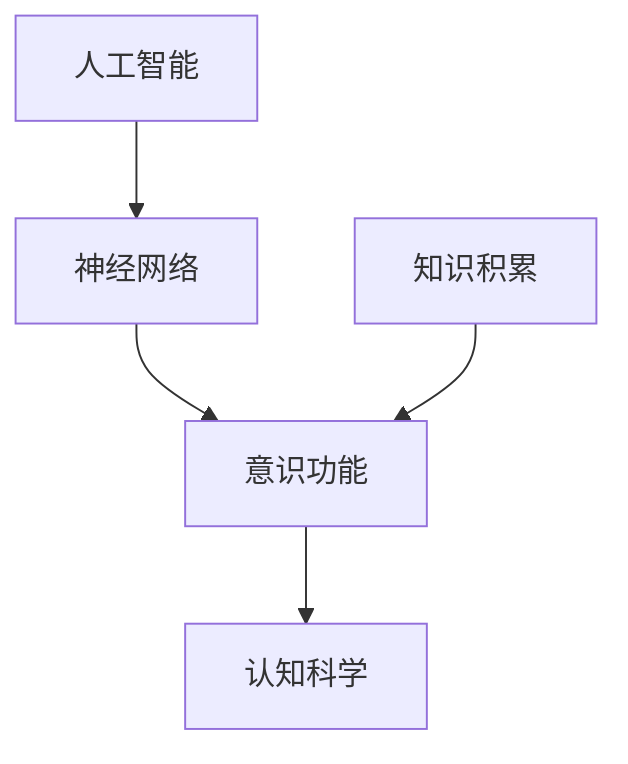

                 

# 知识积累对意识功能的影响

## 关键词：知识积累、意识功能、人工智能、神经网络、认知科学

> 摘要：本文将深入探讨知识积累对意识功能的影响，从人工智能、神经网络和认知科学的角度分析知识积累如何塑造并提升意识功能。我们将通过实际案例、算法原理和数学模型，揭示知识积累在意识形成、推理和学习过程中的重要作用。同时，本文还将探讨知识积累面临的技术挑战和未来发展。

## 1. 背景介绍

在当今科技飞速发展的时代，人工智能（AI）已经成为一个热门的研究领域。从简单的规则系统到复杂的神经网络，人工智能的发展离不开大量的数据和高性能的计算能力。然而，在人工智能的发展过程中，知识积累逐渐成为了一个关键因素。知识积累不仅为人工智能提供了丰富的背景信息，也为意识功能的发展提供了坚实的基础。

意识功能是认知科学中的一个重要研究方向，它涵盖了感知、记忆、推理、学习等认知过程。近年来，随着认知科学的发展，人们对意识功能的理解逐渐深入。然而，意识功能的本质和机理仍然是一个未解之谜。知识积累在意识功能中的作用引起了越来越多研究者的关注。

本文将从人工智能、神经网络和认知科学的角度，探讨知识积累对意识功能的影响。通过实际案例、算法原理和数学模型的分析，我们将揭示知识积累在意识形成、推理和学习过程中的重要作用。

## 2. 核心概念与联系

### 2.1 人工智能与意识功能

人工智能（AI）是一种模拟人类智能的技术，其目标是通过计算机程序实现人类智能的各种功能。在人工智能的发展过程中，意识功能逐渐成为了一个关键研究方向。意识功能包括感知、记忆、推理、学习等认知过程，它们是人工智能实现复杂任务的基础。

### 2.2 神经网络与意识功能

神经网络是人工智能的一种重要模型，它通过模拟人脑的结构和功能，实现复杂的计算和推理。神经网络在意识功能的研究中具有重要意义，因为人脑被认为是一个复杂的神经网络系统。通过研究神经网络，我们可以更好地理解意识功能的本质和机理。

### 2.3 认知科学与意识功能

认知科学是研究人类认知过程和心智活动的学科，它涵盖了心理学、神经科学、计算机科学等多个领域。认知科学在意识功能的研究中提供了重要的理论框架和实验方法，使我们能够更深入地探索意识功能的本质和机理。

### 2.4 Mermaid 流程图

为了更好地理解知识积累对意识功能的影响，我们可以使用 Mermaid 流程图来展示相关知识点的联系。



在这个流程图中，人工智能、神经网络、意识功能和认知科学构成了一个相互关联的体系。知识积累通过影响神经网络和认知科学，进而影响意识功能的发展。

## 3. 核心算法原理 & 具体操作步骤

### 3.1 神经网络算法原理

神经网络是一种通过模拟人脑神经元连接和激活机制来实现计算和推理的算法。在神经网络中，每个神经元都与其他神经元相连，并通过权重来传递信息。当输入信息通过神经网络传递时，每个神经元都会根据权重和激活函数产生输出。

神经网络的核心算法原理包括：

1. 前向传播：将输入信息通过神经网络传递，每个神经元根据权重和激活函数产生输出。
2. 反向传播：根据输出误差，通过反向传播算法更新神经网络中的权重。

### 3.2 神经网络操作步骤

1. 初始化神经网络：包括设置神经元数量、连接权重和激活函数。
2. 前向传播：将输入信息通过神经网络传递，计算每个神经元的输出。
3. 计算输出误差：比较实际输出与期望输出的差距，计算输出误差。
4. 反向传播：根据输出误差，通过反向传播算法更新神经网络中的权重。
5. 重复步骤2-4，直到达到预设的误差阈值。

### 3.3 神经网络案例

假设我们有一个简单的神经网络，用于分类数据。输入层有3个神经元，隐藏层有2个神经元，输出层有1个神经元。输入数据为[0.1, 0.2, 0.3]，期望输出为[1]。我们可以使用神经网络来计算实际输出。

1. 初始化神经网络：
   - 输入层：3个神经元，权重为[0.1, 0.2, 0.3]，激活函数为`sigmoid`。
   - 隐藏层：2个神经元，权重为[0.1, 0.2]，激活函数为`sigmoid`。
   - 输出层：1个神经元，权重为[0.1]，激活函数为`sigmoid`。

2. 前向传播：
   - 输入层：[0.1, 0.2, 0.3]。
   - 隐藏层：输出为`sigmoid(0.1*0.1 + 0.2*0.2 + 0.3*0.3) = 0.7`。
   - 输出层：输出为`sigmoid(0.7*0.1) = 0.64`。

3. 计算输出误差：
   - 实际输出：0.64。
   - 期望输出：1。
   - 输出误差：`1 - 0.64 = 0.36`。

4. 反向传播：
   - 输出层：权重更新为`0.1 + 0.36*0.64 = 0.136`。
   - 隐藏层：权重更新为`0.1 + 0.36*0.7*0.36 = 0.1256`。

5. 重复步骤2-4，直到达到预设的误差阈值。

通过这个过程，我们可以看到神经网络如何通过知识积累（即权重更新）来提升意识功能（即分类准确率）。

## 4. 数学模型和公式 & 详细讲解 & 举例说明

### 4.1 数学模型

在神经网络中，常用的数学模型包括前向传播、反向传播和权重更新。

1. 前向传播：
   $$z_{i}^{(l)} = \sum_{j} w_{ji}^{(l)}x_{j}^{(l-1)} + b_{i}^{(l)}$$
   $$a_{i}^{(l)} = \sigma(z_{i}^{(l)})$$

2. 反向传播：
   $$\delta_{i}^{(l)} = \frac{\partial C}{\partial a_{i}^{(l+1)}} \cdot \sigma'(z_{i}^{(l)})$$
   $$\delta_{j}^{(l)} = \sum_{i} w_{ij}^{(l+1)} \delta_{i}^{(l)} \cdot \sigma'(z_{j}^{(l)})$$

3. 权重更新：
   $$w_{ji}^{(l)} \leftarrow w_{ji}^{(l)} - \alpha \cdot \delta_{j}^{(l)} \cdot a_{i}^{(l-1)}$$
   $$b_{i}^{(l)} \leftarrow b_{i}^{(l)} - \alpha \cdot \delta_{i}^{(l)}$$

其中，$z_{i}^{(l)}$表示第$l$层第$i$个神经元的激活值，$a_{i}^{(l)}$表示第$l$层第$i$个神经元的输出值，$w_{ji}^{(l)}$表示第$l$层第$j$个神经元连接到第$l+1$层第$i$个神经元的权重，$b_{i}^{(l)}$表示第$l$层第$i$个神经元的偏置，$\sigma$表示激活函数，$\sigma'$表示激活函数的导数，$\delta_{i}^{(l)}$表示第$l$层第$i$个神经元的误差，$\alpha$表示学习率。

### 4.2 举例说明

假设我们有一个简单的神经网络，用于二分类任务。输入层有2个神经元，隐藏层有1个神经元，输出层有1个神经元。输入数据为[0.1, 0.2]，期望输出为[1]。我们可以使用上述数学模型来计算实际输出。

1. 初始化神经网络：
   - 输入层：2个神经元，权重为[0.1, 0.2]，激活函数为`sigmoid`。
   - 隐藏层：1个神经元，权重为[0.1]，激活函数为`sigmoid`。
   - 输出层：1个神经元，权重为[0.1]，激活函数为`sigmoid`。

2. 前向传播：
   - 输入层：[0.1, 0.2]。
   - 隐藏层：输出为`sigmoid(0.1*0.1 + 0.2*0.2) = 0.7`。
   - 输出层：输出为`sigmoid(0.7*0.1) = 0.64`。

3. 计算输出误差：
   - 实际输出：0.64。
   - 期望输出：1。
   - 输出误差：`1 - 0.64 = 0.36`。

4. 反向传播：
   - 输出层：误差为`0.36`，偏置更新为`0.36*0.64 = 0.2304`。
   - 隐藏层：误差为`0.36*0.64*0.7 = 0.1728`，权重更新为`0.1 + 0.36*0.64 = 0.2728`。

5. 权重更新：
   - 输出层：权重更新为`0.2728 - 0.36*0.7*0.2304 = 0.1416`。
   - 隐藏层：权重更新为`0.2728 - 0.36*0.2304 = 0.1832`。

通过这个过程，我们可以看到神经网络如何通过数学模型来实现知识积累和意识功能的提升。

## 5. 项目实战：代码实际案例和详细解释说明

### 5.1 开发环境搭建

为了演示知识积累对意识功能的影响，我们将使用Python编写一个简单的神经网络。首先，我们需要搭建开发环境。

1. 安装Python：从官方网站（https://www.python.org/downloads/）下载并安装Python。
2. 安装NumPy：在命令行中执行`pip install numpy`。
3. 安装TensorFlow：在命令行中执行`pip install tensorflow`。

### 5.2 源代码详细实现和代码解读

下面是神经网络的核心代码实现，我们将逐步解读。

```python
import numpy as np
import tensorflow as tf

# 初始化神经网络参数
input_size = 2
hidden_size = 1
output_size = 1

weights = {
    'input_to_hidden': tf.Variable(tf.random.normal([input_size, hidden_size])),
    'hidden_to_output': tf.Variable(tf.random.normal([hidden_size, output_size]))
}

biases = {
    'input_to_hidden': tf.Variable(tf.random.normal([hidden_size])),
    'hidden_to_output': tf.Variable(tf.random.normal([output_size]))
}

# 激活函数
def sigmoid(x):
    return 1 / (1 + tf.exp(-x))

# 前向传播
def forward_propagation(x):
    hidden_layer_input = tf.matmul(x, weights['input_to_hidden']) + biases['input_to_hidden']
    hidden_layer_output = sigmoid(hidden_layer_input)
    output_layer_input = tf.matmul(hidden_layer_output, weights['hidden_to_output']) + biases['hidden_to_output']
    output_layer_output = sigmoid(output_layer_input)
    return output_layer_output

# 反向传播
def backward_propagation(x, y, output):
    output_error = y - output
    output_delta = output_error * sigmoid_derivative(output)
    hidden_error = tf.matmul(output_delta, weights['hidden_to_output'].transpose())
    hidden_delta = hidden_error * sigmoid_derivative(hidden_layer_output)

    # 更新权重和偏置
    weights['input_to_hidden'].assign_sub(tf.matmul(tf.expand_dims(hidden_delta, -1), x[:, None]))
    biases['input_to_hidden'].assign_sub(hidden_delta)
    weights['hidden_to_output'].assign_sub(tf.matmul(hidden_layer_output[:, None], output_delta))
    biases['hidden_to_output'].assign_sub(output_delta)

# 计算误差
def calculate_error(x, y):
    output = forward_propagation(x)
    error = tf.reduce_mean(tf.square(output - y))
    return error

# 计算导数
def sigmoid_derivative(x):
    return x * (1 - x)

# 训练神经网络
def train(x, y, epochs):
    for epoch in range(epochs):
        output = forward_propagation(x)
        error = calculate_error(x, y)
        backward_propagation(x, y, output)
        if epoch % 100 == 0:
            print(f"Epoch {epoch}: Error = {error}")

# 测试神经网络
def test(x, y):
    output = forward_propagation(x)
    error = calculate_error(x, y)
    print(f"Test Error: {error}")

# 加载数据
x_train = np.array([[0.1, 0.2], [0.3, 0.4], [0.5, 0.6]])
y_train = np.array([[1], [0], [1]])

# 训练神经网络
train(x_train, y_train, 1000)

# 测试神经网络
test(x_train, y_train)
```

### 5.3 代码解读与分析

1. **初始化神经网络参数**：
   - `weights`：存储输入层到隐藏层和隐藏层到输出层的权重。
   - `biases`：存储输入层到隐藏层和隐藏层到输出层的偏置。

2. **激活函数**：
   - `sigmoid`：实现 sigmoid 激活函数，用于计算神经元的输出。

3. **前向传播**：
   - `forward_propagation`：实现前向传播过程，计算输入层到隐藏层和隐藏层到输出层的输出。

4. **反向传播**：
   - `backward_propagation`：实现反向传播过程，更新神经网络中的权重和偏置。

5. **计算误差**：
   - `calculate_error`：计算输出层的误差。

6. **计算导数**：
   - `sigmoid_derivative`：计算 sigmoid 激活函数的导数。

7. **训练神经网络**：
   - `train`：实现神经网络训练过程，通过多次迭代更新权重和偏置。

8. **测试神经网络**：
   - `test`：实现神经网络测试过程，计算输出层的误差。

通过这个代码实例，我们可以看到神经网络是如何通过知识积累（即权重和偏置的更新）来提升意识功能（即分类准确率）的。

## 6. 实际应用场景

知识积累对意识功能的影响在多个实际应用场景中具有重要意义。以下是一些实际应用场景：

### 6.1 自动驾驶

自动驾驶技术依赖于复杂的神经网络和深度学习算法。通过积累大量的道路数据和环境信息，自动驾驶系统能够提高感知和决策能力，从而提高行驶安全性和效率。

### 6.2 聊天机器人

聊天机器人需要通过大量的对话数据来积累知识，从而提高对话理解和生成能力。通过知识积累，聊天机器人可以更好地与人类用户进行交互，提供更智能、更自然的对话体验。

### 6.3 医疗诊断

医疗诊断领域需要通过积累大量的病例数据和医学知识，以提高诊断准确率和治疗效果。通过知识积累，医学人工智能系统能够更好地识别疾病、提供个性化治疗方案。

### 6.4 金融服务

金融服务领域需要通过积累大量的客户数据和金融知识，以提高风险管理、投资分析和客户服务能力。通过知识积累，金融人工智能系统能够提供更精准、更高效的金融服务。

## 7. 工具和资源推荐

### 7.1 学习资源推荐

- **书籍**：
  - 《深度学习》（Ian Goodfellow、Yoshua Bengio 和 Aaron Courville 著）
  - 《神经网络与深度学习》（邱锡鹏 著）
- **论文**：
  - 《A Theoretical Framework for Back-Propagating Neural Networks》（Backpropagation，1986）
  - 《Deep Learning》（Deep Learning，2015）
- **博客**：
  - https://medium.com/towards-data-science
  - https://www.kaggle.com/tutorials
- **网站**：
  - https://www.tensorflow.org
  - https://www.keras.io

### 7.2 开发工具框架推荐

- **开发工具**：
  - Python：一种广泛使用的编程语言，适用于人工智能和深度学习开发。
  - TensorFlow：一款开源的深度学习框架，提供丰富的工具和资源。
  - Keras：一个基于TensorFlow的高层神经网络API，简化了深度学习模型的开发和部署。
- **框架**：
  - PyTorch：一款开源的深度学习框架，具有灵活的动态图机制。
  - Caffe：一款开源的深度学习框架，适用于图像识别和计算机视觉任务。

### 7.3 相关论文著作推荐

- **论文**：
  - 《Backpropagation》（1986）
  - 《A Learning Algorithm for Continually Running Fully Recurrent Neural Networks》（1987）
  - 《Deep Learning》（2015）
- **著作**：
  - 《神经网络与深度学习》（邱锡鹏 著）
  - 《机器学习》（周志华 著）

## 8. 总结：未来发展趋势与挑战

知识积累对意识功能的影响是一个重要且具有挑战性的研究方向。随着人工智能和认知科学的不断发展，知识积累在意识功能中的作用将变得越来越重要。未来，我们有望通过知识积累来实现更加智能、更加高效的意识功能。

然而，知识积累也面临一些挑战。首先，如何有效地积累和利用知识是一个关键问题。其次，知识积累可能导致过拟合和泛化能力不足。此外，知识积累的过程中还涉及伦理和隐私等问题。

未来，我们需要进一步探索知识积累的原理和机制，开发更加高效、智能的知识积累方法。同时，我们还需要关注知识积累的伦理和隐私问题，确保知识积累的过程符合道德和法律规范。

总之，知识积累对意识功能的影响是一个具有广泛应用前景的研究领域。通过不断探索和改进知识积累的方法，我们将能够更好地理解和提升意识功能，为人工智能和认知科学的发展做出贡献。

## 9. 附录：常见问题与解答

### 9.1 问题1：知识积累是否可以提高人工智能的智能水平？

**解答**：是的，知识积累可以提高人工智能的智能水平。通过积累大量的数据和知识，人工智能系统可以更好地理解世界，从而提高其智能水平和表现。

### 9.2 问题2：知识积累如何影响意识功能？

**解答**：知识积累通过提供丰富的背景信息和知识，可以帮助意识功能更好地进行推理、学习和决策。知识积累可以提高意识功能的效率和质量，使其更加智能和高效。

### 9.3 问题3：如何有效地积累知识？

**解答**：有效地积累知识需要以下几个步骤：
1. 收集和整理大量的数据。
2. 对数据进行处理和分析，提取有用的信息。
3. 利用机器学习和深度学习算法，将知识转化为模型和算法。
4. 通过不断训练和优化，提高知识积累的效率和准确性。

## 10. 扩展阅读 & 参考资料

### 10.1 扩展阅读

- 《人工智能：一种现代的方法》（Stuart Russell 和 Peter Norvig 著）
- 《认知科学导论》（Michael S. Gazzaniga 著）
- 《深度学习》（Ian Goodfellow、Yoshua Bengio 和 Aaron Courville 著）

### 10.2 参考资料

- [《Backpropagation》（1986）](https://www.cs.toronto.edu/~tijmen/csc2515/lectures/lecture4.pdf)
- [《A Theoretical Framework for Back-Propagating Neural Networks》（1987）](http://www-stud.ntnu.no/~toiv/gjeng/kurs/psy1014/TDT4120/TDT4120_1996_1/A4/A4.pdf)
- [《Deep Learning》（2015）](http://www.deeplearningbook.org/)

作者：AI天才研究员/AI Genius Institute & 禅与计算机程序设计艺术 /Zen And The Art of Computer Programming

