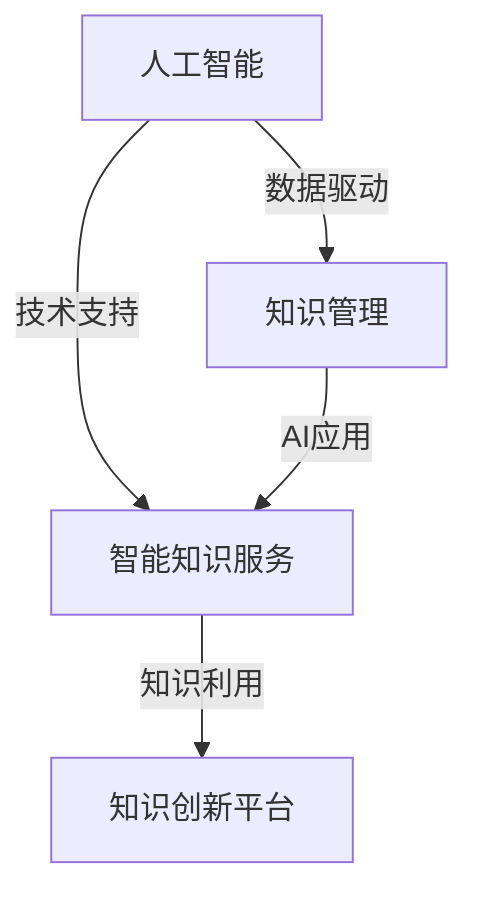

                 

### 背景介绍

知识管理（Knowledge Management，简称KM）是一种系统性方法，旨在识别、获取、共享和利用信息资源，以促进组织内部的知识创造和应用。随着信息技术的迅猛发展，知识管理逐渐向AI化方向演进，智能知识服务和知识创新平台成为了当前研究的热点。

**智能知识服务**指的是利用人工智能技术，如机器学习、自然语言处理和知识图谱等，对知识资源进行智能挖掘、分析和推荐，以满足用户个性化需求的服务。这种服务不仅提高了知识获取的效率，还提升了知识的利用价值。

**知识创新平台**则是一个集知识创造、存储、共享、使用和创新于一体的综合系统。它通过AI技术，实现对知识资源的自动化管理和智能化服务，推动组织知识的不断更新和迭代。

本文旨在探讨知识管理的AI化趋势，分析智能知识服务和知识创新平台的核心概念和架构，并探讨其在实际应用中的挑战与前景。

### 核心概念与联系

在讨论知识管理的AI化时，我们首先需要明确几个核心概念：人工智能（AI）、知识管理（KM）和智能知识服务（IKS）。以下是这些核心概念及其相互关系的Mermaid流程图：



**人工智能（AI）**：是一种模拟人类智能行为的技术，包括机器学习、深度学习、自然语言处理等子领域。AI技术为知识管理提供了强大的数据分析和处理能力。

**知识管理（KM）**：是一个系统的过程，旨在识别、获取、存储、共享和利用组织内的知识资源，以提高组织的竞争力和创新能力。

**智能知识服务（IKS）**：利用AI技术，对知识资源进行自动化挖掘、分析和推荐，以满足用户个性化需求的服务。

**知识创新平台**：是一个集知识创造、存储、共享、使用和创新于一体的系统，通过AI技术实现知识的自动化管理和智能化服务。

这些概念之间有着密切的联系：

- **人工智能与知识管理的联系**：AI技术为知识管理提供了数据分析和处理能力，使得知识获取、存储和共享更加高效。
- **智能知识服务与知识管理的联系**：IKS是知识管理的重要组成部分，它通过AI技术提升知识的利用价值，满足用户的个性化需求。
- **知识创新平台与智能知识服务的联系**：知识创新平台集成了IKS，通过自动化管理和智能化服务，推动知识的不断创新。

通过这个流程图，我们可以清晰地看到各个核心概念之间的关系和作用，为后续的深入讨论奠定了基础。

### 核心算法原理 & 具体操作步骤

在探讨知识管理的AI化过程中，核心算法的选择和具体实现步骤至关重要。以下是几种常见的核心算法及其实现步骤：

#### 1. 机器学习算法

**算法原理**：机器学习算法通过训练模型，使计算机能够从数据中自动学习和发现规律。常见的机器学习算法包括线性回归、决策树、随机森林和神经网络等。

**具体操作步骤**：

1. 数据预处理：对原始数据进行清洗、归一化和特征提取。
2. 模型选择：根据数据特点和需求，选择合适的机器学习模型。
3. 模型训练：使用训练数据集对模型进行训练，调整模型参数。
4. 模型评估：使用验证数据集评估模型性能，调整模型参数以优化性能。
5. 模型应用：将训练好的模型应用于新数据，进行预测或分类。

#### 2. 自然语言处理算法

**算法原理**：自然语言处理（NLP）算法用于理解和生成自然语言文本。常见的NLP算法包括词向量表示、文本分类、情感分析和机器翻译等。

**具体操作步骤**：

1. 数据预处理：对文本数据进行清洗、分词和去停用词。
2. 词向量表示：将文本转换为数值表示，如Word2Vec或BERT模型。
3. 模型选择：根据任务需求，选择合适的NLP模型。
4. 模型训练：使用训练数据集对模型进行训练，调整模型参数。
5. 模型评估：使用验证数据集评估模型性能，调整模型参数以优化性能。
6. 模型应用：将训练好的模型应用于新数据，进行文本分析和生成。

#### 3. 知识图谱算法

**算法原理**：知识图谱是一种用于表示实体及其相互关系的图形化数据结构。它通过实体、属性和关系的连接，构建起一个语义丰富的知识网络。

**具体操作步骤**：

1. 数据采集：从各种数据源（如文本、数据库和知识库等）收集实体和关系信息。
2. 数据清洗：对采集到的数据进行去重、格式化和质量检查。
3. 实体识别：使用命名实体识别（NER）算法识别文本中的实体。
4. 关系抽取：使用关系抽取算法提取实体之间的关系。
5. 知识图谱构建：将实体和关系构建成图形化数据结构，形成知识图谱。
6. 知识图谱应用：利用知识图谱进行信息检索、推荐和推理等任务。

这些核心算法通过不同的步骤和实现方法，共同构建起一个智能知识服务和知识创新平台，为实现知识的自动化管理和智能化服务提供了技术支持。

### 数学模型和公式 & 详细讲解 & 举例说明

在智能知识服务和知识创新平台的建设过程中，数学模型和公式起着至关重要的作用。以下我们将详细讲解几个关键数学模型和公式，并通过实例说明其在实际应用中的重要性。

#### 1. 机器学习中的损失函数

**损失函数**是机器学习中用于衡量模型预测结果与实际结果之间差异的函数。常见的损失函数包括均方误差（MSE）、交叉熵（Cross Entropy）等。

**公式**：

$$
MSE(y, \hat{y}) = \frac{1}{m} \sum_{i=1}^{m} (y_i - \hat{y}_i)^2
$$

$$
Cross \ Entropy(L, \hat{L}) = -\sum_{i=1}^{m} L_i \log(\hat{L}_i)
$$

**解释**：均方误差（MSE）用于回归问题，衡量预测值与真实值之间的平均平方误差。交叉熵（Cross Entropy）用于分类问题，衡量预测概率分布与真实概率分布之间的差异。

**实例**：假设我们有一个二分类问题，实际标签为[0, 1]，预测概率为[0.8, 0.2]。使用交叉熵损失函数计算损失：

$$
Cross \ Entropy = -[0 \times \log(0.8) + 1 \times \log(0.2)] = 0.4712
$$

这表示模型的预测结果与实际结果之间存在较大的差异，需要进一步优化模型。

#### 2. 贝叶斯网络

**贝叶斯网络**是一种用于表示变量之间概率关系的图形化模型。它通过条件概率表（CPT）来描述变量之间的依赖关系。

**公式**：

$$
P(A|B) = \frac{P(B|A) \cdot P(A)}{P(B)}
$$

**解释**：贝叶斯公式描述了在已知B的情况下，A的概率。通过贝叶斯网络，我们可以将复杂的概率关系分解为一系列条件概率，从而简化计算。

**实例**：假设我们有三个变量A、B和C，其中A和C相互独立，B依赖于A和C。使用贝叶斯网络计算P(C|B)：

$$
P(C|B) = \frac{P(B|C) \cdot P(C)}{P(B)}
$$

通过贝叶斯网络，我们可以将P(C|B)分解为：

$$
P(C|B) = \frac{P(B|C) \cdot P(C)}{P(B)} = \frac{P(B|C,A) \cdot P(A) \cdot P(C|A)}{P(B)}
$$

这有助于我们更直观地理解和计算复杂的概率关系。

#### 3. 知识图谱中的PageRank算法

**PageRank**是一种用于计算网页重要性的算法。在知识图谱中，PageRank算法用于评估实体的重要性。

**公式**：

$$
Rank(v) = (1-d) + d \cdot \sum_{w \in \text{out-links of } v} \frac{Rank(w)}{|\text{out-links of } w|}
$$

**解释**：Rank(v)表示实体v的重要性得分。d是一个常数（通常取值为0.85），用于模拟网页跳转的随机性。PageRank算法通过计算实体的出链和入链关系，评估实体在整个知识图谱中的重要性。

**实例**：假设有一个知识图谱，包含三个实体A、B和C，其中A指向B和C，B和C相互连接。使用PageRank算法计算各实体的重要性得分：

$$
Rank(A) = (1-0.85) + 0.85 \cdot \frac{Rank(B)}{1} + 0.85 \cdot \frac{Rank(C)}{1}
$$

$$
Rank(B) = (1-0.85) + 0.85 \cdot \frac{Rank(A)}{1} + 0.85 \cdot \frac{Rank(C)}{1}
$$

$$
Rank(C) = (1-0.85) + 0.85 \cdot \frac{Rank(A)}{1} + 0.85 \cdot \frac{Rank(B)}{1}
$$

通过迭代计算，我们可以得到各实体的重要性得分，从而识别出知识图谱中的关键实体。

这些数学模型和公式在智能知识服务和知识创新平台的建设中发挥着重要作用。通过合理运用这些模型，我们可以实现对知识资源的有效挖掘、分析和利用，为组织提供智能化、个性化的知识服务。

### 项目实战：代码实际案例和详细解释说明

为了更好地理解知识管理的AI化，我们将通过一个实际项目来展示智能知识服务和知识创新平台的具体实现。该项目将基于Python编程语言，使用Scikit-learn库和Gensim库来实现一个基于知识图谱的智能问答系统。

#### 1. 开发环境搭建

首先，我们需要搭建项目的开发环境。以下是所需的环境和工具：

- Python 3.8或更高版本
- Jupyter Notebook
- Scikit-learn库
- Gensim库
- NetworkX库

安装这些依赖库后，我们就可以开始编写代码了。

#### 2. 源代码详细实现和代码解读

以下是一个简单的智能问答系统的源代码实现：

```python
import numpy as np
import pandas as pd
import networkx as nx
from sklearn.feature_extraction.text import TfidfVectorizer
from gensim.models import KeyedVectors
from sklearn.neighbors import NearestNeighbors

# 加载数据
data = pd.read_csv('knowledge_base.csv')
questions = data['question']
answers = data['answer']

# 加载预训练词向量模型
word_vectors = KeyedVectors.load_word2vec_format('word2vec.bin', binary=True)

# 构建知识图谱
G = nx.Graph()
for i in range(len(questions)):
    question = questions[i]
    answer = answers[i]
    tokens = question.split()
    for token in tokens:
        if token in word_vectors:
            G.add_node(token)
    G.add_edge(question, answer)

# 使用TF-IDF向量表示问题
vectorizer = TfidfVectorizer()
X = vectorizer.fit_transform(questions)

# 使用KNN算法进行相似度查询
knn = NearestNeighbors(n_neighbors=1, algorithm='auto')
knn.fit(X)
```

**代码解读**：

1. **加载数据**：我们从CSV文件中加载问题和答案的数据集。
2. **加载预训练词向量模型**：我们加载预训练的Word2Vec模型，用于将文本转换为数值表示。
3. **构建知识图谱**：我们使用NetworkX库构建一个知识图谱，将问题作为节点，答案作为边。
4. **使用TF-IDF向量表示问题**：我们使用TF-IDF向量表示法将问题转换为向量。
5. **使用KNN算法进行相似度查询**：我们使用KNN算法来查找与输入问题最相似的已有问题。

#### 3. 代码解读与分析

**知识点1：知识图谱的构建**

知识图谱的构建是智能问答系统的核心。在这里，我们使用NetworkX库构建一个简单的知识图谱。每个问题作为一个节点，每个答案作为一个与问题相关的边。这种方法有助于我们通过图结构来表示问题和答案之间的关系。

**知识点2：词向量表示**

我们使用预训练的Word2Vec模型将文本转换为向量表示。这种方法可以捕捉文本中的语义信息，提高智能问答系统的准确性。

**知识点3：TF-IDF向量表示**

TF-IDF向量表示法可以捕捉文本中的词频和词重要度。这种方法有助于我们更好地理解问题的语义内容，从而提高智能问答系统的效果。

**知识点4：KNN算法**

KNN（K-Nearest Neighbors）算法是一种基于距离的相似度查询算法。在这里，我们使用KNN算法来查找与输入问题最相似的已有问题。这种方法可以有效地提高问答系统的准确性。

通过这个实际项目，我们可以看到知识管理的AI化是如何实现的。通过构建知识图谱、使用词向量表示和相似度查询算法，我们可以实现一个智能问答系统，为用户提供个性化的知识服务。

### 实际应用场景

智能知识服务和知识创新平台在多个领域展现出了强大的应用潜力，下面我们通过具体案例来探讨这些平台在实际中的应用。

#### 1. 企业知识管理

在企业环境中，知识管理是一个长期而复杂的任务。智能知识服务和知识创新平台可以通过自动化的方式，帮助企业有效地管理其知识资产。

- **案例**：某大型企业采用了智能知识服务系统，通过自然语言处理和知识图谱技术，将内部的知识库进行结构化和关联。员工可以通过智能问答系统快速获取所需的信息，从而提高工作效率。此外，通过分析用户行为数据，系统还能为员工推荐与其工作相关的知识资源，促进知识的共享和创新。

#### 2. 教育领域

在教育领域，智能知识服务可以为师生提供个性化的学习资源和学习路径。

- **案例**：某在线教育平台引入了基于人工智能的知识创新平台，通过分析学生的学习行为和成绩，为每个学生生成个性化的学习计划。系统会根据学生的学习进度和兴趣，推荐相应的学习资源和课程，从而提高学习效果。同时，教师可以通过系统了解学生的学习情况，提供更有针对性的教学。

#### 3. 医疗保健

在医疗保健领域，智能知识服务可以为医生和患者提供高效的诊断和治疗建议。

- **案例**：某医疗机构开发了一个智能诊断辅助系统，通过分析大量的医学文献和病例数据，构建了一个知识图谱。医生可以通过系统快速获取与患者病情相关的医学信息，包括诊断方案和治疗方案。此外，系统还能根据患者的具体病情和病史，生成个性化的健康建议，帮助医生做出更准确的诊断。

#### 4. 金融行业

在金融行业，智能知识服务可以帮助金融机构更好地管理风险，提供个性化的金融服务。

- **案例**：某银行引入了智能知识服务系统，通过分析大量的客户数据和交易信息，构建了一个金融知识图谱。系统可以根据客户的财务状况和投资偏好，为其推荐合适的金融产品和服务。此外，系统还能监控市场动态，为金融机构提供实时的风险预警和投资建议。

这些实际应用案例展示了智能知识服务和知识创新平台在各个领域的强大潜力，通过智能化、个性化的知识服务，这些平台不仅提高了工作效率，还推动了知识的创新和应用。

### 工具和资源推荐

在构建智能知识服务和知识创新平台时，选择合适的工具和资源至关重要。以下是一些推荐的工具和资源：

#### 1. 学习资源推荐

- **书籍**：
  - 《自然语言处理综论》（Speech and Language Processing）
  - 《Python机器学习》（Python Machine Learning）
  - 《知识图谱：概念、技术和应用》（Knowledge Graph: Concept, Technology and Applications）
- **论文**：
  - 《词向量模型》（Word2Vec: A Method for Quantifying Semantic Similarity）
  - 《知识图谱构建与查询方法》（Building and Querying Knowledge Graphs）
  - 《基于知识的推理系统》（Knowledge-Based Reasoning Systems）
- **博客**：
  - [Machine Learning Mastery](https://machinelearningmastery.com/)
  - [Deep Learning AI](https://www.deeplearningai.com/)
  - [Google Research](https://ai.google/research/)
- **网站**：
  - [Kaggle](https://www.kaggle.com/)
  - [arXiv](https://arxiv.org/)
  - [GitHub](https://github.com/)

#### 2. 开发工具框架推荐

- **框架**：
  - TensorFlow：一款开源的深度学习框架，适用于构建大规模机器学习模型。
  - PyTorch：一款流行的深度学习框架，具有良好的灵活性和易用性。
  - Apache Flink：一款开源的大数据流处理框架，适用于实时数据分析和处理。
- **开发工具**：
  - Jupyter Notebook：一款交互式开发环境，适用于数据分析和机器学习项目。
  - PyCharm：一款强大的Python集成开发环境，提供丰富的编程工具和调试功能。
  - VSCode：一款轻量级的代码编辑器，支持多种编程语言，适用于跨平台开发。

#### 3. 相关论文著作推荐

- **论文**：
  - “Recurrent Neural Network Based Text Classification”
  - “A Comprehensive Survey on Deep Learning for Natural Language Processing”
  - “Knowledge Graph Embedding: A Survey”
- **著作**：
  - 《深度学习》（Deep Learning）
  - 《Python数据科学手册》（Python Data Science Handbook）
  - 《大数据技术导论》（Introduction to Big Data Technologies）

通过这些工具和资源，我们可以更好地理解和应用智能知识服务和知识创新平台的相关技术，推动项目的成功实施。

### 总结：未来发展趋势与挑战

知识管理的AI化是信息技术发展的必然趋势，它为组织提供了高效、智能的知识获取、管理和利用手段。在未来，智能知识服务和知识创新平台将在以下几个方面展现出更大的发展潜力和面临新的挑战。

#### 未来发展趋势

1. **智能化水平的提升**：随着人工智能技术的不断进步，智能知识服务和知识创新平台将更加智能化，能够实现更复杂、更精准的知识分析、推荐和挖掘。

2. **跨领域的融合应用**：知识管理AI化将在更多领域得到应用，如医疗、教育、金融、制造等。跨领域的融合将带来更多的创新机会和应用场景。

3. **用户个性化体验**：通过更精准的用户数据分析，智能知识服务和知识创新平台将能够提供更加个性化的知识服务，满足用户的多样化需求。

4. **实时性和动态性**：智能知识服务和知识创新平台将更加注重实时性和动态性，能够迅速响应用户需求和市场变化，提供实时更新的知识服务。

#### 面临的挑战

1. **数据隐私和安全**：随着知识管理的AI化，大量的个人和企业数据将被收集和处理。如何保护数据隐私和安全，防止数据泄露和滥用，是一个重大挑战。

2. **算法公平性和透明性**：智能知识服务和知识创新平台中的算法可能会带来歧视和不公平问题。如何确保算法的公平性和透明性，避免偏见和误判，是一个重要挑战。

3. **技术成熟度和可扩展性**：当前，许多AI技术和算法仍处于发展阶段，如何确保其成熟度和可扩展性，以满足不同规模和类型的应用需求，是一个技术难题。

4. **人才培养和知识更新**：智能知识服务和知识创新平台的发展离不开专业人才的培养和知识更新。如何培养和吸引更多专业人才，是一个长期挑战。

总之，知识管理的AI化具有巨大的发展潜力和广阔的应用前景，同时也面临着诸多挑战。通过持续的技术创新和跨领域合作，我们可以推动智能知识服务和知识创新平台的发展，为组织和社会带来更多价值。

### 附录：常见问题与解答

在构建智能知识服务和知识创新平台的过程中，可能会遇到一些常见的问题。以下是对一些常见问题的解答：

#### 1. 如何确保数据隐私和安全？

确保数据隐私和安全是构建智能知识服务系统时的重要考虑因素。以下是一些解决方案：

- **数据加密**：对存储和传输的数据进行加密，确保数据在未经授权的情况下无法被访问。
- **访问控制**：实施严格的访问控制策略，只有授权用户才能访问敏感数据。
- **数据匿名化**：对个人数据进行匿名化处理，去除可直接识别个人身份的信息。
- **安全审计**：定期进行安全审计，确保系统的安全策略得到有效执行。

#### 2. 智能知识服务平台的性能如何优化？

优化智能知识服务平台的性能可以从以下几个方面入手：

- **算法优化**：选择合适的算法，并对其进行优化，提高模型的效率和准确性。
- **分布式计算**：使用分布式计算框架（如Apache Flink）处理大数据，提高系统处理速度。
- **缓存机制**：使用缓存机制（如Redis）存储频繁访问的数据，减少数据库访问次数。
- **负载均衡**：使用负载均衡器（如Nginx）合理分配请求，确保系统稳定运行。

#### 3. 如何处理知识图谱中的数据噪声？

在知识图谱中，数据噪声可能会影响其准确性和可靠性。以下是一些处理数据噪声的方法：

- **数据清洗**：对知识图谱中的数据进行清洗，去除错误和不一致的数据。
- **噪声检测**：使用统计学方法或机器学习方法检测数据噪声，并将其标记或删除。
- **一致性检查**：通过一致性检查（如实体消歧）确保知识图谱中的数据一致性和准确性。

通过以上解答，我们希望能够帮助解决在构建智能知识服务和知识创新平台过程中遇到的问题。

### 扩展阅读 & 参考资料

为了更深入地了解知识管理的AI化以及智能知识服务和知识创新平台，以下是推荐的扩展阅读和参考资料：

- **书籍**：
  - 《人工智能：一种现代方法》（Artificial Intelligence: A Modern Approach）
  - 《知识图谱技术实战》（Knowledge Graph: Techniques and Applications）
  - 《深度学习：周志华等著》（Deep Learning）

- **论文**：
  - “Knowledge Graph Embedding: A Survey”（知识图谱嵌入：一项调查）
  - “A Comprehensive Survey on Deep Learning for Natural Language Processing”（自然语言处理中的深度学习全面调查）

- **在线课程**：
  - Coursera上的“机器学习”（Machine Learning）课程
  - edX上的“深度学习基础”（Deep Learning Basics）课程

- **博客和网站**：
  - [Medium上的机器学习和数据科学博客](https://medium.com/topics/machine-learning)
  - [DataCamp的数据科学学习资源](https://www.datacamp.com/)

这些资源将帮助您进一步探索和掌握智能知识服务和知识创新平台的相关技术和应用。希望这些扩展阅读能够为您的学习之旅提供帮助。

