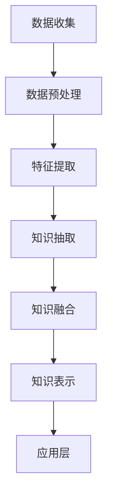

                 

# 知识经济下知识付费的人工智能知识挖掘技术

> **关键词**：知识经济、知识付费、人工智能、知识挖掘、知识图谱、机器学习、自然语言处理、深度学习

> **摘要**：本文旨在探讨在知识经济时代，知识付费背景下，人工智能知识挖掘技术的发展与应用。文章首先介绍了知识经济与知识付费的基本概念，随后详细阐述了人工智能知识挖掘技术的原理、方法及其在实际应用中的具体实现。最后，文章展望了未来知识挖掘技术的发展趋势，并提出了面临的挑战。

## 1. 背景介绍

### 1.1 知识经济的兴起

知识经济，是指以知识为核心资源，以知识创新为主要驱动力，通过知识的获取、传播、整合和应用，推动经济增长和社会进步的经济形态。知识经济是信息时代发展的高级阶段，与传统的农业经济和工业经济相比，具有更高的创新性、智慧性和开放性。

知识经济的兴起，源于信息技术和互联网技术的飞速发展。随着信息技术的普及，知识的生产、传播、获取和利用变得更加便捷。知识经济不仅改变了传统的经济结构和生产方式，也带来了新的商业模式和经济增长点。

### 1.2 知识付费的发展

知识付费，是指消费者为获取特定知识内容而支付费用的一种行为。在知识经济时代，随着人们对知识的需求日益增加，知识付费逐渐成为一种普遍现象。

知识付费的发展，一方面是由于知识的价值日益凸显，消费者愿意为高质量的知识内容付费；另一方面，互联网技术的发展为知识付费提供了便捷的渠道和平台。知识付费平台如知乎、得到、喜马拉雅等，通过提供各种形式的知识内容，满足了消费者的知识需求。

## 2. 核心概念与联系

### 2.1 人工智能知识挖掘技术概述

人工智能知识挖掘技术，是指利用人工智能算法，从大量非结构化数据中提取出有价值知识的过程。它涵盖了多个技术领域，包括机器学习、自然语言处理、深度学习等。

人工智能知识挖掘技术的主要任务包括：数据预处理、特征提取、知识抽取、知识融合、知识表示等。通过这些技术，可以从海量数据中挖掘出有价值的信息，为知识付费提供支持。

### 2.2 人工智能知识挖掘技术的架构

人工智能知识挖掘技术的架构，主要包括数据层、算法层和应用层。

- **数据层**：负责数据收集、存储和管理。数据来源可以是各种渠道，如互联网、数据库、传感器等。
- **算法层**：负责实现各种人工智能算法，包括机器学习、自然语言处理、深度学习等。这些算法用于数据预处理、特征提取、知识抽取等任务。
- **应用层**：负责将挖掘出的知识应用于实际场景，如知识付费、智能推荐、智能问答等。

### 2.3 人工智能知识挖掘技术的 Mermaid 流程图

## 3. 核心算法原理 & 具体操作步骤

### 3.1 数据预处理

数据预处理是人工智能知识挖掘的第一步，其目的是将原始数据转化为适合算法处理的形式。具体操作步骤如下：

1. **数据清洗**：去除数据中的噪声和异常值，保证数据质量。
2. **数据转换**：将不同类型的数据转换为统一格式，如将文本数据转换为词向量。
3. **数据分割**：将数据分为训练集、验证集和测试集，用于算法训练和评估。

### 3.2 特征提取

特征提取是从原始数据中提取出对任务有用的特征的过程。特征提取的好坏直接影响到算法的性能。常见的方法有：

1. **词袋模型**：将文本数据表示为词汇的集合。
2. **TF-IDF**：计算词语在文档中的重要程度。
3. **Word2Vec**：将词语映射为向量，用于表示文本数据。

### 3.3 知识抽取

知识抽取是从大量文本数据中提取出实体、关系和事件等知识的过程。常见的方法有：

1. **基于规则的方法**：通过预先定义的规则，从文本中提取知识。
2. **基于统计的方法**：通过统计方法，从大量文本中学习出知识抽取的模型。
3. **基于深度学习的方法**：利用深度学习模型，从文本中自动抽取知识。

### 3.4 知识融合

知识融合是将来自不同数据源的知识进行整合，形成统一的知识体系。常见的方法有：

1. **基于语义的方法**：通过比较知识的语义信息，实现知识融合。
2. **基于图的方法**：将知识表示为图，通过图论算法实现知识融合。
3. **基于矩阵的方法**：通过矩阵运算，实现知识融合。

### 3.5 知识表示

知识表示是将知识以计算机可处理的形式进行表达。常见的方法有：

1. **基于向量的方法**：将知识表示为向量，用于机器学习模型。
2. **基于图的方

