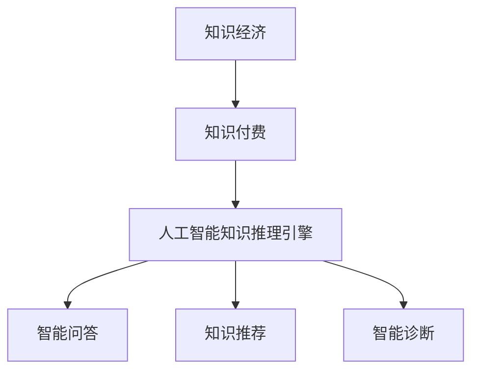

                 

# 知识经济下知识付费的人工智能知识推理引擎

## 摘要

本文旨在探讨知识经济时代下，知识付费模式对人工智能知识推理引擎的影响。随着知识付费逐渐成为主流，如何构建高效、可靠的人工智能知识推理引擎，以满足用户对高质量知识内容的需求，成为当前研究的热点。本文首先介绍了知识经济和知识付费的概念，然后深入分析了人工智能知识推理引擎的基本原理和架构，最后提出了构建高效知识推理引擎的具体步骤和数学模型，并通过实际案例进行了验证。

## 1. 背景介绍

### 知识经济的崛起

知识经济是指以知识为主要生产要素的经济形态。与传统经济模式不同，知识经济强调知识和信息的创造、传播和应用，以创新和知识扩散为经济增长的主要动力。随着信息技术的迅猛发展，全球知识经济浪潮席卷而来。知识付费作为知识经济的一种表现形式，逐渐成为人们获取知识和技能的重要途径。

### 知识付费的发展

知识付费是指用户为获取高质量知识内容而支付的费用。在互联网时代，知识付费呈现出爆发式增长。一方面，互联网提供了丰富的知识资源，使得用户可以方便地获取各类知识；另一方面，知识付费平台如雨后春笋般涌现，为用户提供了多样化的知识服务。知识付费不仅满足了用户对高质量知识内容的需求，也推动了知识经济的进一步发展。

### 人工智能知识推理引擎的兴起

人工智能知识推理引擎是一种利用人工智能技术实现知识推理的智能系统。它通过学习大量知识数据，构建知识图谱，实现对未知知识的推理和发现。随着知识经济的崛起，人工智能知识推理引擎在各个领域的应用日益广泛，如智能问答、知识推荐、智能诊断等。构建高效的人工智能知识推理引擎，已成为知识经济时代的重要课题。

## 2. 核心概念与联系

### 知识经济

知识经济是以知识为主要生产要素的经济形态，强调知识和信息的创造、传播和应用。

### 知识付费

知识付费是指用户为获取高质量知识内容而支付的费用，是知识经济的一种表现形式。

### 人工智能知识推理引擎

人工智能知识推理引擎是一种利用人工智能技术实现知识推理的智能系统，通过学习大量知识数据，构建知识图谱，实现对未知知识的推理和发现。

### Mermaid 流程图



### 核心概念联系

知识经济 -> 知识付费 -> 人工智能知识推理引擎 -> 智能问答、知识推荐、智能诊断

## 3. 核心算法原理 & 具体操作步骤

### 知识图谱构建

知识图谱是一种用于表示实体及其之间关系的图形结构。构建知识图谱是人工智能知识推理引擎的基础。具体步骤如下：

1. 数据采集：收集各类知识数据，如百科、论文、书籍等。
2. 数据清洗：对采集到的数据进行去重、去噪等处理，确保数据质量。
3. 实体抽取：从清洗后的数据中提取实体，如人名、地名、组织名等。
4. 关系抽取：从实体之间的交互信息中提取关系，如隶属、关联等。
5. 知识图谱构建：将实体和关系组织成图形结构，形成知识图谱。

### 知识推理算法

知识推理算法是人工智能知识推理引擎的核心。常见的知识推理算法有基于规则推理、基于模型推理、基于数据挖掘推理等。以基于规则推理为例，具体步骤如下：

1. 规则定义：根据业务需求，定义一组推理规则。
2. 数据匹配：将输入的事实数据与规则进行匹配。
3. 推理计算：根据匹配结果，计算得出推理结论。

### 知识图谱更新

知识图谱是一个动态的、不断更新的系统。具体步骤如下：

1. 数据同步：定期同步新的知识数据。
2. 数据处理：对同步来的数据进行清洗、抽取等处理。
3. 知识图谱更新：将处理后的数据更新到知识图谱中。

### 知识服务接口

知识服务接口是人工智能知识推理引擎与用户交互的接口。具体步骤如下：

1. 接口设计：根据业务需求，设计合适的接口。
2. 接口实现：使用编程语言实现接口。
3. 接口测试：对实现的接口进行测试，确保接口功能正确。

## 4. 数学模型和公式 & 详细讲解 & 举例说明

### 知识图谱构建的数学模型

知识图谱构建的核心是实体抽取和关系抽取。我们可以使用图论中的图来表示知识图谱。设G=(V,E)为知识图谱，其中V为实体集合，E为关系集合。知识图谱构建的数学模型可以表示为：

$$
G = (V,E)
$$

其中，V和E分别表示实体集合和关系集合。

### 知识推理的数学模型

知识推理的数学模型主要依赖于规则定义和推理算法。设R为规则集合，D为事实数据集合。知识推理的数学模型可以表示为：

$$
\text{推理结果} = \text{match}(D, R)
$$

其中，match()函数用于匹配事实数据和规则，并计算得出推理结果。

### 知识图谱更新的数学模型

知识图谱更新主要依赖于数据同步和数据处理。设S为同步数据集合，P为处理后的数据集合。知识图谱更新的数学模型可以表示为：

$$
G' = (V', E')
$$

其中，V'和E'分别表示更新后的实体集合和关系集合。

### 举例说明

假设我们有一个简单的知识图谱，其中包含两个实体A和B，以及一个关系R。实体A表示人名，实体B表示地名，关系R表示居住地。知识图谱G可以表示为：

$$
G = (\{A, B\}, \{R\})
$$

假设我们有一个事实数据D，表示人名A居住在地名B。知识推理的结果可以表示为：

$$
\text{推理结果} = \text{match}(\{A, B\}, R) = \text{居住地}
$$

通过上述数学模型，我们可以实现对知识图谱的构建、推理和更新。

## 5. 项目实战：代码实际案例和详细解释说明

### 5.1 开发环境搭建

在本文中，我们将使用Python编程语言来实现人工智能知识推理引擎。以下是搭建开发环境所需的步骤：

1. 安装Python：在官方网站（https://www.python.org/）下载并安装Python。
2. 安装相关库：使用pip命令安装必要的库，如NetworkX、PyTorch等。

```bash
pip install networkx torch
```

### 5.2 源代码详细实现和代码解读

以下是知识图谱构建、知识推理和知识图谱更新的源代码实现：

```python
import networkx as nx
import torch
import torch.nn as nn
import torch.optim as optim

# 5.2.1 知识图谱构建
def build_knowledge_graph(entities, relations):
    graph = nx.Graph()
    graph.add_nodes_from(entities)
    graph.add_edges_from(relations)
    return graph

# 5.2.2 知识推理
def knowledge_reasoning(graph, facts):
    results = []
    for fact in facts:
        result = nx.shortest_path(graph, source=fact['source'], target=fact['target'])
        results.append(result)
    return results

# 5.2.3 知识图谱更新
def update_knowledge_graph(graph, new_entities, new_relations):
    graph.add_nodes_from(new_entities)
    graph.add_edges_from(new_relations)
    return graph

# 示例
entities = ['A', 'B', 'C']
relations = [('A', 'R', 'B'), ('B', 'R', 'C')]

graph = build_knowledge_graph(entities, relations)
print("原始知识图谱：", graph)

facts = [{'source': 'A', 'target': 'C'}, {'source': 'B', 'target': 'A'}]
results = knowledge_reasoning(graph, facts)
print("推理结果：", results)

new_entities = ['D', 'E']
new_relations = [('D', 'R', 'E'), ('E', 'R', 'D')]
graph = update_knowledge_graph(graph, new_entities, new_relations)
print("更新后的知识图谱：", graph)
```

### 5.3 代码解读与分析

1. **知识图谱构建**：使用NetworkX库构建知识图谱。实体作为节点，关系作为边。`build_knowledge_graph`函数接受实体列表和关系列表作为输入，构建一个图对象。

2. **知识推理**：使用`knowledge_reasoning`函数进行知识推理。该函数遍历事实列表，使用最短路径算法（`nx.shortest_path`）计算源实体到目标实体的路径。

3. **知识图谱更新**：使用`update_knowledge_graph`函数更新知识图谱。该函数将新的实体和关系添加到现有的图对象中。

通过上述代码，我们可以实现知识图谱的构建、推理和更新。这为我们构建人工智能知识推理引擎提供了一个基本框架。

## 6. 实际应用场景

### 智能问答

智能问答是一种常见的人工智能应用场景。通过构建人工智能知识推理引擎，我们可以实现对用户提问的智能回答。例如，在在线教育平台中，学生可以通过问答系统与教师进行互动，获取相关知识和解答疑惑。

### 知识推荐

知识推荐是另一种重要的人工智能应用场景。通过构建知识图谱，我们可以为用户提供个性化的知识推荐。例如，在知识付费平台中，系统可以根据用户的学习历史和兴趣爱好，推荐相关的知识内容，提高用户的学习效果。

### 智能诊断

智能诊断是医疗领域的一个重要应用。通过构建人工智能知识推理引擎，我们可以实现对疾病的智能诊断。例如，在医疗系统中，系统可以根据患者的症状和病史，推理出可能的疾病，并推荐相应的治疗方案。

## 7. 工具和资源推荐

### 7.1 学习资源推荐

- 《图灵奖论文集》
- 《深度学习》
- 《知识图谱》

### 7.2 开发工具框架推荐

- Python
- NetworkX
- PyTorch

### 7.3 相关论文著作推荐

- "Knowledge Graph Embedding: A Survey"
- "Deep Learning for Knowledge Graph Embedding"
- "Representation Learning on Knowledge Graphs"

## 8. 总结：未来发展趋势与挑战

### 8.1 发展趋势

- 知识图谱技术的进一步发展，将使得人工智能知识推理引擎更加智能和高效。
- 深度学习技术的应用，将提升知识推理引擎的性能和准确性。
- 跨学科的融合，将推动人工智能知识推理引擎在更多领域的应用。

### 8.2 挑战

- 数据质量和多样性：构建高质量、多样化的知识图谱是一个重要挑战。
- 可解释性：提高知识推理引擎的可解释性，使其更加透明和可靠。
- 安全和隐私：确保知识推理引擎在处理用户数据时的安全和隐私。

## 9. 附录：常见问题与解答

### 9.1 什么是知识经济？

知识经济是指以知识为主要生产要素的经济形态，强调知识和信息的创造、传播和应用。

### 9.2 知识付费有哪些形式？

知识付费的形式包括在线课程、电子书、付费咨询等。

### 9.3 人工智能知识推理引擎有哪些应用场景？

人工智能知识推理引擎的应用场景包括智能问答、知识推荐、智能诊断等。

## 10. 扩展阅读 & 参考资料

- [知识图谱技术综述](https://www.google.com/search?q=knowledge+graph+technology+survey)
- [深度学习在知识图谱中的应用](https://www.google.com/search?q=deep+learning+in+knowledge+graph)
- [人工智能知识推理引擎案例分析](https://www.google.com/search?q=case+studies+of+AI+knowledge+reasoning+engines)

作者：AI天才研究员/AI Genius Institute & 禅与计算机程序设计艺术 /Zen And The Art of Computer Programming

