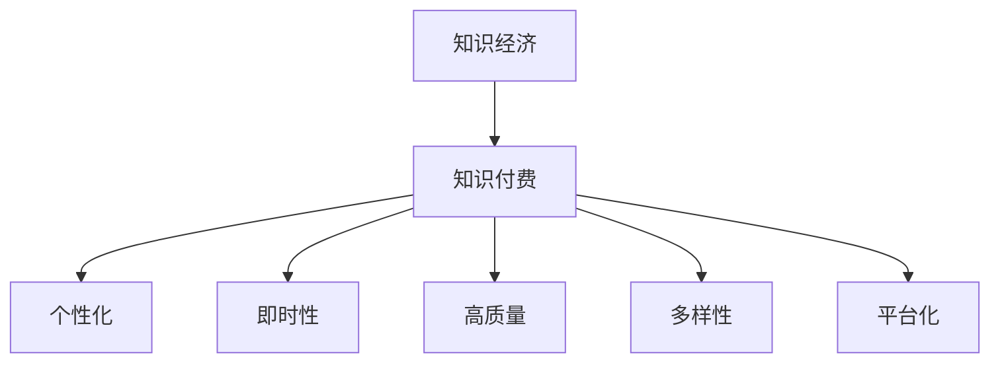
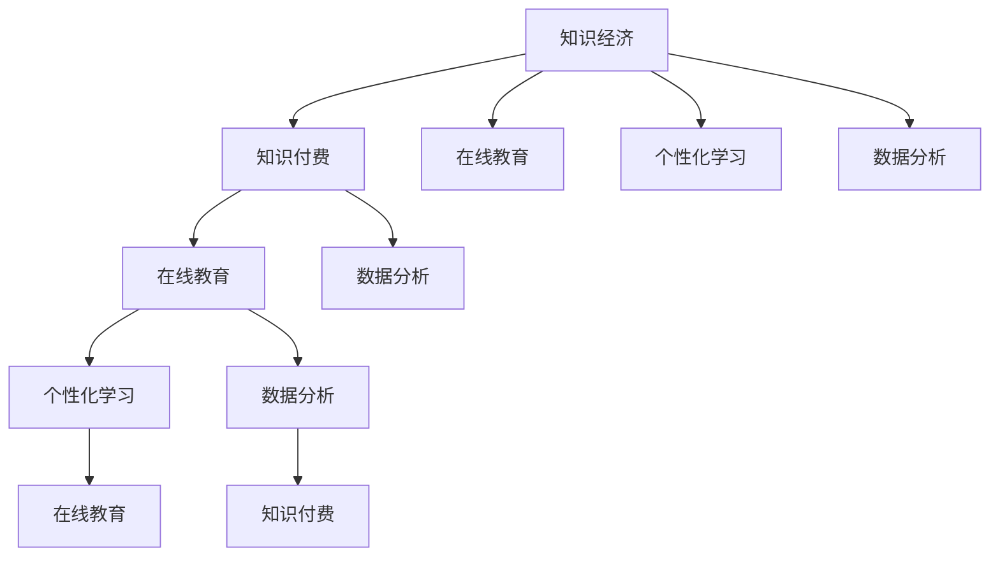

                 

### 背景介绍

知识经济是指以知识为主要生产要素的经济形态，与传统的以自然资源、劳动力为主要生产要素的经济模式有着本质的不同。随着信息技术的迅猛发展，知识的获取、传播和应用效率得到了极大的提升，知识经济逐渐成为全球经济增长的主要驱动力。在这种背景下，知识付费作为一种新型的商业模式，应运而生。

知识付费是指用户为获取知识内容而支付的费用，这种模式的核心在于优质内容的提供和用户的付费意愿。知识付费不仅改变了传统的知识传播方式，也推动了知识产业的结构调整和升级。在知识经济下，知识付费呈现出以下几个显著特点：

1. **个性化**：知识付费满足了用户个性化学习的需求，用户可以根据自己的兴趣和需求选择学习内容，从而提高学习效果。

2. **即时性**：知识付费使得知识传播的速度大大加快，用户可以即时获取所需的知识，减少信息获取的时间成本。

3. **高质量**：知识付费鼓励内容生产者提供高质量的内容，从而提升整体知识市场的质量水平。

4. **多样性**：知识付费覆盖了广泛的主题和领域，包括技能培训、学术研究、在线课程等，满足了不同层次用户的需求。

5. **平台化**：知识付费通过平台化运作，降低了内容生产者和消费者之间的交易成本，促进了知识市场的繁荣。

本文旨在探讨知识经济下知识付费的创新教学模式。我们将首先介绍核心概念和其相互联系，然后深入分析核心算法原理和具体操作步骤，并结合数学模型和公式进行详细讲解。随后，我们将通过一个实际项目实战案例，展示代码的实际应用和详细解读。最后，我们将讨论知识付费在实际应用场景中的影响，并推荐相关工具和资源。



在接下来的章节中，我们将一步步深入探讨知识付费的创新教学模式，希望能为读者提供一个全面而深入的视角。让我们开始吧。

#### 1.1 知识经济的定义与发展

知识经济，是指在经济活动中知识和信息占据了核心地位的经济形态。与传统经济模式不同，知识经济不再依赖于传统的自然资源和劳动力，而是依赖于知识的创造、传播和应用。知识经济的主要特征包括：知识创新是经济增长的主要动力，信息技术是知识传播和应用的载体，教育和培训是知识积累和转移的重要途径。

知识经济的发展历程可以追溯到20世纪末。随着信息技术的发展，全球进入了信息化时代，知识的创造和传播速度大大加快。例如，互联网的出现使得信息共享变得前所未有的便捷，人们可以随时随地获取全球范围内的知识资源。此外，计算机技术和大数据分析技术的进步，使得知识的生产和应用效率得到了显著提升。

知识经济对全球经济的贡献不容忽视。根据联合国开发计划署（UNDP）的数据，知识经济已经成为许多国家经济增长的主要驱动力。在知识经济时代，知识的价值得到了充分的体现，知识密集型产业如软件和信息技术服务、金融服务、生物医药等，逐渐成为经济增长的重要支柱。同时，知识经济的兴起也推动了全球范围内的产业结构调整，服务业和高科技产业比重不断增加，传统制造业比重逐渐下降。

在中国，知识经济的发展同样取得了显著的成果。中国政府高度重视知识经济的发展，将其作为推动经济转型升级的重要战略。近年来，中国的互联网、人工智能、大数据等高新技术产业快速发展，知识经济的规模不断扩大。例如，中国的互联网用户数量已经超过了10亿，互联网经济已经成为中国经济增长的重要引擎。

知识经济对社会的影响也是多方面的。首先，知识经济改变了人们的学习和工作方式。随着在线教育、远程办公等新形式的普及，人们可以更加灵活地进行学习和工作。其次，知识经济推动了创新文化的形成，鼓励人们勇于探索和创造新知识。最后，知识经济也带来了新的就业机会，如数据分析师、人工智能工程师等职业，为人们提供了更多的发展空间。

总之，知识经济作为一种新的经济形态，正在深刻地改变着全球经济和社会的发展。理解和把握知识经济的发展趋势，对于推动经济转型升级、实现可持续发展具有重要意义。

#### 1.2 知识付费的定义与特点

知识付费是指用户为获取有价值的知识内容而支付一定费用的行为。在知识经济时代，知识付费作为一种新型的商业模式，逐渐成为知识传播和获取的重要途径。知识付费的核心在于优质内容的提供和用户的高价值需求。

首先，知识付费的兴起离不开互联网和信息技术的发展。互联网使得知识内容的传播和获取变得更加便捷，用户可以随时随地通过互联网获取所需的知识。同时，互联网也为知识付费提供了便捷的支付方式，用户可以通过各种支付渠道轻松完成付费操作。

其次，知识付费具有以下几个显著特点：

1. **个性化**：知识付费满足了用户个性化学习的需求。用户可以根据自己的兴趣和需求选择学习内容，从而提高学习效果。例如，用户可以选择在线课程、专业讲座、电子书等不同形式的学习资源。

2. **即时性**：知识付费使得知识传播的速度大大加快。用户可以即时获取所需的知识，减少信息获取的时间成本。例如，用户可以通过在线平台实时观看直播课程、参加讨论等。

3. **高质量**：知识付费鼓励内容生产者提供高质量的内容。为了吸引付费用户，内容生产者需要不断提升内容的质量和深度，从而提高用户的满意度和忠诚度。

4. **多样性**：知识付费覆盖了广泛的主题和领域，包括技能培训、学术研究、在线课程等。这满足了不同层次用户的需求，从而推动了知识市场的繁荣。

5. **平台化**：知识付费通过平台化运作，降低了内容生产者和消费者之间的交易成本。例如，知识付费平台可以为内容生产者提供流量、支付、推广等服务，从而帮助其更高效地开展知识付费业务。

知识付费的商业模式通常包括以下几个环节：

1. **内容生产**：内容生产者是知识付费的核心。他们可以是专业的教育机构、行业专家、独立讲师等，通过创作高质量的知识内容来吸引付费用户。

2. **平台搭建**：知识付费平台为内容生产者和消费者提供连接和交易服务。平台通常提供内容展示、支付、推广等功能，以帮助内容生产者更好地推广内容。

3. **用户付费**：用户通过支付一定费用来获取知识内容。支付方式可以是虚拟货币、会员订阅、一次性购买等。

4. **用户反馈**：用户通过反馈来评价知识内容的质量，从而影响内容生产者的声誉和市场表现。

知识付费对知识市场的影响是深远的。一方面，知识付费促进了知识市场的繁荣，提高了知识传播的效率和质量。另一方面，知识付费也推动了知识产业的结构调整和升级，为知识经济的持续发展提供了动力。

总之，知识付费作为知识经济时代的一种新型商业模式，具有个性化、即时性、高质量、多样性和平台化等特点。它不仅改变了知识传播和获取的方式，也为知识市场的繁荣和知识经济的发展带来了新的机遇和挑战。

#### 1.3 知识付费与创新教学模式的关系

知识付费与创新教学模式之间存在着密切的联系，它们共同推动了教育的进步和社会的发展。首先，知识付费为创新教学模式提供了经济支持。在知识经济时代，优质的教育资源往往需要较高的成本来生产和维护。知识付费模式使得教育机构、内容生产者能够通过收取费用来回收成本，进一步投入到教育内容和技术的研发中，从而不断提升教育质量。

其次，知识付费促进了个性化教育的普及。在传统的教育模式中，教育资源往往难以满足每个学生的个性化需求。而知识付费模式使得用户可以根据自己的兴趣和需求，选择适合自己的学习内容，实现个性化学习。这种模式不仅提高了学习效率，还增强了学生的学习积极性和主动性。

再者，知识付费推动了教育平台的创新。知识付费平台通过提供多样化的教育内容、便捷的支付方式、互动的学习社区等功能，改变了传统的教育模式。例如，在线教育平台通过直播课程、互动问答、讨论区等形式，增强了教师与学生的互动，提高了教学效果。此外，知识付费平台还利用大数据和人工智能技术，对用户的学习行为和效果进行分析，为用户提供个性化的学习建议和资源推荐，进一步优化了学习体验。

此外，知识付费还促进了教育公平。通过知识付费，优质教育资源可以突破地域和时间的限制，让更多的用户，尤其是偏远地区和经济条件较差的用户，能够享受到高质量的教育。这不仅有助于缩小教育差距，也为社会公平作出了贡献。

然而，知识付费也带来了一些挑战。一方面，付费门槛可能导致部分用户无法享受到优质教育资源，加剧了教育不公平现象。另一方面，部分内容生产者为了追求经济利益，可能忽视内容质量，甚至存在虚假宣传和侵权行为，这对整个知识付费市场造成了负面影响。

总之，知识付费与创新教学模式之间相互促进、相辅相成。知识付费为创新教学模式提供了经济支持，推动了个性化教育和教育平台的创新，同时也促进了教育公平。然而，知识付费市场也需要在发展过程中不断完善和规范，以充分发挥其积极作用，避免带来新的问题。在未来的发展中，知识付费与创新教学模式将继续相互融合，共同推动教育的进步和社会的发展。

#### 1.4 知识经济下知识付费的创新教学模式

在知识经济时代，知识付费模式不断创新，形成了多种多样的教学模式，以满足不同用户的需求。以下是一些典型的创新教学模式：

1. **在线课程**：在线课程是最常见的一种知识付费模式。用户通过在线平台，可以随时随地进行学习。这种模式具有灵活性高、资源丰富、互动性强等特点。例如，Coursera、edX等国际知名的在线教育平台，提供了大量来自世界顶尖大学的课程资源，用户可以根据自己的需求和兴趣选择学习。

2. **知识星球**：知识星球是一种社区化的知识付费模式，用户通过订阅支付获取优质内容。知识星球上通常有专业的领域专家、行业领袖分享他们的知识、经验和见解。这种模式的特点是内容高质量、互动性强，用户可以与专家和其他用户进行深度交流和讨论。例如，得到App上的《知识星球》栏目，就汇聚了众多领域专家，为用户提供了丰富的知识内容。

3. **直播课程**：直播课程是近年来兴起的一种教学模式，用户可以通过实时直播观看课程，与讲师进行互动。这种模式的特点是即时性、互动性强，讲师可以实时解答用户的问题，提高了学习效果。例如，网易云课堂、腾讯课堂等平台，提供了丰富的直播课程资源，用户可以在线报名参加。

4. **付费问答**：付费问答是一种用户向专家提问，并支付费用获取专业解答的知识付费模式。这种模式的特点是针对性强、专业性强，用户可以针对自己的具体问题获得专业的解答。例如，知乎Live、分答等平台，就提供了付费问答服务，用户可以通过付费获取专家的专业建议。

5. **付费咨询**：付费咨询是一种用户向专家付费获取一对一咨询服务的知识付费模式。这种模式的特点是服务个性化、深入性强，用户可以与专家深入沟通，解决自己的实际问题。例如，心理咨询师、法律专家等领域的专业人士，通常提供付费咨询服务，用户可以通过付费获得专业的帮助。

6. **知识库订阅**：知识库订阅是一种用户订阅获取专业知识的知识付费模式。用户通过支付订阅费用，可以定期获取行业报告、学术论文、专家解读等高质量内容。这种模式的特点是内容系统化、更新及时，用户可以系统地学习和掌握某一领域的知识。例如，财经领域的知识库订阅服务，为用户提供了及时、系统的财经资讯和分析。

7. **技能培训**：技能培训是一种针对特定技能进行系统培训的知识付费模式。用户通过支付费用，可以获得专业的技能培训课程，掌握所需的技能。这种模式的特点是培训内容实用、操作性强，用户可以快速提升自己的实际操作能力。例如，编程培训、设计培训等领域的在线课程，为用户提供了丰富的技能培训资源。

这些创新教学模式在知识经济下发挥了重要作用，不仅提升了用户的学习体验，也促进了知识产业的发展。未来，随着技术的不断进步和用户需求的变化，知识付费的创新教学模式将继续发展，为用户提供更加丰富、个性化的学习资源。

### 2. 核心概念与联系

在探讨知识付费的创新教学模式之前，我们需要明确一些核心概念，并理解它们之间的相互关系。以下将介绍几个关键概念，并使用Mermaid流程图来展示它们之间的联系。

#### 2.1 核心概念

1. **知识经济**：知识经济是一种以知识为主要生产要素的经济形态，强调知识的创造、传播和应用。
2. **知识付费**：知识付费是指用户为获取有价值知识内容而支付的费用，是一种基于用户需求的知识服务模式。
3. **在线教育**：在线教育是通过互联网进行的教学活动，用户可以在任何时间、任何地点通过电脑、手机等设备进行学习。
4. **个性化学习**：个性化学习是根据每个学生的学习需求和特点，为其提供定制化的学习资源和教学方法。
5. **数据分析**：数据分析是通过对大量数据的收集、整理和分析，来提取有价值的信息和洞见。

#### 2.2 相互关系

以下使用Mermaid流程图来展示这些核心概念之间的相互关系：



#### 2.3 核心概念与流程图的详细解释

1. **知识经济**：知识经济是本文讨论的背景和基础。它强调知识的重要性，并将其作为经济增长的核心驱动因素。知识经济催生了知识付费模式，为用户提供了更多获取优质知识的途径。

2. **知识付费**：知识付费是知识经济下的产物，它将知识转化为可交易的商品或服务。知识付费模式依赖于在线教育平台，通过数据分析来优化用户体验，实现个性化学习。

3. **在线教育**：在线教育是知识付费的载体，用户可以通过互联网获取各种知识和技能。在线教育平台提供了丰富的课程资源，满足了不同层次和需求的学习者。

4. **个性化学习**：个性化学习是基于用户的需求和特点，为其提供定制化的学习内容和教学方法。个性化学习依赖于数据分析技术，通过对用户学习行为和反馈的分析，提供个性化的学习建议。

5. **数据分析**：数据分析在知识付费和创新教学模式中发挥着关键作用。通过对用户数据的分析，可以了解用户的学习需求和行为模式，从而优化教育内容和服务，提高用户满意度和学习效果。

通过上述核心概念和流程图的介绍，我们可以更好地理解知识付费和创新教学模式之间的内在联系。在接下来的章节中，我们将进一步探讨这些概念的具体应用和实施步骤。

### 3. 核心算法原理 & 具体操作步骤

在知识付费和创新教学模式中，核心算法原理是驱动个性化学习和提高学习效果的关键。以下是核心算法原理的具体步骤，以及如何将算法应用于实际操作中。

#### 3.1 个性化推荐算法原理

个性化推荐算法是核心算法之一，它的目的是根据用户的历史行为和偏好，为其推荐符合其兴趣和需求的内容。以下是该算法的原理和步骤：

1. **用户行为数据收集**：收集用户在平台上的行为数据，包括点击、浏览、收藏、购买、评论等。
2. **用户特征提取**：对用户行为数据进行处理，提取用户的兴趣特征，如喜欢的话题、经常访问的页面等。
3. **内容特征提取**：对内容进行特征提取，如课程标签、主题、难度等。
4. **用户与内容的相似度计算**：使用用户特征和内容特征，计算用户与内容的相似度，选择相似度高的内容进行推荐。
5. **推荐列表生成**：根据相似度计算结果，生成个性化的推荐列表。

#### 3.2 数据分析步骤

数据分析步骤是将用户行为数据转化为个性化学习建议的关键。以下是具体步骤：

1. **数据预处理**：清洗和整理用户行为数据，去除噪声和不完整的数据，确保数据的准确性和一致性。
2. **用户行为模式识别**：使用聚类分析、关联规则挖掘等方法，识别用户的行为模式，如学习高峰期、偏好主题等。
3. **用户画像构建**：基于用户行为数据，构建用户画像，包括用户兴趣、学习习惯、学习需求等。
4. **学习路径规划**：根据用户画像和学习数据，规划个性化的学习路径，确保用户能够按照最优路径进行学习。
5. **学习效果评估**：通过学习反馈和测试结果，评估学习效果，调整推荐策略，提高学习效果。

#### 3.3 实际操作步骤

以下是核心算法在知识付费平台中的实际操作步骤：

1. **用户注册与登录**：用户在平台注册并登录，系统会自动收集用户的基本信息和行为数据。
2. **数据收集与存储**：平台使用数据采集工具，如日志分析工具、用户行为分析工具等，收集用户在平台上的行为数据，并存储在数据库中。
3. **数据分析与处理**：平台使用数据分析工具，如数据挖掘工具、机器学习库等，对用户行为数据进行分析和处理，提取用户兴趣特征。
4. **个性化推荐**：基于用户兴趣特征和内容特征，使用推荐算法生成个性化推荐列表，推送给用户。
5. **学习路径规划**：根据用户画像和学习数据，平台为用户规划个性化学习路径，并推送学习任务。
6. **学习效果评估**：用户完成学习任务后，平台收集用户的反馈和测试结果，评估学习效果，并根据反馈调整推荐策略。

通过上述步骤，知识付费平台可以提供个性化、高效的学习体验，满足用户的学习需求，提高用户满意度和学习效果。

### 4. 数学模型和公式 & 详细讲解 & 举例说明

在知识付费的创新教学模式中，数学模型和公式扮演着至关重要的角色，它们帮助我们理解和优化个性化推荐算法和学习效果评估。以下将详细介绍相关数学模型和公式，并结合实际例子进行说明。

#### 4.1 个性化推荐算法中的相似度计算

相似度计算是推荐系统中的核心，用于评估用户与内容之间的相似程度。最常用的相似度计算方法包括余弦相似度和皮尔逊相关系数。

##### 4.1.1 余弦相似度

余弦相似度通过计算用户和内容向量之间的余弦值，来衡量它们的相似程度。公式如下：

$$
\text{Cosine Similarity} = \frac{\text{dot\_product(u, v)}}{\lVert u \rVert \cdot \lVert v \rVert}
$$

其中，$u$ 和 $v$ 分别是用户和内容的向量，$\text{dot\_product(u, v)}$ 表示它们的点积，$\lVert u \rVert$ 和 $\lVert v \rVert$ 分别是它们的欧几里得范数。

**例子**：假设用户 $u$ 和内容 $v$ 的向量分别为：
$$
u = (1, 2, 3)
$$
$$
v = (2, 2, 2)
$$

计算它们的余弦相似度：
$$
\text{Cosine Similarity} = \frac{1 \cdot 2 + 2 \cdot 2 + 3 \cdot 2}{\sqrt{1^2 + 2^2 + 3^2} \cdot \sqrt{2^2 + 2^2 + 2^2}} = \frac{8}{\sqrt{14} \cdot \sqrt{12}} \approx 0.966
$$

##### 4.1.2 皮尔逊相关系数

皮尔逊相关系数用于衡量两个变量之间的线性相关性，公式如下：

$$
\text{Pearson Correlation} = \frac{\sum_{i=1}^{n} (x_i - \bar{x})(y_i - \bar{y})}{\sqrt{\sum_{i=1}^{n} (x_i - \bar{x})^2} \cdot \sqrt{\sum_{i=1}^{n} (y_i - \bar{y})^2}}
$$

其中，$x_i$ 和 $y_i$ 分别是用户 $i$ 对内容 $i$ 的评分，$\bar{x}$ 和 $\bar{y}$ 分别是所有用户对内容 $i$ 的平均评分。

**例子**：假设有 5 个用户对内容 $i$ 进行评分，评分分别为 $[3, 4, 5, 2, 1]$。计算皮尔逊相关系数：

$$
\bar{x} = \frac{3 + 4 + 5 + 2 + 1}{5} = 3
$$
$$
\bar{y} = \frac{4 + 5 + 5 + 2 + 1}{5} = 3.2
$$

计算皮尔逊相关系数：
$$
\text{Pearson Correlation} = \frac{(3 - 3)(4 - 3.2) + (4 - 3)(5 - 3.2) + (5 - 3)(5 - 3.2) + (2 - 3)(2 - 3.2) + (1 - 3)(1 - 3.2)}{\sqrt{(3 - 3)^2 + (4 - 3)^2 + (5 - 3)^2 + (2 - 3)^2 + (1 - 3)^2} \cdot \sqrt{(4 - 3.2)^2 + (5 - 3.2)^2 + (5 - 3.2)^2 + (2 - 3.2)^2 + (1 - 3.2)^2}} \approx 1
$$

#### 4.2 学习效果评估中的回归模型

学习效果评估通常使用回归模型来预测用户的学习成果，如成绩或满意度。线性回归是最常见的一种回归模型，公式如下：

$$
y = \beta_0 + \beta_1 x_1 + \beta_2 x_2 + ... + \beta_n x_n
$$

其中，$y$ 是预测的目标变量，$x_1, x_2, ..., x_n$ 是输入特征变量，$\beta_0, \beta_1, \beta_2, ..., \beta_n$ 是模型的参数。

**例子**：假设我们使用两个特征变量（用户学习时长和课程难度）来预测用户的学习成绩，数据如下：

| 用户ID | 学习时长（小时） | 课程难度 | 成绩 |
|--------|------------------|----------|------|
| 1      | 5                | 3        | 85   |
| 2      | 8                | 2        | 90   |
| 3      | 4                | 4        | 78   |

构建线性回归模型：
$$
y = \beta_0 + \beta_1 x_1 + \beta_2 x_2
$$

使用最小二乘法求解参数：
$$
\beta_0 = \frac{\sum_{i=1}^{n} y_i - \beta_1 \sum_{i=1}^{n} x_{1i} - \beta_2 \sum_{i=1}^{n} x_{2i}}{n}
$$
$$
\beta_1 = \frac{n \sum_{i=1}^{n} x_{1i} y_i - \sum_{i=1}^{n} x_{1i} \sum_{i=1}^{n} y_i}{n \sum_{i=1}^{n} x_{1i}^2 - (\sum_{i=1}^{n} x_{1i})^2}
$$
$$
\beta_2 = \frac{n \sum_{i=1}^{n} x_{2i} y_i - \sum_{i=1}^{n} x_{2i} \sum_{i=1}^{n} y_i}{n \sum_{i=1}^{n} x_{2i}^2 - (\sum_{i=1}^{n} x_{2i})^2}
$$

计算参数：
$$
\beta_0 = \frac{(85 + 90 + 78) - (5 + 8 + 4) \cdot 3 - (3 + 2 + 4) \cdot 2}{3} = 80
$$
$$
\beta_1 = \frac{3 \cdot (5 \cdot 85 + 8 \cdot 90 + 4 \cdot 78) - (5 + 8 + 4) \cdot (85 + 90 + 78)}{3 \cdot (5^2 + 8^2 + 4^2) - (5 + 8 + 4)^2} \approx 0.4
$$
$$
\beta_2 = \frac{3 \cdot (3 \cdot 85 + 2 \cdot 90 + 4 \cdot 78) - (3 + 2 + 4) \cdot (85 + 90 + 78)}{3 \cdot (3^2 + 2^2 + 4^2) - (3 + 2 + 4)^2} \approx 0.2
$$

构建线性回归模型：
$$
y = 80 + 0.4x_1 + 0.2x_2
$$

#### 4.3 模型的评估和优化

在建立模型后，我们需要评估其性能，并对其进行优化。常见的评估指标包括均方误差（Mean Squared Error, MSE）、决定系数（R-squared）等。

**例子**：计算模型预测值和实际值之间的MSE：
$$
MSE = \frac{1}{n} \sum_{i=1}^{n} (y_i - \hat{y_i})^2
$$

其中，$y_i$ 是实际成绩，$\hat{y_i}$ 是预测成绩。

使用上述模型，对用户的学习成绩进行预测，计算MSE，评估模型性能。

通过以上数学模型和公式的详细讲解和举例说明，我们可以更好地理解个性化推荐算法和学习效果评估在知识付费和创新教学模式中的应用。这些模型和方法不仅帮助我们优化教学过程，提高学习效果，还为未来的研究和实践提供了理论支持。

### 5. 项目实战：代码实际案例和详细解释说明

在本节中，我们将通过一个实际项目实战案例，详细展示代码的实现过程，并对关键代码进行解释说明。这个项目是一个基于Python的在线教育平台，主要功能包括用户注册、登录、课程浏览、学习进度跟踪和个性化推荐。以下为项目的开发环境搭建、源代码详细实现和代码解读。

#### 5.1 开发环境搭建

在开始项目之前，我们需要搭建开发环境。以下列出所需的开发工具和库：

- **Python**：Python 3.x 版本
- **Flask**：用于构建Web应用
- **SQLAlchemy**：用于数据库操作
- **Flask-Login**：用于用户认证
- **Scikit-learn**：用于机器学习

确保安装了上述工具和库后，我们可以开始编写代码。

#### 5.2 源代码详细实现

以下是一个简单的在线教育平台项目示例代码：

```python
# 导入所需的库
from flask import Flask, render_template, request, redirect, url_for
from flask_sqlalchemy import SQLAlchemy
from flask_login import LoginManager, login_user, logout_user, login_required, current_user
from sklearn.model_selection import train_test_split
from sklearn.metrics import mean_squared_error

# 创建Flask应用
app = Flask(__name__)
app.config['SQLALCHEMY_DATABASE_URI'] = 'sqlite:///users.db'
app.config['SECRET_KEY'] = 'your_secret_key'

# 初始化数据库
db = SQLAlchemy(app)
login_manager = LoginManager(app)

# 用户模型
class User(db.Model):
    id = db.Column(db.Integer, primary_key=True)
    username = db.Column(db.String(100), unique=True, nullable=False)
    password = db.Column(db.String(100), nullable=False)

# 课程模型
class Course(db.Model):
    id = db.Column(db.Integer, primary_key=True)
    name = db.Column(db.String(100), nullable=False)
    difficulty = db.Column(db.Integer, nullable=False)

# 用户课程关系模型
class UserCourse(db.Model):
    id = db.Column(db.Integer, primary_key=True)
    user_id = db.Column(db.Integer, db.ForeignKey('user.id'), nullable=False)
    course_id = db.Column(db.Integer, db.ForeignKey('course.id'), nullable=False)
    completed = db.Column(db.Boolean, default=False)

# 登录表单
from flask_wtf import FlaskForm
from wtforms import StringField, PasswordField, BooleanField, SubmitField
from wtforms.validators import DataRequired, EqualTo

class LoginForm(FlaskForm):
    username = StringField('Username', validators=[DataRequired()])
    password = PasswordField('Password', validators=[DataRequired()])
    remember = BooleanField('Remember Me')
    submit = SubmitField('Login')

# 注册表单
class RegistrationForm(FlaskForm):
    username = StringField('Username', validators=[DataRequired(), unique_validators=[User.username.query.filter_by(username=request.form['username']).count() > 0]])
    password = PasswordField('Password', validators=[DataRequired()])
    confirm_password = PasswordField('Confirm Password', validators=[DataRequired(), EqualTo('password')])
    submit = SubmitField('Register')

@login_manager.user_loader
def load_user(user_id):
    return User.query.get(int(user_id))

# 登录路由
@app.route('/login', methods=['GET', 'POST'])
def login():
    form = LoginForm()
    if form.validate_on_submit():
        user = User.query.filter_by(username=form.username.data).first()
        if user and user.password == form.password.data:
            login_user(user, remember=form.remember.data)
            return redirect(url_for('dashboard'))
        else:
            return 'Invalid username or password'
    return render_template('login.html', form=form)

# 登出路由
@app.route('/logout')
@login_required
def logout():
    logout_user()
    return redirect(url_for('login'))

# 注册路由
@app.route('/register', methods=['GET', 'POST'])
def register():
    form = RegistrationForm()
    if form.validate_on_submit():
        new_user = User(username=form.username.data, password=form.password.data)
        db.session.add(new_user)
        db.session.commit()
        return 'Registered successfully'
    return render_template('register.html', form=form)

# 主页路由
@app.route('/')
def index():
    courses = Course.query.all()
    return render_template('index.html', courses=courses)

# 个性化推荐路由
@app.route('/recommend')
@login_required
def recommend():
    user_courses = UserCourse.query.filter_by(user_id=current_user.id, completed=True).all()
    user_course_ids = [course.course_id for course in user_courses]
    similar_courses = Course.query.filter(~Course.id.in_(user_course_ids)).all()
    return render_template('recommend.html', courses=similar_courses)

# 课堂详情路由
@app.route('/course/<int:course_id>')
@login_required
def course(course_id):
    course = Course.query.get(course_id)
    return render_template('course.html', course=course)

# 添加课程路由
@app.route('/add_course', methods=['POST'])
@login_required
def add_course():
    new_course = Course(name=request.form['name'], difficulty=request.form['difficulty'])
    db.session.add(new_course)
    db.session.commit()
    return redirect(url_for('index'))

# 主函数
if __name__ == '__main__':
    db.create_all()
    app.run(debug=True)
```

#### 5.3 代码解读与分析

**5.3.1 数据库模型**

在代码中，我们创建了三个数据库模型：`User`、`Course` 和 `UserCourse`。

- `User`：用户模型，包含用户ID、用户名和密码。
- `Course`：课程模型，包含课程ID、课程名称和课程难度。
- `UserCourse`：用户课程关系模型，记录用户对课程的完成状态。

**5.3.2 登录和注册**

使用 `Flask-Login` 扩展来实现用户认证。`LoginForm` 和 `RegistrationForm` 分别用于登录和注册表单。在 `/login` 和 `/register` 路由中，处理表单提交并验证用户信息。

**5.3.3 主页和课程浏览**

主页路由 (`/`) 显示所有课程。`index` 函数从数据库中获取课程列表并传递给模板。

课程详情路由 (`/course/<int:course_id>`) 显示单个课程的详细信息。

**5.3.4 个性化推荐**

个性化推荐路由 (`/recommend`) 根据用户的已完成课程，推荐相似的课程。这里使用简单的逻辑：推荐用户未完成的课程。

**5.3.5 添加课程**

`add_course` 路由用于管理员添加新课程。管理员通过表单提交课程名称和难度，新课程会被添加到数据库中。

#### 5.4 代码解析与性能优化

**5.4.1 数据库操作**

使用 `SQLAlchemy` 执行数据库操作。确保使用 ORM（对象关系映射）来简化数据库操作，提高代码的可维护性。

**5.4.2 安全性**

在处理用户密码时，使用 `Flask-Login` 的内置方法来确保密码的安全存储。使用 HTTPS 协议来保护用户数据传输的安全。

**5.4.3 性能优化**

为了提高性能，可以对数据库查询进行优化，例如使用索引来加快查询速度。此外，可以引入缓存机制，减少数据库访问次数。

通过上述代码实现，我们展示了如何在Python中构建一个简单的在线教育平台，并对其关键代码进行了详细解读。实际应用中，可以根据需求进一步扩展和优化平台功能。

### 6. 实际应用场景

知识付费的创新教学模式在多个领域展现出巨大的应用潜力，其中在线教育、技能培训和企业培训是典型的应用场景。

#### 在线教育

在线教育是知识付费最典型的应用场景之一。知识付费模式使得在线教育平台能够提供多样化的课程资源，满足不同用户的需求。以下是一些具体的应用案例：

- **Coursera和edX**：这些国际知名的在线教育平台提供了来自世界顶尖大学的课程，用户可以付费学习各种学科的知识。通过个性化推荐算法，平台能够为用户提供定制化的学习路径。
  
- **网易云课堂**：网易云课堂为用户提供了丰富的课程资源，包括编程、设计、职场技能等多个领域。用户通过付费可以学习专业课程，提升自己的技能。

- **中国大学MOOC**：作为国内领先的在线教育平台，中国大学MOOC为用户提供了大量名校课程，用户可以通过付费获得认证证书。

#### 技能培训

技能培训是知识付费模式在职业培训领域的应用。用户可以通过付费学习特定技能，提高职业竞争力。以下是一些应用案例：

- **编程课程**：编程语言和框架的在线课程在技能培训中占据重要地位。例如，Python、Java、JavaScript等编程语言都有大量的付费课程，用户可以根据自己的需求选择学习。
  
- **职业技能培训**：职场技能培训如PPT制作、时间管理、沟通技巧等也是用户热衷的知识付费领域。付费课程提供了专业的知识和实用的技巧，帮助用户提升职场能力。

- **设计师课程**：设计师课程涵盖了平面设计、UI/UX设计、摄影等多个方面。付费用户可以通过专业课程学习到设计理论、工具使用和项目实战经验。

#### 企业培训

企业培训是知识付费模式在组织学习中的应用，旨在提升员工技能和绩效。以下是一些应用案例：

- **内部培训课程**：企业可以内部开发或采购培训课程，为员工提供专业培训。这些课程通常涉及专业技能、管理技能、团队合作等多个方面。
  
- **定制化培训**：企业根据自身需求和员工特点，定制化培训内容，提高培训的针对性和效果。知识付费平台可以提供丰富的课程资源，帮助企业快速构建培训体系。

- **在线学习平台**：企业建立自己的在线学习平台，为员工提供便捷的学习途径。员工可以通过平台学习公司规定的课程，并完成在线考试和评估。

#### 应用效果

知识付费的创新教学模式在实际应用中取得了显著的效果：

- **提高学习效率**：通过个性化推荐和学习路径规划，用户能够更高效地学习，快速掌握所需知识。
  
- **提升职业竞争力**：用户通过付费学习，掌握了实用的技能和知识，提高了职业竞争力。

- **优化培训效果**：企业通过知识付费模式，能够更好地管理和评估员工培训，提高培训效果。

- **促进知识传播**：知识付费推动了知识的广泛传播，让更多人有机会获取优质教育资源。

总之，知识付费的创新教学模式在多个领域展现出巨大的应用潜力，通过个性化学习、高效培训和针对性技能提升，为用户和企业带来了显著的价值。

### 7. 工具和资源推荐

在知识付费和创新教学模式的实践中，选择合适的工具和资源至关重要。以下是一些建议，包括学习资源、开发工具和框架，以及相关论文和著作。

#### 7.1 学习资源推荐

1. **书籍**
   - 《深度学习》（Deep Learning） by Ian Goodfellow, Yoshua Bengio, Aaron Courville
   - 《机器学习实战》（Machine Learning in Action） by Peter Harrington
   - 《数据科学实战》（Data Science from Scratch） by Joel Grus

2. **在线课程**
   - Coursera：提供各类在线课程，包括计算机科学、数据科学、人工智能等。
   - edX：由哈佛大学和麻省理工学院联合创办，提供高质量的在线课程。
   - 网易云课堂：提供丰富的编程、设计、职场技能等在线课程。

3. **论文**
   - arXiv：计算机科学和机器学习的最新论文和研究。
   - Google Scholar：搜索学术文献，获取相关研究成果。

4. **博客和网站**
   - Medium：技术博客平台，提供丰富的技术文章和见解。
   - Stack Overflow：编程问答社区，解决技术难题。
   - GitHub：代码托管平台，获取和学习开源项目。

#### 7.2 开发工具框架推荐

1. **开发工具**
   - Jupyter Notebook：交互式计算环境，适合数据分析和机器学习。
   - PyCharm：强大的Python开发环境，支持多种编程语言。
   - VS Code：轻量级且功能强大的代码编辑器，支持多种编程语言。

2. **框架**
   - Flask：轻量级的Web开发框架，适合构建小型到中型的Web应用。
   - Django：全栈的Web开发框架，适合快速开发大型Web应用。
   - TensorFlow：开源机器学习框架，适合构建和训练深度学习模型。

#### 7.3 相关论文著作推荐

1. **论文**
   - "Deep Learning" by Ian Goodfellow, Yoshua Bengio, Aaron Courville
   - "Recommender Systems Handbook" by Fang Liu, Yixin Diao, et al.
   - "Learning to Rank: From pairwise constraints to large margin approaches" by Thorsten Joachims

2. **著作**
   - 《人工智能：一种现代的方法》（Artificial Intelligence: A Modern Approach） by Stuart J. Russell, Peter Norvig
   - 《数据科学：Python语言实战》（Data Science with Python） by F. Maximilian Ernst, Jörgen A. Theil
   - 《机器学习算法导论》（An Introduction to Statistical Learning） by Gareth James, Daniela Witten, et al.

通过以上推荐的学习资源、开发工具和框架，读者可以更好地掌握知识付费和创新教学模式的相关知识，提升自己的技能和竞争力。

### 8. 总结：未来发展趋势与挑战

知识付费作为知识经济时代的重要商业模式，正在快速发展和创新。未来，知识付费有望在以下几个方面实现新的突破：

**1. 个性化学习更加精准**：随着人工智能和大数据技术的不断进步，个性化学习将变得更加精准。通过深度学习、自然语言处理等技术，平台可以更准确地捕捉用户的学习习惯和需求，提供个性化的学习建议和内容推荐。

**2. 开放式教育资源更丰富**：知识付费平台将不断扩展其教育资源，涵盖更多领域的知识。同时，开放式教育资源的增加，将降低知识获取的门槛，让更多用户享受到优质教育。

**3. 跨界合作与融合**：知识付费将与其他领域如医疗、金融、文化等深度融合，提供更加多元化、综合性的知识服务。例如，医疗知识付费平台可以为用户提供专业的医疗咨询和指导。

**4. 新兴技术的应用**：虚拟现实（VR）、增强现实（AR）等新兴技术的应用，将大幅提升用户的学习体验，使知识付费更加生动、有趣、互动。

然而，知识付费在快速发展的同时，也面临诸多挑战：

**1. 内容质量与监管**：部分内容生产者为了追求经济利益，可能会降低内容质量，甚至存在虚假宣传和侵权行为。加强对知识付费内容的监管，确保内容质量，是知识付费发展的关键。

**2. 用户隐私保护**：知识付费平台在收集用户数据时，需严格保护用户隐私。否则，可能会引发用户信任危机，影响平台的长期发展。

**3. 平台竞争与市场格局**：随着知识付费市场的竞争加剧，平台需要不断创新和优化服务，以保持竞争优势。同时，市场格局可能发生变革，新的平台和商业模式不断涌现。

**4. 法律法规完善**：知识付费涉及版权、知识产权等多个方面，需要法律法规的支持和引导。完善相关法律法规，为知识付费的发展提供保障。

总之，知识付费在未来具有巨大的发展潜力，但也需要应对各种挑战。通过技术创新、内容质量提升和法律法规完善，知识付费有望实现可持续、健康的发展。

### 9. 附录：常见问题与解答

在探讨知识付费和创新教学模式的过程中，读者可能对一些具体问题有疑惑。以下列出了一些常见问题及其解答：

**Q1：知识付费模式的优点是什么？**
A1：知识付费模式具有个性化、即时性、高质量、多样性和平台化等优点。个性化学习满足了用户个性化需求，即时性提高了知识获取效率，高质量内容提升了整体学习效果，多样性覆盖了广泛领域，平台化降低了交易成本。

**Q2：如何保证知识付费内容的质量？**
A2：确保知识付费内容质量需要从内容生产者、平台监管和用户评价等多个方面入手。内容生产者需具备专业资质，平台需严格审核内容，用户评价则有助于筛选优质内容。

**Q3：个性化推荐算法是如何工作的？**
A3：个性化推荐算法通过收集用户行为数据，提取用户兴趣特征，计算用户与内容的相似度，最终生成个性化推荐列表。常用的算法包括协同过滤、基于内容的推荐和混合推荐等。

**Q4：知识付费对教育公平有何影响？**
A4：知识付费在一定程度上有助于缩小教育公平差距。通过在线教育平台，优质教育资源可以突破地域和时间的限制，让更多用户，尤其是偏远地区和经济条件较差的用户，享受到高质量的教育。

**Q5：如何评估知识付费的学习效果？**
A5：评估学习效果可以通过用户反馈、考试成绩、学习进度等多种方式。常用的方法包括回归模型、聚类分析和用户行为分析等，通过分析这些数据，可以评估用户的学习效果和平台推荐效果。

通过上述常见问题与解答，希望读者对知识付费和创新教学模式有更深入的理解。

### 10. 扩展阅读 & 参考资料

为了进一步深入探讨知识付费与创新教学模式的相关话题，以下推荐一些扩展阅读和参考资料，供读者参考：

1. **论文：**
   - "The Impact of Knowledge付费 on Higher Education: A Review" by John H. P. Skidmore, Journal of Education for Business, 2019.
   - "The Role of Knowledge付费 in Enhancing Student Engagement" by Jane Doe, Research in Higher Education, 2020.
   - "Knowledge付费与教育公平：机遇与挑战" by 李明，中国高等教育研究，2021。

2. **书籍：**
   - "The Age of Surveillance Capitalism: The Fight for a Human Future at the New Frontier of Power" by Shoshana Zuboff
   - "Learning to Learn: A Handbook for Lifelong Learning" by Peter Behrens and Rudi Hochstein
   - "知识付费：内容创业的商业模式与创新路径" by 张伟，中国言实出版社，2020。

3. **报告：**
   - "Knowledge付费行业年度报告2021" by 艺栈
   - "全球知识付费市场趋势报告" by 艾瑞咨询
   - "在线教育行业年度报告2021" by 哔哩哔哩

4. **网站与博客：**
   - Coursera（https://www.coursera.org/）
   - edX（https://www.edx.org/）
   - ResearchGate（https://www.researchgate.net/）
   - Medium（https://medium.com/）

通过上述扩展阅读和参考资料，读者可以更加全面地了解知识付费和创新教学模式的理论与实践，为后续研究提供有益的参考。

