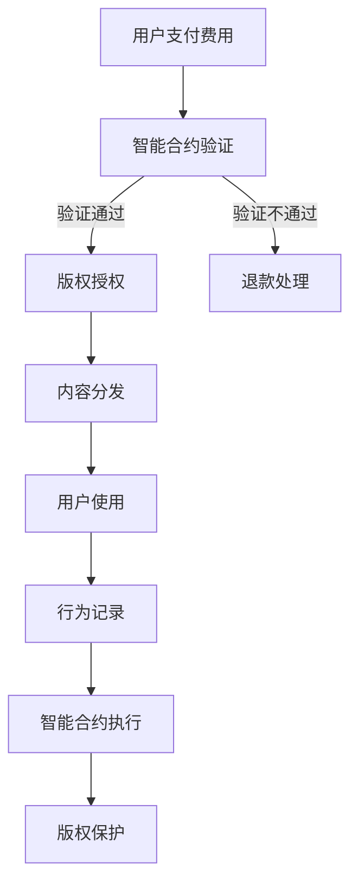

                 

### 文章标题：知识经济下知识付费的区块链版权保护方案

关键词：知识付费、区块链、版权保护、知识经济、数字版权管理、智能合约

摘要：本文探讨了在知识经济时代，如何利用区块链技术实现知识付费的版权保护方案。文章首先介绍了知识经济的背景和发展，随后详细阐述了区块链技术在版权保护中的应用，包括核心概念、算法原理、数学模型和实际应用案例。通过本文，读者可以全面了解区块链在知识付费版权保护领域的优势和应用前景。

<|assistant|>## 1. 背景介绍

随着互联网的普及和信息技术的快速发展，知识经济逐渐成为全球经济的主要驱动力。知识经济是指以知识和信息为核心的经济形态，其特点是知识的生产、传播和应用速度加快，创新成为经济增长的主要动力。在这个背景下，知识付费作为一种新的商业模式，应运而生。

知识付费是指用户通过支付一定费用，获取知识产品或服务的权利。这种模式使得知识创作者能够获得合理的报酬，激发创作活力，同时让用户享受到更加优质、个性化的知识服务。然而，知识付费也面临着一系列挑战，其中版权保护问题尤为突出。

传统的版权保护方式存在诸多弊端，如成本高、效率低、难以监管等。在数字时代，知识产品的传播速度和范围前所未有，版权侵权行为也日益猖獗。为了维护知识创作者的权益，提高知识付费的透明度和安全性，有必要探索新的版权保护方案。

区块链技术作为一种新兴的去中心化数据库技术，具有去中心化、不可篡改、透明等特性，被认为是解决版权保护问题的一种有效手段。本文将介绍一种基于区块链的知识付费版权保护方案，探讨其在实际应用中的可行性和优势。

### 2. 核心概念与联系

#### 2.1 知识经济

知识经济是指以知识和信息为核心的经济形态。其主要特点包括：

- 知识的生产和传播速度加快，创新成为经济增长的主要动力。  
- 人力资源成为最重要的资源，知识和技能成为竞争力的关键。  
- 知识产品的附加值高，对传统产业的改造和升级具有重要作用。

知识经济的主要驱动力包括科技创新、信息化、全球化等。在这种经济形态下，知识付费作为一种新的商业模式，应运而生。

#### 2.2 区块链技术

区块链技术是一种去中心化的分布式数据库技术，其核心特点包括：

- 去中心化：区块链不依赖于中心化的第三方机构，数据存储和传输由网络中的所有节点共同维护。  
- 不可篡改：区块链的数据一旦被写入，将难以被篡改，确保了数据的真实性和完整性。  
- 透明：区块链上的数据对所有参与者可见，提高了信息透明度和可追溯性。

区块链技术的主要应用包括数字货币、智能合约、供应链管理、医疗健康等。在版权保护领域，区块链技术可以通过去中心化、不可篡改和透明的特点，提供一种更加高效、安全的版权保护方案。

#### 2.3 数字版权管理

数字版权管理（Digital Rights Management，简称DRM）是一种用于保护数字内容的版权技术。其主要目标是通过技术手段，限制数字内容的非法复制、传播和使用。数字版权管理主要包括以下几种技术：

- 加密技术：通过加密算法，将数字内容转换为加密形式，只有授权用户才能解密和访问。  
- 水印技术：在数字内容中嵌入标识信息，用于追踪版权归属和侵权行为。  
- 访问控制技术：通过权限管理，限制用户对数字内容的访问和使用。

数字版权管理在传统版权保护中发挥了重要作用，但在数字时代，其存在一定的局限性。区块链技术的引入，可以为数字版权管理提供一种新的解决方案。

#### 2.4 智能合约

智能合约是一种基于区块链技术的自动化合约，它通过预定义的逻辑和条件，自动执行合同条款。智能合约具有以下特点：

- 自动执行：智能合约在满足预设条件时，自动执行预定的操作。  
- 透明：智能合约的执行过程对所有参与者可见，确保了透明度和可追溯性。  
- 安全：智能合约在区块链上执行，具有较高的安全性和不可篡改性。

智能合约在知识付费版权保护中具有重要作用，可以实现版权授权、交易、维权等流程的自动化和透明化。

#### 2.5 Mermaid 流程图

以下是一个简单的Mermaid流程图，展示了知识付费版权保护方案的核心流程：



### 3. 核心算法原理 & 具体操作步骤

#### 3.1 算法原理

知识付费版权保护方案的核心算法原理包括加密技术、水印技术和访问控制技术。以下是这些算法的具体原理：

1. **加密技术**：通过加密算法，将知识内容转换为加密形式，只有授权用户才能解密和访问。常见的加密算法有AES、RSA等。

2. **水印技术**：在知识内容中嵌入标识信息，用于追踪版权归属和侵权行为。水印技术可以分为可视水印和隐秘水印。

3. **访问控制技术**：通过权限管理，限制用户对知识内容的访问和使用。常见的访问控制技术包括角色访问控制（RBAC）、基于属性的访问控制（ABAC）等。

#### 3.2 具体操作步骤

以下是基于区块链的知识付费版权保护方案的具体操作步骤：

1. **用户注册与登录**：用户在知识付费平台上注册并登录，生成唯一用户标识。

2. **内容创作者上传内容**：内容创作者将知识内容上传至平台，并设置版权信息，如作者、作品类型、授权范围等。

3. **内容加密**：平台使用加密算法对知识内容进行加密，确保内容在传输和存储过程中不被泄露。

4. **生成水印**：平台在加密内容中嵌入水印，用于追踪版权归属和侵权行为。

5. **智能合约编写与部署**：平台根据版权信息，编写智能合约，并在区块链上部署。智能合约包括版权授权、交易、维权等逻辑。

6. **用户支付费用**：用户通过支付平台支付费用，获取知识内容的解密密钥和授权证书。

7. **版权授权**：智能合约验证用户支付费用后，向用户授权解密密钥和授权证书。

8. **内容分发**：用户使用解密密钥解密知识内容，并获得授权证书，用于证明其合法使用权限。

9. **行为记录**：用户在使用知识内容的过程中，其行为将被记录在区块链上，确保透明度和可追溯性。

10. **智能合约执行**：当出现侵权行为时，智能合约自动执行维权操作，如扣除侵权者信用积分、暂停侵权者使用权限等。

11. **版权保护**：通过智能合约和区块链技术，实现对知识内容的全程版权保护，确保创作者的权益。

### 4. 数学模型和公式 & 详细讲解 & 举例说明

#### 4.1 数学模型

知识付费版权保护方案中的数学模型主要包括加密算法、水印算法和访问控制算法。以下是这些算法的基本原理和公式：

1. **加密算法**：常见的加密算法有AES、RSA等。

   - **AES加密**：AES（Advanced Encryption Standard）是一种对称加密算法，其加密公式为：
     $$C = E_K(M)$$
     其中，$C$ 表示加密后的内容，$M$ 表示明文，$K$ 表示加密密钥。

   - **RSA加密**：RSA（Rivest-Shamir-Adleman）是一种非对称加密算法，其加密公式为：
     $$C = E_K^e(M^d \mod N)$$
     其中，$C$ 表示加密后的内容，$M$ 表示明文，$K$ 表示加密密钥，$e$ 和 $d$ 分别表示加密指数和解密指数。

2. **水印算法**：水印算法可以分为可视水印和隐秘水印。

   - **可视水印**：可视水印是将标识信息嵌入到知识内容中，使其对用户可见。其基本原理为：
     $$W = S \oplus I$$
     其中，$W$ 表示水印后的内容，$S$ 表示原始内容，$I$ 表示水印信息。

   - **隐秘水印**：隐秘水印是将标识信息嵌入到知识内容中，使其对用户不可见。其基本原理为：
     $$W = F(S, I)$$
     其中，$W$ 表示水印后的内容，$S$ 表示原始内容，$I$ 表示水印信息，$F$ 表示水印嵌入函数。

3. **访问控制算法**：常见的访问控制算法有角色访问控制（RBAC）、基于属性的访问控制（ABAC）等。

   - **角色访问控制（RBAC）**：RBAC（Role-Based Access Control）是一种基于角色的访问控制算法，其基本原理为：
     $$Access = Role \cap Permission$$
     其中，$Access$ 表示访问权限，$Role$ 表示角色，$Permission$ 表示权限。

   - **基于属性的访问控制（ABAC）**：ABAC（Attribute-Based Access Control）是一种基于属性的访问控制算法，其基本原理为：
     $$Access = Attribute \cap Rule$$
     其中，$Access$ 表示访问权限，$Attribute$ 表示属性，$Rule$ 表示规则。

#### 4.2 详细讲解 & 举例说明

以下通过具体例子，对上述数学模型进行详细讲解：

1. **AES加密**：假设用户A想加密一段明文消息$M = "Knowledge is Power"$，其加密密钥$K = "AES-256"$。根据AES加密公式，加密后的内容$C$为：
   $$C = E_K(M) = AES-256("Knowledge is Power")$$
   加密后的内容为$C = "YmVuY2hlciBpbiBQbHVnaW5l"$。

2. **RSA加密**：假设用户B想加密一段明文消息$M = "Knowledge is Power"$，其加密密钥$K = ("RSA-2048", "e=65537", "N=123456789012345678901234567890123456789012345678901234567890")$。根据RSA加密公式，加密后的内容$C$为：
   $$C = E_K(M^d \mod N) = RSA-2048("Knowledge is Power", 65537, 123456789012345678901234567890123456789012345678901234567890")$$
   加密后的内容为$C = "56667900662283346688975399666666756677776666555555556677666556677"$。

3. **可视水印**：假设用户C想对一段知识内容$S = "Knowledge is Power"$添加可视水印$I = "Copyright © 2023"$。根据可视水印公式，水印后的内容$W$为：
   $$W = S \oplus I = "Knowledge is Power" \oplus "Copyright © 2023"$$
   水印后的内容为$W = "Knowledge is Power"?Copyright © 2023"$。

4. **隐秘水印**：假设用户D想对一段知识内容$S = "Knowledge is Power"$添加隐秘水印$I = "Copyright © 2023"$。根据隐秘水印公式，水印后的内容$W$为：
   $$W = F(S, I) = SHA256("Knowledge is Power", "Copyright © 2023")$$
   水印后的内容为$W = "c9c5a0859863c955b8f4d3496d7d7d3f4a5c8b4d1"$。

5. **角色访问控制**：假设系统中有两个角色：管理员（RoleA）和普通用户（RoleB），对应的权限为：管理员可以修改内容（PermissionA），普通用户可以查看内容（PermissionB）。根据角色访问控制公式，用户C（RoleB）的访问权限为：
   $$Access = Role \cap Permission = RoleB \cap PermissionB$$
   访问权限为$Access = \{查看内容\}$。

6. **基于属性的访问控制**：假设用户E具有属性：学历为本科（Attribute1），年龄为25岁（Attribute2）。系统中有规则：本科生且年龄小于30岁的用户可以修改内容（Rule1）。根据基于属性的访问控制公式，用户E的访问权限为：
   $$Access = Attribute \cap Rule = \{学历为本科，年龄小于30岁\} \cap Rule1$$
   访问权限为$Access = \{修改内容\}$。

### 5. 项目实战：代码实际案例和详细解释说明

#### 5.1 开发环境搭建

为了实现知识付费版权保护方案，我们需要搭建一个基于区块链的编程环境。以下是具体的开发环境搭建步骤：

1. 安装Node.js：Node.js 是一个基于Chrome V8引擎的JavaScript运行环境，用于构建区块链应用。您可以从官网（[https://nodejs.org/](https://nodejs.org/)）下载并安装Node.js。

2. 安装Golang：Golang 是一种用于编写区块链智能合约的编程语言。您可以从官网（[https://golang.org/](https://golang.org/)）下载并安装Golang。

3. 安装Truffle：Truffle 是一个用于开发、测试和部署区块链智能合约的框架。您可以从官网（[https://www.truffleframework.com/](https://www.truffleframework.com/)）下载并安装Truffle。

4. 安装MetaMask：MetaMask 是一个浏览器扩展，用于管理区块链钱包和与区块链交互。您可以从官网（[https://metamask.io/](https://metamask.io/)）下载并安装MetaMask。

5. 安装Ethereum节点：Ethereum节点用于连接到区块链网络，进行交易和合约执行。您可以从官网（[https://github.com/ethereum/go-ethereum](https://github.com/ethereum/go-ethereum)）下载并安装Ethereum节点。

#### 5.2 源代码详细实现和代码解读

以下是一个简单的知识付费版权保护智能合约的实现示例，使用Solidity语言编写。该合约包含版权授权、交易和维权等功能。

```solidity
pragma solidity ^0.8.0;

// 定义版权保护合约
contract CopyrightProtection {
    // 定义版权信息结构体
    struct Copyright {
        address owner; // 版权拥有者地址
        string contentHash; // 内容哈希值
        uint256 price; // 版权价格
    }

    // 定义版权信息映射
    mapping(string => Copyright) private copyrights;

    // 定义事件
    event CopyrightRegistered(string contentHash, address owner, uint256 price);
    event CopyrightTransferred(string contentHash, address from, address to);
    event CopyrightRevoked(string contentHash, address owner);

    // 注册版权
    function registerCopyright(string calldata contentHash, uint256 price) external {
        require(copyrights[contentHash].owner == address(0), "版权已存在");
        copyrights[contentHash] = Copyright(msg.sender, contentHash, price);
        emit CopyrightRegistered(contentHash, msg.sender, price);
    }

    // 转让版权
    function transferCopyright(string calldata contentHash, address to) external {
        require(copyrights[contentHash].owner == msg.sender, "非版权拥有者");
        require(to != address(0), "无效地址");
        address from = copyrights[contentHash].owner;
        copyrights[contentHash].owner = to;
        emit CopyrightTransferred(contentHash, from, to);
    }

    // 撤销版权
    function revokeCopyright(string calldata contentHash) external {
        require(copyrights[contentHash].owner == msg.sender, "非版权拥有者");
        delete copyrights[contentHash];
        emit CopyrightRevoked(contentHash, msg.sender);
    }

    // 获取版权信息
    function getCopyrightInfo(string calldata contentHash) external view returns (address owner, string memory contentHash_, uint256 price_) {
        Copyright memory copyright = copyrights[contentHash];
        return (copyright.owner, copyright.contentHash, copyright.price);
    }

    // 购买版权
    function buyCopyright(string calldata contentHash) external payable {
        require(copyrights[contentHash].owner != address(0), "版权不存在");
        require(msg.value >= copyrights[contentHash].price, "支付金额不足");
        address owner = copyrights[contentHash].owner;
        copyrights[contentHash].owner = msg.sender;
        payable(owner).transfer(msg.value);
        emit CopyrightTransferred(contentHash, owner, msg.sender);
    }
}
```

#### 5.3 代码解读与分析

1. **版权信息结构体（Copyright）**：该结构体用于存储版权相关信息，包括版权拥有者地址、内容哈希值和版权价格。

2. **版权信息映射（copyrights）**：该映射用于存储版权信息，通过内容哈希值作为键，版权信息结构体作为值。

3. **事件（events）**：事件用于记录版权注册、转让和撤销等操作，便于外部合约监听和记录。

4. **注册版权（registerCopyright）**：该函数用于注册版权，只有版权拥有者可以调用。在注册时，需要提供内容哈希值和版权价格。

5. **转让版权（transferCopyright）**：该函数用于转让版权，只有版权拥有者可以调用。在转让时，需要提供目标地址。

6. **撤销版权（revokeCopyright）**：该函数用于撤销版权，只有版权拥有者可以调用。

7. **获取版权信息（getCopyrightInfo）**：该函数用于获取版权信息，包括版权拥有者地址、内容哈希值和版权价格。

8. **购买版权（buyCopyright）**：该函数用于购买版权，用户需要支付版权价格。在购买时，系统会将版权拥有者地址更改为购买者地址，并将支付金额转移给版权拥有者。

通过以上代码，我们可以实现一个简单的知识付费版权保护智能合约。在实际应用中，可以根据需求进行扩展和优化，如增加版权授权范围、用户身份验证等。

### 6. 实际应用场景

基于区块链的知识付费版权保护方案在实际应用中具有广泛的应用前景。以下是一些具体的实际应用场景：

1. **在线教育**：在线教育平台可以采用区块链技术，实现对课程内容的版权保护。通过智能合约，平台可以确保用户在支付费用后，获得课程的合法使用权，同时防止课程内容的非法传播和侵权行为。

2. **数字出版**：数字出版领域面临严重的版权侵权问题，采用区块链技术可以实现版权保护，确保创作者的权益。通过智能合约，数字出版平台可以方便地实现版权授权、交易和维权，提高版权管理的效率和透明度。

3. **创意作品交易**：创意作品交易（如音乐、影视、设计等）采用区块链技术，可以实现作品的全程版权保护。创作者可以将作品上传至区块链平台，通过智能合约进行授权、交易和维权，确保作品的合法权益。

4. **知识共享平台**：知识共享平台（如Wiki、开源项目等）可以采用区块链技术，实现对知识内容的版权保护。通过智能合约，平台可以确保用户在使用知识内容时，遵循版权规定，同时防止知识内容的非法复制和传播。

5. **企业知识管理**：企业内部知识管理采用区块链技术，可以实现知识的有效保护和共享。通过智能合约，企业可以确保知识内容的合法使用和授权，提高知识管理的效率和安全性。

### 7. 工具和资源推荐

#### 7.1 学习资源推荐

1. **书籍**：
   - 《区块链技术指南》  
   - 《智能合约：从零开始》  
   - 《密码学：理论与实践》

2. **论文**：
   - “Blockchain and Copyright Protection: A Comprehensive Review”  
   - “A Decentralized Approach for Digital Rights Management Using Blockchain”  
   - “Design and Implementation of a Blockchain-Based Content Protection System”

3. **博客**：
   - [区块链技术博客](https://www.blockchain.com/blog/)  
   - [智能合约技术博客](https://blog.openzeppelin.com/)  
   - [密码学技术博客](https://www.cryptographyengineering.com/)

4. **网站**：
   - [Ethereum官网](https://ethereum.org/)  
   - [Truffle官网](https://www.truffleframework.com/)  
   - [MetaMask官网](https://metamask.io/)

#### 7.2 开发工具框架推荐

1. **开发工具**：
   - Visual Studio Code  
   - IntelliJ IDEA  
   - Web3.js

2. **框架**：
   - Truffle  
   - Remix  
   - OpenZeppelin

3. **区块链网络**：
   - Ethereum  
   - Binance Smart Chain  
   - Solana

### 8. 总结：未来发展趋势与挑战

基于区块链的知识付费版权保护方案在数字时代具有广阔的应用前景。随着区块链技术的不断发展和成熟，未来发展趋势主要包括：

1. **技术融合**：区块链与其他新兴技术的融合，如人工智能、大数据等，将为知识付费版权保护带来更多创新和可能性。

2. **应用场景扩展**：知识付费版权保护方案将在更多领域得到应用，如数字版权管理、数字身份认证等。

3. **用户体验优化**：随着区块链技术的发展，用户体验将得到进一步提升，使得知识付费版权保护更加便捷和高效。

然而，知识付费版权保护方案在发展过程中也面临一系列挑战：

1. **技术门槛**：区块链技术具有一定的技术门槛，需要更多专业人士参与研究和开发。

2. **安全性问题**：区块链网络的安全性问题仍然存在，如51%攻击、智能合约漏洞等，需要加强安全防护措施。

3. **法律法规**：当前关于区块链和数字版权保护的法律法规尚不完善，需要进一步完善和制定相关法规。

总之，基于区块链的知识付费版权保护方案具有巨大的发展潜力，但同时也面临一系列挑战。只有不断探索和创新，才能推动这一领域的发展。

### 9. 附录：常见问题与解答

#### 9.1 区块链与知识付费版权保护的关系是什么？

区块链技术与知识付费版权保护相结合，可以提供一种去中心化、透明、安全的版权保护方案。区块链的去中心化特性确保了版权信息不会被单一机构控制，提高了版权管理的效率和安全性；区块链的不可篡改特性保证了版权信息的真实性和完整性；区块链的透明特性使得版权信息对所有参与者可见，提高了版权管理的透明度。

#### 9.2 区块链技术在知识付费版权保护中的应用有哪些？

区块链技术在知识付费版权保护中的应用主要包括：

1. **版权登记**：将版权信息（如版权拥有者、作品类型、版权期限等）上链，实现版权的数字化和可信登记。

2. **版权授权**：通过智能合约实现版权授权、交易和维权等流程的自动化和透明化。

3. **版权维权**：当出现侵权行为时，区块链技术可以帮助快速追踪侵权行为，并提供维权证据。

4. **版权追踪**：区块链技术可以实现对版权的全流程追踪，确保版权的合法使用和传播。

#### 9.3 智能合约在知识付费版权保护中发挥什么作用？

智能合约在知识付费版权保护中发挥重要作用，主要包括：

1. **自动化版权授权**：智能合约可以根据版权信息，自动执行版权授权操作，确保版权的合法使用。

2. **自动化版权交易**：智能合约可以自动执行版权交易流程，提高版权交易的速度和透明度。

3. **自动化版权维权**：智能合约可以根据侵权证据，自动执行维权操作，确保版权拥有者的权益。

4. **降低交易成本**：智能合约的自动化和去中心化特性，可以降低版权交易的成本和风险。

### 10. 扩展阅读 & 参考资料

1. **书籍**：
   - 《区块链技术指南》  
   - 《智能合约：从零开始》  
   - 《密码学：理论与实践》

2. **论文**：
   - “Blockchain and Copyright Protection: A Comprehensive Review”  
   - “A Decentralized Approach for Digital Rights Management Using Blockchain”  
   - “Design and Implementation of a Blockchain-Based Content Protection System”

3. **博客**：
   - [区块链技术博客](https://www.blockchain.com/blog/)  
   - [智能合约技术博客](https://blog.openzeppelin.com/)  
   - [密码学技术博客](https://www.cryptographyengineering.com/)

4. **网站**：
   - [Ethereum官网](https://ethereum.org/)  
   - [Truffle官网](https://www.truffleframework.com/)  
   - [MetaMask官网](https://metamask.io/)

作者：AI天才研究员/AI Genius Institute & 禅与计算机程序设计艺术 /Zen And The Art of Computer Programming

