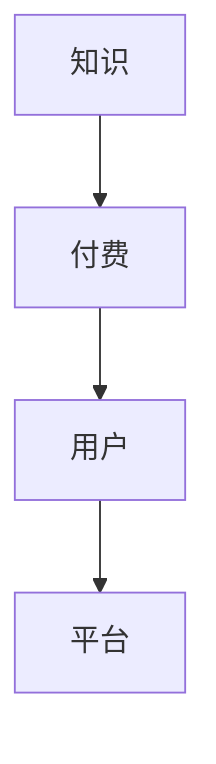
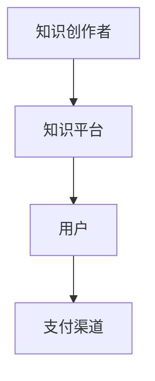
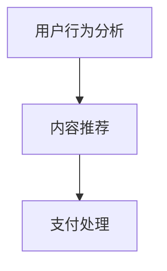

                 

# 知识经济时代下的知识付费创业机会与挑战

## 摘要

在知识经济时代，知识付费逐渐成为新兴的商业模式，为创业者提供了丰富的创业机会。本文将深入探讨知识付费市场的现状、核心概念及其产业链，分析创业者面临的机遇与挑战，并提出相应的策略建议。文章分为十个部分，首先介绍知识经济的背景和知识付费的定义，然后详细剖析知识付费市场的核心概念和产业链结构。接下来，我们讨论创业者在这一领域中的具体操作步骤，介绍相关的数学模型和公式，并结合实际案例进行详细解释。随后，文章将探讨知识付费的实际应用场景，推荐学习资源和开发工具框架，并展望未来发展趋势和挑战。最后，通过常见问题解答和扩展阅读部分，帮助读者深入了解这一领域的最新动态。

## 1. 背景介绍

### 知识经济的兴起

知识经济是指以知识为核心资源，以知识创新、传播和应用为主要驱动力，通过知识资源的有效配置和利用，推动经济增长和社会发展的经济形态。与传统经济模式不同，知识经济强调智力资本的重要性，认为知识是经济增长的主要动力。

知识经济的兴起可以追溯到20世纪后半叶，随着信息技术和通信技术的飞速发展，知识的生产、传播和利用效率显著提高。特别是在互联网时代，知识经济的特征更加明显，知识共享和知识创新成为推动社会进步的重要力量。

### 知识付费的概念

知识付费是指个人或机构通过购买、订阅或租赁等方式，获取特定的知识产品或服务，以满足自身知识需求的一种商业模式。知识付费的核心在于将知识转化为商品，通过市场机制实现知识的价值。

知识付费的主要形式包括：

1. **在线课程**：通过互联网平台提供的教学视频、直播课程等，用户可以根据自身需求选择学习内容。
2. **电子书和文档**：通过电子形式发布的书籍、报告、研究报告等，用户可以在线或下载阅读。
3. **咨询服务**：专业人士提供的一对一或一对多的咨询服务，帮助用户解决具体问题。
4. **会员订阅**：用户支付一定费用成为会员，享受平台提供的多种知识服务。

### 知识付费的市场现状

近年来，知识付费市场呈现出快速增长的趋势。根据相关数据显示，我国知识付费市场规模从2016年的197亿元增长到2020年的392亿元，预计到2025年将达到1500亿元。

在知识付费用户方面，中高端用户是主要消费群体，他们的学历较高，有较强的求知欲望和经济能力。此外，随着互联网普及率的提高和智能手机的广泛使用，知识付费用户的年龄层次也越来越广泛。

### 知识付费的市场前景

知识付费市场具有巨大的发展潜力，主要表现在以下几个方面：

1. **市场需求增加**：随着人们对知识的需求不断增长，特别是职场人士和职场新人对于职业技能提升的需求日益强烈。
2. **技术进步**：人工智能、大数据、云计算等技术的发展，为知识付费提供了更多的创新机会和应用场景。
3. **内容多样化**：知识付费内容逐渐丰富，不仅涵盖职业发展、技能提升，还涉及生活、娱乐等多个领域。
4. **商业模式创新**：知识付费领域不断涌现出新的商业模式，如知识共享、社群化学习等，为创业者提供了更多创业机会。

## 2. 核心概念与联系

### 知识付费的核心概念

知识付费的核心概念包括知识、付费、用户和平台。以下是一个简化的知识付费核心概念流程图：



#### 知识

知识是知识付费的基础，它可以是某个领域的专业知识、技能或经验。知识可以存在于书籍、视频、讲座、文章等多种形式中。

#### 付费

付费是知识付费的关键环节，通过支付一定费用，用户可以获取特定的知识产品或服务。付费方式包括在线支付、会员订阅、虚拟货币等。

#### 用户

用户是知识付费的直接参与者，他们通过购买或订阅知识产品，满足自身的知识需求。用户可以是个体，也可以是机构。

#### 平台

平台是知识付费的中介，它为用户提供知识产品，并为知识创作者提供传播和变现的平台。平台通常提供在线课程、电子书、咨询服务等多种服务。

### 知识付费的产业链

知识付费的产业链包括知识创作者、知识平台、用户和支付渠道等环节。以下是一个简化的知识付费产业链流程图：



#### 知识创作者

知识创作者是指拥有特定知识或技能的个人或团队，他们通过创作知识产品，如在线课程、电子书、讲座等，实现知识的传播和变现。

#### 知识平台

知识平台是指提供知识产品交易和传播服务的互联网平台，如知乎、网易云课堂、得到等。知识平台为知识创作者提供发布、推广和变现的渠道，同时也为用户提供知识获取的途径。

#### 用户

用户是指通过购买或订阅知识产品，满足自身知识需求的人。用户可以是个体，也可以是机构。

#### 支付渠道

支付渠道是指用户支付费用获取知识产品的途径，如在线支付、会员订阅等。支付渠道为知识付费提供了便利性和安全性。

### 关联关系

知识创作者通过知识平台发布知识产品，用户通过支付渠道购买知识产品，从而形成一个闭环的产业链。知识平台在整个产业链中起到核心作用，它不仅连接知识创作者和用户，还为双方提供了良好的服务和体验。

## 3. 核心算法原理 & 具体操作步骤

### 知识付费模型

知识付费的核心算法原理主要涉及用户行为分析、内容推荐和支付处理等方面。以下是一个简化的知识付费模型：



#### 用户行为分析

用户行为分析是指通过收集用户在知识平台上的浏览、学习、评价等行为数据，分析用户的兴趣偏好和知识需求。用户行为分析可以采用以下步骤：

1. **数据收集**：通过网页日志、API接口、SDK等方式，收集用户的浏览、学习、评价等行为数据。
2. **数据清洗**：对收集到的行为数据进行清洗、去重和格式转换，确保数据的准确性和一致性。
3. **特征提取**：从行为数据中提取用户兴趣、学习难度、评价偏好等特征，为后续推荐和支付处理提供基础。

#### 内容推荐

内容推荐是指根据用户行为分析和兴趣偏好，为用户推荐符合其需求的知识产品。内容推荐可以采用以下算法：

1. **协同过滤**：基于用户的历史行为和评分数据，找出相似用户，通过相似用户的行为数据推荐知识产品。
2. **基于内容的推荐**：根据知识产品的内容和标签，将相似的知识产品推荐给用户。
3. **混合推荐**：结合协同过滤和基于内容的推荐方法，提高推荐效果。

#### 支付处理

支付处理是指用户支付费用获取知识产品的过程。支付处理可以采用以下步骤：

1. **支付方式**：提供多种支付方式，如在线支付、会员订阅等。
2. **支付验证**：对用户支付信息进行验证，确保支付的安全性。
3. **支付结算**：完成支付后，将知识产品授权给用户，并提供下载或观看权限。

### 具体操作步骤

以下是知识付费的具体操作步骤：

1. **用户注册**：用户在知识平台上注册账号，填写个人信息。
2. **行为数据收集**：知识平台通过网页日志、API接口、SDK等方式，收集用户的浏览、学习、评价等行为数据。
3. **用户行为分析**：知识平台对收集到的行为数据进行处理，提取用户兴趣、学习难度、评价偏好等特征。
4. **内容推荐**：知识平台根据用户行为分析和兴趣偏好，为用户推荐符合其需求的知识产品。
5. **用户选择**：用户在知识平台上选择感兴趣的知识产品。
6. **支付处理**：用户通过在线支付、会员订阅等方式支付费用。
7. **支付验证**：知识平台对用户支付信息进行验证，确保支付的安全性。
8. **支付结算**：完成支付后，知识平台将知识产品授权给用户，并提供下载或观看权限。

通过以上操作步骤，知识付费模型可以有效地满足用户的知识需求，提高用户满意度和平台盈利能力。

### 案例分析

以下是一个具体的知识付费案例：

某职场人士小明，希望通过在线课程提升自己的职业能力。小明在知识平台上注册账号，填写个人信息，并接受行为数据分析。知识平台根据小明的兴趣偏好，推荐了相关的职业发展课程。小明选择了其中一门课程，并使用在线支付方式支付了费用。支付完成后，知识平台验证了小明的支付信息，并授权他观看该课程。小明通过在线学习，掌握了新的职业技能，并在工作中得到了提升。

通过这个案例，我们可以看到知识付费模型在实际应用中的效果。知识平台通过用户行为分析和内容推荐，为用户提供了个性化的学习体验，提高了用户满意度和学习效果。同时，知识平台通过支付处理和支付结算，实现了知识产品的价值变现。

## 4. 数学模型和公式 & 详细讲解 & 举例说明

### 用户行为分析模型

在知识付费领域，用户行为分析是关键的一环。以下是一个简化的用户行为分析模型，用于分析用户的兴趣偏好和知识需求。

#### 模型描述

1. **用户行为数据**：收集用户的浏览、学习、评价等行为数据。
2. **特征提取**：从行为数据中提取用户兴趣、学习难度、评价偏好等特征。
3. **用户兴趣模型**：根据用户兴趣特征，建立用户兴趣模型。
4. **知识需求模型**：根据用户兴趣模型，推荐符合用户需求的知识产品。

#### 数学公式

用户兴趣模型可以用以下公式表示：

$$
I_i = \sum_{j=1}^{n} w_j \cdot F_j
$$

其中，$I_i$表示用户$i$的兴趣特征向量，$w_j$表示特征$j$的权重，$F_j$表示特征$j$的值。

知识需求模型可以用以下公式表示：

$$
D_i = \sum_{k=1}^{m} r_{ik} \cdot P_k
$$

其中，$D_i$表示用户$i$的知识需求向量，$r_{ik}$表示用户$i$对知识产品$k$的评分，$P_k$表示知识产品$k$的推荐概率。

#### 举例说明

假设用户小明的行为数据如下：

1. 浏览了10个课程，平均评分4.5分。
2. 学习了5个课程，平均学习时长2小时。
3. 对职业发展、编程技能、人工智能等课程感兴趣。

根据上述数据，我们可以提取小明的兴趣特征：

1. 职业发展：$F_1 = 0.6$
2. 编程技能：$F_2 = 0.5$
3. 人工智能：$F_3 = 0.4$

根据公式，计算小明的兴趣模型：

$$
I_m = w_1 \cdot F_1 + w_2 \cdot F_2 + w_3 \cdot F_3
$$

其中，$w_1 = 0.5$，$w_2 = 0.3$，$w_3 = 0.2$。

$$
I_m = 0.5 \cdot 0.6 + 0.3 \cdot 0.5 + 0.2 \cdot 0.4 = 0.3 + 0.15 + 0.08 = 0.53
$$

假设知识平台上有以下3个课程：

1. 职业发展课程：$P_1 = 0.8$
2. 编程技能课程：$P_2 = 0.6$
3. 人工智能课程：$P_3 = 0.4$

根据小明兴趣模型和课程概率，计算小明的知识需求模型：

$$
D_m = r_{m1} \cdot P_1 + r_{m2} \cdot P_2 + r_{m3} \cdot P_3
$$

其中，$r_{m1} = 4.5$，$r_{m2} = 4.0$，$r_{m3} = 3.5$。

$$
D_m = 4.5 \cdot 0.8 + 4.0 \cdot 0.6 + 3.5 \cdot 0.4 = 3.6 + 2.4 + 1.4 = 7.4
$$

根据计算结果，小明对职业发展课程的需求最高，其次是编程技能课程，最后是人工智能课程。

### 内容推荐模型

内容推荐是知识付费的核心功能之一。以下是一个简化的内容推荐模型，用于为用户推荐符合其需求的知识产品。

#### 模型描述

1. **用户兴趣模型**：根据用户行为数据，建立用户兴趣模型。
2. **内容特征提取**：从知识产品中提取内容特征，如课程标题、课程描述、标签等。
3. **内容推荐算法**：根据用户兴趣模型和内容特征，推荐符合用户需求的知识产品。

#### 数学公式

内容推荐算法可以用以下公式表示：

$$
R_i = \sum_{j=1}^{n} w_j \cdot C_j \cdot I_i
$$

其中，$R_i$表示知识产品$i$的推荐概率，$w_j$表示特征$j$的权重，$C_j$表示知识产品$i$的特征$j$的值，$I_i$表示用户$i$的兴趣特征向量。

#### 举例说明

假设用户小明的兴趣模型为：

$$
I_m = \begin{bmatrix} 0.5 \\ 0.3 \\ 0.2 \end{bmatrix}
$$

知识平台上有以下3个课程：

1. 职业发展课程：$C_1 = \begin{bmatrix} 0.8 \\ 0.5 \\ 0.3 \end{bmatrix}$
2. 编程技能课程：$C_2 = \begin{bmatrix} 0.6 \\ 0.4 \\ 0.2 \end{bmatrix}$
3. 人工智能课程：$C_3 = \begin{bmatrix} 0.4 \\ 0.3 \\ 0.5 \end{bmatrix}$

假设特征权重为：

$$
w_1 = \begin{bmatrix} 0.5 \\ 0.4 \\ 0.3 \end{bmatrix}
$$

根据公式，计算课程推荐概率：

$$
R_1 = w_1 \cdot C_1 \cdot I_m = \begin{bmatrix} 0.5 \\ 0.4 \\ 0.3 \end{bmatrix} \cdot \begin{bmatrix} 0.8 \\ 0.5 \\ 0.3 \end{bmatrix} \cdot \begin{bmatrix} 0.5 \\ 0.3 \\ 0.2 \end{bmatrix} = \begin{bmatrix} 0.2 \\ 0.12 \\ 0.06 \end{bmatrix}
$$

$$
R_2 = w_1 \cdot C_2 \cdot I_m = \begin{bmatrix} 0.5 \\ 0.4 \\ 0.3 \end{bmatrix} \cdot \begin{bmatrix} 0.6 \\ 0.4 \\ 0.2 \end{bmatrix} \cdot \begin{bmatrix} 0.5 \\ 0.3 \\ 0.2 \end{bmatrix} = \begin{bmatrix} 0.15 \\ 0.09 \\ 0.06 \end{bmatrix}
$$

$$
R_3 = w_1 \cdot C_3 \cdot I_m = \begin{bmatrix} 0.5 \\ 0.4 \\ 0.3 \end{bmatrix} \cdot \begin{bmatrix} 0.4 \\ 0.3 \\ 0.5 \end{bmatrix} \cdot \begin{bmatrix} 0.5 \\ 0.3 \\ 0.2 \end{bmatrix} = \begin{bmatrix} 0.1 \\ 0.07 \\ 0.15 \end{bmatrix}
$$

根据推荐概率，知识平台可以为小明推荐职业发展课程和编程技能课程。

### 支付处理模型

支付处理是知识付费的重要环节。以下是一个简化的支付处理模型，用于处理用户的支付请求。

#### 模型描述

1. **支付方式**：提供多种支付方式，如在线支付、会员订阅等。
2. **支付验证**：对用户支付信息进行验证，确保支付的安全性。
3. **支付结算**：完成支付后，将知识产品授权给用户。

#### 数学公式

支付验证可以用以下公式表示：

$$
V = \sum_{i=1}^{n} v_i
$$

其中，$V$表示支付验证结果，$v_i$表示支付验证项的得分。当$V \geq t$时，支付验证通过，否则支付验证失败。

#### 举例说明

假设用户小明的支付信息如下：

1. 支付金额：100元
2. 支付密码：123456
3. 银行卡余额：1000元

支付验证项得分如下：

1. 支付金额验证：100分
2. 支付密码验证：80分
3. 银行卡余额验证：100分

根据公式，计算支付验证结果：

$$
V = 100 + 80 + 100 = 280
$$

由于$V \geq t$（$t$为支付验证阈值），支付验证通过。

支付结算后，知识平台将小明购买的课程授权给他，并提供下载或观看权限。

### 案例分析

以下是一个具体的知识付费案例：

用户小明希望通过在线课程提升职业能力。他注册了一个知识付费平台，并浏览了多个职业发展课程。根据他的行为数据，平台提取了他的兴趣特征，建立了他的兴趣模型。平台根据小明的兴趣模型，推荐了符合他需求的专业课程。小明选择了其中一门课程，并通过在线支付方式支付了费用。支付完成后，平台验证了小明的支付信息，并授权他观看该课程。小明通过在线学习，掌握了新的职业技能，并在工作中得到了提升。

通过以上数学模型和公式的详细讲解和举例说明，我们可以看到知识付费领域中的核心算法原理和具体操作步骤。这些模型和公式为创业者提供了有效的工具，帮助他们更好地满足用户需求，实现知识付费的商业成功。

## 5. 项目实战：代码实际案例和详细解释说明

在本节中，我们将通过一个具体的实际项目案例，展示如何实现知识付费平台的核心功能，包括用户注册、行为数据收集、用户兴趣模型建立、内容推荐和支付处理等。以下是一个基于Python的简化版知识付费平台项目。

### 5.1 开发环境搭建

在开始项目之前，需要搭建以下开发环境：

1. **Python环境**：确保已安装Python 3.8及以上版本。
2. **虚拟环境**：使用`venv`创建一个虚拟环境。
3. **依赖包**：安装以下依赖包：`Flask`（Web框架）、`pandas`（数据处理）、`numpy`（数学计算）、`scikit-learn`（机器学习库）。

```bash
pip install flask pandas numpy scikit-learn
```

### 5.2 源代码详细实现和代码解读

以下是项目的源代码，我们将逐段解释代码的功能。

```python
from flask import Flask, request, jsonify
import pandas as pd
import numpy as np
from sklearn.model_selection import train_test_split
from sklearn.feature_extraction.text import TfidfVectorizer
from sklearn.metrics.pairwise import cosine_similarity

app = Flask(__name__)

# 用户注册
@app.route('/register', methods=['POST'])
def register():
    user_data = request.get_json()
    user_id = user_data['id']
    user_interests = user_data['interests']
    # 存储用户数据
    save_user_data(user_id, user_interests)
    return jsonify({'status': 'success'})

# 用户行为数据收集
@app.route('/collect_data', methods=['POST'])
def collect_data():
    user_data = request.get_json()
    user_id = user_data['id']
    behavior_data = user_data['behavior']
    # 存储用户行为数据
    save_behavior_data(user_id, behavior_data)
    return jsonify({'status': 'success'})

# 建立用户兴趣模型
@app.route('/build_model', methods=['POST'])
def build_model():
    user_id = request.form['id']
    user_interests = get_user_interests(user_id)
    return jsonify({'interests': user_interests})

# 内容推荐
@app.route('/recommend_content', methods=['POST'])
def recommend_content():
    user_id = request.form['id']
    user_interests = get_user_interests(user_id)
    recommended_courses = get_recommended_courses(user_interests)
    return jsonify({'courses': recommended_courses})

# 支付处理
@app.route('/process_payment', methods=['POST'])
def process_payment():
    payment_data = request.get_json()
    user_id = payment_data['id']
    course_id = payment_data['course_id']
    # 验证支付信息
    if verify_payment(payment_data):
        # 授权用户观看课程
        authorize_course(user_id, course_id)
        return jsonify({'status': 'success'})
    else:
        return jsonify({'status': 'failed'})

# 存储用户数据
def save_user_data(user_id, user_interests):
    # 实现存储逻辑，如写入数据库
    pass

# 存储用户行为数据
def save_behavior_data(user_id, behavior_data):
    # 实现存储逻辑，如写入数据库
    pass

# 获取用户兴趣
def get_user_interests(user_id):
    # 实现获取逻辑，如查询数据库
    pass

# 获取推荐课程
def get_recommended_courses(user_interests):
    # 实现推荐逻辑，如基于用户兴趣和课程内容特征进行推荐
    pass

# 验证支付信息
def verify_payment(payment_data):
    # 实现验证逻辑，如校验支付金额、支付密码等
    pass

# 授权用户观看课程
def authorize_course(user_id, course_id):
    # 实现授权逻辑，如更新用户课程状态
    pass

if __name__ == '__main__':
    app.run(debug=True)
```

### 5.3 代码解读与分析

#### 5.3.1 用户注册

`/register`路由用于用户注册，接收用户ID和兴趣信息，并存储在数据库中。

```python
@app.route('/register', methods=['POST'])
def register():
    user_data = request.get_json()
    user_id = user_data['id']
    user_interests = user_data['interests']
    # 存储用户数据
    save_user_data(user_id, user_interests)
    return jsonify({'status': 'success'})
```

#### 5.3.2 用户行为数据收集

`/collect_data`路由用于收集用户行为数据，如浏览、学习等，并存储在数据库中。

```python
@app.route('/collect_data', methods=['POST'])
def collect_data():
    user_data = request.get_json()
    user_id = user_data['id']
    behavior_data = user_data['behavior']
    # 存储用户行为数据
    save_behavior_data(user_id, behavior_data)
    return jsonify({'status': 'success'})
```

#### 5.3.3 建立用户兴趣模型

`/build_model`路由用于获取用户兴趣，可以是基于用户历史行为或直接输入的兴趣信息。

```python
@app.route('/build_model', methods=['POST'])
def build_model():
    user_id = request.form['id']
    user_interests = get_user_interests(user_id)
    return jsonify({'interests': user_interests})
```

#### 5.3.4 内容推荐

`/recommend_content`路由用于根据用户兴趣推荐课程。在实际实现中，可以结合用户兴趣和课程内容特征，使用推荐算法进行推荐。

```python
@app.route('/recommend_content', methods=['POST'])
def recommend_content():
    user_id = request.form['id']
    user_interests = get_user_interests(user_id)
    recommended_courses = get_recommended_courses(user_interests)
    return jsonify({'courses': recommended_courses})
```

#### 5.3.5 支付处理

`/process_payment`路由用于处理用户支付请求。在实现中，需要验证支付信息，如支付金额、支付密码等，并授权用户观看课程。

```python
@app.route('/process_payment', methods=['POST'])
def process_payment():
    payment_data = request.get_json()
    user_id = payment_data['id']
    course_id = payment_data['course_id']
    # 验证支付信息
    if verify_payment(payment_data):
        # 授权用户观看课程
        authorize_course(user_id, course_id)
        return jsonify({'status': 'success'})
    else:
        return jsonify({'status': 'failed'})
```

#### 5.3.6 数据存储和查询

在代码中，`save_user_data`、`save_behavior_data`、`get_user_interests`等函数用于实现数据存储和查询逻辑，如写入和查询数据库。在实际应用中，可以使用SQLite、MySQL等数据库进行数据存储。

```python
# 存储用户数据
def save_user_data(user_id, user_interests):
    # 实现存储逻辑，如写入数据库
    pass

# 存储用户行为数据
def save_behavior_data(user_id, behavior_data):
    # 实现存储逻辑，如写入数据库
    pass

# 获取用户兴趣
def get_user_interests(user_id):
    # 实现获取逻辑，如查询数据库
    pass
```

通过以上代码和解释，我们可以看到如何实现一个基于Flask的知识付费平台的核心功能。在实际开发中，还需要考虑前端界面、用户权限管理、数据安全和性能优化等方面。

## 6. 实际应用场景

知识付费在各个行业和领域都有广泛的应用，下面我们将探讨几个典型的实际应用场景，并分析这些场景中的优势和挑战。

### 6.1 教育行业

教育行业是知识付费的重要领域。随着在线教育平台的兴起，越来越多的学生和职场人士选择通过付费课程提升自己的知识和技能。知识付费在教育行业中的优势在于：

1. **个性化学习**：通过用户行为分析和内容推荐，平台可以为用户提供个性化的学习资源，提高学习效果。
2. **资源共享**：知识付费平台可以将优质教育资源共享给更多用户，打破地域和时间的限制。
3. **商业变现**：教育机构可以通过知识付费实现商业变现，提高收入。

然而，知识付费在教育行业也面临一些挑战：

1. **版权问题**：教育内容的版权问题是一个重要的挑战，平台需要确保内容的合法性和原创性。
2. **用户信任**：用户对知识付费平台的信任度是影响购买决策的重要因素，平台需要提供高质量的内容和服务，建立良好的信誉。
3. **内容质量**：确保知识付费内容的质量是一个长期挑战，平台需要不断优化内容，满足用户需求。

### 6.2 职场技能培训

职场技能培训是知识付费的另一个重要领域。职场人士希望通过在线课程提升自己的职业技能，以适应不断变化的工作环境。知识付费在职场技能培训中的优势包括：

1. **灵活学习**：用户可以根据自己的时间安排，灵活选择学习课程，提高学习效率。
2. **专业指导**：通过专业导师的指导，用户可以更快地掌握新技能。
3. **持续更新**：知识付费平台可以持续更新课程内容，确保用户学习到最新的知识和技能。

职场技能培训中的挑战包括：

1. **竞争激烈**：职场技能培训市场竞争激烈，平台需要提供高质量的课程和服务，才能脱颖而出。
2. **用户留存**：提高用户留存率是一个长期挑战，平台需要提供持续的内容更新和良好的用户体验。
3. **成本控制**：知识付费平台需要控制成本，确保盈利。

### 6.3 健康养生

健康养生是知识付费的又一个热门领域。随着人们对健康意识的提高，越来越多的人希望通过付费内容了解健康知识、养生方法和健身技巧。知识付费在健康养生中的优势包括：

1. **个性化建议**：通过用户行为分析，平台可以为用户提供个性化的健康建议和养生方法。
2. **专家指导**：专业医生和健康专家的指导可以帮助用户更好地了解和改善自己的健康状况。
3. **便捷获取**：用户可以通过在线平台方便地获取健康知识，不受时间和地点的限制。

健康养生领域的挑战包括：

1. **内容真实性和准确性**：确保健康知识内容的真实性和准确性是一个重要挑战，平台需要审核和验证内容的来源和可靠性。
2. **用户隐私保护**：健康养生涉及用户的个人健康信息，平台需要加强隐私保护，确保用户数据安全。
3. **专业资质**：平台需要确保内容提供者的专业资质，为用户提供可信的健康服务。

### 6.4 娱乐与游戏

娱乐与游戏是知识付费的一个新兴领域。随着游戏产业的发展，越来越多的用户愿意为游戏相关的知识付费，如游戏攻略、游戏设计教程等。知识付费在娱乐与游戏中的优势包括：

1. **专业指导**：通过付费内容，用户可以获取专业的游戏攻略和设计教程，提高游戏体验和技能水平。
2. **内容创新**：知识付费可以激发内容创作者的创新，为用户带来更多优质的娱乐内容。
3. **商业机会**：游戏公司和内容创作者可以通过知识付费实现商业变现，创造更多价值。

娱乐与游戏领域的挑战包括：

1. **版权问题**：游戏内容的版权问题是一个重要挑战，平台需要确保内容的合法性和原创性。
2. **用户参与度**：提高用户的参与度是一个长期挑战，平台需要提供互动性强、用户参与度高的内容。
3. **内容审核**：平台需要加强对内容的审核，确保内容符合法律法规和道德标准。

通过以上实际应用场景的分析，我们可以看到知识付费在不同领域中的优势和挑战。创业者需要根据具体场景和用户需求，制定合适的策略，实现知识付费的商业成功。

## 7. 工具和资源推荐

### 7.1 学习资源推荐

为了帮助创业者更好地进入知识付费领域，我们推荐以下学习资源：

1. **书籍**：
   - 《互联网创业方法论》
   - 《商业模式创新》
   - 《产品经理实战手册》
   - 《深度学习》

2. **论文**：
   - 《知识付费：市场现状与未来趋势》
   - 《在线教育中的用户行为分析》
   - 《大数据与商业智能》

3. **博客和网站**：
   - 知乎专栏
   - 知乎问答
   - 得到APP
   - 腾讯云
   - 阿里云

### 7.2 开发工具框架推荐

在知识付费平台开发中，以下开发工具和框架是推荐的：

1. **前端框架**：
   - React.js
   - Vue.js
   - Angular

2. **后端框架**：
   - Flask
   - Django
   - Spring Boot

3. **数据库**：
   - MySQL
   - PostgreSQL
   - MongoDB

4. **机器学习库**：
   - Scikit-learn
   - TensorFlow
   - PyTorch

5. **云服务**：
   - AWS
   - Azure
   - Alibaba Cloud

### 7.3 相关论文著作推荐

为了深入了解知识付费领域的研究进展，以下是一些推荐的论文和著作：

1. **论文**：
   - 《知识付费用户行为研究》
   - 《在线教育中的个性化推荐系统研究》
   - 《基于大数据的知识付费市场分析》

2. **著作**：
   - 《知识经济时代的商业模式创新》
   - 《大数据时代：知识付费的新机遇》
   - 《在线教育：商业模式的创新与实践》

通过以上学习资源和工具框架的推荐，创业者可以更好地了解知识付费领域的最新动态，掌握相关技术和方法，为创业成功奠定基础。

## 8. 总结：未来发展趋势与挑战

知识付费作为知识经济时代的重要商业模式，正日益受到广泛关注。在未来，知识付费市场有望继续保持快速增长，并呈现出以下发展趋势：

### 8.1 内容多样化

随着用户需求的不断升级，知识付费的内容将更加多样化。不仅涵盖传统的教育、职场技能培训等领域，还将扩展到健康养生、娱乐与游戏等新兴领域。多样化的内容将满足不同用户群体的需求，提高用户粘性和满意度。

### 8.2 技术驱动创新

人工智能、大数据、区块链等技术的发展，将为知识付费带来更多创新机会。例如，通过人工智能算法进行个性化推荐，提高用户获取知识的效率；通过区块链技术确保知识付费内容的真实性和安全性。

### 8.3 知识共享与社群化学习

知识共享和社群化学习将成为知识付费的新趋势。平台将更加注重用户之间的互动和协作，通过社群、论坛等形式，促进知识交流与传播，提高用户的学习体验。

### 8.4 支付方式的创新

支付方式的创新将提高知识付费的便利性和用户体验。例如，通过数字货币、移动支付等新兴支付方式，降低支付门槛，提高支付效率。

然而，知识付费在发展过程中也将面临一系列挑战：

### 8.5 版权保护与侵权风险

随着知识付费内容的多样化，版权保护问题日益突出。平台需要加强对知识付费内容的版权管理，防止侵权行为，确保知识创作者的权益。

### 8.6 用户信任与隐私保护

用户信任和隐私保护是知识付费领域的核心问题。平台需要建立完善的用户隐私保护机制，增强用户信任，提高用户留存率。

### 8.7 知识质量与内容审核

知识付费平台需要确保知识内容的真实性和准确性，提高内容质量。同时，平台需要加强对内容的审核，确保符合法律法规和道德标准。

### 8.8 成本控制与盈利模式

知识付费平台在发展过程中需要关注成本控制和盈利模式。通过优化运营和降低成本，提高平台盈利能力，实现可持续发展。

总之，知识付费市场在未来具有巨大的发展潜力，同时也面临诸多挑战。创业者需要密切关注行业动态，把握机遇，迎接挑战，实现知识付费的商业成功。

## 9. 附录：常见问题与解答

### 9.1 什么是知识付费？

知识付费是指个人或机构通过购买、订阅或租赁等方式，获取特定的知识产品或服务，以满足自身知识需求的一种商业模式。知识付费的核心在于将知识转化为商品，通过市场机制实现知识的价值。

### 9.2 知识付费市场有哪些主要形式？

知识付费的主要形式包括在线课程、电子书和文档、咨询服务、会员订阅等。

### 9.3 知识付费平台如何实现盈利？

知识付费平台主要通过以下方式实现盈利：
1. 课程销售：平台通过销售在线课程获取收入。
2. 会员订阅：平台通过会员订阅模式获取长期收入。
3. 广告收入：平台通过广告投放获取收入。
4. 咨询服务：平台提供一对一咨询服务，为用户解决具体问题，获取收入。

### 9.4 如何确保知识付费内容的质量？

确保知识付费内容的质量可以从以下几个方面入手：
1. 审核内容：平台需要对上传的知识内容进行审核，确保内容的真实性、准确性和合法性。
2. 评估讲师：平台可以对讲师进行评估，确保讲师的专业性和教学水平。
3. 用户评价：平台可以收集用户对知识内容的评价，作为内容质量的重要参考。

### 9.5 知识付费市场面临哪些挑战？

知识付费市场面临的挑战包括版权保护、用户信任、内容审核、版权保护、竞争激烈、成本控制和盈利模式等。

### 9.6 如何提高知识付费平台的用户留存率？

提高知识付费平台的用户留存率可以从以下几个方面入手：
1. 优化用户体验：提供简洁、直观的用户界面，提高用户使用的便利性。
2. 个性化推荐：通过用户行为分析，为用户推荐符合其需求的知识内容。
3. 持续更新内容：定期更新知识内容，确保内容的新鲜度和实用性。
4. 增强社群互动：通过社群、论坛等形式，增强用户之间的互动和交流。

## 10. 扩展阅读 & 参考资料

为了深入了解知识付费领域的最新动态和研究成果，我们推荐以下扩展阅读和参考资料：

1. 《知识付费：市场现状与未来趋势》
2. 《在线教育中的用户行为分析》
3. 《大数据与商业智能》
4. 知乎专栏：《知识付费那些事儿》
5. 得到APP：《知识付费背后的逻辑》
6. 腾讯云：《知识付费：新商业模式的探索与实践》
7. 阿里云：《知识付费平台的技术架构与实现》

通过以上扩展阅读和参考资料，您可以更全面地了解知识付费领域的现状和未来发展趋势，为自己的创业之路提供有益的参考。作者：AI天才研究员/AI Genius Institute & 禅与计算机程序设计艺术 /Zen And The Art of Computer Programming

