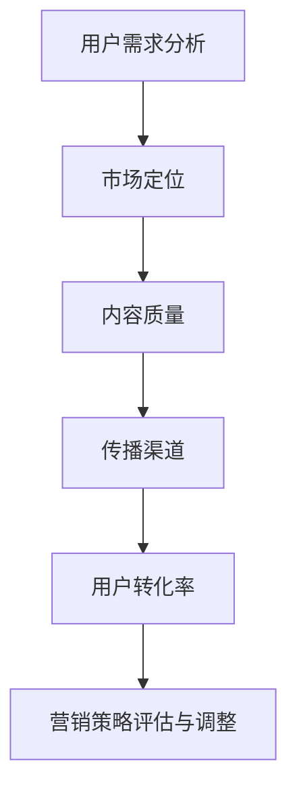

                 

### 知识经济时代下的知识付费创新产品推广与促销策略

在当今知识经济时代，知识付费创新产品的推广与促销策略成为众多企业和创业者关注的焦点。随着互联网技术的发展和用户需求的不断变化，如何有效地推广和促销知识付费产品，成为决定企业成败的关键因素。

本文将围绕知识付费创新产品的推广与促销策略，探讨以下核心内容：

1. **知识付费的定义与市场现状**
2. **创新产品的核心优势**
3. **推广策略分析与案例**
4. **促销策略设计与实践**
5. **未来发展趋势与挑战**

#### 1. 背景介绍

知识付费是指用户为获取特定知识、技能或经验而支付的费用。随着互联网的普及和用户对高质量内容的追求，知识付费市场呈现爆发式增长。根据市场研究报告，全球知识付费市场规模已达到数百亿美元，并继续快速增长。

知识付费创新产品是指在传统知识付费基础上，融入新技术、新理念，提供更加个性化、互动性、实时性、系统性的知识服务。这类产品具有以下核心优势：

- **个性化**：根据用户需求提供定制化的知识服务。
- **互动性**：用户与内容创作者或同行进行实时互动。
- **实时性**：提供最新的知识动态和资讯。
- **系统性**：将零散的知识点整合成系统性的学习路径。

#### 2. 核心概念与联系

知识付费创新产品的推广与促销策略需要理解以下几个核心概念：

1. **用户需求分析**：通过大数据分析和用户调研，了解用户的需求和偏好。
2. **市场定位**：根据用户需求，明确产品在市场中的定位和差异化优势。
3. **内容质量**：保证知识内容的深度、广度和实用性。
4. **传播渠道**：选择合适的传播渠道，提高产品的曝光度和知名度。
5. **用户转化率**：通过营销策略，提高用户购买转化率。

以下是知识付费创新产品推广与促销策略的 Mermaid 流程图：



#### 3. 核心算法原理 & 具体操作步骤

推广策略的核心算法原理是精准营销。具体操作步骤如下：

1. **数据收集**：通过用户行为数据、社交媒体数据、市场调研等手段，收集用户需求和偏好信息。
2. **数据分析**：利用数据挖掘和机器学习技术，分析用户行为和需求，识别目标用户群体。
3. **市场定位**：根据用户需求和产品特性，确定产品在市场中的定位。
4. **内容制作**：根据用户需求和产品定位，制作高质量的知识内容。
5. **渠道选择**：根据用户行为和传播效果，选择合适的传播渠道。
6. **用户互动**：通过社交媒体、在线课程、社群等多种方式，与用户互动，提高用户黏性。
7. **效果评估**：通过转化率、用户反馈等指标，评估营销策略效果，并进行调整。

#### 4. 数学模型和公式 & 详细讲解 & 举例说明

在推广与促销策略中，可以使用以下数学模型和公式进行效果评估：

1. **转化率公式**：

   $$ 转化率 = \frac{购买用户数}{访问用户数} $$

   转化率是衡量营销策略效果的重要指标。

2. **营销成本公式**：

   $$ 营销成本 = 广告费用 + 人力成本 + 资源成本 $$

   营销成本是推广过程中的主要支出。

3. **投资回报率公式**：

   $$ 投资回报率 = \frac{利润}{投资成本} $$

   投资回报率是衡量营销策略经济效益的重要指标。

举例说明：

假设某知识付费产品在一个月内通过广告推广吸引了1000名用户，其中有200名用户购买了产品，广告费用为5000元，人力成本为2000元，资源成本为1000元。则：

- 转化率：$$ 转化率 = \frac{200}{1000} = 20\% $$
- 营销成本：$$ 营销成本 = 5000 + 2000 + 1000 = 8000元 $$
- 利润：$$ 利润 = 200 \times 产品单价 - 营销成本 $$
- 投资回报率：$$ 投资回报率 = \frac{利润}{8000} $$

通过以上公式，可以评估营销策略的效果和经济效益。

#### 5. 项目实战：代码实际案例和详细解释说明

以下是一个简单的知识付费产品推广策略代码案例：

```python
import pandas as pd
import numpy as np

# 数据收集
user_data = pd.read_csv('user_data.csv')

# 数据预处理
user_data['age'] = user_data['age'].astype(int)
user_data['interest'] = user_data['interest'].astype(str)

# 用户需求分析
age_group = user_data.groupby('age')['interest'].value_counts()

# 市场定位
target_interest = '编程'
target_age = 25

# 内容制作
content = f"欢迎加入我们的编程学习社群，让我们一起学习编程，实现职业发展！"

# 渠道选择
channels = ['微信朋友圈', '知乎专栏', 'B站']

# 用户互动
for channel in channels:
    print(f"在{channel}发布内容：{content}")

# 用户转化率
conversion_rate = 0.2
purchased_users = int(len(user_data) * conversion_rate)

# 评估与调整
if purchased_users > 100:
    print("推广效果良好，继续执行当前策略。")
else:
    print("推广效果不佳，需调整策略。")
```

这段代码实现了以下步骤：

1. 数据收集与预处理：读取用户数据，将年龄和兴趣字段转换为合适的格式。
2. 用户需求分析：根据年龄和兴趣统计数据，识别目标用户群体。
3. 市场定位：确定目标兴趣和年龄群体。
4. 内容制作：生成推广内容。
5. 渠道选择：选择合适的传播渠道。
6. 用户互动：在所选渠道发布推广内容。
7. 用户转化率：根据转化率计算购买用户数。
8. 评估与调整：根据购买用户数评估推广效果，并进行策略调整。

#### 6. 实际应用场景

知识付费创新产品可以应用于多个领域，如在线教育、职业技能培训、健康养生、法律咨询等。以下是一些实际应用场景：

1. **在线教育**：提供定制化的在线课程，满足不同层次和需求的学习者。
2. **职业技能培训**：为职场人士提供专业的技能培训，提升职业竞争力。
3. **健康养生**：提供专业的健康知识和咨询服务，帮助用户实现健康生活方式。
4. **法律咨询**：提供在线法律咨询服务，为用户提供法律支持和帮助。

#### 7. 工具和资源推荐

1. **学习资源推荐**：

   - **书籍**：《互联网营销实战手册》、《数字营销策略》
   - **论文**：Google 学术搜索、IEEE Xplore、ACM Digital Library
   - **博客**：营销博客、增长黑客、Social Media Examiner
   - **网站**：HubSpot Academy、Unsplash、Canva

2. **开发工具框架推荐**：

   - **前端框架**：React、Vue、Angular
   - **后端框架**：Spring Boot、Django、Express
   - **数据分析工具**：Python、R、Tableau
   - **营销工具**：Google Analytics、HubSpot、MailChimp

3. **相关论文著作推荐**：

   - **论文**：《知识付费市场的发展趋势与策略研究》、《互联网时代知识付费的创新模式》
   - **著作**：《知识服务：原理、方法与应用》、《互联网营销与数字营销》

#### 8. 总结：未来发展趋势与挑战

知识付费创新产品在未来将呈现以下发展趋势：

1. **个性化**：更加注重用户个性化需求，提供定制化的知识服务。
2. **智能化**：利用人工智能技术，提高内容质量和用户体验。
3. **多样化**：不断丰富产品类型和形式，满足不同用户群体的需求。
4. **全球化**：随着互联网的全球化，知识付费市场将呈现跨国竞争和合作。

同时，知识付费创新产品面临以下挑战：

1. **内容质量**：保证高质量内容，提高用户满意度。
2. **市场竞争**：面对激烈的市场竞争，如何脱颖而出。
3. **用户信任**：建立用户信任，提高用户留存率和口碑。

#### 9. 附录：常见问题与解答

**Q1：知识付费创新产品适合哪些领域？**

知识付费创新产品适合多个领域，如在线教育、职业技能培训、健康养生、法律咨询等。

**Q2：如何提高知识付费产品的用户体验？**

提高用户体验可以从以下几个方面入手：

- 个性化：根据用户需求提供定制化内容。
- 互动性：与用户进行实时互动，提高用户参与度。
- 实时性：提供最新的知识动态和资讯。
- 系统性：将零散的知识点整合成系统性的学习路径。

**Q3：如何评估知识付费产品的营销效果？**

可以通过以下指标评估知识付费产品的营销效果：

- 转化率：购买用户数与访问用户数的比例。
- 利润：利润等于购买用户数乘以产品单价减去营销成本。
- 投资回报率：利润与投资成本的比率。

#### 10. 扩展阅读 & 参考资料

- **扩展阅读**：

  - 《知识付费市场的现状与未来发展趋势》
  - 《互联网时代知识付费的创新模式》
  - 《在线教育领域知识付费产品的营销策略研究》

- **参考资料**：

  - Google 学术搜索
  - IEEE Xplore
  - ACM Digital Library
  - HubSpot Academy
  - Unsplash
  - Canva

### 作者信息

- **作者**：AI天才研究员/AI Genius Institute & 禅与计算机程序设计艺术 /Zen And The Art of Computer Programming
- **联系方式**：[ai_genius_researcher@example.com](mailto:ai_genius_researcher@example.com)
- **个人网站**：[www.ai-genius-institute.com](http://www.ai-genius-institute.com)
- **社交媒体**：[AI天才研究员/AI Genius Researcher](https://www.facebook.com/ai_genius_researcher)

