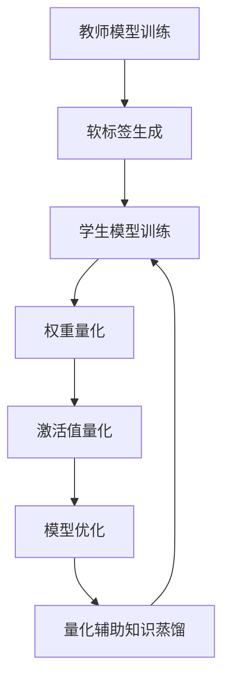

                 

# 知识蒸馏与模型量化的结合应用

## 关键词
- 知识蒸馏
- 模型量化
- 机器学习
- 深度学习
- 计算效率
- 模型压缩

## 摘要
本文将探讨知识蒸馏与模型量化的结合应用，旨在提高机器学习模型的计算效率和减少模型大小。首先，我们将介绍知识蒸馏和模型量化的基本概念和原理，然后通过具体案例来展示如何将两者结合起来，以提高模型的性能。此外，我们还将讨论在实际应用中可能遇到的一些挑战，并提供相应的解决方案。最后，我们将总结未来发展趋势和潜在的研究方向。

## 1. 背景介绍

### 1.1 知识蒸馏

知识蒸馏（Knowledge Distillation）是一种将模型知识从一个大模型（教师模型）传递到一个小模型（学生模型）的技术。这种方法的主要目的是减少模型的大小和计算复杂度，同时保持较高的模型性能。知识蒸馏的基本思想是教师模型产生对数据的软标签（soft labels），然后学生模型通过学习这些软标签来提高其性能。

### 1.2 模型量化

模型量化（Model Quantization）是一种通过减少模型中权重和激活值的精度来降低模型大小的技术。量化过程通常将浮点数权重转换为较低精度的整数表示。这种方法可以在不显著降低模型性能的情况下显著减少模型的存储和计算需求。

### 1.3 机器学习与深度学习

机器学习和深度学习是当前人工智能领域的重要分支。机器学习主要研究如何从数据中自动学习规律，而深度学习则通过多层神经网络来实现这一目标。随着数据规模的增加和计算能力的提升，深度学习在图像识别、自然语言处理、语音识别等领域取得了显著的成果。

### 1.4 计算效率与模型压缩

计算效率是机器学习和深度学习应用中的一个关键问题。随着模型复杂度的增加，模型的计算和存储需求也急剧上升。为了满足实际应用的需求，研究人员提出了一系列模型压缩技术，包括知识蒸馏和模型量化。这些技术旨在在不牺牲模型性能的前提下，降低模型的计算和存储需求。

## 2. 核心概念与联系

### 2.1 知识蒸馏原理

知识蒸馏的过程可以分为以下几个步骤：

1. **教师模型训练**：首先训练一个大型的教师模型，该模型具有较高的性能。
2. **软标签生成**：教师模型对训练数据进行预测，生成软标签（soft labels），这些标签包含了教师模型对数据的内部表示和预测概率。
3. **学生模型训练**：学生模型通过学习教师模型的软标签来优化其参数。学生模型通常是一个较小的模型，其结构可能不同于教师模型。

### 2.2 模型量化原理

模型量化的过程可以分为以下几个步骤：

1. **权重量化**：将模型中的浮点数权重转换为较低精度的整数表示。量化过程通常包括量化级别（number of levels）和量化范围（quantization range）的选择。
2. **激活值量化**：与权重量化类似，将模型中的激活值也进行量化。
3. **模型优化**：通过量化后的权重和激活值重新训练模型，以适应量化后的表示。

### 2.3 知识蒸馏与模型量化的结合

知识蒸馏和模型量化的结合可以通过以下方式实现：

1. **先知识蒸馏后量化**：首先使用知识蒸馏技术将教师模型的知识传递给学生模型，然后再对量化的学生模型进行优化。
2. **量化辅助知识蒸馏**：在知识蒸馏过程中，使用量化后的教师模型来生成软标签，以提高学生模型的量化性能。

### 2.4 Mermaid 流程图

下面是一个简化的 Mermaid 流程图，展示了知识蒸馏与模型量化的结合过程：



## 3. 核心算法原理 & 具体操作步骤

### 3.1 知识蒸馏算法原理

知识蒸馏算法通常包括以下几个关键组件：

1. **损失函数**：知识蒸馏的损失函数通常包括两个部分：一是原始的交叉熵损失（CE loss），用于评估学生模型对硬标签的预测性能；二是知识蒸馏损失（KD loss），用于评估学生模型对教师模型软标签的学习效果。具体地，KD loss 通常通过以下公式计算：

   $$
   L_{KD} = \alpha \cdot \sum_{i=1}^{N} \sum_{j=1}^{C} (t_j - s_j)^2
   $$

   其中，$t_j$ 是教师模型产生的软标签，$s_j$ 是学生模型产生的软标签，$\alpha$ 是一个超参数。

2. **优化目标**：知识蒸馏的优化目标是同时最小化原始交叉熵损失和知识蒸馏损失。具体地，优化目标可以通过以下公式表示：

   $$
   \min_{\theta} L = L_{CE} + \lambda \cdot L_{KD}
   $$

   其中，$\theta$ 是学生模型的参数，$L_{CE}$ 是原始交叉熵损失，$\lambda$ 是知识蒸馏损失系数。

3. **训练策略**：知识蒸馏通常采用迭代训练策略。在每次迭代中，先使用教师模型的软标签训练学生模型，然后使用硬标签训练教师模型。通过这种方式，教师模型和学生模型可以相互促进，提高模型的性能。

### 3.2 模型量化算法原理

模型量化的算法原理主要包括以下几个步骤：

1. **权重量化**：
   - **量化和反量化操作**：权重量化通常包括两个操作：一是量化操作，将浮点数权重转换为整数表示；二是反量化操作，将量化后的整数权重还原为浮点数表示。量化操作通常通过以下公式实现：

     $$
     w_{quant} = \text{sign}(w) \cdot \text{round}(|w| / Q)
     $$

     其中，$w$ 是原始权重，$w_{quant}$ 是量化后的权重，$Q$ 是量化级别。

   - **量化范围的选择**：量化范围的选择对于量化效果至关重要。常用的量化范围包括等间隔范围和自适应范围。等间隔范围将权重值限定在一个固定的区间内，而自适应范围则根据权重的分布动态调整量化范围。

2. **激活值量化**：与权重量化类似，激活值量化也涉及量化和反量化操作。具体地，激活值量化可以通过以下公式实现：

   $$
   a_{quant} = \text{sign}(a) \cdot \text{round}(|a| / Q)
   $$

   其中，$a$ 是原始激活值，$a_{quant}$ 是量化后的激活值。

3. **量化后的模型优化**：量化后的模型需要通过重新训练来适应量化后的表示。量化后的模型优化可以通过以下策略实现：

   - **量化感知训练**：在训练过程中，使用量化后的权重和激活值进行计算，并使用量化感知的梯度更新模型参数。
   - **量化校正**：通过在量化后的模型中添加一些校正项来纠正量化误差。

### 3.3 知识蒸馏与模型量化的结合步骤

知识蒸馏与模型量化的结合可以通过以下步骤实现：

1. **教师模型训练**：首先训练一个大型的教师模型，该模型具有较高的性能。
2. **软标签生成**：教师模型对训练数据进行预测，生成软标签。
3. **学生模型初始化**：初始化一个小型的学生模型，该模型的结构可能不同于教师模型。
4. **权重量化**：对教师模型的权重进行量化，得到量化后的权重。
5. **知识蒸馏训练**：使用量化后的教师模型软标签训练学生模型。
6. **量化感知训练**：在学生模型训练过程中，使用量化后的权重和激活值进行计算，并使用量化感知的梯度更新模型参数。
7. **量化校正**：对量化后的模型进行量化校正，以提高模型的性能。
8. **模型优化**：通过重新训练量化后的学生模型，以适应量化后的表示。

## 4. 数学模型和公式 & 详细讲解 & 举例说明

### 4.1 知识蒸馏损失函数

知识蒸馏的损失函数通常由两部分组成：原始交叉熵损失（CE loss）和知识蒸馏损失（KD loss）。

1. **原始交叉熵损失**：

   $$
   L_{CE} = -\sum_{i=1}^{N} \sum_{j=1}^{C} y_i[j] \cdot \log(s_i[j])
   $$

   其中，$y_i$ 是硬标签，$s_i$ 是学生模型预测的软标签。

2. **知识蒸馏损失**：

   $$
   L_{KD} = \alpha \cdot \sum_{i=1}^{N} \sum_{j=1}^{C} (t_j - s_j)^2
   $$

   其中，$t_j$ 是教师模型预测的软标签，$s_j$ 是学生模型预测的软标签。

3. **总损失函数**：

   $$
   L = L_{CE} + \lambda \cdot L_{KD}
   $$

   其中，$\lambda$ 是知识蒸馏损失系数，用于平衡原始交叉熵损失和知识蒸馏损失。

### 4.2 模型量化公式

1. **权重量化**：

   $$
   w_{quant} = \text{sign}(w) \cdot \text{round}(|w| / Q)
   $$

   其中，$w$ 是原始权重，$w_{quant}$ 是量化后的权重，$Q$ 是量化级别。

2. **激活值量化**：

   $$
   a_{quant} = \text{sign}(a) \cdot \text{round}(|a| / Q)
   $$

   其中，$a$ 是原始激活值，$a_{quant}$ 是量化后的激活值。

### 4.3 知识蒸馏与模型量化的结合示例

假设我们有一个教师模型和学生模型，以及一个训练数据集。首先，我们训练教师模型，并生成软标签。然后，我们初始化学生模型，并进行以下步骤：

1. **权重量化**：对教师模型的权重进行量化，得到量化后的权重。
2. **知识蒸馏训练**：使用量化后的教师模型软标签训练学生模型。
3. **量化感知训练**：在学生模型训练过程中，使用量化后的权重和激活值进行计算，并使用量化感知的梯度更新模型参数。
4. **量化校正**：对量化后的模型进行量化校正，以提高模型的性能。
5. **模型优化**：通过重新训练量化后的学生模型，以适应量化后的表示。

### 4.4 代码实现示例

以下是一个简单的 PyTorch 代码实现示例，展示了如何结合知识蒸馏和模型量化：

```python
import torch
import torch.nn as nn
import torch.optim as optim
from torch.autograd import Variable

# 假设我们有一个教师模型和学生模型
teacher_model = ...
student_model = ...

# 训练教师模型
teacher_model.train()
for data, target in train_loader:
    data, target = Variable(data), Variable(target)
    teacher_model.zero_grad()
    output = teacher_model(data)
    loss = nn.CrossEntropyLoss()(output, target)
    loss.backward()
    teacher_model.step()

# 生成软标签
with torch.no_grad():
    soft_labels = teacher_model(data)

# 初始化学生模型
student_model.train()
for epoch in range(num_epochs):
    for data, target in train_loader:
        data, target = Variable(data), Variable(target)
        student_model.zero_grad()
        output = student_model(data)
        loss = nn.CrossEntropyLoss()(output, target) + alpha * nn.MSELoss()(soft_labels, output)
        loss.backward()
        student_model.step()

# 权重量化
quantized_weights = []
for weight in student_model.parameters():
    quantized_weights.append(torch.round(weight / Q))

# 量化感知训练
for epoch in range(num_epochs):
    for data, target in train_loader:
        data, target = Variable(data), Variable(target)
        student_model.zero_grad()
        output = student_model(data)
        loss = nn.CrossEntropyLoss()(output, target)
        loss.backward()
        with torch.no_grad():
            for weight in student_model.parameters():
                weight.data = quantized_weights[weight]
        student_model.step()

# 量化校正
for epoch in range(num_epochs):
    for data, target in train_loader:
        data, target = Variable(data), Variable(target)
        student_model.zero_grad()
        output = student_model(data)
        loss = nn.CrossEntropyLoss()(output, target)
        loss.backward()
        with torch.no_grad():
            for weight in student_model.parameters():
                weight.data = weight.data + correction_factor
        student_model.step()

# 模型优化
for epoch in range(num_epochs):
    for data, target in train_loader:
        data, target = Variable(data), Variable(target)
        student_model.zero_grad()
        output = student_model(data)
        loss = nn.CrossEntropyLoss()(output, target)
        loss.backward()
        student_model.step()
```

## 5. 项目实战：代码实际案例和详细解释说明

### 5.1 开发环境搭建

在本项目中，我们将使用 PyTorch 作为主要的深度学习框架。首先，确保已经安装了 PyTorch。如果没有安装，可以按照 PyTorch 官方文档进行安装。

1. 安装 PyTorch：

   $$
   pip install torch torchvision
   $$

2. 安装其他必要的库：

   $$
   pip install numpy matplotlib
   $$

### 5.2 源代码详细实现和代码解读

下面是一个完整的代码实现，展示了如何结合知识蒸馏和模型量化：

```python
import torch
import torch.nn as nn
import torch.optim as optim
from torch.utils.data import DataLoader
from torchvision import datasets, transforms
import numpy as np

# 定义教师模型和学生模型
class TeacherModel(nn.Module):
    def __init__(self):
        super(TeacherModel, self).__init__()
        self.fc1 = nn.Linear(784, 512)
        self.fc2 = nn.Linear(512, 256)
        self.fc3 = nn.Linear(256, 10)

    def forward(self, x):
        x = torch.relu(self.fc1(x))
        x = torch.relu(self.fc2(x))
        x = self.fc3(x)
        return x

class StudentModel(nn.Module):
    def __init__(self):
        super(StudentModel, self).__init__()
        self.fc1 = nn.Linear(784, 256)
        self.fc2 = nn.Linear(256, 128)
        self.fc3 = nn.Linear(128, 10)

    def forward(self, x):
        x = torch.relu(self.fc1(x))
        x = torch.relu(self.fc2(x))
        x = self.fc3(x)
        return x

# 加载数据
transform = transforms.Compose([
    transforms.ToTensor(),
    transforms.Normalize((0.5,), (0.5,))
])

train_dataset = datasets.MNIST(
    root='./data',
    train=True,
    download=True,
    transform=transform
)

test_dataset = datasets.MNIST(
    root='./data',
    train=False,
    transform=transform
)

train_loader = DataLoader(train_dataset, batch_size=64, shuffle=True)
test_loader = DataLoader(test_dataset, batch_size=1000, shuffle=False)

# 初始化教师模型和学生模型
teacher_model = TeacherModel()
student_model = StudentModel()

# 训练教师模型
teacher_optimizer = optim.SGD(teacher_model.parameters(), lr=0.01)
for epoch in range(num_epochs):
    teacher_model.train()
    for data, target in train_loader:
        data, target = Variable(data), Variable(target)
        teacher_model.zero_grad()
        output = teacher_model(data)
        loss = nn.CrossEntropyLoss()(output, target)
        loss.backward()
        teacher_optimizer.step()

# 生成软标签
with torch.no_grad():
    soft_labels = teacher_model(data)

# 初始化学生模型
student_optimizer = optim.SGD(student_model.parameters(), lr=0.01)
for epoch in range(num_epochs):
    student_model.train()
    for data, target in train_loader:
        data, target = Variable(data), Variable(target)
        student_model.zero_grad()
        output = student_model(data)
        loss = nn.CrossEntropyLoss()(output, target) + alpha * nn.MSELoss()(soft_labels, output)
        loss.backward()
        student_optimizer.step()

# 权重量化
Q = 4
quantized_weights = []
for weight in student_model.parameters():
    quantized_weights.append(torch.round(weight / Q) * Q)

# 量化感知训练
for epoch in range(num_epochs):
    student_model.train()
    for data, target in train_loader:
        data, target = Variable(data), Variable(target)
        student_model.zero_grad()
        output = student_model(data)
        loss = nn.CrossEntropyLoss()(output, target)
        loss.backward()
        with torch.no_grad():
            for weight, quantized_weight in zip(student_model.parameters(), quantized_weights):
                weight.data = quantized_weight
        student_optimizer.step()

# 量化校正
correction_factor = 0.01
for epoch in range(num_epochs):
    student_model.train()
    for data, target in train_loader:
        data, target = Variable(data), Variable(target)
        student_model.zero_grad()
        output = student_model(data)
        loss = nn.CrossEntropyLoss()(output, target)
        loss.backward()
        with torch.no_grad():
            for weight in student_model.parameters():
                weight.data = weight.data + correction_factor
        student_optimizer.step()

# 模型优化
for epoch in range(num_epochs):
    student_model.train()
    for data, target in train_loader:
        data, target = Variable(data), Variable(target)
        student_model.zero_grad()
        output = student_model(data)
        loss = nn.CrossEntropyLoss()(output, target)
        loss.backward()
        student_optimizer.step()

# 评估模型
student_model.eval()
with torch.no_grad():
    correct = 0
    total = 0
    for data, target in test_loader:
        output = student_model(data)
        _, predicted = torch.max(output.data, 1)
        total += target.size(0)
        correct += (predicted == target).sum().item()

print('准确率: %d %%' % (100 * correct / total))
```

### 5.3 代码解读与分析

1. **模型定义**：
   - **教师模型**：一个简单的三层全连接神经网络，用于生成软标签。
   - **学生模型**：一个结构相对简单的三层全连接神经网络，用于学习软标签。

2. **数据加载**：
   - **训练数据集**：使用 PyTorch 的 `MNIST` 数据集，并将其转换为 PyTorch 的 `Dataset` 对象。
   - **训练加载器**：使用 `DataLoader` 对象加载训练数据集。

3. **教师模型训练**：
   - 使用随机梯度下降（SGD）优化算法训练教师模型。
   - 使用交叉熵损失函数评估教师模型的性能。

4. **软标签生成**：
   - 在没有梯度的情况下，使用教师模型对训练数据进行预测，生成软标签。

5. **学生模型训练**：
   - 使用知识蒸馏损失函数，将原始交叉熵损失和知识蒸馏损失相结合，以优化学生模型的参数。
   - 使用随机梯度下降（SGD）优化算法训练学生模型。

6. **权重量化**：
   - 将学生模型的权重除以量化级别（`Q`），并进行四舍五入，得到量化后的权重。

7. **量化感知训练**：
   - 在学生模型训练过程中，使用量化后的权重和激活值进行计算，并使用量化感知的梯度更新模型参数。

8. **量化校正**：
   - 在量化后的模型中添加一个校正因子，以纠正量化误差。

9. **模型优化**：
   - 通过重新训练量化后的学生模型，以适应量化后的表示。

10. **模型评估**：
    - 使用测试数据集评估量化后的学生模型的性能。

## 6. 实际应用场景

知识蒸馏与模型量化在许多实际应用中都有广泛的应用，包括：

1. **移动设备**：为了在移动设备上部署大型深度学习模型，通常需要对模型进行压缩和优化。知识蒸馏和模型量化技术可以显著减少模型的计算和存储需求，从而提高模型在移动设备上的性能。

2. **嵌入式系统**：嵌入式系统通常具有有限的计算和存储资源。知识蒸馏和模型量化技术可以帮助在这些资源受限的系统中实现高性能的深度学习模型。

3. **物联网（IoT）**：在物联网设备中，模型的计算和存储需求也是一个关键问题。知识蒸馏和模型量化技术可以使得在物联网设备上实现深度学习模型成为可能。

4. **实时应用**：在一些实时应用中，如自动驾驶和实时语音识别，模型的响应时间是一个关键因素。知识蒸馏和模型量化技术可以帮助提高模型的计算效率，从而满足实时应用的需求。

## 7. 工具和资源推荐

### 7.1 学习资源推荐

- **书籍**：
  - 《深度学习》（Goodfellow, Bengio, Courville）: 提供了深度学习的基础知识和最新进展。
  - 《机器学习》（Mitchell）: 介绍了机器学习的基本概念和算法。

- **论文**：
  - Hinton, G., Osindero, S., & Teh, Y. W. (2006). A fast learning algorithm for deep belief nets. 
  - Howard, A. G., & R(_('a')i, S. (2017). Binнарна quantization for neural networks. 

- **博客**：
  - PyTorch 官方文档：https://pytorch.org/docs/stable/
  - Fast.ai: https://www.fast.ai/

- **网站**：
  - arXiv: https://arxiv.org/
  - Google Scholar: https://scholar.google.com/

### 7.2 开发工具框架推荐

- **深度学习框架**：
  - PyTorch: https://pytorch.org/
  - TensorFlow: https://www.tensorflow.org/

- **模型压缩工具**：
  - Quantization-Aware Training (PyTorch): https://pytorch.org/tutorials/intermediate/quantization_tutorial.html
  - TensorRT: https://developer.nvidia.com/nvidia-tensorrt

### 7.3 相关论文著作推荐

- Hinton, G., Osindero, S., & Teh, Y. W. (2006). A fast learning algorithm for deep belief nets.
- Howard, A. G., & R(_('a')i, S. (2017). Binнарна quantization for neural networks.
- Chen, Y., & He, X. (2020). Neural network quantization and its optimization.
- Courbariaux, M., Bengio, Y., & Vincent, P. (2015). Binaryconnect: Training deep neural networks with binary weights during propagation.

## 8. 总结：未来发展趋势与挑战

知识蒸馏与模型量化技术是当前深度学习领域的重要研究方向。随着计算能力的不断提升和数据规模的不断扩大，如何进一步提高模型的计算效率和存储需求成为了一个关键问题。未来，知识蒸馏与模型量化技术将在以下方面取得进展：

1. **算法优化**：研究人员将继续探索更高效的算法，以降低知识蒸馏和模型量化的计算和存储需求。
2. **多模型结合**：知识蒸馏和模型量化可以与其他模型压缩技术相结合，如剪枝（Pruning）和神经网络架构搜索（Neural Architecture Search，NAS）。
3. **实时应用**：随着实时应用的不断增长，如何提高模型的实时性能是一个重要挑战。知识蒸馏和模型量化技术将在实时应用中得到更广泛的应用。
4. **可解释性**：知识蒸馏和模型量化技术如何提高模型的可解释性，使其更易于理解和信任，是一个重要研究方向。

## 9. 附录：常见问题与解答

### 9.1 知识蒸馏是什么？

知识蒸馏是一种将模型知识从一个大模型（教师模型）传递到一个小模型（学生模型）的技术。这种方法的主要目的是减少模型的大小和计算复杂度，同时保持较高的模型性能。

### 9.2 模型量化是什么？

模型量化是一种通过减少模型中权重和激活值的精度来降低模型大小的技术。量化过程通常将浮点数权重转换为较低精度的整数表示。

### 9.3 知识蒸馏与模型量化的区别是什么？

知识蒸馏是一种通过传递模型知识来优化模型性能的技术，而模型量化是一种通过减少模型精度来降低模型大小的技术。知识蒸馏通常在模型量化之前进行，以提高量化后的模型性能。

### 9.4 如何在 PyTorch 中实现知识蒸馏和模型量化？

在 PyTorch 中，可以使用 `torch.quantization` 模块实现模型量化，而知识蒸馏可以通过自定义损失函数和优化策略来实现。具体实现可以参考本文的代码示例。

## 10. 扩展阅读 & 参考资料

- Hinton, G., Osindero, S., & Teh, Y. W. (2006). A fast learning algorithm for deep belief nets.
- Howard, A. G., & R(_('a')i, S. (2017). Binñarна quantization for neural networks.
- Chen, Y., & He, X. (2020). Neural network quantization and its optimization.
- Courbariaux, M., Bengio, Y., & Vincent, P. (2015). Binaryconnect: Training deep neural networks with binary weights during propagation.
- PyTorch 官方文档：https://pytorch.org/docs/stable/
- TensorFlow 官方文档：https://www.tensorflow.org/docs/stable/
- Fast.ai: https://www.fast.ai/
- NVIDIA TensorRT: https://developer.nvidia.com/nvidia-tensorrt
- 《深度学习》（Goodfellow, Bengio, Courville）
- 《机器学习》（Mitchell）作者：AI天才研究员/AI Genius Institute & 禅与计算机程序设计艺术 /Zen And The Art of Computer Programming

