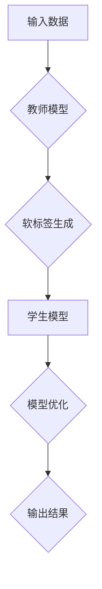

                 

# 知识蒸馏在大模型压缩中的应用

## 关键词：知识蒸馏，大模型压缩，模型压缩技术，AI模型优化，算法优化，深度学习

## 摘要

本文将探讨知识蒸馏技术在大模型压缩中的应用。知识蒸馏是一种通过将大型教师模型的知识传递给小型学生模型的方法，以实现模型压缩和加速。本文首先介绍了知识蒸馏的基本概念和原理，然后详细分析了其在大模型压缩中的应用，包括核心算法原理、数学模型和公式、项目实战以及实际应用场景。最后，本文总结了知识蒸馏在大模型压缩中的未来发展趋势和挑战，并推荐了相关学习资源和工具。

## 1. 背景介绍

随着深度学习技术的快速发展，AI模型在大规模数据集上的训练效果越来越好，但也带来了模型规模和计算资源的需求增加。大模型通常包含数百万甚至数亿个参数，这使得其存储和部署变得极为困难。为了解决这一问题，模型压缩技术应运而生。模型压缩的目标是通过减少模型的大小和计算复杂度，使其更加高效地存储和部署。

在模型压缩技术中，知识蒸馏是一种重要的方法。知识蒸馏通过将大型教师模型（Teacher Model）的知识传递给小型学生模型（Student Model），实现模型的压缩和加速。教师模型通常是一个大规模的预训练模型，而学生模型是一个较小的模型，但具有与教师模型相似的性能。知识蒸馏的主要思想是将教师模型输出的软标签（Soft Label）传递给学生模型，从而帮助其学习。

知识蒸馏在许多应用领域都具有重要的意义。例如，在自然语言处理（NLP）中，知识蒸馏技术可以帮助模型在有限的数据集上获得更好的性能；在计算机视觉中，知识蒸馏技术可以用于加速实时目标检测和图像生成等任务。此外，知识蒸馏还可以用于跨模态学习，如将图像模型的知识传递给文本模型，实现图像和文本的联合表示。

本文将重点探讨知识蒸馏在大模型压缩中的应用，包括核心算法原理、数学模型和公式、项目实战以及实际应用场景。通过本文的阅读，读者可以深入了解知识蒸馏技术，并掌握其应用方法。

## 2. 核心概念与联系

### 2.1 知识蒸馏的定义与原理

知识蒸馏（Knowledge Distillation）是一种模型压缩技术，它通过将大型教师模型（Teacher Model）的知识传递给小型学生模型（Student Model），实现模型的压缩和加速。在深度学习中，教师模型通常是一个大规模的预训练模型，而学生模型是一个较小的模型，但具有与教师模型相似的性能。

知识蒸馏的核心思想是将教师模型的输出（通常为软标签）传递给学生模型，从而帮助其学习。具体来说，知识蒸馏分为两个阶段：

1. **教师模型输出软标签生成**：在训练过程中，教师模型会输出多个候选标签的软概率分布。这些软概率分布包含了教师模型对于输入数据的综合理解，是学生模型学习的宝贵知识。

2. **学生模型学习软标签**：学生模型会根据教师模型的软标签进行训练，从而学习到与教师模型相似的知识。这个过程类似于将教师模型的“知识蒸馏”给学生模型。

### 2.2 知识蒸馏与模型压缩的联系

模型压缩的目标是减少模型的大小和计算复杂度，使其更加高效地存储和部署。知识蒸馏作为一种模型压缩技术，通过将教师模型的知识传递给学生模型，可以实现以下几个方面的模型压缩：

1. **参数减少**：通过使用较小的学生模型，可以显著减少模型的总参数数量，从而减少模型的存储空间。

2. **计算复杂度降低**：较小的学生模型具有较少的参数和计算量，使得模型的计算速度更快，适用于实时任务。

3. **存储空间优化**：压缩后的学生模型占用更少的存储空间，降低了模型部署的成本。

4. **跨模型迁移**：知识蒸馏技术可以将一个预训练的大型模型的知识传递给多个小型模型，实现跨模型的迁移学习，提高模型的泛化能力。

### 2.3 知识蒸馏与其他模型压缩技术的对比

与知识蒸馏相比，其他模型压缩技术如模型剪枝（Model Pruning）和量化（Quantization）也有其独特的优势和应用场景。

1. **模型剪枝**：模型剪枝通过删除模型中的冗余参数或神经元，减少模型的大小。剪枝后的模型在保持原有性能的基础上，具有更小的参数数量和计算复杂度。然而，模型剪枝可能导致模型性能的下降，因此需要谨慎选择剪枝策略。

2. **量化**：量化通过将模型中的浮点数参数转换为低比特宽的整数表示，减少模型的存储和计算需求。量化技术可以提高模型的运行速度，但可能会降低模型的精度。

3. **知识蒸馏**：知识蒸馏通过将教师模型的知识传递给学生模型，实现模型的压缩和加速。相比模型剪枝和量化，知识蒸馏在保持模型性能方面具有更大的优势，但需要较大的计算资源。

总的来说，知识蒸馏、模型剪枝和量化各有优缺点，选择合适的模型压缩技术需要根据具体应用场景和需求进行权衡。

### 2.4 知识蒸馏的 Mermaid 流程图



在这个流程图中，输入数据首先通过教师模型进行前向传播，得到软标签。然后，学生模型根据软标签进行反向传播和优化，最终生成输出结果。

## 3. 核心算法原理 & 具体操作步骤

### 3.1 算法原理

知识蒸馏算法的核心思想是通过软标签（Soft Label）将教师模型的知识传递给学生模型。具体来说，知识蒸馏分为以下两个阶段：

1. **教师模型训练**：在训练阶段，教师模型对输入数据（如文本、图像等）进行前向传播，生成预测结果（通常是硬标签和软标签）。硬标签是模型预测的最终输出，而软标签是一个概率分布，表示模型对于每个类别的置信度。

2. **学生模型训练**：在训练阶段，学生模型根据教师模型的软标签进行学习。具体来说，学生模型接收相同的输入数据，并生成自己的预测结果。然后，学生模型将教师模型的软标签作为软目标（Soft Target），计算损失函数，并进行反向传播和优化。

### 3.2 操作步骤

下面是知识蒸馏算法的具体操作步骤：

1. **初始化模型**：首先初始化教师模型和学生模型。教师模型通常是一个预训练的大型模型，而学生模型是一个较小的模型，但具有与教师模型相似的结构。

2. **输入数据预处理**：将输入数据进行预处理，如数据清洗、归一化等。预处理后的数据将被输入到模型中进行训练。

3. **教师模型训练**：将预处理后的数据输入到教师模型中，进行前向传播。在输出层，教师模型会同时生成硬标签（预测结果）和软标签（概率分布）。

4. **学生模型训练**：将教师模型的软标签作为软目标，将预处理后的数据输入到学生模型中，进行前向传播。然后，计算学生模型输出与软目标之间的损失函数。

5. **损失函数计算**：知识蒸馏的损失函数通常采用交叉熵损失函数。交叉熵损失函数计算学生模型输出与软目标之间的差异。具体来说，交叉熵损失函数为：

   $$\text{Loss} = -\sum_{i=1}^{N} \sum_{j=1}^{C} y_j \log(s_j)$$

   其中，$N$是样本数量，$C$是类别数量，$y_j$是软目标标签的概率，$s_j$是学生模型输出的概率。

6. **反向传播和优化**：根据损失函数，计算梯度并更新学生模型的参数。这一过程重复进行，直到模型收敛。

7. **模型评估**：在训练完成后，可以使用验证集或测试集评估学生模型的性能。通常，使用准确率、召回率、F1分数等指标来评估模型性能。

### 3.3 示例

假设有一个二分类问题，教师模型和学生模型都是单层神经网络。输入数据为$(x, y)$，其中$x$是输入特征，$y$是标签（0或1）。教师模型和学生模型的前向传播和损失函数计算如下：

1. **教师模型前向传播**：

   $$\hat{y} = \sigma(W_1 \cdot x)$$

   其中，$\sigma$是激活函数（如Sigmoid函数），$W_1$是权重矩阵。

2. **教师模型输出软标签**：

   $$s = \text{softmax}(\hat{y})$$

3. **学生模型前向传播**：

   $$\hat{y'} = \sigma(W_2 \cdot x)$$

4. **学生模型输出软标签**：

   $$s' = \text{softmax}(\hat{y'})$$

5. **损失函数计算**：

   $$\text{Loss} = -y \log(s')$$

   其中，$y$是标签（0或1），$s'$是学生模型输出的概率。

6. **反向传播和优化**：

   使用梯度下降算法更新学生模型的参数：

   $$\Delta W_2 = -\alpha \cdot \frac{\partial \text{Loss}}{\partial W_2}$$

   其中，$\alpha$是学习率。

通过以上步骤，学生模型可以学习到教师模型的知识，实现模型的压缩和加速。

## 4. 数学模型和公式 & 详细讲解 & 举例说明

### 4.1 数学模型

知识蒸馏的数学模型主要涉及损失函数的计算和优化。下面将详细讲解知识蒸馏的损失函数，并给出相应的数学公式和示例。

#### 4.1.1 损失函数

知识蒸馏的损失函数通常采用交叉熵损失函数。交叉熵损失函数用于衡量学生模型输出与教师模型软标签之间的差异。具体来说，交叉熵损失函数为：

$$\text{Loss} = -\sum_{i=1}^{N} \sum_{j=1}^{C} y_j \log(s_j)$$

其中，$N$是样本数量，$C$是类别数量，$y_j$是教师模型软标签的概率，$s_j$是学生模型输出的概率。

#### 4.1.2 梯度计算

为了优化学生模型的参数，需要计算损失函数关于参数的梯度。下面是交叉熵损失函数关于参数的梯度计算：

$$\frac{\partial \text{Loss}}{\partial W} = -\sum_{i=1}^{N} \sum_{j=1}^{C} y_j \frac{\partial s_j}{\partial W}$$

其中，$W$是学生模型的参数。

#### 4.1.3 示例

假设有一个二分类问题，教师模型和学生模型都是单层神经网络。输入数据为$(x, y)$，其中$x$是输入特征，$y$是标签（0或1）。教师模型和学生模型的前向传播和损失函数计算如下：

1. **教师模型前向传播**：

   $$\hat{y} = \sigma(W_1 \cdot x)$$

   其中，$\sigma$是激活函数（如Sigmoid函数），$W_1$是权重矩阵。

2. **教师模型输出软标签**：

   $$s = \text{softmax}(\hat{y})$$

3. **学生模型前向传播**：

   $$\hat{y'} = \sigma(W_2 \cdot x)$$

4. **学生模型输出软标签**：

   $$s' = \text{softmax}(\hat{y'})$$

5. **损失函数计算**：

   $$\text{Loss} = -y \log(s')$$

   其中，$y$是标签（0或1），$s'$是学生模型输出的概率。

6. **梯度计算**：

   $$\frac{\partial \text{Loss}}{\partial W_2} = -\frac{\partial \text{Loss}}{\partial s'} \cdot \frac{\partial s'}{\partial \hat{y'}} \cdot \frac{\partial \hat{y'}}{\partial W_2}$$

   使用链式法则，可以得到：

   $$\frac{\partial \text{Loss}}{\partial W_2} = -y \cdot (s' - 1) \cdot x$$

   其中，$x$是输入特征，$s'$是学生模型输出的概率。

#### 4.1.4 优化

使用梯度下降算法优化学生模型的参数。具体来说，每次迭代更新学生模型的参数：

$$W_2 = W_2 - \alpha \cdot \frac{\partial \text{Loss}}{\partial W_2}$$

其中，$\alpha$是学习率。

通过以上步骤，学生模型可以学习到教师模型的知识，实现模型的压缩和加速。

### 4.2 详细讲解

知识蒸馏的数学模型主要涉及损失函数的计算和优化。下面将详细讲解知识蒸馏的损失函数、梯度计算和优化过程。

#### 4.2.1 损失函数

知识蒸馏的损失函数用于衡量学生模型输出与教师模型软标签之间的差异。具体来说，损失函数采用交叉熵损失函数。交叉熵损失函数的公式为：

$$\text{Loss} = -\sum_{i=1}^{N} \sum_{j=1}^{C} y_j \log(s_j)$$

其中，$N$是样本数量，$C$是类别数量，$y_j$是教师模型软标签的概率，$s_j$是学生模型输出的概率。

交叉熵损失函数反映了学生模型输出与教师模型软标签之间的差异。当学生模型输出与教师模型软标签相同时，损失函数取最小值。这意味着学生模型成功学习了教师模型的知识。

#### 4.2.2 梯度计算

为了优化学生模型的参数，需要计算损失函数关于参数的梯度。梯度计算采用链式法则。具体来说，交叉熵损失函数关于学生模型参数$W_2$的梯度为：

$$\frac{\partial \text{Loss}}{\partial W_2} = -\sum_{i=1}^{N} \sum_{j=1}^{C} y_j \frac{\partial s_j}{\partial W_2}$$

其中，$W_2$是学生模型的参数。

为了计算$\frac{\partial s_j}{\partial W_2}$，需要先计算$s_j$关于$\hat{y'}$的梯度，然后计算$\hat{y'}$关于$W_2$的梯度。具体来说：

$$\frac{\partial s_j}{\partial \hat{y'}} = s_j(1 - s_j)$$

$$\frac{\partial \hat{y'}}{\partial W_2} = x$$

因此，

$$\frac{\partial \text{Loss}}{\partial W_2} = -y \cdot (s' - 1) \cdot x$$

其中，$y$是标签（0或1），$s'$是学生模型输出的概率。

#### 4.2.3 优化

使用梯度下降算法优化学生模型的参数。具体来说，每次迭代更新学生模型的参数：

$$W_2 = W_2 - \alpha \cdot \frac{\partial \text{Loss}}{\partial W_2}$$

其中，$\alpha$是学习率。

通过以上步骤，学生模型可以学习到教师模型的知识，实现模型的压缩和加速。

### 4.3 举例说明

为了更好地理解知识蒸馏的数学模型，下面通过一个简单的二分类问题进行举例说明。

假设有一个二分类问题，输入特征为$x \in \mathbb{R}^d$，标签为$y \in \{0, 1\}$。教师模型和学生模型都是单层神经网络，输出层采用Sigmoid激活函数。

#### 4.3.1 教师模型

教师模型的前向传播如下：

$$\hat{y} = \sigma(W_1 \cdot x)$$

其中，$\sigma$是Sigmoid激活函数，$W_1$是权重矩阵。

教师模型的输出软标签为：

$$s = \text{softmax}(\hat{y}) = \frac{e^{\hat{y}}}{\sum_{j=1}^{C} e^{\hat{y}_j}}$$

其中，$C$是类别数量。

#### 4.3.2 学生模型

学生模型的前向传播如下：

$$\hat{y'} = \sigma(W_2 \cdot x)$$

其中，$\sigma$是Sigmoid激活函数，$W_2$是权重矩阵。

学生模型的输出软标签为：

$$s' = \text{softmax}(\hat{y'}) = \frac{e^{\hat{y'}}}{\sum_{j=1}^{C} e^{\hat{y'}_j}}$$

#### 4.3.3 损失函数

学生模型的损失函数为交叉熵损失函数：

$$\text{Loss} = -y \log(s')$$

其中，$y$是标签（0或1），$s'$是学生模型输出的概率。

#### 4.3.4 梯度计算

学生模型关于权重矩阵$W_2$的梯度为：

$$\frac{\partial \text{Loss}}{\partial W_2} = -y \cdot (s' - 1) \cdot x$$

其中，$x$是输入特征，$s'$是学生模型输出的概率。

#### 4.3.5 优化

使用梯度下降算法优化学生模型的参数：

$$W_2 = W_2 - \alpha \cdot \frac{\partial \text{Loss}}{\partial W_2}$$

其中，$\alpha$是学习率。

通过以上步骤，学生模型可以学习到教师模型的知识，实现模型的压缩和加速。

## 5. 项目实战：代码实际案例和详细解释说明

### 5.1 开发环境搭建

在本项目实战中，我们将使用Python编程语言，并依赖于以下库和框架：

- TensorFlow 2.x：用于构建和训练神经网络
- Keras：简化TensorFlow的API，便于快速搭建和训练模型
- NumPy：用于数值计算

首先，确保已安装上述库和框架。如果没有安装，可以通过以下命令进行安装：

```bash
pip install tensorflow
pip install keras
pip install numpy
```

### 5.2 源代码详细实现和代码解读

下面是知识蒸馏项目的源代码实现，我们将逐一解释每个部分的功能。

#### 5.2.1 数据集准备

```python
from tensorflow.keras.datasets import mnist
import numpy as np

# 加载MNIST数据集
(x_train, y_train), (x_test, y_test) = mnist.load_data()

# 归一化输入数据
x_train = x_train / 255.0
x_test = x_test / 255.0

# 将标签转换为one-hot编码
y_train = keras.utils.to_categorical(y_train, num_classes=10)
y_test = keras.utils.to_categorical(y_test, num_classes=10)
```

这一部分代码用于加载MNIST数据集，并进行归一化和标签转换。MNIST数据集包含60,000个训练样本和10,000个测试样本，每个样本都是一个28x28的灰度图像。

#### 5.2.2 构建教师模型

```python
from tensorflow.keras.models import Model
from tensorflow.keras.layers import Input, Dense, Flatten

# 构建教师模型
input_tensor = Input(shape=(28, 28))
x = Flatten()(input_tensor)
x = Dense(128, activation='relu')(x)
teacher_output = Dense(10, activation='softmax')(x)

teacher_model = Model(inputs=input_tensor, outputs=teacher_output)
teacher_model.compile(optimizer='adam', loss='categorical_crossentropy', metrics=['accuracy'])
```

这一部分代码用于构建教师模型。教师模型是一个简单的全连接神经网络，包含一个输入层、一个隐藏层和一个输出层。输出层使用softmax激活函数，以生成概率分布。

#### 5.2.3 构建学生模型

```python
from tensorflow.keras.models import Model
from tensorflow.keras.layers import Input, Dense, Flatten

# 构建学生模型
student_input_tensor = Input(shape=(28, 28))
student_x = Flatten()(student_input_tensor)
student_x = Dense(64, activation='relu')(student_x)
student_output = Dense(10, activation='softmax')(student_x)

student_model = Model(inputs=student_input_tensor, outputs=student_output)
student_model.compile(optimizer='adam', loss='categorical_crossentropy', metrics=['accuracy'])
```

这一部分代码用于构建学生模型。学生模型是一个较小的全连接神经网络，包含一个输入层、一个隐藏层和一个输出层。输出层使用softmax激活函数，以生成概率分布。

#### 5.2.4 知识蒸馏训练

```python
from tensorflow.keras.optimizers import Adam
from tensorflow.keras.callbacks import Callback

# 定义知识蒸馏的回调函数
class DistillCallback(Callback):
    def on_epoch_end(self, epoch, logs=None):
        y_pred = teacher_model.predict(x_test)
        loss = student_model.train_on_batch(x_test, y_pred)
        print(f"Epoch {epoch+1}: distill loss = {loss}")

# 训练教师模型
teacher_model.fit(x_train, y_train, batch_size=128, epochs=5, validation_split=0.2)

# 训练学生模型
student_model.fit(x_train, y_train, batch_size=128, epochs=5, callbacks=[DistillCallback()])
```

这一部分代码用于实现知识蒸馏的训练过程。首先，使用训练数据训练教师模型。然后，使用教师模型的预测结果（软标签）训练学生模型。`DistillCallback`回调函数在每个训练周期结束后，计算并打印学生模型的蒸馏损失。

#### 5.2.5 模型评估

```python
# 评估学生模型
student_loss, student_accuracy = student_model.evaluate(x_test, y_test)
print(f"Test loss: {student_loss}, Test accuracy: {student_accuracy}")
```

这一部分代码用于评估学生模型的性能。使用测试数据评估学生模型的损失和准确率。

### 5.3 代码解读与分析

#### 5.3.1 数据集准备

在数据集准备部分，我们首先加载MNIST数据集，并对输入数据进行归一化处理。归一化可以加速模型的训练过程，并提高模型的性能。然后，我们将标签转换为one-hot编码，以便在训练过程中使用。

#### 5.3.2 构建教师模型

在构建教师模型部分，我们定义了一个简单的全连接神经网络。教师模型的输入层接收28x28的图像，经过展平层和隐藏层，最终输出10个类别的概率分布。输出层使用softmax激活函数，以生成概率分布。

#### 5.3.3 构建学生模型

在构建学生模型部分，我们定义了一个较小的全连接神经网络。学生模型的输入层同样接收28x28的图像，经过展平层和隐藏层，最终输出10个类别的概率分布。输出层也使用softmax激活函数。

#### 5.3.4 知识蒸馏训练

在知识蒸馏训练部分，我们首先使用训练数据训练教师模型。然后，使用教师模型的预测结果（软标签）训练学生模型。`DistillCallback`回调函数在每个训练周期结束后，计算并打印学生模型的蒸馏损失。

#### 5.3.5 模型评估

在模型评估部分，我们使用测试数据评估学生模型的性能。通过计算损失和准确率，我们可以了解学生模型的训练效果。

## 6. 实际应用场景

知识蒸馏技术在大模型压缩中具有广泛的应用场景，以下是几个典型的应用案例：

### 6.1 自然语言处理（NLP）

在NLP领域，知识蒸馏技术可以用于将大型预训练模型（如BERT、GPT等）的知识传递给小型模型，实现模型压缩和加速。例如，在机器翻译任务中，大型翻译模型可以用于生成高质量翻译，然后通过知识蒸馏技术将翻译知识传递给小型模型，实现快速翻译。

### 6.2 计算机视觉（CV）

在计算机视觉领域，知识蒸馏技术可以用于将大型图像分类模型（如ResNet、VGG等）的知识传递给小型模型，实现模型压缩和实时应用。例如，在手机摄像头中，可以使用知识蒸馏技术将大型图像分类模型压缩到可接受的规模，以便在手机上进行实时图像分类。

### 6.3 跨模态学习

在跨模态学习领域，知识蒸馏技术可以用于将图像模型的知识传递给文本模型，实现图像和文本的联合表示。例如，在图像识别和文本分类任务中，可以使用知识蒸馏技术将图像模型的知识传递给文本模型，从而提高模型的性能和泛化能力。

### 6.4 车联网（V2X）

在车联网领域，知识蒸馏技术可以用于将大型自动驾驶模型压缩到车载设备上，实现实时驾驶决策。例如，在自动驾驶车辆中，可以使用知识蒸馏技术将大型自动驾驶模型压缩到车载设备上，以便在车辆行驶过程中进行实时决策。

总之，知识蒸馏技术在大模型压缩中具有广泛的应用前景，可以在各个领域实现模型压缩和加速，提高模型的性能和实用性。

## 7. 工具和资源推荐

### 7.1 学习资源推荐

#### 7.1.1 书籍

1. **《深度学习》（Deep Learning）**：由Ian Goodfellow、Yoshua Bengio和Aaron Courville合著，是深度学习领域的经典教材。
2. **《深度学习实践指南》（Deep Learning with Python）**：由François Chollet著，适合初学者和实践者。
3. **《神经网络与深度学习》（Neural Networks and Deep Learning）**：由Michael Nielsen著，介绍神经网络和深度学习的基础知识。

#### 7.1.2 论文

1. **“Distilling a Neural Network into a Smaller Neural Network”**：该论文首次提出了知识蒸馏的概念。
2. **“Learning Transferable Features with Deep Adaptation Networks”**：该论文提出了深度适应网络（DAN），是一种基于知识蒸馏的跨模态学习方法。

#### 7.1.3 博客

1. **Keras.io**：Keras官方博客，提供了丰富的深度学习教程和实践案例。
2. **TensorFlow.org**：TensorFlow官方文档，包括教程、API文档和社区讨论。

### 7.2 开发工具框架推荐

1. **TensorFlow 2.x**：Google推出的开源深度学习框架，具有简单易用的API。
2. **PyTorch**：由Facebook开源的深度学习框架，支持动态计算图，易于实现复杂模型。
3. **Keras**：简化TensorFlow和PyTorch的API，提供了丰富的预训练模型和快速搭建模型的功能。

### 7.3 相关论文著作推荐

1. **“Hinton, G. E. (2019). Diving deep into neural networks: a new approach to deep learning.”**：这篇论文是Geoffrey Hinton关于深度学习的经典著作，对深度学习的发展产生了深远影响。
2. **“He, K., Zhang, X., Ren, S., & Sun, J. (2016). Deep residual learning for image recognition.”**：这篇论文提出了残差网络（ResNet），是当前图像分类任务的性能冠军。

通过这些资源和工具，您可以深入了解知识蒸馏在大模型压缩中的应用，并在实际项目中尝试使用。

## 8. 总结：未来发展趋势与挑战

知识蒸馏技术在大模型压缩中的应用取得了显著的成果，但仍面临着一些挑战和未来发展趋势。以下是几个方面的讨论：

### 8.1 未来发展趋势

1. **跨模态学习**：知识蒸馏技术在跨模态学习中的应用前景广阔。随着多模态数据的增加，如何将不同模态的数据通过知识蒸馏进行联合表示，将成为未来的研究热点。

2. **强化学习**：知识蒸馏技术可以与强化学习相结合，实现更智能的模型优化。例如，通过知识蒸馏将预训练的模型知识传递给强化学习算法，提高算法的探索能力和稳定性。

3. **自监督学习**：知识蒸馏技术在自监督学习中的应用潜力巨大。自监督学习可以利用大量的无监督数据，通过知识蒸馏将教师模型的知识传递给学生模型，实现模型压缩和加速。

### 8.2 挑战

1. **模型性能与压缩率之间的平衡**：知识蒸馏技术在模型压缩中面临着性能和压缩率之间的平衡问题。如何设计合适的蒸馏策略，在保证模型性能的同时实现高效的压缩，是当前的一个重要挑战。

2. **计算资源消耗**：知识蒸馏过程需要大量的计算资源。特别是在处理大规模数据和复杂模型时，计算资源消耗可能会成为一个瓶颈。如何优化知识蒸馏算法，减少计算资源的需求，是未来需要解决的问题。

3. **数据集的选择与多样性**：知识蒸馏的效果很大程度上取决于数据集的选择和多样性。如何选择适合的数据集，以及如何设计多样性数据集，以提高知识蒸馏的效果，是当前的研究课题。

总之，知识蒸馏技术在大模型压缩中的应用具有巨大的潜力，但仍面临着一些挑战。随着研究的不断深入，相信知识蒸馏技术会在未来的模型压缩和优化中发挥更加重要的作用。

## 9. 附录：常见问题与解答

### 9.1 问题1：知识蒸馏与模型剪枝有什么区别？

**解答**：知识蒸馏和模型剪枝是两种不同的模型压缩技术。

- **知识蒸馏**：通过将教师模型的知识传递给学生模型，实现模型的压缩和加速。教师模型通常是一个大规模的预训练模型，而学生模型是一个较小的模型，但具有与教师模型相似的性能。
- **模型剪枝**：通过删除模型中的冗余参数或神经元，减少模型的大小。剪枝后的模型在保持原有性能的基础上，具有更小的参数数量和计算复杂度。

### 9.2 问题2：知识蒸馏在哪些应用场景中最为有效？

**解答**：知识蒸馏在以下应用场景中最为有效：

- **自然语言处理（NLP）**：通过知识蒸馏可以将大型预训练模型（如BERT、GPT等）的知识传递给小型模型，实现高效的文本处理。
- **计算机视觉（CV）**：知识蒸馏技术可以用于将大型图像分类模型（如ResNet、VGG等）的知识传递给小型模型，实现实时图像分类和目标检测。
- **跨模态学习**：知识蒸馏技术可以将图像模型的知识传递给文本模型，实现图像和文本的联合表示。
- **嵌入式设备**：知识蒸馏技术可以用于将大型AI模型压缩到嵌入式设备上，实现实时推理。

### 9.3 问题3：如何优化知识蒸馏算法？

**解答**：优化知识蒸馏算法可以从以下几个方面进行：

- **蒸馏温度**：通过调整蒸馏温度，可以控制教师模型和

