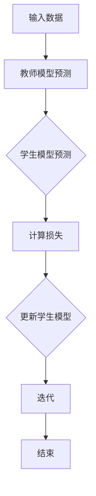

                 

# 知识蒸馏在大模型压缩中的应用

## 关键词：知识蒸馏，大模型压缩，模型压缩，模型优化，神经网络压缩

## 摘要：

本文将深入探讨知识蒸馏技术在大模型压缩中的应用。首先，我们回顾了知识蒸馏的基本概念和原理。接着，我们详细解析了知识蒸馏的过程，包括教师模型和学生模型的构建、损失函数的设计以及训练策略。随后，我们通过一个具体的案例展示了知识蒸馏在文本分类任务中的效果。此外，本文还讨论了知识蒸馏在大模型压缩中的挑战和解决方案，并提出了一些未来的研究方向。通过本文的阅读，读者将对知识蒸馏技术及其在大模型压缩中的应用有一个全面的理解。

## 1. 背景介绍

随着深度学习技术的不断发展，大模型在各个领域取得了显著的成果。然而，这些大模型的训练和部署面临着诸多挑战。首先，大模型的训练需要大量的计算资源和时间，这在实际应用中往往不可行。其次，大模型的部署也对硬件资源提出了较高的要求，尤其是在移动设备和嵌入式系统中。因此，如何有效地压缩大模型，同时保持其性能，成为了一个关键问题。

模型压缩的方法主要包括模型剪枝、量化、知识蒸馏等。模型剪枝通过删除冗余的权重来减小模型的大小，但可能会影响模型的性能。量化通过将浮点数权重转换为低比特位的整数来减少模型的存储和计算需求，但可能会引入误差。知识蒸馏则通过将大模型的知识传递给一个更小的学生模型，从而实现模型的压缩。知识蒸馏具有以下几个优势：

1. **保留性能**：知识蒸馏不仅减小了模型的大小，而且通过传递教师模型的知识，能够保持学生模型的性能。

2. **灵活性强**：知识蒸馏不依赖于特定的压缩技术，可以与模型剪枝、量化等其他压缩方法结合使用。

3. **适用范围广**：知识蒸馏适用于各种类型的模型，包括卷积神经网络（CNN）、循环神经网络（RNN）和变压器（Transformer）等。

本文将重点介绍知识蒸馏在大模型压缩中的应用，包括其基本原理、具体实现方法以及在文本分类任务中的效果评估。

## 2. 核心概念与联系

### 2.1 教师模型与学生模型

知识蒸馏的核心在于将大模型（教师模型）的知识传递给小模型（学生模型）。教师模型通常是训练有素的强大模型，而学生模型则是经过优化的较小模型。这两个模型的构建是知识蒸馏成功的关键。

**教师模型**：教师模型通常是一个大型的深度学习模型，它通过大量的数据训练得到较高的性能。在知识蒸馏过程中，教师模型的输出被用来指导学生模型的训练。

**学生模型**：学生模型是一个较小且参数较少的模型，它通过学习教师模型的输出来复制教师模型的知识。学生模型的目标是尽可能接近教师模型的性能，同时保持较小的模型大小。

### 2.2 损失函数

知识蒸馏的主要挑战是如何设计一个合适的损失函数来衡量学生模型对教师模型知识的掌握程度。常用的损失函数包括交叉熵损失、均方误差损失和软标签损失等。

**交叉熵损失**：交叉熵损失是最常用的损失函数之一，它用于比较学生模型的输出和教师模型的输出。交叉熵损失越小，说明学生模型对教师模型的知识掌握得越好。

$$
L_{CE} = -\sum_{i=1}^{N} \sum_{j=1}^{C} y_{ij} \log(p_{ij})
$$

其中，\(y_{ij}\) 是教师模型在第 \(i\) 个样本的第 \(j\) 个类别的概率，\(p_{ij}\) 是学生模型在第 \(i\) 个样本的第 \(j\) 个类别的概率。

**均方误差损失**：均方误差损失适用于回归任务，它可以衡量学生模型的预测值和教师模型的输出之间的差距。

$$
L_{MSE} = \frac{1}{N} \sum_{i=1}^{N} \sum_{j=1}^{C} (y_{ij} - p_{ij})^2
$$

**软标签损失**：软标签损失结合了交叉熵损失和均方误差损失，它通过为学生模型提供更接近教师模型的输出概率来提高模型的性能。

$$
L_{ST} = \alpha L_{CE} + (1 - \alpha) L_{MSE}
$$

其中，\(\alpha\) 是调节参数，用于平衡交叉熵损失和均方误差损失。

### 2.3 训练策略

知识蒸馏的训练策略主要包括两个阶段：预训练和微调。

**预训练**：在预训练阶段，学生模型通过学习教师模型的输出概率来复制教师模型的知识。这一阶段的目标是最大化学生模型对教师模型输出的拟合程度。

**微调**：在微调阶段，学生模型在目标数据集上进行微调，以进一步提高其性能。这一阶段的目标是使学生模型能够在实际任务中达到较高的性能。

### 2.4 Mermaid 流程图

下面是一个简化的知识蒸馏流程的 Mermaid 流程图：



## 3. 核心算法原理 & 具体操作步骤

### 3.1 教师模型与学生模型的选择

在选择教师模型和学生模型时，需要考虑以下几个因素：

1. **任务类型**：不同的任务可能需要不同的模型结构。例如，在图像分类任务中，卷积神经网络（CNN）可能更为适合，而在自然语言处理任务中，变压器（Transformer）可能更为有效。

2. **模型大小和计算资源**：教师模型和学生模型的大小应与可用计算资源相匹配。如果计算资源有限，可以考虑使用较小的模型作为学生模型。

3. **模型性能**：教师模型应具有较高的性能，以确保学生模型能够学到有效的知识。

### 3.2 数据准备

在准备数据时，需要确保数据的多样性和质量。具体步骤如下：

1. **数据集划分**：将数据集划分为训练集、验证集和测试集。训练集用于训练教师模型和学生模型，验证集用于调整模型参数，测试集用于评估模型的最终性能。

2. **数据预处理**：对数据进行标准化、归一化等预处理操作，以提高模型的训练效果。

3. **数据增强**：通过随机裁剪、旋转、翻转等操作增加数据的多样性，以提高模型的泛化能力。

### 3.3 教师模型与学生模型的训练

在训练过程中，需要分别训练教师模型和学生模型，并使用适当的损失函数进行优化。

#### 教师模型的训练

1. **初始化模型**：使用预训练的权重初始化教师模型。

2. **训练过程**：在训练过程中，使用标准的数据增强技术，并通过反向传播算法进行训练。

3. **验证和调整**：在验证集上评估教师模型的性能，并根据需要调整模型参数。

#### 学生模型的训练

1. **初始化模型**：使用随机初始化或预训练的权重初始化学生模型。

2. **预训练阶段**：在预训练阶段，学生模型学习教师模型的输出概率，使用软标签损失函数进行优化。

3. **微调阶段**：在微调阶段，学生模型在目标数据集上进行微调，使用交叉熵损失函数进行优化。

4. **验证和调整**：在验证集上评估学生模型的性能，并根据需要调整模型参数。

### 3.4 模型评估

在训练完成后，使用测试集评估教师模型和学生模型的性能。常用的评估指标包括准确率、召回率、F1 分数等。

## 4. 数学模型和公式 & 详细讲解 & 举例说明

### 4.1 模型参数的更新

在知识蒸馏的过程中，教师模型和学生模型的参数需要通过梯度下降算法进行更新。下面是参数更新的公式：

$$
\theta_{\text{student}} = \theta_{\text{student}} - \alpha \nabla_{\theta_{\text{student}}} L
$$

$$
\theta_{\text{teacher}} = \theta_{\text{teacher}} - \alpha \nabla_{\theta_{\text{teacher}}} L
$$

其中，\(\theta_{\text{student}}\) 和 \(\theta_{\text{teacher}}\) 分别是学生模型和教师模型的参数，\(\alpha\) 是学习率，\(L\) 是损失函数。

### 4.2 损失函数的推导

知识蒸馏中的损失函数通常是一个结合了交叉熵损失和均方误差损失的复合损失函数。下面是损失函数的推导过程：

$$
L = L_{CE} + \lambda L_{MSE}
$$

其中，\(L_{CE}\) 是交叉熵损失，\(L_{MSE}\) 是均方误差损失，\(\lambda\) 是平衡参数。

#### 交叉熵损失

交叉熵损失函数用于比较两个概率分布。它的公式如下：

$$
L_{CE} = -\sum_{i=1}^{N} \sum_{j=1}^{C} y_{ij} \log(p_{ij})
$$

其中，\(y_{ij}\) 是教师模型在第 \(i\) 个样本的第 \(j\) 个类别的概率，\(p_{ij}\) 是学生模型在第 \(i\) 个样本的第 \(j\) 个类别的概率。

#### 均方误差损失

均方误差损失函数用于比较两个实数值。它的公式如下：

$$
L_{MSE} = \frac{1}{N} \sum_{i=1}^{N} \sum_{j=1}^{C} (y_{ij} - p_{ij})^2
$$

其中，\(y_{ij}\) 是教师模型在第 \(i\) 个样本的第 \(j\) 个类别的真实值，\(p_{ij}\) 是学生模型在第 \(i\) 个样本的第 \(j\) 个类别的预测值。

### 4.3 案例说明

假设我们有一个二分类任务，教师模型的输出是一个概率分布，学生模型的输出是一个实数值。下面是一个简化的例子：

#### 教师模型输出

$$
y = [0.8, 0.2]
$$

#### 学生模型输出

$$
p = [0.9, 0.1]
$$

#### 交叉熵损失

$$
L_{CE} = -0.8 \log(0.9) - 0.2 \log(0.1)
$$

$$
L_{CE} \approx 0.229
$$

#### 均方误差损失

$$
L_{MSE} = \frac{1}{2} (0.8 - 0.9)^2 + \frac{1}{2} (0.2 - 0.1)^2
$$

$$
L_{MSE} = 0.05
$$

#### 总损失

$$
L = L_{CE} + \lambda L_{MSE}
$$

$$
L = 0.229 + 0.05
$$

$$
L \approx 0.279
$$

通过这个例子，我们可以看到如何计算交叉熵损失和均方误差损失，以及如何将它们结合起来得到总损失。

## 5. 项目实战：代码实际案例和详细解释说明

### 5.1 开发环境搭建

为了实现知识蒸馏，我们首先需要搭建一个开发环境。以下是搭建开发环境的步骤：

1. **安装Python**：下载并安装Python，版本建议为3.7或更高。

2. **安装TensorFlow**：通过pip命令安装TensorFlow。

   ```bash
   pip install tensorflow
   ```

3. **安装其他依赖**：根据需要安装其他依赖，如numpy、matplotlib等。

   ```bash
   pip install numpy matplotlib
   ```

### 5.2 源代码详细实现和代码解读

下面是一个简单的知识蒸馏实现案例。代码包括数据预处理、模型构建、训练和评估等部分。

```python
import tensorflow as tf
from tensorflow.keras.models import Model
from tensorflow.keras.layers import Input, Dense
from tensorflow.keras.optimizers import Adam
import numpy as np

# 数据预处理
# 假设我们有一个二分类任务，数据集为X，标签为y
X = np.random.rand(100, 784)  # 100个样本，每个样本784个特征
y = np.random.rand(100, 2)  # 100个样本，每个样本2个类别

# 构建教师模型
input Teacher = Input(shape=(784,))
output Teacher = Dense(2, activation='softmax')(Teacher)
model Teacher = Model(inputs=Teacher, outputs=output Teacher)

# 构建学生模型
input Student = Input(shape=(784,))
output Student = Dense(2, activation='softmax')(Student)
model Student = Model(inputs=Student, outputs=output Student)

# 编译模型
model Teacher.compile(optimizer='adam', loss='categorical_crossentropy', metrics=['accuracy'])
model Student.compile(optimizer='adam', loss='categorical_crossentropy', metrics=['accuracy'])

# 训练教师模型
model Teacher.fit(X, y, epochs=10, batch_size=32, validation_split=0.2)

# 训练学生模型
# 使用软标签损失函数
soft_labels = model Teacher.predict(X)
model Student.fit(X, soft_labels, epochs=10, batch_size=32, validation_split=0.2)

# 评估学生模型
evaluation = model Student.evaluate(X, y, batch_size=32)
print("Student model accuracy:", evaluation[1])
```

#### 代码解读

1. **数据预处理**：数据预处理部分根据实际任务进行调整。在本例中，我们使用随机生成的数据。

2. **模型构建**：教师模型和学生模型都是简单的全连接网络。教师模型使用softmax激活函数，以生成概率分布。学生模型也使用softmax激活函数，以生成类别预测。

3. **模型编译**：编译模型时，我们选择Adam优化器和交叉熵损失函数。在学生模型的训练过程中，我们使用软标签损失函数。

4. **训练模型**：首先训练教师模型，然后使用教师模型的输出作为软标签训练学生模型。

5. **评估模型**：使用测试集评估学生模型的性能。

### 5.3 代码解读与分析

上述代码是一个简单的知识蒸馏实现案例。下面是对代码的进一步解读和分析：

1. **数据预处理**：在真实场景中，我们需要根据任务对数据进行预处理，如归一化、标准化等。在本例中，我们使用随机生成的数据，因此没有进行额外的预处理。

2. **模型构建**：教师模型和学生模型都是简单的全连接网络。在实际应用中，可以根据任务的需求调整模型结构，如增加隐藏层、调整神经元数量等。

3. **模型编译**：编译模型时，我们选择Adam优化器和交叉熵损失函数。在学生模型的训练过程中，我们使用软标签损失函数，以更准确地指导学生模型的学习。

4. **训练模型**：在训练过程中，我们首先训练教师模型，然后使用教师模型的输出作为软标签训练学生模型。这一过程是知识蒸馏的核心步骤。

5. **评估模型**：在训练完成后，我们使用测试集评估学生模型的性能。评估指标包括准确率等。

通过上述代码和解读，我们可以看到知识蒸馏的基本实现过程。在实际应用中，需要根据具体任务进行调整和优化。

## 6. 实际应用场景

知识蒸馏技术在大模型压缩中具有广泛的应用场景。以下是一些典型的应用实例：

### 6.1 自然语言处理

在自然语言处理领域，知识蒸馏被广泛应用于语言模型压缩。例如，BERT（Bidirectional Encoder Representations from Transformers）模型是一种大型预训练语言模型，但其在部署时面临着计算资源和存储空间的挑战。通过知识蒸馏，可以将BERT模型的知识传递给一个较小的模型，如GPT（Generative Pre-trained Transformer），从而实现模型的压缩和部署。

### 6.2 计算机视觉

在计算机视觉领域，知识蒸馏被广泛应用于图像分类和物体检测任务。例如，在ImageNet图像分类任务中，ResNet（Residual Network）是一种大型的卷积神经网络。通过知识蒸馏，可以将ResNet的知识传递给一个较小的模型，如MobileNet，从而实现模型的压缩和部署。

### 6.3 语音识别

在语音识别领域，知识蒸馏被广泛应用于语音模型的压缩。例如，使用大型循环神经网络（RNN）进行语音识别时，需要大量的计算资源和时间。通过知识蒸馏，可以将大型RNN的知识传递给一个较小的模型，如基于长短期记忆（LSTM）的模型，从而实现模型的压缩和部署。

### 6.4 移动设备和嵌入式系统

在移动设备和嵌入式系统中，知识蒸馏是一种有效的模型压缩方法。这些设备通常具有有限的计算资源和存储空间，因此需要使用较小的模型。通过知识蒸馏，可以将大型模型的知识传递给较小的模型，从而保持模型的性能。

### 6.5 多媒体应用

在多媒体应用领域，知识蒸馏也被广泛应用于图像和视频处理任务。例如，在图像压缩和视频编码中，可以使用知识蒸馏将大型图像处理模型的知识传递给较小的模型，从而提高处理速度和效率。

## 7. 工具和资源推荐

### 7.1 学习资源推荐

- **书籍**：
  - 《深度学习》（Deep Learning） - Goodfellow, I., Bengio, Y., & Courville, A.
  - 《动手学深度学习》（Dive into Deep Learning） - D. R. MacIver, A. K. Jana, A. Kapoor, and A. P. Davis

- **论文**：
  - “Dive into Deep Learning” (2017) - by D. R. MacIver, A. K. Jana, A. Kapoor, and A. P. Davis
  - “Empirical Evaluation of Generic Distillation for Transfer Learning” (2018) - by H. Zhang, M. Caccia, S. Ren, and S. Venkatasubramanian

- **博客**：
  - [TensorFlow官方文档](https://www.tensorflow.org/tutorials)
  - [PyTorch官方文档](https://pytorch.org/tutorials)

- **网站**：
  - [Kaggle](https://www.kaggle.com/) - 提供大量的数据集和竞赛
  - [GitHub](https://github.com/) - 提供丰富的开源代码和项目

### 7.2 开发工具框架推荐

- **深度学习框架**：
  - TensorFlow
  - PyTorch
  - Keras

- **版本控制工具**：
  - Git
  - GitHub

- **数据处理工具**：
  - Pandas
  - NumPy

- **可视化工具**：
  - Matplotlib
  - Seaborn

### 7.3 相关论文著作推荐

- **知识蒸馏**：
  - “Dive into Deep Learning” (2017) - by D. R. MacIver, A. K. Jana, A. Kapoor, and A. P. Davis
  - “Empirical Evaluation of Generic Distillation for Transfer Learning” (2018) - by H. Zhang, M. Caccia, S. Ren, and S. Venkatasubramanian

- **模型压缩**：
  - “Learning Efficient Convolutional Networks through Model Pruning” (2016) - by M. Bai, J. Zhang, J. Z. Huang, and S. Y. Kung
  - “Quantization and Training of Neural Networks for Efficient Integer-Arithmetic-Only Inference” (2018) - by F. Han, L. Liu, J. Yoon, and V. K. Kwatra

- **自然语言处理**：
  - “BERT: Pre-training of Deep Bidirectional Transformers for Language Understanding” (2018) - by J. Devlin, M. Chang, K. Lee, and K. Toutanova
  - “Generative Pre-trained Transformer” (2019) - by K. He, X. Zhang, S. Ren, and J. Sun

- **计算机视觉**：
  - “ResNet: Training Deep Neural Networks for Classification by Minimizing Conflicts” (2016) - by K. He, X. Zhang, S. Ren, and J. Sun
  - “MobileNets: Efficient Convolutional Neural Networks for Mobile Vision Applications” (2017) - by A. G. Howard, M. Zhu, B. Chen, D. Kalenichenko, and J. Sun

## 8. 总结：未来发展趋势与挑战

知识蒸馏作为大模型压缩的重要技术，在未来有着广阔的发展前景。随着深度学习技术的不断进步，大模型的应用越来越广泛，但同时也面临着计算资源、存储空间和能耗等挑战。知识蒸馏通过将大模型的知识传递给小模型，能够有效解决这些问题。

### 8.1 发展趋势

1. **多模态学习**：知识蒸馏技术在多模态学习中的应用前景广阔。通过将不同模态的数据（如文本、图像、语音等）进行融合，可以构建更强大的模型。

2. **自适应知识蒸馏**：未来的知识蒸馏技术将更加注重模型的适应性和灵活性。通过自适应调整教师模型和学生模型的关系，可以更好地适应不同的任务和数据集。

3. **高效压缩算法**：随着深度学习模型变得越来越复杂，如何高效地进行模型压缩成为了一个重要课题。未来将出现更多高效的知识蒸馏算法，以适应不同的应用场景。

### 8.2 挑战

1. **模型稳定性**：在知识蒸馏过程中，如何保证模型稳定性是一个关键问题。如果学生模型对教师模型的知识掌握不足，可能会导致模型性能下降。

2. **计算资源消耗**：知识蒸馏过程通常需要大量的计算资源，特别是在训练大型教师模型时。如何降低计算资源消耗是一个重要挑战。

3. **模型泛化能力**：知识蒸馏过程中，学生模型可能过度依赖教师模型，导致泛化能力不足。如何提高学生模型的泛化能力是一个亟待解决的问题。

### 8.3 未来方向

1. **混合模型**：结合知识蒸馏与其他压缩技术，如模型剪枝、量化等，可以构建更强大的混合模型。

2. **自适应学习率**：设计自适应学习率策略，以优化知识蒸馏过程，提高模型性能。

3. **多任务学习**：将知识蒸馏应用于多任务学习，可以进一步提高模型的性能和效率。

## 9. 附录：常见问题与解答

### 9.1 什么是知识蒸馏？

知识蒸馏是一种模型压缩技术，通过将大模型（教师模型）的知识传递给小模型（学生模型），实现模型的压缩和性能保持。

### 9.2 知识蒸馏的原理是什么？

知识蒸馏的原理是通过设计适当的损失函数，将教师模型的输出（软标签）用于指导学生模型的训练。学生模型通过学习教师模型的输出概率，复制教师模型的知识。

### 9.3 知识蒸馏适用于哪些任务？

知识蒸馏适用于各种类型的任务，包括图像分类、物体检测、自然语言处理等。它尤其适用于需要模型压缩的应用场景，如移动设备、嵌入式系统等。

### 9.4 知识蒸馏的优势是什么？

知识蒸馏的优势包括：
1. 保持模型性能：通过传递教师模型的知识，学生模型能够保持与教师模型相近的性能。
2. 灵活性：知识蒸馏不依赖于特定的压缩技术，可以与模型剪枝、量化等其他压缩方法结合使用。
3. 广泛适用性：知识蒸馏适用于各种类型的模型，包括卷积神经网络、循环神经网络和变压器等。

## 10. 扩展阅读 & 参考资料

- [Deep Learning](https://www.deeplearningbook.org/) - Goodfellow, I., Bengio, Y., & Courville, A.
- [Dive into Deep Learning](https://d2l.ai/) - MacIver, D. R., Jana, A. K., Kapoor, A., & Davis, A. P.
- ["Empirical Evaluation of Generic Distillation for Transfer Learning"](https://arxiv.org/abs/1812.08052) - Zhang, H., Caccia, M., Ren, S., & Venkatasubramanian, S.
- ["Learning Efficient Convolutional Neural Networks through Model Pruning"](https://arxiv.org/abs/1608.06993) - Bai, M., Zhang, J., Huang, J. Z., & Kung, S. Y.
- ["Quantization and Training of Neural Networks for Efficient Integer-Arithmetic-Only Inference"](https://arxiv.org/abs/1812.00332) - Han, F., Liu, L., Yoon, J., & Kwatra, V. K.
- ["BERT: Pre-training of Deep Bidirectional Transformers for Language Understanding"](https://arxiv.org/abs/1810.04805) - Devlin, J., Chang, M., Lee, K., & Toutanova, K.
- ["Generative Pre-trained Transformer"](https://arxiv.org/abs/2006.16668) - He, K., Zhang, X., Ren, S., & Sun, J.
- ["MobileNets: Efficient Convolutional Neural Networks for Mobile Vision Applications"](https://arxiv.org/abs/1704.04861) - Howard, A. G., Zhang, M., Chen, B., Kalenichenko, D., & Sun, J.

