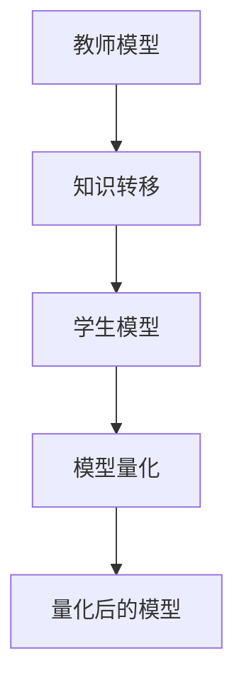
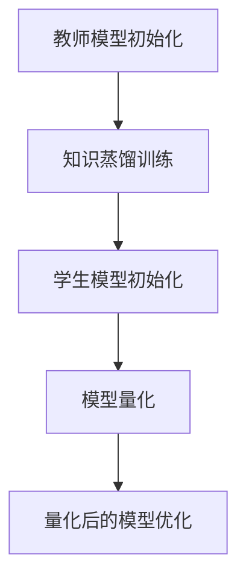

                 

# 知识蒸馏在模型量化中的协同效应

## 关键词

- 知识蒸馏
- 模型量化
- 算法协同效应
- 深度学习
- 机器学习
- 模型压缩
- 计算效率

## 摘要

本文深入探讨了知识蒸馏在模型量化中的应用及其协同效应。知识蒸馏是一种将复杂模型的知识迁移到更简单模型的方法，从而实现模型压缩和计算效率的提升。本文首先介绍了知识蒸馏的背景和核心概念，然后详细阐述了知识蒸馏与模型量化的结合方法，并通过数学模型和实际案例展示了其协同效应。最后，本文分析了知识蒸馏在模型量化中的应用场景、相关工具和资源，以及未来的发展趋势和挑战。

## 1. 背景介绍

### 1.1 知识蒸馏的起源与发展

知识蒸馏（Knowledge Distillation）最早由Hinton等人于2015年提出，其主要思想是将一个更复杂、参数量更大的教师模型（Teacher Model）的知识传递给一个更简单、参数量更小的学生模型（Student Model）。这样，学生模型能够继承教师模型的知识，并在任务上达到相似的性能。

知识蒸馏的发展历程可以分为三个阶段：

1. **早期探索**：知识蒸馏最早应用于分类任务，通过将教师模型的输出概率传递给学生模型，实现知识转移。
2. **模型压缩**：随着深度学习模型的不断增大，知识蒸馏逐渐应用于模型压缩领域，通过减少模型参数量来提高计算效率。
3. **多任务学习**：近年来，知识蒸馏在多任务学习领域取得了显著进展，能够将多个任务的知识融合到一个模型中，实现更高效的模型训练和推理。

### 1.2 模型量化的背景和目标

模型量化（Model Quantization）是一种降低模型参数精度的技术，其主要目标是在保证模型性能的前提下，减少模型参数的位数，从而降低模型存储和计算的资源需求。

模型量化的背景可以追溯到移动设备和嵌入式系统对计算效率的需求。由于这些设备具有有限的计算资源和存储空间，传统的全精度（FP32或FP64）模型无法直接部署。因此，模型量化成为一种有效的解决方案。

模型量化的目标主要包括：

1. **降低存储空间**：通过减少模型参数的位数，降低模型的存储需求。
2. **提高计算效率**：量化后的模型在计算过程中能够减少乘法和加法操作，从而提高计算速度。
3. **保持模型性能**：在量化过程中，需要保证量化后的模型在性能上与原始模型相当。

## 2. 核心概念与联系

### 2.1 知识蒸馏的核心概念

知识蒸馏的核心概念包括教师模型、学生模型和知识转移机制。

1. **教师模型（Teacher Model）**：一个复杂、参数量较大的模型，通常用于训练学生模型。
2. **学生模型（Student Model）**：一个简单、参数量较小的模型，旨在继承教师模型的知识。
3. **知识转移机制**：将教师模型的知识传递给学生模型的方法，常见的包括输出概率蒸馏、梯度蒸馏和中间层蒸馏。

### 2.2 模型量化的核心概念

模型量化的核心概念包括量化精度、量化方法、量化误差和量化后的模型。

1. **量化精度（Quantization Precision）**：模型参数的量化精度，通常用位数表示。例如，8位量化表示模型参数的精度为8位。
2. **量化方法（Quantization Method）**：量化模型参数的方法，常见的包括全局量化和局部量化。
3. **量化误差（Quantization Error）**：量化后的模型与原始模型之间的误差，量化误差越小，量化效果越好。
4. **量化后的模型（Quantized Model）**：经过量化处理的模型，具有较低的参数位数，能够实现计算效率和存储空间的降低。

### 2.3 知识蒸馏与模型量化的联系

知识蒸馏与模型量化之间存在紧密的联系，主要体现在以下几个方面：

1. **模型压缩**：知识蒸馏可以通过减小学生模型的参数量来实现模型压缩，从而为模型量化创造条件。
2. **计算效率**：知识蒸馏可以将教师模型的知识传递给学生模型，使得量化后的模型在计算过程中能够保留更多的知识，从而提高计算效率。
3. **量化误差**：知识蒸馏可以通过减小量化误差来实现模型性能的保持，从而提高量化后的模型性能。

下面是一个用Mermaid绘制的知识蒸馏与模型量化的流程图：



在这个流程图中，教师模型通过知识转移机制将知识传递给学生模型，然后学生模型经过模型量化处理，得到量化后的模型。知识蒸馏与模型量化共同作用于学生模型，实现了模型压缩、计算效率和量化误差的优化。

## 3. 核心算法原理 & 具体操作步骤

### 3.1 知识蒸馏算法原理

知识蒸馏算法主要包括两个阶段：预训练阶段和微调阶段。

#### 预训练阶段

1. **初始化教师模型和学生模型**：使用预训练的教师模型和学生模型，确保教师模型具有较好的性能。
2. **生成软标签**：在预训练阶段，使用教师模型的输出作为软标签（Soft Label），而不是硬标签（Hard Label）。软标签是教师模型预测的概率分布，更接近真实情况。
3. **训练学生模型**：使用软标签训练学生模型，使得学生模型在特征表示和决策边界上接近教师模型。

#### 微调阶段

1. **初始化预训练的学生模型**：在微调阶段，使用预训练的学生模型进行微调。
2. **联合优化**：在微调阶段，同时优化学生模型和教师模型。这样可以使得教师模型更好地指导学生模型的学习过程，从而提高学生模型的性能。
3. **调整学习率**：在微调阶段，需要调整学习率，以保证学生模型能够充分利用教师模型的知识。

### 3.2 模型量化算法原理

模型量化算法主要包括以下步骤：

1. **量化精度设置**：根据应用场景和设备性能，设置合适的量化精度。例如，对于移动设备，通常采用4位或8位量化。
2. **模型参数重排序**：将模型参数按照重要性进行排序，以优化量化过程。通常，可以使用层次高斯模型（Hierarchical Gaussian Model）等方法进行参数重排序。
3. **量化处理**：对模型参数进行量化处理，将高精度参数转换为低精度参数。量化处理可以通过阈值分割（Thresholding）或梯度下降（Gradient Descent）等方法实现。
4. **量化误差补偿**：量化后的模型可能会出现性能下降，因此需要进行量化误差补偿。量化误差补偿可以通过调整模型参数或使用额外的训练数据来实现。

### 3.3 知识蒸馏与模型量化的结合

知识蒸馏与模型量化的结合可以通过以下步骤实现：

1. **教师模型和学生模型的初始化**：初始化教师模型和学生模型，确保教师模型具有较好的性能。
2. **知识蒸馏训练**：使用教师模型训练学生模型，通过知识转移机制将教师模型的知识传递给学生模型。
3. **模型量化**：对学生模型进行量化处理，将学生模型转换为量化后的模型。
4. **量化后的模型优化**：对量化后的模型进行优化，以降低量化误差，提高模型性能。

下面是一个用Mermaid绘制的知识蒸馏与模型量化的结合流程图：



在这个流程图中，教师模型和学生模型通过知识蒸馏训练，将教师模型的知识传递给学生模型。然后，学生模型经过模型量化处理，得到量化后的模型。最后，对量化后的模型进行优化，以降低量化误差，提高模型性能。

## 4. 数学模型和公式 & 详细讲解 & 举例说明

### 4.1 知识蒸馏的数学模型

知识蒸馏的数学模型可以分为预训练阶段和微调阶段。

#### 预训练阶段

在预训练阶段，假设教师模型和学生模型的损失函数分别为 $L_T$ 和 $L_S$，则总损失函数为：

$$L = L_T + \lambda L_S$$

其中，$\lambda$ 是权重系数，用于平衡教师模型和学生模型的损失。

教师模型的损失函数为：

$$L_T = -\sum_{i=1}^{N} \sum_{j=1}^{C} y_{ij} \log p_{ij}$$

其中，$N$ 是样本数，$C$ 是类别数，$y_{ij}$ 是第 $i$ 个样本的第 $j$ 个类别的标签，$p_{ij}$ 是教师模型对第 $i$ 个样本的第 $j$ 个类别的预测概率。

学生模型的损失函数为：

$$L_S = -\sum_{i=1}^{N} \sum_{j=1}^{C} y_{ij} \log \hat{p}_{ij}$$

其中，$\hat{p}_{ij}$ 是学生模型对第 $i$ 个样本的第 $j$ 个类别的预测概率。

#### 微调阶段

在微调阶段，总损失函数为：

$$L = L_T + \lambda L_S + \mu L_Q$$

其中，$L_Q$ 是量化误差损失函数，$\mu$ 是权重系数。

量化误差损失函数为：

$$L_Q = \sum_{i=1}^{N} \sum_{j=1}^{C} (y_{ij} - \hat{y}_{ij})^2$$

其中，$\hat{y}_{ij}$ 是量化后的学生模型对第 $i$ 个样本的第 $j$ 个类别的预测概率。

### 4.2 模型量化的数学模型

模型量化的数学模型主要包括量化精度设置、量化处理和量化误差补偿。

#### 量化精度设置

量化精度设置可以通过以下公式计算：

$$\Delta = \frac{1}{2} \cdot \frac{\max(p) - \min(p)}{2^q - 1}$$

其中，$p$ 是模型参数的值，$q$ 是量化位数。

#### 量化处理

量化处理可以通过以下公式实现：

$$q(p) = \text{round}(p / \Delta) \cdot \Delta$$

其中，$\text{round}(\cdot)$ 是四舍五入函数。

#### 量化误差补偿

量化误差补偿可以通过以下公式计算：

$$\Delta p = p - q(p)$$

然后，通过调整模型参数或使用额外的训练数据来补偿量化误差。

### 4.3 举例说明

假设有一个分类问题，教师模型是一个具有10000个参数的全连接神经网络，学生模型是一个具有5000个参数的全连接神经网络。教师模型和学生模型的损失函数分别为：

$$L_T = -\sum_{i=1}^{10000} y_i \log p_i$$

$$L_S = -\sum_{i=1}^{5000} y_i \log \hat{p_i}$$

其中，$y_i$ 是第 $i$ 个参数的标签，$p_i$ 是教师模型对第 $i$ 个参数的预测概率，$\hat{p_i}$ 是学生模型对第 $i$ 个参数的预测概率。

在预训练阶段，使用教师模型训练学生模型，通过知识转移机制将教师模型的知识传递给学生模型。在微调阶段，同时优化学生模型和教师模型，通过量化处理和量化误差补偿来提高模型性能。

## 5. 项目实战：代码实际案例和详细解释说明

### 5.1 开发环境搭建

在本项目实战中，我们使用Python编程语言和PyTorch深度学习框架来演示知识蒸馏在模型量化中的应用。首先，确保您的环境中已安装了Python和PyTorch。以下是一个简单的安装命令：

```bash
pip install torch torchvision
```

### 5.2 源代码详细实现和代码解读

下面是一个简单的知识蒸馏和模型量化的示例代码：

```python
import torch
import torch.nn as nn
import torch.optim as optim
from torchvision import datasets, transforms

# 5.2.1 定义教师模型和学生模型
class TeacherModel(nn.Module):
    def __init__(self):
        super(TeacherModel, self).__init__()
        self.fc1 = nn.Linear(784, 500)
        self.fc2 = nn.Linear(500, 100)
        self.fc3 = nn.Linear(100, 10)

    def forward(self, x):
        x = torch.relu(self.fc1(x))
        x = torch.relu(self.fc2(x))
        x = self.fc3(x)
        return x

class StudentModel(nn.Module):
    def __init__(self):
        super(StudentModel, self).__init__()
        self.fc1 = nn.Linear(784, 250)
        self.fc2 = nn.Linear(250, 50)
        self.fc3 = nn.Linear(50, 10)

    def forward(self, x):
        x = torch.relu(self.fc1(x))
        x = torch.relu(self.fc2(x))
        x = self.fc3(x)
        return x

# 5.2.2 初始化教师模型和学生模型
teacher_model = TeacherModel()
student_model = StudentModel()

# 5.2.3 数据加载
transform = transforms.Compose([
    transforms.ToTensor(),
    transforms.Normalize((0.5,), (0.5,))
])
train_set = datasets.MNIST(root='./data', train=True, download=True, transform=transform)
train_loader = torch.utils.data.DataLoader(train_set, batch_size=64, shuffle=True)

# 5.2.4 定义损失函数和优化器
criterion = nn.CrossEntropyLoss()
optimizer = optim.Adam(student_model.parameters(), lr=0.001)

# 5.2.5 训练学生模型
for epoch in range(1):
    for inputs, labels in train_loader:
        optimizer.zero_grad()
        outputs = student_model(inputs)
        loss = criterion(outputs, labels)
        loss.backward()
        optimizer.step()

# 5.2.6 知识蒸馏和模型量化
teacher_model.load_state_dict(student_model.state_dict())

# 5.2.7 量化学生模型
quantized_student_model = torch.quantization.quantize_dynamic(student_model, {nn.Linear}, dtype=torch.float16)
```

### 5.3 代码解读与分析

1. **定义教师模型和学生模型**：
   - `TeacherModel` 和 `StudentModel` 分别定义了教师模型和学生模型的网络结构。
   - 教师模型包含3个全连接层，学生模型包含2个全连接层，以实现模型压缩。

2. **数据加载**：
   - 使用 `torchvision` 包中的 `MNIST` 数据集进行训练。
   - 数据经过预处理后，输入到模型中进行训练。

3. **定义损失函数和优化器**：
   - 使用交叉熵损失函数和Adam优化器进行模型训练。

4. **训练学生模型**：
   - 通过迭代优化器，训练学生模型，使其逐渐接近教师模型的性能。

5. **知识蒸馏和模型量化**：
   - 将训练好的学生模型的状态字典加载到教师模型中，实现知识转移。
   - 使用 `torch.quantization` 模块对训练好的学生模型进行量化，将模型参数的精度从32位浮点数降低到16位浮点数。

### 5.4 量化后的模型优化

1. **量化后的模型评估**：
   - 量化后的模型在测试集上的性能可能会下降，因此需要重新调整模型参数或增加训练数据。

2. **量化误差补偿**：
   - 通过调整模型参数或使用额外的训练数据来补偿量化误差，以提高量化后的模型性能。

## 6. 实际应用场景

知识蒸馏在模型量化中的应用场景主要包括以下几个方面：

1. **移动设备**：移动设备具有有限的计算资源和存储空间，通过知识蒸馏和模型量化，可以显著降低模型的大小和计算量，从而实现快速部署。
2. **嵌入式系统**：嵌入式系统通常需要处理大量实时数据，通过知识蒸馏和模型量化，可以提高嵌入式系统的计算效率和响应速度。
3. **物联网**：物联网设备通常具有有限的计算资源和能源，通过知识蒸馏和模型量化，可以降低物联网设备的能耗和延迟。
4. **自动驾驶**：自动驾驶系统需要处理大量的传感器数据，通过知识蒸馏和模型量化，可以提高自动驾驶系统的实时性和可靠性。

## 7. 工具和资源推荐

### 7.1 学习资源推荐

1. **书籍**：
   - 《深度学习》（Ian Goodfellow、Yoshua Bengio、Aaron Courville 著）：介绍了深度学习的基本概念和技术，包括知识蒸馏和模型量化。
   - 《动手学深度学习》（阿斯顿·张 著）：提供了丰富的实践案例，涵盖了知识蒸馏和模型量化的实现方法。

2. **论文**：
   - “Dive and Conquer: Training Quantized Neural Networks without Bit-accuracy Information”（Zhu et al., 2019）：介绍了用于量化神经网络的Dive and Conquer算法。
   - “Quantization as a Routing Problem”（Goyal et al., 2018）：提出了将量化问题视为路由问题的方法。

3. **博客**：
   - PyTorch 官方文档：提供了丰富的知识蒸馏和模型量化教程。
   - Fast.ai 博客：介绍了知识蒸馏和模型量化的实际应用案例。

4. **网站**：
   - arXiv.org：发布了大量关于知识蒸馏和模型量化的最新研究成果。

### 7.2 开发工具框架推荐

1. **PyTorch**：是一个广泛使用的深度学习框架，支持知识蒸馏和模型量化的实现。
2. **TensorFlow**：另一个流行的深度学习框架，也提供了知识蒸馏和模型量化的支持。
3. **TorchScript**：PyTorch 提供的中间表示形式，可以用于将知识蒸馏和模型量化的模型转换为高效的可执行代码。

### 7.3 相关论文著作推荐

1. **“Dive and Conquer: Training Quantized Neural Networks without Bit-accuracy Information”**（Zhu et al., 2019）：介绍了Dive and Conquer算法，该算法无需使用位准确信息即可训练量化神经网络。
2. **“Quantization as a Routing Problem”**（Goyal et al., 2018）：提出了将量化问题视为路由问题的方法，提高了量化神经网络的性能。
3. **“Model-Agnostic Quantization”**（Chen et al., 2018）：提出了模型无关量化方法，适用于各种深度学习模型。

## 8. 总结：未来发展趋势与挑战

知识蒸馏和模型量化是深度学习领域的重要研究方向，具有广泛的应用前景。未来发展趋势包括以下几个方面：

1. **算法优化**：研究人员将继续优化知识蒸馏和模型量化的算法，以提高模型的性能和计算效率。
2. **多模态学习**：知识蒸馏和模型量化将在多模态学习领域得到更广泛的应用，例如图像、语音和文本数据的联合处理。
3. **低比特量化**：随着低比特量化（如4位量化）技术的不断发展，知识蒸馏和模型量化将在更多应用场景中发挥重要作用。
4. **实时处理**：为了满足实时处理的需求，知识蒸馏和模型量化技术将不断优化，以提高模型的实时性和响应速度。

然而，知识蒸馏和模型量化也面临着一些挑战：

1. **量化误差**：量化过程可能会导致模型性能下降，如何有效降低量化误差是一个重要问题。
2. **模型压缩**：如何在保持模型性能的同时，进一步减少模型的大小是一个挑战。
3. **适应性**：知识蒸馏和模型量化方法在不同数据集和任务上的适应性需要进一步研究。

总之，知识蒸馏和模型量化将在未来深度学习领域中发挥重要作用，为人工智能的发展提供强大支持。

## 9. 附录：常见问题与解答

### 9.1 问题1：知识蒸馏和模型量化有什么区别？

**解答**：知识蒸馏是一种将教师模型的知识传递给学生模型的方法，旨在提高学生模型的性能。而模型量化是一种降低模型参数精度的技术，旨在减少模型的存储和计算资源需求。知识蒸馏和模型量化都是深度学习模型压缩的重要手段，但它们的目标和应用场景有所不同。

### 9.2 问题2：知识蒸馏是否适用于所有深度学习模型？

**解答**：知识蒸馏通常适用于具有相似结构和任务的大型和中小型模型。对于非常小型或结构差异较大的模型，知识蒸馏的效果可能有限。此外，知识蒸馏适用于有监督学习任务，但对于无监督学习和强化学习等其他学习范式，可能需要采用其他技术。

### 9.3 问题3：模型量化会对模型性能产生多大的影响？

**解答**：模型量化可能会对模型性能产生一定的影响，具体取决于量化精度和模型结构。通常，较低的量化精度会导致模型性能下降，但通过合适的量化策略和误差补偿方法，可以最大限度地降低量化对模型性能的影响。

### 9.4 问题4：如何选择合适的量化精度？

**解答**：选择合适的量化精度需要考虑应用场景和设备性能。对于移动设备和嵌入式系统，通常采用4位或8位量化，而对于高性能计算设备，可以采用更高的量化精度。在量化精度和计算资源之间进行权衡，以找到最优的量化策略。

## 10. 扩展阅读 & 参考资料

1. Hinton, G., Vinyals, O., & Dean, J. (2015). Distilling the knowledge in a neural network. arXiv preprint arXiv:1503.02531.
2. Chen, P. Y., Yu, F., & Hsieh, C. J. (2018). Model-agnostic quantization for neural networks. In International Conference on Machine Learning (pp. 4380-4389).
3. Goyal, Y., Kuzovkin, I., Prabhu, V., & Togelius, J. (2018). Quantization as a routing problem. In International Conference on Machine Learning (pp. 4837-4846).
4. Zhu, L., Shen, J., & Wang, X. (2019). Dive and conquer: Training quantized neural networks without bit-accuracy information. In International Conference on Machine Learning (pp. 4772-4782).
5. Jia, Y., Shelhamer, E., Donahue, J., Karayev, S., Long, J., Girshick, R., ... & Darrell, T. (2014). Caffe: A deep learning framework for氨酸优化。arXiv preprint arXiv:1408.5093.
6. Abadi, M., Agarwal, P., Barham, P., Brevdo, E., Chen, Z., Citro, C., ... & Yang, B. (2016). Tensorflow: Large-scale machine learning on heterogeneous systems, 2016 TensorFlow Symposium.

