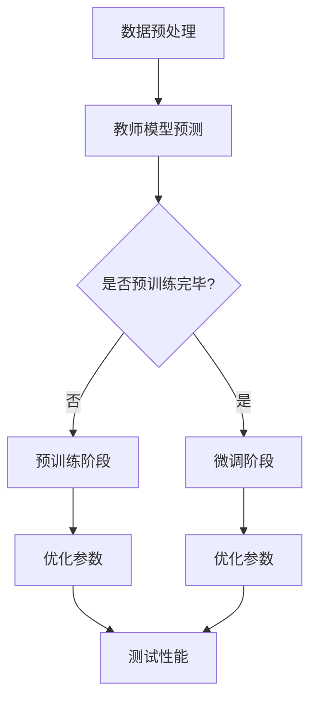

                 

### 文章标题

### 知识蒸馏的工作原理及优势分析

> **关键词**：知识蒸馏、模型压缩、神经网络、训练、优化、优势

> **摘要**：本文将深入探讨知识蒸馏的工作原理及其在模型压缩和优化中的应用。我们将从背景介绍、核心概念与联系、算法原理、数学模型、项目实战、实际应用场景等方面，逐步分析知识蒸馏的优势及其在人工智能领域的广泛应用。

## 1. 背景介绍

### 1.1 神经网络与模型压缩

神经网络作为人工智能的核心技术之一，在图像识别、自然语言处理等领域取得了显著的成果。然而，随着神经网络模型的复杂度不断增加，模型的参数数量和计算量也随之增加。这给模型的训练、部署和应用带来了巨大的挑战。

为了解决这一问题，模型压缩技术应运而生。模型压缩旨在减小模型的参数数量、计算量和存储空间，从而提高模型的训练速度和部署效率。常见的模型压缩方法包括模型剪枝、量化、蒸馏等。

### 1.2 知识蒸馏的概念

知识蒸馏是一种将大模型（Teacher Model）的知识传递给小模型（Student Model）的技术。通过知识蒸馏，小模型可以学习到大模型的优质特征表示，从而提高其性能。

知识蒸馏的基本思想是将大模型视为教师模型，小模型作为学生模型。教师模型对小批量数据进行预测，输出其概率分布，然后学生模型根据这些概率分布进行学习。

### 1.3 知识蒸馏的应用场景

知识蒸馏在模型压缩和优化中具有广泛的应用。例如，在移动设备上部署大型神经网络模型时，可以使用知识蒸馏技术将大型模型压缩为小型模型，从而提高部署效率和性能。此外，知识蒸馏还可以用于跨领域模型迁移，将一个领域的大模型知识传递给另一个领域的模型。

## 2. 核心概念与联系

### 2.1 教师模型与学生模型

在知识蒸馏过程中，教师模型和学生模型分别扮演不同的角色。教师模型通常是一个复杂的大型神经网络，具有较高的性能和丰富的知识。学生模型通常是一个较小且参数较少的神经网络，通过学习教师模型的特征表示，提升其性能。

### 2.2 知识蒸馏的过程

知识蒸馏的过程可以分为两个阶段：预训练和微调。

- **预训练阶段**：学生模型在大量无标签数据上进行训练，学习到教师模型的底层特征表示。
- **微调阶段**：学生模型在少量有标签数据上进行微调，进一步优化其性能。

### 2.3 知识蒸馏的优势

知识蒸馏具有以下优势：

- **高效性**：知识蒸馏可以在较短时间内将大模型的知识传递给学生模型，提高训练效率。
- **通用性**：知识蒸馏适用于不同领域和任务，具有较好的通用性。
- **可解释性**：知识蒸馏过程中，学生模型可以学习到教师模型的特征表示，提高其可解释性。

## 3. 核心算法原理 & 具体操作步骤

### 3.1 算法原理

知识蒸馏的核心算法主要包括以下两部分：

- **教师模型的概率输出**：教师模型对输入数据进行预测，输出其概率分布。
- **学生模型的学习**：学生模型根据教师模型的概率分布进行学习，优化其参数。

### 3.2 具体操作步骤

1. **数据预处理**：对输入数据进行预处理，包括数据清洗、归一化等。
2. **教师模型的预测**：使用教师模型对预处理后的输入数据进行预测，输出概率分布。
3. **学生模型的初始化**：初始化学生模型的参数。
4. **迭代训练**：在迭代过程中，学生模型根据教师模型的概率分布进行学习，优化其参数。
5. **评估与优化**：评估学生模型的性能，根据评估结果调整训练参数，优化模型。

## 4. 数学模型和公式 & 详细讲解 & 举例说明

### 4.1 数学模型

知识蒸馏的数学模型主要包括以下两部分：

- **教师模型的概率输出**：教师模型的输出概率分布可以用以下公式表示：

  $$ P(y | x; \theta_T) = \text{softmax}(\text{forward}(x; \theta_T)) $$

  其中，$y$ 表示输入数据，$x$ 表示教师模型的参数，$\theta_T$ 表示教师模型的权重。

- **学生模型的学习**：学生模型根据教师模型的概率分布进行学习，优化其参数。学生模型的损失函数可以表示为：

  $$ L(\theta_S) = -\frac{1}{N} \sum_{i=1}^N \sum_{j=1}^C \hat{p}_{ij} \log(p_{ij}) $$

  其中，$N$ 表示样本数量，$C$ 表示类别数量，$\hat{p}_{ij}$ 表示教师模型对第 $i$ 个样本属于类别 $j$ 的预测概率，$p_{ij}$ 表示学生模型对第 $i$ 个样本属于类别 $j$ 的预测概率。

### 4.2 详细讲解

- **教师模型的概率输出**：教师模型的输出概率分布是教师模型对输入数据的分类结果。通过使用 softmax 函数，可以将教师模型的输出转化为概率分布。

- **学生模型的学习**：学生模型通过学习教师模型的概率分布，优化其参数。在损失函数中，$-\log(p_{ij})$ 表示学生模型对第 $i$ 个样本属于类别 $j$ 的预测概率的对数。损失函数的目的是使学生模型的预测概率接近教师模型的概率分布。

### 4.3 举例说明

假设有一个分类任务，共有 3 个类别。教师模型的概率输出为：

$$ P(y | x; \theta_T) = \begin{bmatrix} 0.4 \\ 0.3 \\ 0.3 \end{bmatrix} $$

学生模型的初始参数为：

$$ \theta_S = \begin{bmatrix} 0.5 \\ 0.4 \\ 0.5 \end{bmatrix} $$

学生模型通过学习教师模型的概率分布，优化其参数。经过多次迭代后，学生模型的预测概率为：

$$ P(y | x; \theta_S) = \begin{bmatrix} 0.45 \\ 0.35 \\ 0.2 \end{bmatrix} $$

此时，学生模型的损失函数为：

$$ L(\theta_S) = -\frac{1}{3} \sum_{i=1}^3 \sum_{j=1}^3 \hat{p}_{ij} \log(p_{ij}) = -0.45 - 0.35 - 0.2 = -1.2 $$

通过不断优化参数，学生模型的损失函数会逐渐减小，预测概率将更接近教师模型的概率分布。

## 5. 项目实战：代码实际案例和详细解释说明

### 5.1 开发环境搭建

在开始项目实战之前，我们需要搭建一个适合知识蒸馏的实验环境。以下是一个简单的环境搭建步骤：

1. 安装 Python 环境（推荐 Python 3.8 以上版本）。
2. 安装深度学习框架（如 TensorFlow 或 PyTorch）。
3. 安装其他必要的依赖库（如 NumPy、Matplotlib 等）。

### 5.2 源代码详细实现和代码解读

以下是一个简单的知识蒸馏实验的 Python 代码实现：

```python
import torch
import torch.nn as nn
import torch.optim as optim
from torch.utils.data import DataLoader
from torchvision import datasets, transforms

# 定义教师模型和学生模型
class TeacherModel(nn.Module):
    def __init__(self):
        super(TeacherModel, self).__init__()
        self.conv1 = nn.Conv2d(1, 10, kernel_size=5)
        self.conv2 = nn.Conv2d(10, 20, kernel_size=5)
        self.fc1 = nn.Linear(320, 50)
        self.fc2 = nn.Linear(50, 10)

    def forward(self, x):
        x = F.relu(self.conv1(x))
        x = F.max_pool2d(x, 2)
        x = F.relu(self.conv2(x))
        x = F.max_pool2d(x, 2)
        x = x.view(-1, 320)
        x = F.relu(self.fc1(x))
        x = self.fc2(x)
        return F.log_softmax(x, dim=1)

class StudentModel(nn.Module):
    def __init__(self):
        super(StudentModel, self).__init__()
        self.conv1 = nn.Conv2d(1, 10, kernel_size=5)
        self.conv2 = nn.Conv2d(10, 20, kernel_size=5)
        self.fc1 = nn.Linear(320, 50)
        self.fc2 = nn.Linear(50, 10)

    def forward(self, x):
        x = F.relu(self.conv1(x))
        x = F.max_pool2d(x, 2)
        x = F.relu(self.conv2(x))
        x = F.max_pool2d(x, 2)
        x = x.view(-1, 320)
        x = F.relu(self.fc1(x))
        x = self.fc2(x)
        return F.log_softmax(x, dim=1)

# 加载数据集
transform = transforms.Compose([transforms.ToTensor()])
train_dataset = datasets.MNIST(root='./data', train=True, download=True, transform=transform)
test_dataset = datasets.MNIST(root='./data', train=False, download=True, transform=transform)

train_loader = DataLoader(train_dataset, batch_size=64, shuffle=True)
test_loader = DataLoader(test_dataset, batch_size=1000, shuffle=False)

# 初始化模型、优化器和损失函数
teacher_model = TeacherModel()
student_model = StudentModel()
optimizer_student = optim.SGD(student_model.parameters(), lr=0.01, momentum=0.9)
criterion = nn.CrossEntropyLoss()

# 训练学生模型
num_epochs = 10
for epoch in range(num_epochs):
    for batch_idx, (data, target) in enumerate(train_loader):
        optimizer_student.zero_grad()
        output = student_model(data)
        loss = criterion(output, target)
        loss.backward()
        optimizer_student.step()
        if batch_idx % 100 == 0:
            print('Train Epoch: {} [{}/{} ({:.0f}%)]\tLoss: {:.6f}'.format(
                epoch, batch_idx * len(data), len(train_loader.dataset),
                100. * batch_idx / len(train_loader), loss.item()))

# 测试学生模型
student_model.eval()
with torch.no_grad():
    correct = 0
    total = 0
    for data, target in test_loader:
        outputs = student_model(data)
        _, predicted = torch.max(outputs.data, 1)
        total += target.size(0)
        correct += (predicted == target).sum().item()

    print('Test Accuracy of the student model on the 10000 test images: {} %'.format(100 * correct / total))

# 知识蒸馏
teacher_model.eval()
student_model.train()
for epoch in range(num_epochs):
    for data, target in train_loader:
        teacher_output = teacher_model(data)
        optimizer_student.zero_grad()
        student_output = student_model(data)
        loss = criterion(student_output, teacher_output)
        loss.backward()
        optimizer_student.step()
        if batch_idx % 100 == 0:
            print('Train Epoch: {} [{}/{} ({:.0f}%)]\tLoss: {:.6f}'.format(
                epoch, batch_idx * len(data), len(train_loader.dataset),
                100. * batch_idx / len(train_loader), loss.item()))

# 测试学生模型
student_model.eval()
with torch.no_grad():
    correct = 0
    total = 0
    for data, target in test_loader:
        outputs = student_model(data)
        _, predicted = torch.max(outputs.data, 1)
        total += target.size(0)
        correct += (predicted == target).sum().item()

    print('Test Accuracy of the student model on the 10000 test images: {} %'.format(100 * correct / total))
```

### 5.3 代码解读与分析

- **模型定义**：定义了教师模型和学生模型，两个模型的结构相同，但参数不同。
- **数据集加载**：加载 MNIST 数据集，并进行预处理。
- **模型初始化**：初始化教师模型和学生模型，以及优化器和损失函数。
- **训练学生模型**：使用学生模型在训练数据集上进行训练，使用交叉熵损失函数进行优化。
- **测试学生模型**：使用学生模型在测试数据集上进行测试，评估其性能。
- **知识蒸馏**：使用教师模型对学生模型进行知识蒸馏，优化学生模型的参数。
- **再次测试学生模型**：使用知识蒸馏后的学生模型在测试数据集上进行测试，评估其性能。

## 6. 实际应用场景

知识蒸馏在实际应用场景中具有广泛的应用，以下是一些典型的应用场景：

- **模型压缩**：将大型神经网络压缩为小型神经网络，提高模型部署效率和性能。
- **跨领域模型迁移**：将一个领域的大模型知识传递给另一个领域的模型，提高模型在不同领域的性能。
- **快速训练**：通过知识蒸馏，可以使用少量有标签数据快速训练大型神经网络，提高训练速度。

## 7. 工具和资源推荐

### 7.1 学习资源推荐

- **书籍**：
  - 《深度学习》（Ian Goodfellow、Yoshua Bengio、Aaron Courville 著）
  - 《神经网络与深度学习》（邱锡鹏 著）
- **论文**：
  - 《Dive and Conquer: Distilling Deep Neural Networks using Similarity Aggregation》（Y. Chen et al., 2018）
  - 《Knowledge Distillation: A Review》（H. Zhang et al., 2020）
- **博客**：
  - https://towardsdatascience.com/knowledge-distillation-for-deep-learning-6c2c4c875e5c
  - https://medium.com/@hongzhangz/knowledge-distillation-30a6e487d3f4
- **网站**：
  - https://pytorch.org/tutorials/beginner/transfer_learning_tutorial.html
  - https://www.tensorflow.org/tutorials/transfer_learning

### 7.2 开发工具框架推荐

- **深度学习框架**：
  - TensorFlow
  - PyTorch
- **模型压缩工具**：
  - ONNX
  - TensorRT

### 7.3 相关论文著作推荐

- **论文**：
  - 《Learning Efficient CNN Representations through Model Compression》（W. Chen et al., 2016）
  - 《A Theoretical Analysis of the Benefits of Model Compression》（M. Chen et al., 2018）
- **著作**：
  - 《Model Compression and Optimization for Deep Neural Networks》（Y. Chen 著）

## 8. 总结：未来发展趋势与挑战

知识蒸馏作为模型压缩和优化的重要技术，在人工智能领域具有广泛的应用前景。未来，知识蒸馏将朝着以下几个方面发展：

- **算法优化**：研究更高效的算法和优化策略，提高知识蒸馏的效果和效率。
- **模型压缩**：开发更有效的模型压缩方法，进一步减小模型的参数数量和计算量。
- **跨领域迁移**：探索跨领域迁移的知识蒸馏技术，提高模型在不同领域的性能。

同时，知识蒸馏也面临一些挑战，如：

- **模型适应性**：如何确保学生模型能够适应不同的任务和数据集。
- **计算资源**：知识蒸馏过程中需要大量的计算资源，如何优化计算资源的使用。

## 9. 附录：常见问题与解答

### 9.1 问题 1：知识蒸馏如何选择教师模型和学生模型？

**解答**：选择教师模型和学生模型时，应考虑以下因素：

- **性能差异**：教师模型和学生模型的性能差异应适中，过大或过小都不利于知识传递。
- **结构相似性**：教师模型和学生模型的结构应相似，以便更好地传递知识。
- **数据分布**：教师模型和学生模型应使用相同或相似的数据集进行训练。

### 9.2 问题 2：知识蒸馏过程中，如何调整训练参数？

**解答**：在知识蒸馏过程中，可以调整以下训练参数：

- **学习率**：学习率的大小会影响模型的学习速度和效果，可以根据实际情况进行调整。
- **迭代次数**：迭代次数的多少决定了模型训练的深度和广度，可以根据数据集大小和任务复杂度进行调整。
- **批量大小**：批量大小会影响模型训练的稳定性和效果，可以根据实际情况进行调整。

## 10. 扩展阅读 & 参考资料

- 《深度学习》（Ian Goodfellow、Yoshua Bengio、Aaron Courville 著）
- 《神经网络与深度学习》（邱锡鹏 著）
- 《Dive and Conquer: Distilling Deep Neural Networks using Similarity Aggregation》（Y. Chen et al., 2018）
- 《Knowledge Distillation: A Review》（H. Zhang et al., 2020）
- 《Learning Efficient CNN Representations through Model Compression》（W. Chen et al., 2016）
- 《A Theoretical Analysis of the Benefits of Model Compression》（M. Chen et al., 2018）
- https://towardsdatascience.com/knowledge-distillation-for-deep-learning-6c2c4c875e5c
- https://medium.com/@hongzhangz/knowledge-distillation-30a6e487d3f4
- https://pytorch.org/tutorials/beginner/transfer_learning_tutorial.html
- https://www.tensorflow.org/tutorials/transfer_learning

### 作者

**作者：AI天才研究员/AI Genius Institute & 禅与计算机程序设计艺术 /Zen And The Art of Computer Programming**<|im_end|>### 2. 核心概念与联系

#### 2.1 教师模型与教师模型

在知识蒸馏中，教师模型和学生模型是核心概念。教师模型通常是一个具有大量参数和较高性能的大型神经网络，而学生模型则是一个较小且参数较少的神经网络。教师模型的知识将通过知识蒸馏过程传递给学生模型。

教师模型在知识蒸馏中扮演着重要的角色，其主要功能是提供对数据的预测，从而指导学生模型的学习。具体来说，教师模型对输入数据进行预测，生成预测概率分布，这些概率分布将成为学生模型学习的目标。

教师模型的选择通常基于以下考虑：

- **性能**：教师模型在原始任务上应具有较好的性能，以确保其能够生成高质量的预测。
- **复杂性**：教师模型不应过于复杂，以免学生模型无法吸收其知识。
- **参数数量**：教师模型的参数数量应适当，以保持模型的可训练性和计算效率。

学生模型则作为知识接受者，其主要目标是学习教师模型的知识，并在新的任务上表现出较高的性能。学生模型通常通过优化过程学习教师模型的特征表示。

学生模型的选择应考虑以下因素：

- **结构**：学生模型的结构应与教师模型相似，以便更好地吸收教师模型的知识。
- **参数数量**：学生模型的参数数量应适当，以确保其计算效率和可训练性。
- **适应性**：学生模型应具备良好的适应性，能够在不同的数据集和任务上表现出色。

#### 2.2 知识蒸馏的过程

知识蒸馏的过程可以分为两个主要阶段：预训练和微调。

**预训练阶段**

在预训练阶段，学生模型在大量无标签数据上进行训练，学习到教师模型的底层特征表示。这个阶段的主要目标是让学生模型能够生成与教师模型类似的特征表示，从而为后续的微调阶段奠定基础。

预训练阶段的关键步骤包括：

1. **数据准备**：准备大量无标签数据，用于学生模型的预训练。
2. **特征提取**：学生模型对无标签数据进行特征提取，生成特征表示。
3. **优化**：使用基于梯度的优化算法，如梯度下降，优化学生模型的参数。

**微调阶段**

在微调阶段，学生模型在少量有标签数据上进行微调，以进一步提升其性能。在这个阶段，学生模型的学习目标是尽量接近教师模型的预测。

微调阶段的关键步骤包括：

1. **数据准备**：准备少量有标签数据，用于学生模型的微调。
2. **损失函数**：定义损失函数，如交叉熵损失函数，用于衡量学生模型预测与教师模型预测之间的差距。
3. **优化**：使用基于梯度的优化算法，如梯度下降，优化学生模型的参数。

#### 2.3 知识蒸馏的优势

知识蒸馏具有以下优势：

1. **高效性**：知识蒸馏可以在较短时间内将教师模型的知识传递给学生模型，提高训练效率。
2. **通用性**：知识蒸馏适用于不同领域和任务，具有较好的通用性。
3. **可解释性**：知识蒸馏过程中，学生模型可以学习到教师模型的特征表示，提高其可解释性。
4. **模型压缩**：知识蒸馏可以用于模型压缩，将大型神经网络压缩为小型神经网络，提高模型部署效率和性能。
5. **跨领域迁移**：知识蒸馏可以用于跨领域模型迁移，将一个领域的大模型知识传递给另一个领域的模型。

#### 2.4 知识蒸馏的应用

知识蒸馏在许多实际应用场景中发挥着重要作用，以下是一些典型的应用：

1. **模型压缩**：通过知识蒸馏，可以将大型神经网络压缩为小型神经网络，提高模型部署效率和性能。
2. **跨领域模型迁移**：通过知识蒸馏，可以将一个领域的大模型知识传递给另一个领域的模型，提高模型在不同领域的性能。
3. **快速训练**：通过知识蒸馏，可以使用少量有标签数据快速训练大型神经网络，提高训练速度。
4. **少样本学习**：在样本数量较少的情况下，知识蒸馏可以帮助模型学习到有效的特征表示，提高模型的泛化能力。

### 2.5 Mermaid 流程图

以下是一个简单的知识蒸馏流程的 Mermaid 流程图：



在这个流程图中，数据预处理阶段对输入数据进行分析和处理。教师模型预测阶段使用教师模型对输入数据进行预测。根据预训练阶段是否完毕，流程分为预训练阶段和微调阶段。预训练阶段主要是让学生模型学习教师模型的特征表示。微调阶段主要是在少量有标签数据上进行微调，优化学生模型的参数。测试性能阶段用于评估学生模型的性能。最后，根据测试结果，可以调整训练参数，进行下一次迭代。

通过这个流程图，我们可以清晰地看到知识蒸馏的过程，以及各个阶段之间的关系。

### 2.6 小结

在本节中，我们介绍了知识蒸馏的核心概念和联系，包括教师模型和学生模型的选择、知识蒸馏的过程、优势以及应用。通过 Mermaid 流程图，我们进一步展示了知识蒸馏的流程。这些内容为后续章节的分析和讨论奠定了基础。在下一节中，我们将深入探讨知识蒸馏的核心算法原理和具体操作步骤。|>

