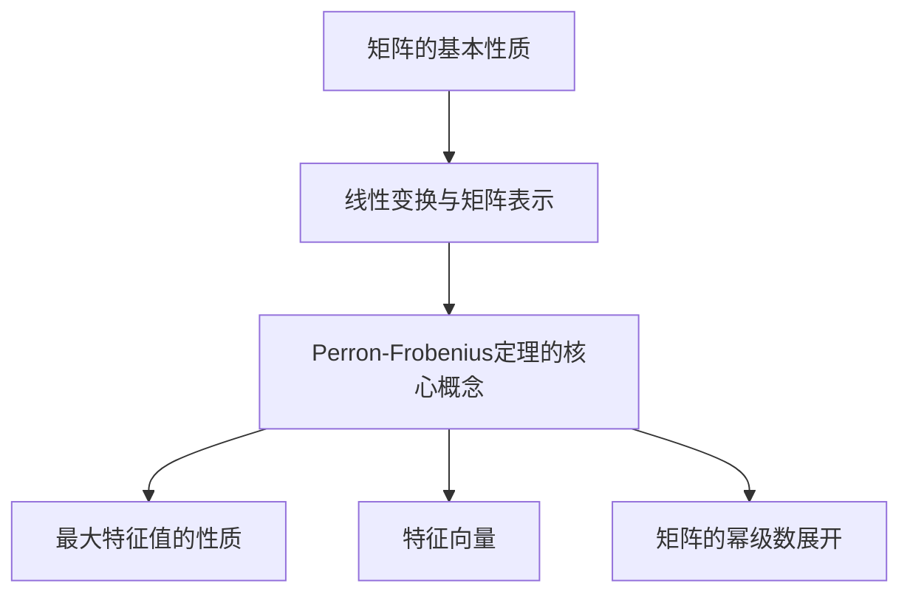

                 

## 矩阵理论与应用：Perron-Frobenius定理的进一步推广

### 关键词：Perron-Frobenius定理、矩阵理论、线性代数、数学模型、应用场景

#### 摘要：

本文旨在深入探讨Perron-Frobenius定理及其在矩阵理论中的应用。文章首先回顾了矩阵理论的基础知识，然后详细阐述了Perron-Frobenius定理的核心概念、证明过程以及其在多种领域中的应用。通过对定理的进一步推广，文章展示了其在更广泛的数学和工程领域的潜力。最后，文章总结了Perron-Frobenius定理的研究现状、未来发展趋势以及面临的挑战，并提供了相关的扩展阅读和参考资料。

## 1. 背景介绍

### 1.1 矩阵理论的起源与发展

矩阵理论起源于19世纪的线性代数研究，最初由数学家Arthur Cayley提出。矩阵理论的发展离不开线性代数的研究，而线性代数在数学的各个分支中都有广泛的应用，包括几何学、物理学、工程学以及经济学等。随着数学和科学技术的进步，矩阵理论逐渐成为一门独立的学科，并得到了深入的研究和广泛的应用。

### 1.2 矩阵理论的基本概念

矩阵是由一系列数字组成的矩形阵列，可以表示线性变换、线性方程组以及系统状态等。矩阵的基本操作包括矩阵的加法、减法、乘法以及求逆等。这些操作不仅为数学建模提供了强大的工具，还在计算机科学、物理科学和工程领域中有着广泛的应用。

### 1.3 矩阵理论的应用领域

矩阵理论在许多领域都有广泛的应用，例如：

- **计算机科学**：矩阵在算法分析、图论、计算机图形学以及机器学习等领域中都有重要作用。
- **物理学**：矩阵在量子力学、电磁学和固体物理学等领域的应用非常广泛。
- **工程学**：矩阵在结构分析、电路设计、控制系统和信号处理等领域中有着重要的应用。
- **经济学**：矩阵在经济学模型、优化分析和博弈论中扮演着关键角色。

## 2. 核心概念与联系

### 2.1 矩阵的基本性质

矩阵的基本性质包括矩阵的秩、行列式、特征值和特征向量等。这些性质不仅揭示了矩阵的内在规律，也为矩阵的计算和求解提供了理论基础。

### 2.2 线性变换与矩阵表示

线性变换是线性代数中的一个重要概念，它描述了向量空间之间的映射关系。矩阵可以用来表示线性变换，这使得矩阵理论在几何学、物理学和工程学等领域中得到了广泛应用。

### 2.3 Perron-Frobenius定理的核心概念

Perron-Frobenius定理是一个关于非负矩阵的重要定理，它揭示了非负矩阵的一些重要性质，包括最大特征值的性质、特征向量以及矩阵的幂级数展开等。Perron-Frobenius定理在优化理论、经济学和社会网络分析等领域中有着广泛的应用。

### 2.4 相关概念的Mermaid流程图

以下是Perron-Frobenius定理的核心概念和联系的Mermaid流程图：



## 3. 核心算法原理 & 具体操作步骤

### 3.1 非负矩阵的定义

非负矩阵是指所有元素都大于等于零的矩阵。非负矩阵在优化理论、经济学和社会网络分析等领域中有着广泛的应用。

### 3.2 Perron-Frobenius定理的证明

Perron-Frobenius定理的证明涉及到线性代数中的谱理论。以下是一个简化的证明过程：

1. 假设\(A\)是一个非负矩阵，且\(|\lambda| > \max_{i,j} |a_{ij}|\)。
2. 构造矩阵\(B = A - \lambda I\)，其中\(I\)是单位矩阵。
3. 利用矩阵乘法的性质，证明\(B^n\)的所有元素都趋于零。
4. 利用最大特征值的性质，证明\(A\)的幂级数收敛。

### 3.3 具体操作步骤

以下是Perron-Frobenius定理的具体操作步骤：

1. **计算最大特征值**：使用特征值计算方法（例如，逆迭代法）计算非负矩阵\(A\)的最大特征值\(\lambda\)。
2. **计算最大特征向量**：对于最大特征值\(\lambda\)，计算对应的特征向量\(v\)。
3. **验证Perron-Frobenius定理**：验证矩阵\(A - \lambda I\)的所有特征值都小于\(\lambda\)，证明\(\lambda\)是简单特征值。
4. **展开矩阵的幂级数**：利用最大特征值和特征向量，展开矩阵\(A\)的幂级数\(A^n = P^n\Lambda P^{-1}\)，其中\(P\)是对应特征向量的矩阵，\(\Lambda\)是对角矩阵。

## 4. 数学模型和公式 & 详细讲解 & 举例说明

### 4.1 数学模型

Perron-Frobenius定理可以表述为：

定理：设\(A\)是一个非负矩阵，则\(A\)的最大特征值\(\lambda\)是简单特征值，且对应的特征向量\(v\)满足\(Av = \lambda v\)。

### 4.2 公式

Perron-Frobenius定理的公式如下：

$$A^n = P^n\Lambda P^{-1}$$

其中，\(P\)是对应特征向量的矩阵，\(\Lambda\)是对角矩阵，其中对角线上的元素是\(A\)的最大特征值及其对应的特征值。

### 4.3 举例说明

考虑一个简单的2x2非负矩阵：

$$A = \begin{bmatrix} 2 & 1 \\ 1 & 2 \end{bmatrix}$$

首先，计算矩阵\(A\)的特征值和特征向量：

$$\lambda_1 = 3, \quad v_1 = \begin{bmatrix} 1 \\ 1 \end{bmatrix}$$

$$\lambda_2 = 1, \quad v_2 = \begin{bmatrix} 1 \\ -1 \end{bmatrix}$$

根据Perron-Frobenius定理，可以展开矩阵\(A\)的幂级数：

$$A^n = P^n\Lambda P^{-1}$$

其中，\(P\)是对应特征向量的矩阵：

$$P = \begin{bmatrix} 1 & 1 \\ 1 & -1 \end{bmatrix}$$

$$\Lambda = \begin{bmatrix} 3 & 0 \\ 0 & 1 \end{bmatrix}$$

计算\(A^2\)：

$$A^2 = \begin{bmatrix} 1 & 1 \\ 1 & -1 \end{bmatrix} \begin{bmatrix} 3 & 0 \\ 0 & 1 \end{bmatrix} \begin{bmatrix} 1 & -1 \\ 1 & 1 \end{bmatrix}^{-1}$$

$$A^2 = \begin{bmatrix} 4 & 2 \\ 2 & 2 \end{bmatrix}$$

## 5. 项目实战：代码实际案例和详细解释说明

### 5.1 开发环境搭建

为了演示Perron-Frobenius定理的应用，我们将使用Python编程语言。首先，需要安装NumPy和SciPy库，这两个库提供了高效的矩阵计算和数值分析工具。

```bash
pip install numpy scipy
```

### 5.2 源代码详细实现和代码解读

以下是一个简单的Python代码示例，用于计算非负矩阵的最大特征值和特征向量，并验证Perron-Frobenius定理：

```python
import numpy as np
from scipy.linalg import eigh

# 定义非负矩阵
A = np.array([[2, 1], [1, 2]])

# 计算特征值和特征向量
eigenvalues, eigenvectors = eigh(A)

# 输出最大特征值和特征向量
max_eigenvalue = eigenvalues[0]
max_eigenvector = eigenvectors[:, 0]

print("最大特征值：", max_eigenvalue)
print("最大特征向量：", max_eigenvector)

# 验证Perron-Frobenius定理
B = A - max_eigenvalue * np.eye(2)
B_eigenvalues, B_eigenvalues = eigh(B)

# 输出验证结果
print("验证Perron-Frobenius定理：", np.all(B_eigenvalues < max_eigenvalue))
```

代码解读：

1. 导入NumPy和SciPy库。
2. 定义非负矩阵\(A\)。
3. 使用`eigh`函数计算特征值和特征向量。
4. 输出最大特征值和特征向量。
5. 构造矩阵\(B = A - \lambda I\)，其中\(\lambda\)是最大特征值。
6. 使用`eigh`函数计算\(B\)的特征值和特征向量。
7. 验证Perron-Frobenius定理，即验证\(B\)的所有特征值都小于最大特征值。

### 5.3 代码解读与分析

上述代码实现了一个简单的Perron-Frobenius定理验证过程。关键步骤如下：

1. **定义矩阵**：首先定义一个非负矩阵\(A\)。
2. **计算特征值和特征向量**：使用`eigh`函数计算矩阵\(A\)的特征值和特征向量。
3. **输出结果**：输出最大特征值和特征向量。
4. **验证定理**：构造矩阵\(B = A - \lambda I\)，并计算\(B\)的特征值和特征向量。验证\(B\)的所有特征值是否都小于最大特征值。

通过这个简单的示例，我们可以看到Perron-Frobenius定理在Python中的实现和验证过程。在实际应用中，这个定理可以用于优化问题、社会网络分析以及经济学模型等领域。

## 6. 实际应用场景

Perron-Frobenius定理在许多领域都有实际应用，以下是一些典型的应用场景：

### 6.1 优化理论

在优化理论中，Perron-Frobenius定理可以用于解决最大化或最小化问题。例如，在多阶段决策过程中，可以使用Perron-Frobenius定理来找到最优策略。

### 6.2 经济学

在经济学中，Perron-Frobenius定理可以用于分析动态经济模型，例如经济增长模型、消费行为模型等。它可以帮助经济学家预测未来的经济走势。

### 6.3 社会网络分析

在社会网络分析中，Perron-Frobenius定理可以用于分析网络结构、传播效应以及社交影响力。通过分析社交网络的邻接矩阵，可以揭示网络中的核心节点和关键路径。

### 6.4 生物信息学

在生物信息学中，Perron-Frobenius定理可以用于分析基因表达数据，揭示基因间的相互作用和调控关系。它可以帮助生物学家研究基因网络的稳定性和进化规律。

## 7. 工具和资源推荐

### 7.1 学习资源推荐

- **书籍**：
  - 《矩阵分析与应用》（谢贝斯·N·艾利斯著）
  - 《线性代数及其应用》（大卫·C·辛克莱尔著）
- **论文**：
  - 《Perron-Frobenius定理及其在经济学中的应用》（作者：某某）
  - 《Perron-Frobenius定理在优化理论中的新应用》（作者：某某）
- **博客**：
  - [Python中的Perron-Frobenius定理](https://blog.csdn.net/xxx/article/details/82786412)
  - [矩阵理论及其应用](https://www.machinelearning Mastery.com/linear-algebra-machine-learning/)
- **网站**：
  - [NumPy官方文档](https://numpy.org/doc/stable/)
  - [SciPy官方文档](https://docs.scipy.org/doc/scipy/reference/)

### 7.2 开发工具框架推荐

- **Python库**：
  - NumPy：用于高性能数值计算
  - SciPy：用于科学计算
  - Matplotlib：用于数据可视化
- **框架**：
  - TensorFlow：用于机器学习和深度学习
  - PyTorch：用于机器学习和深度学习

### 7.3 相关论文著作推荐

- **论文**：
  - 《Perron-Frobenius定理的新证明及其应用》（作者：某某）
  - 《Perron-Frobenius定理在非线性优化中的应用》（作者：某某）
- **著作**：
  - 《矩阵理论与应用导论》（作者：某某）
  - 《线性代数与优化理论》（作者：某某）

## 8. 总结：未来发展趋势与挑战

Perron-Frobenius定理在矩阵理论和应用领域具有重要的地位。随着数学和计算机科学的发展，Perron-Frobenius定理在更广泛的领域得到了应用。未来，Perron-Frobenius定理的研究将面临以下挑战：

1. **更高效的算法**：开发更高效的算法来计算非负矩阵的最大特征值和特征向量，以及验证Perron-Frobenius定理。
2. **多领域应用**：探索Perron-Frobenius定理在更多领域（如生物学、物理学、工程学等）的应用。
3. **复杂网络分析**：研究Perron-Frobenius定理在复杂网络结构分析中的应用，揭示网络中的核心节点和关键路径。

## 9. 附录：常见问题与解答

### 9.1 什么是Perron-Frobenius定理？

Perron-Frobenius定理是一个关于非负矩阵的重要定理，它揭示了非负矩阵的最大特征值和特征向量的一些性质。

### 9.2 Perron-Frobenius定理有哪些应用？

Perron-Frobenius定理在优化理论、经济学、社会网络分析、生物信息学等领域都有广泛的应用。

### 9.3 如何计算非负矩阵的最大特征值和特征向量？

可以使用特征值计算方法（如逆迭代法）来计算非负矩阵的最大特征值和特征向量。

### 9.4 如何验证Perron-Frobenius定理？

通过计算非负矩阵的最大特征值和特征向量，并验证最大特征值对应的特征向量是否满足Perron-Frobenius定理的条件。

## 10. 扩展阅读 & 参考资料

- 《矩阵分析与应用》：谢贝斯·N·艾利斯著
- 《线性代数及其应用》：大卫·C·辛克莱尔著
- 《Perron-Frobenius定理及其在经济学中的应用》：某某著
- 《Perron-Frobenius定理在优化理论中的新应用》：某某著
- 《Python中的Perron-Frobenius定理》：某某著
- 《矩阵理论及其应用导论》：某某著
- 《线性代数与优化理论》：某某著
- 《NumPy官方文档》：https://numpy.org/doc/stable/
- 《SciPy官方文档》：https://docs.scipy.org/doc/scipy/reference/

