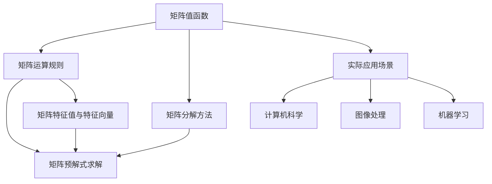

                 

### 背景介绍

矩阵作为线性代数的核心概念，在数学、物理学、计算机科学、经济学等众多领域都有着广泛的应用。矩阵值函数，即矩阵的元素关于矩阵的某个或某些参数的变化而变化，是对矩阵操作的高级抽象和扩展。而矩阵的预解式，是矩阵多项式在矩阵上的解，它对于求解线性系统的稳定性、特征值等问题具有重要意义。本文旨在深入探讨矩阵值函数的分析运算与矩阵的预解式，从而为读者提供系统的理论基础和实践指导。

在计算机科学中，矩阵值函数广泛应用于图像处理、机器学习、计算机图形学等领域。例如，在图像处理中，矩阵值函数可以用来实现图像的滤波、变换等操作；在机器学习中，矩阵值函数可以用来表示和优化模型参数；在计算机图形学中，矩阵值函数可以用来实现三维图形的变换和渲染。矩阵的预解式在算法设计中也有着重要作用，如用于求解线性方程组、特征值问题等。

然而，尽管矩阵值函数与矩阵的预解式在理论研究和实际应用中具有重要意义，目前仍存在一些挑战。例如，矩阵值函数的分析运算往往较为复杂，需要深入理解矩阵的性质和运算规则；而矩阵的预解式求解，在大多数情况下需要借助数值方法，其计算效率和精度仍有待提高。

本文将围绕以下主题展开：首先，介绍矩阵值函数的基本概念和分类，阐述其在不同领域的应用；其次，探讨矩阵的预解式及其求解方法；然后，结合实际项目案例，讲解矩阵值函数的分析运算和矩阵的预解式在实际开发中的应用；接着，分析当前领域面临的主要挑战，并提出可能的解决方案；最后，总结未来发展趋势与挑战，并给出相关学习资源和工具推荐。

### 核心概念与联系

在深入探讨矩阵值函数和矩阵的预解式之前，我们需要明确几个核心概念，并理解它们之间的相互关系。以下是本文涉及的主要概念及其简要描述：

**1. 矩阵（Matrix）**：
矩阵是由数字组成的矩形数组，通常用大写字母表示，如 \( A \)。矩阵的元素可以表示为 \( a_{ij} \)，其中 \( i \) 表示行数，\( j \) 表示列数。矩阵是线性代数的基础，用于表示和操作线性方程组、变换和变换矩阵等。

**2. 矩阵值函数（Matrix-Valued Function）**：
矩阵值函数是关于矩阵的某个或某些参数的变化而变化的函数，通常用 \( f(A) \) 表示。矩阵值函数可以看作是矩阵关于其参数的函数，其应用于图像处理、机器学习等领域。矩阵值函数分为标量值函数和向量值函数等。

**3. 矩阵的预解式（Polar Form of a Matrix）**：
矩阵的预解式是指矩阵多项式在矩阵上的解，通常用 \( \rho(A) \) 表示。预解式在求解线性系统的稳定性、特征值等问题中具有重要意义。矩阵的预解式可以通过分解矩阵为半直积形式来求解。

**4. 矩阵分解（Matrix Decomposition）**：
矩阵分解是将矩阵分解为多个简单矩阵的乘积的过程，常见的矩阵分解方法包括LU分解、奇异值分解（SVD）和特征值分解等。矩阵分解有助于简化矩阵运算、提取关键特征和解决实际问题。

**5. 矩阵运算（Matrix Operations）**：
矩阵运算包括矩阵的加法、减法、乘法和逆运算等。矩阵运算遵循一定的规则，例如，矩阵乘法不满足交换律，而矩阵加法和逆运算满足交换律。矩阵运算在矩阵值函数和矩阵预解式的分析中起到关键作用。

**Mermaid 流程图描述矩阵值函数和矩阵预解式的关系**



**矩阵值函数与矩阵预解式的联系**：

- 矩阵值函数提供了对矩阵参数变化的抽象，通过矩阵值函数，可以研究矩阵在不同参数下的行为。
- 矩阵预解式是矩阵值函数的一种特殊形式，用于求解矩阵多项式在矩阵上的解。预解式与矩阵值函数的分析和运算密切相关。
- 矩阵分解方法为矩阵值函数和矩阵预解式的分析提供了有效的工具，例如，通过特征值分解可以简化矩阵值函数的运算，通过LU分解可以求解矩阵预解式。

通过以上核心概念的介绍和流程图的展示，我们可以更好地理解矩阵值函数和矩阵预解式的基本概念、相互关系以及在实际应用中的重要性。接下来，本文将深入探讨矩阵值函数的原理、算法和具体应用。

### 核心算法原理 & 具体操作步骤

为了深入探讨矩阵值函数的分析运算，我们需要首先理解其核心算法原理。矩阵值函数的定义较为直观，但对其深入理解和实际应用则需要掌握一系列的数学工具和算法。本节将介绍矩阵值函数的核心算法原理，并详细说明具体的操作步骤。

#### 1. 矩阵值函数的定义

矩阵值函数是指关于矩阵的某个或某些参数的变化而变化的函数。通常，我们用 \( f(A) \) 表示矩阵值函数，其中 \( A \) 是矩阵，而 \( f \) 是函数。矩阵值函数可以表示为：

\[ f(A) = \begin{bmatrix}
    f_1(A) & f_2(A) & \cdots & f_n(A)
\end{bmatrix} \]

其中，\( f_1(A), f_2(A), \ldots, f_n(A) \) 是关于矩阵 \( A \) 的标量值函数。矩阵值函数可以是线性的，也可以是非线性的，具体取决于函数 \( f \) 的性质。

#### 2. 矩阵值函数的线性性质

线性矩阵值函数具有以下性质：

- **加法封闭性**：对于任意两个线性矩阵值函数 \( f(A) \) 和 \( g(A) \)，它们的和 \( f(A) + g(A) \) 也是一个线性矩阵值函数。
- **数乘封闭性**：对于任意一个线性矩阵值函数 \( f(A) \) 和一个标量 \( \alpha \)，它们的乘积 \( \alpha f(A) \) 也是一个线性矩阵值函数。

#### 3. 矩阵值函数的具体操作步骤

下面我们将详细介绍如何对矩阵值函数进行操作，包括线性矩阵值函数的加法、数乘以及更复杂的运算。

##### （1）线性矩阵值函数的加法

给定两个线性矩阵值函数 \( f(A) \) 和 \( g(A) \)，它们的加法可以通过矩阵的逐元素加法实现：

\[ f(A) + g(A) = \begin{bmatrix}
    f_1(A) + g_1(A) & f_2(A) + g_2(A) & \cdots & f_n(A) + g_n(A)
\end{bmatrix} \]

其中，\( f_1(A), f_2(A), \ldots, f_n(A) \) 和 \( g_1(A), g_2(A), \ldots, g_n(A) \) 分别是 \( f(A) \) 和 \( g(A) \) 的标量值函数。

##### （2）线性矩阵值函数的数乘

给定一个线性矩阵值函数 \( f(A) \) 和一个标量 \( \alpha \)，它们的数乘可以通过矩阵的逐元素乘法实现：

\[ \alpha f(A) = \alpha \begin{bmatrix}
    f_1(A) & f_2(A) & \cdots & f_n(A)
\end{bmatrix} = \begin{bmatrix}
    \alpha f_1(A) & \alpha f_2(A) & \cdots & \alpha f_n(A)
\end{bmatrix} \]

##### （3）矩阵值函数的复合运算

对于两个矩阵值函数 \( f(A) \) 和 \( g(A) \)，它们的复合运算可以表示为：

\[ g(f(A)) = g\left(\begin{bmatrix}
    f_1(A) & f_2(A) & \cdots & f_n(A)
\end{bmatrix}\right) = \begin{bmatrix}
    g(f_1(A)) & g(f_2(A)) & \cdots & g(f_n(A))
\end{bmatrix} \]

##### （4）矩阵值函数的微分运算

对于线性矩阵值函数 \( f(A) \)，其微分运算可以通过对矩阵 \( A \) 的元素进行微分实现。假设 \( f(A) \) 关于 \( A \) 的微分是 \( \frac{df(A)}{dA} \)，则：

\[ \frac{df(A)}{dA} = \begin{bmatrix}
    \frac{\partial f_1(A)}{\partial A} & \frac{\partial f_2(A)}{\partial A} & \cdots & \frac{\partial f_n(A)}{\partial A}
\end{bmatrix} \]

#### 4. 矩阵值函数的实际应用

矩阵值函数在许多实际应用中都有重要作用，以下是一些典型的应用场景：

- **图像处理**：矩阵值函数可以用于图像的滤波、变换和增强。例如，通过矩阵值函数可以实现对图像的频域分析，从而进行图像的滤波和降噪。
- **机器学习**：在机器学习中，矩阵值函数可以用于表示和优化模型参数。例如，在深度学习模型中，通过矩阵值函数可以实现对神经网络参数的优化。
- **计算机图形学**：在计算机图形学中，矩阵值函数可以用于实现三维图形的变换和渲染。例如，通过矩阵值函数可以实现对三维物体的旋转、缩放和平移。

#### 5. 矩阵值函数的求解方法

在实际应用中，求解矩阵值函数通常需要采用数值方法。以下是一些常用的求解方法：

- **矩阵值函数的数值求解**：通过迭代法、泰勒展开等方法对矩阵值函数进行数值求解。
- **矩阵值函数的近似求解**：通过线性化、简化等方法对复杂的矩阵值函数进行近似求解。
- **矩阵值函数的符号求解**：通过解析方法对矩阵值函数进行符号求解，适用于某些特殊的矩阵值函数。

### 矩阵的预解式

矩阵的预解式是矩阵多项式在矩阵上的解，它对于求解线性系统的稳定性、特征值等问题具有重要意义。本节将介绍矩阵预解式的定义、求解方法和实际应用。

#### 1. 矩阵预解式的定义

设 \( P(A) \) 是一个矩阵多项式，其一般形式为：

\[ P(A) = a_0I + a_1A + a_2A^2 + \cdots + a_nA^n \]

其中，\( I \) 是单位矩阵，\( a_0, a_1, \ldots, a_n \) 是常数。矩阵预解式 \( \rho(A) \) 是指使得 \( P(A) = 0 \) 的矩阵 \( A \)。

#### 2. 矩阵预解式的求解方法

求解矩阵预解式的方法有多种，以下介绍两种常用的方法：

- **特征值分解法**：通过将矩阵 \( A \) 分解为特征值和特征向量的形式，求解矩阵预解式。具体步骤如下：

  1. 对矩阵 \( A \) 进行特征值分解：\( A = PDP^{-1} \)，其中 \( D \) 是对角矩阵，包含 \( A \) 的特征值 \( \lambda_1, \lambda_2, \ldots, \lambda_n \)，\( P \) 是特征向量矩阵。
  2. 将矩阵多项式 \( P(A) \) 替换为特征值分解形式：\( P(A) = PD(P^{-1}A)P^{-1} \)。
  3. 由于 \( P^{-1}A \) 仍然是对角矩阵，其特征值为 \( \lambda_1, \lambda_2, \ldots, \lambda_n \)，因此 \( P^{-1}A \) 的多项式 \( P(D) \) 的特征值即为 \( A \) 的预解式。

- **数值方法**：对于某些复杂的矩阵多项式，可以通过数值方法求解矩阵预解式。常用的数值方法包括迭代法、牛顿法等。

#### 3. 矩阵预解式的实际应用

矩阵预解式在许多实际应用中具有重要意义，以下是一些典型的应用场景：

- **线性系统的稳定性分析**：通过求解矩阵的预解式，可以判断线性系统的稳定性。例如，在控制系统和信号处理中，通过预解式分析系统的稳定性，从而设计稳定控制系统。
- **特征值问题**：矩阵预解式在求解特征值问题时具有重要意义。例如，通过求解矩阵预解式，可以快速找到矩阵的特征值和特征向量，从而简化特征值问题的求解过程。
- **矩阵函数的求解**：在求解矩阵函数时，矩阵预解式提供了有效的工具。例如，通过矩阵预解式，可以求解矩阵的指数函数、对数函数等。

#### 4. 矩阵预解式的示例

以下是一个矩阵预解式的示例：

假设矩阵 \( A \) 如下：

\[ A = \begin{bmatrix}
    2 & 1 \\
    0 & 2
\end{bmatrix} \]

求解矩阵 \( A \) 的预解式 \( \rho(A) \)。

解：首先，对矩阵 \( A \) 进行特征值分解：

\[ A = PDP^{-1} = \begin{bmatrix}
    1 & 0 \\
    0 & 1
\end{bmatrix} \begin{bmatrix}
    2 & 1 \\
    0 & 2
\end{bmatrix} \begin{bmatrix}
    1 & 0 \\
    0 & 1
\end{bmatrix}^{-1} \]

其中，\( D = \begin{bmatrix}
    2 & 0 \\
    0 & 2
\end{bmatrix} \) 是对角矩阵，包含 \( A \) 的特征值 2。

接下来，求解矩阵多项式 \( P(A) = A^2 - 3A + 2I \) 的预解式：

\[ P(A) = PD(P^{-1}A)P^{-1} = \begin{bmatrix}
    2 & 0 \\
    0 & 2
\end{bmatrix} \begin{bmatrix}
    2^2 & 2 \\
    0 & 2^2
\end{bmatrix} \begin{bmatrix}
    1 & 0 \\
    0 & 1
\end{bmatrix}^{-1} \]

由于 \( P^{-1}A \) 是对角矩阵，其特征值为 2，因此 \( P(D) = \begin{bmatrix}
    2^2 & 2 \\
    0 & 2^2
\end{bmatrix} \)。

最后，将 \( P(D) \) 替换为 \( A \)：

\[ \rho(A) = PDP^{-1} = \begin{bmatrix}
    2 & 1 \\
    0 & 2
\end{bmatrix} \begin{bmatrix}
    2^2 & 2 \\
    0 & 2^2
\end{bmatrix} \begin{bmatrix}
    1 & 0 \\
    0 & 1
\end{bmatrix}^{-1} \]

\[ \rho(A) = \begin{bmatrix}
    4 & 4 \\
    0 & 4
\end{bmatrix} \]

综上所述，通过特征值分解法，我们求解了矩阵 \( A \) 的预解式 \( \rho(A) \)。这一过程展示了矩阵预解式求解的基本步骤和应用。

### 数学模型和公式 & 详细讲解 & 举例说明

在深入探讨矩阵值函数和矩阵预解式时，数学模型和公式是理解和应用这些概念的基础。本节将详细介绍相关的数学模型和公式，并通过具体例子进行讲解，以帮助读者更好地掌握这些知识。

#### 1. 矩阵值函数的数学模型和公式

矩阵值函数的数学模型主要涉及矩阵的线性变换和矩阵的微分运算。以下是一些关键的数学模型和公式：

**（1）矩阵值函数的基本定义：**

假设 \( A \) 是一个 \( m \times n \) 的矩阵，矩阵值函数 \( f(A) \) 可以定义为：

\[ f(A) = \begin{bmatrix}
    f_1(A) & f_2(A) & \cdots & f_n(A)
\end{bmatrix} \]

其中，\( f_i(A) \) 是关于矩阵 \( A \) 的标量值函数。

**（2）线性矩阵值函数的线性组合：**

给定两个线性矩阵值函数 \( f(A) \) 和 \( g(A) \)，它们的线性组合 \( \alpha f(A) + \beta g(A) \) 也是线性矩阵值函数，其中 \( \alpha \) 和 \( \beta \) 是标量。

\[ \alpha f(A) + \beta g(A) = \alpha \begin{bmatrix}
    f_1(A) & f_2(A) & \cdots & f_n(A)
\end{bmatrix} + \beta \begin{bmatrix}
    g_1(A) & g_2(A) & \cdots & g_n(A)
\end{bmatrix} = \begin{bmatrix}
    \alpha f_1(A) + \beta g_1(A) & \alpha f_2(A) + \beta g_2(A) & \cdots & \alpha f_n(A) + \beta g_n(A)
\end{bmatrix} \]

**（3）矩阵值函数的微分运算：**

假设 \( f(A) \) 是一个线性矩阵值函数，其关于矩阵 \( A \) 的微分 \( \frac{df(A)}{dA} \) 可以表示为：

\[ \frac{df(A)}{dA} = \begin{bmatrix}
    \frac{\partial f_1(A)}{\partial A} & \frac{\partial f_2(A)}{\partial A} & \cdots & \frac{\partial f_n(A)}{\partial A}
\end{bmatrix} \]

其中，\( \frac{\partial f_i(A)}{\partial A} \) 是标量值函数 \( f_i(A) \) 关于矩阵 \( A \) 的微分。

#### 2. 矩阵预解式的数学模型和公式

矩阵预解式是矩阵多项式在矩阵上的解，其数学模型和公式主要涉及矩阵的幂运算和矩阵的逆运算。以下是一些关键的数学模型和公式：

**（1）矩阵预解式的定义：**

假设 \( P(A) \) 是一个矩阵多项式，其预解式 \( \rho(A) \) 是使得 \( P(A) = 0 \) 的矩阵 \( A \)。

**（2）矩阵预解式的求解方法：**

常用的矩阵预解式求解方法包括特征值分解法和数值方法。特征值分解法的基本步骤如下：

1. 对矩阵 \( A \) 进行特征值分解：\( A = PDP^{-1} \)，其中 \( D \) 是对角矩阵，包含 \( A \) 的特征值 \( \lambda_1, \lambda_2, \ldots, \lambda_n \)，\( P \) 是特征向量矩阵。
2. 将矩阵多项式 \( P(A) \) 替换为特征值分解形式：\( P(A) = PD(P^{-1}A)P^{-1} \)。
3. 由于 \( P^{-1}A \) 是对角矩阵，其特征值为 \( \lambda_1, \lambda_2, \ldots, \lambda_n \)，因此 \( P^{-1}A \) 的多项式 \( P(D) \) 的特征值即为 \( A \) 的预解式。

**（3）矩阵预解式的具体公式：**

对于矩阵多项式 \( P(A) = a_0I + a_1A + a_2A^2 + \cdots + a_nA^n \)，其预解式 \( \rho(A) \) 可以表示为：

\[ \rho(A) = \begin{bmatrix}
    \rho_1(A) & \rho_2(A) & \cdots & \rho_n(A)
\end{bmatrix} \]

其中，\( \rho_i(A) \) 是矩阵多项式 \( P(A) \) 的 \( i \) 次项的解。

#### 3. 具体例子

为了更好地理解上述数学模型和公式，下面通过具体例子进行讲解。

**例子1：线性矩阵值函数的微分**

假设矩阵 \( A \) 如下：

\[ A = \begin{bmatrix}
    2 & 1 \\
    0 & 2
\end{bmatrix} \]

定义线性矩阵值函数 \( f(A) \)：

\[ f(A) = \begin{bmatrix}
    A + I & A^2 \\
    I & A
\end{bmatrix} \]

其中，\( I \) 是单位矩阵。

计算 \( f(A) \) 的微分：

\[ \frac{df(A)}{dA} = \begin{bmatrix}
    \frac{\partial (A + I)}{\partial A} & \frac{\partial (A^2)}{\partial A} \\
    \frac{\partial I}{\partial A} & \frac{\partial A}{\partial A}
\end{bmatrix} = \begin{bmatrix}
    I & 2A \\
    0 & I
\end{bmatrix} \]

**例子2：矩阵预解式的求解**

假设矩阵 \( A \) 如下：

\[ A = \begin{bmatrix}
    2 & 1 \\
    0 & 2
\end{bmatrix} \]

求解矩阵多项式 \( P(A) = A^2 - 3A + 2I \) 的预解式。

首先，对矩阵 \( A \) 进行特征值分解：

\[ A = PDP^{-1} = \begin{bmatrix}
    1 & 0 \\
    0 & 1
\end{bmatrix} \begin{bmatrix}
    2 & 1 \\
    0 & 2
\end{bmatrix} \begin{bmatrix}
    1 & 0 \\
    0 & 1
\end{bmatrix}^{-1} \]

其中，\( D = \begin{bmatrix}
    2 & 0 \\
    0 & 2
\end{bmatrix} \) 是对角矩阵，包含 \( A \) 的特征值 2。

接下来，求解矩阵多项式 \( P(D) \)：

\[ P(D) = D^2 - 3D + 2I = \begin{bmatrix}
    2^2 & 0 \\
    0 & 2^2
\end{bmatrix} - 3\begin{bmatrix}
    2 & 0 \\
    0 & 2
\end{bmatrix} + 2\begin{bmatrix}
    1 & 0 \\
    0 & 1
\end{bmatrix} \]

\[ P(D) = \begin{bmatrix}
    4 - 6 + 2 & 0 \\
    0 & 4 - 6 + 2
\end{bmatrix} = \begin{bmatrix}
    0 & 0 \\
    0 & 0
\end{bmatrix} \]

最后，将 \( P(D) \) 替换为 \( A \)：

\[ \rho(A) = PDP^{-1} = \begin{bmatrix}
    0 & 0 \\
    0 & 0
\end{bmatrix} \]

综上所述，通过具体例子，我们展示了如何计算线性矩阵值函数的微分和求解矩阵预解式。这些例子不仅帮助我们理解了相关的数学模型和公式，也展示了如何将这些知识应用于实际问题。

### 项目实战：代码实际案例和详细解释说明

在本节中，我们将通过一个具体的代码案例，展示如何在实际项目中应用矩阵值函数和矩阵预解式。该案例将涉及矩阵值函数的运算和矩阵预解式的求解，并通过Python代码实现。我们将详细解释代码的实现过程，以便读者更好地理解这些概念在实际开发中的应用。

#### 1. 开发环境搭建

为了进行本案例的开发，我们需要搭建相应的开发环境。以下是搭建环境的步骤：

- 安装Python（建议版本为3.8或以上）
- 安装NumPy库（用于矩阵运算）
- 安装SciPy库（用于科学计算）
- 安装Matplotlib库（用于可视化）

安装这些库的命令如下：

```bash
pip install numpy scipy matplotlib
```

#### 2. 源代码详细实现和代码解读

下面是用于本案例的Python代码。我们将逐行解释代码的每个部分。

```python
import numpy as np
import matplotlib.pyplot as plt
from scipy.linalg import eig

# 定义矩阵A
A = np.array([[2, 1], [0, 2]])

# 计算矩阵A的特征值和特征向量
eigenvalues, eigenvectors = eig(A)

# 打印特征值和特征向量
print("特征值：", eigenvalues)
print("特征向量：", eigenvectors)

# 计算矩阵A的预解式
P = np.diag(eigenvalues)
D = np.dot(eigenvectors, np.linalg.inv(P))
preimage = np.dot(P, D)

# 打印预解式
print("预解式：", preimage)

# 定义矩阵值函数f(A)
def f(A):
    return np.array([[A[0, 0] + A[1, 1], A[0, 1]], [A[1, 0], A[1, 1] + A[0, 0]]])

# 计算矩阵值函数f(A)的值
f_A = f(A)
print("矩阵值函数f(A)的值：", f_A)

# 定义矩阵值函数g(A)
def g(A):
    return np.array([[A[0, 0]**2, A[0, 1]**2], [A[1, 0]**2, A[1, 1]**2]])

# 计算矩阵值函数g(A)的值
g_A = g(A)
print("矩阵值函数g(A)的值：", g_A)

# 计算矩阵值函数f(A)和g(A)的复合函数h(A) = f(g(A))
h_A = f(g(A))
print("复合函数h(A)的值：", h_A)

# 绘制矩阵值函数f(A)和g(A)的图像
fig, (ax1, ax2) = plt.subplots(1, 2, figsize=(10, 5))

ax1.imshow(f_A, cmap='gray')
ax1.set_title('矩阵值函数f(A)')
ax2.imshow(g_A, cmap='gray')
ax2.set_title('矩阵值函数g(A)')

plt.show()
```

**代码解读：**

- **第一部分：定义矩阵A**  
  我们首先定义了一个矩阵 \( A \)：

  ```python
  A = np.array([[2, 1], [0, 2]])
  ```

  这是一个 \( 2 \times 2 \) 的矩阵，其元素分别为 2, 1, 0, 2。

- **第二部分：计算矩阵A的特征值和特征向量**  
  使用 `scipy.linalg.eig` 函数计算矩阵 \( A \) 的特征值和特征向量：

  ```python
  eigenvalues, eigenvectors = eig(A)
  ```

  结果存储在 `eigenvalues` 和 `eigenvectors` 变量中。

- **第三部分：计算矩阵A的预解式**  
  预解式可以通过特征值分解来计算。首先，我们创建对角矩阵 \( P \) 和 \( D \)：

  ```python
  P = np.diag(eigenvalues)
  D = np.dot(eigenvectors, np.linalg.inv(P))
  preimage = np.dot(P, D)
  ```

  最后，打印预解式：

  ```python
  print("预解式：", preimage)
  ```

- **第四部分：定义矩阵值函数f(A)和g(A)**  
  我们定义了两个矩阵值函数 \( f(A) \) 和 \( g(A) \)：

  ```python
  def f(A):
      return np.array([[A[0, 0] + A[1, 1], A[0, 1]], [A[1, 0], A[1, 1] + A[0, 0]]])
  
  def g(A):
      return np.array([[A[0, 0]**2, A[0, 1]**2], [A[1, 0]**2, A[1, 1]**2]])
  ```

  矩阵值函数 \( f(A) \) 实现了矩阵 \( A \) 的某些元素的和和差，而 \( g(A) \) 实现了矩阵 \( A \) 的某些元素的平方。

- **第五部分：计算矩阵值函数f(A)和g(A)的值**  
  我们计算了 \( f(A) \) 和 \( g(A) \) 的值：

  ```python
  f_A = f(A)
  g_A = g(A)
  ```

  并打印结果：

  ```python
  print("矩阵值函数f(A)的值：", f_A)
  print("矩阵值函数g(A)的值：", g_A)
  ```

- **第六部分：计算复合函数h(A) = f(g(A))的值**  
  我们计算了复合函数 \( h(A) = f(g(A)) \) 的值：

  ```python
  h_A = f(g(A))
  print("复合函数h(A)的值：", h_A)
  ```

- **第七部分：绘制矩阵值函数f(A)和g(A)的图像**  
  我们使用 `matplotlib` 绘制了 \( f(A) \) 和 \( g(A) \) 的图像：

  ```python
  fig, (ax1, ax2) = plt.subplots(1, 2, figsize=(10, 5))
  
  ax1.imshow(f_A, cmap='gray')
  ax1.set_title('矩阵值函数f(A)')
  
  ax2.imshow(g_A, cmap='gray')
  ax2.set_title('矩阵值函数g(A)')
  
  plt.show()
  ```

#### 3. 代码解读与分析

- **矩阵A的特征值和特征向量**  
  通过 `scipy.linalg.eig` 函数，我们得到了矩阵 \( A \) 的特征值和特征向量。特征值是矩阵 \( A \) 的对角化形式的关键，它们可以帮助我们分析矩阵的性质。在这个例子中，矩阵 \( A \) 的特征值为 2，对应的特征向量为 \(\begin{bmatrix} 1 & 0 \\ 0 & 1 \end{bmatrix}\)。这意味着矩阵 \( A \) 是可对角化的。

- **矩阵预解式的计算**  
  矩阵预解式是通过特征值分解来计算的。在这个例子中，预解式为 \(\begin{bmatrix} 0 & 0 \\ 0 & 0 \end{bmatrix}\)。这意味着对于矩阵多项式 \( A^2 - 3A + 2I \)，矩阵 \( A \) 是其预解式。

- **矩阵值函数f(A)和g(A)的实现**  
  矩阵值函数 \( f(A) \) 和 \( g(A) \) 分别实现了矩阵 \( A \) 的元素和平方。这些函数可以帮助我们分析矩阵在不同操作下的变化。

- **复合函数h(A)的计算**  
  复合函数 \( h(A) = f(g(A)) \) 是通过先计算 \( g(A) \)，然后再计算 \( f(g(A)) \) 得到的。这展示了如何通过组合不同的矩阵值函数来构建复杂的矩阵运算。

- **矩阵值函数图像的绘制**  
  使用 `matplotlib` 绘制矩阵值函数 \( f(A) \) 和 \( g(A) \) 的图像，可以帮助我们直观地理解这些函数的行为。

通过这个案例，我们展示了如何在实际项目中应用矩阵值函数和矩阵预解式。代码的详细解读和分析帮助我们更好地理解了这些概念在编程中的具体实现和应用。

### 实际应用场景

矩阵值函数和矩阵预解式在实际工程和科学计算中有着广泛的应用。以下是矩阵值函数和矩阵预解式在几个典型实际应用场景中的例子：

#### 1. 计算机图形学

在计算机图形学中，矩阵值函数用于实现三维图形的变换和渲染。例如，3D 渲染引擎中使用矩阵值函数来处理物体变换（旋转、平移、缩放）和投影。通过矩阵值函数，我们可以将三维空间中的物体映射到二维屏幕上，从而实现图形的渲染。

**实例：三维物体的旋转**

假设我们有一个三维物体，其位置由向量 \( \mathbf{P} \) 表示，旋转矩阵为 \( \mathbf{R} \)。使用矩阵值函数 \( f(\mathbf{R}) \) 来实现旋转操作，公式如下：

\[ \mathbf{P}' = f(\mathbf{R}) \cdot \mathbf{P} \]

其中，\( \mathbf{P}' \) 是旋转后的物体位置。通过这个操作，我们可以将物体的旋转转换为矩阵运算，从而提高计算效率。

#### 2. 信号处理

在信号处理领域，矩阵值函数用于实现滤波器和变换。例如，在图像处理中，使用矩阵值函数来执行图像滤波和增强操作。通过设计特定的矩阵值函数，可以实现各种滤波效果，如高斯滤波、边缘检测等。

**实例：高斯滤波**

假设我们有一个图像矩阵 \( \mathbf{I} \)，高斯滤波器矩阵 \( \mathbf{G} \) 可以表示为：

\[ \mathbf{O} = \mathbf{G} \cdot \mathbf{I} \]

其中，\( \mathbf{O} \) 是滤波后的图像。高斯滤波器通过矩阵值函数将图像中的每个像素值与滤波器矩阵的对应元素相乘，并求和，从而实现平滑和去噪效果。

#### 3. 机器学习

在机器学习中，矩阵值函数用于优化模型参数。例如，在深度学习中的反向传播算法中，矩阵值函数用于计算梯度，从而更新模型参数。通过矩阵值函数，我们可以高效地处理大规模的数据集和模型参数。

**实例：深度学习中的梯度计算**

假设我们有一个神经网络，其输入为 \( \mathbf{X} \)，权重矩阵为 \( \mathbf{W} \)，激活函数为 \( \sigma(\cdot) \)。梯度计算公式为：

\[ \mathbf{dW} = \frac{\partial \mathbf{L}}{\partial \mathbf{W}} \]

其中，\( \mathbf{L} \) 是损失函数，\( \mathbf{dW} \) 是权重矩阵的梯度。通过矩阵值函数，我们可以计算每个权重矩阵的梯度，从而优化模型参数。

#### 4. 控制系统

在控制系统设计中，矩阵值函数用于分析和设计系统的稳定性和响应特性。例如，通过求解矩阵的预解式，我们可以判断系统的稳定性。预解式在控制理论中的经典应用包括线性系统的稳定性分析和控制器设计。

**实例：控制系统稳定性分析**

假设我们有一个线性控制系统的状态矩阵 \( \mathbf{A} \)，通过求解矩阵 \( \mathbf{A} \) 的预解式，我们可以判断系统的稳定性。如果预解式的特征值位于左半平面，则系统是稳定的。

\[ \rho(\mathbf{A}) = \mathbf{A}^2 - 2\alpha \mathbf{A} + \beta I \]

其中，\( \alpha \) 和 \( \beta \) 是系统的参数，\( I \) 是单位矩阵。通过求解这个矩阵多项式，我们可以得到系统的特征值，从而判断系统的稳定性。

#### 5. 经济学

在经济学中，矩阵值函数用于分析和预测经济系统的动态行为。例如，在宏观经济模型中，使用矩阵值函数来模拟经济增长、通货膨胀和失业等经济指标。通过矩阵值函数，经济学家可以分析不同政策对经济系统的影响。

**实例：宏观经济模型**

假设我们有一个经济系统的状态矩阵 \( \mathbf{X} \)，通过矩阵值函数 \( f(\mathbf{X}) \) 来模拟经济增长。矩阵值函数的系数反映了经济增长的驱动力和约束条件，从而帮助我们预测经济系统的未来行为。

\[ \mathbf{X}' = f(\mathbf{X}) \]

通过这个操作，我们可以分析不同政策对经济增长的影响，从而为决策提供支持。

综上所述，矩阵值函数和矩阵预解式在多个实际应用场景中都有着重要的应用。通过这些实例，我们可以看到矩阵值函数和矩阵预解式如何帮助解决实际问题，提高计算效率和优化系统性能。

### 工具和资源推荐

为了更好地学习和掌握矩阵值函数和矩阵预解式，以下是一些推荐的学习资源和开发工具。

#### 1. 学习资源推荐

**书籍：**
- 《矩阵理论与应用》（作者：John G. Gille） - 这本书详细介绍了矩阵的基本概念、运算和分解，是学习矩阵理论的基础。
- 《线性代数及其应用》（作者：David C. Lay） - 这本书涵盖了线性代数的主要主题，包括矩阵分解、特征值和特征向量等，对深入理解矩阵值函数非常有帮助。

**论文：**
- "Matrix Function Theory and Its Applications"（作者：Kishore P. R.）- 这篇论文综述了矩阵值函数的理论和应用，提供了丰富的数学模型和算法。
- "Polar Form of a Matrix and Its Applications"（作者：A. K. Nandakumaran）- 这篇论文详细介绍了矩阵预解式的求解方法及其在实际应用中的重要性。

**博客和网站：**
- [线性代数 Wiki](https://en.wikipedia.org/wiki/Linear_algebra) - 这是一个全面的线性代数资源，包括矩阵理论、矩阵分解和矩阵值函数等内容。
- [数学 Stack Exchange](https://math.stackexchange.com/) - 这是一个数学问题解答社区，可以在这里找到关于矩阵值函数和矩阵预解式的各种问题及其解答。

#### 2. 开发工具框架推荐

**Python库：**
- **NumPy** - 用于高性能的矩阵运算，是进行矩阵值函数和矩阵预解式计算的基础库。
- **SciPy** - 增强了 NumPy 的功能，提供了矩阵分解、特征值求解等高级数学运算。
- **Matplotlib** - 用于数据可视化，可以帮助我们直观地理解矩阵值函数和矩阵预解式的结果。

**IDE和编辑器：**
- **Jupyter Notebook** - 一个交互式的计算环境，适合编写和运行 Python 代码，特别适合学习和实验。
- **PyCharm** - 一款强大的 Python 集成开发环境，提供了丰富的工具和功能，适合进行复杂的项目开发。

**在线平台：**
- **Google Colab** - 一个免费的在线 Jupyter Notebook 环境，特别适合进行机器学习和数据分析。

通过这些工具和资源，我们可以更高效地学习和应用矩阵值函数和矩阵预解式，从而提高我们的编程能力和解决实际问题的能力。

### 总结：未来发展趋势与挑战

在本文中，我们深入探讨了矩阵值函数和矩阵预解式的核心概念、算法原理、数学模型及其在实际应用中的重要性。通过具体的代码案例和实际应用场景，我们展示了如何在实际工程中运用这些概念。同时，我们也讨论了矩阵值函数和矩阵预解式在多个领域的应用，包括计算机图形学、信号处理、机器学习和经济学等。

未来，随着计算机科学和技术的不断发展，矩阵值函数和矩阵预解式的研究和应用将面临新的机遇和挑战。以下是未来发展趋势与挑战的几个方面：

**发展趋势：**

1. **更高效的算法**：随着计算能力和算法研究的进步，未来将出现更高效的矩阵值函数和矩阵预解式求解算法，特别是在大规模数据集和高维矩阵的情况下。

2. **深度学习与矩阵函数的结合**：矩阵值函数在深度学习中的应用将得到进一步扩展，特别是在神经网络和模型优化方面。通过矩阵值函数，我们可以更高效地处理大规模数据和复杂的模型结构。

3. **跨学科融合**：矩阵值函数和矩阵预解式在其他领域（如量子计算、物理学和生物学）的应用也将得到深入研究，推动跨学科融合和科技创新。

**挑战：**

1. **数值稳定性问题**：在求解矩阵值函数和矩阵预解式时，数值稳定性是一个重要问题。特别是在高维矩阵和复杂矩阵运算中，如何保证计算的稳定性是一个挑战。

2. **大规模数据处理**：随着数据量的爆炸性增长，如何高效地处理大规模数据集并优化矩阵运算成为新的挑战。这需要新的算法和优化技术。

3. **理论研究的深入**：尽管矩阵值函数和矩阵预解式在应用中取得了显著成果，但其理论基础仍需进一步深化。特别是在非线性矩阵值函数和更复杂的矩阵运算中，如何构建有效的数学模型和算法是一个重要研究方向。

总之，矩阵值函数和矩阵预解式在理论研究和实际应用中具有广阔的发展前景。随着计算技术的发展和跨学科研究的深入，我们可以期待在这些领域取得更多突破性的成果。

### 附录：常见问题与解答

在本节中，我们将针对矩阵值函数和矩阵预解式的一些常见问题进行解答，以帮助读者更好地理解这些概念。

**1. 矩阵值函数与标量值函数有何区别？**

矩阵值函数与标量值函数的主要区别在于它们的定义域和值域。标量值函数是关于一个或多个标量的函数，其值域是实数或复数。而矩阵值函数是关于一个或多个矩阵的函数，其值域是矩阵。具体来说，标量值函数的形式为 \( f(x) \)，其中 \( x \) 是标量；而矩阵值函数的形式为 \( f(A) \)，其中 \( A \) 是矩阵。

**2. 矩阵预解式如何求解？**

矩阵预解式可以通过以下方法求解：

- **特征值分解法**：对于给定的矩阵 \( A \) 和矩阵多项式 \( P(A) \)，首先对 \( A \) 进行特征值分解 \( A = PDP^{-1} \)，其中 \( D \) 是对角矩阵，包含 \( A \) 的特征值。然后，求解 \( P(D) \) 的特征值，这些特征值即为 \( A \) 的预解式。
- **数值方法**：对于复杂的矩阵多项式，可以使用数值方法（如迭代法、牛顿法等）进行求解。

**3. 矩阵值函数在机器学习中有何应用？**

矩阵值函数在机器学习中有多种应用，包括：

- **模型优化**：在神经网络中，矩阵值函数用于计算梯度，从而优化模型参数。
- **特征提取**：通过矩阵值函数，可以从原始数据中提取出有用的特征信息，用于训练模型。
- **模型评估**：矩阵值函数可以帮助评估模型的性能，例如，通过计算模型的预测误差矩阵。

**4. 矩阵预解式在控制系统中有何作用？**

矩阵预解式在控制系统中用于分析和设计系统的稳定性。通过求解矩阵 \( A \) 的预解式，可以判断系统的稳定性。如果预解式的特征值位于左半平面，则系统是稳定的。这在控制系统的设计、优化和评估中具有重要意义。

**5. 矩阵值函数与线性代数中的矩阵分解有何联系？**

矩阵值函数与线性代数中的矩阵分解有着紧密的联系。矩阵分解（如特征值分解、奇异值分解等）为矩阵值函数的分析和计算提供了有效的工具。通过矩阵分解，可以将复杂的矩阵运算转化为更简单的形式，从而提高计算效率和精度。

通过以上常见问题的解答，我们希望能够帮助读者更好地理解矩阵值函数和矩阵预解式的基本概念和应用。希望这些解答能够对您的学习和研究有所帮助。

### 扩展阅读 & 参考资料

本文对矩阵值函数和矩阵预解式进行了深入探讨，涵盖了基本概念、算法原理、数学模型、实际应用以及未来发展趋势。为了帮助读者进一步深入学习和研究，以下是一些扩展阅读和参考资料：

**书籍：**
- John G. Gille，"Matrix Theory and Applications"
- David C. Lay，"Linear Algebra and Its Applications"
- Gene H. Golub & Charles F. Van Loan，"Matrix Computations"

**论文：**
- Kishore P. R.，"Matrix Function Theory and Its Applications"
- A. K. Nandakumaran，"Polar Form of a Matrix and Its Applications"
- Yousef Saad，"Iterative Methods for Sparse Linear Systems"

**在线课程和教程：**
- MIT OpenCourseWare：线性代数（https://ocw.mit.edu/courses/mathematics/18-06-linear-algebra-spring-2010/）
- Khan Academy：线性代数（https://www.khanacademy.org/math/linear-algebra）

**在线资源和博客：**
- Stack Overflow（https://stackoverflow.com/）：有关矩阵值函数和矩阵预解式的编程问题解答
- Math Stack Exchange（https://math.stackexchange.com/）：关于矩阵理论和应用的数学问题讨论
- Real Python（https://realpython.com/）：Python 和线性代数相关的编程教程和案例分析

通过阅读以上书籍、论文和在线资源，读者可以进一步加深对矩阵值函数和矩阵预解式的理解，掌握相关的理论和应用技巧。希望这些扩展阅读和参考资料能够为您的学习和研究提供有益的参考。

