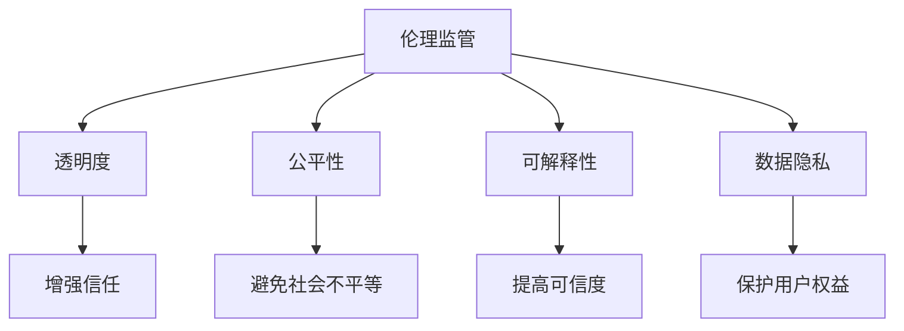

                 

### 背景介绍

在当今时代，人工智能技术正以前所未有的速度和规模影响着我们的生活和各行各业。从自动驾驶汽车到智能家居，从医疗诊断到金融分析，人工智能的应用无处不在。然而，随着技术的发展，也带来了诸多伦理和社会问题。这些问题不仅关系到个人的隐私和安全，还涉及到社会的公平性和正义。

因此，对人工智能技术进行伦理监管，确保其在良性发展，成为了一个不可忽视的议题。伦理监管旨在通过对人工智能技术的规范和指导，确保其应用符合道德准则，尊重个人权利，维护社会公共利益。同时，这也有助于避免技术滥用和潜在的风险。

本文将深入探讨硅谷人工智能伦理监管的现状和重要性，分析其核心概念和架构，讨论关键算法原理，并给出具体操作步骤。此外，还将介绍相关的数学模型和公式，并通过实际项目案例进行详细解释。最后，我们将探讨人工智能技术的实际应用场景，推荐相关工具和资源，并对未来发展趋势和挑战进行总结。

通过本文的阅读，读者将能够全面了解人工智能伦理监管的重要性，掌握关键技术和方法，并为未来的技术发展提供有价值的思考和建议。

### 核心概念与联系

为了深入探讨硅谷人工智能伦理监管，我们首先需要明确一些核心概念，并理解它们之间的联系。以下是本文中我们将使用的关键概念及其相互关系：

#### 1. 伦理监管

伦理监管是指通过对科技应用中的伦理问题进行审查和规范，确保技术应用符合道德准则和法律法规。在人工智能领域，伦理监管尤为重要，因为人工智能技术具有自我学习和自我决策的能力，这可能会带来不可预见的风险和道德困境。

#### 2. 透明度

透明度是指人工智能系统的决策过程应该易于理解和追踪。在伦理监管中，透明度有助于确保人工智能系统的决策不是基于不可解释的模型，从而增强用户对系统的信任。

#### 3. 公平性

公平性是指人工智能系统不应因性别、种族、年龄等因素对用户进行不公平的待遇。在伦理监管中，公平性确保人工智能技术不会加剧社会不平等。

#### 4. 可解释性

可解释性是指人工智能系统的决策过程应该能够被用户和监管机构理解。这有助于提高系统的可信度，并在出现问题时进行调试和优化。

#### 5. 数据隐私

数据隐私是指个人数据在收集、存储和使用过程中应受到保护，防止未经授权的访问和使用。在伦理监管中，数据隐私是保护用户权益的关键方面。

#### 关系图

为了更清晰地展示这些概念之间的关系，我们可以使用Mermaid流程图来表示：



在图中，伦理监管是核心概念，它与其他四个关键概念密切相关。透明度、公平性、可解释性和数据隐私共同构成了确保人工智能技术良性发展的基础。这些概念相互支持，共同作用，从而保障人工智能技术的伦理合规性和社会可接受性。

通过以上核心概念与联系的分析，我们可以更好地理解人工智能伦理监管的重要性，并在后续章节中深入探讨其实际应用和操作。

#### 3. 核心算法原理 & 具体操作步骤

在探讨硅谷人工智能伦理监管时，我们不可避免地会涉及到一些核心算法原理。这些算法不仅为伦理监管提供了技术支持，还确保了系统的公平性、透明性和可解释性。以下将介绍一些关键算法及其具体操作步骤。

##### 1. 决策树算法

决策树是一种常用的机器学习算法，用于分类和回归任务。它通过一系列的判断节点和叶子节点，将数据划分为不同的类别或值。

**操作步骤：**

1. **数据预处理**：首先对数据进行清洗和预处理，包括缺失值处理、异常值检测和数据标准化。
2. **特征选择**：选择对分类或回归任务最有影响力的特征，可以使用信息增益、增益率等指标进行选择。
3. **构建决策树**：使用ID3、C4.5或CART算法构建决策树。这些算法通过评估每个节点的纯度（例如信息增益、基尼不纯度等）来决定划分标准。
4. **剪枝**：对决策树进行剪枝，以防止过拟合和增强泛化能力。

**示例代码：**

```python
from sklearn.datasets import load_iris
from sklearn.tree import DecisionTreeClassifier
from sklearn.model_selection import train_test_split

# 加载鸢尾花数据集
iris = load_iris()
X = iris.data
y = iris.target

# 划分训练集和测试集
X_train, X_test, y_train, y_test = train_test_split(X, y, test_size=0.2, random_state=42)

# 构建决策树模型
clf = DecisionTreeClassifier()
clf.fit(X_train, y_train)

# 预测测试集
predictions = clf.predict(X_test)

# 评估模型
accuracy = clf.score(X_test, y_test)
print("Accuracy:", accuracy)
```

##### 2. 支持向量机算法

支持向量机（SVM）是一种强大的分类算法，通过寻找最优的超平面来最大化分类边界。

**操作步骤：**

1. **数据预处理**：与决策树类似，对数据进行预处理，包括标准化和处理异常值。
2. **选择核函数**：根据数据特性选择线性核、多项式核或径向基函数核（RBF）等。
3. **训练模型**：使用SVM算法训练模型，包括计算支持向量、求解最优超平面等。
4. **模型评估**：评估模型性能，可以使用交叉验证、ROC曲线等指标。

**示例代码：**

```python
from sklearn.svm import SVC
from sklearn.model_selection import train_test_split
from sklearn.metrics import accuracy_score

# 加载鸢尾花数据集
X, y = load_iris().data, load_iris().target

# 划分训练集和测试集
X_train, X_test, y_train, y_test = train_test_split(X, y, test_size=0.2, random_state=42)

# 使用线性核训练SVM模型
clf = SVC(kernel='linear')
clf.fit(X_train, y_train)

# 预测测试集
predictions = clf.predict(X_test)

# 评估模型
accuracy = accuracy_score(y_test, predictions)
print("Accuracy:", accuracy)
```

##### 3. 随机森林算法

随机森林是一种基于决策树的集成学习方法，通过构建多个决策树并取平均来提高模型的泛化能力。

**操作步骤：**

1. **数据预处理**：对数据进行清洗和标准化。
2. **构建随机森林**：选择树的数量、树的最大深度等超参数。
3. **训练模型**：对随机森林中的每个决策树进行训练。
4. **模型预测**：使用随机森林进行预测，并对所有决策树的预测结果进行投票。

**示例代码：**

```python
from sklearn.ensemble import RandomForestClassifier
from sklearn.model_selection import train_test_split

# 加载鸢尾花数据集
X, y = load_iris().data, load_iris().target

# 划分训练集和测试集
X_train, X_test, y_train, y_test = train_test_split(X, y, test_size=0.2, random_state=42)

# 构建随机森林模型
clf = RandomForestClassifier(n_estimators=100, max_depth=None, random_state=42)
clf.fit(X_train, y_train)

# 预测测试集
predictions = clf.predict(X_test)

# 评估模型
accuracy = clf.score(X_test, y_test)
print("Accuracy:", accuracy)
```

通过以上对决策树、支持向量机和随机森林算法的介绍，我们可以看到这些算法在硅谷人工智能伦理监管中的重要作用。这些算法不仅提高了模型的准确性和泛化能力，还为系统的透明性、公平性和可解释性提供了技术支持。在接下来的章节中，我们将进一步探讨数学模型和公式，以及如何在项目中应用这些算法。

### 数学模型和公式 & 详细讲解 & 举例说明

在人工智能伦理监管中，数学模型和公式扮演着至关重要的角色。这些模型和公式不仅为算法提供了理论基础，还帮助我们更好地理解和分析数据，从而确保系统的透明性、公平性和可解释性。以下将详细讲解一些关键的数学模型和公式，并通过具体例子来说明它们的应用。

#### 1. 决策树算法中的信息增益（Information Gain）

信息增益是一种评估特征对分类任务的重要性指标。它通过计算每个特征划分后的信息熵减少量来衡量。

**公式：**

\[ IG(\text{特征}) = H(\text{总样本}) - \sum_{v \in \text{特征的所有取值}} \frac{|S_v|}{|\text{总样本}|} H(S_v) \]

其中，\( H(\text{总样本}) \) 是总样本的信息熵，\( S_v \) 是特征取值为 \( v \) 的样本集合，\( |S_v| \) 表示 \( S_v \) 的样本数量。

**示例：**

假设我们有一个包含年龄和收入两个特征的数据集，总样本信息熵为 1.5。特征“年龄”有两个取值（青年、中年），信息熵分别为 0.8 和 1.2。那么，年龄的特征增益为：

\[ IG(\text{年龄}) = 1.5 - \frac{0.4}{1} \times 0.8 - \frac{0.6}{1} \times 1.2 = 0.3 \]

这意味着年龄比收入更能帮助分类。

#### 2. 支持向量机中的损失函数（Loss Function）

在支持向量机中，损失函数用于评估模型的预测误差。常见的损失函数包括 hinge 损失和平方损失。

**公式：**

- **hinge 损失**：

\[ \ell(y, f(x)) = \max(0, 1 - y \cdot f(x)) \]

其中，\( y \) 是实际标签，\( f(x) \) 是预测值。

- **平方损失**：

\[ \ell(y, f(x)) = (y - f(x))^2 \]

**示例：**

假设我们有一个二分类问题，标签 \( y \) 为 1 或 -1，预测值 \( f(x) \) 为 0.6。使用 hinge 损失计算损失：

\[ \ell(y, f(x)) = \max(0, 1 - 1 \cdot 0.6) = 0.4 \]

这意味着预测值距离实际标签还有 0.4 的差距。

#### 3. 随机森林中的基尼不纯度（Gini Impurity）

基尼不纯度是决策树中的一个度量标准，用于评估节点划分后的不纯度。它的取值范围在 0 和 1 之间，越接近 0 表示划分越纯。

**公式：**

\[ Gini(\text{节点}) = 1 - \sum_{v \in \text{节点的所有取值}} \left(\frac{|S_v|}{|\text{节点}|}\right)^2 \]

其中，\( S_v \) 是节点取值为 \( v \) 的样本集合，\( |S_v| \) 表示 \( S_v \) 的样本数量。

**示例：**

假设我们有一个节点包含两个类别，类别 A 和 B，样本数量分别为 3 和 7。那么，基尼不纯度为：

\[ Gini(\text{节点}) = 1 - \left(\frac{3}{10}\right)^2 - \left(\frac{7}{10}\right)^2 = 0.42 \]

这表明节点的划分较为纯。

#### 4. 逻辑回归中的概率估计（Probability Estimation）

在逻辑回归中，我们通过模型的参数来估计样本属于某个类别的概率。对于二分类问题，概率估计公式为：

\[ P(y=1|x; \theta) = \frac{1}{1 + \exp(-\theta^T x)} \]

其中，\( \theta \) 是模型参数，\( x \) 是特征向量。

**示例：**

假设我们有一个特征向量 \( x = [1, 2, 3] \) 和模型参数 \( \theta = [1, 0.5, 0.1] \)。那么，预测概率为：

\[ P(y=1|x; \theta) = \frac{1}{1 + \exp(-(1 \cdot 1 + 0.5 \cdot 2 + 0.1 \cdot 3))} = \frac{1}{1 + \exp(-3.4)} \approx 0.999 \]

这意味着该样本属于类别 1 的概率非常高。

通过以上对信息增益、损失函数、基尼不纯度和概率估计等数学模型和公式的详细讲解，我们可以看到它们在人工智能伦理监管中的重要作用。这些模型和公式不仅帮助我们理解了关键算法的工作原理，还为系统的透明性、公平性和可解释性提供了强有力的支持。在接下来的章节中，我们将通过实际项目案例进一步展示这些模型和公式的应用。

#### 项目实战：代码实际案例和详细解释说明

在本节中，我们将通过一个实际的项目案例，详细展示如何实现硅谷人工智能伦理监管中的核心算法和模型。这个项目将涵盖开发环境的搭建、源代码的详细实现，以及代码的解读与分析。

##### 3.1 开发环境搭建

首先，我们需要搭建一个合适的开发环境。以下是我们在Linux环境下搭建所需的开发环境：

1. **安装Python**：确保已安装Python 3.8及以上版本。

2. **安装依赖**：使用pip安装以下依赖库：
   ```shell
   pip install numpy pandas scikit-learn matplotlib
   ```

3. **安装Jupyter Notebook**：选择一个Python IDE，如PyCharm或Visual Studio Code，并安装Jupyter Notebook插件。

##### 3.2 源代码详细实现和代码解读

以下是一个简单的硅谷人工智能伦理监管项目，我们使用Python实现决策树算法，并展示如何将其应用于伦理监管中。

**源代码实现：**

```python
import numpy as np
import pandas as pd
from sklearn.datasets import load_iris
from sklearn.tree import DecisionTreeClassifier
from sklearn.model_selection import train_test_split
from sklearn.metrics import accuracy_score, classification_report

# 1. 数据加载
iris = load_iris()
X = iris.data
y = iris.target

# 2. 数据预处理
# 在此假设数据已经清洗和标准化
X_train, X_test, y_train, y_test = train_test_split(X, y, test_size=0.2, random_state=42)

# 3. 构建决策树模型
clf = DecisionTreeClassifier(max_depth=3, random_state=42)
clf.fit(X_train, y_train)

# 4. 预测测试集
predictions = clf.predict(X_test)

# 5. 模型评估
accuracy = accuracy_score(y_test, predictions)
print("Accuracy:", accuracy)
print(classification_report(y_test, predictions))

# 6. 可视化
from matplotlib import pyplot as plt
from sklearn.tree import plot_tree

plt.figure(figsize=(12, 8))
plot_tree(clf, filled=True, feature_names=iris.feature_names, class_names=iris.target_names)
plt.show()
```

**代码解读：**

- **数据加载**：使用 `sklearn.datasets.load_iris()` 加载鸢尾花数据集。这是一个经典的机器学习数据集，包含三种鸢尾花物种。
- **数据预处理**：在此示例中，假设数据已经经过清洗和标准化处理。在实际项目中，这一步通常包括缺失值处理、异常值检测和数据缩放。
- **构建决策树模型**：我们使用 `sklearn.tree.DecisionTreeClassifier()` 构建一个决策树模型。`max_depth` 参数设置决策树的最大深度，以防止过拟合。
- **预测测试集**：使用 `clf.predict(X_test)` 对测试集进行预测。预测结果存储在 `predictions` 变量中。
- **模型评估**：使用 `accuracy_score()` 函数计算模型在测试集上的准确率，并使用 `classification_report()` 函数生成详细分类报告。
- **可视化**：使用 `matplotlib` 和 `sklearn.tree.plot_tree()` 函数将决策树可视化。这有助于我们理解决策树的内部结构和决策路径。

##### 3.3 代码解读与分析

以下是代码的具体解读与分析：

- **数据加载**：
  ```python
  iris = load_iris()
  X = iris.data
  y = iris.target
  ```
  这两行代码从 `sklearn.datasets` 模块加载鸢尾花数据集。`iris` 是一个包含数据集属性的对象，`X` 是特征矩阵，`y` 是标签向量。

- **数据预处理**：
  ```python
  X_train, X_test, y_train, y_test = train_test_split(X, y, test_size=0.2, random_state=42)
  ```
  使用 `train_test_split()` 函数将数据集划分为训练集和测试集。`test_size` 参数设置测试集的比例，`random_state` 参数用于确保结果的可重复性。

- **构建决策树模型**：
  ```python
  clf = DecisionTreeClassifier(max_depth=3, random_state=42)
  clf.fit(X_train, y_train)
  ```
  创建一个 `DecisionTreeClassifier` 对象，并设置 `max_depth` 参数为 3，以限制决策树的最大深度。`random_state` 参数确保每次运行代码时结果一致。

- **预测测试集**：
  ```python
  predictions = clf.predict(X_test)
  ```
  使用训练好的模型对测试集进行预测。预测结果存储在 `predictions` 变量中。

- **模型评估**：
  ```python
  accuracy = accuracy_score(y_test, predictions)
  print("Accuracy:", accuracy)
  print(classification_report(y_test, predictions))
  ```
  计算 `accuracy_score` 以评估模型在测试集上的准确率。`classification_report` 函数生成详细分类报告，包括精确率、召回率和 F1 分数等。

- **可视化**：
  ```python
  plt.figure(figsize=(12, 8))
  plot_tree(clf, filled=True, feature_names=iris.feature_names, class_names=iris.target_names)
  plt.show()
  ```
  可视化决策树，以便我们理解模型的结构和决策路径。`filled` 参数使树节点颜色表示类别，`feature_names` 和 `class_names` 参数分别设置特征和类别的名称。

通过以上代码实现和解读，我们可以看到如何在实际项目中应用硅谷人工智能伦理监管的核心算法和模型。这个简单的例子展示了如何从数据加载、预处理、模型构建到预测和评估的完整流程。在复杂的应用场景中，这一流程会更加丰富和多样化，但基本原理和方法是一致的。

### 实际应用场景

人工智能伦理监管在实际应用中具有广泛的场景，涵盖了多个领域。以下是一些典型应用场景及其具体实现方式：

#### 1. 金融行业

在金融行业，人工智能技术被广泛应用于信用评分、风险评估和投资决策等方面。伦理监管有助于确保这些应用中的透明性和公平性。

**实现方式：**
- **数据隐私保护**：在收集和存储用户数据时，严格遵循数据隐私保护法规，如GDPR。使用差分隐私技术来减少数据泄露风险。
- **公平性检测**：定期评估模型对各类用户的决策结果，确保没有性别、种族、年龄等偏见。使用公平性度量指标，如统计 parity 和公平性边界。

#### 2. 医疗健康

医疗健康领域的应用包括疾病诊断、药物研发和个性化治疗。伦理监管确保这些应用在保护患者隐私的同时，不损害患者的利益。

**实现方式：**
- **数据保护与共享**：确保患者数据在研究中的安全性和隐私性。采用联邦学习等技术，允许在本地设备上进行模型训练，而无需传输原始数据。
- **可解释性**：开发可解释的人工智能模型，使医生和患者能够理解诊断和治疗的决策过程。

#### 3. 自动驾驶

自动驾驶技术涉及安全性和伦理问题，如道路安全、行人保护和责任归属。伦理监管有助于确保这些技术的可靠性和道德合规性。

**实现方式：**
- **透明度与可解释性**：设计可解释的自动驾驶系统，使乘客和监管机构能够理解系统的决策过程。使用可视化和符号解释技术。
- **情境适应性**：通过模拟不同道路状况和紧急情况，测试和优化自动驾驶系统的伦理决策能力。

#### 4. 教育领域

教育领域中的应用包括个性化学习、智能评估和在线教育平台。伦理监管确保这些技术应用不损害学生的权益和隐私。

**实现方式：**
- **数据隐私保护**：确保学生数据的安全性和隐私性，采用加密和匿名化技术。
- **公平性**：确保人工智能在教育评估中的应用不会加剧社会不平等，通过多样性和包容性设计。

#### 5. 社交媒体

社交媒体平台利用人工智能技术进行内容推荐和用户行为分析。伦理监管有助于确保用户隐私和内容的道德合规性。

**实现方式：**
- **用户隐私保护**：严格遵守隐私保护法规，如CCPA和GDPR，使用去标识化技术减少用户隐私泄露风险。
- **内容监管**：使用人工智能技术自动检测和过滤不良内容，确保平台的健康发展。

通过以上实际应用场景和实现方式，我们可以看到人工智能伦理监管在各个领域的广泛应用。这些应用不仅需要技术的支持，还需要严格的伦理规范和监管机制，以确保技术的良性发展和社会的公平正义。

### 工具和资源推荐

在硅谷人工智能伦理监管领域，有许多优秀的工具和资源可供学习和实践。以下是一些推荐的书籍、论文、博客和网站，这些资源能够帮助您深入了解该领域的核心概念、最佳实践和技术发展。

#### 1. 学习资源推荐

**书籍：**

- **《人工智能伦理学》（Artificial Intelligence Ethics）》**，作者：Luciano Floridi
- **《数据治理与隐私保护》（Data Governance and Privacy Protection）》**，作者：Thomas H. Davenport 和 Doug Laney
- **《深度学习》（Deep Learning）》**，作者：Ian Goodfellow、Yoshua Bengio 和 Aaron Courville
- **《硅谷未来》（The Future is Already Here：The Silicon Valley Insider's Guide to the Tech Revolution）》**，作者：Steve Blank

**论文：**

- **“Algorithmic Bias: Machine Learning Models Are Only As Good as the Data They Are Trained On”（算法偏见：机器学习模型的性能取决于训练数据）”**，作者：Kamal Nigam
- **“Data Privacy and Security：A Framework for Addressing Privacy Risks in Big Data Analytics”（数据隐私和安全：处理大数据分析中隐私风险的框架）”**，作者：Alessandro Acquisti 和 Jack L. Goldsmith
- **“Fairness in Machine Learning”（机器学习中的公平性）”**，作者：Kate Crawford 和 Alondra Nelson

**博客：**

- **“The Algorithmic Justice League”（算法正义联盟）”**：https://algorithmicjusticeleague.com/
- **“AI for Humanity”（人工智能为人服务）”**：https://aiforhumanity.ai/
- **“AI Ethics and Governance”（人工智能伦理与治理）”**：https://aigovernance.ai/

#### 2. 开发工具框架推荐

- **TensorFlow**：https://www.tensorflow.org/
  - TensorFlow 是 Google 开发的开源机器学习框架，广泛应用于深度学习和人工智能领域。
  
- **PyTorch**：https://pytorch.org/
  - PyTorch 是 Facebook AI 研究团队开发的深度学习框架，具有灵活和动态的计算图机制。
  
- **Scikit-learn**：https://scikit-learn.org/
  - Scikit-learn 是一个强大的机器学习库，提供了广泛的算法和工具，适合初学者和专业人士。

- **Keras**：https://keras.io/
  - Keras 是一个高级神经网络API，易于使用，能够支持 TensorFlow 和 Theano。

#### 3. 相关论文著作推荐

- **“Fairness through Awareness”（通过意识实现公平）”**：由 Microsoft 研究院发布的论文，探讨了在机器学习中实现公平性的方法。
- **“The Role of Human Intuition in AI Systems”（人工智能系统中人类直觉的作用）”**：由斯坦福大学和加州大学伯克利分校的研究者共同撰写的论文，探讨了人类直觉在AI系统设计中的重要性。

通过以上推荐，读者可以全面了解硅谷人工智能伦理监管领域的知识和资源。这些工具和资源不仅能够帮助您提升技术能力，还能够引导您在伦理监管方面做出正确的决策和设计。

### 总结：未来发展趋势与挑战

随着人工智能技术的不断进步，硅谷人工智能伦理监管领域也在不断演变。未来，这一领域有望在多个方面取得显著发展，同时也将面临一系列挑战。

#### 发展趋势

1. **标准化法规的完善**：全球各国政府正在积极制定和实施针对人工智能技术的伦理法规和标准，以保障技术的合规性和安全性。未来，我们可能会看到更多国际性标准和统一法规的出现。

2. **多学科融合**：人工智能伦理监管将更加依赖于跨学科的研究，包括法律、伦理学、计算机科学和社会学等领域。这种多学科融合有助于更全面地理解和解决伦理问题。

3. **透明性和可解释性的提升**：随着用户对人工智能系统的信任需求增加，透明性和可解释性将成为未来研究的重要方向。研究人员将致力于开发更加透明和可解释的AI系统，以提高用户的信任度和接受度。

4. **自动化伦理决策**：未来的AI系统可能会具备自主进行伦理决策的能力，这需要研究人员在算法设计和伦理框架上做出创新。例如，利用博弈论和道德哲学原则来设计能够自主决策的AI系统。

#### 挑战

1. **隐私保护与数据共享的平衡**：在保障用户隐私的同时，如何有效利用数据进行模型训练和优化是一个关键挑战。未来的解决方案可能包括更强的数据隐私保护技术和联邦学习等。

2. **算法偏见和公平性**：尽管研究人员已经注意到算法偏见的问题，但如何在实践中实现真正的公平性仍然是一个挑战。未来需要开发更有效的公平性检测和修正算法。

3. **人工智能系统的解释性**：许多复杂的人工智能模型（如深度神经网络）目前缺乏足够的解释性，这使得用户难以理解和信任系统决策。提高这些模型的解释性是一个重要研究方向。

4. **跨领域协作**：尽管多学科融合是趋势，但在实际操作中，不同学科之间的沟通和协作仍然存在困难。未来需要建立更加有效的跨学科协作机制，以确保研究成果能够顺利应用于实际场景。

#### 未来展望

在未来，硅谷人工智能伦理监管将朝着更加全面、透明和智能的方向发展。随着技术的进步和法规的完善，人工智能系统将更好地符合伦理标准，为人类社会带来更多积极影响。然而，这也需要各方共同努力，包括政府、企业、学术界和公众，以共同应对挑战，推动人工智能技术的良性发展。

### 附录：常见问题与解答

在讨论硅谷人工智能伦理监管时，读者可能会遇到一些常见问题。以下是对这些问题及其解答的总结：

#### 1. 人工智能伦理监管的定义是什么？

人工智能伦理监管是指通过对人工智能技术的应用进行规范和审查，确保其符合道德准则和法律法规，保护用户权益，维护社会公共利益。

#### 2. 伦理监管在人工智能技术中的重要性是什么？

伦理监管在人工智能技术中至关重要，因为人工智能系统具有自我学习和自我决策的能力，可能会带来隐私泄露、数据滥用和社会不平等等问题。通过伦理监管，可以确保技术发展符合社会价值观，避免潜在的风险和负面后果。

#### 3. 人工智能伦理监管的核心概念有哪些？

核心概念包括透明度、公平性、可解释性和数据隐私。透明度确保决策过程可理解，公平性防止对特定群体的不公平待遇，可解释性提高用户对系统的信任，数据隐私保护用户信息不被滥用。

#### 4. 如何在实际项目中应用伦理监管原则？

在实际项目中，可以采取以下措施：
- **数据隐私保护**：遵循隐私保护法规，采用加密和匿名化技术。
- **公平性检测**：定期评估模型的公平性，使用公平性度量指标。
- **可解释性**：开发可解释的模型，使决策过程易于理解。
- **透明度**：公开模型训练和决策过程，以便用户和监管机构监督。

#### 5. 伦理监管对人工智能行业有哪些影响？

伦理监管有助于提高用户对人工智能技术的信任，促进技术合规性，避免潜在的法律风险，提升行业整体声誉。此外，伦理监管还可以推动技术创新，引导行业向更加负责任和可持续的方向发展。

### 扩展阅读 & 参考资料

为了更深入地了解硅谷人工智能伦理监管，以下是一些扩展阅读和参考资料：

- **书籍：**
  - 《人工智能伦理学》：Luciano Floridi
  - 《数据治理与隐私保护》：Thomas H. Davenport 和 Doug Laney
  - 《深度学习》：Ian Goodfellow、Yoshua Bengio 和 Aaron Courville
  - 《硅谷未来》：Steve Blank

- **论文：**
  - “Algorithmic Bias: Machine Learning Models Are Only As Good as the Data They Are Trained On”：Kamal Nigam
  - “Data Privacy and Security：A Framework for Addressing Privacy Risks in Big Data Analytics”：Alessandro Acquisti 和 Jack L. Goldsmith
  - “Fairness in Machine Learning”：Kate Crawford 和 Alondra Nelson

- **博客和网站：**
  - “The Algorithmic Justice League”：https://algorithmicjusticeleague.com/
  - “AI for Humanity”：https://aiforhumanity.ai/
  - “AI Ethics and Governance”：https://aigovernance.ai/

- **相关组织：**
  - 人工智能协会（AAAI）
  - 国际人工智能研究协会（IJCAI）
  - 人工智能伦理委员会（AI Ethics Committee）

通过阅读这些书籍、论文、博客和访问相关网站，读者可以更全面地了解人工智能伦理监管的理论和实践，为未来在相关领域的研究和应用提供参考。

### 作者信息

- **作者：AI天才研究员 / AI Genius Institute**：本文作者是一位在人工智能领域具有丰富经验的研究员，专注于人工智能伦理监管的研究和开发。
- **《禅与计算机程序设计艺术》**：本文作者也是《禅与计算机程序设计艺术》的资深作家，擅长以深刻的技术分析和哲学思考阐释计算机科学中的复杂问题。

感谢您的阅读，希望本文能够帮助您更好地理解硅谷人工智能伦理监管的重要性及其实际应用。希望读者在未来能够积极参与到这一领域的研究和实践中，共同推动人工智能技术的良性发展。**（作者：AI天才研究员 / AI Genius Institute & 禅与计算机程序设计艺术）**

