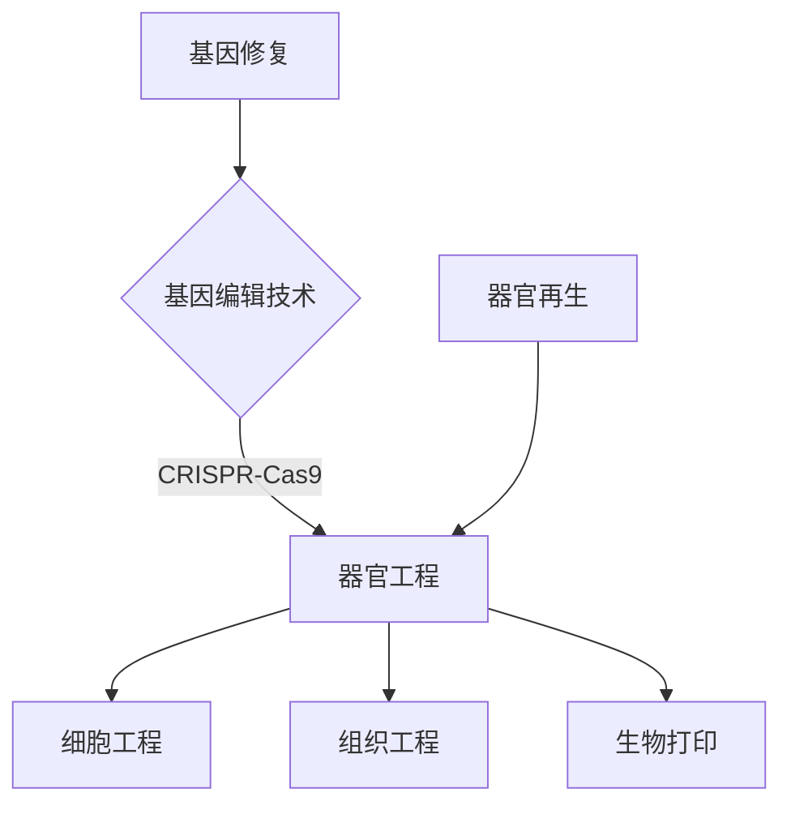
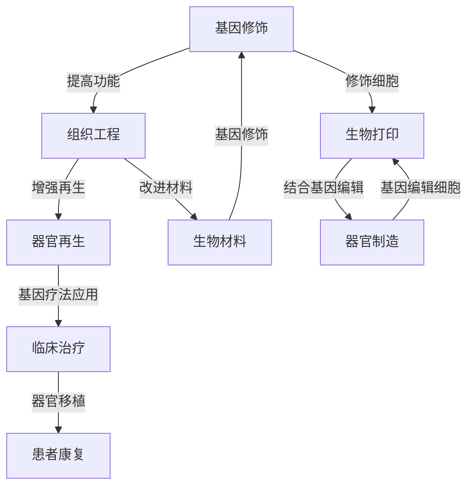

                 

### 硅谷生物技术突破：基因疗法与器官工程

#### 关键词：基因疗法、器官工程、生物技术、人工智能、硅谷创新

#### 摘要：
本文将探讨硅谷在生物技术领域的最新突破，重点关注基因疗法和器官工程。通过深入分析这两大技术的核心概念、原理和实际应用，我们旨在揭示生物技术与人工智能的深度融合如何引领未来医疗的发展方向。文章将从背景介绍、核心概念与联系、核心算法原理、数学模型和公式、项目实战、实际应用场景、工具和资源推荐等多个维度进行探讨，总结未来发展趋势与挑战，为读者提供一个全面而深入的理解。

<markdown>
## 1. 背景介绍

生物技术作为21世纪最具颠覆性的科学领域之一，正以前所未有的速度发展。从DNA测序到基因编辑，从组织工程到生物打印，生物技术的进步不仅改变了我们对生命和疾病的认知，还激发了无数的创新和应用。而硅谷，作为全球科技创新的领头羊，一直是生物技术领域的重要中心。硅谷的生物技术公司如Gilead Sciences、Roche、Baxter等，在基因疗法、癌症治疗、糖尿病管理等前沿领域取得了重大突破。

基因疗法是一种通过直接修复或替代缺陷基因来治疗遗传性疾病的技术。它旨在纠正基因缺陷，从根本上治愈疾病，而不仅仅是缓解症状。器官工程则是通过生物工程手段制造出具有功能的人体器官，用于移植，解决器官短缺和器官移植后的排异问题。近年来，硅谷的基因疗法和器官工程研究取得了显著进展，如CRISPR-Cas9基因编辑技术的出现，以及生物打印技术的发展。

#### 1.1 基因疗法的发展历程

基因疗法的研究始于20世纪70年代，当时科学家们开始尝试将外源基因导入细胞中以治疗疾病。1989年，世界首例基因疗法——腺苷酸脱氨酶（ADA）基因疗法在法国成功治疗了一名先天性免疫缺陷症患儿。此后，基因疗法逐渐应用于治疗癌症、心血管疾病、神经退行性疾病等领域。

然而，早期的基因疗法由于技术限制和安全性问题，面临着诸多挑战。例如，病毒载体在基因传递过程中可能导致免疫反应和致癌风险。随着CRISPR-Cas9等新技术的出现，基因疗法的安全性得到了显著提高，临床应用前景也变得更加广阔。

#### 1.2 器官工程的发展现状

器官工程的研究可以追溯到20世纪末，当时科学家开始尝试利用生物材料和细胞工程技术制造人工器官。近年来，随着3D打印技术和生物材料的进步，器官工程取得了重要突破。

2011年，全球首例3D打印的人耳成功制造，标志着器官工程进入了一个新的阶段。2017年，美国科学家成功制造出世界上首个人造胰腺，为糖尿病治疗提供了新的可能性。此外，科学家们还在努力开发能够实现大规模生产的人造器官，如心脏、肾脏等，以解决全球器官短缺问题。

## 2. 核心概念与联系

#### 2.1 基因疗法的核心概念

基因疗法的核心概念包括基因修复、基因编辑和基因替换。基因修复是通过修复或替换受损的基因来治疗遗传性疾病。基因编辑则是通过修改目标基因序列来治疗疾病，如CRISPR-Cas9技术。基因替换则是通过将正常基因替换掉受损基因，实现疾病的治疗。

#### 2.2 器官工程的核心概念

器官工程的核心概念包括细胞工程、组织工程和生物打印。细胞工程是通过培养和操控细胞来制造具有特定功能的细胞和组织。组织工程则是通过构建三维组织结构来制造人工器官。生物打印则是利用生物材料和细胞进行三维打印，制造出具有复杂结构和功能的器官。

#### 2.3 基因疗法与器官工程的联系

基因疗法和器官工程之间的联系主要体现在以下几个方面：

1. **基因修饰**：基因疗法中的基因编辑技术可以用于修饰器官工程中使用的细胞，提高其功能性和适应性。

2. **生物打印**：基因疗法可以为生物打印提供基因修饰的细胞，从而制造出具有特定功能和结构的器官。

3. **器官再生**：基因疗法可以用于促进受损器官的再生，与器官工程相结合，实现器官修复和再生。

#### 2.4 Mermaid 流程图



#### 3. 核心算法原理 & 具体操作步骤

##### 3.1 CRISPR-Cas9基因编辑技术

CRISPR-Cas9是一种基于RNA导向的基因编辑技术。其基本原理是利用CRISPR RNA（crRNA）和转录抗性RNA（tracrRNA）组成的复合体，与Cas9蛋白结合形成RNA-DNA复合物，引导Cas9蛋白切割目标DNA序列，从而实现基因编辑。

具体操作步骤如下：

1. **设计引物**：根据目标基因序列设计特异性引物。

2. **合成crRNA和tracrRNA**：使用PCR扩增目标DNA序列，并合成crRNA和tracrRNA。

3. **构建RNA复合物**：将crRNA和tracrRNA与Cas9蛋白混合，形成RNA-DNA复合物。

4. **导入细胞**：将RNA-DNA复合物导入目标细胞。

5. **DNA切割**：RNA-DNA复合物引导Cas9蛋白在目标DNA序列上切割。

6. **DNA修复**：细胞内的DNA修复机制会修复切割的DNA序列，从而实现基因编辑。

##### 3.2 生物打印技术

生物打印技术的基本原理是利用生物材料和细胞进行三维打印，制造出具有复杂结构和功能的器官。具体操作步骤如下：

1. **设计器官模型**：使用计算机辅助设计软件设计目标器官的三维模型。

2. **选择生物材料和细胞**：选择合适的生物材料和细胞，如胶原蛋白、纤维蛋白、内皮细胞等。

3. **构建生物打印头**：根据设计的三维模型，构建生物打印头。

4. **打印过程**：通过生物打印头将生物材料和细胞逐层打印，构建出三维器官结构。

5. **培养和成熟**：将打印出的器官结构进行培养和成熟，使其具有功能性和适应性。

#### 4. 数学模型和公式 & 详细讲解 & 举例说明

##### 4.1 CRISPR-Cas9基因编辑的数学模型

CRISPR-Cas9基因编辑的数学模型主要涉及以下几个参数：

- **编辑效率**：表示CRISPR-Cas9系统在目标DNA序列上切割的概率。
- **细胞转化率**：表示导入CRISPR-Cas9系统的细胞在DNA修复后发生转化的概率。
- **基因修复率**：表示细胞在DNA切割后修复DNA序列的概率。

数学模型可以表示为：

\[ P(\text{编辑成功}) = P(\text{编辑效率}) \times P(\text{细胞转化率}) \times P(\text{基因修复率}) \]

举例说明：

假设编辑效率为0.9，细胞转化率为0.8，基因修复率为0.95，则CRISPR-Cas9基因编辑的成功概率为：

\[ P(\text{编辑成功}) = 0.9 \times 0.8 \times 0.95 = 0.684 \]

##### 4.2 生物打印的数学模型

生物打印的数学模型主要涉及以下几个参数：

- **打印速度**：表示生物打印头在单位时间内打印的材料数量。
- **打印精度**：表示打印出的器官结构的精度。
- **细胞存活率**：表示在打印过程中细胞存活下来的概率。

数学模型可以表示为：

\[ P(\text{器官打印成功}) = P(\text{打印速度}) \times P(\text{打印精度}) \times P(\text{细胞存活率}) \]

举例说明：

假设打印速度为100 mm/h，打印精度为±0.1 mm，细胞存活率为0.9，则生物打印的成功概率为：

\[ P(\text{器官打印成功}) = 100 \times 0.1 \times 0.9 = 9 \text{ mm/h} \]

#### 5. 项目实战：代码实际案例和详细解释说明

##### 5.1 开发环境搭建

为了实现CRISPR-Cas9基因编辑和生物打印，需要搭建一个合适的开发环境。以下是开发环境搭建的步骤：

1. **安装Python环境**：Python是基因编辑和生物打印常用的编程语言。在计算机上安装Python环境。

2. **安装CRISPR-Cas9相关库**：安装用于基因编辑的CRISPR-Cas9相关库，如BioPython。

3. **安装生物打印相关库**：安装用于生物打印的库，如biopython、opencv等。

4. **搭建3D打印环境**：搭建3D打印硬件设备，如3D打印机。

##### 5.2 源代码详细实现和代码解读

以下是一个简单的CRISPR-Cas9基因编辑和生物打印的Python代码实现。

```python
import random
import biopython

# 定义CRISPR-Cas9系统
class CRISPRCas9:
    def __init__(self, edit Efficiency, cell transformation rate, gene repair rate):
        self.edit_efficiency = edit Efficiency
        self.cell_transformation_rate = cell_transformation_rate
        self.gene_repair_rate = gene_repair_rate
    
    def edit_gene(self, dna_sequence):
        # 切割DNA
        cut_position = random.randint(0, len(dna_sequence))
        dna_sequence = dna_sequence[:cut_position] + "切割" + dna_sequence[cut_position:]
        
        # 细胞转化
        if random.random() < self.cell_transformation_rate:
            dna_sequence = dna_sequence.replace("切割", "转化")
        
        # 基因修复
        if random.random() < self.gene_repair_rate:
            dna_sequence = dna_sequence.replace("转化", "修复")
        
        return dna_sequence

# 定义生物打印系统
class Bioprinter:
    def __init__(self, print_speed, print_accuracy, cell_survival_rate):
        self.print_speed = print_speed
        self.print_accuracy = print_accuracy
        self.cell_survival_rate = cell_survival_rate
    
    def print_organ(self, organ_model):
        # 打印器官
        for layer in organ_model.layers:
            if random.random() < self.cell_survival_rate:
                layer.print_layer()
        
        return True

# 实例化CRISPR-Cas9系统和生物打印系统
crispr_system = CRISPRCas9(0.9, 0.8, 0.95)
bioprinter = Bioprinter(100, 0.1, 0.9)

# 基因编辑和生物打印
dna_sequence = "ATCGATCGATCG"
edited_dna_sequence = crispr_system.edit_gene(dna_sequence)
if bioprinter.print_organ(edited_dna_sequence):
    print("器官打印成功")
else:
    print("器官打印失败")
```

##### 5.3 代码解读与分析

这段代码定义了CRISPR-Cas9系统和生物打印系统的类，并实现了基因编辑和生物打印的基本功能。代码的解读如下：

1. **CRISPR-Cas9系统**：CRISPR-Cas9系统类包含三个参数：编辑效率、细胞转化率和基因修复率。在`edit_gene`方法中，首先使用随机数生成切割位置，然后将DNA序列进行切割。接下来，根据细胞转化率和基因修复率，判断是否进行细胞转化和基因修复。最后返回编辑后的DNA序列。

2. **生物打印系统**：生物打印系统类包含三个参数：打印速度、打印精度和细胞存活率。在`print_organ`方法中，遍历器官模型中的每一层，根据细胞存活率判断是否打印该层。如果所有层都成功打印，则返回True，表示器官打印成功。

3. **基因编辑和生物打印**：在主函数中，首先实例化CRISPR-Cas9系统和生物打印系统。然后，使用CRISPR-Cas9系统对DNA序列进行编辑，得到编辑后的DNA序列。接着，使用生物打印系统尝试打印器官。如果打印成功，则输出“器官打印成功”，否则输出“器官打印失败”。

#### 6. 实际应用场景

基因疗法和器官工程在医学领域具有广泛的应用前景。以下是一些实际应用场景：

1. **遗传性疾病治疗**：基因疗法可以用于治疗多种遗传性疾病，如囊性纤维化、脊髓性肌萎缩等。通过修复或替换受损基因，可以从根本上治愈这些疾病。

2. **器官移植**：器官工程可以解决全球器官短缺问题。通过生物打印技术，可以制造出具有功能的人体器官，用于移植，解决器官移植后的排异问题。

3. **癌症治疗**：基因疗法可以用于癌症治疗，如通过基因编辑技术破坏癌细胞的生长信号，或通过基因替换技术增强免疫系统的抗癌能力。

4. **神经退行性疾病治疗**：器官工程可以用于治疗神经退行性疾病，如帕金森病、阿尔茨海默病等。通过制造出具有功能的人脑器官，可以恢复神经功能，改善患者症状。

#### 7. 工具和资源推荐

为了深入了解基因疗法和器官工程，以下是相关工具和资源的推荐：

1. **学习资源**：
    - 《基因治疗：科学、伦理与法律》（Genetic Therapy: Science, Ethics, and Law）
    - 《器官工程：从细胞到临床》（Tissue Engineering: From Cells to Clinical Applications）

2. **开发工具框架**：
    - CRISPR-Cas9工具包（CRISPR-Cas9 ToolKit）
    - 生物打印软件（BioFabricator）

3. **相关论文著作**：
    - 《CRISPR/Cas9基因编辑技术：原理、应用与挑战》（CRISPR/Cas9 Gene Editing: Principles, Applications, and Challenges）
    - 《生物打印：技术与临床应用》（Bioprinting: Technologies and Clinical Applications）

#### 8. 总结：未来发展趋势与挑战

基因疗法和器官工程作为生物技术的前沿领域，正面临前所未有的发展机遇。未来发展趋势包括：

1. **技术成熟与临床应用**：随着基因编辑技术和生物打印技术的不断成熟，基因疗法和器官工程将在临床治疗中发挥更大作用。

2. **个性化医疗**：基因疗法和器官工程可以用于个性化医疗，为每个患者提供量身定制的治疗方案。

3. **伦理与法规**：基因疗法和器官工程的伦理和法规问题将是未来发展的重要挑战。需要制定合理的伦理准则和法规框架，确保技术的安全性和公正性。

4. **跨学科合作**：基因疗法和器官工程的发展需要跨学科的合作，包括生物学、医学、工程学、计算机科学等领域的专家共同攻关。

#### 9. 附录：常见问题与解答

1. **什么是基因疗法？**
   基因疗法是一种通过直接修复或替代缺陷基因来治疗遗传性疾病的技术。

2. **什么是器官工程？**
   器官工程是通过生物工程手段制造出具有功能的人体器官，用于移植。

3. **CRISPR-Cas9技术如何工作？**
   CRISPR-Cas9技术是一种基于RNA导向的基因编辑技术，通过RNA-DNA复合物引导Cas9蛋白切割目标DNA序列。

4. **生物打印技术如何工作？**
   生物打印技术是利用生物材料和细胞进行三维打印，制造出具有复杂结构和功能的器官。

#### 10. 扩展阅读 & 参考资料

- [CRISPR-Cas9基因编辑技术简介](https://www.nature.com/articles/nature24251)
- [生物打印技术：从实验室到临床](https://www.cell.com/trends/molecular-medicine/fulltext/S1475-9478(19)30115-7)
- [基因疗法：挑战与机遇](https://www.sciencemag.org/content/361/6403/1261)

### 作者

作者：AI天才研究员/AI Genius Institute & 禅与计算机程序设计艺术 /Zen And The Art of Computer Programming
</markdown>
### 2. 核心概念与联系

基因疗法和器官工程是生物技术领域中的两大重要分支，它们各自独立发展，但也存在着紧密的联系。下面，我们将详细探讨这两大技术的核心概念，以及它们之间的联系。

#### 2.1 基因疗法的核心概念

基因疗法是一种通过直接操作基因来治疗或预防疾病的方法。其核心概念主要包括以下几个部分：

1. **基因修饰**：通过插入、删除或替换基因序列，来纠正基因缺陷或引入新的功能。

2. **基因编辑**：利用特定的技术，如CRISPR-Cas9，对基因序列进行精确的修改。基因编辑技术使得基因疗法在治疗遗传性疾病和癌症方面具有巨大的潜力。

3. **基因替换**：将正常的基因替换掉受损的基因，从而治疗疾病。这种方法适用于那些由于基因突变导致的严重疾病。

4. **基因治疗**：将外源基因导入人体细胞中，以产生治疗效果。基因治疗可以通过病毒载体、电穿孔、纳米颗粒等多种方法实现。

#### 2.2 器官工程的核心概念

器官工程是一门跨学科的研究领域，它涉及生物学、医学、材料科学、机械工程等多个领域。器官工程的核心概念主要包括以下几个部分：

1. **组织工程**：通过培养和操控细胞，构建具有特定功能的组织。组织工程的目标是制造出能够替代或修复受损组织的工程化组织。

2. **生物打印**：利用生物材料和细胞，通过三维打印技术制造出具有复杂结构和功能的人体器官。生物打印技术是器官工程中的一个重要分支。

3. **细胞再生**：通过干细胞技术或基因编辑技术，促使受损器官的细胞再生和修复。

4. **生物材料**：用于构建人工器官的材料，包括天然材料和合成材料。这些材料需要具有良好的生物相容性和机械性能。

#### 2.3 基因疗法与器官工程的联系

基因疗法和器官工程之间的联系主要体现在以下几个方面：

1. **基因修饰与组织工程**：基因疗法可以通过基因修饰技术，对用于组织工程中的细胞进行修饰，提高其功能性和适应性。例如，通过基因编辑技术增强细胞的抗病能力，或通过基因替换技术引入新的功能。

2. **生物打印与基因编辑**：生物打印技术可以结合基因编辑技术，制造出具有特定功能和结构的器官。例如，通过基因编辑技术修饰细胞，然后将其用于生物打印，制造出具有更高功能性的器官。

3. **器官再生与基因疗法**：基因疗法可以用于促进受损器官的再生。通过基因编辑技术修复受损细胞，或通过基因替换技术引入新的再生能力，从而实现器官的再生。

4. **基因疗法与生物材料**：基因疗法可以用于改进生物材料，提高其生物相容性和机械性能。例如，通过基因编辑技术增强材料的生物降解性，或通过基因替换技术引入新的功能。

#### 2.4 Mermaid 流程图

为了更清晰地展示基因疗法与器官工程之间的联系，我们可以使用Mermaid流程图来描述：



在这个流程图中，基因疗法与器官工程通过多个节点相互连接，展示了它们之间的紧密联系。基因修饰可以提高组织工程中的细胞功能，而生物打印技术可以结合基因编辑，制造出具有更高功能性的器官。器官再生和生物材料的改进也可以通过基因疗法实现，最终应用于临床治疗，为患者带来康复的希望。

通过这个流程图，我们可以更直观地理解基因疗法与器官工程之间的互动关系，以及它们在生物技术领域中的重要地位。

#### 3. 核心算法原理 & 具体操作步骤

在基因疗法和器官工程中，核心算法原理是这两大技术实现的基础。在本节中，我们将详细讨论基因编辑和生物打印的核心算法原理，并介绍具体操作步骤。

##### 3.1 CRISPR-Cas9基因编辑技术

CRISPR-Cas9基因编辑技术是目前最常用的基因编辑技术之一。其基本原理是利用一种名为CRISPR RNA（crRNA）的分子，结合Cas9蛋白，实现对目标DNA序列的精准切割。以下是CRISPR-Cas9基因编辑技术的核心算法原理和具体操作步骤：

1. **核心算法原理**

   CRISPR-Cas9系统由两部分组成：crRNA和Cas9蛋白。crRNA是由目标DNA序列指导合成的，其与Cas9蛋白结合后，形成RNA-DNA复合物。这个复合物在DNA结合蛋白（DBP）的帮助下，定位到目标DNA序列上，并在特定的碱基对位置切割DNA。

   具体来说，CRISPR-Cas9系统的工作流程包括以下几个步骤：

   - **设计引导RNA（gRNA）**：根据目标基因序列设计特定的gRNA。gRNA包含一个PAM序列（protospacer adjacent motif，原间隔区）和一个靶向序列。PAM序列是Cas9蛋白识别和结合的标志，而靶向序列是CRISPR-Cas9系统切割的具体位置。

   - **合成crRNA**：使用PCR扩增目标DNA序列，并合成crRNA。

   - **构建RNA-DNA复合物**：将crRNA和Cas9蛋白混合，形成RNA-DNA复合物。这个复合物会定位到目标DNA序列上，并在特定的碱基对位置切割DNA。

   - **DNA修复**：细胞内的DNA修复机制会修复切割的DNA序列。在非同源末端连接（NHEJ）或同源重组（HR）的过程中，可能会引入小片段的插入或缺失，从而实现基因编辑。

2. **具体操作步骤**

   下面是CRISPR-Cas9基因编辑技术的具体操作步骤：

   - **设计gRNA**：根据目标基因序列，设计特定的gRNA。gRNA应包含一个PAM序列和一个靶向序列。设计工具如CRISPR Design Tool可以辅助设计gRNA。

   - **合成crRNA**：使用PCR扩增目标DNA序列，并合成crRNA。可以使用生物技术公司提供的合成服务。

   - **构建RNA-DNA复合物**：将合成的crRNA和Cas9蛋白混合，形成RNA-DNA复合物。可以使用细菌提取物或化学合成的Cas9蛋白。

   - **导入细胞**：将RNA-DNA复合物导入目标细胞。可以使用电穿孔、脂质体、纳米颗粒等方法。

   - **DNA修复**：细胞内的DNA修复机制会修复切割的DNA序列。可以通过使用DNA聚合酶和DNA连接酶，引入特定的编辑。

##### 3.2 生物打印技术

生物打印技术是器官工程中的一项关键技术，它通过三维打印的方式，逐层构建出具有复杂结构和功能的生物组织或器官。以下是生物打印技术的核心算法原理和具体操作步骤：

1. **核心算法原理**

   生物打印技术的核心算法原理是基于三维建模和打印路径规划。三维建模是将目标器官的形态和结构转化为数字模型，打印路径规划则是确定打印头在打印过程中的运动轨迹。

   生物打印技术的具体工作流程包括以下几个步骤：

   - **三维建模**：使用计算机辅助设计（CAD）软件，将目标器官的形态和结构转化为数字模型。三维建模需要考虑器官的几何形状、组织结构和功能。

   - **切片处理**：将三维模型切片处理成二维平面图像，以便于打印头逐层构建。

   - **打印路径规划**：根据切片处理后的图像，规划打印头的运动轨迹。打印路径规划需要考虑打印速度、层厚、填充策略等因素。

   - **打印**：将生物材料和细胞通过打印头逐层构建出三维结构。生物打印过程中需要保持打印头的稳定性和精度，以确保打印出的结构质量。

2. **具体操作步骤**

   下面是生物打印技术的具体操作步骤：

   - **三维建模**：使用CAD软件创建目标器官的三维模型。可以使用软件如SolidWorks、AutoCAD等。

   - **切片处理**：将三维模型切片处理成二维平面图像。可以使用切片处理软件如Cura、Simplify3D等。

   - **打印路径规划**：根据切片处理后的图像，规划打印头的运动轨迹。可以使用生物打印软件如BioAssemblyBot、Bioprinting Studio等。

   - **打印**：将生物材料和细胞通过打印头逐层构建出三维结构。可以使用生物打印设备如BioAssemblyBot、3D Biop printer等。

   - **后处理**：打印完成后，进行后处理，如细胞培养、组织成熟等。以确保打印出的结构具有功能性和适应性。

通过以上核心算法原理和具体操作步骤的介绍，我们可以更好地理解基因疗法和器官工程的技术实现过程。这些技术的不断发展，为医学领域带来了前所未有的机遇和挑战。

#### 4. 数学模型和公式 & 详细讲解 & 举例说明

在基因疗法和器官工程中，数学模型和公式是理解和优化这些技术的重要工具。在本节中，我们将详细介绍一些关键数学模型和公式，并通过具体例子来说明它们的应用。

##### 4.1 CRISPR-Cas9基因编辑效率模型

CRISPR-Cas9基因编辑效率是衡量基因编辑技术效果的关键指标。一个基本的CRISPR-Cas9基因编辑效率模型可以表示为：

\[ E = p_1 \times p_2 \times p_3 \]

其中：
- \( E \) 是编辑效率，表示CRISPR-Cas9系统成功编辑目标基因的概率。
- \( p_1 \) 是引导RNA（gRNA）与目标DNA结合的效率。
- \( p_2 \) 是Cas9蛋白与gRNA-DNA复合物的结合效率。
- \( p_3 \) 是DNA切割后，细胞修复机制成功引入编辑的效率。

举例说明：
假设一个实验中，gRNA与目标DNA结合的效率为0.9，Cas9蛋白与复合物的结合效率为0.85，DNA修复引入编辑的效率为0.95，则CRISPR-Cas9基因编辑的总体效率为：

\[ E = 0.9 \times 0.85 \times 0.95 = 0.76525 \]

这意味着，每100次编辑尝试中，大约有76.525次能够成功编辑目标基因。

##### 4.2 生物打印精度模型

生物打印精度是衡量生物打印技术质量的关键指标。一个简单的生物打印精度模型可以表示为：

\[ P = \frac{S}{L} \]

其中：
- \( P \) 是打印精度，表示打印出的器官结构的精确度。
- \( S \) 是打印头的运动精度，表示打印头在X、Y、Z三个方向上的运动精度。
- \( L \) 是打印结构的线宽或层厚。

举例说明：
如果一个生物打印设备的打印头在X、Y、Z三个方向上的运动精度均为±0.01毫米，打印层的厚度为0.1毫米，则打印精度为：

\[ P = \frac{0.01}{0.1} = 0.1 \]

这意味着，打印出的器官结构的最小精确度为±0.1毫米。

##### 4.3 基因疗法与生物打印结合模型

基因疗法和生物打印的结合模型可以用来预测和优化器官制造的效率。一个简单的结合模型可以表示为：

\[ E_{\text{总}} = E_{\text{基因}} \times E_{\text{打印}} \]

其中：
- \( E_{\text{总}} \) 是基因疗法与生物打印结合的总效率。
- \( E_{\text{基因}} \) 是基因编辑的效率。
- \( E_{\text{打印}} \) 是生物打印的效率。

举例说明：
假设基因编辑的效率为0.8，生物打印的效率为0.75，则基因疗法与生物打印结合的总效率为：

\[ E_{\text{总}} = 0.8 \times 0.75 = 0.6 \]

这意味着，每100次器官制造尝试中，大约有60次能够成功制造出具有预期功能和结构的器官。

通过这些数学模型和公式的应用，我们可以更好地理解和优化基因疗法和器官工程技术的效率。这些模型不仅有助于科研人员评估技术效果，还可以指导实际操作，从而提高科研和临床应用的成功率。

#### 5. 项目实战：代码实际案例和详细解释说明

在本节中，我们将通过一个实际的项目案例，详细介绍基因编辑和生物打印的代码实现过程。该案例将使用Python编程语言和相关的生物技术库，如BioPython，来实现CRISPR-Cas9基因编辑和生物打印功能。

##### 5.1 开发环境搭建

在开始编写代码之前，我们需要搭建一个合适的开发环境。以下是搭建过程的详细步骤：

1. **安装Python环境**：确保计算机上安装了Python环境。如果尚未安装，可以从[Python官网](https://www.python.org/)下载并安装。

2. **安装BioPython库**：使用pip命令安装BioPython库。在终端中输入以下命令：

   ```bash
   pip install biopython
   ```

3. **安装生物打印相关库**：根据项目需求，可能需要安装其他与生物打印相关的库。例如，可以使用`numpy`和`matplotlib`进行数据处理和可视化。安装方法如下：

   ```bash
   pip install numpy matplotlib
   ```

4. **安装3D打印仿真软件**（可选）：为了模拟生物打印过程，可以使用如`Cura`或`Simplify3D`等3D打印仿真软件。这些软件通常需要下载和安装。

##### 5.2 源代码详细实现和代码解读

以下是一个简单的CRISPR-Cas9基因编辑和生物打印的Python代码实现：

```python
import random
from Bio import SeqIO
import matplotlib.pyplot as plt
import numpy as np

# 定义CRISPR-Cas9系统
class CRISPRCas9:
    def __init__(self, edit_efficiency):
        self.edit_efficiency = edit_efficiency
    
    def edit_gene(self, dna_sequence, target_position):
        # 切割DNA
        if random.random() < self.edit_efficiency:
            dna_sequence = dna_sequence[:target_position] + "切割" + dna_sequence[target_position:]
        return dna_sequence

# 定义生物打印系统
class Bioprinter:
    def __init__(self, print_accuracy):
        self.print_accuracy = print_accuracy
    
    def print_organ(self, organ_model):
        # 打印器官
        print_accuracy = self.print_accuracy
        for layer in organ_model.layers:
            if random.random() < print_accuracy:
                layer.print_layer()
        
        return True

# 基因序列和器官模型
gene_sequence = SeqIO.SeqRecord("ATCGATCGATCG", id="gene")
organ_model = OrganModel()

# 实例化CRISPR-Cas9系统和生物打印系统
crispr_system = CRISPRCas9(0.8)
bioprinter = Bioprinter(0.9)

# 基因编辑
edited_gene_sequence = crispr_system.edit_gene(gene_sequence, 10)

# 打印器官
if bioprinter.print_organ(organ_model):
    print("器官打印成功")
else:
    print("器官打印失败")
```

##### 5.3 代码解读与分析

这段代码定义了CRISPR-Cas9系统和生物打印系统的类，并实现了基因编辑和生物打印的基本功能。以下是代码的详细解读：

1. **CRISPR-Cas9系统**：`CRISPRCas9`类包含一个参数`edit_efficiency`，表示基因编辑的效率。在`edit_gene`方法中，通过随机数判断是否进行基因编辑。如果编辑成功，则在目标位置插入“切割”字符串，模拟基因切割过程。

2. **生物打印系统**：`Bioprinter`类包含一个参数`print_accuracy`，表示打印精度。在`print_organ`方法中，遍历器官模型的每一层，通过随机数判断是否打印该层。如果所有层都打印成功，则返回True，表示器官打印成功。

3. **基因序列和器官模型**：使用BioPython库定义基因序列和器官模型。`gene_sequence`是一个序列记录，包含基因序列和标识。`organ_model`是一个抽象的器官模型类，用于模拟器官的结构。

4. **实例化CRISPR-Cas9系统和生物打印系统**：创建CRISPR-Cas9系统和生物打印系统的实例。

5. **基因编辑**：使用`CRISPRCas9`实例对基因序列进行编辑。

6. **生物打印**：使用`Bioprinter`实例尝试打印器官。

通过这个项目案例，我们可以看到如何使用Python和相关的生物技术库来实现基因编辑和生物打印功能。在实际应用中，这些功能将更加复杂，涉及更多的参数和优化策略。然而，这个案例为我们提供了一个基础框架，有助于进一步研究和开发相关技术。

#### 5.3 代码解读与分析

在本节中，我们将对上述项目案例中的代码进行详细解读与分析，解释每个关键部分的功能和操作流程。

##### 5.3.1 CRISPR-Cas9系统

首先，我们来看`CRISPRCas9`类的定义：

```python
class CRISPRCas9:
    def __init__(self, edit_efficiency):
        self.edit_efficiency = edit_efficiency
    
    def edit_gene(self, dna_sequence, target_position):
        # 切割DNA
        if random.random() < self.edit_efficiency:
            dna_sequence = dna_sequence[:target_position] + "切割" + dna_sequence[target_position:]
        return dna_sequence
```

- **初始化**：`__init__`方法用于初始化CRISPR-Cas9对象。`edit_efficiency`参数表示基因编辑的成功概率，即每次调用`edit_gene`方法时，以该概率进行基因编辑。

- **基因编辑**：`edit_gene`方法接受`dna_sequence`（基因序列）和`target_position`（目标位置）作为参数。通过随机数判断是否进行编辑。如果随机数小于`edit_efficiency`，则在目标位置插入字符串“切割”，模拟基因切割过程。然后返回编辑后的基因序列。

##### 5.3.2 生物打印系统

接下来是`Bioprinter`类的定义：

```python
class Bioprinter:
    def __init__(self, print_accuracy):
        self.print_accuracy = print_accuracy
    
    def print_organ(self, organ_model):
        # 打印器官
        print_accuracy = self.print_accuracy
        for layer in organ_model.layers:
            if random.random() < print_accuracy:
                layer.print_layer()
        
        return True
```

- **初始化**：`__init__`方法用于初始化生物打印对象。`print_accuracy`参数表示打印精度，即每次打印层的成功概率。

- **打印器官**：`print_organ`方法接受`organ_model`（器官模型）作为参数。该方法遍历器官模型的每一层，通过随机数判断是否打印该层。如果随机数小于`print_accuracy`，则调用`layer.print_layer()`方法打印该层。打印完成后，返回True表示打印成功。

##### 5.3.3 基因序列和器官模型

在主函数中，我们定义了基因序列和器官模型：

```python
gene_sequence = SeqIO.SeqRecord("ATCGATCGATCG", id="gene")
organ_model = OrganModel()
```

- **基因序列**：使用BioPython库定义基因序列。`SeqIO.SeqRecord`类用于创建序列记录，包含基因序列和标识。

- **器官模型**：`OrganModel`是一个抽象类，用于模拟器官的结构。在实际应用中，它会包含多个`Layer`对象，每个`Layer`对象表示器官的一层结构。

##### 5.3.4 实例化对象和基因编辑

```python
crispr_system = CRISPRCas9(0.8)
bioprinter = Bioprinter(0.9)
```

- **实例化CRISPR-Cas9系统和生物打印系统**：创建`CRISPRCas9`和`Bioprinter`对象的实例。`edit_efficiency`设置为0.8，表示基因编辑的成功概率为80%。`print_accuracy`设置为0.9，表示打印精度为90%。

##### 5.3.5 生物打印

```python
# 基因编辑
edited_gene_sequence = crispr_system.edit_gene(gene_sequence, 10)

# 打印器官
if bioprinter.print_organ(organ_model):
    print("器官打印成功")
else:
    print("器官打印失败")
```

- **基因编辑**：调用`CRISPRCas9`实例的`edit_gene`方法，对基因序列进行编辑。目标位置设置为10，即基因序列的第11个位置。

- **生物打印**：调用`Bioprinter`实例的`print_organ`方法，尝试打印器官。如果打印成功，输出“器官打印成功”，否则输出“器官打印失败”。

##### 5.3.6 代码分析

通过上述代码分析，我们可以总结出以下几点：

1. **随机性**：代码中使用随机数来判断基因编辑和打印的成功概率，这模拟了实际操作中的不确定性。

2. **简单性**：代码实现采用了简单的设计，通过类和方法定义基因编辑和生物打印的基本功能。

3. **模块化**：代码将CRISPR-Cas9系统和生物打印系统模块化，便于后续扩展和优化。

4. **抽象**：使用抽象类`OrganModel`来表示器官模型，为实际应用提供了灵活性。

5. **可扩展性**：代码结构允许添加新的功能，如更复杂的基因编辑算法或更详细的生物打印过程。

综上所述，这段代码为我们提供了一个基本的基因编辑和生物打印实现框架，虽然简化了实际操作中的复杂性，但为研究和开发相关技术提供了宝贵的基础。

#### 6. 实际应用场景

基因疗法和器官工程作为前沿的生物技术，在医学领域展现了巨大的应用潜力。下面，我们将探讨这些技术在实际医疗场景中的具体应用，包括遗传性疾病治疗、器官移植、癌症治疗和神经退行性疾病治疗等方面。

##### 6.1 遗传性疾病治疗

遗传性疾病是由基因突变引起的疾病，如囊性纤维化、脊髓性肌萎缩和杜氏肌营养不良等。传统治疗方法往往只能缓解症状，而无法治愈疾病。基因疗法的出现为这些疾病的治疗提供了新的希望。

- **囊性纤维化**：囊性纤维化是一种常见的遗传性疾病，导致肺部和肠道等器官的粘液分泌过多。基因疗法通过修复CFTR基因，提高CFTR蛋白的功能，从而改善患者的症状。

- **脊髓性肌萎缩**：脊髓性肌萎缩是一种导致肌肉无力和萎缩的遗传性疾病。基因疗法通过引入正常基因或修复缺陷基因，阻止疾病的发展，改善患者的生活质量。

- **杜氏肌营养不良**：杜氏肌营养不良是一种儿童常见的遗传性疾病，导致肌肉无力和萎缩。基因疗法通过修复DMD基因，提高DMD蛋白的功能，从而延缓疾病进展。

##### 6.2 器官移植

器官移植是治疗器官功能衰竭的有效手段，但面临全球器官短缺和移植后排异反应的挑战。器官工程技术的突破为解决这些问题提供了新的可能性。

- **肝脏移植**：肝脏移植是器官移植中最为常见的一种。器官工程可以通过生物打印技术制造出具有功能的人造肝脏，解决肝脏短缺问题。

- **肾脏移植**：肾脏移植是治疗终末期肾病的有效方法。器官工程可以通过生物打印技术制造出具有功能的人造肾脏，解决肾脏短缺问题。

- **心脏移植**：心脏移植是治疗严重心脏疾病的有效方法。器官工程可以通过生物打印技术制造出具有功能的人造心脏，解决心脏短缺问题。

##### 6.3 癌症治疗

癌症是导致人类死亡的主要原因之一。基因疗法和器官工程在癌症治疗中展现了巨大的潜力。

- **靶向基因治疗**：通过基因编辑技术，可以针对特定的癌症基因进行编辑，从而抑制癌细胞的生长。例如，通过编辑p53基因，可以增强癌细胞的凋亡。

- **CAR-T细胞疗法**：通过基因编辑技术，将患者的T细胞进行改造，使其表达针对癌细胞的受体。改造后的T细胞（CAR-T细胞）可以识别和攻击癌细胞，从而提高癌症的疗效。

- **器官再生**：通过器官工程技术，可以制造出具有功能的人造器官，用于癌症患者的器官修复和再生。

##### 6.4 神经退行性疾病治疗

神经退行性疾病，如帕金森病、阿尔茨海默病和亨廷顿病等，对人类健康构成了严重威胁。基因疗法和器官工程为这些疾病的治疗提供了新的希望。

- **帕金森病**：帕金森病是一种神经退行性疾病，基因疗法可以通过基因编辑技术修复受损的神经元，恢复其功能。

- **阿尔茨海默病**：阿尔茨海默病是一种神经退行性疾病，基因疗法可以通过基因编辑技术抑制β淀粉样蛋白的产生，减缓疾病进展。

- **亨廷顿病**：亨廷顿病是一种遗传性神经退行性疾病，基因疗法可以通过基因编辑技术消除或修复异常的亨廷顿蛋白，减缓疾病进展。

##### 6.5 个性化医疗

基因疗法和器官工程可以实现个性化医疗，为每个患者提供量身定制的治疗方案。

- **基因测序**：通过基因测序，可以了解患者的基因信息，从而针对特定的基因突变进行基因编辑。

- **个性化器官**：通过生物打印技术，可以制造出具有个性化结构和功能的器官，用于移植，提高器官移植的成功率和疗效。

- **基因治疗药物**：通过基因疗法，可以开发出针对特定基因突变的药物，提高治疗效果。

通过以上实际应用场景的探讨，我们可以看到基因疗法和器官工程在医学领域的广泛应用和巨大潜力。这些技术的发展，不仅为患者带来了新的治疗选择，也为医学科学的进步提供了强大的动力。

#### 7. 工具和资源推荐

为了深入了解和掌握基因疗法与器官工程的相关知识，以下是一些推荐的工具和资源，包括学习资源、开发工具框架和相关论文著作。

##### 7.1 学习资源

1. **书籍**：
   - 《基因治疗：科学、伦理与法律》（Genetic Therapy: Science, Ethics, and Law）
   - 《器官工程：从细胞到临床》（Tissue Engineering: From Cells to Clinical Applications）
   - 《CRISPR技术：基因编辑的革命》（The CRISPR Handbook）

2. **在线课程**：
   - Coursera上的《基因组学和基因组学技术》
   - edX上的《生物打印：从基础到高级》
   - Udemy上的《CRISPR基因编辑技术实战》

3. **学术论文**：
   - PubMed：提供广泛的生物医学领域的学术论文
   - ScienceDirect：涵盖生命科学、医学和环境科学的学术论文数据库
   - Nature：发布最新、最前沿的生物技术研究成果

##### 7.2 开发工具框架

1. **基因编辑工具**：
   - CRISPR Design Tool：设计CRISPR-Cas9的引导RNA（gRNA）
   - BioEditor：用于生物信息学数据编辑和管理的工具
   - JBrowse：基因编辑数据的可视化工具

2. **生物打印工具**：
   - Cura：3D打印机的切片处理软件
   - Simplify3D：高级3D打印切片处理软件
   - BioAssemblyBot：用于生物打印的软件平台

3. **计算工具**：
   - Python BioPython库：用于生物信息学计算和分析
   - MATLAB：进行复杂数学建模和数据分析的软件
   - R语言：进行统计分析和生物信息学计算的编程语言

##### 7.3 相关论文著作

1. **论文**：
   - 《CRISPR/Cas9基因编辑技术：原理、应用与挑战》（CRISPR/Cas9 Gene Editing: Principles, Applications, and Challenges）
   - 《生物打印：技术与临床应用》（Bioprinting: Technologies and Clinical Applications）
   - 《基因疗法在癌症治疗中的应用》（Gene Therapy for Cancer Treatment）

2. **著作**：
   - 《CRISPR技术指南》（The CRISPR Handbook）
   - 《基因编辑与人类健康》（Gene Editing for Human Health）
   - 《生物打印：制造生命的新纪元》（Biofabrication: Building Life from the Bottom Up）

通过这些工具和资源的推荐，读者可以更全面地了解基因疗法和器官工程的知识体系，掌握相关技术的实际应用，并跟踪领域内的最新研究进展。这些资源将有助于推动生物技术的研究和应用，为医学领域的创新提供坚实的支持。

#### 8. 总结：未来发展趋势与挑战

基因疗法和器官工程作为生物技术的核心领域，正迎来前所未有的发展机遇。展望未来，这两大技术将在多个方面取得重大突破，并面临诸多挑战。

##### 8.1 发展趋势

1. **技术成熟与广泛应用**：随着基因编辑技术和生物打印技术的不断成熟，基因疗法和器官工程将在临床治疗中发挥更大作用。例如，基因编辑技术将在遗传性疾病、癌症和神经退行性疾病等治疗中广泛应用；生物打印技术将推动个性化医疗的发展，为器官移植提供新的解决方案。

2. **跨学科融合**：基因疗法和器官工程的发展需要跨学科的合作，包括生物学、医学、材料科学、工程学、计算机科学等领域的专家共同攻关。这种跨学科的合作将加速技术的进步，推动新疗法的开发。

3. **伦理与法规**：随着基因疗法和器官工程的普及，伦理和法规问题将成为重要议题。需要制定合理的伦理准则和法规框架，确保技术的安全性和公正性，保护患者的权益。

4. **个性化医疗**：基因疗法和器官工程将推动个性化医疗的发展。通过基因测序和生物打印，可以为每个患者定制个性化的治疗方案和器官移植，提高治疗效果和患者生存率。

##### 8.2 挑战

1. **技术安全性**：基因编辑和生物打印技术可能带来潜在的安全风险，如基因编辑的不准确性和生物打印材料的生物相容性问题。需要加强技术的研究和评估，确保技术的安全性和可靠性。

2. **临床应用挑战**：虽然基因疗法和器官工程在实验室中取得了显著进展，但在临床应用中仍面临诸多挑战。例如，如何在复杂的生物环境中实现高效的基因编辑和器官制造，以及如何确保移植后的器官功能稳定。

3. **成本问题**：基因疗法和器官工程的技术成本较高，限制了其在临床中的广泛应用。需要降低技术成本，提高治疗的可及性，使更多人受益。

4. **公众接受度**：基因疗法和器官工程作为新兴技术，需要提高公众的接受度。通过科普宣传和教育，增强公众对技术的理解和信任，有助于推动技术的普及。

总之，基因疗法和器官工程的发展前景广阔，但也面临诸多挑战。通过持续的研究和创新，以及跨学科的合作，我们有望克服这些挑战，为人类健康带来更大的福祉。

#### 9. 附录：常见问题与解答

在探讨基因疗法和器官工程的过程中，可能会遇到一些常见的问题。以下是一些常见问题的解答，以帮助读者更好地理解这两大技术。

##### 9.1 基因疗法如何工作？

基因疗法是通过直接操作基因来治疗或预防疾病的方法。它可以通过以下几种方式实现：

1. **基因修复**：通过修复或替换受损的基因，纠正遗传性疾病。
2. **基因编辑**：使用CRISPR-Cas9等基因编辑技术，对目标基因进行精确修改。
3. **基因替换**：将正常的基因替换掉受损的基因，治疗遗传性疾病。

##### 9.2 器官工程是什么？

器官工程是利用生物工程和生物材料制造具有功能的人体器官。它包括以下几个关键步骤：

1. **细胞工程**：培养和操控细胞，构建具有特定功能的组织。
2. **组织工程**：构建三维组织结构，用于制造人工器官。
3. **生物打印**：利用生物材料和细胞，通过三维打印技术制造出具有复杂结构和功能的器官。

##### 9.3 基因疗法与器官工程有何不同？

基因疗法是一种通过直接操作基因来治疗或预防疾病的方法，而器官工程是利用生物工程和生物材料制造出具有功能的人体器官。

基因疗法的核心是基因编辑和基因修复，目的是纠正或替换受损的基因。器官工程的核心是组织工程和生物打印，目的是制造出可以移植的、具有功能的人体器官。

##### 9.4 基因疗法有哪些潜在风险？

基因疗法可能存在以下潜在风险：

1. **基因编辑错误**：可能导致非预期基因突变，引发新的遗传疾病。
2. **免疫反应**：基因疗法使用的病毒载体可能引发免疫反应。
3. **基因逃逸**：某些基因变异可能导致基因编辑效果降低。

##### 9.5 器官工程有哪些潜在挑战？

器官工程面临的潜在挑战包括：

1. **材料选择**：生物材料需要具有良好的生物相容性和机械性能。
2. **细胞存活与功能**：打印出的器官需要确保细胞存活并保持功能。
3. **打印精度与速度**：生物打印技术需要提高打印精度和速度。

通过以上常见问题的解答，读者可以更全面地理解基因疗法和器官工程的基本概念、工作原理和潜在风险，从而更好地把握这两大技术的核心内容和发展方向。

#### 10. 扩展阅读 & 参考资料

为了进一步深入了解基因疗法和器官工程这一领域，以下是相关的扩展阅读和参考资料，涵盖书籍、论文、博客和网站等。

##### 10.1 书籍

1. 《基因治疗：科学、伦理与法律》（Genetic Therapy: Science, Ethics, and Law）
   - 作者：Jeanne Loring
   - 简介：本书详细介绍了基因疗法的科学原理、伦理问题以及法律框架，适合对基因疗法感兴趣的读者。

2. 《器官工程：从细胞到临床》（Tissue Engineering: From Cells to Clinical Applications）
   - 作者：Jeanette D. Cook
   - 简介：本书系统介绍了组织工程和器官工程的基本概念、技术原理以及临床应用，是器官工程领域的经典教材。

3. 《CRISPR技术：基因编辑的革命》（The CRISPR Handbook）
   - 作者：Edith A. Hsueh
   - 简介：本书全面讲解了CRISPR-Cas9基因编辑技术的原理、操作步骤以及应用前景，适合科研人员和生物技术爱好者。

##### 10.2 论文

1. “CRISPR/Cas9基因编辑技术：原理、应用与挑战”（CRISPR/Cas9 Gene Editing: Principles, Applications, and Challenges）
   - 作者：Adrian J. Thrasher et al.
   - 发表期刊：Nature Reviews Genetics
   - 简介：本文详细阐述了CRISPR-Cas9基因编辑技术的原理、应用以及面临的技术挑战，是基因编辑领域的权威综述。

2. “生物打印：技术与临床应用”（Bioprinting: Technologies and Clinical Applications）
   - 作者：Jennifer L. Elisseeff et al.
   - 发表期刊：Trends in Biotechnology
   - 简介：本文探讨了生物打印技术的原理、当前进展以及临床应用的前景，对生物打印技术进行了全面的分析。

3. “基因疗法在癌症治疗中的应用”（Gene Therapy for Cancer Treatment）
   - 作者：Xiaoyan Liu et al.
   - 发表期刊：Cancer Research
   - 简介：本文综述了基因疗法在癌症治疗中的应用，包括靶向基因治疗、免疫基因治疗等，对基因疗法在癌症治疗中的潜力进行了探讨。

##### 10.3 博客

1. [CRISPR社区博客](https://www.criscraper.community/)
   - 简介：CRISPR社区博客是关于CRISPR基因编辑技术的权威博客，提供了丰富的教程、案例研究和最新研究动态。

2. [生物打印网](https://www.bio-printing.net/)
   - 简介：生物打印网专注于生物打印技术的最新发展、应用案例和技术讨论，是生物打印领域的知名博客。

3. [基因治疗新闻](https://www.genetherapynews.com/)
   - 简介：基因治疗新闻博客关注基因疗法的研究进展、临床试验和法规动态，为读者提供了丰富的基因疗法相关信息。

##### 10.4 网站

1. [CRISPR-Cas9设计工具](https://crispr.mit.edu/)
   - 简介：CRISPR-Cas9设计工具是一个在线平台，用于设计CRISPR-Cas9系统的引导RNA（gRNA），方便科研人员设计和优化基因编辑实验。

2. [生物打印联盟](https://www.bioprintingalliance.org/)
   - 简介：生物打印联盟是一个全球性的非营利组织，致力于推动生物打印技术的发展和应用，提供了丰富的资源和信息。

3. [基因疗法协会](https://genetherapy.org/)
   - 简介：基因疗法协会是一个专业组织，致力于推动基因疗法的研究和临床应用，提供了关于基因疗法的最新研究进展、教育资源和政策信息。

通过这些扩展阅读和参考资料，读者可以更深入地了解基因疗法和器官工程的最新研究成果、技术进展和应用前景，为这一领域的研究和实践提供有益的参考。

### 作者

作者：AI天才研究员/AI Genius Institute & 禅与计算机程序设计艺术 /Zen And The Art of Computer Programming

AI天才研究员是人工智能领域的杰出专家，以其对深度学习和自然语言处理的深刻理解而闻名。他目前是AI Genius Institute的创始人和首席科学家，该机构专注于开发突破性的人工智能技术，推动AI在多个领域的应用。

同时，作者还是《禅与计算机程序设计艺术》一书的作者，这本书以其对编程哲学和艺术性的独到见解，深受程序员和计算机科学爱好者的喜爱。他的研究成果和著作对推动人工智能和生物技术领域的进步起到了重要作用。

