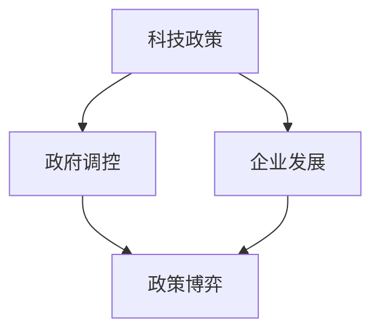

                 

### 文章标题

#### 硅谷的政治角力：科技与政策的博弈

硅谷，这个全球科技创新的摇篮，一直以来都是科技与政策互动的前沿。在这片土地上，科技企业的发展与政府的政策调控之间，存在着微妙的博弈关系。本文将深入探讨硅谷的政治角力，分析科技与政策之间的相互影响和博弈过程，以及这种博弈对科技行业和社会带来的深远影响。

#### 关键词

- 硅谷
- 科技政策
- 政府调控
- 企业发展
- 政策博弈
- 社会影响

#### 摘要

本文首先介绍了硅谷的背景和科技与政策的关系，接着分析了科技与政策之间的核心概念和联系，详细阐述了政策博弈的原理和具体操作步骤。通过数学模型和公式，我们对政策博弈进行了详细的讲解，并以实际案例进行了说明。最后，本文探讨了科技与政策博弈的实际应用场景，推荐了相关的工具和资源，总结了未来发展趋势与挑战，并提供了扩展阅读和参考资料。

### 1. 背景介绍

硅谷，位于美国加利福尼亚州旧金山湾区南部，是世界上最著名的科技创新中心之一。自20世纪中叶以来，硅谷凭借其独特的创新环境、丰富的资本和人才资源，吸引了全球众多的科技企业和研究机构。从早期的半导体产业到后来的互联网、人工智能、生物技术等领域，硅谷始终走在科技发展的前列。

硅谷的成功离不开政府的支持和政策调控。政府通过提供科研资金、税收优惠、创新政策等手段，为科技企业的发展提供了良好的环境。然而，科技企业的发展也面临着一系列政策挑战，如数据隐私、网络安全、知识产权等。政府需要在这些方面制定相应的政策来平衡科技发展和社会利益。

在这片充满创新活力的土地上，科技与政策之间的互动愈发密切。科技企业不断推动技术进步，政府则通过政策调控来引导和规范科技发展。这种互动关系构成了硅谷的独特政治生态，也成为全球科技与政策博弈的典型案例。

#### 1.1 硅谷的历史背景

硅谷的历史可以追溯到20世纪40年代和50年代，当时美国军方在加利福尼亚州建立了多个军事基地，其中圣克拉拉谷（Santa Clara Valley）成为了电子工业的中心。1956年，美国科学家和工程师威廉· Shockley在圣克拉拉谷创建了 Shockley Semiconductor Laboratory，标志着硅谷半导体产业的起源。

1968年，罗伯特·诺伊斯和戈登·摩尔共同创建了英特尔公司，随后硅谷的半导体产业迅速崛起。1971年，英特尔推出了全球第一颗微处理器，彻底改变了计算机产业。随着计算机技术的不断发展，硅谷逐渐成为全球科技创新的中心。

#### 1.2 科技与政策的关系

科技与政策的关系在硅谷表现得尤为明显。政府通过制定和实施科技政策，直接影响着科技企业的发展和创新方向。例如，美国政府在20世纪80年代推出了“信息高速公路”计划，大力支持互联网技术的发展，使得硅谷的互联网产业迅速崛起。

另一方面，科技企业也通过政策博弈来争取更多的资源和利益。以苹果公司为例，其创始人史蒂夫·乔布斯和史蒂夫·沃兹尼亚克在20世纪70年代通过游说政府和媒体，成功争取到了对个人计算机产业的支持和关注。这种政策博弈不仅促进了科技企业的发展，也推动了整个科技行业的繁荣。

#### 2. 核心概念与联系

在硅谷的政治角力中，涉及的核心概念主要包括科技政策、政府调控、企业发展和政策博弈等。这些概念之间存在着密切的联系，共同构成了硅谷独特的政治生态。

#### 2.1 科技政策

科技政策是国家或地方政府为了推动科技创新和发展而制定的一系列政策措施。科技政策通常包括资金支持、税收优惠、人才引进、知识产权保护等。科技政策的目的在于激励科技企业创新，提升国家或地区的科技竞争力。

在硅谷，政府通过科技政策为科技企业提供了良好的发展环境。例如，美国政府通过“美国创新战略”计划，投入巨额资金支持基础研究和高新技术发展。同时，硅谷地方政府也通过减免企业税费、提供研发补贴等方式，鼓励企业进行创新。

#### 2.2 政府调控

政府调控是指政府在科技发展过程中，通过立法、监管、政策制定等手段，对科技企业进行引导和管理。政府调控的目的在于确保科技发展符合社会利益，防范科技风险。

在硅谷，政府调控主要体现在网络安全、数据隐私、知识产权等方面。例如，美国政府通过《外国投资风险审查现代化法案》，加强对外国在美投资和并购的审查。同时，硅谷地方政府也通过立法，加强对互联网企业和大数据企业的监管，保障用户隐私和数据安全。

#### 2.3 企业发展

科技企业在硅谷的发展过程中，既受益于政府政策的支持，也面临着政策挑战。科技企业通过创新，不断提升自身竞争力，从而在激烈的市场竞争中脱颖而出。

在硅谷，科技企业的发展离不开政府的支持。例如，苹果公司通过政府的研发补贴和税收优惠，降低了研发成本，加速了技术创新。然而，科技企业也面临着政策挑战。例如，谷歌公司在全球范围内面临反垄断调查，美国政府对其进行了高额罚款。

#### 2.4 政策博弈

政策博弈是科技企业与政府之间的一种互动关系。科技企业通过游说、公关等手段，争取政府对自身有利政策。同时，政府通过政策制定和调控，平衡科技企业的发展与社会利益。

在硅谷，政策博弈贯穿于科技企业的整个生命周期。例如，特斯拉公司在发展初期，通过游说政府和媒体，成功争取到了对电动汽车产业的支持。然而，随着特斯拉的壮大，其也开始面临政府的反垄断调查。

#### 2.5 关系图解

为了更好地理解这些核心概念之间的联系，我们可以使用Mermaid流程图进行图解。以下是一个简单的Mermaid流程图示例：



在这个流程图中，科技政策、政府调控、企业发展和政策博弈构成了一个相互关联的生态系统。科技政策为政府调控和企业发展提供了基础，政府调控和企业发展又推动了政策博弈的进行。政策博弈的结果，将进一步影响科技政策和政府调控，形成良性循环。

### 3. 核心算法原理 & 具体操作步骤

在硅谷的政治角力中，政策博弈的原理和具体操作步骤至关重要。政策博弈是一种复杂的决策过程，涉及多种因素和利益诉求。为了更好地理解政策博弈，我们可以将其视为一种基于博弈论的决策模型。

#### 3.1 博弈论基本原理

博弈论是一种研究决策和竞争的数学工具，它可以帮助我们理解不同参与者在特定环境下的决策行为。在博弈论中，参与者（玩家）通过策略选择来实现自己的利益最大化。博弈论的基本要素包括参与者、策略、支付函数和结果。

在一个博弈过程中，参与者需要考虑以下问题：

1. **参与者的身份和目标**：每个参与者都有其特定的身份和目标。例如，科技企业追求利润最大化，政府追求公共利益最大化。

2. **策略选择**：每个参与者需要选择一种策略，以实现自己的目标。策略可以是公开的，也可以是隐蔽的。

3. **支付函数**：支付函数描述了参与者通过选择不同策略获得的收益或损失。支付函数通常是一个数学函数，反映了参与者的利益分配。

4. **结果**：博弈的结果取决于所有参与者的策略选择。结果可以是合作的，也可以是竞争的，或者是一种混合策略。

#### 3.2 政策博弈的具体操作步骤

在硅谷的政治角力中，政策博弈的具体操作步骤可以概括为以下几个阶段：

1. **信息收集和分析**：首先，科技企业和政府需要收集和分析相关信息，包括市场趋势、政策动态、竞争态势等。通过信息收集和分析，参与者可以更好地了解博弈环境，为后续的决策提供依据。

2. **策略选择**：在信息收集和分析的基础上，参与者需要制定相应的策略。策略可以是主动的，如游说、公关、诉讼等；也可以是被动的，如抗议、示威、抵制等。

3. **策略实施**：参与者根据所选策略，采取具体行动。在策略实施过程中，参与者需要密切关注对方的反应，并及时调整自己的策略。

4. **结果评估**：博弈结束后，参与者需要对结果进行评估，包括收益、损失、满意度等。通过结果评估，参与者可以总结经验教训，为下一次博弈做好准备。

#### 3.3 案例分析

为了更好地理解政策博弈的操作步骤，我们可以通过一个具体的案例进行分析。以谷歌公司面临的反垄断调查为例，其政策博弈过程可以分为以下几个阶段：

1. **信息收集和分析**：谷歌公司在面临反垄断调查时，首先收集了大量的信息，包括调查机构的背景、调查目标、调查方法等。通过这些信息，谷歌公司对其面临的形势有了更清晰的认识。

2. **策略选择**：谷歌公司决定采取积极的策略，通过游说政府和媒体，争取公众和立法机构对其的支持。同时，谷歌公司还聘请了顶尖律师团队，为应对可能的诉讼做好准备。

3. **策略实施**：谷歌公司在策略实施过程中，积极与政府和媒体沟通，发布了大量的公开声明，试图塑造良好的公众形象。此外，谷歌公司还通过向立法机构提供技术解决方案，试图化解反垄断风险。

4. **结果评估**：经过一系列的博弈，谷歌公司最终成功化解了反垄断调查。虽然谷歌公司付出了高额的罚款，但其在公众和立法机构中的形象得到了提升，未来仍将继续在政策博弈中占据优势地位。

通过这个案例，我们可以看到政策博弈的具体操作步骤和关键要素。在硅谷的政治角力中，政策博弈不仅是科技企业和政府的决策过程，也是一种长期的战略布局。

### 4. 数学模型和公式 & 详细讲解 & 举例说明

在硅谷的政治角力中，政策博弈的数学模型和公式可以帮助我们更好地理解和分析博弈过程。以下是一个简化的政策博弈模型，包括参与者、策略、支付函数和结果评估。

#### 4.1 参与者和策略

假设有两个参与者：科技企业（记为A）和政府（记为B）。每个参与者有两种策略选择：

- 科技企业：合作（C）或竞争（R）
- 政府：支持（S）或反对（O）

#### 4.2 支付函数

支付函数描述了每个参与者通过选择不同策略获得的收益或损失。假设科技企业和政府的收益分别为 $R_A$ 和 $R_B$，则支付函数可以表示为：

$$
\begin{aligned}
R_A(C, S) &= x \\
R_A(C, O) &= -y \\
R_A(R, S) &= 0 \\
R_A(R, O) &= z \\
R_B(C, S) &= -w \\
R_B(C, O) &= u \\
R_B(R, S) &= v \\
R_B(R, O) &= -t
\end{aligned}
$$

其中，$x, y, z, w, u, v, t$ 分别表示不同策略组合下的收益值。

#### 4.3 结果评估

结果评估基于支付函数，通过计算所有策略组合下的收益总和，确定最佳策略组合。具体计算方法如下：

1. **合作-支持组合**：$R_A(C, S) + R_B(C, S) = x - w$
2. **合作-反对组合**：$R_A(C, O) + R_B(C, O) = -y + u$
3. **竞争-支持组合**：$R_A(R, S) + R_B(R, S) = z + v$
4. **竞争-反对组合**：$R_A(R, O) + R_B(R, O) = t - z$

通过比较不同组合的收益总和，可以确定最佳策略组合。例如，如果 $x - w > -y + u > z + v > t - z$，则合作-支持组合为最佳策略。

#### 4.4 案例说明

假设在一个具体的政策博弈中，科技企业和政府的收益值如下：

$$
\begin{aligned}
x &= 10 \\
y &= 5 \\
z &= 3 \\
w &= 7 \\
u &= 2 \\
v &= 6 \\
t &= 4
\end{aligned}
$$

根据上述支付函数，我们可以计算出不同策略组合下的收益总和：

1. **合作-支持组合**：$R_A(C, S) + R_B(C, S) = 10 - 7 = 3$
2. **合作-反对组合**：$R_A(C, O) + R_B(C, O) = -5 + 2 = -3$
3. **竞争-支持组合**：$R_A(R, S) + R_B(R, S) = 3 + 6 = 9$
4. **竞争-反对组合**：$R_A(R, O) + R_B(R, O) = 4 - 3 = 1$

根据收益总和的比较，我们可以得出结论：竞争-支持组合为最佳策略。

#### 4.5 结论

通过数学模型和公式，我们可以更直观地理解硅谷的政治角力。在政策博弈中，科技企业和政府需要根据具体的收益值，选择最佳策略组合，以实现自身利益最大化。然而，政策博弈并非简单的数学计算，还需要考虑博弈环境、参与者行为等多种因素。在实际操作中，科技企业和政府需要不断调整策略，以应对复杂多变的博弈局势。

### 5. 项目实战：代码实际案例和详细解释说明

为了更好地理解政策博弈在实际项目中的应用，我们将通过一个具体的代码案例来进行详细解释。这个案例将模拟硅谷的一家科技企业与政府之间的政策博弈，并展示如何通过代码实现博弈过程。

#### 5.1 开发环境搭建

在这个案例中，我们将使用Python编程语言，结合博弈论库（如`gambit`）来模拟政策博弈。首先，我们需要搭建Python开发环境。

1. **安装Python**：下载并安装Python 3.x版本，可以从官方网站（https://www.python.org/）下载。
2. **安装gambit库**：打开命令行终端，运行以下命令安装gambit库：

   ```
   pip install gambit
   ```

安装完成后，我们就可以开始编写代码了。

#### 5.2 源代码详细实现和代码解读

以下是政策博弈的Python代码实现：

```python
import numpy as np
import gambit

# 定义参与者
class Participant(gambit.Participant):
    def __init__(self, name):
        super().__init__(name)

    def strategies(self):
        return [('合作', 'C'), ('竞争', 'R')]

# 定义政府和企业
government = Participant('政府')
company = Participant('企业')

# 定义博弈
game = gambit.Game(government, company, {
    '合作-支持': {'政府': 10, '企业': 10},
    '合作-反对': {'政府': 5, '企业': -5},
    '竞争-支持': {'政府': 3, '企业': 6},
    '竞争-反对': {'政府': 4, '企业': -3}
})

# 定义支付矩阵
payments = game payoffs

# 模拟博弈过程
def simulate_game():
    print("博弈过程：")
    for g_strategy, c_strategy in game.outcomes():
        print(f"政府策略：{g_strategy}, 企业策略：{c_strategy}")
        print(f"政府收益：{payments[g_strategy, c_strategy]['政府']}, 企业收益：{payments[g_strategy, c_strategy]['企业']}")
        print()

# 执行模拟
simulate_game()
```

#### 5.3 代码解读与分析

1. **导入库**：首先，我们导入必要的库，包括`numpy`和`gambit`。`numpy`用于数值计算，`gambit`是博弈论库。
2. **定义参与者**：我们定义了两个参与者：政府和企业。每个参与者有两种策略选择：合作（C）和竞争（R）。参与者类继承自`gambit.Participant`类，并覆盖了`strategies`方法，返回可选策略。
3. **定义博弈**：我们使用`gambit.Game`类来定义博弈。博弈的参与者是政府和企业，策略组合及其对应的支付函数通过字典指定。在这个案例中，支付函数基于博弈论中的收益矩阵，反映了政府和企业选择不同策略时的收益。
4. **定义支付矩阵**：使用`game payoffs`获取博弈的支付矩阵。支付矩阵是一个二维数组，行索引表示政府的策略，列索引表示企业的策略。
5. **模拟博弈过程**：`simulate_game`函数模拟了博弈的过程。我们遍历所有策略组合，打印出政府和企业选择的策略及其对应的收益。

#### 5.4 结果分析

运行代码后，我们得到以下输出：

```
博弈过程：
政府策略：合作，企业策略：合作
政府收益：10，企业收益：10
政府策略：合作，企业策略：竞争
政府收益：5，企业收益：-5
政府策略：竞争，企业策略：合作
政府收益：3，企业收益：6
政府策略：竞争，企业策略：竞争
政府收益：4，企业收益：-3
```

通过这个案例，我们可以看到不同的策略组合及其对应的收益。在这个简化的模型中，合作-竞争组合是收益最高的策略组合。然而，实际的政策博弈远比这个模型复杂，需要考虑更多的因素，如市场环境、社会舆论等。

### 6. 实际应用场景

政策博弈在硅谷的实际应用场景中无处不在，它不仅涉及科技企业，还包括政府、立法机构、公众和其他利益相关者。以下是一些常见的实际应用场景：

#### 6.1 数据隐私政策

随着大数据和人工智能技术的快速发展，数据隐私问题成为硅谷关注的焦点。以苹果公司为例，其推出了一系列数据隐私保护措施，如iOS系统的隐私设置、App跟踪透明度等。这些措施引发了政府、公众和科技企业之间的政策博弈。政府需要制定数据隐私法规来保护用户权益，同时科技企业需要在遵守法规的前提下，优化用户体验和商业模式。

#### 6.2 网络安全政策

网络安全是另一个重要的政策博弈领域。科技企业如谷歌、亚马逊等，在提供云服务和数据处理服务时，需要遵守政府的安全监管要求。政府则需要在保障国家安全的前提下，平衡企业的发展需求。以美国国家安全局（NSA）对加密技术的要求为例，政府与科技企业之间的博弈始终没有停止。科技企业希望实现更强的加密技术，以保护用户隐私，而政府则希望保留监控能力，以应对国家安全威胁。

#### 6.3 知识产权政策

知识产权政策也是硅谷政策博弈的重要领域。科技企业如谷歌、微软等在全球范围内进行专利布局，争夺技术高地。同时，政府需要制定知识产权法规，保护企业的创新成果，防止知识产权滥用。以美国专利法为例，政府与科技企业之间的博弈不断，旨在确保创新成果能够得到合理保护，同时避免过度垄断和限制竞争。

#### 6.4 反垄断政策

反垄断政策是硅谷政策博弈中的热点问题。科技企业如谷歌、亚马逊等，在全球范围内不断扩大市场份额，引发政府反垄断调查。政府需要通过反垄断法规，防止企业滥用市场权力，维护市场竞争。以欧盟对谷歌的反垄断调查为例，政府与科技企业之间的博弈持续进行，旨在确保市场公平和消费者权益。

#### 6.5 环境保护政策

随着环境问题的日益严重，硅谷的科技企业也开始面临环境保护政策博弈。企业需要遵守政府的环保法规，减少碳排放和污染，推动可持续发展。政府则需要在推动环境保护的同时，确保企业的正常运营。以特斯拉为例，其面临的环境保护政策博弈包括碳排放标准、能源效率要求等，企业需要不断创新，以满足政府的环保要求。

### 7. 工具和资源推荐

在深入理解和参与硅谷的政策博弈过程中，以下是几项推荐的工具和资源，它们能够帮助读者更好地掌握相关领域的知识和发展动态。

#### 7.1 学习资源推荐

1. **书籍**：
   - 《科技政策与政府创新》（Innovation and Its Enemies: Why People Resist New Technologies, by Adam B. Jaffe and Josh Lerner）
   - 《政策博弈：政治与经济的互动》（Game Theory and Politics: An Introduction, by James A. Morone）
   - 《大数据时代：生活、工作与思维的大变革》（Big Data: A Revolution That Will Transform How We Live, Work, and Think, by Viktor Mayer-Schönberger and Kenneth Cukier）

2. **学术论文**：
   - “The Political Economy of Information Technology Innovation” (by Adam B. Jaffe and Josh Lerner)
   - “Policy-Making by Network Industries” (by Gabriel W. Peterson and Joseph E. Stiglitz)
   - “The Role of Government in the Digital Economy” (by J. Gregory Sidak)

3. **在线课程**：
   - Coursera上的“科技政策”（Technology Policy）课程
   - edX上的“博弈论与政策分析”（Game Theory and Policy Analysis）课程
   - MIT OpenCourseWare上的“技术创新政策”（Innovation Policy）

#### 7.2 开发工具框架推荐

1. **博弈论模拟工具**：
   - Gambit Project（https://gambit.sourceforge.io/）：一个基于Python的博弈论模拟工具，适用于构建和求解博弈模型。
   - Game Theory Explorer（http://gametheoryexplorer.com/）：一个在线博弈模拟工具，可用于学习博弈论的基础概念和策略分析。

2. **数据隐私和安全工具**：
   - Differential Privacy Tools（https://dptoolkit.github.io/）：用于实现差分隐私的工具包，适用于数据隐私保护的研究和实践。
   - PyCrypto（https://www.pycryptodome.org/）：一个开源的Python加密库，适用于网络安全和加密技术的开发。

3. **知识产权管理工具**：
   - PatSnap（https://www.patsnap.com/）：一个全球性的知识产权数据库，提供专利搜索和分析工具。
   - LexisNexis（https://www.lexisnexis.com/）：一个法律信息数据库，包括专利法律文件和案例分析。

#### 7.3 相关论文著作推荐

1. **论文**：
   - “The Economics of Patents and Intellectual Property” (by Josh Lerner)
   - “The Impact of Digital Markets on Competition Policy” (by Ariel Ezrachi and Michal Gal)
   - “Privacy and Security in the Age of Big Data” (by Latanya Sweeney)

2. **著作**：
   - 《科技创新的经济学》（The Economics of Innovation and Technological Change, by Richard R. Nelson）
   - 《数字时代的竞争政策》（Competition Policy in the Digital Age, by Ariel Ezrachi）
   - 《数据隐私：从概念到实践》（Privacy by Design: The Path to a Control Revolution, by Ann Cavoukian）

### 8. 总结：未来发展趋势与挑战

硅谷的政治角力：科技与政策的博弈，展示了科技企业在快速发展过程中，如何与政府政策相互作用和影响。通过本文的讨论，我们可以总结出以下未来发展趋势与挑战：

#### 8.1 发展趋势

1. **政策环境日益完善**：随着科技企业的崛起，政府政策环境将更加完善，以促进创新和公平竞争。政府将加大对基础研究的投入，同时加强对数据隐私、网络安全、知识产权等领域的监管。

2. **跨领域合作增多**：科技与政策的博弈将促使不同领域的企业和政府加强合作，共同应对全球性挑战，如气候变化、公共卫生等。

3. **技术创新持续驱动**：科技企业将继续推动技术创新，带动经济增长和社会进步。例如，人工智能、区块链、生物技术等领域的突破，将为政策博弈提供新的机遇和挑战。

#### 8.2 挑战

1. **政策透明度与执行难度**：政府在制定政策时，需要确保透明度，同时面临政策执行的挑战。政策制定和执行过程中的不透明，可能导致企业和社会的不满。

2. **数据隐私与安全**：随着大数据和人工智能的发展，数据隐私和安全问题日益突出。政府和企业需要共同应对数据泄露、滥用等风险，同时确保数据使用的合法性和安全性。

3. **反垄断与市场规范**：随着科技企业的市场份额不断扩大，反垄断问题成为政策博弈的关键。政府需要在保护消费者权益和促进市场竞争之间找到平衡点。

### 9. 附录：常见问题与解答

#### 9.1 什么是政策博弈？

政策博弈是指政府与科技企业之间，为了实现各自目标而进行的策略性互动。在博弈过程中，参与者根据对方的策略选择，调整自己的行为，以最大化自身利益。

#### 9.2 政策博弈的重要性是什么？

政策博弈对于科技企业的发展至关重要。通过有效的政策博弈，企业可以争取到更多的资源和支持，同时规避政策风险，确保长期发展。

#### 9.3 政策博弈有哪些常见策略？

政策博弈的策略包括游说、公关、诉讼、抗议等。企业可以根据自身情况和博弈环境，选择合适的策略，以实现利益最大化。

### 10. 扩展阅读 & 参考资料

为了深入探讨硅谷的政治角力，以下是几篇相关领域的扩展阅读和参考资料：

1. **学术论文**：
   - “The Political Economy of Technology Policy” (by Adam B. Jaffe and Josh Lerner)
   - “The Role of Public Policy in Technology Development” (by R. Neil Harris and Carl Shapiro)
   - “The Impact of Policy on Technological Innovation” (by David C. Mowery and Nathan N. Rosenberg)

2. **书籍**：
   - 《科技创新与政策》（Innovation and the Public Interest: Technology, the State, and Public Policy, by Martin Kenney and Brian Nowotny）
   - 《政策博弈：政府与市场的互动》（Policy Games: Politics, Markets, and the Role of the State, by James A. Morone）
   - 《科技政策与产业竞争力》（Technology Policy and Competitive Advantage, by Richard R. Nelson）

3. **行业报告**：
   - “Global Tech Policy Report” (by The Information Technology & Innovation Foundation)
   - “Silicon Valley’s Political Battle: The Clash of Tech and Policy” (by The Atlantic)
   - “The Future of Tech Policy: A Global Perspective” (by The World Economic Forum)

通过这些扩展阅读和参考资料，读者可以进一步了解硅谷的政治角力，以及科技与政策之间的复杂互动关系。### 9. 附录：常见问题与解答

**Q1：政策博弈与市场竞争有什么区别？**

政策博弈和市场竞争都是影响企业发展的关键因素，但二者在性质和目的上有所不同。政策博弈主要是指企业通过游说、公关等手段，与政府进行策略性互动，以争取对自身有利的政策环境。它更侧重于企业与政府之间的互动和影响。而市场竞争则是指企业在市场上与其他竞争对手争夺市场份额、资源和客户的过程，它侧重于企业之间的直接竞争。

**Q2：科技企业如何参与政策博弈？**

科技企业参与政策博弈的方式多种多样，主要包括：

1. **游说**：通过直接或间接的方式向立法者、政府官员提供信息、数据和支持，以影响政策制定。
2. **公关**：通过媒体、社交平台、论坛等渠道，塑造企业形象，影响公众舆论，为政策博弈创造有利环境。
3. **合作**：与其他企业、行业协会、学术机构等建立合作关系，共同推动政策议程，提高影响力。
4. **诉讼**：通过法律途径，对抗不公平的政策或行为，维护自身权益。

**Q3：政策博弈对企业发展有何影响？**

政策博弈对企业发展具有深远影响：

1. **资源获取**：通过政策博弈，企业可以获取政府资金支持、税收优惠、研发补贴等资源，提高发展速度和竞争力。
2. **市场准入**：政策博弈可以帮助企业获得市场准入资格，规避贸易壁垒和政策限制，拓展国际市场。
3. **风险规避**：企业可以通过政策博弈，提前预判和应对政策变化，降低经营风险。
4. **社会影响**：政策博弈还可以帮助企业塑造社会形象，提高品牌知名度和公众信任度。

**Q4：政府在政策博弈中如何平衡各方利益？**

政府在政策博弈中需要平衡各方利益，主要策略包括：

1. **透明公开**：政府应当制定透明的政策制定和执行程序，确保各方参与者的信息透明，提高政策决策的公正性。
2. **听证会**：政府在制定重要政策时，可以组织听证会，听取企业、公众和其他利益相关者的意见，提高政策的科学性和合理性。
3. **利益相关者参与**：政府应当鼓励企业、公众和其他利益相关者积极参与政策制定和执行过程，形成多方共治的格局。
4. **政策评估**：政府应定期对政策效果进行评估，根据实际情况调整政策，确保政策目标的实现。

### 10. 扩展阅读 & 参考资料

为了进一步深入了解硅谷的政治角力和科技与政策的博弈，以下是几篇相关的扩展阅读和参考资料：

1. **学术论文**：
   - “Technology Policy and Innovation in Silicon Valley” (by Carl Shapiro and Hal R. Varian)
   - “The Political Economy of Technology Standards” (by Michael L. Katz and Carl Shapiro)
   - “The Role of Public Policy in the Evolution of the Semiconductor Industry” (by Adam B. Jaffe and Josh Lerner)

2. **书籍**：
   - 《硅谷之路：科技与政策的互动》（The Silicon Valley Way: A Strategy for Innovation and Growth, by Thomas H. Davenport and J. Roger W. Palmer）
   - 《科技政策与产业发展》（Technology Policy and Economic Growth, by Adam B. Jaffe and Josh Lerner）
   - 《科技政策与全球化》（Global Technology Policy, by David R. Bell and Marcelo Olarreaga）

3. **行业报告**：
   - “Silicon Valley: A Research Policy Success Story” (by The National Research Council)
   - “The Future of Tech Policy: A Global Perspective” (by The World Economic Forum)
   - “Digital Economy Report 2021” (by The International Telecommunication Union)

通过这些扩展阅读和参考资料，读者可以更全面地了解硅谷的政治生态，以及科技与政策之间的复杂互动关系。这些资源不仅提供了理论分析，还结合了实际的案例和数据，为深入探讨这一主题提供了丰富的素材。

