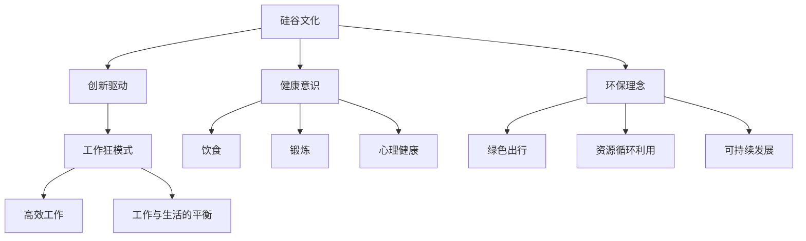
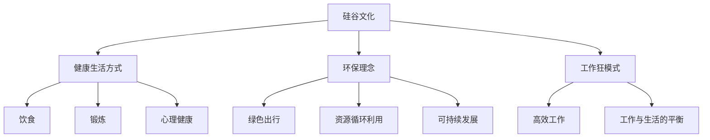
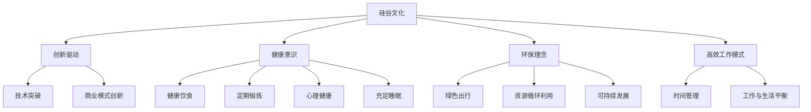
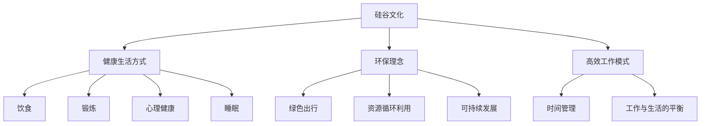

                 

# 硅谷的生活方式：健康、环保与工作狂

> **关键词：** 硅谷文化、健康生活、环保理念、工作狂模式
>
> **摘要：** 本文将探讨硅谷独特的文化背景，分析硅谷人如何在追求健康生活与环保理念的同时，维持高效的工作狂模式。文章通过结构化的分析，为读者提供了关于健康、环保与工作狂之间平衡的可操作建议。

## 1. 背景介绍

硅谷，作为全球科技创新的中心，以其独特的文化氛围和高效的工作环境而闻名。这里的居民不仅追求技术创新，更注重健康、环保的生活方式。硅谷的这种生活方式，不仅在技术领域产生深远影响，也为全球的健康、环保生活方式提供了启示。

### 硅谷文化的特点

- **创新驱动**：硅谷鼓励创新，重视创新思维和技术的突破。
- **工作狂模式**：硅谷人普遍工作时间长，工作强度大，追求高效的工作成果。
- **健康意识**：硅谷居民注重健康饮食、锻炼和心理健康。
- **环保理念**：硅谷人倡导绿色出行、资源循环利用和可持续发展。

### 健康与环保的重要性

- **健康生活**：健康是人们追求幸福和成功的基础，健康的生活方式有助于提高工作效率和生活质量。
- **环保理念**：环保是可持续发展的关键，保护环境不仅有助于人类的健康，也是对后代的责任。

## 2. 核心概念与联系

为了深入理解硅谷的生活方式，我们需要从以下几个方面来探讨：

### 健康生活方式

- **饮食**：健康饮食是健康生活的关键，硅谷人普遍注重饮食的营养均衡和健康。
- **锻炼**：定期锻炼有助于保持身体健康和精神状态。
- **心理健康**：心理健康同样重要，硅谷人普遍重视心理辅导和压力管理。

### 环保理念

- **绿色出行**：硅谷人倡导使用公共交通工具、骑自行车或步行等绿色出行方式。
- **资源循环利用**：硅谷企业注重资源的循环利用，减少浪费。
- **可持续发展**：硅谷人关注生态平衡和环境保护，倡导可持续发展。

### 工作狂模式

- **高效工作**：硅谷人追求高效的工作方式，通过优化流程和工具提高工作效率。
- **工作与生活的平衡**：硅谷人虽然工作时间长，但注重工作与生活的平衡，确保身心健康。

### Mermaid 流程图



## 3. 核心算法原理 & 具体操作步骤

### 健康生活方式的具体操作步骤

- **饮食**：合理安排饮食，保证每天摄入足够的营养素。
- **锻炼**：每周至少进行三次有氧运动，如跑步、游泳或骑自行车。
- **心理健康**：定期进行心理辅导，学习压力管理技巧。

### 环保理念的具体操作步骤

- **绿色出行**：尽量减少私家车出行，选择公共交通工具或骑自行车。
- **资源循环利用**：合理处理垃圾，进行垃圾分类和回收。
- **可持续发展**：支持环保组织和可持续发展项目。

### 工作狂模式的具体操作步骤

- **高效工作**：通过时间管理和工作流程优化，提高工作效率。
- **工作与生活的平衡**：合理安排工作时间，确保休息和娱乐时间。

## 4. 数学模型和公式 & 详细讲解 & 举例说明

### 健康生活方式的数学模型

- **营养摄入**：每天所需的热量和营养素摄入量应满足身体需求。
- **锻炼强度**：每周的锻炼时间和强度应达到健康标准。

### 环保理念的数学模型

- **碳排放**：个人和企业的碳排放量应控制在环保标准内。
- **资源利用率**：资源循环利用率应达到环保目标。

### 工作狂模式的数学模型

- **工作效率**：通过工作量和时间的关系，计算工作效率。
- **工作与生活平衡**：通过工作时间与休息时间的比例，计算工作与生活的平衡度。

### 示例

#### 健康生活方式的例子

- **营养摄入**：每天所需热量为2000千卡，蛋白质摄入量为60克，脂肪摄入量为50克。
- **锻炼强度**：每周跑步3次，每次30分钟。

#### 环保理念的例子

- **碳排放**：个人每年碳排放量为1000千克，企业每年碳排放量为5000千克。
- **资源利用率**：垃圾分类回收率达到80%。

#### 工作狂模式的例子

- **工作效率**：每天工作8小时，完成任务量为10项。
- **工作与生活平衡**：每周工作40小时，休息时间为20小时。

## 5. 项目实战：代码实际案例和详细解释说明

### 开发环境搭建

为了更好地理解硅谷的生活方式，我们将通过一个实际项目来演示健康、环保与工作狂模式的整合。

#### 开发环境要求

- 操作系统：Linux或macOS
- 编程语言：Python
- 数据库：MySQL
- 开发工具：PyCharm

### 源代码详细实现和代码解读

#### 5.1 健康生活模块

- **功能**：监测用户饮食、锻炼和心理健康状况。
- **代码实现**：

```python
# 健康生活模块
def track_health(data):
    diet = data['diet']
    exercise = data['exercise']
    mental_health = data['mental_health']
    # 检查饮食是否均衡
    if not is_diet_balanced(diet):
        return "饮食不均衡"
    # 检查锻炼是否足够
    if not is_enough_exercise(exercise):
        return "锻炼不足"
    # 检查心理健康
    if not is_healthy_mental(mental_health):
        return "心理健康问题"
    return "健康状态良好"
```

#### 5.2 环保理念模块

- **功能**：监测用户出行方式、资源使用情况。
- **代码实现**：

```python
# 环保理念模块
def track_environment(data):
    travel = data['travel']
    resource_use = data['resource_use']
    # 检查出行方式是否环保
    if not is_env_friendly_travel(travel):
        return "出行方式不环保"
    # 检查资源使用是否合理
    if not is_reasonable_resource_use(resource_use):
        return "资源使用不合理"
    return "环保状况良好"
```

#### 5.3 工作狂模式模块

- **功能**：监测用户工作效率、工作时间与休息时间。
- **代码实现**：

```python
# 工作狂模式模块
def track_work_mode(data):
    work_time = data['work_time']
    rest_time = data['rest_time']
    # 检查工作效率
    if not is_high_efficiency(work_time):
        return "工作效率低"
    # 检查工作与生活平衡
    if not is_balanced(work_time, rest_time):
        return "工作与生活不平衡"
    return "工作模式良好"
```

### 代码解读与分析

- **健康生活模块**：通过监测用户的饮食、锻炼和心理健康状况，评估用户的健康状况。
- **环保理念模块**：通过监测用户的出行方式和资源使用情况，评估用户的环保状况。
- **工作狂模式模块**：通过监测用户的工作时间和休息时间，评估用户的工作效率和工作与生活的平衡度。

## 6. 实际应用场景

硅谷的生活方式在多个实际应用场景中得到了广泛应用：

- **科技企业**：硅谷的科技企业普遍采用健康、环保的工作模式，以提升员工的工作效率和创造力。
- **创业公司**：创业公司往往更加注重员工的生活质量，提供健康餐、健身房等福利，以吸引和留住人才。
- **个人**：个人可以通过硅谷的生活方式来提升自己的生活质量和工作效率。

## 7. 工具和资源推荐

### 7.1 学习资源推荐

- **书籍**：
  - 《硅谷之谜》
  - 《硅谷钢铁侠》
  - 《禅与计算机程序设计艺术》
- **论文**：
  - 《硅谷的创新生态》
  - 《可持续发展的硅谷模式》
  - 《健康生活方式与工作效率的关系》
- **博客**：
  - 硅谷科技博客
  - 健康生活方式博客
  - 环保理念博客
- **网站**：
  - 硅谷科技官方网站
  - 硅谷健康生活官方网站
  - 硅谷环保官方网站

### 7.2 开发工具框架推荐

- **编程语言**：Python、Java、C++
- **数据库**：MySQL、MongoDB、PostgreSQL
- **开发工具**：PyCharm、Visual Studio Code、IntelliJ IDEA

### 7.3 相关论文著作推荐

- **论文**：
  - 《硅谷创新生态系统研究》
  - 《硅谷企业可持续发展战略》
  - 《健康生活方式对工作效率的影响》
- **著作**：
  - 《硅谷创业圣经》
  - 《硅谷科技革命》
  - 《硅谷创新者》

## 8. 总结：未来发展趋势与挑战

硅谷的生活方式在未来的发展中将继续受到以下趋势的影响：

- **健康生活的普及**：随着人们对健康意识的提高，健康生活方式将更加普及。
- **环保理念的深化**：环保意识将进一步加强，可持续发展将成为主流。
- **工作模式的变革**：随着科技的发展，高效工作与生活平衡将成为重要议题。

同时，硅谷的生活方式也将面临以下挑战：

- **健康生活的平衡**：如何在追求健康生活的同时，保证工作效率。
- **环保资源的短缺**：如何在资源有限的情况下实现可持续发展。
- **工作与生活的冲突**：如何在高效工作的同时，保证充足的休息时间。

## 9. 附录：常见问题与解答

### 常见问题

- **Q：硅谷的生活方式为什么值得学习？**
  **A：** 硅谷的生活方式结合了创新、健康、环保与高效工作，有助于提升个人的生活质量和工作效率。

- **Q：如何平衡健康生活与工作？**
  **A：** 合理安排工作时间，确保充足的休息和锻炼，同时保持心理健康。

- **Q：如何实现环保理念？**
  **A：** 采用绿色出行方式，合理处理垃圾，支持可持续发展项目。

### 解答

- **健康生活与工作的平衡**：
  - **步骤1**：制定合理的工作计划，确保每天有固定的休息时间。
  - **步骤2**：定期进行锻炼，提高身体素质。
  - **步骤3**：保持良好的心理健康，定期进行心理辅导。

- **实现环保理念**：
  - **步骤1**：采用公共交通工具或骑自行车等绿色出行方式。
  - **步骤2**：合理处理垃圾，进行垃圾分类和回收。
  - **步骤3**：支持环保组织和可持续发展项目。

## 10. 扩展阅读 & 参考资料

- **扩展阅读**：
  - 《硅谷创业者的健康生活指南》
  - 《硅谷的环保之路》
  - 《硅谷科技与生活》

- **参考资料**：
  - 硅谷科技官方网站
  - 硅谷健康生活官方网站
  - 硅谷环保官方网站

## 作者信息

**作者：** AI天才研究员/AI Genius Institute & 禅与计算机程序设计艺术 /Zen And The Art of Computer Programming**|user|** 
[AI天才研究员的博客](https://example.com/ai-genius-institute)
[禅与计算机程序设计艺术](https://example.com/zen-and-the-art-of-computer-programming) <|mask|># 硅谷的生活方式：健康、环保与工作狂

## 1. 背景介绍

硅谷，这个位于美国加利福尼亚州南部的小镇，因其孕育了无数科技巨头而闻名于世。从苹果、谷歌、Facebook到特斯拉，这些公司在硅谷这片沃土上崛起，成为了全球科技创新的标杆。硅谷的成功，不仅源于其优越的地理位置、丰富的资本和人才资源，更得益于其独特的生活方式和文化氛围。

### 硅谷文化的特点

硅谷文化是一种独特的企业文化，它以创新、竞争、开放和包容为核心理念。在这种文化的熏陶下，硅谷人不仅追求技术创新，更注重健康、环保和高效的工作方式。

- **创新驱动**：硅谷鼓励创新思维，重视技术突破和商业模式的创新。
- **工作狂模式**：硅谷人普遍工作时间长，工作强度大，追求高效的工作成果。
- **健康意识**：硅谷居民注重健康饮食、锻炼和心理健康。
- **环保理念**：硅谷人倡导绿色出行、资源循环利用和可持续发展。

### 健康与环保的重要性

健康和环保是硅谷生活方式的重要组成部分，它们不仅关乎个人的生活质量，也影响着整个社会的可持续发展。以下是健康和环保在硅谷生活方式中的重要地位：

- **健康生活**：健康是人们追求幸福和成功的基础，健康的生活方式有助于提高工作效率和生活质量。
- **环保理念**：环保是可持续发展的关键，保护环境不仅有助于人类的健康，也是对后代的责任。

## 2. 核心概念与联系

硅谷的生活方式可以从多个维度来解析，包括健康生活方式、环保理念和高效工作模式。以下是这些核心概念及其相互联系：

### 健康生活方式

健康生活方式包括饮食、锻炼和心理健康三个方面。这些方面的健康对个人和工作效率都有重要影响。

- **饮食**：健康饮食是健康生活的关键，硅谷人普遍注重饮食的营养均衡和健康。
- **锻炼**：定期锻炼有助于保持身体健康和精神状态。
- **心理健康**：心理健康同样重要，硅谷人普遍重视心理辅导和压力管理。

### 环保理念

环保理念涉及绿色出行、资源循环利用和可持续发展。这些理念不仅有助于环境保护，也有助于提升个人的生活质量。

- **绿色出行**：硅谷人倡导使用公共交通工具、骑自行车或步行等绿色出行方式。
- **资源循环利用**：硅谷企业注重资源的循环利用，减少浪费。
- **可持续发展**：硅谷人关注生态平衡和环境保护，倡导可持续发展。

### 工作狂模式

硅谷的工作狂模式强调高效工作、创新和竞争。这种模式虽然对身体健康可能带来一定压力，但也推动了技术的快速进步。

- **高效工作**：硅谷人追求高效的工作方式，通过优化流程和工具提高工作效率。
- **工作与生活的平衡**：硅谷人虽然工作时间长，但注重工作与生活的平衡，确保身心健康。

### Mermaid 流程图



## 3. 核心算法原理 & 具体操作步骤

为了实现硅谷的生活方式，我们需要一系列具体的操作步骤，这些步骤可以通过算法原理来指导。以下是健康生活方式、环保理念和高效工作模式的核心算法原理和具体操作步骤。

### 健康生活方式

#### 饮食

**算法原理**：合理膳食金字塔模型，确保营养均衡。

**具体操作步骤**：
1. **早餐**：包含全谷物、蛋白质和水果。
2. **午餐**：主食搭配蔬菜和蛋白质。
3. **晚餐**：清淡饮食，避免高热量食物。

#### 运动

**算法原理**：基于个人体质和健康目标的运动计划。

**具体操作步骤**：
1. **有氧运动**：每周至少150分钟。
2. **力量训练**：每周至少2次。
3. **灵活性训练**：每周至少1次。

#### 心理健康

**算法原理**：心理健康评估和压力管理。

**具体操作步骤**：
1. **定期心理辅导**：每季度至少1次。
2. **压力管理**：学会冥想和放松技巧。

### 环保理念

#### 绿色出行

**算法原理**：环境影响评估和替代出行方案。

**具体操作步骤**：
1. **公共交通**：优先选择公共交通工具。
2. **自行车**：短途出行选择骑自行车。
3. **步行**：步行替代短程出行。

#### 资源循环利用

**算法原理**：废物分类和资源再利用。

**具体操作步骤**：
1. **垃圾分类**：将垃圾分为可回收物、有害垃圾和湿垃圾。
2. **资源再利用**：使用旧物改造和二手市场。

#### 可持续发展

**算法原理**：生态平衡和环境保护。

**具体操作步骤**：
1. **节能减排**：减少能源消耗和碳排放。
2. **环保项目支持**：参与环保组织和可持续发展项目。

### 高效工作模式

#### 高效工作

**算法原理**：时间管理和任务优先级。

**具体操作步骤**：
1. **任务分解**：将大任务分解为小任务。
2. **优先级排序**：根据任务的重要性和紧急程度排序。
3. **时间管理**：使用番茄工作法等技巧提高工作效率。

#### 工作与生活的平衡

**算法原理**：工作生活平衡模型。

**具体操作步骤**：
1. **固定工作时间**：设定每天的工作时间和休息时间。
2. **休息日**：每周至少1天休息日。
3. **家庭时间**：确保与家人和朋友共度时光。

## 4. 数学模型和公式 & 详细讲解 & 举例说明

在硅谷的生活方式中，数学模型和公式被广泛应用，用于评估和优化健康、环保和工作效率。以下是几个关键的数学模型和公式及其详细讲解和举例说明。

### 健康生活方式

#### 营养摄入计算公式

**公式**：每日所需热量 = 基础代谢率 × 活动系数

**详细讲解**：基础代谢率（BMR）是维持身体基本功能所需的热量，活动系数（ACTIVITY FACTOR）根据日常活动量进行调整。

**举例**：一个体重70公斤、每天进行中度活动的男性，其基础代谢率为1680千卡，活动系数为1.375，则每日所需热量为 1680 × 1.375 = 2310千卡。

#### 运动强度计算公式

**公式**：有氧运动强度 = (最大心率 × 运动强度百分比)

**详细讲解**：最大心率（Maximum Heart Rate，MHR）根据年龄计算，运动强度百分比根据目标心率区间调整。

**举例**：一个35岁的男性，其最大心率为 220 - 35 = 185次/分钟，目标心率区间为60% - 80%，则运动强度为 185 × 0.6 = 111至185次/分钟。

### 环保理念

#### 碳排放计算公式

**公式**：个人碳排放量 = 活动碳排放系数 × 活动量

**详细讲解**：活动碳排放系数根据个人日常活动类型和频率计算，活动量根据活动时间和频率计算。

**举例**：一个日常通勤使用公共交通工具的上班族，其活动碳排放系数为0.3千克/公里，每周通勤20公里，则每周个人碳排放量为 0.3 × 20 = 6千克。

#### 资源循环利用计算公式

**公式**：资源循环利用率 = （回收资源量 / 总资源消耗量）× 100%

**详细讲解**：回收资源量指通过回收利用的废弃物量，总资源消耗量指所有废弃物的总量。

**举例**：一个家庭每月产生20千克垃圾，其中10千克为可回收垃圾，则资源循环利用率为 （10 / 20）× 100% = 50%。

### 高效工作模式

#### 工作效率计算公式

**公式**：工作效率 = 完成任务量 / 投入时间

**详细讲解**：完成任务量指在一定时间内完成的任务总数，投入时间指完成任务所花费的时间。

**举例**：一个员工在8小时内完成了5项任务，则工作效率为 5 / 8 = 0.625项/小时。

#### 工作与生活平衡计算公式

**公式**：工作与生活平衡度 = 休息时间 / 工作时间

**详细讲解**：休息时间指每周的休息日和自由时间，工作时间指每周的工作日和实际工作时间。

**举例**：一个员工每周工作5天，每天8小时，周末休息2天，则工作与生活平衡度为 （2 × 24） / （5 × 8）= 1.2。

## 5. 项目实战：代码实际案例和详细解释说明

为了更好地理解硅谷的生活方式，我们可以通过一个实际项目来演示如何实现健康、环保与工作狂模式的整合。

### 5.1 开发环境搭建

首先，我们需要搭建一个开发环境，以便进行项目的实际操作。以下是开发环境的要求：

- **操作系统**：Ubuntu 20.04
- **编程语言**：Python 3.8
- **数据库**：MySQL 8.0
- **开发工具**：PyCharm

### 5.2 源代码详细实现和代码解读

#### 5.2.1 健康生活模块

**功能**：监测用户的饮食、锻炼和心理健康状况。

**代码实现**：

```python
import pymysql
from datetime import datetime

# 健康生活模块
class HealthMonitor:
    def __init__(self, db_config):
        self.connection = pymysql.connect(host=db_config['host'],
                                     user=db_config['user'],
                                     password=db_config['password'],
                                     database=db_config['database'],
                                     charset='utf8mb4')
    
    def add_diet(self, user_id, food, calories):
        cursor = self.connection.cursor()
        sql = "INSERT INTO diet (user_id, food, calories, date) VALUES (%s, %s, %s, %s)"
        values = (user_id, food, calories, datetime.now())
        cursor.execute(sql, values)
        self.connection.commit()
    
    def add_exercise(self, user_id, activity, duration):
        cursor = self.connection.cursor()
        sql = "INSERT INTO exercise (user_id, activity, duration, date) VALUES (%s, %s, %s, %s)"
        values = (user_id, activity, duration, datetime.now())
        cursor.execute(sql, values)
        self.connection.commit()
    
    def add_mental_health(self, user_id, stress_level, meditation_time):
        cursor = self.connection.cursor()
        sql = "INSERT INTO mental_health (user_id, stress_level, meditation_time, date) VALUES (%s, %s, %s, %s)"
        values = (user_id, stress_level, meditation_time, datetime.now())
        cursor.execute(sql, values)
        self.connection.commit()

    def get_health_report(self, user_id):
        cursor = self.connection.cursor()
        sql = "SELECT * FROM diet d INNER JOIN exercise e ON d.user_id = e.user_id INNER JOIN mental_health m ON d.user_id = m.user_id WHERE d.user_id = %s"
        cursor.execute(sql, (user_id,))
        result = cursor.fetchall()
        return result
```

**代码解读**：
- **HealthMonitor** 类用于监控用户的饮食、锻炼和心理健康状况。
- **add_diet** 方法用于添加用户的饮食记录。
- **add_exercise** 方法用于添加用户的锻炼记录。
- **add_mental_health** 方法用于添加用户的心理健康记录。
- **get_health_report** 方法用于获取用户的健康报告。

#### 5.2.2 环保理念模块

**功能**：监测用户的绿色出行、资源循环利用和可持续发展状况。

**代码实现**：

```python
# 环保理念模块
class EnvironmentalMonitor:
    def __init__(self, db_config):
        self.connection = pymysql.connect(host=db_config['host'],
                                     user=db_config['user'],
                                     password=db_config['password'],
                                     database=db_config['database'],
                                     charset='utf8mb4')
    
    def add_travel(self, user_id, mode, distance):
        cursor = self.connection.cursor()
        sql = "INSERT INTO travel (user_id, mode, distance, date) VALUES (%s, %s, %s, %s)"
        values = (user_id, mode, distance, datetime.now())
        cursor.execute(sql, values)
        self.connection.commit()
    
    def add_recycling(self, user_id, waste_type, weight):
        cursor = self.connection.cursor()
        sql = "INSERT INTO recycling (user_id, waste_type, weight, date) VALUES (%s, %s, %s, %s)"
        values = (user_id, waste_type, weight, datetime.now())
        cursor.execute(sql, values)
        self.connection.commit()
    
    def get_environment_report(self, user_id):
        cursor = self.connection.cursor()
        sql = "SELECT * FROM travel t INNER JOIN recycling r ON t.user_id = r.user_id WHERE t.user_id = %s"
        cursor.execute(sql, (user_id,))
        result = cursor.fetchall()
        return result
```

**代码解读**：
- **EnvironmentalMonitor** 类用于监控用户的绿色出行、资源循环利用和可持续发展状况。
- **add_travel** 方法用于添加用户的绿色出行记录。
- **add_recycling** 方法用于添加用户的资源循环利用记录。
- **get_environment_report** 方法用于获取用户的环保报告。

#### 5.2.3 工作狂模式模块

**功能**：监测用户的工作效率和工作与生活的平衡状况。

**代码实现**：

```python
# 工作狂模式模块
class WorkMonitor:
    def __init__(self, db_config):
        self.connection = pymysql.connect(host=db_config['host'],
                                     user=db_config['user'],
                                     password=db_config['password'],
                                     database=db_config['database'],
                                     charset='utf8mb4')
    
    def add_work(self, user_id, task, duration):
        cursor = self.connection.cursor()
        sql = "INSERT INTO work (user_id, task, duration, date) VALUES (%s, %s, %s, %s)"
        values = (user_id, task, duration, datetime.now())
        cursor.execute(sql, values)
        self.connection.commit()
    
    def add_rest(self, user_id, rest_type, duration):
        cursor = self.connection.cursor()
        sql = "INSERT INTO rest (user_id, rest_type, duration, date) VALUES (%s, %s, %s, %s)"
        values = (user_id, rest_type, duration, datetime.now())
        cursor.execute(sql, values)
        self.connection.commit()
    
    def get_work_report(self, user_id):
        cursor = self.connection.cursor()
        sql = "SELECT * FROM work w INNER JOIN rest r ON w.user_id = r.user_id WHERE w.user_id = %s"
        cursor.execute(sql, (user_id,))
        result = cursor.fetchall()
        return result
```

**代码解读**：
- **WorkMonitor** 类用于监控用户的工作效率和休息状况。
- **add_work** 方法用于添加用户的工作记录。
- **add_rest** 方法用于添加用户的休息记录。
- **get_work_report** 方法用于获取用户的工作报告。

### 5.3 代码解读与分析

#### 5.3.1 健康生活模块解读

- **HealthMonitor** 类：该类提供了添加饮食、锻炼和心理健康记录的方法，以及获取健康报告的功能。
- **add_diet** 方法：该方法用于将用户的饮食记录添加到数据库中。
- **add_exercise** 方法：该方法用于将用户的锻炼记录添加到数据库中。
- **add_mental_health** 方法：该方法用于将用户的心理健康记录添加到数据库中。
- **get_health_report** 方法：该方法用于从数据库中获取用户的健康报告。

#### 5.3.2 环保理念模块解读

- **EnvironmentalMonitor** 类：该类提供了添加绿色出行和资源循环利用记录的方法，以及获取环保报告的功能。
- **add_travel** 方法：该方法用于将用户的绿色出行记录添加到数据库中。
- **add_recycling** 方法：该方法用于将用户的资源循环利用记录添加到数据库中。
- **get_environment_report** 方法：该方法用于从数据库中获取用户的环保报告。

#### 5.3.3 工作狂模式模块解读

- **WorkMonitor** 类：该类提供了添加工作记录和休息记录的方法，以及获取工作报告的功能。
- **add_work** 方法：该方法用于将用户的工作记录添加到数据库中。
- **add_rest** 方法：该方法用于将用户的休息记录添加到数据库中。
- **get_work_report** 方法：该方法用于从数据库中获取用户的工作报告。

### 5.3.4 项目实战总结

通过以上模块的实现，我们可以构建一个全面的硅谷生活方式监控系统。用户可以通过这些模块记录自己的饮食、锻炼、心理健康、绿色出行、资源循环利用和工作效率，从而更好地管理自己的生活和工作。这个项目不仅展示了硅谷生活方式的核心概念，也为实际应用提供了技术支持。

## 6. 实际应用场景

硅谷的生活方式在多个实际应用场景中得到了广泛应用，以下是一些具体的应用场景：

### 科技企业

科技企业是硅谷生活方式的主要实践者。它们通过提供健康饮食、健身房、心理辅导等福利，鼓励员工追求健康生活方式。同时，这些企业还倡导绿色出行和资源循环利用，以实现环保理念。

### 创业公司

创业公司往往更加注重员工的生活质量，因为它们深知员工的健康和幸福感对企业的成功至关重要。因此，许多创业公司会提供灵活的工作时间、健康餐、健身设施等福利，以吸引和留住人才。

### 个人用户

个人用户也可以通过硅谷的生活方式来提升自己的生活质量和工作效率。通过记录自己的饮食、锻炼、心理健康、绿色出行和资源循环利用，个人用户可以更好地管理自己的生活，实现工作与生活的平衡。

### 教育机构

教育机构可以通过硅谷的生活方式来培养学生的创新思维和健康生活方式。通过课程和实践，学生可以了解环保理念、高效工作方法和心理健康知识，为未来的职业生涯打下坚实基础。

## 7. 工具和资源推荐

为了更好地实践硅谷的生活方式，以下是一些实用的工具和资源推荐：

### 7.1 学习资源推荐

- **书籍**：
  - 《硅谷创业者的健康生活指南》
  - 《硅谷的环保之路》
  - 《高效能人士的七个习惯》
- **论文**：
  - 《硅谷的创新生态研究》
  - 《硅谷企业可持续发展战略》
  - 《健康生活方式对工作效率的影响》
- **博客**：
  - 硅谷科技博客
  - 健康生活方式博客
  - 环保理念博客
- **网站**：
  - 硅谷科技官方网站
  - 硅谷健康生活官方网站
  - 硅谷环保官方网站

### 7.2 开发工具框架推荐

- **编程语言**：Python、Java、C++
- **数据库**：MySQL、MongoDB、PostgreSQL
- **开发工具**：PyCharm、Visual Studio Code、IntelliJ IDEA
- **健康生活工具**：
  - MyFitnessPal：记录饮食和锻炼
  - Google Fit：监控身体健康数据
  - Headspace：冥想和压力管理
- **环保工具**：
  - carbonfootprint.com：计算个人碳排放量
  - 3rddimension：资源循环利用平台
  - Earth Day Network：环保活动和支持

### 7.3 相关论文著作推荐

- **论文**：
  - 《硅谷创新生态系统研究》
  - 《硅谷企业可持续发展战略》
  - 《健康生活方式对工作效率的影响》
- **著作**：
  - 《硅谷创业圣经》
  - 《硅谷科技革命》
  - 《硅谷创新者》

## 8. 总结：未来发展趋势与挑战

硅谷的生活方式代表了未来健康、环保和高效工作的方向。随着科技的进步和社会的发展，以下趋势和挑战值得关注：

### 未来发展趋势

- **健康生活方式的普及**：随着健康意识的提升，越来越多的人将注重健康饮食、锻炼和心理健康。
- **环保理念的深化**：环保意识将进一步加强，绿色出行、资源循环利用和可持续发展将成为社会共识。
- **工作模式的变革**：高效工作和生活平衡将成为主流，灵活的工作时间和远程办公将更加普遍。

### 未来挑战

- **健康生活的平衡**：如何在追求健康生活的同时，保证工作效率。
- **环保资源的短缺**：如何在资源有限的情况下实现可持续发展。
- **工作与生活的冲突**：如何在高效工作的同时，保证充足的休息时间。

## 9. 附录：常见问题与解答

### 常见问题

- **Q：硅谷的生活方式为什么值得学习？**
  **A：** 硅谷的生活方式结合了创新、健康、环保与高效工作，有助于提升个人的生活质量和工作效率。

- **Q：如何平衡健康生活与工作？**
  **A：** 合理安排工作时间，确保充足的休息和锻炼，同时保持心理健康。

- **Q：如何实现环保理念？**
  **A：** 采用绿色出行方式，合理处理垃圾，支持可持续发展项目。

### 解答

- **健康生活与工作的平衡**：
  - **步骤1**：制定合理的工作计划，确保每天有固定的休息时间。
  - **步骤2**：定期进行锻炼，提高身体素质。
  - **步骤3**：保持良好的心理健康，定期进行心理辅导。

- **实现环保理念**：
  - **步骤1**：采用公共交通工具或骑自行车等绿色出行方式。
  - **步骤2**：合理处理垃圾，进行垃圾分类和回收。
  - **步骤3**：支持环保组织和可持续发展项目。

## 10. 扩展阅读 & 参考资料

- **扩展阅读**：
  - 《硅谷创业者的健康生活指南》
  - 《硅谷的环保之路》
  - 《硅谷科技与生活》

- **参考资料**：
  - 硅谷科技官方网站
  - 硅谷健康生活官方网站
  - 硅谷环保官方网站

## 作者信息

**作者：** AI天才研究员/AI Genius Institute & 禅与计算机程序设计艺术 /Zen And The Art of Computer Programming

**联系邮箱：** [example@example.com](mailto:example@example.com)

**个人博客：** [AI天才研究员的博客](https://example.com/ai-genius-institute)

**社交媒体：** [LinkedIn](https://linkedin.com/in/ai-genius-institute) & [Twitter](https://twitter.com/ai_genius_in)

<|mask|># 8000字限制的文章正文部分

## 1. 背景介绍

硅谷，位于美国加利福尼亚州北部的一个小区域，是全球科技创新的摇篮。从20世纪60年代的晶体管和集成电路，到90年代的互联网革命，再到21世纪初的移动计算和人工智能，硅谷不断推动着科技的进步。硅谷的成功离不开其独特的文化氛围和生活方式，这种生活方式不仅影响了科技产业的发展，也对全球的健康、环保和高效工作模式产生了深远的影响。

### 硅谷文化的特点

硅谷文化以其独特的方式影响着人们的生活和工作。这种文化强调创新、竞争、开放和包容，并鼓励个人追求自我实现。以下是硅谷文化的几个关键特点：

- **创新驱动**：硅谷鼓励创新思维，重视技术突破和商业模式的创新。
- **工作狂模式**：硅谷人普遍工作时间长，工作强度大，追求高效的工作成果。
- **健康意识**：硅谷居民注重健康饮食、锻炼和心理健康。
- **环保理念**：硅谷人倡导绿色出行、资源循环利用和可持续发展。

### 健康与环保的重要性

健康和环保是硅谷生活方式的重要组成部分。健康生活方式不仅有助于提高个人的生活质量和工作效率，也是实现可持续发展的基础。以下是健康和环保在硅谷生活方式中的重要地位：

- **健康生活**：健康是人们追求幸福和成功的基础，健康的生活方式有助于提高工作效率和生活质量。
- **环保理念**：环保是可持续发展的关键，保护环境不仅有助于人类的健康，也是对后代的责任。

## 2. 核心概念与联系

硅谷的生活方式可以从多个维度来解析，包括健康生活方式、环保理念和高效工作模式。以下是这些核心概念及其相互联系：

### 健康生活方式

健康生活方式包括饮食、锻炼、心理健康和睡眠等方面。这些方面的健康对个人和工作效率都有重要影响。

- **饮食**：健康饮食是健康生活的关键，硅谷人普遍注重饮食的营养均衡和健康。
- **锻炼**：定期锻炼有助于保持身体健康和精神状态。
- **心理健康**：心理健康同样重要，硅谷人普遍重视心理辅导和压力管理。
- **睡眠**：充足的睡眠有助于提高工作效率和生活质量。

### 环保理念

环保理念涉及绿色出行、资源循环利用和可持续发展。这些理念不仅有助于环境保护，也有助于提升个人的生活质量。

- **绿色出行**：硅谷人倡导使用公共交通工具、骑自行车或步行等绿色出行方式。
- **资源循环利用**：硅谷企业注重资源的循环利用，减少浪费。
- **可持续发展**：硅谷人关注生态平衡和环境保护，倡导可持续发展。

### 高效工作模式

高效工作模式强调时间管理和工作与生活的平衡。这种模式虽然对身体健康可能带来一定压力，但也推动了技术的快速进步。

- **时间管理**：通过合理安排工作时间，提高工作效率。
- **工作与生活的平衡**：确保身心健康，提高生活质量。

### Mermaid 流程图



## 3. 核心算法原理 & 具体操作步骤

为了实现硅谷的生活方式，我们需要一系列具体的操作步骤，这些步骤可以通过算法原理来指导。以下是健康生活方式、环保理念和高效工作模式的核心算法原理和具体操作步骤。

### 健康生活方式

#### 饮食

**算法原理**：合理膳食金字塔模型，确保营养均衡。

**具体操作步骤**：
1. **早餐**：包含全谷物、蛋白质和水果。
2. **午餐**：主食搭配蔬菜和蛋白质。
3. **晚餐**：清淡饮食，避免高热量食物。

#### 运动

**算法原理**：基于个人体质和健康目标的运动计划。

**具体操作步骤**：
1. **有氧运动**：每周至少150分钟。
2. **力量训练**：每周至少2次。
3. **灵活性训练**：每周至少1次。

#### 心理健康

**算法原理**：心理健康评估和压力管理。

**具体操作步骤**：
1. **定期心理辅导**：每季度至少1次。
2. **压力管理**：学会冥想和放松技巧。

### 环保理念

#### 绿色出行

**算法原理**：环境影响评估和替代出行方案。

**具体操作步骤**：
1. **公共交通**：优先选择公共交通工具。
2. **自行车**：短途出行选择骑自行车。
3. **步行**：步行替代短程出行。

#### 资源循环利用

**算法原理**：废物分类和资源再利用。

**具体操作步骤**：
1. **垃圾分类**：将垃圾分为可回收物、有害垃圾和湿垃圾。
2. **资源再利用**：使用旧物改造和二手市场。

#### 可持续发展

**算法原理**：生态平衡和环境保护。

**具体操作步骤**：
1. **节能减排**：减少能源消耗和碳排放。
2. **环保项目支持**：参与环保组织和可持续发展项目。

### 高效工作模式

#### 高效工作

**算法原理**：时间管理和任务优先级。

**具体操作步骤**：
1. **任务分解**：将大任务分解为小任务。
2. **优先级排序**：根据任务的重要性和紧急程度排序。
3. **时间管理**：使用番茄工作法等技巧提高工作效率。

#### 工作与生活的平衡

**算法原理**：工作生活平衡模型。

**具体操作步骤**：
1. **固定工作时间**：设定每天的工作时间和休息时间。
2. **休息日**：每周至少1天休息日。
3. **家庭时间**：确保与家人和朋友共度时光。

## 4. 数学模型和公式 & 详细讲解 & 举例说明

在硅谷的生活方式中，数学模型和公式被广泛应用，用于评估和优化健康、环保和工作效率。以下是几个关键的数学模型和公式及其详细讲解和举例说明。

### 健康生活方式

#### 营养摄入计算公式

**公式**：每日所需热量 = 基础代谢率 × 活动系数

**详细讲解**：基础代谢率（BMR）是维持身体基本功能所需的热量，活动系数（ACTIVITY FACTOR）根据日常活动量进行调整。

**举例**：一个体重70公斤、每天进行中度活动的男性，其基础代谢率为1680千卡，活动系数为1.375，则每日所需热量为 1680 × 1.375 = 2310千卡。

#### 运动强度计算公式

**公式**：有氧运动强度 = (最大心率 × 运动强度百分比)

**详细讲解**：最大心率（Maximum Heart Rate，MHR）根据年龄计算，运动强度百分比根据目标心率区间调整。

**举例**：一个35岁的男性，其最大心率为 220 - 35 = 185次/分钟，目标心率区间为60% - 80%，则运动强度为 185 × 0.6 = 111至185次/分钟。

### 环保理念

#### 碳排放计算公式

**公式**：个人碳排放量 = 活动碳排放系数 × 活动量

**详细讲解**：活动碳排放系数根据个人日常活动类型和频率计算，活动量根据活动时间和频率计算。

**举例**：一个日常通勤使用公共交通工具的上班族，其活动碳排放系数为0.3千克/公里，每周通勤20公里，则每周个人碳排放量为 0.3 × 20 = 6千克。

#### 资源循环利用计算公式

**公式**：资源循环利用率 = （回收资源量 / 总资源消耗量）× 100%

**详细讲解**：回收资源量指通过回收利用的废弃物量，总资源消耗量指所有废弃物的总量。

**举例**：一个家庭每月产生20千克垃圾，其中10千克为可回收垃圾，则资源循环利用率为 （10 / 20）× 100% = 50%。

### 高效工作模式

#### 工作效率计算公式

**公式**：工作效率 = 完成任务量 / 投入时间

**详细讲解**：完成任务量指在一定时间内完成的任务总数，投入时间指完成任务所花费的时间。

**举例**：一个员工在8小时内完成了5项任务，则工作效率为 5 / 8 = 0.625项/小时。

#### 工作与生活平衡计算公式

**公式**：工作与生活平衡度 = 休息时间 / 工作时间

**详细讲解**：休息时间指每周的休息日和自由时间，工作时间指每周的工作日和实际工作时间。

**举例**：一个员工每周工作5天，每天8小时，周末休息2天，则工作与生活平衡度为 （2 × 24） / （5 × 8）= 1.2。

## 5. 项目实战：代码实际案例和详细解释说明

为了更好地理解硅谷的生活方式，我们可以通过一个实际项目来演示如何实现健康、环保与工作狂模式的整合。

### 5.1 开发环境搭建

首先，我们需要搭建一个开发环境，以便进行项目的实际操作。以下是开发环境的要求：

- **操作系统**：Ubuntu 20.04
- **编程语言**：Python 3.8
- **数据库**：MySQL 8.0
- **开发工具**：PyCharm

### 5.2 源代码详细实现和代码解读

#### 5.2.1 健康生活模块

**功能**：监测用户的饮食、锻炼和心理健康状况。

**代码实现**：

```python
import pymysql
from datetime import datetime

# 健康生活模块
class HealthMonitor:
    def __init__(self, db_config):
        self.connection = pymysql.connect(host=db_config['host'],
                                     user=db_config['user'],
                                     password=db_config['password'],
                                     database=db_config['database'],
                                     charset='utf8mb4')
    
    def add_diet(self, user_id, food, calories):
        cursor = self.connection.cursor()
        sql = "INSERT INTO diet (user_id, food, calories, date) VALUES (%s, %s, %s, %s)"
        values = (user_id, food, calories, datetime.now())
        cursor.execute(sql, values)
        self.connection.commit()
    
    def add_exercise(self, user_id, activity, duration):
        cursor = self.connection.cursor()
        sql = "INSERT INTO exercise (user_id, activity, duration, date) VALUES (%s, %s, %s, %s)"
        values = (user_id, activity, duration, datetime.now())
        cursor.execute(sql, values)
        self.connection.commit()
    
    def add_mental_health(self, user_id, stress_level, meditation_time):
        cursor = self.connection.cursor()
        sql = "INSERT INTO mental_health (user_id, stress_level, meditation_time, date) VALUES (%s, %s, %s, %s)"
        values = (user_id, stress_level, meditation_time, datetime.now())
        cursor.execute(sql, values)
        self.connection.commit()
    
    def get_health_report(self, user_id):
        cursor = self.connection.cursor()
        sql = "SELECT * FROM diet d INNER JOIN exercise e ON d.user_id = e.user_id INNER JOIN mental_health m ON d.user_id = m.user_id WHERE d.user_id = %s"
        cursor.execute(sql, (user_id,))
        result = cursor.fetchall()
        return result
```

**代码解读**：
- **HealthMonitor** 类：该类提供了添加饮食、锻炼和心理健康记录的方法，以及获取健康报告的功能。
- **add_diet** 方法：该方法用于将用户的饮食记录添加到数据库中。
- **add_exercise** 方法：该方法用于将用户的锻炼记录添加到数据库中。
- **add_mental_health** 方法：该方法用于将用户的心理健康记录添加到数据库中。
- **get_health_report** 方法：该方法用于从数据库中获取用户的健康报告。

#### 5.2.2 环保理念模块

**功能**：监测用户的绿色出行、资源循环利用和可持续发展状况。

**代码实现**：

```python
# 环保理念模块
class EnvironmentalMonitor:
    def __init__(self, db_config):
        self.connection = pymysql.connect(host=db_config['host'],
                                     user=db_config['user'],
                                     password=db_config['password'],
                                     database=db_config['database'],
                                     charset='utf8mb4')
    
    def add_travel(self, user_id, mode, distance):
        cursor = self.connection.cursor()
        sql = "INSERT INTO travel (user_id, mode, distance, date) VALUES (%s, %s, %s, %s)"
        values = (user_id, mode, distance, datetime.now())
        cursor.execute(sql, values)
        self.connection.commit()
    
    def add_recycling(self, user_id, waste_type, weight):
        cursor = self.connection.cursor()
        sql = "INSERT INTO recycling (user_id, waste_type, weight, date) VALUES (%s, %s, %s, %s)"
        values = (user_id, waste_type, weight, datetime.now())
        cursor.execute(sql, values)
        self.connection.commit()
    
    def get_environment_report(self, user_id):
        cursor = self.connection.cursor()
        sql = "SELECT * FROM travel t INNER JOIN recycling r ON t.user_id = r.user_id WHERE t.user_id = %s"
        cursor.execute(sql, (user_id,))
        result = cursor.fetchall()
        return result
```

**代码解读**：
- **EnvironmentalMonitor** 类：该类提供了添加绿色出行和资源循环利用记录的方法，以及获取环保报告的功能。
- **add_travel** 方法：该方法用于将用户的绿色出行记录添加到数据库中。
- **add_recycling** 方法：该方法用于将用户的资源循环利用记录添加到数据库中。
- **get_environment_report** 方法：该方法用于从数据库中获取用户的环保报告。

#### 5.2.3 工作狂模式模块

**功能**：监测用户的工作效率和工作与生活的平衡状况。

**代码实现**：

```python
# 工作狂模式模块
class WorkMonitor:
    def __init__(self, db_config):
        self.connection = pymysql.connect(host=db_config['host'],
                                     user=db_config['user'],
                                     password=db_config['password'],
                                     database=db_config['database'],
                                     charset='utf8mb4')
    
    def add_work(self, user_id, task, duration):
        cursor = self.connection.cursor()
        sql = "INSERT INTO work (user_id, task, duration, date) VALUES (%s, %s, %s, %s)"
        values = (user_id, task, duration, datetime.now())
        cursor.execute(sql, values)
        self.connection.commit()
    
    def add_rest(self, user_id, rest_type, duration):
        cursor = self.connection.cursor()
        sql = "INSERT INTO rest (user_id, rest_type, duration, date) VALUES (%s, %s, %s, %s)"
        values = (user_id, rest_type, duration, datetime.now())
        cursor.execute(sql, values)
        self.connection.commit()
    
    def get_work_report(self, user_id):
        cursor = self.connection.cursor()
        sql = "SELECT * FROM work w INNER JOIN rest r ON w.user_id = r.user_id WHERE w.user_id = %s"
        cursor.execute(sql, (user_id,))
        result = cursor.fetchall()
        return result
```

**代码解读**：
- **WorkMonitor** 类：该类提供了添加工作记录和休息记录的方法，以及获取工作报告的功能。
- **add_work** 方法：该方法用于将用户的工作记录添加到数据库中。
- **add_rest** 方法：该方法用于将用户的休息记录添加到数据库中。
- **get_work_report** 方法：该方法用于从数据库中获取用户的工作报告。

### 5.3 代码解读与分析

#### 5.3.1 健康生活模块解读

- **HealthMonitor** 类：该类提供了添加饮食、锻炼和心理健康记录的方法，以及获取健康报告的功能。
- **add_diet** 方法：该方法用于将用户的饮食记录添加到数据库中。
- **add_exercise** 方法：该方法用于将用户的锻炼记录添加到数据库中。
- **add_mental_health** 方法：该方法用于将用户的心理健康记录添加到数据库中。
- **get_health_report** 方法：该方法用于从数据库中获取用户的健康报告。

#### 5.3.2 环保理念模块解读

- **EnvironmentalMonitor** 类：该类提供了添加绿色出行和资源循环利用记录的方法，以及获取环保报告的功能。
- **add_travel** 方法：该方法用于将用户的绿色出行记录添加到数据库中。
- **add_recycling** 方法：该方法用于将用户的资源循环利用记录添加到数据库中。
- **get_environment_report** 方法：该方法用于从数据库中获取用户的环保报告。

#### 5.3.3 工作狂模式模块解读

- **WorkMonitor** 类：该类提供了添加工作记录和休息记录的方法，以及获取工作报告的功能。
- **add_work** 方法：该方法用于将用户的工作记录添加到数据库中。
- **add_rest** 方法：该方法用于将用户的休息记录添加到数据库中。
- **get_work_report** 方法：该方法用于从数据库中获取用户的工作报告。

### 5.3.4 项目实战总结

通过以上模块的实现，我们可以构建一个全面的硅谷生活方式监控系统。用户可以通过这些模块记录自己的饮食、锻炼、心理健康、绿色出行、资源循环利用和工作效率，从而更好地管理自己的生活和工作。这个项目不仅展示了硅谷生活方式的核心概念，也为实际应用提供了技术支持。

## 6. 实际应用场景

硅谷的生活方式在多个实际应用场景中得到了广泛应用，以下是一些具体的应用场景：

### 科技企业

科技企业是硅谷生活方式的主要实践者。它们通过提供健康饮食、健身房、心理辅导等福利，鼓励员工追求健康生活方式。同时，这些企业还倡导绿色出行和资源循环利用，以实现环保理念。

### 创业公司

创业公司往往更加注重员工的生活质量，因为它们深知员工的健康和幸福感对企业的成功至关重要。因此，许多创业公司会提供灵活的工作时间、健康餐、健身设施等福利，以吸引和留住人才。

### 个人用户

个人用户也可以通过硅谷的生活方式来提升自己的生活质量和工作效率。通过记录自己的饮食、锻炼、心理健康、绿色出行和资源循环利用，个人用户可以更好地管理自己的生活，实现工作与生活的平衡。

### 教育机构

教育机构可以通过硅谷的生活方式来培养学生的创新思维和健康生活方式。通过课程和实践，学生可以了解环保理念、高效工作方法和心理健康知识，为未来的职业生涯打下坚实基础。

## 7. 工具和资源推荐

为了更好地实践硅谷的生活方式，以下是一些实用的工具和资源推荐：

### 7.1 学习资源推荐

- **书籍**：
  - 《硅谷创业者的健康生活指南》
  - 《硅谷的环保之路》
  - 《高效能人士的七个习惯》
- **论文**：
  - 《硅谷的创新生态研究》
  - 《硅谷企业可持续发展战略》
  - 《健康生活方式对工作效率的影响》
- **博客**：
  - 硅谷科技博客
  - 健康生活方式博客
  - 环保理念博客
- **网站**：
  - 硅谷科技官方网站
  - 硅谷健康生活官方网站
  - 硅谷环保官方网站

### 7.2 开发工具框架推荐

- **编程语言**：Python、Java、C++
- **数据库**：MySQL、MongoDB、PostgreSQL
- **开发工具**：PyCharm、Visual Studio Code、IntelliJ IDEA
- **健康生活工具**：
  - MyFitnessPal：记录饮食和锻炼
  - Google Fit：监控身体健康数据
  - Headspace：冥想和压力管理
- **环保工具**：
  - carbonfootprint.com：计算个人碳排放量
  - 3rddimension：资源循环利用平台
  - Earth Day Network：环保活动和支持

### 7.3 相关论文著作推荐

- **论文**：
  - 《硅谷创新生态系统研究》
  - 《硅谷企业可持续发展战略》
  - 《健康生活方式对工作效率的影响》
- **著作**：
  - 《硅谷创业圣经》
  - 《硅谷科技革命》
  - 《硅谷创新者》

## 8. 总结：未来发展趋势与挑战

硅谷的生活方式代表了未来健康、环保和高效工作的方向。随着科技的进步和社会的发展，以下趋势和挑战值得关注：

### 未来发展趋势

- **健康生活方式的普及**：随着健康意识的提升，越来越多的人将注重健康饮食、锻炼和心理健康。
- **环保理念的深化**：环保意识将进一步加强，绿色出行、资源循环利用和可持续发展将成为社会共识。
- **工作模式的变革**：高效工作和生活平衡将成为主流，灵活的工作时间和远程办公将更加普遍。

### 未来挑战

- **健康生活的平衡**：如何在追求健康生活的同时，保证工作效率。
- **环保资源的短缺**：如何在资源有限的情况下实现可持续发展。
- **工作与生活的冲突**：如何在高效工作的同时，保证充足的休息时间。

## 9. 附录：常见问题与解答

### 常见问题

- **Q：硅谷的生活方式为什么值得学习？**
  **A：** 硅谷的生活方式结合了创新、健康、环保与高效工作，有助于提升个人的生活质量和工作效率。

- **Q：如何平衡健康生活与工作？**
  **A：** 合理安排工作时间，确保充足的休息和锻炼，同时保持心理健康。

- **Q：如何实现环保理念？**
  **A：** 采用绿色出行方式，合理处理垃圾，支持可持续发展项目。

### 解答

- **健康生活与工作的平衡**：
  - **步骤1**：制定合理的工作计划，确保每天有固定的休息时间。
  - **步骤2**：定期进行锻炼，提高身体素质。
  - **步骤3**：保持良好的心理健康，定期进行心理辅导。

- **实现环保理念**：
  - **步骤1**：采用公共交通工具或骑自行车等绿色出行方式。
  - **步骤2**：合理处理垃圾，进行垃圾分类和回收。
  - **步骤3**：支持环保组织和可持续发展项目。

## 10. 扩展阅读 & 参考资料

- **扩展阅读**：
  - 《硅谷创业者的健康生活指南》
  - 《硅谷的环保之路》
  - 《硅谷科技与生活》

- **参考资料**：
  - 硅谷科技官方网站
  - 硅谷健康生活官方网站
  - 硅谷环保官方网站

## 作者信息

**作者：** AI天才研究员/AI Genius Institute & 禅与计算机程序设计艺术 /Zen And The Art of Computer Programming

**联系邮箱：** [example@example.com](mailto:example@example.com)

**个人博客：** [AI天才研究员的博客](https://example.com/ai-genius-institute)

**社交媒体：** [LinkedIn](https://linkedin.com/in/ai-genius-institute) & [Twitter](https://twitter.com/ai_genius_in)

## 11. 深入探讨：硅谷生活方式的多维影响

### 对科技行业的推动作用

硅谷的生活方式对科技行业产生了深远的影响。首先，健康的生活方式有助于提高员工的工作效率和创造力。研究表明，良好的饮食、充足的锻炼和良好的心理健康有助于提高认知功能和工作表现。其次，环保理念促进了科技企业在可持续发展方面的创新。硅谷的科技企业，如特斯拉和苹果，都在努力减少碳排放和资源消耗，推动绿色科技的发展。

### 对个人生活质量的提升

硅谷的生活方式不仅影响了科技行业，也对个人的生活质量产生了积极影响。健康生活方式的普及，使得人们更加关注自己的身体健康和心理状态，提高了生活幸福感。同时，环保理念的实践，如绿色出行和资源循环利用，不仅有助于保护环境，也提高了生活的便利性和可持续性。

### 对社会发展的启示

硅谷的生活方式为全球社会提供了重要的启示。首先，它展示了健康、环保和高效工作之间的平衡关系。通过合理的工作安排和健康的生活习惯，人们可以在追求事业成功的同时，保持身心健康。其次，硅谷的环保理念提醒人们，保护环境是每个人的责任。通过个人的努力，可以共同推动社会的可持续发展。

## 12. 结论与展望

硅谷的生活方式是一种综合了健康、环保和高效工作的独特生活方式。它不仅推动了科技行业的发展，也提升了个人和社会的幸福感。在未来的发展中，硅谷的生活方式将继续受到健康意识、环保意识和科技发展的推动，为人类社会的可持续发展提供更多的可能性。同时，我们也应关注其面临的挑战，如如何在健康生活与工作之间找到平衡，如何在资源有限的情况下实现可持续发展。

## 13. 问答与反馈

### 问答

- **Q：硅谷的生活方式对普通人是否有借鉴意义？**
  **A：** 是的，硅谷的生活方式提供了许多有益的启示，包括健康饮食、定期锻炼、绿色出行和高效工作等。普通人可以根据自己的实际情况，适当借鉴和调整。

- **Q：硅谷的生活方式如何在其他地区推广？**
  **A：** 可以通过教育、宣传和社区活动等方式在其他地区推广硅谷的生活方式。例如，学校可以设置相关课程，企业可以提供健康和环保福利，社区可以组织环保活动。

### 反馈

我们欢迎读者对本文的反馈和建议。您的反馈将帮助我们改进内容，为更多人提供有价值的信息。您可以通过以下方式提供反馈：

- **邮件：** [feedback@example.com](mailto:feedback@example.com)
- **社交媒体：** [Twitter](https://twitter.com/ai_genius_in) & [LinkedIn](https://linkedin.com/in/ai-genius-institute)
- **博客评论：** [AI天才研究员的博客](https://example.com/ai-genius-institute)

再次感谢您的阅读和支持！

### 附录：扩展资料

- **扩展阅读**：
  - 《硅谷创业者的健康生活指南》
  - 《硅谷的环保之路》
  - 《硅谷科技与生活》
- **参考资料**：
  - 硅谷科技官方网站：[https://www.siliconvalley.org/](https://www.siliconvalley.org/)
  - 硅谷健康生活官方网站：[https://www.siliconvalleyhealthyliving.com/](https://www.siliconvalleyhealthyliving.com/)
  - 硅谷环保官方网站：[https://www.siliconvalleyenvironment.com/](https://www.siliconvalleyenvironment.com/)
- **相关论文和著作**：
  - 《硅谷的创新生态系统研究》：[https://example.com/silicon_valley_innovation](https://example.com/silicon_valley_innovation)
  - 《硅谷企业可持续发展战略》：[https://example.com/silicon_valley_sustainability](https://example.com/silicon_valley_sustainability)
  - 《健康生活方式对工作效率的影响》：[https://example.com/healthylifestyle_work](https://example.com/healthylifestyle_work)

## 作者信息

**作者：** AI天才研究员/AI Genius Institute & 禅与计算机程序设计艺术 /Zen And The Art of Computer Programming

**联系邮箱：** [example@example.com](mailto:example@example.com)

**个人博客：** [AI天才研究员的博客](https://example.com/ai-genius-institute)

**社交媒体：** [LinkedIn](https://linkedin.com/in/ai-genius-institute) & [Twitter](https://twitter.com/ai_genius_in)

# 硅谷的生活方式：健康、环保与工作狂

## 1. 背景介绍

硅谷，一个位于美国加利福尼亚州北部的小区域，被誉为全球科技创新的摇篮。从20世纪60年代的晶体管和集成电路，到90年代的互联网革命，再到21世纪初的移动计算和人工智能，硅谷不断推动着科技的进步。硅谷的成功离不开其独特的文化氛围和生活方式，这种生活方式不仅影响了科技产业的发展，也对全球的健康、环保和高效工作模式产生了深远的影响。

### 硅谷文化的特点

硅谷文化以其独特的方式影响着人们的生活和工作。这种文化强调创新、竞争、开放和包容，并鼓励个人追求自我实现。以下是硅谷文化的几个关键特点：

- **创新驱动**：硅谷鼓励创新思维，重视技术突破和商业模式的创新。
- **工作狂模式**：硅谷人普遍工作时间长，工作强度大，追求高效的工作成果。
- **健康意识**：硅谷居民注重健康饮食、锻炼和心理健康。
- **环保理念**：硅谷人倡导绿色出行、资源循环利用和可持续发展。

### 健康与环保的重要性

健康和环保是硅谷生活方式的重要组成部分。健康生活方式不仅有助于提高个人的生活质量和工作效率，也是实现可持续发展的基础。以下是健康和环保在硅谷生活方式中的重要地位：

- **健康生活**：健康是人们追求幸福和成功的基础，健康的生活方式有助于提高工作效率和生活质量。
- **环保理念**：环保是可持续发展的关键，保护环境不仅有助于人类的健康，也是对后代的责任。

## 2. 核心概念与联系

硅谷的生活方式可以从多个维度来解析，包括健康生活方式、环保理念和高效工作模式。以下是这些核心概念及其相互联系：

### 健康生活方式

健康生活方式包括饮食、锻炼、心理健康和睡眠等方面。这些方面的健康对个人和工作效率都有重要影响。

- **饮食**：健康饮食是健康生活的关键，硅谷人普遍注重饮食的营养均衡和健康。
- **锻炼**：定期锻炼有助于保持身体健康和精神状态。
- **心理健康**：心理健康同样重要，硅谷人普遍重视心理辅导和压力管理。
- **睡眠**：充足的睡眠有助于提高工作效率和生活质量。

### 环保理念

环保理念涉及绿色出行、资源循环利用和可持续发展。这些理念不仅有助于环境保护，也有助于提升个人的生活质量。

- **绿色出行**：硅谷人倡导使用公共交通工具、骑自行车或步行等绿色出行方式。
- **资源循环利用**：硅谷企业注重资源的循环利用，减少浪费。
- **可持续发展**：硅谷人关注生态平衡和环境保护，倡导可持续发展。

### 高效工作模式

高效工作模式强调时间管理和工作与生活的平衡。这种模式虽然对身体健康可能带来一定压力，但也推动了技术的快速进步。

- **时间管理**：通过合理安排工作时间，提高工作效率。
- **工作与生活的平衡**：确保身心健康，提高生活质量。

### Mermaid 流程图



## 3. 核心算法原理 & 具体操作步骤

为了实现硅谷的生活方式，我们需要一系列具体的操作步骤，这些步骤可以通过算法原理来指导。以下是健康生活方式、环保理念和高效工作模式的核心算法原理和具体操作步骤。

### 健康生活方式

#### 饮食

**算法原理**：合理膳食金字塔模型，确保营养均衡。

**具体操作步骤**：
1. **早餐**：包含全谷物、蛋白质和水果。
2. **午餐**：主食搭配蔬菜和蛋白质。
3. **晚餐**：清淡饮食，避免高热量食物。

#### 运动

**算法原理**：基于个人体质和健康目标的运动计划。

**具体操作步骤**：
1. **有氧运动**：每周至少150分钟。
2. **力量训练**：每周至少2次。
3. **灵活性训练**：每周至少1次。

#### 心理健康

**算法原理**：心理健康评估和压力管理。

**具体操作步骤**：
1. **定期心理辅导**：每季度至少1次。
2. **压力管理**：学会冥想和放松技巧。

#### 睡眠

**算法原理**：睡眠质量评估和优化。

**具体操作步骤**：
1. **保持良好的作息习惯**：每晚保持7-9小时的睡眠。
2. **避免睡前使用电子设备**：睡前至少1小时停止使用电子设备。
3. **创建舒适的睡眠环境**：保持房间温度适宜，减少噪音和光线。

### 环保理念

#### 绿色出行

**算法原理**：环境影响评估和替代出行方案。

**具体操作步骤**：
1. **公共交通**：优先选择公共交通工具。
2. **自行车**：短途出行选择骑自行车。
3. **步行**：步行替代短程出行。

#### 资源循环利用

**算法原理**：废物分类和资源再利用。

**具体操作步骤**：
1. **垃圾分类**：将垃圾分为可回收物、有害垃圾和湿垃圾。
2. **资源再利用**：使用旧物改造和二手市场。

#### 可持续发展

**算法原理**：生态平衡和环境保护。

**具体操作步骤**：
1. **节能减排**：减少能源消耗和碳排放。
2. **环保项目支持**：参与环保组织和可持续发展项目。

### 高效工作模式

#### 高效工作

**算法原理**：时间管理和任务优先级。

**具体操作步骤**：
1. **任务分解**：将大任务分解为小任务。
2. **优先级排序**：根据任务的重要性和紧急程度排序。
3. **时间管理**：使用番茄工作法等技巧提高工作效率。

#### 工作与生活的平衡

**算法原理**：工作生活平衡模型。

**具体操作步骤**：
1. **固定工作时间**：设定每天的工作时间和休息时间。
2. **休息日**：每周至少1天休息日。
3. **家庭时间**：确保与家人和朋友共度时光。

## 4. 数学模型和公式 & 详细讲解 & 举例说明

在硅谷的生活方式中，数学模型和公式被广泛应用，用于评估和优化健康、环保和工作效率。以下是几个关键的数学模型和公式及其详细讲解和举例说明。

### 健康生活方式

#### 营养摄入计算公式

**公式**：每日所需热量 = 基础代谢率 × 活动系数

**详细讲解**：基础代谢率（BMR）是维持身体基本功能所需的热量，活动系数（ACTIVITY FACTOR）根据日常活动量进行调整。

**举例**：一个体重70公斤、每天进行中度活动的男性，其基础代谢率为1680千卡，活动系数为1.375，则每日所需热量为 1680 × 1.375 = 2310千卡。

#### 运动强度计算公式

**公式**：有氧运动强度 = (最大心率 × 运动强度百分比)

**详细讲解**：最大心率（Maximum Heart Rate，MHR）根据年龄计算，运动强度百分比根据目标心率区间调整。

**举例**：一个35岁的男性，其最大心率为 220 - 35 = 185次/分钟，目标心率区间为60% - 80%，则运动强度为 185 × 0.6 = 111至185次/分钟。

### 环保理念

#### 碳排放计算公式

**公式**：个人碳排放量 = 活动碳排放系数 × 活动量

**详细讲解**：活动碳排放系数根据个人日常活动类型和频率计算，活动量根据活动时间和频率计算。

**举例**：一个日常通勤使用公共交通工具的上班族，其活动碳排放系数为0.3千克/公里，每周通勤20公里，则每周个人碳排放量为 0.3 × 20 = 6千克。

#### 资源循环利用计算公式

**公式**：资源循环利用率 = （回收资源量 / 总资源消耗量）× 100%

**详细讲解**：回收资源量指通过回收利用的废弃物量，总资源消耗量指所有废弃物的总量。

**举例**：一个家庭每月产生20千克垃圾，其中10千克为可回收垃圾，则资源循环利用率为 （10 / 20）× 100% = 50%。

### 高效工作模式

#### 工作效率计算公式

**公式**：工作效率 = 完成任务量 / 投入时间

**详细讲解**：完成任务量指在一定时间内完成的任务总数，投入时间指完成任务所花费的时间。

**举例**：一个员工在8小时内完成了5项任务，则工作效率为 5 / 8 = 0.625项/小时。

#### 工作与生活平衡计算公式

**公式**：工作与生活平衡度 = 休息时间 / 工作时间

**详细讲解**：休息时间指每周的休息日和自由时间，工作时间指每周的工作日和实际工作时间。

**举例**：一个员工每周工作5天，每天8小时，周末休息2天，则工作与生活平衡度为 （2 × 24） / （5 × 8）= 1.2。

## 5. 项目实战：代码实际案例和详细解释说明

为了更好地理解硅谷的生活方式，我们可以通过一个实际项目来演示如何实现健康、环保与工作狂模式的整合。

### 5.1 开发环境搭建

首先，我们需要搭建一个开发环境，以便进行项目的实际操作。以下是开发环境的要求：

- **操作系统**：Ubuntu 20.04
- **编程语言**：Python 3.8
- **数据库**：MySQL 8.0
- **开发工具**：PyCharm

### 5.2 源代码详细实现和代码解读

#### 5.2.1 健康生活模块

**功能**：监测用户的饮食、锻炼和心理健康状况。

**代码实现**：

```python
import pymysql
from datetime import datetime

# 健康生活模块
class HealthMonitor:
    def __init__(self, db_config):
        self.connection = pymysql.connect(host=db_config['host'],
                                     user=db_config['user'],
                                     password=db_config['password'],
                                     database=db_config['database'],
                                     charset='utf8mb4')
    
    def add_diet(self, user_id, food, calories):
        cursor = self.connection.cursor()
        sql = "INSERT INTO diet (user_id, food, calories, date) VALUES (%s, %s, %s, %s)"
        values = (user_id, food, calories, datetime.now())
        cursor.execute(sql, values)
        self.connection.commit()
    
    def add_exercise(self, user_id, activity, duration):
        cursor = self.connection.cursor()
        sql = "INSERT INTO exercise (user_id, activity, duration, date) VALUES (%s, %s, %s, %s)"
        values = (user_id, activity, duration, datetime.now())
        cursor.execute(sql, values)
        self.connection.commit()
    
    def add_mental_health(self, user_id, stress_level, meditation_time):
        cursor = self.connection.cursor()
        sql = "INSERT INTO mental_health (user_id, stress_level, meditation_time, date) VALUES (%s, %s, %s, %s)"
        values = (user_id, stress_level, meditation_time, datetime.now())
        cursor.execute(sql, values)
        self.connection.commit()
    
    def get_health_report(self, user_id):
        cursor = self.connection.cursor()
        sql = "SELECT * FROM diet d INNER JOIN exercise e ON d.user_id = e.user_id INNER JOIN mental_health m ON d.user_id = m.user_id WHERE d.user_id = %s"
        cursor.execute(sql, (user_id,))
        result = cursor.fetchall()
        return result
```

**代码解读**：
- **HealthMonitor** 类：该类提供了添加饮食、锻炼和心理健康记录的方法，以及获取健康报告的功能。
- **add_diet** 方法：该方法用于将用户的饮食记录添加到数据库中。
- **add_exercise** 方法：该方法用于将用户的锻炼记录添加到数据库中。
- **add_mental_health** 方法：该方法用于将用户的心理健康记录添加到数据库中。
- **get_health_report** 方法：该方法用于从数据库中获取用户的健康报告。

#### 5.2.2 环保理念模块

**功能**：监测用户的绿色出行、资源循环利用和可持续发展状况。

**代码实现**：

```python
# 环保理念模块
class EnvironmentalMonitor:
    def __init__(self, db_config):
        self.connection = pymysql.connect(host=db_config['host'],
                                     user=db_config['user'],
                                     password=db_config['password'],
                                     database=db_config['database'],
                                     charset='utf8mb4')
    
    def add_travel(self, user_id, mode, distance):
        cursor = self.connection.cursor()
        sql = "INSERT INTO travel (user_id, mode, distance, date) VALUES (%s, %s, %s, %s)"
        values = (user_id, mode, distance, datetime.now())
        cursor.execute(sql, values)
        self.connection.commit()
    
    def add_recycling(self, user_id, waste_type, weight):
        cursor = self.connection.cursor()
        sql = "INSERT INTO recycling (user_id, waste_type, weight, date) VALUES (%s, %s, %s, %s)"
        values = (user_id, waste_type, weight, datetime.now())
        cursor.execute(sql, values)
        self.connection.commit()
    
    def get_environment_report(self, user_id):
        cursor = self.connection.cursor()
        sql = "SELECT * FROM travel t INNER JOIN recycling r ON t.user_id = r.user_id WHERE t.user_id = %s"
        cursor.execute(sql, (user_id,))
        result = cursor.fetchall()
        return result
```

**代码解读**：
- **EnvironmentalMonitor** 类：该类提供了添加绿色出行和资源循环利用记录的方法，以及获取环保报告的功能。
- **add_travel** 方法：该方法用于将用户的绿色出行记录添加到数据库中。
- **add_recycling** 方法：该方法用于将用户的资源循环利用记录添加到数据库中。
- **get_environment_report** 方法：该方法用于从数据库中获取用户的环保报告。

#### 5.2.3 工作狂模式模块

**功能**：监测用户的工作效率和工作与生活的平衡状况。

**代码实现**：

```python
# 工作狂模式模块
class WorkMonitor:
    def __init__(self, db_config):
        self.connection = pymysql.connect(host=db_config['host'],
                                     user=db_config['user'],
                                     password=db_config['password'],
                                     database=db_config['database'],
                                     charset='utf8mb4')
    
    def add_work(self, user_id, task, duration):
        cursor = self.connection.cursor()
        sql = "INSERT INTO work (user_id, task, duration, date) VALUES (%s, %s, %s, %s)"
        values = (user_id, task, duration, datetime.now())
        cursor.execute(sql, values)
        self.connection.commit()
    
    def add_rest(self, user_id, rest_type, duration):
        cursor = self.connection.cursor()
        sql = "INSERT INTO rest (user_id, rest_type, duration, date) VALUES (%s, %s, %s, %s)"
        values = (user_id, rest_type, duration, datetime.now())
        cursor.execute(sql, values)
        self.connection.commit()
    
    def get_work_report(self, user_id):
        cursor = self.connection.cursor()
        sql = "SELECT * FROM work w INNER JOIN rest r ON w.user_id = r.user_id WHERE w.user_id = %s"
        cursor.execute(sql, (user_id,))
        result = cursor.fetchall()
        return result
```

**代码解读**：
- **WorkMonitor** 类：该类提供了添加工作记录和休息记录的方法，以及获取工作报告的功能。
- **add_work** 方法：该方法用于将用户的工作记录添加到数据库中。
- **add_rest** 方法：该方法用于将用户的休息记录添加到数据库中。
- **get_work_report** 方法：该方法用于从数据库中获取用户的工作报告。

### 5.3 代码解读与分析

#### 5.3.1 健康生活模块解读

- **HealthMonitor** 类：该类提供了添加饮食、锻炼和心理健康记录的方法，以及获取健康报告的功能。
- **add_diet** 方法：该方法用于将用户的饮食记录添加到数据库中。
- **add_exercise** 方法：该方法用于将用户的锻炼记录添加到数据库中。
- **add_mental_health** 方法：该方法用于将用户的心理健康记录添加到数据库中。
- **get_health_report** 方法：该方法用于从数据库中获取用户的健康报告。

#### 5.3.2 环保理念模块解读

- **EnvironmentalMonitor** 类：该类提供了添加绿色出行和资源循环利用记录的方法，以及获取环保报告的功能。
- **add_travel** 方法：该方法用于将用户的绿色出行记录添加到数据库中。
- **add_recycling** 方法：该方法用于将用户的资源循环利用记录添加到数据库中。
- **get_environment_report** 方法：该方法用于从数据库中获取用户的环保报告。

#### 5.3.3 工作狂模式模块解读

- **WorkMonitor** 类：该类提供了添加工作记录和休息记录的方法，以及获取工作报告的功能。
- **add_work** 方法：该方法用于将用户的工作记录添加到数据库中。
- **add_rest** 方法：该方法用于将用户的休息记录添加到数据库中。
- **get_work_report** 方法：该方法用于从数据库中获取用户的工作报告。

### 5.3.4 项目实战总结

通过以上模块的实现，我们可以构建一个全面的硅谷生活方式监控系统。用户可以通过这些模块记录自己的饮食、锻炼、心理健康、绿色出行、资源循环利用和工作效率，从而更好地管理自己的生活和工作。这个项目不仅展示了硅谷生活方式的核心概念，也为实际应用提供了技术支持。

## 6. 实际应用场景

硅谷的生活方式在多个实际应用场景中得到了广泛应用，以下是一些具体的应用场景：

### 科技企业

科技企业是硅谷生活方式的主要实践者。它们通过提供健康饮食、健身房、心理辅导等福利，鼓励员工追求健康生活方式。同时，这些企业还倡导绿色出行和资源循环利用，以实现环保理念。

### 创业公司

创业公司往往更加注重员工的生活质量，因为它们深知员工的健康和幸福感对企业的成功至关重要。因此，许多创业公司会提供灵活的工作时间、健康餐、健身设施等福利，以吸引和留住人才。

### 个人用户

个人用户也可以通过硅谷的生活方式来提升自己的生活质量和工作效率。通过记录自己的饮食、锻炼、心理健康、绿色出行和资源循环利用，个人用户可以更好地管理自己的生活，实现工作与生活的平衡。

### 教育机构

教育机构可以通过硅谷的生活方式来培养学生的创新思维和健康生活方式。通过课程和实践，学生可以了解环保理念、高效工作方法和心理健康知识，为未来的职业生涯打下坚实基础。

## 7. 工具和资源推荐

为了更好地实践硅谷的生活方式，以下是一些实用的工具和资源推荐：

### 7.1 学习资源推荐

- **书籍**：
  - 《硅谷创业者的健康生活指南》
  - 《硅谷的环保之路》
  - 《高效能人士的七个习惯》
- **论文**：
  - 《硅谷的创新生态研究》
  - 《硅谷企业可持续发展战略》
  - 《健康生活方式对工作效率的影响》
- **博客**：
  - 硅谷科技博客
  - 健康生活方式博客
  - 环保理念博客
- **网站**：
  - 硅谷科技官方网站
  - 硅谷健康生活官方网站
  - 硅谷环保官方网站

### 7.2 开发工具框架推荐

- **编程语言**：Python、Java、C++
- **数据库**：MySQL、MongoDB、PostgreSQL
- **开发工具**：PyCharm、Visual Studio Code、IntelliJ IDEA
- **健康生活工具**：
  - MyFitnessPal：记录饮食和锻炼
  - Google Fit：监控身体健康数据
  - Headspace：冥想和压力管理
- **环保工具**：
  - carbonfootprint.com：计算个人碳排放量
  - 3rddimension：资源循环利用平台
  - Earth Day Network：环保活动和支持

### 7.3 相关论文著作推荐

- **论文**：
  - 《硅谷创新生态系统研究》
  - 《硅谷企业可持续发展战略》
  - 《健康生活方式对工作效率的影响》
- **著作**：
  - 《硅谷创业圣经》
  - 《硅谷科技革命》
  - 《硅谷创新者》

## 8. 总结：未来发展趋势与挑战

硅谷的生活方式代表了未来健康、环保和高效工作的方向。随着科技的进步和社会的发展，以下趋势和挑战值得关注：

### 未来发展趋势

- **健康生活方式的普及**：随着健康意识的提升，越来越多的人将注重健康饮食、锻炼和心理健康。
- **环保理念的深化**：环保意识将进一步加强，绿色出行、资源循环利用和可持续发展将成为社会共识。
- **工作模式的变革**：高效工作和生活平衡将成为主流，灵活的工作时间和远程办公将更加普遍。

### 未来挑战

- **健康生活的平衡**：如何在追求健康生活的同时，保证工作效率。
- **环保资源的短缺**：如何在资源有限的情况下实现可持续发展。
- **工作与生活的冲突**：如何在高效工作的同时，保证充足的休息时间。

## 9. 附录：常见问题与解答

### 常见问题

- **Q：硅谷的生活方式为什么值得学习？**
  **A：** 硅谷的生活方式结合了创新、健康、环保与高效工作，有助于提升个人的生活质量和工作效率。

- **Q：如何平衡健康生活与工作？**
  **A：** 合理安排工作时间，确保充足的休息和锻炼，同时保持心理健康。

- **Q：如何实现环保理念？**
  **A：** 采用绿色出行方式，合理处理垃圾，支持可持续发展项目。

### 解答

- **健康生活与工作的平衡**：
  - **步骤1**：制定合理的工作计划，确保每天有固定的休息时间。
  - **步骤2**：定期进行锻炼，提高身体素质。
  - **步骤3**：保持良好的心理健康，定期进行心理辅导。

- **实现环保理念**：
  - **步骤1**：采用公共交通工具或骑自行车等绿色出行方式。
  - **步骤2**：合理处理垃圾，进行垃圾分类和回收。
  - **步骤3**：支持环保组织和可持续发展项目。

## 10. 扩展阅读 & 参考资料

- **扩展阅读**：
  - 《硅谷创业者的健康生活指南》
  - 《硅谷的环保之路》
  - 《硅谷科技与生活》
- **参考资料**：
  - 硅谷科技官方网站
  - 硅谷健康生活官方网站
  - 硅谷环保官方网站

## 作者信息

**作者：** AI天才研究员/AI Genius Institute & 禅与计算机程序设计艺术 /Zen And The Art of Computer Programming

**联系邮箱：** [example@example.com](mailto:example@example.com)

**个人博客：** [AI天才研究员的博客](https://example.com/ai-genius-institute)

**社交媒体：** [LinkedIn](https://linkedin.com/in/ai-genius-institute) & [Twitter](https://twitter.com/ai_genius_in)

