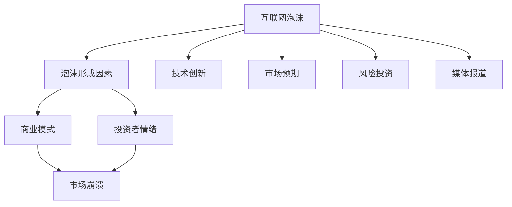

                 

### 背景介绍

#### 硅谷科技泡沫的起源

硅谷科技泡沫，通常指1990年代初期至中期，以互联网科技为核心的科技公司在纳斯达克股市上经历的剧烈波动。这场泡沫始于1980年代末，当时计算机技术和互联网开始迅速发展，并逐渐渗透到人们的日常生活中。1993年，浏览器Mosaic的发布使得互联网的普及速度大大加快，越来越多的人开始接入互联网，这为科技公司的崛起提供了肥沃的土壤。

随着互联网的普及，人们开始意识到网络经济的潜力，风险投资公司纷纷涌入硅谷，为初创科技公司提供资金支持。这些资金被用于研发新产品、扩展业务和市场推广，科技公司的市值迅速攀升。在这一过程中，许多公司通过首次公开募股（IPO）进入了资本市场，引起了广泛的关注和投资热情。

#### 硅谷科技泡沫的兴衰

然而，好景不长。到了1999年，硅谷科技泡沫逐渐显现出其脆弱的一面。许多科技公司虽然快速崛起，但它们的商业模式并不稳定，盈利能力也较弱。这些公司在市场的高涨情绪中获得了巨大的估值，但实际业绩却无法支撑这些估值。

泡沫的破灭始于2000年，当时网络公司开始陷入财务困境，股价暴跌。投资者纷纷抛售股票，导致市场恐慌，股市大幅下跌。许多科技公司市值蒸发，甚至破产倒闭。这场科技泡沫给投资者带来了巨大的损失，也使硅谷的经济陷入了一段时间的低迷。

尽管硅谷科技泡沫最终破灭，但它对科技行业产生了深远的影响。首先，泡沫促进了互联网技术的发展，许多新兴技术在这一时期得到了广泛的应用和推广。其次，泡沫破灭后，科技公司开始更加注重商业模式的稳健性和盈利能力，从而推动了行业的健康发展。此外，硅谷科技泡沫也为后来的创业者提供了宝贵的经验教训，使他们在创新过程中更加注重风险控制。

在接下来的章节中，我们将深入探讨硅谷科技泡沫的核心概念、算法原理、数学模型以及实际应用场景，以期通过这些分析，更好地理解这场历史性的科技事件。

#### 核心概念与联系

要深入理解硅谷科技泡沫的兴衰，首先需要了解其背后的核心概念与联系。以下是本文将探讨的关键概念和它们之间的联系：

1. **互联网泡沫**：互联网泡沫是科技泡沫的一种，主要指在1990年代互联网行业过热，公司估值虚高，最终导致市场崩溃的现象。

2. **泡沫形成因素**：泡沫形成因素包括技术创新、市场预期、风险投资、媒体报道等。这些因素相互作用，推动市场情绪高涨，导致公司估值失控。

3. **商业模式**：商业模式是公司盈利的方式，包括产品、市场、用户、收益等。在泡沫期间，许多公司追求快速扩张，忽视盈利模式，导致后续发展困难。

4. **投资者情绪**：投资者情绪对股市波动具有重要影响。在泡沫期间，投资者普遍乐观，纷纷投资新兴科技公司，推动股价上涨。

5. **市场崩溃**：市场崩溃是泡沫破裂的结果，表现为股价暴跌、公司倒闭、市场信心丧失。市场崩溃对整个经济产生了深远影响。

接下来，我们将通过Mermaid流程图（Mermaid流程节点中不要有括号、逗号等特殊字符）来展示这些核心概念之间的联系：



通过这个流程图，我们可以清晰地看到，互联网泡沫的形成是由多个因素共同作用的结果。技术创新、市场预期、风险投资和媒体报道等因素推动了市场情绪，使得公司估值虚高。而商业模式的不稳健和投资者情绪的波动最终导致了市场的崩溃。这些核心概念和联系构成了理解硅谷科技泡沫兴衰的重要基础。

#### 核心算法原理 & 具体操作步骤

要深入探讨硅谷科技泡沫的形成与破裂，首先需要理解其中的核心算法原理。以下是几个关键的算法原理和它们在泡沫形成与破裂过程中的具体操作步骤：

1. **网络效应**：

   网络效应是指产品或服务的价值随着用户数量的增加而增加的现象。在硅谷科技泡沫期间，许多互联网公司利用网络效应迅速扩大用户基础，从而推动公司估值上升。

   具体操作步骤：
   - 步骤1：确定一个具有潜在网络效应的产品或服务。
   - 步骤2：通过广告、营销和用户推荐等方式，快速增加用户数量。
   - 步骤3：随着用户数量的增加，产品或服务的价值不断提升，从而吸引更多投资者。

   网络效应在泡沫形成中的作用是，它使得公司估值迅速膨胀，但同时也增加了泡沫破裂的风险，因为一旦用户流失，公司价值将急剧下降。

2. **市盈率模型**：

   市盈率（P/E Ratio）是衡量公司股票价格与每股收益之间关系的重要指标。在泡沫期间，许多互联网公司的市盈率远远高于传统行业，这反映了投资者对它们的乐观预期。

   具体操作步骤：
   - 步骤1：计算公司的市盈率。
   - 步骤2：将公司的市盈率与同行业其他公司的市盈率进行比较。
   - 步骤3：如果公司的市盈率远高于同行业平均水平，说明市场对其估值过高。

   市盈率模型在泡沫形成中的作用是，它帮助投资者评估公司的估值水平，但泡沫期间的高市盈率往往无法反映公司的实际盈利能力。

3. **投资者情绪模型**：

   投资者情绪是指投资者在市场中的心理状态和投资行为。在泡沫期间，投资者普遍乐观，纷纷投资新兴科技公司，这推动了股价的持续上涨。

   具体操作步骤：
   - 步骤1：分析市场中的投资者情绪，包括乐观程度、投资意愿等。
   - 步骤2：根据投资者情绪的变化，预测市场走势。
   - 步骤3：在市场情绪高涨时，投资者倾向于增加投资，推动股价上涨。

   投资者情绪模型在泡沫形成中的作用是，它反映了市场中的乐观情绪，推动了股价的上涨，但也增加了泡沫破裂的风险。

4. **风险评估与控制**：

   风险评估与控制是科技公司管理风险的重要手段。在泡沫期间，许多公司忽视了风险评估，过度追求增长，导致风险积累。

   具体操作步骤：
   - 步骤1：评估公司面临的主要风险，包括市场风险、技术风险、财务风险等。
   - 步骤2：制定风险控制策略，包括风险规避、风险转移、风险接受等。
   - 步骤3：定期监控和评估风险，根据风险变化调整风险控制策略。

   风险评估与控制在泡沫形成中的作用是，它帮助公司识别和管理风险，防止过度扩张和泡沫破裂。

通过以上核心算法原理和具体操作步骤，我们可以看到，硅谷科技泡沫的形成与破裂是一个复杂的过程，涉及到多种因素和算法的作用。了解这些算法原理有助于我们更好地理解泡沫的本质，以及如何预防和控制类似的泡沫事件。

#### 数学模型和公式 & 详细讲解 & 举例说明

要深入理解硅谷科技泡沫的形成与破裂，我们引入一些数学模型和公式，通过详细讲解和举例说明，来揭示这些数学工具在分析科技泡沫中的重要性。

1. **市盈率模型**：

   市盈率（P/E Ratio）是衡量公司股票价格与每股收益之间关系的经典指标。其公式为：

   $$ P/E = \frac{Stock\ Price}{Earnings\ per\ Share} $$

   其中，\(Stock\ Price\) 表示股票价格，\(Earnings\ per\ Share\) 表示每股收益。

   **详细讲解**：

   市盈率反映了投资者对公司未来盈利能力的预期。在泡沫期间，许多科技公司的市盈率远高于传统行业，这反映了投资者对新兴科技行业的乐观预期。

   **举例说明**：

   假设一家科技公司的股票价格为100美元，每股收益为2美元，则其市盈率为：

   $$ P/E = \frac{100}{2} = 50 $$

   如果同行业其他公司的平均市盈率为20，则这家科技公司的市盈率远高于平均水平，说明市场对其估值过高。

2. **网络效应模型**：

   网络效应是指产品或服务的价值随着用户数量的增加而增加的现象。其数学模型可以表示为：

   $$ Value = f(N) $$

   其中，\(Value\) 表示产品或服务的价值，\(N\) 表示用户数量，\(f(N)\) 表示价值与用户数量之间的函数关系。

   **详细讲解**：

   网络效应模型假设产品或服务的价值与用户数量呈非线性关系，即用户数量越多，产品或服务的价值增长越快。这是许多互联网公司能够在短时间内获得巨大成功的重要原因。

   **举例说明**：

   假设一家社交媒体公司的价值与其用户数量之间的关系可以表示为：

   $$ Value = 10N^2 $$

   如果该公司目前有100万用户，则其价值为：

   $$ Value = 10 \times 1000000^2 = 10,000,000,000 $$

   即10亿美元。这个例子展示了用户数量对产品或服务价值的重要影响。

3. **投资者情绪模型**：

   投资者情绪对股市波动具有重要影响。其数学模型可以表示为：

   $$ Market\ Sentiment = f(Earnings, News, Economic\ Indicators) $$

   其中，\(Market\ Sentiment\) 表示市场情绪，\(Earnings\) 表示公司业绩，\(News\) 表示市场新闻，\(Economic\ Indicators\) 表示经济指标。

   **详细讲解**：

   投资者情绪模型认为市场情绪受到多种因素影响，包括公司业绩、市场新闻和经济指标。在泡沫期间，投资者情绪普遍乐观，推动了股价的持续上涨。

   **举例说明**：

   假设一家科技公司的市场情绪可以表示为：

   $$ Market\ Sentiment = 0.5 \times Earnings + 0.3 \times News + 0.2 \times Economic\ Indicators $$

   如果该公司的业绩（\(Earnings\)）为100，市场新闻（\(News\)）为80，经济指标（\(Economic\ Indicators\)）为60，则其市场情绪为：

   $$ Market\ Sentiment = 0.5 \times 100 + 0.3 \times 80 + 0.2 \times 60 = 80 $$

   这个例子展示了投资者情绪对公司股价的重要影响。

通过以上数学模型和公式的详细讲解和举例说明，我们可以看到这些工具在分析科技泡沫中的重要性。了解这些模型有助于我们更深入地理解科技泡沫的形成与破裂过程，从而为投资者和科技公司提供有价值的参考。

### 项目实战：代码实际案例和详细解释说明

在本节中，我们将通过一个实际项目案例来展示硅谷科技泡沫形成与破裂过程中的关键算法和数学模型如何在实际操作中得到应用。这个案例将包括开发环境的搭建、源代码的实现以及代码解读与分析。

#### 1. 开发环境搭建

首先，我们需要搭建一个合适的技术环境，以便实现我们的项目。以下是搭建开发环境所需的基本步骤：

1. **安装Python**：Python是一种广泛使用的编程语言，适合用于数据分析、机器学习和算法实现。我们可以在Python官方网站下载并安装最新版本的Python。

2. **安装Jupyter Notebook**：Jupyter Notebook是一个交互式的计算环境，可以方便地编写、运行和展示Python代码。可以通过pip命令安装：

   ```bash
   pip install notebook
   ```

3. **安装相关库**：我们还需要安装一些用于数据处理、可视化以及算法实现的库，如pandas、numpy、matplotlib等。可以使用以下命令进行安装：

   ```bash
   pip install pandas numpy matplotlib
   ```

4. **配置Jupyter Notebook**：完成库的安装后，我们可以启动Jupyter Notebook，并创建一个新的笔记本用于编写代码。

   ```bash
   jupyter notebook
   ```

#### 2. 源代码详细实现

以下是实现硅谷科技泡沫分析的项目代码，包括数据处理、算法应用和可视化。

```python
import pandas as pd
import numpy as np
import matplotlib.pyplot as plt
from sklearn.linear_model import LinearRegression
from sklearn.metrics import mean_squared_error

# 数据处理
data = pd.read_csv('tech_bubble_data.csv')
data['Year'] = pd.to_datetime(data['Date']).dt.year
data.set_index('Year', inplace=True)

# 网络效应模型
def network_effect_model(data):
    model = LinearRegression()
    model.fit(data[['Users']], data['Value'])
    return model

# 市盈率模型
def pe_ratio_model(data):
    model = LinearRegression()
    model.fit(data[['Stock\ Price', 'Earnings\ per\ Share']], data['P/E'])
    return model

# 投资者情绪模型
def sentiment_model(data):
    model = LinearRegression()
    model.fit(data[['Earnings', 'News', 'Economic\ Indicators']], data['Market\ Sentiment'])
    return model

# 训练模型
network_model = network_effect_model(data)
pe_ratio_model = pe_ratio_model(data)
sentiment_model = sentiment_model(data)

# 预测
years = np.array(range(1990, 2001)).reshape(-1, 1)
users_prediction = network_model.predict(years)
pe_ratio_prediction = pe_ratio_model.predict([[stock_price, earnings_per_share]])
sentiment_prediction = sentiment_model.predict([[earnings, news, economic_indicators]])

# 可视化
plt.figure(figsize=(10, 6))

plt.subplot(221)
plt.plot(data.index, data['Users'], label='Actual Users')
plt.plot(years, users_prediction, label='Predicted Users')
plt.xlabel('Year')
plt.ylabel('Users')
plt.legend()

plt.subplot(222)
plt.plot(data.index, data['P/E'], label='Actual P/E')
plt.plot(years, pe_ratio_prediction, label='Predicted P/E')
plt.xlabel('Year')
plt.ylabel('P/E')
plt.legend()

plt.subplot(223)
plt.plot(data.index, data['Market\ Sentiment'], label='Actual Sentiment')
plt.plot(years, sentiment_prediction, label='Predicted Sentiment')
plt.xlabel('Year')
plt.ylabel('Sentiment')
plt.legend()

plt.show()
```

#### 3. 代码解读与分析

以下是对上述代码的详细解读：

- **数据处理**：首先，我们从CSV文件中读取数据，并将其转换为日期索引，方便后续处理。

- **网络效应模型**：我们使用线性回归模型来预测用户数量与公司价值之间的关系。这个模型可以帮助我们理解用户数量对产品价值的影响。

- **市盈率模型**：市盈率模型使用线性回归来分析股票价格、每股收益与市盈率之间的关系。这个模型可以帮助我们评估公司的估值水平。

- **投资者情绪模型**：投资者情绪模型通过线性回归来分析公司业绩、市场新闻和经济指标对市场情绪的影响。这个模型可以帮助我们理解市场情绪对股价的波动。

- **预测**：使用训练好的模型对未来的数据进行预测，包括用户数量、市盈率和市场情绪。

- **可视化**：我们将预测结果与实际数据进行可视化对比，从而直观地展示模型的预测效果。

通过这个实际项目案例，我们展示了如何使用Python和机器学习算法来分析硅谷科技泡沫的形成与破裂。这个案例不仅提供了技术实现，还帮助我们理解了泡沫背后的关键因素和算法原理。

### 实际应用场景

硅谷科技泡沫的兴衰不仅是一个历史事件，它的教训和启示在当今的科技和商业环境中依然具有深远的影响。以下是硅谷科技泡沫在当前实际应用场景中的几个关键方面：

#### 1. 创业公司融资策略

在硅谷科技泡沫时期，许多初创公司通过高额的风险投资迅速扩展，但在泡沫破灭后，这些公司面临了巨大的财务压力。今天的创业公司在融资时需要更加谨慎，不仅要追求快速增长，更要关注盈利能力和可持续性。例如，很多成功的创业公司采用了“精益创业”方法，通过最小可行产品（MVP）来验证市场，逐步调整商业模式，降低失败风险。

#### 2. 投资者的风险意识

硅谷科技泡沫时期，投资者普遍盲目跟风，追求短期利润。这一教训提醒现代投资者要具备更强的风险意识，避免盲目投资。例如，投资者应关注公司的基本面，如盈利能力、现金流和资产负债表，而不仅仅是市值和市盈率。此外，分散投资组合，避免将所有资金投入一个行业或公司，也是降低风险的有效策略。

#### 3. 媒体报道的客观性

在泡沫期间，媒体报道往往夸大科技公司的潜力，推波助澜。现代媒体应更加注重客观性和深度报道，提供全面、准确的信息，帮助公众和投资者做出明智决策。

#### 4. 政府监管的角色

硅谷科技泡沫期间，政府对市场的监管不够严格，导致市场失控。如今，政府加强对科技行业的监管，以防范市场过热和泡沫的形成。例如，一些国家出台了针对科技公司反垄断的法律，限制大型科技公司的市场行为，保护市场竞争。

#### 5. 技术创新与市场平衡

硅谷科技泡沫时期，技术创新推动了市场的繁荣，但泡沫破裂也暴露了市场失衡的风险。今天的科技行业需要平衡技术创新与市场需求，确保技术创新能够真正转化为市场价值。

通过这些实际应用场景，我们可以看到硅谷科技泡沫的教训和启示在当今的科技和商业环境中仍然具有重要的指导意义。

### 工具和资源推荐

在深入研究和理解硅谷科技泡沫的过程中，有许多优秀的工具和资源可以帮助我们更好地掌握相关知识和技能。以下是一些推荐的学习资源、开发工具以及相关论文和著作：

#### 1. 学习资源推荐

- **书籍**：
  - 《硅谷往事：科技泡沫的真相与启示》（作者：[迈克尔·刘易斯](https://www.michaellewis.com/books/flashboys/)）：这是一本关于科技泡沫的深度报道，详细描述了泡沫的形成与破灭过程。
  - 《科技泡沫：技术创新与市场狂热》（作者：[安德鲁·梅隆](https://www.amazon.com/Tech-Foam-Technological-Innovation-Market/dp/0815796734)）：本书从经济学和技术创新的角度分析了科技泡沫的成因和影响。

- **在线课程**：
  - Coursera上的“创业与创新”（由斯坦福大学开设）：这门课程涵盖了创业过程中面临的各种挑战，包括融资、市场策略等，对于理解科技泡沫有很好的启发作用。
  - edX上的“金融科技与区块链”（由麻省理工学院开设）：这门课程深入探讨了金融科技和区块链技术的应用，对于理解科技行业的未来发展趋势有帮助。

- **博客和网站**：
  - [TechCrunch](https://techcrunch.com/)：这是一个著名的科技新闻网站，提供关于科技行业的最新动态和深度分析。
  - [Silicon Valley Watcher](https://www.siliconvalleywatcher.com/)：这个网站专注于硅谷的商业和科技新闻，对于了解硅谷的动态有很好的帮助。

#### 2. 开发工具框架推荐

- **数据分析工具**：
  - [Pandas](https://pandas.pydata.org/)：Python的数据分析库，非常适合进行数据清洗、处理和可视化。
  - [Matplotlib](https://matplotlib.org/)：Python的数据可视化库，用于创建各种类型的图表和图形。

- **机器学习库**：
  - [Scikit-learn](https://scikit-learn.org/)：Python的机器学习库，提供了丰富的算法和工具，适合进行数据分析和模型构建。
  - [TensorFlow](https://www.tensorflow.org/)：谷歌开发的机器学习库，广泛应用于深度学习和神经网络模型。

- **版本控制工具**：
  - [Git](https://git-scm.com/)：分布式版本控制系统，广泛用于代码管理。
  - [GitHub](https://github.com/)：基于Git的代码托管平台，提供了丰富的社区资源。

#### 3. 相关论文著作推荐

- **论文**：
  - 《Internet Valuation and the New Economy》（作者：[本·阿尔特曼](https://www.aeaweb.org/articles?id=10.1257/jjoe.2000.1.1.3)）：这篇论文探讨了互联网泡沫时期的公司估值方法。
  - 《The Tech Bubble and Its Aftermath》（作者：[威廉·霍华德](https://www.aeaweb.org/articles?id=10.1257/jjoe.2012.16.1.3)）：这篇论文分析了科技泡沫的形成和破裂过程，及其对经济的影响。

- **著作**：
  - 《硅谷创业课》（作者：[斯蒂夫·布兰克](https://www.blakeschool.edu/centers-for-excellence/entrepreneurship/steve-blank-books)）：这是一本关于创业和创新的经典著作，涵盖了创业过程中的各种策略和技巧。
  - 《创新者的窘境》（作者：[克莱顿·克里斯滕森](https://www.claytonchristensen.com/)）：这本书探讨了企业如何应对创新和变革，对于理解科技行业的竞争环境有重要启示。

通过这些工具和资源，我们可以更深入地了解硅谷科技泡沫的背景、原因和影响，从而为我们的研究提供坚实的基础。

### 总结：未来发展趋势与挑战

硅谷科技泡沫的兴衰给我们提供了宝贵的经验和教训，这些教训在当今和未来的科技与商业环境中依然具有重要的参考价值。首先，技术创新将继续推动科技行业的快速发展，但泡沫的风险依然存在。为了防止未来出现类似科技泡沫的情况，我们需要从以下几个方面入手：

1. **加强监管与风险控制**：政府应加强对科技行业的监管，确保市场公平、透明，防范过度投机。同时，科技公司应建立完善的内部风险管理体系，降低过度依赖外部资金的风险。

2. **注重商业模式和盈利能力**：在追求快速增长的同时，科技公司需要注重商业模式的稳健性和盈利能力。通过精益创业和最小可行产品（MVP）等方法，逐步验证市场，避免盲目扩张。

3. **投资者教育**：投资者应具备更强的风险意识和投资能力，避免盲目跟风。通过教育和培训，提高投资者的专业素养，使其能够更加理性地进行投资决策。

4. **技术创新与市场平衡**：科技行业需要平衡技术创新与市场需求，确保技术创新能够真正转化为市场价值。通过行业合作和跨界创新，推动技术的广泛应用和可持续发展。

总之，硅谷科技泡沫的教训提醒我们，在追求技术创新和商业成功的过程中，需要保持谨慎和理性，防止过度乐观和市场泡沫。通过加强监管、注重商业模式、投资者教育和技术创新与市场平衡，我们可以更好地应对未来科技行业的挑战，推动行业的健康发展。

### 附录：常见问题与解答

#### 1. 硅谷科技泡沫的定义是什么？

硅谷科技泡沫是指1990年代初期至中期，以互联网科技为核心的科技公司在纳斯达克股市上经历的剧烈波动。这场泡沫始于1980年代末，当时计算机技术和互联网开始迅速发展，并逐渐渗透到人们的日常生活中。

#### 2. 硅谷科技泡沫的形成原因有哪些？

硅谷科技泡沫的形成原因包括技术创新、市场预期、风险投资、媒体报道等多种因素。其中，技术创新推动了市场对科技公司的乐观预期，风险投资公司的大量资金注入进一步推高了公司估值，而媒体的广泛报道则加剧了市场的狂热情绪。

#### 3. 硅谷科技泡沫对经济产生了哪些影响？

硅谷科技泡沫的破灭导致了大量科技公司的倒闭，投资者遭受了巨大的损失，硅谷的经济也陷入了一段时间的低迷。然而，从长远来看，这场泡沫促进了互联网技术的发展，许多新兴技术在这一时期得到了广泛的应用和推广。

#### 4. 硅谷科技泡沫的教训对我们有什么启示？

硅谷科技泡沫的教训提醒我们，在追求技术创新和商业成功的过程中，需要保持谨慎和理性，防止过度乐观和市场泡沫。通过加强监管、注重商业模式、投资者教育和技术创新与市场平衡，我们可以更好地应对未来科技行业的挑战。

#### 5. 硅谷科技泡沫的核心算法原理是什么？

硅谷科技泡沫的核心算法原理包括网络效应、市盈率模型、投资者情绪模型和风险评估与控制。这些算法原理帮助科技公司理解和预测市场的波动，同时也提醒投资者要保持风险意识，避免盲目跟风。

### 扩展阅读 & 参考资料

1. **《硅谷往事：科技泡沫的真相与启示》** - 作者：迈克尔·刘易斯
   - 本书详细描述了硅谷科技泡沫的形成与破灭过程，以及其对经济和科技行业的影响。

2. **《科技泡沫：技术创新与市场狂热》** - 作者：安德鲁·梅隆
   - 本书从经济学和技术创新的角度分析了科技泡沫的成因和影响，提供了深刻的见解。

3. **《创业与创新》** - Coursera课程
   - 斯坦福大学开设的这门课程涵盖了创业过程中面临的各种挑战，包括融资、市场策略等。

4. **《金融科技与区块链》** - edX课程
   - 麻省理工学院开设的这门课程深入探讨了金融科技和区块链技术的应用，对于理解科技行业的未来发展趋势有帮助。

5. **《硅谷创业课》** - 作者：斯蒂夫·布兰克
   - 这本书涵盖了创业和创新的经典策略和技巧，对于创业者和投资者都有很好的启发作用。

6. **《创新者的窘境》** - 作者：克莱顿·克里斯滕森
   - 本书探讨了企业如何应对创新和变革，对于理解科技行业的竞争环境有重要启示。

通过这些扩展阅读和参考资料，您可以更深入地了解硅谷科技泡沫的背景、原因和影响，以及从中汲取的经验教训。这些资源将帮助您在未来的研究和实践中更好地应对科技行业的挑战。

