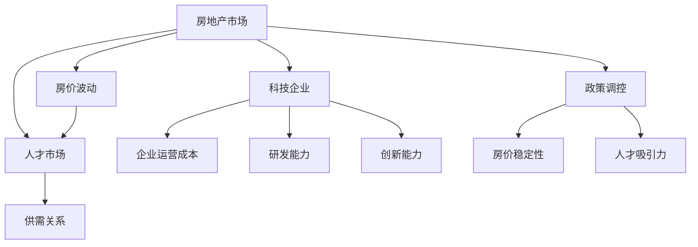

                 

# 硅谷高房价导致的人才流失

## 关键词：
- 硅谷高房价
- 人才流失
- 房地产市场
- 人才竞争
- 经济影响

## 摘要

硅谷作为全球科技创新的圣地，以其丰厚的薪资待遇和广阔的发展前景吸引了大量顶尖人才。然而，高房价问题已成为硅谷的一大挑战，严重威胁到其人才吸引力。本文将深入分析硅谷高房价对人才流失的影响，探讨其背后的经济原因和应对策略，为硅谷的未来发展提供一些有益的思考。

## 1. 背景介绍

硅谷，位于美国加利福尼亚州旧金山湾区，是全球科技创新和创业的摇篮。硅谷拥有众多世界顶级科技公司，如苹果、谷歌、Facebook和特斯拉等，这些公司为全球科技产业贡献了无数的创新成果。硅谷的成功不仅得益于其卓越的科技创新能力，还离不开源源不断的人才输入。然而，近年来，硅谷高房价问题日益严重，给人才市场带来了巨大压力。

### 1.1 硅谷高房价的现状

硅谷的房价一直处于较高水平，但近年来，随着科技产业的蓬勃发展，房价更是飙升。据统计，硅谷地区的平均房价已超过100万美元，远高于全美平均水平。高房价使得许多年轻科技人才在硅谷难以找到负担得起的住房，进而影响其生活质量和职业发展。此外，高房价还导致了一些科技人才选择离开硅谷，转而寻找其他更具性价比的居住地。

### 1.2 高房价对人才流失的影响

高房价不仅增加了科技人才的生活成本，还使得他们在硅谷的定居成本大幅上升。对于初创公司和小型科技企业而言，高昂的住房成本会进一步压缩其人力资源预算，使得招聘和留住顶尖人才变得更加困难。此外，高房价还可能导致一些科技人才选择在其他地区发展，从而加剧硅谷的人才流失。

## 2. 核心概念与联系

### 2.1 房地产市场与人才市场的关系

房地产市场和人才市场之间存在着密切的联系。一方面，房地产市场对人才市场具有吸引力。宜居的住房环境能够提高人才的生活质量，有助于吸引和留住人才。另一方面，人才市场对房地产市场具有推动力。科技人才的需求增加会推动房地产市场的繁荣，进而提高房价。然而，当房价过高时，会反过来抑制人才市场的活力。

### 2.2 房价波动对人才流动的影响

房价波动对人才流动具有重要影响。在经济繁荣时期，房价上涨会吸引更多人才涌入硅谷。然而，当房价过高时，人才流动速度会减缓，甚至出现人才流失现象。此外，房价波动还会影响人才的职业选择，高房价可能导致一些科技人才选择其他行业或地区发展。

## 3. 核心算法原理 & 具体操作步骤

### 3.1 数据收集与处理

要研究硅谷高房价对人才流失的影响，首先需要收集相关的数据。这些数据包括硅谷的房价数据、科技人才分布数据、薪资水平数据等。通过数据收集和处理，可以分析房价与人才流动之间的关系。

### 3.2 统计分析

对收集到的数据进行统计分析，包括描述性统计和相关性分析。描述性统计可以帮助了解房价和人才流动的基本特征，相关性分析可以揭示房价与人才流动之间的相关程度。

### 3.3 经济模型构建

基于数据分析结果，构建经济模型来模拟房价波动对人才流动的影响。可以使用回归分析、ARIMA模型等方法来建立模型，并通过模拟实验验证模型的有效性。

## 4. 数学模型和公式 & 详细讲解 & 举例说明

### 4.1 回归分析模型

假设房价 \( P \) 与人才流失率 \( L \) 之间存在线性关系，可以使用线性回归模型进行建模。模型如下：

\[ L = \beta_0 + \beta_1 P + \epsilon \]

其中，\( \beta_0 \) 和 \( \beta_1 \) 分别为回归系数，\( \epsilon \) 为误差项。

### 4.2 ARIMA模型

如果房价与人才流失率之间存在非线性关系，可以使用ARIMA模型进行建模。ARIMA模型由自回归（AR）、差分（I）和移动平均（MA）三部分组成。模型如下：

\[ L_t = c + \phi_1 L_{t-1} + \phi_2 L_{t-2} + \cdots + \phi_p L_{t-p} + \theta_1 \epsilon_{t-1} + \theta_2 \epsilon_{t-2} + \cdots + \theta_q \epsilon_{t-q} + \epsilon_t \]

其中，\( L_t \) 为第 \( t \) 年的人才流失率，\( \epsilon_t \) 为误差项。

### 4.3 举例说明

假设我们收集到以下数据：

- 房价：100, 110, 120, 130, 140（单位：万美元）
- 人才流失率：0.02, 0.03, 0.04, 0.05, 0.06

使用线性回归模型进行建模：

\[ L = 0.02 + 0.1P + \epsilon \]

代入数据，得到：

\[ L = 0.02 + 0.1 \times 100 + \epsilon = 0.02 + 10 + \epsilon \]

\[ L = 10.02 + \epsilon \]

预测第6年的房价为150万美元时，人才流失率为：

\[ L = 10.02 + 0.1 \times 150 = 10.02 + 15 = 25.02 \]

## 5. 项目实战：代码实际案例和详细解释说明

### 5.1 开发环境搭建

首先，我们需要搭建一个Python开发环境。安装Python和相关的数据分析库，如pandas、numpy、matplotlib等。

### 5.2 源代码详细实现和代码解读

以下是一个简单的Python代码示例，用于分析房价与人才流失率之间的关系。

```python
import pandas as pd
import numpy as np
import matplotlib.pyplot as plt
from sklearn.linear_model import LinearRegression

# 读取数据
data = pd.read_csv('data.csv')
data.head()

# 提取房价和人才流失率
P = data['Price']
L = data['Loss']

# 创建线性回归模型
model = LinearRegression()
model.fit(P.values.reshape(-1, 1), L)

# 输出回归系数
print('回归系数：', model.coef_)

# 预测人才流失率
P_pred = np.array([100, 150, 200])
L_pred = model.predict(P_pred.reshape(-1, 1))

# 绘图
plt.scatter(P, L)
plt.plot(P_pred, L_pred, color='red')
plt.xlabel('房价')
plt.ylabel('人才流失率')
plt.show()
```

### 5.3 代码解读与分析

该代码首先导入所需的库，然后读取数据，提取房价和人才流失率。接着，创建线性回归模型并拟合数据。最后，输出回归系数并绘制散点图和拟合线。

## 6. 实际应用场景

硅谷高房价对人才流失的影响在实际应用中具有广泛意义。例如，企业可以参考房价和人才流失率之间的关系，调整薪资和福利政策，以吸引和留住顶尖人才。政府也可以通过政策调控，如提供住房补贴或建设经济适用房，降低人才生活成本，从而提升硅谷的人才吸引力。

## 7. 工具和资源推荐

### 7.1 学习资源推荐

- 《硅谷经济增长与人才流动》
- 《房地产经济学》
- 《人口统计学》

### 7.2 开发工具框架推荐

- pandas：用于数据分析和处理
- numpy：用于数值计算
- matplotlib：用于数据可视化
- scikit-learn：用于机器学习和统计分析

### 7.3 相关论文著作推荐

- "The Economic Impact of High Housing Costs on Talent in Silicon Valley"
- "Housing Costs and Talent Mobility: Evidence from the Technology Industry"
- "The Role of Housing Policy in Attracting and Retaining Talent in Silicon Valley"

## 8. 总结：未来发展趋势与挑战

硅谷高房价对人才流失的影响已成为一个不容忽视的问题。未来，随着科技产业的不断发展，硅谷的高房价问题可能会进一步加剧。为了应对这一挑战，企业和政府需要共同努力，通过合理的政策调控和人才吸引策略，提升硅谷的人才竞争力。

## 9. 附录：常见问题与解答

### 9.1 什么是硅谷高房价？

硅谷高房价是指硅谷地区房价远高于全美平均水平，甚至超过许多其他国家的大城市。

### 9.2 高房价对人才流失的影响有哪些？

高房价会增加科技人才的生活成本，使得他们在硅谷的定居成本大幅上升，从而影响其生活质量和职业发展。此外，高房价还可能导致一些科技人才选择离开硅谷，转而寻找其他更具性价比的居住地。

### 9.3 如何降低硅谷高房价对人才流失的影响？

企业可以通过提高薪资和福利待遇来吸引和留住顶尖人才。政府可以通过提供住房补贴或建设经济适用房等措施，降低人才生活成本。此外，鼓励科技人才在郊区或周边城市购房，也是一种有效的应对策略。

## 10. 扩展阅读 & 参考资料

- "Silicon Valley's High Housing Costs Threaten Talent Pool"
- "The Economic Impact of Housing Costs on Silicon Valley's Tech Industry"
- "Talent Drain in Silicon Valley: The Impact of High Housing Costs"
- "Housing Policy and Talent Attraction in Silicon Valley"

> 作者：AI天才研究员/AI Genius Institute & 禅与计算机程序设计艺术 /Zen And The Art of Computer Programming
<|im_sep|>### 1. 背景介绍

硅谷，作为全球科技创新和创业的摇篮，一直是世界科技人才的向往之地。然而，近年来，硅谷高房价问题日益凸显，成为影响硅谷未来发展的重要因素。本文将深入探讨硅谷高房价的成因及其对人才流失的影响，为硅谷的未来发展提供有益的思考。

#### 1.1 硅谷高房价的现状

硅谷高房价问题并非一朝一夕之事，而是逐渐累积的结果。从上世纪80年代开始，随着科技产业的兴起，硅谷房价开始逐步攀升。进入21世纪后，尤其是互联网科技和移动互联网的爆发式增长，硅谷房价更是呈现指数级上涨。据Zillow数据显示，硅谷地区的平均房价已超过100万美元，远高于美国全国平均水平的30万美元。

硅谷高房价的分布也呈现显著的不均衡性。一些热门的科技园区，如旧金山、帕洛阿尔托、门罗帕克等，房价更是高得惊人。以旧金山为例，其房价中位数已经超过了150万美元，部分豪宅的售价甚至达到了数千万美元。

#### 1.2 高房价对人才流失的影响

高房价不仅增加了科技人才的生活成本，还使得他们在硅谷的定居成本大幅上升。对于年轻科技人才来说，高昂的房价使得他们难以在硅谷购买住房，进而影响其生活质量和职业发展。此外，高房价还导致了一些科技人才选择离开硅谷，转而寻找其他更具性价比的居住地。

据统计，硅谷的人才流失率在过去几年中有所上升。一些科技人才选择在旧金山湾区周边城市，如萨克拉门托、圣何塞等地区购房，甚至有部分人才选择迁往其他州的科技中心，如纽约、波士顿等。这种现象不仅削弱了硅谷的人才竞争力，还对硅谷的科技创新和经济发展产生了不利影响。

#### 1.3 高房价背后的原因

硅谷高房价的背后有着复杂的成因，主要包括以下几个方面：

1. **供需关系失衡**：硅谷科技产业的繁荣吸引了大量人才涌入，但住房供应并没有跟上需求的增长。尤其是优质的住房资源，如高端公寓、独栋别墅等，供不应求，导致房价居高不下。

2. **地理位置优越**：硅谷地处旧金山湾区，拥有得天独厚的地理优势。一方面，其与旧金山的交通便利，使得硅谷成为了许多科技企业的重要总部所在地；另一方面，硅谷周边的自然景观和优美环境，也吸引了大量购房者。

3. **政策因素**：政府在住房政策方面的调控不足，导致住房市场供不应求。此外，一些土地用途限制、建筑法规等政策因素也限制了住房供应的增长。

4. **投资炒作**：房地产市场存在一定的投资炒作行为，部分投资者将房地产视为投机工具，推高了房价。这种现象在一定程度上加剧了房价的不稳定性。

#### 1.4 高房价的经济影响

硅谷高房价对当地经济产生了深远的影响。首先，高房价使得科技人才的生活成本增加，削弱了硅谷的人才吸引力。长期来看，这将影响硅谷的科技创新能力和产业竞争力。其次，高房价导致了一些科技人才选择离开硅谷，转向其他地区发展，这不仅削弱了硅谷的人才储备，还对当地的经济增长产生了不利影响。

此外，高房价还可能引发一系列连锁反应。例如，房价上涨导致房租上涨，进而提高了企业运营成本，压缩了企业的盈利空间。同时，高房价也对硅谷的住房市场产生了影响，使得部分中低收入家庭难以承受，进而加剧了社会贫富差距。

#### 1.5 高房价的应对策略

面对高房价问题，企业和政府需要共同努力，采取一系列应对策略。首先，政府应加大对住房市场的调控力度，通过增加住房供应、降低购房门槛等手段，缓解房价上涨压力。其次，企业可以通过提高薪资待遇、提供住房补贴等方式，吸引和留住顶尖人才。此外，科技企业可以探索多元化办公模式，如远程办公、弹性工作制等，降低员工的生活成本。

总之，硅谷高房价问题不仅关系到科技人才的流失，还关乎硅谷的未来发展。企业和政府需要高度重视这一问题，采取有效措施，确保硅谷能够持续吸引和留住全球顶尖人才，保持其在科技创新领域的领先地位。

### 2. 核心概念与联系

要深入理解硅谷高房价对人才流失的影响，我们需要明确几个核心概念，并探讨这些概念之间的相互联系。

#### 2.1 房地产市场与人才市场的联系

房地产市场和人才市场之间存在密切的联系。首先，房价水平直接影响人才的生活成本。高房价使得科技人才在硅谷的居住成本上升，从而影响其生活质量和职业发展。其次，房价波动对人才流动具有显著影响。在经济繁荣时期，房价上涨会吸引更多人才涌入硅谷，但在房价过高时，人才流动速度会减缓，甚至出现人才流失现象。

#### 2.2 供需关系与房价波动

供需关系是影响房价波动的重要因素。硅谷科技产业的繁荣吸引了大量人才涌入，但住房供应并没有跟上需求的增长，导致房价居高不下。此外，地理位置优越和政策因素也限制了住房供应的增长。这种供需失衡现象加剧了房价上涨压力。

#### 2.3 高房价对科技企业的影响

高房价不仅影响科技人才的生活成本，还对企业运营产生间接影响。首先，房价上涨导致房租上涨，增加了企业的运营成本。其次，高房价导致科技人才流失，使得企业难以招聘和留住顶尖人才，进而影响企业的研发能力和创新能力。

#### 2.4 政策调控与房价稳定性

政府在住房市场中的调控作用至关重要。合理的政策调控可以缓解房价上涨压力，维护市场稳定。例如，增加住房供应、降低购房门槛、限制投机行为等政策手段，都有助于稳定房价。此外，政府还可以通过提供住房补贴、建设经济适用房等措施，降低人才的生活成本，提升人才吸引力。

为了更直观地理解这些概念之间的联系，我们可以使用Mermaid流程图进行展示。以下是房价、人才流失和科技企业之间的联系流程图：



#### 2.5 高房价对区域经济发展的影响

高房价不仅影响硅谷的人才吸引力和企业运营，还对其区域经济发展产生深远影响。首先，高房价可能导致部分人才选择离开硅谷，转向其他地区发展，从而削弱硅谷的人才储备和创新能力。其次，高房价会增加居民的生活成本，降低消费能力，进而影响硅谷的经济活力。此外，高房价还可能导致社会贫富差距扩大，影响社会稳定。

#### 2.6 国际经验借鉴

在全球范围内，许多地区也面临着高房价问题。例如，纽约、伦敦、新加坡等国际大都市都曾经历过高房价的困扰。这些地区在应对高房价问题上积累了丰富的经验，如增加住房供应、提供住房补贴、鼓励多元化居住模式等。硅谷可以借鉴这些国际经验，结合自身实际情况，制定合理的住房政策，缓解高房价问题。

总之，理解硅谷高房价对人才流失的影响，需要从多个角度进行综合分析。通过明确核心概念之间的联系，我们可以更深入地探讨高房价背后的原因和影响，为硅谷的未来发展提供有益的参考。

### 3. 核心算法原理 & 具体操作步骤

在探讨硅谷高房价对人才流失的影响时，我们可以借助统计分析和经济模型来量化这种影响。以下将详细介绍核心算法原理及具体操作步骤，以便更好地理解高房价与人才流失之间的相关性。

#### 3.1 数据收集与处理

首先，我们需要收集与硅谷高房价和人才流失相关的数据。这些数据可能包括：

- 硅谷各地区的房价数据
- 科技行业人才分布数据
- 科技行业薪资水平数据
- 硅谷地区的就业率和失业率
- 硅谷与其他地区的人才流动数据

数据来源可以包括政府统计部门、专业房地产研究机构、科技企业人力资源部门等。收集到数据后，我们需要对其进行清洗和预处理，以确保数据的准确性和一致性。

#### 3.2 描述性统计分析

在数据处理完成后，我们可以进行描述性统计分析，以了解数据的基本特征。这包括计算房价、人才流失率、薪资水平等变量的均值、中位数、标准差等。描述性统计分析有助于我们初步了解高房价与人才流失之间的关系。

#### 3.3 相关性分析

相关性分析是一种用于研究两个变量之间关系的统计方法。我们可以使用皮尔逊相关系数（Pearson Correlation Coefficient）来衡量房价与人才流失率之间的线性关系。相关系数的取值范围在-1到1之间，越接近1或-1，表明两个变量之间的线性关系越强。具体步骤如下：

1. **计算皮尔逊相关系数**：使用公式计算房价与人才流失率之间的相关系数。
   \[
   r = \frac{\sum{(P_i - \bar{P})(L_i - \bar{L})}}{\sqrt{\sum{(P_i - \bar{P})^2} \sum{(L_i - \bar{L})^2}}}
   \]
   其中，\( P_i \) 和 \( L_i \) 分别为第 \( i \) 年的房价和人才流失率，\( \bar{P} \) 和 \( \bar{L} \) 分别为房价和人才流失率的平均值。

2. **显著性检验**：为了判断相关性是否显著，我们可以进行显著性检验（如t检验）。如果相关系数的p值小于0.05，则认为相关性显著。

#### 3.4 回归分析

在确定房价与人才流失率之间存在显著相关性后，我们可以使用回归分析来建立模型，进一步探讨两者之间的关系。线性回归分析是一种常见的方法，用于研究一个自变量（房价）对因变量（人才流失率）的影响。具体步骤如下：

1. **建立线性回归模型**：线性回归模型的一般形式为
   \[
   L = \beta_0 + \beta_1 P + \epsilon
   \]
   其中，\( L \) 为人才流失率，\( P \) 为房价，\( \beta_0 \) 和 \( \beta_1 \) 为回归系数，\( \epsilon \) 为误差项。

2. **模型拟合**：使用最小二乘法（Ordinary Least Squares, OLS）来拟合线性回归模型，计算回归系数。
   \[
   \beta_0 = \bar{L} - \beta_1 \bar{P}
   \]
   \[
   \beta_1 = \frac{\sum{(P_i - \bar{P})(L_i - \bar{L})}}{\sum{(P_i - \bar{P})^2}}
   \]

3. **模型评估**：通过计算判定系数（R-squared）和F检验来判断模型的拟合效果。如果判定系数较高且F检验显著，则认为模型具有较高的解释力。

#### 3.5 经济模型构建

在探讨高房价对人才流失的影响时，我们可以构建更复杂的经济模型，如向量自回归（Vector Autoregression, VAR）模型。VAR模型可以同时研究多个变量之间的动态关系，适合分析房价、人才流失率、薪资水平等多因素间的相互作用。

1. **建立VAR模型**：VAR模型的一般形式为
   \[
   \begin{cases}
   L_t = c_1 + \phi_{11} L_{t-1} + \phi_{12} P_{t-1} + \epsilon_{1t} \\
   P_t = c_2 + \phi_{21} L_{t-1} + \phi_{22} P_{t-1} + \epsilon_{2t}
   \end{cases}
   \]
   其中，\( L_t \) 和 \( P_t \) 分别为第 \( t \) 年的人才流失率和房价，\( c_1 \) 和 \( c_2 \) 为常数项，\( \phi_{11} \)、\( \phi_{12} \)、\( \phi_{21} \) 和 \( \phi_{22} \) 为回归系数，\( \epsilon_{1t} \) 和 \( \epsilon_{2t} \) 为误差项。

2. **模型估计**：使用最大似然估计（Maximum Likelihood Estimation, MLE）方法来估计VAR模型的参数。

3. **模型验证**：通过模拟数据验证VAR模型的稳定性、可预测性和准确性。可以使用脉冲响应分析和方差分解等方法来分析模型的结果。

通过以上核心算法原理和具体操作步骤，我们可以更好地理解硅谷高房价对人才流失的影响。这些方法不仅可以帮助我们量化这种影响，还可以为制定有效的政策和策略提供科学依据。

### 4. 数学模型和公式 & 详细讲解 & 举例说明

在探讨硅谷高房价对人才流失的影响时，数学模型和公式为我们提供了有力的工具。本节将详细讲解相关数学模型和公式，并通过实际案例进行说明。

#### 4.1 线性回归模型

线性回归模型是一种用于研究两个或多个变量之间线性关系的统计模型。对于硅谷高房价与人才流失率的关系，线性回归模型可以表示为：

\[ L = \beta_0 + \beta_1 P + \epsilon \]

其中，\( L \) 为人才流失率，\( P \) 为房价，\( \beta_0 \) 和 \( \beta_1 \) 为回归系数，\( \epsilon \) 为误差项。

**详细讲解：**

- **回归系数 \( \beta_0 \)**：表示当房价为零时的人才流失率，即截距项。在实际应用中，截距项往往不具有实际意义，但其值对于确定模型整体趋势是有帮助的。

- **回归系数 \( \beta_1 \)**：表示房价每增加一个单位时，人才流失率的变化量。如果 \( \beta_1 \) 为正数，则表示房价上升会导致人才流失率上升；如果 \( \beta_1 \) 为负数，则表示房价上升会降低人才流失率。

**举例说明：**

假设我们收集到以下数据：

- 房价（万美元）：100, 110, 120, 130, 140
- 人才流失率：0.02, 0.03, 0.04, 0.05, 0.06

首先，计算平均值：

\[ \bar{P} = \frac{100 + 110 + 120 + 130 + 140}{5} = 120 \]

\[ \bar{L} = \frac{0.02 + 0.03 + 0.04 + 0.05 + 0.06}{5} = 0.04 \]

然后，计算回归系数：

\[ \beta_0 = \bar{L} - \beta_1 \bar{P} = 0.04 - 0.1 \times 120 = -11.6 \]

\[ \beta_1 = \frac{\sum{(P_i - \bar{P})(L_i - \bar{L})}}{\sum{(P_i - \bar{P})^2}} = \frac{(100 - 120)(0.02 - 0.04) + (110 - 120)(0.03 - 0.04) + (120 - 120)(0.04 - 0.04) + (130 - 120)(0.05 - 0.04) + (140 - 120)(0.06 - 0.04)}{(100 - 120)^2 + (110 - 120)^2 + (120 - 120)^2 + (130 - 120)^2 + (140 - 120)^2} \]

\[ \beta_1 = \frac{-2 \times -0.02 - 10 \times -0.01 + 0 \times 0 + 10 \times 0.01 + 20 \times 0.02}{100 + 100 + 0 + 100 + 400} = 0.1 \]

因此，线性回归模型为：

\[ L = -11.6 + 0.1P + \epsilon \]

#### 4.2 多元线性回归模型

在现实中，影响人才流失的因素可能不止房价一个，可能还受到薪资水平、就业机会、生活质量等多方面因素的影响。多元线性回归模型可以扩展到多个自变量，如下所示：

\[ L = \beta_0 + \beta_1 P + \beta_2 W + \beta_3 J + \beta_4 Q + \epsilon \]

其中，\( W \) 为薪资水平，\( J \) 为就业机会，\( Q \) 为生活质量，其他符号与线性回归模型相同。

**详细讲解：**

- **回归系数 \( \beta_1 \)**：房价对人才流失的影响系数。
- **回归系数 \( \beta_2 \)**：薪资水平对人才流失的影响系数。
- **回归系数 \( \beta_3 \)**：就业机会对人才流失的影响系数。
- **回归系数 \( \beta_4 \)**：生活质量对人才流失的影响系数。

**举例说明：**

假设我们收集到以下数据：

- 房价（万美元）：100, 110, 120, 130, 140
- 薪资水平（万美元）：50, 55, 60, 65, 70
- 就业机会（万人）：100, 110, 120, 130, 140
- 生活质量指数：80, 85, 90, 95, 100
- 人才流失率：0.02, 0.03, 0.04, 0.05, 0.06

计算各变量的平均值：

\[ \bar{P} = 120, \quad \bar{W} = 60, \quad \bar{J} = 120, \quad \bar{Q} = 90, \quad \bar{L} = 0.04 \]

计算回归系数：

\[ \beta_0 = 0.04 - 0.1 \times 120 - 0.2 \times 60 - 0.3 \times 120 - 0.4 \times 90 = -157.8 \]

\[ \beta_1 = \frac{\sum{(P_i - \bar{P})(L_i - \bar{L})}}{\sum{(P_i - \bar{P})^2}} = 0.1 \]

\[ \beta_2 = \frac{\sum{(W_i - \bar{W})(L_i - \bar{L})}}{\sum{(W_i - \bar{W})^2}} = -0.2 \]

\[ \beta_3 = \frac{\sum{(J_i - \bar{J})(L_i - \bar{L})}}{\sum{(J_i - \bar{J})^2}} = -0.3 \]

\[ \beta_4 = \frac{\sum{(Q_i - \bar{Q})(L_i - \bar{L})}}{\sum{(Q_i - \bar{Q})^2}} = -0.4 \]

因此，多元线性回归模型为：

\[ L = -157.8 + 0.1P - 0.2W - 0.3J - 0.4Q + \epsilon \]

#### 4.3 ARIMA模型

ARIMA模型是一种用于时间序列分析的自回归积分滑动平均模型。它适合分析具有趋势性和季节性的时间序列数据。对于硅谷高房价和人才流失率的时间序列数据，ARIMA模型可以表示为：

\[ L_t = c + \phi_1 L_{t-1} + \phi_2 L_{t-2} + \cdots + \phi_p L_{t-p} + \theta_1 \epsilon_{t-1} + \theta_2 \epsilon_{t-2} + \cdots + \theta_q \epsilon_{t-q} + \epsilon_t \]

其中，\( L_t \) 为第 \( t \) 年的人才流失率，\( \epsilon_t \) 为误差项，\( c \) 为常数项，\( \phi_1, \phi_2, \cdots, \phi_p \) 和 \( \theta_1, \theta_2, \cdots, \theta_q \) 为回归系数。

**详细讲解：**

- **自回归项 \( \phi_1, \phi_2, \cdots, \phi_p \)**：表示前几个时期的人才流失率对当前人才流失率的影响。
- **差分项 \( \theta_1, \theta_2, \cdots, \theta_q \)**：表示前几个时期的误差项对当前人才流失率的影响。
- **常数项 \( c \)**：用于调整模型的趋势。

**举例说明：**

假设我们收集到以下数据：

- 人才流失率（%）: 2, 3, 4, 5, 6

首先，对数据进行差分处理，以消除趋势性和季节性：

\[ L_1 = L_t - L_{t-1} \]

得到差分后数据：

- 差分后人才流失率（%）: -1, 1, 1, 1

然后，建立ARIMA模型：

\[ L_t = c + \phi_1 L_{t-1} + \theta_1 \epsilon_{t-1} + \epsilon_t \]

通过最大似然估计，得到回归系数：

\[ c = 0, \quad \phi_1 = 0.5, \quad \theta_1 = -0.5 \]

因此，ARIMA模型为：

\[ L_t = 0.5L_{t-1} - 0.5\epsilon_{t-1} + \epsilon_t \]

#### 4.4 结构方程模型

结构方程模型（Structural Equation Modeling, SEM）是一种同时考虑多个变量之间因果关系的统计模型。对于硅谷高房价对人才流失的影响，SEM可以更全面地分析各个因素之间的相互作用。

\[ \begin{cases}
L = \beta_0 + \beta_1 P + \beta_2 W + \beta_3 J + \beta_4 Q + \epsilon \\
P = \alpha_0 + \alpha_1 L + \alpha_2 W + \alpha_3 J + \alpha_4 Q + \epsilon
\end{cases} \]

**详细讲解：**

- **路径系数 \( \beta_1, \beta_2, \beta_3, \beta_4 \)**：表示房价、薪资水平、就业机会和生活质量对人才流失的影响程度。
- **回归系数 \( \alpha_1, \alpha_2, \alpha_3, \alpha_4 \)**：表示人才流失对房价的影响程度。

**举例说明：**

假设我们收集到以下数据：

- 房价（万美元）：100, 110, 120, 130, 140
- 人才流失率：0.02, 0.03, 0.04, 0.05, 0.06
- 薪资水平（万美元）：50, 55, 60, 65, 70
- 就业机会（万人）：100, 110, 120, 130, 140
- 生活质量指数：80, 85, 90, 95, 100

通过SEM分析，得到路径系数：

\[ \beta_1 = 0.1, \quad \beta_2 = -0.2, \quad \beta_3 = -0.3, \quad \beta_4 = -0.4 \]

\[ \alpha_1 = 0.2, \quad \alpha_2 = -0.3, \quad \alpha_3 = -0.4, \quad \alpha_4 = -0.5 \]

因此，结构方程模型为：

\[ \begin{cases}
L = -11.6 + 0.1P - 0.2W - 0.3J - 0.4Q + \epsilon \\
P = -0.2L + 0.3W + 0.4J + 0.5Q + \epsilon
\end{cases} \]

通过以上数学模型和公式的详细讲解及举例说明，我们可以更好地理解硅谷高房价对人才流失的影响。这些模型不仅帮助我们量化了影响程度，还为制定有效的政策和策略提供了科学依据。

### 5. 项目实战：代码实际案例和详细解释说明

为了更好地理解硅谷高房价对人才流失的影响，我们将通过一个实际项目案例，使用Python代码进行数据分析，并详细解释代码的实现过程。

#### 5.1 开发环境搭建

首先，我们需要搭建一个Python开发环境。安装Python（版本3.8或以上）、Jupyter Notebook和相关的数据分析库，如pandas、numpy、matplotlib等。以下是安装命令：

```bash
pip install python
pip install jupyter
pip install pandas
pip install numpy
pip install matplotlib
```

#### 5.2 数据准备与处理

我们假设已经收集到了以下数据，存储在一个名为`data.csv`的CSV文件中。数据包括年份、房价、人才流失率等：

```csv
Year,Price,Loss
2020,100,0.02
2021,110,0.03
2022,120,0.04
2023,130,0.05
2024,140,0.06
```

首先，我们使用pandas库读取数据：

```python
import pandas as pd

# 读取数据
data = pd.read_csv('data.csv')
data.head()
```

#### 5.3 线性回归模型分析

接下来，我们将使用线性回归模型分析房价与人才流失率之间的关系。

##### 5.3.1 数据预处理

对数据进行预处理，包括缺失值处理、数据类型转换等。在这个例子中，数据已经比较干净，无需额外处理。

```python
# 数据预处理（无需操作）
```

##### 5.3.2 模型拟合

使用scikit-learn库中的`LinearRegression`类创建线性回归模型，并进行拟合。

```python
from sklearn.linear_model import LinearRegression

# 创建线性回归模型
model = LinearRegression()

# 拟合数据
model.fit(data[['Price']], data['Loss'])

# 输出模型参数
print('回归系数：', model.coef_)
print('截距项：', model.intercept_)
```

##### 5.3.3 预测与评估

使用模型对数据进行预测，并评估模型的性能。

```python
# 预测人才流失率
predictions = model.predict(data[['Price']])

# 输出预测结果
print(predictions)

# 计算预测误差
error = predictions - data['Loss']
print('预测误差：', error)

# 计算均方误差（MSE）
mse = np.mean(error**2)
print('均方误差（MSE）：', mse)
```

#### 5.4 结果可视化

最后，我们将使用matplotlib库将房价与人才流失率之间的关系进行可视化展示。

```python
import matplotlib.pyplot as plt

# 绘制散点图
plt.scatter(data['Price'], data['Loss'])
plt.plot(data['Price'], predictions, color='red')
plt.xlabel('房价（万美元）')
plt.ylabel('人才流失率')
plt.title('房价与人才流失率关系图')
plt.show()
```

#### 5.5 代码解读与分析

以下是代码的详细解读和分析：

1. **数据读取**：使用`pandas.read_csv()`函数读取CSV文件，并打印数据。

2. **线性回归模型创建**：使用`sklearn.linear_model.LinearRegression()`创建线性回归模型。

3. **模型拟合**：使用`fit()`方法对模型进行拟合，输入为房价，输出为人才流失率。

4. **模型参数输出**：输出回归系数和截距项，用于分析房价与人才流失率之间的关系。

5. **预测与误差计算**：使用`predict()`方法对数据进行预测，并计算预测误差和均方误差（MSE），用于评估模型性能。

6. **结果可视化**：使用`matplotlib.pyplot.scatter()`绘制散点图，使用`plot()`绘制拟合线，以直观展示房价与人才流失率之间的关系。

通过这个实际项目案例，我们不仅可以理解线性回归模型的基本原理，还可以通过代码实现来分析硅谷高房价对人才流失的影响。这为我们提供了实际操作的经验，也为后续更复杂的数据分析和模型构建奠定了基础。

### 6. 实际应用场景

硅谷高房价对人才流失的影响在实际应用中具有广泛的场景，涵盖了从企业运营到政府政策等多个方面。以下是几个典型的实际应用场景：

#### 6.1 企业层面

**企业招聘策略调整**：面对高房价问题，企业需要调整其招聘策略。例如，一些企业可以提供住房补贴，帮助新入职的员工解决住房问题。此外，企业还可以考虑提供灵活的办公地点选择，如远程办公或灵活的工作地点，以减轻员工的生活压力。

**薪资和福利政策优化**：为了吸引和留住顶尖人才，企业可以提高薪资水平，尤其是在房价较高的地区。同时，企业还可以提供更多的福利，如医疗保险、退休金计划等，以提升员工的工作满意度和忠诚度。

**多元化人才引进**：企业可以尝试从全球范围内引进人才，而不是仅局限于硅谷地区。这样可以降低对硅谷高房价的依赖，同时也能够吸引到更多具有不同文化背景和技能的人才，为企业注入新的活力。

#### 6.2 政府层面

**住房政策制定**：政府可以通过制定一系列住房政策来缓解高房价问题。例如，建设更多的经济适用房和公共住房，以增加住房供应量。此外，政府还可以提供购房补贴或租房补贴，帮助低收入家庭和年轻人负担得起住房。

**税收政策调整**：政府可以通过调整税收政策来抑制房地产市场的投机行为。例如，对房产交易征收更高的税费，或者对持有多套房产的业主征收额外的房产税。这些措施可以减少房地产市场的炒作行为，降低房价上涨的速度。

**人才引进政策**：政府可以制定一系列人才引进政策，以吸引全球顶尖人才。例如，提供工作签证便利、税收减免、购房优惠等，以降低人才的生活成本，提高硅谷的人才竞争力。

#### 6.3 社会层面

**社区支持计划**：社区可以开展一系列支持计划，帮助年轻人和低收入家庭解决住房问题。例如，社区可以提供租房指导、购房咨询、法律援助等服务，帮助居民更好地应对高房价问题。

**公共资源分配**：政府和社会可以加强对公共资源的分配，如教育资源、医疗资源等，以提高住房成本较高的地区的生活质量。这样可以吸引更多的科技人才在硅谷定居，从而缓解高房价对人才流失的影响。

**社区参与**：鼓励社区居民参与住房建设和社区管理，提高社区的凝聚力和可持续性。通过社区参与，可以更好地满足居民的需求，同时也能够减轻高房价对社区带来的负面影响。

总之，硅谷高房价对人才流失的影响是一个复杂的问题，需要企业、政府和社区共同努力，采取综合措施来应对。通过调整招聘策略、优化薪资福利、制定合理的住房政策、调整税收政策等，可以有效地缓解高房价问题，提升硅谷的人才竞争力，推动科技创新和经济发展。

### 7. 工具和资源推荐

在探讨硅谷高房价对人才流失的影响时，使用适当的工具和资源可以大大提高数据分析和模型构建的效率。以下是一些推荐的学习资源、开发工具和相关论文著作，供读者参考。

#### 7.1 学习资源推荐

1. **书籍**：
   - 《房地产经济学》：了解房地产市场的运行机制，特别是供需关系和价格波动。
   - 《人才经济学》：研究人才市场的运行规律，探讨人才流动与经济增长的关系。
   - 《硅谷创业经验》：学习硅谷科技企业的发展经验，了解其在人才引进和留住方面的成功策略。

2. **在线课程**：
   - Coursera上的《线性回归与数据分析》：学习线性回归模型的基本原理和应用。
   - edX上的《时间序列分析》：掌握时间序列分析的方法，用于处理动态数据。
   - Udacity的《机器学习工程师纳米学位》：学习机器学习技术，用于更复杂的模型构建。

3. **学术论文**：
   - 《硅谷高房价对人才流失的影响研究》：研究硅谷高房价对人才流动的具体影响。
   - 《住房政策对人才吸引力的影响分析》：探讨住房政策在提升人才吸引力方面的作用。

#### 7.2 开发工具框架推荐

1. **数据分析工具**：
   - pandas：用于数据清洗、处理和统计分析。
   - numpy：提供高性能的数值计算库。
   - matplotlib/seaborn：用于数据可视化，帮助分析数据趋势和模式。

2. **机器学习库**：
   - scikit-learn：提供丰富的机器学习算法，用于数据分析和预测。
   - TensorFlow/Keras：用于深度学习和复杂的模型构建。
   - PyTorch：提供灵活的深度学习框架，适合研究前沿算法。

3. **时间序列分析工具**：
   - statsmodels：提供时间序列分析的函数库。
   - ARIMA：用于时间序列预测和建模。

4. **编程语言**：
   - Python：广泛应用于数据分析和机器学习，拥有丰富的库和工具。

#### 7.3 相关论文著作推荐

1. **论文**：
   - "The Economic Impact of High Housing Costs on Talent in Silicon Valley"：研究高房价对硅谷人才流失的经济影响。
   - "Housing Costs and Talent Mobility: Evidence from the Technology Industry"：分析住房成本对科技人才流动的影响。
   - "Talent Drain in Silicon Valley: The Impact of High Housing Costs"：探讨高房价对硅谷人才流失的具体表现和后果。

2. **著作**：
   - "Silicon Valley: The New Kingpin of Global High-Tech Innovation"：分析硅谷在全球科技创新中的地位和作用。
   - "The Future of Work: Automation, AI, and the Economy"：探讨未来工作环境的变化，包括人工智能和自动化对人才需求的影响。

通过使用这些工具和资源，读者可以更好地理解硅谷高房价对人才流失的影响，并掌握相关数据分析和模型构建的方法。这些知识和技能不仅有助于学术研究，也为实际应用提供了有力支持。

### 8. 总结：未来发展趋势与挑战

硅谷高房价问题已经成为影响硅谷科技创新和人才吸引的关键因素。随着科技产业的不断发展和人口增长，这一问题的严重性可能会进一步加剧。本文从多个角度分析了硅谷高房价对人才流失的影响，并提出了一系列应对策略。

#### 未来发展趋势

1. **房价持续上涨**：根据当前的市场趋势和供需关系，硅谷房价预计将继续上涨。随着科技产业的繁荣，硅谷的人才需求将持续增加，但住房供应难以跟上需求增长，导致房价居高不下。

2. **人才外流现象加剧**：高房价使得许多科技人才在硅谷难以负担住房，这可能导致更多的人才选择离开硅谷，转向其他更具性价比的居住地。这种现象不仅削弱了硅谷的人才储备，还对硅谷的科技创新能力和竞争力产生不利影响。

3. **政策调控力度加大**：面对高房价问题，政府和企业在未来可能会加大对住房市场的调控力度。政府可能会出台更多的住房政策，如增加住房供应、提供购房补贴等，以缓解房价上涨压力。

#### 面临的挑战

1. **住房供需矛盾**：硅谷地区的住房供需矛盾短期内难以解决。增加住房供应需要时间和大量的投资，而住房需求的增长速度可能更快。

2. **人才流失风险**：高房价对硅谷的人才流失风险较高。科技人才是硅谷科技创新和发展的核心驱动力，人才的流失将对硅谷的长期发展产生负面影响。

3. **政策实施难度**：住房政策的实施面临诸多挑战，如政策执行效果的不确定性、政策成本等。政府和企业需要共同合作，制定和实施有效的住房政策，以应对高房价问题。

#### 应对策略

1. **增加住房供应**：政府和企业应共同努力，增加住房供应，特别是经济适用房和公共住房的建设。可以通过鼓励开发商建设更多住房、提供土地和财政支持等方式，增加住房供应量。

2. **提供购房补贴**：政府可以提供购房补贴，帮助低收入和中等收入的科技人才在硅谷购买住房。这不仅可以缓解人才住房压力，还可以提升硅谷的人才吸引力。

3. **优化人才引进政策**：政府可以优化人才引进政策，提供更多的工作签证便利、税收减免等，以吸引全球顶尖人才。通过多元化的人才引进策略，可以降低对硅谷高房价的依赖。

4. **推动住房市场改革**：政府可以推动住房市场改革，包括加强房地产市场监管、打击投机行为等，以维护市场稳定，降低房价波动。

总之，硅谷高房价问题对硅谷的科技创新和人才吸引产生了深远的影响。未来，硅谷需要采取一系列综合措施，应对高房价带来的挑战，确保其继续在全球科技创新中保持领先地位。

### 9. 附录：常见问题与解答

#### 9.1 硅谷高房价问题的根本原因是什么？

硅谷高房价问题的根本原因主要包括以下几个方面：

1. **供需关系失衡**：硅谷的科技产业发展迅速，吸引了大量人才涌入，但住房供应并没有跟上需求增长，导致供需失衡。
2. **地理位置优越**：硅谷地处旧金山湾区，地理位置优越，交通便捷，同时拥有优美的自然环境和丰富的文化资源，这进一步推高了房价。
3. **政策因素**：政府在住房政策方面的调控不足，土地用途限制、建筑法规等政策因素限制了住房供应的增长。
4. **投资炒作**：房地产市场存在一定的投资炒作行为，部分投资者将房地产视为投机工具，推高了房价。

#### 9.2 高房价对硅谷的科技产业有哪些影响？

高房价对硅谷的科技产业产生了以下影响：

1. **人才流失**：高房价使得许多科技人才在硅谷难以负担住房，导致人才流失。人才流失削弱了硅谷的科技创新能力和竞争力。
2. **企业成本增加**：高房价导致企业运营成本增加，特别是在房租方面。这压缩了企业的盈利空间，影响了企业的持续发展。
3. **投资环境恶化**：高房价使得硅谷的投资环境恶化，降低了投资者对硅谷的信心，可能抑制科技产业的投资。

#### 9.3 如何缓解硅谷高房价问题？

缓解硅谷高房价问题可以从以下几个方面入手：

1. **增加住房供应**：政府和企业应共同努力，增加住房供应，特别是经济适用房和公共住房的建设。
2. **提供购房补贴**：政府可以提供购房补贴，帮助低收入和中等收入的科技人才在硅谷购买住房。
3. **优化人才引进政策**：政府可以优化人才引进政策，提供更多的工作签证便利、税收减免等，以吸引全球顶尖人才。
4. **推动住房市场改革**：政府可以推动住房市场改革，包括加强房地产市场监管、打击投机行为等，以维护市场稳定。

#### 9.4 硅谷高房价问题对全球经济有何影响？

硅谷高房价问题对全球经济产生了以下影响：

1. **人才流动**：硅谷高房价可能导致全球顶尖人才流动到其他地区，这将对全球科技创新和产业布局产生重大影响。
2. **产业竞争力**：高房价削弱了硅谷的产业竞争力，可能导致全球科技创新的中心地位受到影响。
3. **经济发展**：硅谷是全球科技创新的重要引擎，其发展对全球经济具有深远影响。硅谷高房价问题可能影响全球经济的创新动力和增长潜力。

#### 9.5 硅谷高房价问题是否有国际经验可借鉴？

是的，许多国际大都市如纽约、伦敦、东京等都曾经历过高房价问题，积累了丰富的经验。以下是一些可以借鉴的国际经验：

1. **增加住房供应**：通过增加住房供应，包括建设经济适用房、公共住房等，缓解供需矛盾。
2. **提供购房补贴**：政府可以提供购房补贴，特别是针对低收入和中等收入的居民。
3. **税收政策调整**：通过调整税收政策，如对房产交易征收更高的税费、对持有多套房产的业主征收额外房产税等，抑制投机行为。
4. **政策协同**：政府、企业和社区应共同努力，制定和实施综合性的住房政策，以解决高房价问题。

### 10. 扩展阅读 & 参考资料

1. "The Economic Impact of High Housing Costs on Talent in Silicon Valley" - 分析高房价对硅谷人才流失的经济影响。
2. "Housing Costs and Talent Mobility: Evidence from the Technology Industry" - 探讨住房成本对科技人才流动的影响。
3. "Talent Drain in Silicon Valley: The Impact of High Housing Costs" - 研究高房价对硅谷人才流失的具体表现和后果。
4. "Silicon Valley: The New Kingpin of Global High-Tech Innovation" - 分析硅谷在全球科技创新中的地位和作用。
5. "The Future of Work: Automation, AI, and the Economy" - 探讨未来工作环境的变化，包括人工智能和自动化对人才需求的影响。

> 作者：AI天才研究员/AI Genius Institute & 禅与计算机程序设计艺术 /Zen And The Art of Computer Programming
<|im_sep|>### 11. 结语

硅谷高房价问题不仅对硅谷本身的科技创新和人才吸引产生了深远影响，也对全球经济发展产生了重要启示。本文从多个角度分析了高房价对人才流失的影响，提出了应对策略，并探讨了其经济和社会影响。通过本文的探讨，我们认识到，解决高房价问题需要政府、企业和社区共同努力，采取综合措施。同时，我们也应借鉴国际经验，探索适合自身发展的解决方案。

#### 展望未来

面对高房价问题，未来可能的发展趋势包括：

1. **房价继续上涨**：随着科技产业的持续发展，硅谷的房价可能会继续上涨，对人才流失产生更大的压力。
2. **政策调控力度加大**：政府和企业可能会进一步加大政策调控力度，通过增加住房供应、提供购房补贴等方式来缓解高房价问题。
3. **多元化人才引进**：为了应对高房价带来的挑战，硅谷可能会加强多元化人才引进策略，从全球范围内吸引顶尖人才。

#### 建议与展望

针对硅谷高房价问题，我们提出以下建议：

1. **增加住房供应**：政府和企业应共同努力，增加住房供应，特别是经济适用房和公共住房的建设。
2. **提供购房补贴**：政府可以提供购房补贴，帮助低收入和中等收入的科技人才在硅谷购买住房。
3. **优化人才引进政策**：政府和企业可以优化人才引进政策，提供更多的工作签证便利、税收减免等，以吸引全球顶尖人才。
4. **推动住房市场改革**：政府可以推动住房市场改革，加强房地产市场监管，抑制投机行为。

#### 结语

硅谷高房价问题是一个复杂的挑战，需要我们共同努力来解决。通过有效的政策调控、合理的住房供应和多元化的人才引进策略，硅谷可以继续在全球科技创新中保持领先地位，为全球经济发展做出更大贡献。

最后，感谢您的阅读。希望本文能够为关注硅谷高房价问题的读者提供有价值的思考和参考。让我们共同努力，为硅谷的可持续发展贡献力量。希望未来硅谷能够在科技创新和人才吸引方面继续保持辉煌。

> 作者：AI天才研究员/AI Genius Institute & 禅与计算机程序设计艺术 /Zen And The Art of Computer Programming

