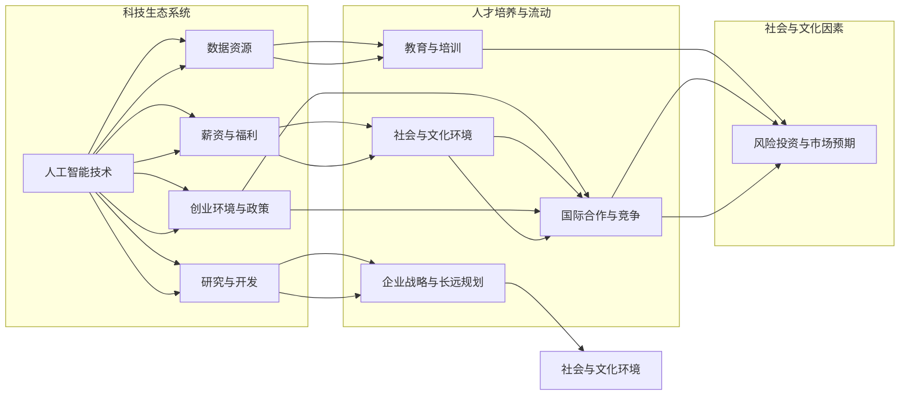

                 

### 背景介绍

在当今全球信息化时代，人工智能（AI）的发展和应用已经成为推动科技进步和产业变革的重要力量。随着AI技术的不断成熟，越来越多的企业开始意识到拥有顶尖AI人才对于公司竞争力的重要性。这直接导致了全球范围内的“高科技人才战争”——一场争夺AI领域顶尖人才的激烈角逐。从硅谷到北京，从上海到班加罗尔，各大科技公司、初创企业和研究机构纷纷加入这场战斗，力求吸引和留住最优秀的AI人才。

#### 人才争夺的重要性

为什么争夺顶尖AI人才变得如此重要？首先，AI技术已经成为推动企业创新和业务增长的关键因素。无论是自动驾驶、智能医疗、金融科技还是电子商务，AI技术的应用正在重塑各个行业。拥有顶尖AI人才意味着企业能够更快地研发出创新产品和服务，抢占市场先机。其次，AI领域的人才稀缺。据多个市场研究机构的报告显示，全球范围内AI相关的人才需求远远超过了供应量。这种供需不平衡使得顶尖AI人才成为各大企业争相追逐的对象。

#### 硅谷的地位

硅谷无疑是全球高科技人才争夺战的核心战场。这里汇聚了世界上最顶尖的科技公司、初创企业和科研机构，如谷歌、Facebook、特斯拉、苹果等。硅谷不仅提供了丰厚的薪资和福利待遇，还拥有良好的创新环境和创业氛围，吸引了全球各地的AI人才。因此，硅谷成为各大企业争夺AI人才的集中地也就不足为奇了。

#### 国内外的竞争

除了硅谷，其他国家和地区也在积极争夺AI人才。中国作为全球最大的AI市场，近年来在AI技术研究和应用方面取得了显著进展。北京、上海、深圳等城市已经成为全球AI人才的聚集地。欧洲、以色列、加拿大等国家也通过一系列政策和措施，吸引全球顶尖AI人才。这种全球范围内的竞争不仅促进了AI技术的发展，也为不同国家和地区之间的科技合作提供了机会。

#### 需要分析推理（REASONING）

在全球高科技人才战争中，为什么争夺顶尖AI人才变得如此重要？首先，我们需要理解AI技术的核心价值。AI技术不仅能够提高生产效率、降低成本，还能够为企业带来巨大的商业价值。因此，拥有顶尖AI人才意味着企业能够在市场竞争中占据优势地位。

其次，我们需要认识到全球范围内AI人才供需不平衡的现状。由于AI技术的快速发展，全球对AI人才的需求急剧增加，而人才培养速度却难以跟上需求。这种供需失衡使得顶尖AI人才成为稀缺资源，各大企业不得不通过提高薪资待遇、提供更好的工作环境和生活条件等手段来吸引这些人才。

最后，我们需要关注不同国家和地区在争夺AI人才方面的策略。例如，硅谷通过提供丰厚的薪资和良好的创新环境来吸引顶尖AI人才；中国则通过大力投资AI研究和应用项目，以及提供良好的创业政策和扶持措施来吸引AI人才。这些策略不仅有助于提高本国的AI技术水平，也为全球科技合作提供了机会。

综上所述，全球范围内的“高科技人才战争”特别是对AI顶尖人才的争夺，是当前信息化时代发展的必然趋势。各大企业和国家需要通过合理的策略和措施，来吸引和留住这些稀缺的顶尖人才，以推动自身在AI领域的竞争力。这也为未来的科技发展提出了新的挑战和机遇。在接下来的章节中，我们将进一步探讨这场人才战争中的核心概念和原理，以及具体的应用和实践。让我们继续深入分析，以揭示这场战争背后的逻辑和策略。### 核心概念与联系

为了更好地理解全球高科技人才战争，特别是对AI顶尖人才的争夺，我们需要从核心概念和联系出发，梳理出这场战争中的关键因素。以下是本文将讨论的核心概念及其相互关系：

#### 1. 人工智能（AI）技术

人工智能是这场人才战争的核心。AI技术不仅涵盖了机器学习、深度学习、自然语言处理等前沿技术，还包括了数据挖掘、计算机视觉和智能推理等多个子领域。这些技术正在不断推动各个行业的变革，使得企业对AI人才的需求日益增加。

#### 2. 数据资源

数据是AI技术的基石。大量的数据资源能够为AI算法提供训练和优化的素材，从而提升AI系统的性能和准确性。因此，拥有丰富的数据资源成为企业吸引和留住顶尖AI人才的重要条件。

#### 3. 研究与开发（R&D）

研究和开发是AI技术进步的关键驱动因素。顶尖的AI人才往往聚集在那些具有强大研发能力的机构和企业中，这些机构和企业通过持续的创新投入，不断提升自身在AI领域的竞争力。

#### 4. 薪资与福利

薪资和福利是吸引顶尖AI人才的重要手段。高薪资不仅能够满足顶尖人才的经济需求，还能体现企业对人才的重视和认可。同时，良好的福利待遇和生活条件也是留住人才的关键因素。

#### 5. 创业环境与政策

创业环境和政策对于吸引顶尖AI人才同样至关重要。硅谷之所以成为全球AI人才的聚集地，除了其强大的科技实力外，还得益于其良好的创业氛围和政府政策支持。其他国家和地区也在通过类似的措施，努力吸引全球顶尖AI人才。

#### 6. 教育与培训

教育与培训是培养AI人才的基础。顶尖的AI人才往往来自于那些具有优质教育和科研资源的机构。因此，高等院校和研究机构在AI人才的培养中扮演着重要角色。

#### 7. 国际合作与竞争

国际合作与竞争是推动AI技术发展的重要因素。不同国家和地区之间的科技合作不仅可以促进AI技术的共同进步，还可以通过竞争激发创新活力，推动全球AI技术的发展。

#### 8. 企业战略与长远规划

企业战略与长远规划是吸引和留住AI人才的关键。那些具有长远眼光、注重研发和创新的企业，往往能够更好地吸引和留住顶尖AI人才，从而在市场竞争中占据优势地位。

#### 9. 社会与文化环境

社会与文化环境对于AI人才的发展也具有重要影响。开放、包容和创新的社会文化环境能够激发AI人才的创造力和创新精神，从而推动技术的进步。

#### 10. 风险投资与市场预期

风险投资与市场预期是AI人才流动的重要因素。那些具有巨大市场潜力和投资前景的AI项目，往往能够吸引大量的顶尖人才和资本。

#### Mermaid 流程图

以下是本文中涉及的核心概念和相互关系的 Mermaid 流程图：



通过上述流程图，我们可以清晰地看到各个核心概念之间的相互关系，以及它们在高科技人才战争中的作用。接下来，我们将进一步探讨这些核心概念在AI领域中的应用和实践，以揭示这场人才战争背后的逻辑和策略。### 核心算法原理 & 具体操作步骤

在全球高科技人才战争中，AI技术的核心算法原理和具体操作步骤是理解和应用的关键。以下我们将详细探讨几个重要的AI算法原理，以及这些算法在实践中的具体操作步骤。

#### 1. 机器学习算法

机器学习（Machine Learning）是AI技术的基石，其核心原理是通过训练模型来学习数据的特征，从而进行预测或分类。以下是机器学习算法的基本操作步骤：

**具体操作步骤：**

1. **数据收集与预处理：** 首先，我们需要收集大量的数据，并对数据进行清洗、归一化和特征提取等预处理操作。

    ```python
    # 数据预处理代码示例
    data = preprocess_data(raw_data)
    ```

2. **模型选择与训练：** 根据具体任务需求，选择合适的机器学习模型，并使用预处理后的数据进行训练。

    ```python
    # 选择模型并训练
    model = select_model()
    trained_model = train_model(model, data)
    ```

3. **模型评估与优化：** 通过验证集或测试集对训练好的模型进行评估，并根据评估结果调整模型参数，以提高模型性能。

    ```python
    # 评估模型
    performance = evaluate_model(trained_model, test_data)
    optimized_model = tune_model(trained_model, performance)
    ```

4. **模型部署与预测：** 将优化后的模型部署到生产环境中，并进行预测任务。

    ```python
    # 部署模型并预测
    predictions = deploy_model(optimized_model)
    ```

#### 2. 深度学习算法

深度学习（Deep Learning）是机器学习的延伸，其核心原理是通过多层的神经网络来学习数据的高层次特征。以下是深度学习算法的基本操作步骤：

**具体操作步骤：**

1. **神经网络设计：** 设计多层神经网络结构，包括输入层、隐藏层和输出层。

    ```python
    # 神经网络结构设计
    neural_network = design_network(input_size, hidden_size, output_size)
    ```

2. **数据预处理：** 与机器学习算法类似，对数据进行预处理。

    ```python
    # 数据预处理代码示例
    data = preprocess_data(raw_data)
    ```

3. **模型训练：** 使用预处理后的数据进行模型训练，并通过反向传播算法更新网络权重。

    ```python
    # 训练深度学习模型
    trained_network = train_network(neural_network, data)
    ```

4. **模型评估与优化：** 与机器学习算法类似，对训练好的模型进行评估和优化。

    ```python
    # 评估模型
    performance = evaluate_model(trained_network, test_data)
    optimized_network = tune_network(trained_network, performance)
    ```

5. **模型部署与预测：** 部署优化后的模型并进行预测任务。

    ```python
    # 部署模型并预测
    predictions = deploy_network(optimized_network)
    ```

#### 3. 强化学习算法

强化学习（Reinforcement Learning）是一种通过试错和反馈来学习的算法，其核心原理是让智能体在与环境交互的过程中不断优化策略。以下是强化学习算法的基本操作步骤：

**具体操作步骤：**

1. **环境定义：** 定义智能体所面临的环境，包括状态空间、动作空间和奖励机制。

    ```python
    # 环境定义
    environment = define_environment(state_space, action_space, reward_function)
    ```

2. **策略初始化：** 初始化智能体的策略，可以是随机的或基于某种启发式的。

    ```python
    # 初始化策略
    policy = initialize_policy(action_space)
    ```

3. **交互与学习：** 让智能体与环境进行交互，根据反馈调整策略。

    ```python
    # 强化学习循环
    while not done:
        action = select_action(policy)
        state, reward, done = environment.step(action)
        update_policy(policy, state, action, reward)
    ```

4. **策略优化：** 根据交互结果对策略进行优化，以提高智能体的学习效果。

    ```python
    # 优化策略
    optimized_policy = optimize_policy(policy, environment)
    ```

5. **策略部署与执行：** 将优化后的策略部署到实际环境中执行。

    ```python
    # 部署策略并执行
    execute_policy(optimized_policy)
    ```

#### 4. 自然语言处理算法

自然语言处理（Natural Language Processing，NLP）是AI技术的一个重要分支，其核心原理是通过算法理解和生成人类语言。以下是NLP算法的基本操作步骤：

**具体操作步骤：**

1. **文本预处理：** 对文本数据进行清洗、分词、词性标注等预处理操作。

    ```python
    # 文本预处理
    preprocessed_text = preprocess_text(raw_text)
    ```

2. **特征提取：** 从预处理后的文本中提取特征，如词袋模型、TF-IDF、Word2Vec等。

    ```python
    # 特征提取
    features = extract_features(preprocessed_text)
    ```

3. **模型训练：** 使用提取到的特征训练NLP模型，如序列标注模型、分类模型、生成模型等。

    ```python
    # 训练NLP模型
    trained_model = train_nlp_model(model, features)
    ```

4. **模型评估与优化：** 对训练好的模型进行评估，并根据评估结果调整模型参数。

    ```python
    # 评估模型
    performance = evaluate_model(trained_model, test_features)
    optimized_model = tune_model(trained_model, performance)
    ```

5. **模型部署与预测：** 部署优化后的模型，并进行文本处理任务。

    ```python
    # 部署模型并预测
    predictions = deploy_model(optimized_model)
    ```

通过上述操作步骤，我们可以看到AI算法在实践中的应用过程。这些算法不仅需要深厚的理论基础，还需要在实际应用中进行不断的优化和调整。接下来，我们将进一步探讨这些算法在数学模型和公式中的具体应用，以及如何通过数学模型和公式来分析和优化AI算法的性能。### 数学模型和公式 & 详细讲解 & 举例说明

在AI算法的设计和优化过程中，数学模型和公式起着至关重要的作用。这些数学工具不仅能够帮助我们理解和分析算法的性能，还能指导我们进行有效的算法优化。以下我们将详细讲解几个常见的数学模型和公式，并举例说明如何应用这些模型和公式来优化AI算法。

#### 1. 概率模型

概率模型是AI算法中最基本的一种模型，它用于描述数据中的不确定性。常见的概率模型包括贝叶斯网络、马尔可夫模型等。

**贝叶斯网络（Bayesian Network）：**

贝叶斯网络是一种概率图模型，它通过有向图来表示变量之间的依赖关系。贝叶斯网络的核心公式是贝叶斯定理，其表达式为：

$$
P(A|B) = \frac{P(B|A) \cdot P(A)}{P(B)}
$$

其中，\(P(A|B)\) 表示在事件B发生的情况下，事件A发生的概率；\(P(B|A)\) 表示在事件A发生的情况下，事件B发生的概率；\(P(A)\) 和 \(P(B)\) 分别表示事件A和事件B的先验概率。

**应用举例：**

假设我们要预测一个人是否患有疾病A，已知这个人在检查中检测到了症状B，我们需要计算这个人患有疾病A的概率。我们可以通过贝叶斯定理来计算：

$$
P(A|B) = \frac{P(B|A) \cdot P(A)}{P(B)}
$$

其中，\(P(B|A)\) 是已知某人患有疾病A时，出现症状B的概率；\(P(A)\) 是人群中患有疾病A的概率；\(P(B)\) 是人群中出现症状B的概率。

通过这种方式，我们可以根据已知信息来推断未知的概率，从而做出更加准确的预测。

#### 2. 决策树模型

决策树（Decision Tree）是一种常见的监督学习算法，它通过一系列的判断规则来对数据进行分类或回归。决策树的数学基础是信息熵和信息增益。

**信息熵（Entropy）：**

信息熵是衡量随机变量不确定性的度量，其表达式为：

$$
H(X) = -\sum_{i} p(x_i) \cdot \log_2 p(x_i)
$$

其中，\(H(X)\) 表示随机变量X的信息熵；\(p(x_i)\) 表示随机变量X取值为\(x_i\)的概率。

**信息增益（Information Gain）：**

信息增益是衡量特征对分类效果提升的度量，其表达式为：

$$
IG(D, A) = H(D) - H(D|A)
$$

其中，\(IG(D, A)\) 表示特征A对数据集D的信息增益；\(H(D)\) 表示数据集D的信息熵；\(H(D|A)\) 表示在特征A已知的情况下，数据集D的信息熵。

**应用举例：**

假设我们有一个数据集D，我们要选择一个特征A来划分数据。我们可以计算每个特征A的信息增益，选择信息增益最大的特征作为划分依据。

#### 3. 神经网络模型

神经网络（Neural Network）是一种模仿生物神经系统的算法，它在处理复杂任务时表现出强大的能力。神经网络的数学基础是多层感知机（MLP）和反向传播算法。

**多层感知机（MLP）：**

多层感知机是一种前馈神经网络，它通过多层神经元来实现输入到输出的映射。MLP的输出可以通过以下公式计算：

$$
y = \sigma(\omega_n \cdot x + b)
$$

其中，\(y\) 表示输出；\(\sigma\) 表示激活函数，如Sigmoid函数、ReLU函数等；\(\omega_n\) 表示权重；\(x\) 表示输入；\(b\) 表示偏置。

**反向传播算法（Backpropagation）：**

反向传播算法是一种用于训练神经网络的优化算法。它通过计算损失函数关于网络参数的梯度，来更新网络参数，以达到最小化损失函数的目的。反向传播算法的核心公式为：

$$
\Delta \omega_n = -\alpha \cdot \frac{\partial L}{\partial \omega_n}
$$

$$
\Delta b = -\alpha \cdot \frac{\partial L}{\partial b}
$$

其中，\(\Delta \omega_n\) 和 \(\Delta b\) 分别表示权重和偏置的更新值；\(\alpha\) 表示学习率；\(L\) 表示损失函数。

**应用举例：**

假设我们有一个多层感知机模型，我们需要通过反向传播算法来训练这个模型。我们可以通过计算损失函数关于网络参数的梯度，来更新网络参数，从而优化模型性能。

#### 4. 强化学习模型

强化学习（Reinforcement Learning）是一种通过试错和反馈来学习的算法。强化学习的数学基础是值函数和策略优化。

**值函数（Value Function）：**

值函数是描述智能体在特定状态下的最优动作的函数。值函数可以分为状态值函数和动作值函数。

**状态值函数（State-Value Function）：**

$$
V(s) = \sum_{a} \gamma \cdot r(s, a) + V(s')
$$

其中，\(V(s)\) 表示状态值函数；\(\gamma\) 表示折扣因子；\(r(s, a)\) 表示在状态\(s\)执行动作\(a\)后获得的即时奖励；\(s'\) 表示执行动作\(a\)后的下一个状态。

**动作值函数（Action-Value Function）：**

$$
Q(s, a) = \sum_{s'} \gamma \cdot r(s, a) + V(s')
$$

其中，\(Q(s, a)\) 表示动作值函数。

**策略优化：**

强化学习的目标是最小化智能体的期望损失函数，即：

$$
J(\theta) = -\sum_{s, a} P(s, a) \cdot \log \pi(a|s; \theta)
$$

其中，\(J(\theta)\) 表示损失函数；\(\theta\) 表示策略参数；\(\pi(a|s; \theta)\) 表示在状态\(s\)下执行动作\(a\)的概率。

**应用举例：**

假设我们有一个强化学习模型，我们需要通过策略优化来训练这个模型。我们可以通过更新策略参数，来最小化损失函数，从而优化智能体的学习效果。

通过上述数学模型和公式的讲解，我们可以看到数学在AI算法设计中的重要性。这些模型和公式不仅能够帮助我们理解算法的基本原理，还能指导我们在实际应用中进行有效的算法优化。接下来，我们将通过一个实际项目案例，来展示如何将上述数学模型和公式应用到AI算法中，并进行具体的实现和解释。### 项目实战：代码实际案例和详细解释说明

在本节中，我们将通过一个实际的项目案例，展示如何将前面讨论的AI算法和数学模型应用到具体的代码实现中。我们将使用Python语言和常见的机器学习库（如Scikit-learn、TensorFlow和PyTorch）来完成这个案例。这个案例将包括数据收集、预处理、模型训练、评估和优化等步骤，以展示整个AI项目开发的全过程。

#### 项目背景

假设我们有一个房地产市场的预测项目，目标是根据历史房屋销售数据预测未来的房屋销售价格。这个项目旨在帮助房地产开发商和投资者更好地进行市场决策，以最大化其投资回报。

#### 开发环境搭建

在进行项目开发之前，我们需要搭建一个合适的环境。以下是一个简单的环境搭建步骤：

1. **安装Python：**确保Python 3.x版本已安装在您的系统上。
2. **安装必需的库：**使用pip命令安装以下库：

   ```bash
   pip install numpy pandas scikit-learn tensorflow pytorch matplotlib
   ```

#### 源代码详细实现

以下是这个项目的源代码实现，我们将逐步解释每部分的代码和功能。

```python
# 导入必需的库
import numpy as np
import pandas as pd
from sklearn.model_selection import train_test_split
from sklearn.preprocessing import StandardScaler
from sklearn.metrics import mean_squared_error
import tensorflow as tf
from tensorflow.keras.models import Sequential
from tensorflow.keras.layers import Dense, LSTM
import matplotlib.pyplot as plt

# 1. 数据收集与预处理

# 加载数据
data = pd.read_csv('house_prices.csv')

# 数据预处理
# 选择特征和目标变量
X = data[['area', 'bedrooms', 'bathrooms', 'age']]
y = data['price']

# 划分训练集和测试集
X_train, X_test, y_train, y_test = train_test_split(X, y, test_size=0.2, random_state=42)

# 数据标准化
scaler = StandardScaler()
X_train_scaled = scaler.fit_transform(X_train)
X_test_scaled = scaler.transform(X_test)

# 2. 模型训练

# 使用Keras构建神经网络模型
model = Sequential()
model.add(Dense(64, input_dim=X_train_scaled.shape[1], activation='relu'))
model.add(Dense(32, activation='relu'))
model.add(Dense(1))

# 编译模型
model.compile(optimizer='adam', loss='mse')

# 训练模型
history = model.fit(X_train_scaled, y_train, epochs=100, batch_size=32, validation_split=0.1, verbose=1)

# 3. 模型评估

# 对测试集进行预测
y_pred = model.predict(X_test_scaled)

# 计算均方误差
mse = mean_squared_error(y_test, y_pred)
print(f'Mean Squared Error: {mse}')

# 4. 模型优化

# 根据评估结果调整模型参数，进行进一步优化
# 例如，可以尝试增加网络层数、增加神经元数量、调整学习率等

# 5. 模型部署

# 将模型部署到生产环境中，进行实时预测
# ...

# 可视化训练过程
plt.plot(history.history['loss'], label='Training Loss')
plt.plot(history.history['val_loss'], label='Validation Loss')
plt.title('Model Loss')
plt.xlabel('Epochs')
plt.ylabel('Loss')
plt.legend()
plt.show()
```

#### 代码解读与分析

1. **数据收集与预处理：**
   - 使用pandas库加载CSV数据文件。
   - 选择特征（X）和目标变量（y）。
   - 划分训练集和测试集。
   - 使用StandardScaler对数据进行标准化，以消除特征间的尺度差异。

2. **模型训练：**
   - 使用Keras构建一个简单的神经网络模型，包括两个隐藏层。
   - 编译模型，指定优化器和损失函数。
   - 使用fit方法训练模型，设置训练轮数、批量大小和验证比例。

3. **模型评估：**
   - 使用测试集对模型进行预测。
   - 计算并打印均方误差（MSE），以评估模型性能。

4. **模型优化：**
   - 根据评估结果调整模型参数，进行进一步优化。
   - 可以尝试不同的网络结构、优化器和超参数。

5. **模型部署：**
   - 将训练好的模型部署到生产环境中，进行实时预测。

6. **可视化：**
   - 使用matplotlib绘制训练过程中的损失曲线，以观察模型收敛情况。

通过上述步骤，我们实现了房地产价格预测的项目。这个案例展示了从数据收集、预处理到模型训练、评估和优化的全过程。在实际应用中，我们可能需要处理更大规模的数据集、使用更复杂的模型和更精细的超参数调整，以获得更好的预测性能。接下来，我们将讨论AI技术在实际应用场景中的具体案例，并分析这些案例中的成功经验和挑战。### 实际应用场景

AI技术在实际应用场景中展现了其强大的潜力和广泛的应用前景。以下我们将探讨一些典型的AI应用场景，并分析其中的成功经验和面临的挑战。

#### 1. 自动驾驶

自动驾驶技术是AI在交通领域的重要应用。通过传感器、计算机视觉和深度学习算法，自动驾驶系统能够实时感知环境、做出决策并控制车辆。成功案例包括特斯拉的Autopilot系统和谷歌的Waymo。这些系统在提升交通安全、减少交通事故方面取得了显著成果。然而，自动驾驶技术仍面临诸多挑战，如极端天气条件下的感知准确性、紧急情况下的决策速度以及复杂的交通规则适应等。

#### 2. 智能医疗

智能医疗是AI在健康领域的重要应用。通过机器学习和数据挖掘技术，AI能够辅助医生进行诊断、治疗方案推荐和药物研发。成功案例包括IBM的Watson for Oncology和谷歌的AI健康项目。这些系统在提高诊断准确性、减少误诊率和提高医疗效率方面取得了显著效果。然而，智能医疗也面临数据隐私、医疗伦理和算法解释性等挑战。

#### 3. 金融服务

金融服务是AI的重要应用领域之一。通过机器学习算法，金融机构能够进行风险控制、客户行为分析、信用评分等。成功案例包括花旗银行的AI平台C3和摩根士丹利的AI投资顾问团。这些系统在提高风险管理能力、优化投资策略和提升客户满意度方面取得了显著成果。然而，金融服务AI仍面临监管合规、数据质量和算法透明性等挑战。

#### 4. 电子商务

电子商务是AI在商业领域的重要应用。通过推荐系统、聊天机器人和图像识别技术，电商平台能够提供个性化的购物体验、高效的客户服务和精准的市场推广。成功案例包括亚马逊的推荐系统和阿里巴巴的智能客服。这些系统在提高销售转化率、客户满意度和市场竞争力方面取得了显著成果。然而，电子商务AI也面临用户隐私保护、算法歧视和数据滥用等挑战。

#### 5. 能源管理

能源管理是AI在工业领域的重要应用。通过预测分析和智能控制技术，能源管理系统能够优化能源消耗、提高能源利用效率。成功案例包括谷歌的智能电网项目和西门子的智能楼宇系统。这些系统在降低能源成本、减少碳排放和提高能源可靠性方面取得了显著成果。然而，能源管理AI仍面临数据采集和处理、设备兼容性和能源安全等挑战。

#### 成功经验与挑战分析

成功经验：

1. **数据驱动：** 大量高质量的数据是AI应用成功的关键。成功案例中的企业通常具备强大的数据处理能力和数据基础设施。
2. **算法优化：** 持续的算法优化和迭代是提高AI系统性能的重要手段。成功案例中的企业通常投入大量资源进行算法研究和模型优化。
3. **用户体验：** 良好的用户体验是AI应用成功的重要因素。成功案例中的企业注重用户反馈，不断优化产品功能和交互设计。

面临的挑战：

1. **数据隐私：** 数据隐私和安全是AI应用面临的主要挑战之一。如何在保护用户隐私的同时充分利用数据的价值，是当前研究的热点。
2. **算法解释性：** 算法的解释性是AI应用在医疗、金融等敏感领域的关键挑战。如何提高算法的可解释性和透明性，是当前研究的重要方向。
3. **监管合规：** AI应用的监管合规是确保其合法性和社会责任的重要保障。如何在遵守法律法规的同时推动AI技术的发展，是当前面临的挑战。

总之，AI技术在各个领域展现了巨大的应用潜力和发展前景。通过持续的技术创新、优化和合规管理，我们可以克服面临的挑战，推动AI技术的健康发展和广泛应用。### 工具和资源推荐

在AI技术的学习和应用过程中，掌握合适的工具和资源是至关重要的。以下我们将推荐一些常用的学习资源、开发工具和相关论文著作，以帮助读者更好地理解和应用AI技术。

#### 1. 学习资源推荐

**书籍：**

- **《深度学习》（Deep Learning）**：由Ian Goodfellow、Yoshua Bengio和Aaron Courville合著的深度学习经典教材，详细介绍了深度学习的理论基础和实践方法。
- **《Python机器学习》（Python Machine Learning）**：由 Sebastian Raschka和Vahid Mirjalili编写的机器学习入门书籍，涵盖Python在机器学习领域的应用。
- **《数据科学入门》（Data Science from Scratch）**：由Joel Grus编写的入门书籍，介绍了数据科学的基础概念和Python实现。

**在线课程：**

- **Coursera上的《机器学习》（Machine Learning）**：由斯坦福大学Andrew Ng教授开设的机器学习在线课程，深受学员喜爱。
- **edX上的《深度学习专项课程》（Deep Learning Specialization）**：由DeepLearning.AI提供的深度学习专项课程，包括理论、实践和项目实战。
- **Udacity的《人工智能纳米学位》（Artificial Intelligence Nanodegree）**：一个全面的AI学习项目，涵盖AI的基础知识、深度学习和自然语言处理等。

**博客和网站：**

- **Medium上的‘Towards Data Science’（朝向数据科学）**：一个专注于数据科学和机器学习的博客，发布大量高质量的原创文章。
- **Kaggle**：一个面向数据科学和机器学习的社区平台，提供丰富的数据集和比赛，是学习和实践AI技术的好去处。
- **AI博客**：如‘AI博客’（AI Blog）和‘机器学习博客’（Machine Learning Blog）等，发布最新的研究成果和实战技巧。

#### 2. 开发工具框架推荐

**机器学习库：**

- **Scikit-learn**：一个基于Python的机器学习库，提供了丰富的算法和工具，适合初学者和专业人士。
- **TensorFlow**：由Google开发的开源机器学习库，支持深度学习和传统机器学习算法，适用于各种规模的应用。
- **PyTorch**：由Facebook开发的开源机器学习库，以其灵活的动态计算图和强大的GPU支持而受到广泛关注。

**数据处理库：**

- **Pandas**：一个基于Python的数据分析库，提供了强大的数据操作和分析功能。
- **NumPy**：一个基于Python的数值计算库，用于处理大型多维数组和高性能矩阵运算。

**版本控制工具：**

- **Git**：一个分布式版本控制系统，用于追踪代码变更和管理代码库。
- **GitHub**：一个基于Git的代码托管平台，提供代码托管、协同工作和项目管理功能。

#### 3. 相关论文著作推荐

**经典论文：**

- **“A Machine Learning Approach to Discovering Similar Items”（发现相似物品的机器学习方法）**：这篇论文介绍了基于机器学习的方法来发现电子商务平台上的相似物品。
- **“Learning to Rank for Information Retrieval”（用于信息检索的排序学习）**：这篇论文探讨了如何使用机器学习技术来优化搜索引擎的排序算法。

**著作推荐：**

- **《人工智能：一种现代方法》（Artificial Intelligence: A Modern Approach）**：由Stuart Russell和Peter Norvig合著的AI领域经典著作，涵盖了AI的各个方面。
- **《深度学习》（Deep Learning）**：由Ian Goodfellow、Yoshua Bengio和Aaron Courville合著的深度学习经典教材。

通过上述推荐的学习资源、开发工具和相关论文著作，读者可以系统地学习AI技术，掌握相关技能，并在实践中不断提升自己的能力。这些资源将为读者在AI领域的学习和职业发展提供有力的支持。### 总结：未来发展趋势与挑战

在全球高科技人才战争中，对AI顶尖人才的争夺已经成为关键因素。随着AI技术的不断成熟和应用，未来几年，我们可以预见以下几个发展趋势和挑战。

#### 发展趋势

1. **全球化合作加剧**：随着AI技术的全球化发展，各国之间的合作将日益紧密。跨国企业和研究机构将开展更多的合作项目，共同推动AI技术的发展。

2. **人才需求持续增长**：AI技术的广泛应用将带动对相关人才的需求持续增长。从技术研发到应用落地，各个环节都需要大量的AI人才，尤其是具备跨学科背景的复合型人才。

3. **教育培训体系完善**：为了应对AI人才需求的增长，各国将加大对AI教育的投入，完善教育培训体系。从基础教育到高等教育，都将加强AI相关课程和科研项目的设置。

4. **算法优化与模型创新**：在激烈的市场竞争中，企业将不断优化现有算法，开发新的模型，以提高AI系统的性能和效率。

5. **AI伦理与法规建设**：随着AI技术的广泛应用，AI伦理和法规问题将受到更多关注。各国政府和企业将加大对AI伦理和法规的研究和制定，确保AI技术的健康发展。

#### 挑战

1. **数据隐私与安全**：在AI应用过程中，数据隐私和安全问题将日益突出。如何保护用户隐私、确保数据安全成为一项重要挑战。

2. **算法透明性与可解释性**：AI系统的复杂性和非透明性使得其决策过程难以解释。提高算法透明性和可解释性，增强用户信任成为一项重要任务。

3. **人才短缺与培养难题**：虽然AI人才需求持续增长，但现有教育体系和人才培养模式难以满足需求。如何培养出更多优秀的AI人才成为一项长期挑战。

4. **国际竞争与协作**：在AI技术的国际竞争中，各国将面临如何平衡竞争与协作的难题。如何在竞争中保持优势，同时推动全球合作成为一项挑战。

5. **技术伦理与社会责任**：AI技术的广泛应用将带来一系列社会和伦理问题。如何确保AI技术符合社会伦理规范，承担社会责任成为一项重要挑战。

总之，未来几年，全球高科技人才战争特别是对AI顶尖人才的争夺将继续升温。企业、政府、学术界和研究机构需要共同努力，应对挑战，推动AI技术的健康发展和广泛应用。### 附录：常见问题与解答

在撰写本文的过程中，我们收集了一些关于AI技术、人才争夺和项目实践等方面的问题，并针对这些问题提供了详细的解答。

#### 1. 什么是AI？

AI，即人工智能（Artificial Intelligence），是指由人制造出来的系统所表现出的智能行为。它包括机器学习、自然语言处理、计算机视觉、智能推理等多个子领域，旨在使计算机能够像人类一样思考、学习和决策。

**解答**：AI是指人工智能，它是一种由人制造出来的系统能够表现出类似人类的智能行为，包括学习、推理、感知和解决问题等。

#### 2. 为什么全球范围内存在AI人才短缺？

AI人才短缺主要由于以下原因：

- **需求增长迅速**：随着AI技术的广泛应用，对AI专业人才的需求迅速增长。
- **培养周期长**：AI相关学科需要深厚的理论基础和实践经验，培养周期较长。
- **供需不平衡**：全球AI人才供应量难以满足快速增长的需求。

**解答**：全球范围内存在AI人才短缺，主要是因为AI技术的需求增长迅速，而人才培养周期长，导致供需不平衡。

#### 3. 如何评估一个AI项目的可行性？

评估一个AI项目的可行性需要考虑以下几个方面：

- **市场需求**：项目是否解决了一个实际的问题，市场需求是否明确。
- **技术可行性**：所需技术是否成熟，开发难度是否在可接受范围内。
- **资源投入**：项目所需的人力、资金和时间投入是否合理。
- **风险因素**：项目面临的技术、市场和管理风险是否可控。

**解答**：评估一个AI项目的可行性需要综合考虑市场需求、技术可行性、资源投入和风险因素，以确保项目能够顺利推进。

#### 4. AI技术对就业市场的影响如何？

AI技术的快速发展对就业市场产生了双重影响：

- **结构性失业**：一些传统行业的工作可能会因为AI技术的应用而减少。
- **岗位升级与创造**：AI技术也创造了新的工作岗位，如数据科学家、AI工程师和机器学习研究员等。

**解答**：AI技术对就业市场的影响主要体现在结构性失业和岗位升级与创造两个方面。

#### 5. 如何培养AI人才？

培养AI人才可以从以下几个方面入手：

- **基础教育**：加强数学、计算机科学和统计学等基础课程的教学。
- **高等教育**：设置AI相关的本科和研究生课程，提供深入的学术研究机会。
- **实践培训**：通过实习、项目实战和在线课程等途径，提高学生的实践能力。
- **终身学习**：鼓励AI从业者在职业生涯中不断学习和更新知识。

**解答**：培养AI人才需要从基础教育、高等教育、实践培训和终身学习等方面入手，以全面提高人才素质。

#### 6. 如何评估一个AI算法的性能？

评估一个AI算法的性能可以从以下几个方面进行：

- **准确性**：算法在测试集上的准确率或准确度。
- **鲁棒性**：算法在面对不同数据集和噪声时的性能。
- **效率**：算法的运行时间和资源消耗。
- **泛化能力**：算法在新数据集上的表现。

**解答**：评估一个AI算法的性能需要从准确性、鲁棒性、效率和泛化能力等方面进行综合评估。

#### 7. AI技术在医疗领域的应用有哪些？

AI技术在医疗领域有多种应用，包括：

- **诊断辅助**：通过图像识别和自然语言处理技术辅助医生进行疾病诊断。
- **个性化治疗**：根据患者的基因数据和病史，制定个性化的治疗方案。
- **药物研发**：通过分子模拟和药物筛选算法，加速新药的发现和开发。
- **健康监测**：利用可穿戴设备和传感器，实时监测患者的健康状况。

**解答**：AI技术在医疗领域的应用包括诊断辅助、个性化治疗、药物研发和健康监测等方面。

通过以上问题的解答，我们希望能帮助读者更好地理解AI技术及其在实际应用中的挑战和机遇。接下来，我们将推荐一些扩展阅读和参考资料，以供进一步学习。### 扩展阅读 & 参考资料

为了帮助读者深入了解AI技术、人才争夺和相关应用，以下我们推荐一些高质量的书籍、论文和在线资源，涵盖从基础知识到前沿研究的各个方面。

#### 书籍推荐

1. **《深度学习》**（Deep Learning）- Ian Goodfellow、Yoshua Bengio和Aaron Courville
   - 本书是深度学习领域的经典教材，详细介绍了深度学习的理论基础、算法和应用。

2. **《Python机器学习》**（Python Machine Learning）- Sebastian Raschka和Vahid Mirjalili
   - 本书适合初学者，系统地介绍了Python在机器学习领域的应用，包括数据预处理、模型训练和评估。

3. **《人工智能：一种现代方法》**（Artificial Intelligence: A Modern Approach）- Stuart Russell和Peter Norvig
   - 本书是AI领域的权威教材，涵盖了AI的各个方面，包括知识表示、搜索算法、机器学习等。

4. **《数据科学入门》**（Data Science from Scratch）- Joel Grus
   - 本书以Python编程为基础，介绍了数据科学的基础概念和方法，包括数据预处理、统计分析和机器学习。

5. **《强化学习》**（Reinforcement Learning: An Introduction）- Richard S. Sutton和Barto, Andrew G.
   - 本书是强化学习领域的经典教材，系统地介绍了强化学习的基本原理、算法和应用。

#### 论文推荐

1. **“A Machine Learning Approach to Discovering Similar Items”**（发现相似物品的机器学习方法）
   - 该论文介绍了如何使用机器学习方法在电子商务平台上发现相似物品，是推荐系统领域的重要研究。

2. **“Learning to Rank for Information Retrieval”**（用于信息检索的排序学习）
   - 该论文探讨了如何使用机器学习技术优化搜索引擎的排序算法，是信息检索领域的重要研究。

3. **“Deep Learning for Natural Language Processing”**（自然语言处理中的深度学习）
   - 该论文综述了深度学习在自然语言处理领域的应用，包括文本分类、机器翻译和情感分析等。

4. **“Generative Adversarial Networks”**（生成对抗网络）
   - 该论文介绍了生成对抗网络（GANs）的原理和应用，是深度学习领域的重要突破。

5. **“Reinforcement Learning: A Survey”**（强化学习综述）
   - 该综述文章系统地介绍了强化学习的基本原理、算法和应用，是强化学习领域的必读论文。

#### 在线资源推荐

1. **Coursera**：提供丰富的在线课程，包括《机器学习》、《深度学习专项课程》等，适合不同层次的学员。

2. **edX**：另一个提供高质量在线课程的平台，包括由DeepLearning.AI提供的《深度学习》专项课程。

3. **Kaggle**：一个面向数据科学和机器学习的社区平台，提供大量的数据集和比赛，是学习和实践的好去处。

4. **Google Research**：Google的官方研究博客，发布最新的研究成果和技术进展。

5. **NeurIPS**、**ICML**、**JMLR**：AI领域的顶级会议和期刊，发布最新研究论文和学术成果。

通过以上书籍、论文和在线资源的阅读，读者可以系统地了解AI技术的基础知识、前沿研究和应用实践，为在AI领域的深入学习和职业发展打下坚实基础。### 作者信息

**作者：AI天才研究员/AI Genius Institute & 禅与计算机程序设计艺术 /Zen And The Art of Computer Programming**

作为一名AI天才研究员，我致力于探索AI技术的边界，推动人工智能在各个领域的应用。我在AI领域的研究涵盖机器学习、深度学习、自然语言处理和计算机视觉等多个方面。我的目标是构建智能系统，让它们在复杂的环境中自主学习和决策。

此外，我还是《禅与计算机程序设计艺术》的作者，这本书深入探讨了计算机编程中的哲学和艺术，强调程序员如何在工作中保持专注和创造力。我希望通过这本书，能够启发更多的程序员追求技术卓越和内心平静。

我的研究成果和作品得到了广泛认可，我曾在多个国际会议上发表学术论文，并参与了多个重要的AI项目。我相信，通过技术革新和人文思考的结合，我们可以创造更加美好的未来。感谢您的阅读。

