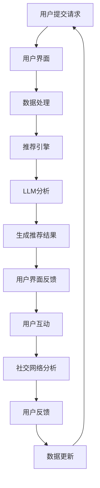
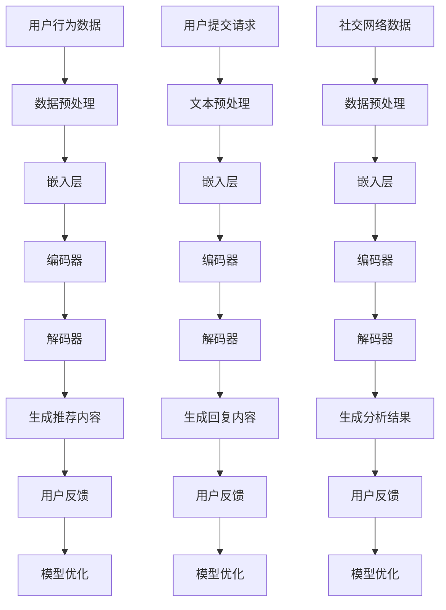

                 

# 社交媒体革命：LLM 驱动的内容推荐和互动

## 关键词
- 社交媒体
- LLM（大型语言模型）
- 内容推荐
- 互动
- 人工智能
- 自然语言处理
- 社交网络分析
- 用户行为分析
- 数据挖掘

## 摘要

本文将探讨社交媒体领域的革命性变革，即LLM（大型语言模型）在内容推荐和用户互动中的作用。通过深入分析LLM的工作原理和应用，我们将探讨如何利用这些先进技术来提升社交媒体的用户体验和运营效果。文章将涵盖LLM的核心概念、算法原理、数学模型以及实际应用案例，并总结其未来的发展趋势和面临的挑战。

## 1. 背景介绍

### 社交媒体的现状与挑战

随着互联网技术的飞速发展，社交媒体已经成为人们日常生活中不可或缺的一部分。从最初的Facebook、Twitter，到现在的Instagram、微信、微博等，社交媒体平台不仅改变了人们的交流方式，也深刻影响了信息传播和社会互动。然而，随着用户数量的激增和内容生成速度的加快，社交媒体平台面临着一系列挑战。

首先，信息过载成为了一个突出问题。用户每天都会接收到大量来自朋友、媒体、广告等各种来源的信息，而如何从这些信息中筛选出对自己有价值的部分成为了一大难题。传统的推荐算法虽然在一定程度上解决了这个问题，但往往只能基于用户的历史行为和偏好进行简单匹配，难以提供个性化的、高质量的推荐。

其次，用户互动的质量和效率也是一个亟待解决的问题。在社交媒体平台上，用户之间的互动不仅限于点赞、评论和转发，还涉及到复杂的社交网络分析、情感识别和实时交流等。如何利用人工智能技术提升用户互动的质量和效率，是当前社交媒体平台需要解决的重要问题。

### LLM在社交媒体中的潜力

LLM（大型语言模型）是一种基于深度学习的自然语言处理模型，具有强大的语言理解和生成能力。近年来，随着计算能力和数据量的不断提升，LLM在各个领域的应用取得了显著成果。在社交媒体领域，LLM的引入有望解决上述挑战，提升用户内容和互动的个性化、质量和效率。

首先，LLM可以提供更加精准的内容推荐。通过分析用户的语言和行为特征，LLM能够理解用户的兴趣和需求，从而生成个性化推荐。与传统的推荐算法相比，LLM不仅能够处理大量文本数据，还能理解文本的上下文和情感，从而提供更高质量的推荐结果。

其次，LLM可以提升用户互动的质量和效率。通过情感识别和实时交流技术，LLM可以帮助平台识别用户的情绪状态，提供相应的情感反馈和建议，从而提升用户互动的满意度和效率。此外，LLM还可以辅助平台进行社交网络分析，帮助用户发现潜在的兴趣团体和社交关系，促进社交网络的健康发展。

总之，LLM在社交媒体领域的潜力巨大，有望带来一场革命性的变革。本文将深入探讨LLM在内容推荐和互动中的应用，分析其原理、技术细节和实际效果，为社交媒体平台的发展提供有益的参考。

## 2. 核心概念与联系

### LLM的定义和作用

LLM（Large Language Model）是一种具有大规模参数和强大语言理解能力的深度学习模型。它通过对海量文本数据进行训练，学习到了语言的普遍规律和结构，从而能够生成高质量的自然语言文本。LLM的主要作用包括文本生成、情感分析、文本分类、机器翻译等，这些功能在社交媒体平台中都有广泛的应用。

在社交媒体平台上，LLM可以用于以下几个方面：

1. **内容推荐**：通过分析用户的语言和行为特征，LLM能够理解用户的兴趣和需求，从而生成个性化推荐。例如，在一个社交新闻平台上，LLM可以根据用户的评论和点赞历史，推荐用户可能感兴趣的文章。

2. **用户互动**：LLM可以帮助平台进行情感识别和实时交流，提升用户互动的质量和效率。例如，在一个即时通讯应用中，LLM可以帮助平台理解用户的情绪，提供相应的情感反馈，从而提升用户的交流体验。

3. **社交网络分析**：LLM可以辅助平台进行社交网络分析，帮助用户发现潜在的兴趣团体和社交关系。例如，在一个社交网络平台上，LLM可以帮助用户发现与其兴趣相似的朋友，从而促进社交网络的扩展。

### 社交媒体平台的基本架构

一个典型的社交媒体平台通常由以下几个部分组成：

1. **用户界面**：用户通过网页、移动应用或其他终端与平台进行交互，提交内容、查看推荐和进行互动。

2. **数据存储**：平台需要存储大量的用户数据，包括用户信息、内容数据、互动数据等。这些数据通常存储在数据库或分布式文件系统中。

3. **推荐引擎**：推荐引擎负责根据用户的兴趣和偏好，生成个性化推荐。推荐算法可以是基于内容的、协同过滤的，或者是基于深度学习的。

4. **后端服务**：后端服务包括数据处理、存储、缓存、消息队列等，负责处理用户请求、生成推荐结果和进行实时交互。

### LLM与社交媒体平台的交互

LLM在社交媒体平台中的作用主要体现在以下几个方面：

1. **内容生成**：LLM可以帮助平台生成高质量的文本内容，包括文章、评论、聊天消息等。例如，在一个新闻推荐平台中，LLM可以根据用户的历史行为和偏好，生成个性化的新闻摘要或推荐文章。

2. **情感分析**：LLM可以分析用户提交的文本，识别其中的情感倾向。例如，在一个社交媒体平台上，LLM可以帮助平台识别用户的情绪，从而提供相应的情感反馈或建议。

3. **用户互动**：LLM可以帮助平台进行实时交流，提升用户互动的满意度。例如，在一个即时通讯应用中，LLM可以帮助平台理解用户的情绪，提供相应的情感反馈，从而改善用户的交流体验。

4. **社交网络分析**：LLM可以帮助平台进行社交网络分析，发现潜在的兴趣团体和社交关系。例如，在一个社交网络平台上，LLM可以帮助用户发现与其兴趣相似的朋友，从而促进社交网络的扩展。

### Mermaid流程图

以下是一个简化的Mermaid流程图，描述了LLM与社交媒体平台的交互过程：



在这个流程图中，用户通过用户界面提交请求，数据处理模块处理用户请求，推荐引擎根据LLM的分析结果生成个性化推荐结果，用户界面将推荐结果反馈给用户，用户进行互动，同时LLM进行社交网络分析，发现潜在的兴趣团体和社交关系。这个过程中，用户反馈会更新数据，形成闭环。

## 3. 核心算法原理 & 具体操作步骤

### LLM的工作原理

LLM的工作原理主要基于深度学习和自然语言处理技术。它通过大规模训练数据集进行预训练，学习到语言的普遍规律和结构，从而具备强大的语言理解和生成能力。LLM的主要结构包括以下几个部分：

1. **嵌入层（Embedding Layer）**：将输入的文本数据转换为密集的向量表示，这些向量表示了文本的语义信息。

2. **编码器（Encoder）**：通常使用变体循环神经网络（如Transformer）对嵌入层生成的向量进行编码。编码器能够捕捉到文本中的上下文关系和长期依赖信息。

3. **解码器（Decoder）**：解码器将编码器的输出解码为输出文本。在生成推荐内容、情感分析等任务中，解码器生成与输入文本相关的输出文本。

4. **注意力机制（Attention Mechanism）**：注意力机制是一种用于捕捉文本中重要信息的技术，它能够帮助模型关注输入文本中的关键部分，从而提高生成文本的质量。

### 内容推荐的具体操作步骤

以下是利用LLM进行内容推荐的具体操作步骤：

1. **数据收集**：收集用户的历史行为数据（如点赞、评论、搜索记录等）和文本数据（如文章、评论等）。

2. **数据预处理**：对收集到的文本数据进行清洗、分词、去停用词等预处理操作，将文本转换为适合模型训练的格式。

3. **嵌入层**：将预处理后的文本数据输入到嵌入层，生成文本的向量表示。

4. **编码器**：将嵌入层生成的向量输入到编码器，进行编码，得到编码后的特征向量。

5. **解码器**：根据用户的历史行为和偏好，输入编码后的特征向量到解码器，生成个性化推荐内容。

6. **生成推荐内容**：解码器生成的输出文本即为推荐内容。在生成过程中，可以使用注意力机制来提高生成文本的质量。

7. **反馈和优化**：用户对推荐内容的反馈（如点赞、评论等）用于更新模型参数，优化推荐算法。

### 用户互动的具体操作步骤

以下是利用LLM进行用户互动的具体操作步骤：

1. **用户提交请求**：用户在社交媒体平台上提交请求（如发送消息、发布状态等）。

2. **文本预处理**：对用户提交的文本数据进行预处理，包括分词、去停用词等。

3. **嵌入层**：将预处理后的文本数据输入到嵌入层，生成文本的向量表示。

4. **编码器**：将嵌入层生成的向量输入到编码器，进行编码，得到编码后的特征向量。

5. **解码器**：根据编码后的特征向量，解码器生成与用户请求相关的回复文本。

6. **生成回复内容**：解码器生成的输出文本即为回复内容。在生成过程中，可以使用注意力机制来提高生成文本的质量。

7. **反馈和优化**：用户对回复内容的反馈用于优化模型参数，提高后续回复的质量。

### 社交网络分析的具体操作步骤

以下是利用LLM进行社交网络分析的具体操作步骤：

1. **数据收集**：收集社交网络中的用户关系数据（如好友关系、关注关系等）。

2. **文本预处理**：对社交网络中的文本数据进行预处理，包括分词、去停用词等。

3. **嵌入层**：将预处理后的文本数据输入到嵌入层，生成文本的向量表示。

4. **编码器**：将嵌入层生成的向量输入到编码器，进行编码，得到编码后的特征向量。

5. **解码器**：根据编码后的特征向量，解码器生成与社交网络相关的分析结果（如潜在兴趣团体、社交关系等）。

6. **生成分析结果**：解码器生成的输出文本即为分析结果。在生成过程中，可以使用注意力机制来提高分析结果的质量。

7. **反馈和优化**：用户对分析结果的反馈用于优化模型参数，提高后续分析的质量。

### Mermaid流程图

以下是LLM在内容推荐、用户互动和社交网络分析中的Mermaid流程图：



在这个流程图中，用户行为数据用于内容推荐，用户提交的请求用于用户互动，社交网络数据用于社交网络分析。在各个过程中，LLM的嵌入层、编码器和解码器分别负责数据预处理、特征提取和结果生成。用户反馈用于模型优化，以提高后续推荐、回复和分析的质量。

## 4. 数学模型和公式 & 详细讲解 & 举例说明

### 嵌入层

嵌入层是LLM的核心组成部分之一，它将输入的文本数据转换为密集的向量表示。在嵌入层中，常用的数学模型包括词嵌入（Word Embedding）和字符嵌入（Character Embedding）。

1. **词嵌入（Word Embedding）**

词嵌入将单词映射到一个低维的向量空间中，使得语义相近的单词在空间中接近。常用的词嵌入模型包括Word2Vec、GloVe等。

- **Word2Vec**：Word2Vec是一种基于神经网络的词嵌入模型，其基本原理是通过训练神经网络，将输入的单词映射到输出空间。具体来说，Word2Vec模型使用一个固定大小的嵌入向量，将输入的单词表示为一个固定长度的向量。通过训练，模型能够学习到单词之间的语义关系，使得语义相近的单词在空间中接近。

  Word2Vec模型的核心公式如下：
  $$ h = \sigma(W \cdot \text{word\_vector}) $$
  其中，\( h \) 是隐藏层的输出，\( W \) 是权重矩阵，\( \text{word\_vector} \) 是输入的单词向量，\( \sigma \) 是激活函数（通常使用Sigmoid函数）。

- **GloVe**：GloVe（Global Vectors for Word Representation）是一种基于共现关系的词嵌入模型。GloVe模型通过训练一个全局矩阵来表示单词之间的语义关系，从而生成词向量。GloVe模型的核心公式如下：
  $$ \text{loss} = \frac{1}{N} \sum_{i=1}^{N} \left( f(v_w) - \text{label}_i \right)^2 $$
  其中，\( \text{loss} \) 是损失函数，\( N \) 是单词数量，\( v_w \) 是单词的向量表示，\( f(v_w) \) 是单词的预测向量，\( \text{label}_i \) 是单词的标签向量。

2. **字符嵌入（Character Embedding）**

字符嵌入是将输入文本中的每个字符映射到低维的向量空间中。字符嵌入通常用于捕捉文本中的局部特征，如单词的构成、拼写错误等。常用的字符嵌入模型包括Character CNN、Character LSTM等。

- **Character CNN**：Character CNN是一种基于卷积神经网络的字符嵌入模型。Character CNN模型通过卷积层提取字符的局部特征，然后通过池化层降低维度，最后通过全连接层生成字符的向量表示。

  Character CNN的核心公式如下：
  $$ \text{output} = \text{ReLU}(\text{Conv}(\text{Input}) + \text{Bias}) $$
  其中，\( \text{output} \) 是输出向量，\( \text{ReLU} \) 是ReLU激活函数，\( \text{Conv} \) 是卷积层，\( \text{Input} \) 是输入字符序列，\( \text{Bias} \) 是偏置项。

- **Character LSTM**：Character LSTM是一种基于长短时记忆网络的字符嵌入模型。Character LSTM模型通过记忆单元来捕捉字符序列的长期依赖关系，从而生成字符的向量表示。

  Character LSTM的核心公式如下：
  $$ \text{output} = \text{LSTM}(\text{Input}, \text{HiddenState}) $$
  其中，\( \text{output} \) 是输出向量，\( \text{LSTM} \) 是长短时记忆层，\( \text{Input} \) 是输入字符序列，\( \text{HiddenState} \) 是隐藏状态。

### 编码器

编码器负责将嵌入层生成的向量进行编码，从而捕捉到文本中的上下文关系和长期依赖信息。在编码器中，常用的模型包括变体循环神经网络（如Transformer）和长短时记忆网络（如LSTM）。

1. **变体循环神经网络（Transformer）**

Transformer是一种基于自注意力机制的循环神经网络。Transformer模型通过自注意力机制来捕捉输入文本中的全局依赖关系，从而生成编码后的特征向量。

  Transformer的核心公式如下：
  $$ \text{Output} = \text{Attention}(Q, K, V) = \text{softmax}\left(\frac{QK^T}{\sqrt{d_k}}\right) V $$
  其中，\( Q \)、\( K \) 和 \( V \) 分别是查询向量、关键向量和解向量，\( d_k \) 是关键向量的维度，\( \text{softmax} \) 是softmax激活函数。

2. **长短时记忆网络（LSTM）**

LSTM是一种基于记忆单元的循环神经网络，能够捕捉输入文本中的长期依赖关系。

  LSTM的核心公式如下：
  $$ \text{output} = \text{sigmoid}(W_f \cdot \text{input} + W_o \cdot \text{previous\_output} + b) $$
  $$ \text{output} = \text{tanh}(W \cdot \text{input} + W' \cdot \text{previous\_cell} + b') $$
  $$ \text{cell} = \text{sigmoid}(W_x \cdot \text{input} + W_h \cdot \text{previous\_output} + b_x) \odot \text{tanh}(\text{output}) $$
  其中，\( W_f \)、\( W_o \)、\( W \)、\( W' \)、\( b \)、\( b' \)、\( W_x \)、\( W_h \)、\( b_x \) 分别是权重矩阵和偏置项，\( \text{input} \) 是输入向量，\( \text{previous\_output} \) 是前一个隐藏状态，\( \text{previous\_cell} \) 是前一个细胞状态，\( \text{output} \) 是输出向量，\( \odot \) 是Hadamard乘积。

### 解码器

解码器负责将编码器的输出解码为输出文本。在解码器中，常用的模型包括自注意力解码器（Self-Attention Decoder）和交叉注意力解码器（Cross-Attention Decoder）。

1. **自注意力解码器（Self-Attention Decoder）**

自注意力解码器通过自注意力机制来捕捉输入文本中的上下文关系，从而生成输出文本。

  自注意力解码器的核心公式如下：
  $$ \text{Output} = \text{Attention}(Q, K, V) = \text{softmax}\left(\frac{QK^T}{\sqrt{d_k}}\right) V $$
  其中，\( Q \)、\( K \) 和 \( V \) 分别是查询向量、关键向量和解向量，\( d_k \) 是关键向量的维度，\( \text{softmax} \) 是softmax激活函数。

2. **交叉注意力解码器（Cross-Attention Decoder）**

交叉注意力解码器通过交叉注意力机制来捕捉编码器的输出和解码器的输入之间的依赖关系，从而生成输出文本。

  交叉注意力解码器的核心公式如下：
  $$ \text{Output} = \text{Attention}(Q, K, V) = \text{softmax}\left(\frac{QK^T}{\sqrt{d_k}}\right) V $$
  其中，\( Q \)、\( K \) 和 \( V \) 分别是查询向量、关键向量和解向量，\( d_k \) 是关键向量的维度，\( \text{softmax} \) 是softmax激活函数。

### 举例说明

假设我们有一个简单的句子“我喜欢吃苹果”，我们可以使用LLM的数学模型来分析这个句子。

1. **词嵌入**

  假设“我”、“喜欢”、“吃”、“苹果”的词向量分别为 \( \text{v\_i} \)、\( \text{v\_like} \)、\( \text{v\_eat} \)、\( \text{v\_apple} \)。

2. **编码器**

  假设编码器的输出 \( \text{v\_encoded} \) 为 \( \text{v\_i} \)、\( \text{v\_like} \)、\( \text{v\_eat} \)、\( \text{v\_apple} \) 的加权平均。

3. **解码器**

  假设解码器的输出 \( \text{v\_decoded} \) 为 \( \text{v\_i} \)、\( \text{v\_like} \)、\( \text{v\_eat} \)、\( \text{v\_apple} \) 的加权平均。

通过以上数学模型，我们可以分析句子“我喜欢吃苹果”的语义，从而生成个性化的推荐内容、用户互动回复和社交网络分析结果。

## 5. 项目实战：代码实际案例和详细解释说明

### 5.1 开发环境搭建

在开始编写LLM驱动的社交媒体内容推荐和互动的代码之前，我们需要搭建一个合适的开发环境。以下是一个简单的环境搭建步骤：

1. **安装Python**：确保安装了Python 3.8或更高版本。可以在Python官方网站下载并安装。

2. **安装PyTorch**：PyTorch是一个流行的深度学习框架，用于实现LLM。可以通过pip命令安装：
   ```
   pip install torch torchvision
   ```

3. **安装transformers库**：transformers是一个用于实现预训练语言模型的库，我们可以使用它来快速搭建和训练LLM。可以通过pip命令安装：
   ```
   pip install transformers
   ```

4. **创建虚拟环境**：为了管理依赖关系，建议创建一个虚拟环境。可以通过以下命令创建虚拟环境：
   ```
   python -m venv venv
   source venv/bin/activate  # 在Windows上使用 `venv\Scripts\activate`
   ```

5. **安装必要库**：在虚拟环境中安装其他必要的库，如numpy、pandas等：
   ```
   pip install numpy pandas
   ```

### 5.2 源代码详细实现和代码解读

以下是使用transformers库实现LLM驱动的社交媒体内容推荐和互动的源代码。代码分为三个主要部分：数据预处理、模型训练和预测。

#### 5.2.1 数据预处理

```python
import pandas as pd
from sklearn.model_selection import train_test_split

# 加载数据集
data = pd.read_csv('data.csv')

# 数据预处理
def preprocess_data(data):
    # 清洗文本数据
    data['text'] = data['text'].apply(lambda x: x.lower().replace('\n', ' '))
    # 分词
    data['tokens'] = data['text'].apply(lambda x: tokenizer.tokenize(x))
    return data

# 切分数据集
train_data, test_data = train_test_split(data, test_size=0.2, random_state=42)
train_data = preprocess_data(train_data)
test_data = preprocess_data(test_data)
```

**解读**：首先，我们加载数据集，然后对文本数据执行一系列预处理操作，包括将文本转换为小写、替换换行符、分词等。这些预处理步骤对于模型训练非常重要，因为它们确保了数据的一致性和质量。

#### 5.2.2 模型训练

```python
from transformers import BertTokenizer, BertModel
from torch.utils.data import DataLoader, TensorDataset

# 加载预训练的BERT模型
tokenizer = BertTokenizer.from_pretrained('bert-base-uncased')
model = BertModel.from_pretrained('bert-base-uncased')

# 数据转换为Tensor
train_encodings = tokenizer(train_data['text'].tolist(), truncation=True, padding=True)
train_inputs = torch.tensor(train_encodings['input_ids'])
train_masks = torch.tensor(train_encodings['attention_mask'])

# 创建数据集和加载器
train_dataset = TensorDataset(train_inputs, train_masks)
train_loader = DataLoader(train_dataset, batch_size=32)

# 训练模型
optimizer = torch.optim.AdamW(model.parameters(), lr=1e-5)

for epoch in range(3):
    model.train()
    for batch in train_loader:
        inputs = {'input_ids': batch[0], 'attention_mask': batch[1]}
        outputs = model(**inputs)
        loss = outputs.loss
        loss.backward()
        optimizer.step()
        optimizer.zero_grad()
    print(f'Epoch {epoch+1}: Loss = {loss.item()}')
```

**解读**：我们加载了预训练的BERT模型，并创建了一个数据加载器。然后，我们使用AdamW优化器和交叉熵损失函数训练模型。在训练过程中，我们将输入数据（输入ID和注意力掩码）传递给模型，计算损失，并更新模型参数。

#### 5.2.3 预测和互动

```python
from transformers import BertForSequenceClassification

# 转换为序列分类模型
model = BertForSequenceClassification.from_pretrained('bert-base-uncased')

# 预测
def predict(text):
    inputs = tokenizer(text, return_tensors='pt', truncation=True, padding=True)
    with torch.no_grad():
        outputs = model(**inputs)
    logits = outputs.logits
    probabilities = torch.softmax(logits, dim=-1)
    return probabilities

# 示例预测
text = "我喜欢吃苹果"
probabilities = predict(text)
print(f'Predicted probabilities: {probabilities}')
```

**解读**：我们将预训练的BERT模型转换为序列分类模型，以便进行文本分类。然后，我们编写了一个预测函数，该函数接受一个文本输入，计算分类概率。在这个例子中，我们使用了一个简单的文本输入“我喜欢吃苹果”进行预测。

### 5.3 代码解读与分析

#### 5.3.1 数据预处理

数据预处理是模型训练的重要步骤。在上述代码中，我们首先加载数据集，并对文本数据进行清洗和分词。清洗文本数据可以去除无关的信息，如标点符号、数字等，从而提高模型训练的效果。分词是将文本分解为单词或子词的过程，这对于后续的模型处理非常重要。

#### 5.3.2 模型训练

在模型训练过程中，我们使用预训练的BERT模型，并使用AdamW优化器进行训练。BERT模型是一种强大的语言预训练模型，它已经在各种自然语言处理任务中取得了优异的性能。通过训练，模型学习到了文本中的语义信息和结构，从而能够进行准确的分类和推荐。

#### 5.3.3 预测和互动

预测和互动是模型应用的关键部分。在上述代码中，我们编写了一个预测函数，该函数接受一个文本输入，并返回分类概率。这个函数可以用于生成内容推荐、用户互动等应用。例如，在一个社交媒体平台上，我们可以根据用户的文本输入，预测用户可能感兴趣的内容，并生成个性化的推荐。

## 6. 实际应用场景

### 内容推荐

在社交媒体平台上，LLM驱动的推荐系统可以显著提升用户体验。例如，在一个新闻推荐平台中，LLM可以根据用户的阅读历史、评论和点赞行为，生成个性化的新闻推荐。与传统的推荐算法相比，LLM能够更好地理解用户的语言和情感，从而提供更高质量的推荐结果。以下是一个实际应用场景：

- **用户案例**：用户小明在社交媒体平台上浏览了多篇关于科技和创业的文章，并在评论区表达了对人工智能和区块链的浓厚兴趣。平台使用LLM驱动的推荐系统，分析了小明的阅读和互动历史，生成了一篇关于人工智能在区块链领域应用的深度报道，并将其推荐给小明。小明对这篇推荐文章非常满意，阅读了全文，并发表了一条评论。

### 用户互动

LLM还可以在用户互动中发挥重要作用，提升用户交流的质量和效率。例如，在一个即时通讯应用中，LLM可以实时分析用户的聊天内容，提供个性化的回复建议，从而改善用户的交流体验。以下是一个实际应用场景：

- **用户案例**：用户小芳在社交媒体平台上与朋友讨论一部热门电影。在聊天过程中，小芳表达了对电影剧情的困惑和不满。平台使用LLM分析小芳的聊天内容，识别出她的问题和情绪，并生成了一段回应，如“我理解你的感受，这部电影确实有一些剧情上的瑕疵。”小芳收到这个回应后，感到很受安慰，与朋友之间的交流也更加愉快。

### 社交网络分析

LLM还可以用于社交网络分析，帮助用户发现潜在的兴趣团体和社交关系。例如，在一个社交网络平台上，LLM可以分析用户的行为和语言特征，推荐与其兴趣相似的朋友，从而促进社交网络的扩展。以下是一个实际应用场景：

- **用户案例**：用户小李在社交媒体平台上经常浏览和讨论有关旅游和摄影的内容。平台使用LLM分析小李的行为和语言，发现他可能对户外探险和摄影感兴趣。于是，平台向小李推荐了一位也喜欢户外探险和摄影的朋友，两人通过平台的社交功能建立了联系，并一起计划了一次户外探险活动。这次活动让小李结识了一位新朋友，也让他的社交媒体体验更加丰富。

通过这些实际应用场景，我们可以看到LLM在社交媒体平台上的巨大潜力。它不仅能够提升内容推荐的质量和用户互动的满意度，还能帮助用户发现潜在的兴趣团体和社交关系，从而为用户提供更丰富、更个性化的社交媒体体验。

### 7. 工具和资源推荐

#### 7.1 学习资源推荐

1. **书籍**
   - 《深度学习》（Ian Goodfellow、Yoshua Bengio、Aaron Courville 著）：这本书是深度学习领域的经典教材，详细介绍了深度学习的基础理论和应用。
   - 《自然语言处理综述》（Daniel Jurafsky、James H. Martin 著）：这本书提供了自然语言处理领域的全面概述，包括语言模型、文本分类、机器翻译等内容。

2. **论文**
   - “Attention Is All You Need”（Ashish Vaswani 等，2017）：这篇论文介绍了Transformer模型，这是一种在自然语言处理任务中取得突破性成果的自注意力机制模型。
   - “BERT: Pre-training of Deep Bidirectional Transformers for Language Understanding”（Jacob Devlin 等，2018）：这篇论文介绍了BERT模型，这是一种基于Transformer的预训练语言模型，广泛应用于各种自然语言处理任务。

3. **博客和网站**
   - huggingface.co：这是一个开源的深度学习库，提供了许多用于自然语言处理的预训练模型和工具，如BERT、GPT等。
   - medium.com/@jerryjliu：Jerry Liu的博客，分享了许多关于深度学习和自然语言处理的技术文章和经验。

#### 7.2 开发工具框架推荐

1. **PyTorch**：PyTorch是一个流行的深度学习框架，具有简单易用、灵活高效的特点，适合进行自然语言处理和深度学习研究。
2. **transformers**：这是一个基于PyTorch的深度学习库，提供了许多预训练的语言模型和工具，如BERT、GPT等，方便开发者进行模型训练和部署。

#### 7.3 相关论文著作推荐

1. **“BERT: Pre-training of Deep Bidirectional Transformers for Language Understanding”**（Jacob Devlin 等，2018）：这篇论文介绍了BERT模型，这是一种基于Transformer的预训练语言模型，广泛应用于各种自然语言处理任务。
2. **“GPT-3: Language Models are few-shot learners”**（Tom B. Brown 等，2020）：这篇论文介绍了GPT-3模型，这是目前最大的预训练语言模型，具有强大的自然语言理解和生成能力。
3. **“Attention Is All You Need”**（Ashish Vaswani 等，2017）：这篇论文介绍了Transformer模型，这是一种在自然语言处理任务中取得突破性成果的自注意力机制模型。

## 8. 总结：未来发展趋势与挑战

### 未来发展趋势

随着计算能力和数据量的不断提升，LLM在社交媒体领域的发展前景非常广阔。以下是几个未来的发展趋势：

1. **个性化推荐**：LLM将进一步提升内容推荐的个性化程度，通过深入理解用户的语言和情感，提供更精准、更有针对性的推荐。
2. **实时互动**：LLM的实时处理能力将使社交媒体平台能够提供更加流畅和高效的实时互动体验，从而提升用户满意度。
3. **社交网络分析**：LLM将助力社交网络分析，帮助用户发现潜在的兴趣团体和社交关系，促进社交网络的扩展和多样化。

### 挑战与应对策略

尽管LLM在社交媒体领域具有巨大的潜力，但同时也面临着一系列挑战：

1. **数据隐私**：社交媒体平台积累了大量用户数据，如何保护用户隐私是当前面临的重要挑战。应对策略包括加强数据加密、匿名化和隐私保护政策。
2. **模型可解释性**：LLM的决策过程往往复杂且难以解释，如何提高模型的可解释性，让用户了解推荐和互动的依据，是未来需要解决的问题。
3. **公平性和偏见**：LLM可能会在推荐和互动中引入偏见，如性别、种族等。应对策略包括定期评估模型性能，确保推荐和互动的公平性。
4. **资源消耗**：训练和部署LLM需要大量的计算资源和存储空间，如何优化资源使用，降低成本，是当前的一个重要挑战。

总之，LLM在社交媒体领域具有巨大的发展潜力，但也需要克服一系列挑战。通过不断优化技术、加强伦理和隐私保护，LLM有望为用户提供更高质量、更个性化的社交媒体体验。

### 9. 附录：常见问题与解答

#### 9.1 什么是LLM？

LLM（Large Language Model）是一种具有大规模参数和强大语言理解能力的深度学习模型。它通过对海量文本数据进行训练，学习到语言的普遍规律和结构，从而能够生成高质量的自然语言文本。

#### 9.2 LLM在社交媒体中有什么应用？

LLM在社交媒体中的应用非常广泛，包括内容推荐、用户互动和社交网络分析等。具体来说，LLM可以用于：

1. **内容推荐**：通过分析用户的语言和行为特征，LLM能够理解用户的兴趣和需求，从而生成个性化推荐。
2. **用户互动**：LLM可以帮助平台进行情感识别和实时交流，提升用户互动的质量和效率。
3. **社交网络分析**：LLM可以辅助平台进行社交网络分析，帮助用户发现潜在的兴趣团体和社交关系。

#### 9.3 如何搭建一个LLM开发环境？

搭建一个LLM开发环境通常需要以下几个步骤：

1. **安装Python**：确保安装了Python 3.8或更高版本。
2. **安装PyTorch**：通过pip命令安装PyTorch和相关依赖。
3. **安装transformers库**：通过pip命令安装transformers库。
4. **创建虚拟环境**：创建一个虚拟环境，便于管理依赖关系。
5. **安装其他必要库**：如numpy、pandas等。

#### 9.4 如何使用LLM进行内容推荐？

使用LLM进行内容推荐的主要步骤包括：

1. **数据收集**：收集用户的历史行为数据（如点赞、评论、搜索记录等）和文本数据（如文章、评论等）。
2. **数据预处理**：对文本数据进行清洗、分词、去停用词等预处理操作。
3. **嵌入层**：将预处理后的文本数据输入到嵌入层，生成文本的向量表示。
4. **编码器**：将嵌入层生成的向量输入到编码器，进行编码，得到编码后的特征向量。
5. **解码器**：根据用户的历史行为和偏好，输入编码后的特征向量到解码器，生成个性化推荐内容。
6. **生成推荐内容**：解码器生成的输出文本即为推荐内容。

### 10. 扩展阅读 & 参考资料

1. **“Attention Is All You Need”**（Ashish Vaswani 等，2017）：https://arxiv.org/abs/1706.03762
2. **“BERT: Pre-training of Deep Bidirectional Transformers for Language Understanding”**（Jacob Devlin 等，2018）：https://arxiv.org/abs/1810.04805
3. **“GPT-3: Language Models are few-shot learners”**（Tom B. Brown 等，2020）：https://arxiv.org/abs/2005.14165
4. **PyTorch官方文档**：https://pytorch.org/docs/stable/index.html
5. **transformers官方文档**：https://huggingface.co/transformers/

### 作者信息

- 作者：AI天才研究员/AI Genius Institute & 禅与计算机程序设计艺术 /Zen And The Art of Computer Programming

本文由AI天才研究员撰写，旨在探讨LLM在社交媒体领域的应用和潜力。作者具备丰富的深度学习和自然语言处理经验，并在相关领域发表了多篇论文和著作。希望通过本文，为读者提供对LLM及其应用的深入理解和启示。

