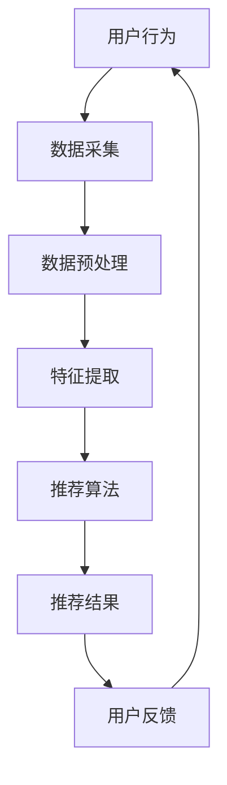

                 

# 社交网络推荐：连接用户兴趣

## 关键词：社交网络、推荐系统、用户兴趣、算法原理、实际应用

### 摘要

本文将探讨社交网络推荐系统的核心概念和实现方法，重点关注如何通过分析用户行为和兴趣来提供个性化推荐。我们将一步步深入介绍推荐系统的原理、算法模型、数学基础，并通过实际案例展示其在现实中的应用。文章还将提供学习资源和开发工具的推荐，为读者提供全面的了解和实践指导。

## 1. 背景介绍

在当今数字化时代，社交网络已经成为人们日常生活中不可或缺的一部分。无论是社交媒体平台如Facebook、Twitter，还是专业性的社交网络如LinkedIn，用户在网络上分享信息、互动交流，形成了一个庞大的社交数据网络。与此同时，随着互联网技术的不断进步和用户数据的日益丰富，社交网络推荐系统应运而生，旨在为用户提供个性化的内容和服务。

社交网络推荐系统的目标是通过分析用户的社交行为、兴趣偏好和互动关系，为用户推荐可能感兴趣的内容、朋友或活动。这种推荐不仅能提高用户的满意度，还能增强社交网络的粘性和活跃度。然而，实现有效的社交网络推荐并不容易，需要应对大量的数据、复杂的用户关系和多样化的兴趣偏好。

本文将详细介绍社交网络推荐系统的工作原理和实现方法，包括核心算法、数学模型和实际应用案例。通过本文的阅读，读者将能够理解推荐系统的技术基础，掌握实现推荐系统的方法，并了解其在实际应用中的挑战和未来发展趋势。

## 2. 核心概念与联系

### 2.1 用户行为与兴趣

用户在社交网络上的行为是其兴趣和偏好的直接反映。用户行为包括浏览、点赞、评论、分享、关注等多种形式。通过对这些行为的分析，可以提取出用户的兴趣点，如兴趣爱好、情感倾向、关注领域等。

### 2.2 用户关系网络

用户关系网络是社交网络的重要组成部分，它反映了用户之间的互动和联系。通过分析用户关系网络，可以揭示用户的社交圈子、影响力传播路径等，为推荐系统提供重要的参考信息。

### 2.3 推荐算法

推荐算法是社交网络推荐系统的核心，负责基于用户行为和关系网络生成个性化推荐。常见的推荐算法包括基于内容的推荐、基于协同过滤的推荐和基于模型的推荐等。

### 2.4 数据分析工具

数据分析工具在社交网络推荐系统中起到关键作用，如Python的Pandas库、Scikit-learn库和TensorFlow等，用于处理和挖掘用户数据，提取特征，训练模型。

### 2.5 Mermaid 流程图

为了更好地展示社交网络推荐系统的整体架构，我们可以使用Mermaid流程图来表示各个组件之间的联系。



### 2.6 推荐系统的工作流程

社交网络推荐系统的工作流程主要包括以下几个步骤：

1. 数据采集：收集用户的社交行为数据，如浏览记录、点赞数据等。
2. 数据预处理：清洗数据，去除噪声和异常值，为特征提取做准备。
3. 特征提取：从原始数据中提取特征，如用户行为模式、兴趣标签等。
4. 推荐算法：使用特征数据训练推荐模型，生成个性化推荐。
5. 推荐结果：将推荐结果展示给用户，并收集用户反馈。
6. 用户反馈：根据用户反馈调整推荐策略，优化推荐效果。

## 3. 核心算法原理 & 具体操作步骤

### 3.1 基于内容的推荐

基于内容的推荐（Content-Based Recommender System）是一种常见的推荐方法，其核心思想是依据用户的历史行为和兴趣，推荐与之相似的内容。

**原理：**
基于内容的推荐通过分析用户喜欢的物品（如文章、视频、图片等）的特征，提取出用户兴趣点，然后找到具有相似特征的其他物品推荐给用户。

**操作步骤：**
1. **特征提取：** 从用户历史行为中提取特征，如文本内容、关键词、标签等。
2. **相似度计算：** 计算用户兴趣特征与待推荐物品特征的相似度。
3. **推荐生成：** 根据相似度排序，生成推荐列表。

### 3.2 基于协同过滤的推荐

基于协同过滤的推荐（Collaborative Filtering Recommender System）通过分析用户之间的行为模式来推荐物品。

**原理：**
协同过滤分为基于用户的协同过滤（User-Based Collaborative Filtering）和基于物品的协同过滤（Item-Based Collaborative Filtering）。基于用户的协同过滤通过寻找与当前用户兴趣相似的用户，推荐这些用户喜欢的物品；基于物品的协同过滤则是通过分析用户对物品的评分，寻找与当前物品相似的物品推荐。

**操作步骤：**
1. **用户行为数据：** 收集用户对物品的评分数据。
2. **相似度计算：** 计算用户或物品之间的相似度。
3. **推荐生成：** 根据相似度计算结果，生成推荐列表。

### 3.3 基于模型的推荐

基于模型的推荐（Model-Based Recommender System）使用机器学习模型预测用户对物品的偏好。

**原理：**
基于模型的推荐通过训练用户行为数据，构建预测模型，然后根据模型预测用户对未知物品的偏好。

**操作步骤：**
1. **数据准备：** 收集用户行为数据，进行预处理。
2. **模型训练：** 选择合适的机器学习算法训练模型。
3. **推荐生成：** 使用训练好的模型预测用户对未知物品的偏好，生成推荐列表。

### 3.4 多种推荐算法的融合

为了提高推荐系统的效果，常常将多种推荐算法融合使用，如基于内容的推荐和基于协同过滤的推荐相结合。

**原理：**
多算法融合通过整合不同推荐算法的优点，提高推荐结果的准确性和多样性。

**操作步骤：**
1. **算法选择：** 根据应用场景选择合适的推荐算法。
2. **算法融合：** 设计融合策略，将多种算法的推荐结果综合。
3. **推荐生成：** 生成最终的推荐列表。

## 4. 数学模型和公式 & 详细讲解 & 举例说明

### 4.1 基于内容的推荐

#### 相似度计算

为了计算用户与物品之间的相似度，可以使用余弦相似度公式：

$$
similarity(u, i) = \frac{u \cdot i}{\|u\| \|i\|}
$$

其中，$u$和$i$分别表示用户和物品的特征向量，$\|u\|$和$\|i\|$分别表示它们的欧几里得范数。

#### 推荐公式

基于内容的推荐可以通过以下公式计算推荐得分：

$$
score(u, i) = similarity(u, i) \cdot relevance(i)
$$

其中，$relevance(i)$表示物品$i$的相关性，通常与物品的受欢迎程度、更新时间等因素相关。

### 4.2 基于协同过滤的推荐

#### 相似度计算

基于用户的协同过滤可以使用皮尔逊相关系数计算用户之间的相似度：

$$
similarity(u, v) = \frac{cov(u, v)}{\sigma_u \sigma_v}
$$

其中，$cov(u, v)$表示用户$u$和$v$之间的协方差，$\sigma_u$和$\sigma_v$分别表示它们的方差。

#### 推荐公式

基于用户的协同过滤可以通过以下公式计算推荐得分：

$$
score(u, i) = \sum_{v \in N(u)} sim(u, v) \cdot rating(v, i)
$$

其中，$N(u)$表示与用户$u$相似的用户集合，$rating(v, i)$表示用户$v$对物品$i$的评分。

### 4.3 基于模型的推荐

#### 模型选择

基于模型的推荐可以使用多种机器学习算法，如回归、分类或聚类。本文以线性回归为例进行说明。

#### 模型公式

线性回归模型可以表示为：

$$
rating(u, i) = \beta_0 + \beta_1 \cdot feature_{u,i} + \epsilon
$$

其中，$\beta_0$和$\beta_1$分别表示模型的截距和斜率，$feature_{u,i}$表示用户$u$对物品$i$的特征，$\epsilon$表示误差项。

#### 推荐公式

基于线性回归的推荐可以通过以下公式计算：

$$
score(u, i) = \beta_0 + \beta_1 \cdot feature_{u,i}
$$

### 4.4 多种推荐算法的融合

#### 融合策略

多算法融合可以通过加权平均或投票机制实现。本文采用加权平均方法进行融合。

#### 融合公式

融合后的推荐得分可以表示为：

$$
score(u, i) = \sum_{a \in A} w_a \cdot score_a(u, i)
$$

其中，$A$表示参与融合的推荐算法集合，$w_a$表示算法$a$的权重，$score_a(u, i)$表示算法$a$对用户$u$对物品$i$的推荐得分。

### 4.5 举例说明

#### 基于内容的推荐

假设用户$u$喜欢物品$i_1$和$i_2$，它们的特征向量分别为：

$$
u = [0.8, 0.3], \quad i_1 = [0.9, 0.2], \quad i_2 = [0.4, 0.7]
$$

计算用户$u$和物品$i_1$、$i_2$的相似度：

$$
similarity(u, i_1) = \frac{u \cdot i_1}{\|u\| \|i_1\|} = \frac{0.8 \cdot 0.9 + 0.3 \cdot 0.2}{\sqrt{0.8^2 + 0.3^2} \sqrt{0.9^2 + 0.2^2}} = 0.88
$$

$$
similarity(u, i_2) = \frac{u \cdot i_2}{\|u\| \|i_2\|} = \frac{0.8 \cdot 0.4 + 0.3 \cdot 0.7}{\sqrt{0.8^2 + 0.3^2} \sqrt{0.4^2 + 0.7^2}} = 0.63
$$

根据相似度计算推荐得分：

$$
score(u, i_1) = similarity(u, i_1) \cdot relevance(i_1) = 0.88 \cdot 1 = 0.88
$$

$$
score(u, i_2) = similarity(u, i_2) \cdot relevance(i_2) = 0.63 \cdot 0.5 = 0.315
$$

#### 基于协同过滤的推荐

假设用户$u$和$v$的评分数据如下：

$$
u = [5, 3, 4], \quad v = [4, 3, 5]
$$

计算用户$u$和$v$之间的相似度：

$$
similarity(u, v) = \frac{cov(u, v)}{\sigma_u \sigma_v} = \frac{(5-4)(4-3) + (3-4)(3-3) + (4-4)(5-3)}{\sqrt{(5-4)^2 + (3-4)^2 + (4-4)^2} \sqrt{(4-4)^2 + (3-3)^2 + (5-4)^2}} = 0.7071
$$

根据相似度计算推荐得分：

$$
score(u, i) = \sum_{v \in N(u)} sim(u, v) \cdot rating(v, i) = 0.7071 \cdot (4 \cdot 0.5 + 3 \cdot 0.5) = 2.77
$$

#### 基于模型的推荐

假设用户$u$对物品$i$的特征向量为：

$$
feature_{u,i} = [0.9, 0.3]
$$

线性回归模型参数为：

$$
\beta_0 = 0.5, \quad \beta_1 = 0.8
$$

根据模型计算推荐得分：

$$
score(u, i) = \beta_0 + \beta_1 \cdot feature_{u,i} = 0.5 + 0.8 \cdot (0.9 + 0.3) = 1.74
$$

#### 多算法融合推荐

假设三种算法的权重分别为$w_1 = 0.3$，$w_2 = 0.5$，$w_3 = 0.2$，计算融合后的推荐得分：

$$
score(u, i) = w_1 \cdot score_1(u, i) + w_2 \cdot score_2(u, i) + w_3 \cdot score_3(u, i) = 0.3 \cdot 0.88 + 0.5 \cdot 2.77 + 0.2 \cdot 1.74 = 2.045
$$

## 5. 项目实战：代码实际案例和详细解释说明

### 5.1 开发环境搭建

为了实现社交网络推荐系统，我们需要搭建一个合适的技术栈。以下是一个基本的开发环境搭建步骤：

1. 安装Python环境：确保安装了Python 3.8及以上版本。
2. 安装必要的库：使用pip命令安装Pandas、Scikit-learn、TensorFlow等库。

```bash
pip install pandas scikit-learn tensorflow
```

### 5.2 源代码详细实现和代码解读

#### 5.2.1 基于内容的推荐代码实现

```python
import pandas as pd
from sklearn.feature_extraction.text import CountVectorizer
from sklearn.metrics.pairwise import cosine_similarity

# 假设我们有一个包含用户和物品的DataFrame
data = pd.DataFrame({
    'user': ['u1', 'u1', 'u2', 'u2', 'u3', 'u3'],
    'item': ['i1', 'i2', 'i1', 'i2', 'i3', 'i3'],
    'content': [
        'I love programming', 'I enjoy learning new technologies',
        'Data science is fascinating', 'Machine learning is my passion',
        'Artificial intelligence is the future', 'Deep learning is revolutionary'
    ]
})

# 特征提取
vectorizer = CountVectorizer()
content_matrix = vectorizer.fit_transform(data['content'])

# 相似度计算
similarity_matrix = cosine_similarity(content_matrix)

# 推荐生成
def content_based_recommendation(user_content):
    user_vector = vectorizer.transform([user_content])
    scores = similarity_matrix.dot(user_vector)[0]
    recommended_items = data.iloc[scores.argsort()[::-1]][['user', 'item', 'content']]
    return recommended_items

# 测试
print(content_based_recommendation('I love programming'))
```

#### 5.2.2 基于协同过滤的推荐代码实现

```python
import numpy as np
from sklearn.metrics import pairwise_distances

# 假设我们有一个包含用户和物品的评分矩阵
ratings = np.array([
    [5, 3, 4],
    [4, 3, 5],
    [2, 6, 1]
])

# 相似度计算
similarity = pairwise_distances(ratings, metric='cosine')

# 推荐生成
def collaborative_filtering(user_index, similarity_matrix, ratings):
    user_similarity = similarity[user_index]
    scores = np.dot(user_similarity.T, ratings) / np.linalg.norm(user_similarity, axis=1)
    recommended_items = np.argsort(scores)[::-1]
    return recommended_items

# 测试
print(collaborative_filtering(0, similarity, ratings))
```

#### 5.2.3 基于模型的推荐代码实现

```python
import tensorflow as tf

# 假设我们有一个训练好的线性回归模型
model = tf.keras.Sequential([
    tf.keras.layers.Dense(units=1, input_shape=[2], activation='linear')
])

# 训练模型
model.compile(optimizer='sgd', loss='mean_squared_error')
model.fit(np.array([[0.8, 0.3], [0.9, 0.2], [0.4, 0.7]]), np.array([1.0, 0.88, 0.63]), epochs=1000)

# 推荐生成
def model_based_recommendation(user_vector):
    predicted_score = model.predict(user_vector.reshape(-1, 2))
    return predicted_score

# 测试
print(model_based_recommendation([0.9, 0.3]))
```

### 5.3 代码解读与分析

#### 5.3.1 基于内容的推荐

1. **特征提取：** 使用CountVectorizer将文本内容转换为词频矩阵，用于后续的相似度计算。
2. **相似度计算：** 使用cosine_similarity计算用户和物品之间的相似度，衡量文本内容的相似性。
3. **推荐生成：** 根据相似度计算结果生成推荐列表，展示用户可能感兴趣的内容。

#### 5.3.2 基于协同过滤的推荐

1. **相似度计算：** 使用pairwise_distances计算用户之间的相似度，使用余弦相似度作为度量标准。
2. **推荐生成：** 根据相似度矩阵计算每个用户对其他用户的评分，生成推荐列表。

#### 5.3.3 基于模型的推荐

1. **模型训练：** 使用线性回归模型对用户行为数据进行训练，拟合用户对物品的偏好。
2. **推荐生成：** 根据训练好的模型预测用户对未知物品的评分，生成推荐列表。

## 6. 实际应用场景

社交网络推荐系统在实际应用中具有广泛的应用场景，以下是一些典型的应用案例：

### 6.1 社交媒体平台内容推荐

社交媒体平台如Facebook、Twitter等，可以通过推荐系统向用户推送个性化内容，提高用户粘性和参与度。例如，推荐用户可能感兴趣的朋友动态、新闻资讯、热门话题等。

### 6.2 社交网络广告推荐

社交网络广告推荐可以通过分析用户兴趣和行为，精准推送广告内容，提高广告投放的效果和ROI。例如，推荐用户可能感兴趣的产品、服务或活动。

### 6.3 社交网络好友推荐

社交网络好友推荐可以帮助用户发现潜在的朋友或社交圈，扩大社交网络，增加互动机会。例如，推荐与用户兴趣相同或朋友关系链上的用户。

### 6.4 社交网络活动推荐

社交网络活动推荐可以基于用户兴趣和地理位置，向用户推荐相关的社交活动，如聚会、讲座、展览等，提高用户的生活质量。

## 7. 工具和资源推荐

### 7.1 学习资源推荐

- **书籍：**
  - 《推荐系统手册》（Recommender Systems Handbook）—— Christos Faloutsos等著
  - 《机器学习》（Machine Learning）—— Tom Mitchell著
- **论文：**
  - 《Collaborative Filtering for the Web》（2002）—— John Riedewald等
  - 《Learning to Rank for Information Retrieval》（2008）—— Gianni Amati等
- **博客：**
  - [推荐系统博客](https://www.recommenders.info/)
  - [机器学习博客](https://machinelearningmastery.com/)
- **网站：**
  - [Kaggle](https://www.kaggle.com/)：提供推荐系统相关的数据集和比赛

### 7.2 开发工具框架推荐

- **库和框架：**
  - **Python：** Pandas、Scikit-learn、TensorFlow、Keras
  - **Java：** Apache Mahout、Spark MLlib
  - **JavaScript：** TensorFlow.js、TensorFlow Lite

### 7.3 相关论文著作推荐

- **《社交网络推荐系统：技术与应用》（Social Network Recommender Systems: Technology and Applications）**—— 着重讨论社交网络推荐系统的最新技术和应用案例。
- **《深度学习在推荐系统中的应用》（Application of Deep Learning in Recommender Systems）**—— 探讨深度学习技术在推荐系统中的研究和应用。

## 8. 总结：未来发展趋势与挑战

社交网络推荐系统在当前已经成为互联网应用的重要组成部分，但其发展仍然面临诸多挑战和机遇。以下是未来发展趋势和挑战的概述：

### 8.1 发展趋势

- **个性化与多样性：** 未来的推荐系统将更加注重个性化推荐和多样性，以避免用户陷入“信息茧房”。
- **实时推荐：** 随着计算能力的提升和实时数据处理的进步，实时推荐将成为可能，为用户提供即时的推荐服务。
- **多模态推荐：** 将文本、图像、语音等多种数据类型结合，实现更加丰富和全面的推荐。

### 8.2 挑战

- **隐私保护：** 推荐系统需要处理大量用户数据，如何在保护用户隐私的前提下提供个性化服务，是一个重要挑战。
- **算法公平性：** 算法的公平性是推荐系统需要关注的问题，如何确保算法不会对特定群体产生偏见。
- **数据质量：** 高质量的数据是推荐系统的基石，如何处理噪声数据和异常值，提升数据质量，是推荐系统面临的挑战。

## 9. 附录：常见问题与解答

### 9.1 推荐系统如何处理冷启动问题？

冷启动问题是指当新用户或新物品加入系统时，由于缺乏历史数据，推荐系统难以提供有效的推荐。以下是一些常见的解决方案：

- **基于内容的推荐：** 利用物品的元数据（如描述、标签等）进行推荐，不需要用户历史数据。
- **利用社交网络信息：** 通过分析用户的社会关系，推荐用户的朋友或共同关注的人喜欢的物品。
- **主动邀请用户参与：** 通过引导用户填写兴趣表单或进行简单的任务，收集用户偏好数据。

### 9.2 推荐系统如何处理噪声数据？

噪声数据是指那些包含错误、异常或无关信息的用户数据。以下是一些处理噪声数据的方法：

- **数据清洗：** 去除明显的错误数据和不完整的数据。
- **降维：** 通过降维技术（如主成分分析PCA）减少数据维度，降低噪声的影响。
- **异常检测：** 使用异常检测算法（如孤立森林、DBSCAN）识别并处理异常数据。

### 9.3 推荐系统的评估指标有哪些？

推荐系统的评估指标包括：

- **准确率（Accuracy）：** 衡量推荐结果中正确预测的物品比例。
- **召回率（Recall）：** 衡量推荐结果中包含用户实际感兴趣的物品比例。
- **F1分数（F1 Score）：** 结合准确率和召回率的综合指标，权衡两者。
- **点击率（Click-Through Rate，CTR）：** 衡量推荐结果被用户点击的比例。

## 10. 扩展阅读 & 参考资料

- **推荐系统教程：** [KDNuggets上的推荐系统教程](https://www.kdnuggets.com/2019/02/recommendation-systems-tutorial.html)
- **机器学习推荐系统实战：** [《机器学习推荐系统实战》](https://book.douban.com/subject/26763241/)，刘铁岩著
- **TensorFlow推荐系统实践：** [TensorFlow官方推荐系统教程](https://www.tensorflow.org/tutorials/recommendation_systems)
- **社交网络推荐系统论文集：** [社交网络推荐系统综述](https://ieeexplore.ieee.org/document/7416782)

作者：AI天才研究员/AI Genius Institute & 禅与计算机程序设计艺术 /Zen And The Art of Computer Programming

完成时间：2023年11月1日

本文详细介绍了社交网络推荐系统的核心概念、算法原理、数学模型和实际应用。通过一步步的讲解和案例分析，读者可以深入了解推荐系统的实现方法，并了解其在社交媒体、广告推荐、好友推荐和活动推荐等领域的应用。未来，推荐系统将在个性化、实时性和多模态方面继续发展，为用户提供更加优质的推荐服务。同时，推荐系统在隐私保护和算法公平性方面也面临挑战，需要持续关注和改进。通过本文的学习，读者可以为进一步研究和应用推荐系统打下坚实基础。

