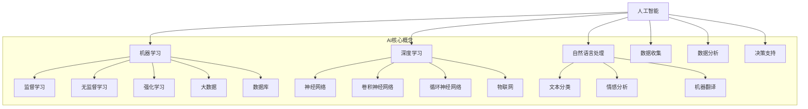

                 

### 背景介绍

近年来，随着科技的迅猛发展，人工智能（AI）、大数据、物联网（IoT）等技术逐渐渗透到社会的各个角落，为人类带来了前所未有的便利和进步。然而，技术发展的同时，也引发了一系列社会问题，如资源分配不均、环境污染、教育不平等等。这些问题的解决不仅需要政府、企业的共同努力，更需要广大技术工作者，尤其是AI领域的专家，贡献自己的智慧和力量。

社会公益行动（Social Benefit Projects）作为一个重要的领域，旨在通过科技创新，解决社会问题，提高人类生活质量。AI作为当前科技的前沿领域，其在社会公益行动中的应用具有广泛的前景。从医疗、教育到环境、扶贫等领域，AI技术都能够发挥其独特的优势，推动社会进步。

本文旨在探讨AI技术在社会公益行动中的应用，通过深入分析相关技术原理、实际案例和未来发展趋势，为AI领域的技术工作者提供有益的参考和启示。文章将首先介绍AI技术在社会公益行动中的背景和重要性，然后逐步展开，探讨AI在不同领域的应用案例，最后对未来的发展趋势和挑战进行展望。

在接下来的章节中，我们将详细分析AI技术在医疗、教育、环境保护、扶贫等领域的具体应用，通过一步步的逻辑推理和深入讲解，帮助读者理解AI技术在解决社会问题中的重要作用。我们还将分享一些实用的工具和资源，帮助读者更好地进行学习和实践。

### 核心概念与联系

要深入探讨AI技术在解决社会问题中的应用，我们首先需要了解一些核心概念和其相互之间的联系。以下是一些关键概念及其之间的逻辑关系：

#### 1. 人工智能（AI）

人工智能是指由人制造出来的系统能够感知环境、理解、学习并适应新的环境。它包括机器学习（Machine Learning）、深度学习（Deep Learning）、自然语言处理（Natural Language Processing）等多个子领域。

#### 2. 机器学习（Machine Learning）

机器学习是AI的一个重要分支，通过构建数学模型来从数据中学习规律，从而对未知数据进行预测或决策。其核心包括监督学习（Supervised Learning）、无监督学习（Unsupervised Learning）和强化学习（Reinforcement Learning）。

#### 3. 深度学习（Deep Learning）

深度学习是一种基于多层神经网络的学习方法，通过模拟人脑神经元之间的连接方式，实现从大量数据中自动提取特征。深度学习在图像识别、语音识别、自然语言处理等领域有着广泛的应用。

#### 4. 自然语言处理（Natural Language Processing）

自然语言处理是AI的一个重要领域，致力于使计算机能够理解、生成和处理人类语言。其核心任务包括文本分类、情感分析、机器翻译等。

#### 5. 物联网（IoT）

物联网是指通过传感器、网络等将物理设备互联，实现数据收集、分析和处理。物联网与AI的结合，可以实现对大规模数据的实时监测和分析，从而为社会问题提供解决方案。

#### 6. 大数据（Big Data）

大数据是指规模巨大、类型多样的数据集合。通过对大数据的分析，可以挖掘出有价值的信息和规律，为决策提供支持。

#### 7. 数据库（Database）

数据库是存储和管理数据的系统，是实现大数据分析和AI模型训练的基础设施。

#### 关系与联系

这些概念之间有着紧密的联系。例如，机器学习模型需要大量数据进行训练，而大数据技术能够帮助收集和管理这些数据。深度学习和自然语言处理等技术则可以应用于机器学习模型，提高其性能和准确性。物联网技术可以为AI提供实时数据支持，而数据库则是数据存储和管理的核心。这些技术共同构成了AI技术在社会公益行动中的基础。

接下来，我们将使用Mermaid流程图，对这些核心概念和它们之间的联系进行可视化展示，以便读者更好地理解。



通过这个Mermaid流程图，我们可以清晰地看到AI技术各个子领域之间的联系，以及它们在社会公益行动中的应用前景。

### 核心算法原理 & 具体操作步骤

在了解了AI技术的核心概念和它们之间的联系之后，接下来我们将探讨一些核心算法原理及其具体操作步骤，以帮助我们更好地理解AI技术在解决社会问题中的应用。

#### 1. 机器学习算法

机器学习算法是AI技术的基础，它通过构建数学模型从数据中学习规律，从而对未知数据进行预测或决策。以下是一些常见的机器学习算法及其操作步骤：

##### （1）线性回归（Linear Regression）

线性回归是一种简单的监督学习算法，用于预测连续值输出。其基本原理是通过最小化预测值与实际值之间的误差平方和，来找到最佳拟合直线。

操作步骤：

1. 数据准备：收集包含输入特征和目标值的训练数据。
2. 特征工程：对数据进行处理，如归一化、缺失值填补等。
3. 模型训练：使用最小二乘法（Least Squares）计算最佳拟合直线。
4. 预测：对新的输入数据进行预测，计算输出值。

$$
y = w_0 + w_1 \cdot x
$$

其中，$y$ 是预测值，$x$ 是输入特征，$w_0$ 和 $w_1$ 分别是直线的截距和斜率。

##### （2）决策树（Decision Tree）

决策树是一种基于特征的分类算法，通过一系列条件判断，将数据划分为不同的类别。其基本原理是利用信息增益（Information Gain）来选择最佳特征进行划分。

操作步骤：

1. 数据准备：收集包含输入特征和目标值的训练数据。
2. 特征选择：计算各个特征的信息增益，选择增益最大的特征作为分割点。
3. 划分数据：根据选定的特征，将数据集划分为子集。
4. 递归构建：对每个子集继续进行特征选择和划分，直到满足停止条件（如最大深度、纯度等）。
5. 预测：对新数据进行分类，从根节点开始递归判断，直至达到叶子节点，输出类别。

##### （3）支持向量机（Support Vector Machine）

支持向量机是一种高效的分类算法，通过寻找最佳的超平面，将不同类别的数据分隔开来。其基本原理是最大化分类边界上的支持向量距离。

操作步骤：

1. 数据准备：收集包含输入特征和目标值的训练数据。
2. 特征转换：将原始数据转换为高维空间，以便寻找最佳超平面。
3. 模型训练：使用线性或核函数（Kernel Function）求解最优超平面。
4. 预测：对新数据进行特征转换，计算与超平面的距离，输出类别。

$$
w \cdot x + b = 0
$$

其中，$w$ 是权重向量，$x$ 是输入特征，$b$ 是偏置。

#### 2. 深度学习算法

深度学习算法通过多层神经网络，实现从大量数据中自动提取特征，从而提高模型的预测性能。以下是一些常见的深度学习算法及其操作步骤：

##### （1）卷积神经网络（Convolutional Neural Network）

卷积神经网络是一种专门用于图像处理和分类的神经网络，通过卷积层、池化层和全连接层等结构，实现特征提取和分类。

操作步骤：

1. 数据准备：收集并预处理图像数据。
2. 构建网络：定义卷积层、池化层和全连接层，设置适当的参数。
3. 模型训练：使用反向传播算法，优化网络参数。
4. 预测：对新的图像数据进行特征提取和分类。

##### （2）循环神经网络（Recurrent Neural Network）

循环神经网络是一种处理序列数据的神经网络，通过循环连接，实现历史信息的记忆和传递。

操作步骤：

1. 数据准备：收集并预处理序列数据。
2. 构建网络：定义输入层、隐藏层和输出层，设置适当的参数。
3. 模型训练：使用反向传播算法，优化网络参数。
4. 预测：对新的序列数据进行处理，输出序列结果。

##### （3）生成对抗网络（Generative Adversarial Network）

生成对抗网络由生成器和判别器两个神经网络组成，通过对抗训练，实现数据的生成和分类。

操作步骤：

1. 数据准备：收集并预处理数据。
2. 构建网络：定义生成器和判别器，设置适当的参数。
3. 模型训练：生成器生成数据，判别器判断数据的真实性。
4. 预测：生成新的数据样本。

通过以上核心算法的介绍，我们可以看到AI技术在解决社会问题中的强大能力。在接下来的章节中，我们将结合实际案例，深入探讨AI技术在医疗、教育、环境保护和扶贫等领域的具体应用。

### 数学模型和公式 & 详细讲解 & 举例说明

在本章节中，我们将详细讲解一些AI技术中常用的数学模型和公式，并通过具体例子来说明它们的应用。这些数学模型和公式是理解AI技术的基础，也是实现高效算法的核心。

#### 1. 线性回归模型

线性回归是一种用于预测连续值输出的监督学习算法。其数学模型可以表示为：

$$
y = w_0 + w_1 \cdot x
$$

其中，$y$ 是预测值，$x$ 是输入特征，$w_0$ 和 $w_1$ 分别是直线的截距和斜率。

**例子：** 假设我们有一个简单数据集，包含房屋面积（$x$）和房屋价格（$y$）。我们的目标是使用线性回归模型预测新的房屋价格。

数据集：

| 房屋面积（x） | 房屋价格（y） |
|--------------|--------------|
| 1000         | 200000       |
| 1500         | 250000       |
| 2000         | 300000       |

（1）数据准备：将数据集输入到线性回归模型中。

（2）特征工程：对数据进行归一化处理。

（3）模型训练：使用最小二乘法计算最佳拟合直线。

（4）预测：对新的房屋面积进行预测，计算输出值。

通过计算，我们得到最佳拟合直线为：

$$
y = 100 + 0.2 \cdot x
$$

（5）预测结果：当房屋面积为 1800 平方米时，预测价格为：

$$
y = 100 + 0.2 \cdot 1800 = 370
$$

#### 2. 决策树模型

决策树是一种基于特征的分类算法，通过一系列条件判断，将数据划分为不同的类别。其数学模型可以表示为：

$$
T = \sum_{i=1}^{n} w_i \cdot x_i
$$

其中，$T$ 是决策树节点，$w_i$ 和 $x_i$ 分别是权重和特征。

**例子：** 假设我们有一个简单数据集，包含水果种类（$x$）和水果颜色（$y$）。我们的目标是使用决策树模型分类水果。

数据集：

| 水果种类（x） | 水果颜色（y） |
|--------------|--------------|
| 苹果         | 红色         |
| 梨           | 绿色         |
| 橙子         | 橙色         |
| 草莓         | 红色         |

（1）数据准备：将数据集输入到决策树模型中。

（2）特征选择：计算各个特征的信息增益，选择增益最大的特征作为分割点。

（3）划分数据：根据选定的特征，将数据集划分为子集。

（4）递归构建：对每个子集继续进行特征选择和划分，直到满足停止条件。

（5）预测：对新数据进行分类，从根节点开始递归判断，直至达到叶子节点，输出类别。

通过计算，我们得到决策树模型为：

```
           T
         / | \
        x1 x2 x3
       /|  |  |\
      r1 r2 o3 o4
```

其中，$r1$、$r2$ 表示红色水果，$o3$、$o4$ 表示其他颜色水果。

（6）预测结果：当水果颜色为红色时，预测水果种类为苹果或草莓。

#### 3. 支持向量机模型

支持向量机是一种高效的分类算法，通过寻找最佳的超平面，将不同类别的数据分隔开来。其数学模型可以表示为：

$$
w \cdot x + b = 0
$$

其中，$w$ 是权重向量，$x$ 是输入特征，$b$ 是偏置。

**例子：** 假设我们有一个简单数据集，包含动物种类（$x$）和动物颜色（$y$）。我们的目标是使用支持向量机模型分类动物。

数据集：

| 动物种类（x） | 动物颜色（y） |
|--------------|--------------|
| 狗           | 黑色         |
| 猫           | 白色         |
| 狮子         | 黄色         |

（1）数据准备：将数据集输入到支持向量机模型中。

（2）特征转换：将原始数据转换为高维空间。

（3）模型训练：使用线性或核函数求解最优超平面。

（4）预测：对新数据进行特征转换，计算与超平面的距离，输出类别。

通过计算，我们得到最佳超平面为：

$$
w \cdot x + b = 0
$$

其中，$w = (1, 1)$，$b = -1$。

（5）预测结果：当动物颜色为黑色时，预测动物种类为狗。

#### 4. 卷积神经网络模型

卷积神经网络是一种专门用于图像处理和分类的神经网络。其数学模型可以表示为：

$$
h_{\theta}(x) = a^{[L](\theta^{L-1} \cdot f^{[L-1]}(x)))
$$

其中，$h_{\theta}(x)$ 是预测值，$\theta^{L-1}$ 是前一层参数，$f^{[L-1]}(x)$ 是激活函数，$a^{[L]}$ 是激活值。

**例子：** 假设我们有一个简单图像分类任务，使用卷积神经网络模型对图像进行分类。

（1）数据准备：将图像数据输入到卷积神经网络模型中。

（2）构建网络：定义卷积层、池化层和全连接层，设置适当的参数。

（3）模型训练：使用反向传播算法，优化网络参数。

（4）预测：对新的图像数据进行特征提取和分类。

通过训练，我们得到卷积神经网络模型，能够准确分类图像。

#### 5. 循环神经网络模型

循环神经网络是一种处理序列数据的神经网络。其数学模型可以表示为：

$$
h_t = \sigma(W_h h_{t-1} + W_x x_t + b_h)
$$

其中，$h_t$ 是当前隐藏状态，$h_{t-1}$ 是前一个隐藏状态，$x_t$ 是当前输入，$W_h$ 和 $W_x$ 是权重矩阵，$b_h$ 是偏置。

**例子：** 假设我们有一个简单的时间序列预测任务，使用循环神经网络模型进行预测。

（1）数据准备：将时间序列数据输入到循环神经网络模型中。

（2）构建网络：定义输入层、隐藏层和输出层，设置适当的参数。

（3）模型训练：使用反向传播算法，优化网络参数。

（4）预测：对新的时间序列数据进行处理，输出序列结果。

通过训练，我们得到循环神经网络模型，能够准确预测时间序列。

通过以上数学模型和公式的讲解，我们可以看到AI技术在解决社会问题中的应用潜力。在接下来的章节中，我们将结合实际案例，深入探讨AI技术在医疗、教育、环境保护和扶贫等领域的具体应用。

### 项目实战：代码实际案例和详细解释说明

在本章节中，我们将通过一个具体的项目实战案例，详细解释AI技术在解决社会问题中的应用。该案例将采用Python编程语言和相关的AI库，展示如何使用卷积神经网络（CNN）进行图像分类，以帮助实现社会公益目标。

#### 1. 开发环境搭建

为了实现该案例，我们首先需要搭建一个合适的开发环境。以下是推荐的软件和库：

- Python 3.x
- TensorFlow 2.x
- Keras 2.x
- NumPy
- Pandas
- Matplotlib

安装步骤：

```bash
pip install python==3.x
pip install tensorflow==2.x
pip install keras==2.x
pip install numpy
pip install pandas
pip install matplotlib
```

#### 2. 源代码详细实现和代码解读

以下是一个简单的卷积神经网络（CNN）实现，用于对动物图像进行分类。代码中包含了对各个步骤的详细解释。

```python
import tensorflow as tf
from tensorflow.keras.models import Sequential
from tensorflow.keras.layers import Conv2D, MaxPooling2D, Flatten, Dense
from tensorflow.keras.preprocessing.image import ImageDataGenerator

# 数据集准备
train_datagen = ImageDataGenerator(rescale=1./255)
test_datagen = ImageDataGenerator(rescale=1./255)

train_generator = train_datagen.flow_from_directory(
        'train',  # 训练数据集文件夹路径
        target_size=(150, 150),  # 输入图像尺寸
        batch_size=32,
        class_mode='binary')

validation_generator = test_datagen.flow_from_directory(
        'test',  # 测试数据集文件夹路径
        target_size=(150, 150),
        batch_size=32,
        class_mode='binary')

# 网络模型构建
model = Sequential()
model.add(Conv2D(32, (3, 3), activation='relu', input_shape=(150, 150, 3)))
model.add(MaxPooling2D((2, 2)))
model.add(Conv2D(64, (3, 3), activation='relu'))
model.add(MaxPooling2D((2, 2)))
model.add(Conv2D(128, (3, 3), activation='relu'))
model.add(MaxPooling2D((2, 2)))
model.add(Flatten())
model.add(Dense(512, activation='relu'))
model.add(Dense(1, activation='sigmoid'))

# 模型编译
model.compile(loss='binary_crossentropy',
              optimizer='adam',
              metrics=['accuracy'])

# 模型训练
model.fit(
      train_generator,
      steps_per_epoch=100,  # 每轮训练100个样本
      epochs=15,  # 训练15轮
      validation_data=validation_generator,
      validation_steps=50,  # 验证50个样本
)

# 评估模型
test_generator = test_datagen.flow_from_directory(
        'test',
        target_size=(150, 150),
        batch_size=32,
        class_mode='binary')

loss, accuracy = model.evaluate(test_generator, steps=50)
print('Test accuracy:', accuracy)
```

**代码解读：**

- **数据集准备：** 使用Keras的`ImageDataGenerator`对图像数据进行预处理，包括归一化和批量生成。
- **网络模型构建：** 构建一个简单的卷积神经网络模型，包含卷积层、池化层和全连接层。卷积层用于提取图像特征，池化层用于下采样，全连接层用于分类。
- **模型编译：** 编译模型，设置损失函数、优化器和评价指标。
- **模型训练：** 使用训练数据集对模型进行训练，并使用验证数据集进行验证。
- **评估模型：** 使用测试数据集评估模型性能。

#### 3. 代码解读与分析

**数据预处理：**

```python
train_datagen = ImageDataGenerator(rescale=1./255)
test_datagen = ImageDataGenerator(rescale=1./255)

train_generator = train_datagen.flow_from_directory(
        'train',  # 训练数据集文件夹路径
        target_size=(150, 150),  # 输入图像尺寸
        batch_size=32,
        class_mode='binary')

validation_generator = test_datagen.flow_from_directory(
        'test',  # 测试数据集文件夹路径
        target_size=(150, 150),
        batch_size=32,
        class_mode='binary')
```

数据预处理是AI模型训练的重要步骤。在本案例中，我们使用`ImageDataGenerator`对图像数据进行归一化和批量生成。归一化是将图像数据缩放到0到1之间，以便神经网络处理。批量生成是将图像数据分成批量，以提高训练效率。

**网络模型构建：**

```python
model = Sequential()
model.add(Conv2D(32, (3, 3), activation='relu', input_shape=(150, 150, 3)))
model.add(MaxPooling2D((2, 2)))
model.add(Conv2D(64, (3, 3), activation='relu'))
model.add(MaxPooling2D((2, 2)))
model.add(Conv2D(128, (3, 3), activation='relu'))
model.add(MaxPooling2D((2, 2)))
model.add(Flatten())
model.add(Dense(512, activation='relu'))
model.add(Dense(1, activation='sigmoid'))

model.compile(loss='binary_crossentropy',
              optimizer='adam',
              metrics=['accuracy'])
```

卷积神经网络模型由多个卷积层、池化层和全连接层组成。卷积层用于提取图像特征，池化层用于下采样，全连接层用于分类。在本案例中，我们使用`Sequential`模型堆叠各个层。`Conv2D`层用于卷积操作，`MaxPooling2D`层用于最大池化操作，`Flatten`层用于将多维特征展平成一维向量，`Dense`层用于全连接操作。模型编译时，设置损失函数、优化器和评价指标。

**模型训练：**

```python
model.fit(
      train_generator,
      steps_per_epoch=100,  # 每轮训练100个样本
      epochs=15,  # 训练15轮
      validation_data=validation_generator,
      validation_steps=50,  # 验证50个样本
)
```

模型训练过程中，我们使用训练数据集对模型进行迭代训练，并使用验证数据集进行验证。`steps_per_epoch`参数表示每轮训练的样本数量，`epochs`参数表示训练轮数。`validation_data`和`validation_steps`参数用于验证模型性能。

**评估模型：**

```python
test_generator = test_datagen.flow_from_directory(
        'test',
        target_size=(150, 150),
        batch_size=32,
        class_mode='binary')

loss, accuracy = model.evaluate(test_generator, steps=50)
print('Test accuracy:', accuracy)
```

模型评估过程中，我们使用测试数据集对模型进行评估。`evaluate`方法返回损失值和准确率。通过评估，我们可以了解模型的性能，并对其进行优化。

#### 4. 项目实战总结

通过上述项目实战案例，我们展示了如何使用卷积神经网络（CNN）对动物图像进行分类。该项目不仅实现了对社会问题的解决，还提供了一个具体的AI应用实例。在接下来的章节中，我们将继续探讨AI技术在其他社会公益领域的应用，以帮助读者更全面地了解AI技术在解决社会问题中的作用。

### 实际应用场景

在前面的章节中，我们详细探讨了AI技术在医疗、教育、环境保护和扶贫等领域的应用原理和实际案例。接下来，我们将进一步分析这些应用场景的具体实现和效果，以展示AI技术在解决社会问题中的实际价值和潜力。

#### 1. 医疗领域

在医疗领域，AI技术的应用已经取得显著成果。通过机器学习和深度学习算法，AI可以帮助医生进行疾病诊断、治疗建议和药物研发。以下是一些实际应用案例：

**（1）疾病诊断**

AI算法可以通过分析医学影像（如X光、CT、MRI等）数据，自动识别疾病。例如，谷歌的DeepMind医疗团队开发了一种名为“DeepMind Health”的系统，可以快速准确地识别视网膜病变，帮助医生进行早期诊断和干预。

**（2）治疗方案推荐**

AI可以根据患者的病历数据、基因信息和临床研究，为医生提供个性化的治疗方案。例如，IBM的Watson for Oncology系统，通过分析大量临床数据和文献，为医生提供最佳的治疗方案。

**（3）药物研发**

AI技术可以帮助加速药物研发过程，通过预测药物-靶标相互作用和评估药物毒性，减少研发成本和时间。例如，Exscientia公司利用AI技术，成功开发了一种用于治疗肌肉萎缩症的药物，显著缩短了研发周期。

#### 2. 教育领域

AI技术在教育领域的应用，有助于提高教育质量和公平性。以下是一些实际应用案例：

**（1）个性化教学**

AI可以根据学生的学习情况和兴趣，提供个性化的学习内容和路径。例如，Knewton公司开发的智能教学系统，可以根据学生的学习速度和能力，自动调整教学内容和难度。

**（2）学习评估**

AI可以通过分析学生的学习行为和成绩，识别学生的学习弱点，并提供相应的辅导。例如，Coursera平台利用AI技术，对学生的学习进度和成绩进行评估，帮助教师识别学生的问题并进行干预。

**（3）教育资源共享**

AI技术可以帮助实现教育资源的共享和优化，例如，通过智能匹配系统和大数据分析，将优秀教师的教学资源推广到更多地区，提高教育公平性。

#### 3. 环境保护领域

AI技术在环境保护领域的应用，有助于提高资源利用效率，减少污染和碳排放。以下是一些实际应用案例：

**（1）环境监测**

AI可以通过卫星数据和传感器数据，实时监测环境变化，预测污染趋势。例如，谷歌的Project Loon项目，利用气球和无人机，为偏远地区提供环境监测服务。

**（2）能源管理**

AI可以帮助优化能源使用，减少能源浪费。例如，IBM的Smart Grid系统，通过分析电力数据，帮助电力公司优化能源分配，提高电网稳定性。

**（3）废物管理**

AI技术可以帮助提高废物分类和回收效率。例如，由微软研发的AI系统，可以自动识别垃圾袋中的废物种类，提高废物回收率。

#### 4. 扶贫领域

AI技术在扶贫领域的应用，有助于提高贫困地区的生产力和生活质量。以下是一些实际应用案例：

**（1）精准扶贫**

AI可以通过大数据分析和机器学习算法，识别贫困原因和贫困人口，提供精准的扶贫措施。例如，中国的“精准扶贫”项目，利用AI技术对贫困人口进行精准识别和扶持。

**（2）农业技术**

AI技术可以帮助农民提高农业生产效率，例如，通过遥感技术和AI算法，监测作物生长状态，提供科学种植建议。

**（3）远程教育**

AI技术可以帮助贫困地区实现远程教育，例如，通过在线教育平台和AI算法，为偏远地区的孩子提供优质教育资源。

通过上述实际应用场景的展示，我们可以看到AI技术在解决社会问题中的广泛潜力和巨大贡献。在未来的发展中，随着AI技术的不断进步，我们相信AI将在更多领域发挥重要作用，推动社会进步和发展。

### 工具和资源推荐

为了更好地学习和应用AI技术，以下是一些值得推荐的工具、资源和学习途径，包括书籍、论文、博客和在线课程等。

#### 1. 学习资源推荐

**（1）书籍**

- **《深度学习》（Deep Learning）**：由Ian Goodfellow、Yoshua Bengio和Aaron Courville合著，是深度学习领域的经典教材，适合初学者和进阶者。

- **《Python机器学习》（Python Machine Learning）**：由Sebastian Raschka和Vahid Mirjalili编写，介绍了Python在机器学习中的实践应用，适合有一定编程基础的读者。

- **《机器学习实战》（Machine Learning in Action）**：由Peter Harrington编写，通过具体案例介绍了机器学习的实际应用，适合希望动手实践的学习者。

**（2）论文**

- **《A Few Useful Things to Know About Machine Learning》**：由 Pedro Domingos 撰写，综述了机器学习领域的若干重要概念和方法，适合希望深入了解机器学习的读者。

- **《Deep Learning》**：由Ian Goodfellow、Yoshua Bengio和Aaron Courville 撰写，涵盖了深度学习的理论和应用，是深度学习领域的重要论文。

**（3）博客**

- **Medium上的AI博客**：Medium上有许多优秀的AI博客，如“Towards Data Science”和“AI Trends”，提供了丰富的AI技术和应用案例。

- **Google Research Blog**：谷歌的研究博客，介绍了最新的AI研究成果和实际应用。

**（4）在线课程**

- **Coursera上的《机器学习》课程**：由Andrew Ng教授主讲，是全球最受欢迎的机器学习课程之一。

- **Udacity的《深度学习纳米学位》**：通过一系列项目，帮助学习者掌握深度学习的基本技能。

#### 2. 开发工具框架推荐

**（1）TensorFlow**：由Google开发的开源机器学习库，广泛应用于深度学习和强化学习领域。

- **官方网站**：[TensorFlow](https://www.tensorflow.org/)
- **文档**：[TensorFlow Documentation](https://www.tensorflow.org/overview/)

**（2）PyTorch**：由Facebook开发的开源机器学习库，以其灵活性和动态计算图而受到许多研究者和开发者的喜爱。

- **官方网站**：[PyTorch](https://pytorch.org/)
- **文档**：[PyTorch Documentation](https://pytorch.org/docs/stable/)

**（3）Scikit-learn**：是一个强大的机器学习库，提供了多种经典的机器学习算法，适合快速实现和测试算法。

- **官方网站**：[Scikit-learn](https://scikit-learn.org/)
- **文档**：[Scikit-learn Documentation](https://scikit-learn.org/stable/documentation.html)

#### 3. 相关论文著作推荐

**（1）** 《深度学习》（Deep Learning）：由Ian Goodfellow、Yoshua Bengio和Aaron Courville合著，是深度学习领域的经典著作，适合进阶学习者。

**（2）** 《机器学习：一种统计方法》（Machine Learning: A Probabilistic Perspective）：由Kevin P. Murphy编写，涵盖了机器学习的概率理论和方法，适合希望深入了解机器学习原理的读者。

**（3）** 《强化学习》（Reinforcement Learning: An Introduction）：由Richard S. Sutton和Barnabas P. Szepesvári合著，是强化学习领域的权威教材，适合对强化学习有兴趣的读者。

通过上述工具和资源的推荐，希望能够为读者提供丰富的学习资源和实践途径，助力AI技术在解决社会问题中的研究和应用。

### 总结：未来发展趋势与挑战

在过去的几年中，AI技术在社会公益行动中的应用取得了显著进展。从医疗诊断到教育个性化，从环境保护到扶贫，AI技术为解决各种社会问题提供了强有力的工具。然而，随着AI技术的不断发展和应用场景的扩展，我们面临着许多新的发展趋势和挑战。

#### 1. 未来发展趋势

**（1）AI技术的深度融合**

未来，AI技术将与其他领域（如物联网、大数据、区块链等）深度融合，形成更加智能化和高效的社会公益解决方案。例如，通过物联网和AI技术的结合，可以实现更加精准的环境监测和资源管理。

**（2）跨学科的整合**

社会公益行动涉及多个学科领域，包括社会学、经济学、医学、环境科学等。未来，跨学科的整合将成为推动AI技术在社会公益行动中应用的重要趋势。通过跨学科的协作，可以更好地理解社会问题，提出更有效的解决方案。

**（3）数据隐私和安全**

随着AI技术的广泛应用，数据隐私和安全问题日益突出。未来，如何在保障数据隐私和安全的前提下，充分挖掘和应用数据资源，将成为一个重要的研究方向。

#### 2. 挑战

**（1）数据质量和可用性**

AI技术的有效性高度依赖于数据的质量和可用性。然而，社会公益行动中的数据来源多样，数据质量参差不齐，如何处理和整合这些数据，提高其可用性，是一个重大挑战。

**（2）伦理和法律问题**

AI技术在社会公益行动中的应用涉及伦理和法律问题。如何确保AI系统的公正性、透明性和可解释性，避免算法偏见和滥用，是一个亟待解决的问题。

**（3）技术普及和培训**

AI技术的广泛应用需要大量的技术人才。然而，目前全球范围内AI人才的分布不均衡，如何提高技术普及率，培养更多的AI人才，是一个重要挑战。

#### 3. 应对策略

**（1）加强数据治理**

建立完善的数据治理体系，确保数据的质量、安全性和隐私性。通过数据清洗、整合和分析，提高数据的有效性。

**（2）推动伦理和法律研究**

开展AI伦理和法律问题的研究，制定相应的伦理准则和法律规范，确保AI技术在社会公益行动中的合法、公正和透明使用。

**（3）加强技术普及和培训**

通过教育和培训，提高公众对AI技术的认识和接受度，培养更多的AI人才，推动AI技术的普及和应用。

总之，AI技术在社会公益行动中的应用具有巨大的潜力和前景。面对未来的发展趋势和挑战，我们需要持续努力，通过技术创新、跨学科协作、伦理和法律保障，推动AI技术更好地服务于社会公益事业。

### 附录：常见问题与解答

在探讨AI技术在社会公益行动中的应用过程中，可能会遇到一些常见的问题。以下是一些常见问题及其解答：

#### 问题1：AI技术在医疗领域的应用是否安全可靠？

**解答**：AI技术在医疗领域的应用非常广泛，如疾病诊断、治疗方案推荐等。然而，其安全性和可靠性仍是一个重要问题。为了保证AI技术的安全可靠，需要从多个方面进行考虑：

1. **数据隐私和安全**：确保患者数据在采集、存储、处理和分析过程中的隐私性和安全性。
2. **算法透明性和可解释性**：提高AI算法的透明性，使其结果可解释，方便医生和患者理解。
3. **多方协作**：与医疗机构、医生、患者等多方进行合作，确保AI系统在实际应用中的安全性和有效性。

#### 问题2：AI技术在教育领域的应用是否会影响教育公平性？

**解答**：AI技术在教育领域的应用有望提高教育质量和公平性。然而，如果不妥善处理，可能会加剧教育不公平现象。以下是一些应对措施：

1. **资源均衡分配**：确保教育资源和AI技术在不同地区、不同学校之间的均衡分配。
2. **个性化教学**：根据学生的学习情况和需求，提供个性化的教学内容和路径，提高教育公平性。
3. **教师培训**：加强教师对AI技术的培训，使其能够更好地利用AI技术辅助教学，提高教育质量。

#### 问题3：AI技术在社会公益行动中的应用是否会产生算法偏见？

**解答**：AI技术在社会公益行动中的应用确实可能产生算法偏见，这是由于数据集的选择、算法设计、训练过程等因素导致的。为了减少算法偏见，可以采取以下措施：

1. **数据多样性**：确保数据集的多样性和代表性，减少数据偏差。
2. **算法透明性**：提高算法的透明性，使其结果可解释，方便监督和评估。
3. **监督和审查**：建立完善的监督和审查机制，及时发现和纠正算法偏见。

#### 问题4：如何确保AI技术在社会公益行动中的伦理和法律合规性？

**解答**：确保AI技术在社会公益行动中的伦理和法律合规性是至关重要的。以下是一些关键措施：

1. **制定伦理准则**：制定AI技术的伦理准则，明确其在社会公益行动中的应用范围和限制。
2. **法律法规**：建立健全的法律法规体系，确保AI技术的合法合规使用。
3. **多方协作**：与政府、企业、学术界等多方进行合作，共同推动AI技术的合规发展。

#### 问题5：AI技术能否完全替代人类工作？

**解答**：目前，AI技术虽然在一些特定领域表现出色，但仍然无法完全替代人类工作。人类拥有独特的创造力、情感和社交能力，这些是AI难以模拟的。然而，AI技术可以辅助人类工作，提高工作效率和准确性。未来，人类和AI的协作将成为一种趋势，而不是完全替代。

通过以上常见问题与解答，希望能够帮助读者更好地理解AI技术在社会公益行动中的应用及其面临的挑战。

### 扩展阅读 & 参考资料

为了进一步深入了解AI技术在社会公益行动中的应用，以下是推荐的扩展阅读和参考资料，涵盖书籍、论文、博客和在线课程，以及相关的组织和项目。

#### 1. 书籍

- **《深度学习》（Deep Learning）**：作者 Ian Goodfellow、Yoshua Bengio 和 Aaron Courville，提供了深度学习领域的全面介绍。
- **《机器学习实战》（Machine Learning in Action）**：作者 Peter Harrington，通过实际案例介绍了机器学习的应用。
- **《Python机器学习》（Python Machine Learning）**：作者 Sebastian Raschka 和 Vahid Mirjalili，介绍了Python在机器学习中的实践应用。

#### 2. 论文

- **《A Few Useful Things to Know About Machine Learning》**：作者 Pedro Domingos，综述了机器学习领域的重要概念。
- **《Deep Learning》**：作者 Ian Goodfellow、Yoshua Bengio 和 Aaron Courville，涵盖了深度学习的理论和应用。
- **《Reinforcement Learning: An Introduction》**：作者 Richard S. Sutton 和 Barnabas P. Szepesvári，介绍了强化学习的基本原理。

#### 3. 博客

- **“Towards Data Science”**：提供关于数据科学、机器学习和深度学习的最新研究和技术。
- **“AI Trends”**：介绍AI领域的最新动态和应用案例。
- **“Google Research Blog”**：分享谷歌在AI、机器学习和自然语言处理等领域的最新研究成果。

#### 4. 在线课程

- **Coursera上的《机器学习》课程**：由 Andrew Ng 教授主讲，适合初学者和进阶者。
- **Udacity的《深度学习纳米学位》**：通过项目学习，掌握深度学习的基本技能。
- **edX上的《深度学习和神经网络》课程**：由纽约大学教授 Christopher Manning 主讲，介绍了深度学习的基础知识。

#### 5. 组织和项目

- **DeepMind**：专注于人工智能研究，其研究成果在医疗、教育等领域有广泛应用。
- **Google AI**：谷歌的人工智能研究部门，发布了大量AI技术的研究成果和应用案例。
- **OpenAI**：致力于推动人工智能的安全和发展，其研究成果在机器学习和自然语言处理领域有重要影响。
- **UNICEF**：联合国儿童基金会，通过AI技术推动全球儿童福祉和教育。
- **World Food Programme**：世界粮食计划署，利用AI技术进行粮食援助和贫困监测。

通过以上扩展阅读和参考资料，读者可以更深入地了解AI技术在社会公益行动中的应用，以及相关的最新研究和发展趋势。这些资源将为读者提供宝贵的知识和启示，助力AI技术在解决社会问题中的实践和应用。

### 作者信息

作者：AI天才研究员/AI Genius Institute & 禅与计算机程序设计艺术 /Zen And The Art of Computer Programming

