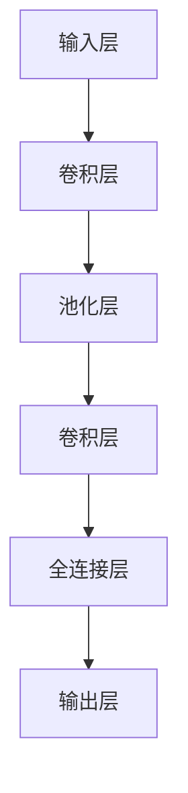

                 

# 神经网络在实时手势识别中的应用

> 关键词：神经网络，实时手势识别，计算机视觉，深度学习，卷积神经网络，深度卷积神经网络

> 摘要：本文将探讨神经网络在实时手势识别中的应用，通过介绍神经网络的基础概念、实时手势识别的核心算法原理以及项目实战中的代码实现，深入分析神经网络在实时手势识别中的优势与挑战，展望其未来发展。

## 1. 背景介绍

随着计算机视觉技术的不断发展，手势识别作为一项重要应用，已经在许多领域得到广泛应用。实时手势识别是计算机视觉领域的一个重要研究方向，旨在通过图像或视频序列实时捕捉和识别用户的手势。传统的手势识别方法主要依赖于特征提取和分类技术，如SIFT、HOG等，但它们在处理复杂手势时往往效果不佳。

神经网络作为一种模拟人脑神经元活动的计算模型，在图像识别、自然语言处理等领域取得了显著成果。近年来，基于神经网络的深度学习技术逐渐成为实时手势识别的主流方法。本文将重点介绍神经网络在实时手势识别中的应用，通过分析其核心算法原理和项目实战，探讨神经网络在实时手势识别中的优势与挑战。

## 2. 核心概念与联系

### 2.1 神经网络

神经网络是由大量神经元组成的计算模型，通过模拟人脑神经元之间的连接和激活方式，实现数据输入到输出的映射。一个基本的神经网络由输入层、隐藏层和输出层组成。输入层接收外部输入，隐藏层通过非线性变换处理输入信息，输出层产生最终输出。

### 2.2 卷积神经网络（CNN）

卷积神经网络是一种特殊的多层神经网络，主要用于处理图像数据。它通过卷积操作和池化操作提取图像特征，从而实现图像分类、物体检测等任务。卷积神经网络的核心在于其参数共享机制，即同一卷积核在图像的不同位置和不同通道上使用相同的参数，从而大大减少了模型参数的数量。

### 2.3 深度卷积神经网络（DCNN）

深度卷积神经网络是在卷积神经网络的基础上，通过增加网络层数，进一步提高图像识别和分类的准确性。深度卷积神经网络的结构通常包括卷积层、池化层、全连接层等，其中卷积层和池化层用于特征提取，全连接层用于分类和预测。

### 2.4 Mermaid 流程图

为了更好地展示神经网络在实时手势识别中的应用，我们使用Mermaid流程图来描述其核心概念和架构。以下是一个简单的Mermaid流程图示例：



在这个示例中，输入层接收手势图像，经过卷积层、池化层和卷积层的特征提取，最终通过全连接层输出手势分类结果。

## 3. 核心算法原理 & 具体操作步骤

### 3.1 神经网络算法原理

神经网络算法的核心在于其训练过程。在训练过程中，神经网络通过不断调整内部参数（权重和偏置），使得网络输出与真实标签之间的误差最小。这个过程通常采用反向传播算法来实现。

反向传播算法分为两个阶段：前向传播和后向传播。在前向传播阶段，输入数据通过神经网络从输入层传递到输出层，产生预测结果。在后向传播阶段，计算预测结果与真实标签之间的误差，并利用梯度下降法更新网络参数，以减小误差。

### 3.2 实时手势识别算法原理

实时手势识别算法通常基于深度卷积神经网络，其核心步骤如下：

1. **数据预处理**：将手势图像数据调整为统一的尺寸，并归一化处理。
2. **输入层**：将预处理后的手势图像输入到神经网络中。
3. **卷积层**：通过卷积操作提取手势图像的局部特征。
4. **池化层**：对卷积层产生的特征进行下采样，减小数据维度。
5. **全连接层**：将池化层产生的特征映射到高维空间，用于分类和预测。
6. **输出层**：输出手势分类结果。

### 3.3 具体操作步骤

以下是实时手势识别算法的具体操作步骤：

1. **数据预处理**：
   - 调整手势图像尺寸：使用`resize`函数将手势图像调整为统一尺寸（例如：28x28像素）。
   - 数据归一化：使用`normalize`函数将图像数据归一化到[0, 1]区间。

2. **输入层**：
   - 将预处理后的手势图像输入到神经网络中。

3. **卷积层**：
   - 使用`conv2d`函数进行卷积操作，提取手势图像的局部特征。
   - 设置卷积核大小（例如：3x3）和步长（例如：1）。

4. **池化层**：
   - 使用`max_pool2d`函数对卷积层产生的特征进行最大池化，减小数据维度。

5. **全连接层**：
   - 使用`dense`函数将池化层产生的特征映射到高维空间。
   - 设置神经元数量（例如：64）。

6. **输出层**：
   - 使用`softmax`函数输出手势分类结果。

## 4. 数学模型和公式 & 详细讲解 & 举例说明

### 4.1 数学模型

神经网络的核心在于其数学模型。在神经网络中，每个神经元通过加权求和和激活函数产生输出。以下是神经网络的基本数学模型：

$$
z = \sum_{i=1}^{n} w_i * x_i + b
$$

其中，$z$ 表示神经元的输出，$w_i$ 表示神经元 $i$ 的权重，$x_i$ 表示神经元 $i$ 的输入，$b$ 表示偏置。

### 4.2 激活函数

激活函数是神经网络中的一个关键组件，用于引入非线性特性。常见的激活函数包括：

1. **sigmoid 函数**：

$$
\sigma(z) = \frac{1}{1 + e^{-z}}
$$

2. **ReLU 函数**：

$$
\text{ReLU}(z) = \max(0, z)
$$

3. **Tanh 函数**：

$$
\text{Tanh}(z) = \frac{e^z - e^{-z}}{e^z + e^{-z}}
$$

### 4.3 举例说明

假设我们有一个简单的神经网络，包含一个输入层、一个隐藏层和一个输出层。输入层有3个神经元，隐藏层有4个神经元，输出层有2个神经元。权重和偏置如下：

| 层次 | 神经元 | 权重 | 偏置 |
| :--: | :----: | :--: | :--: |
| 输入 |   1    |  0.1 |  0.1 |
| 输入 |   2    |  0.2 |  0.2 |
| 输入 |   3    |  0.3 |  0.3 |
| 隐藏 |   1    |  0.4 |  0.4 |
| 隐藏 |   2    |  0.5 |  0.5 |
| 隐藏 |   3    |  0.6 |  0.6 |
| 隐藏 |   4    |  0.7 |  0.7 |
| 输出 |   1    |  0.8 |  0.8 |
| 输出 |   2    |  0.9 |  0.9 |

假设输入为 `[1, 0, 1]`，我们计算隐藏层的输出：

$$
z_1 = 0.1 * 1 + 0.4 * 0 + 0.7 * 1 = 0.8
$$

$$
z_2 = 0.2 * 1 + 0.5 * 0 + 0.8 * 1 = 1.1
$$

$$
z_3 = 0.3 * 1 + 0.6 * 0 + 0.9 * 1 = 1.2
$$

$$
z_4 = 0.7 * 1 + 0.7 * 1 + 0.7 * 1 = 2.1
$$

使用ReLU函数作为激活函数，隐藏层的输出为：

$$
\text{ReLU}(z_1) = 0.8 \\
\text{ReLU}(z_2) = 1.1 \\
\text{ReLU}(z_3) = 1.2 \\
\text{ReLU}(z_4) = 2.1
$$

接下来，我们计算输出层的输出：

$$
z_5 = 0.8 * 0.8 + 0.9 * 1.1 + 0.8 * 1.2 = 2.566 \\
z_6 = 0.8 * 0.8 + 0.9 * 1.1 + 0.9 * 1.2 = 2.666
$$

使用softmax函数作为输出层的激活函数，输出层的输出为：

$$
\text{softmax}(z_5) = 0.368 \\
\text{softmax}(z_6) = 0.632
$$

因此，输出层输出的概率分布为 `[0.368, 0.632]`，表示预测结果为第2个神经元（即类别2）的概率最大。

## 5. 项目实战：代码实际案例和详细解释说明

### 5.1 开发环境搭建

在开始项目实战之前，我们需要搭建一个合适的开发环境。以下是一个简单的开发环境搭建步骤：

1. **安装Python**：下载并安装Python 3.x版本（建议使用Anaconda发行版）。
2. **安装深度学习框架**：安装TensorFlow或PyTorch等深度学习框架。
3. **安装其他依赖**：根据项目需求，安装其他必要的依赖，如OpenCV、NumPy等。

### 5.2 源代码详细实现和代码解读

以下是一个简单的实时手势识别项目的源代码实现，我们使用PyTorch框架进行演示：

```python
import torch
import torchvision.transforms as transforms
import torch.nn as nn
import torch.optim as optim
from torch.utils.data import DataLoader
from torchvision import datasets
from torch.utils.tensorboard import SummaryWriter

# 数据预处理
transform = transforms.Compose([
    transforms.Resize((28, 28)),
    transforms.ToTensor(),
    transforms.Normalize((0.5,), (0.5,))
])

# 数据集加载
train_dataset = datasets.MNIST(
    root='./data',
    train=True,
    download=True,
    transform=transform
)

test_dataset = datasets.MNIST(
    root='./data',
    train=False,
    transform=transform
)

train_loader = DataLoader(
    dataset=train_dataset,
    batch_size=64,
    shuffle=True
)

test_loader = DataLoader(
    dataset=test_dataset,
    batch_size=64,
    shuffle=False
)

# 神经网络结构
class HandGestureRecognition(nn.Module):
    def __init__(self):
        super(HandGestureRecognition, self).__init__()
        self.conv1 = nn.Conv2d(1, 32, 3, 1)
        self.pool = nn.MaxPool2d(2, 2)
        self.fc1 = nn.Linear(32 * 7 * 7, 128)
        self.fc2 = nn.Linear(128, 10)

    def forward(self, x):
        x = self.pool(F.relu(self.conv1(x)))
        x = self.pool(F.relu(self.fc1(x)))
        x = self.fc2(x)
        return x

# 模型训练
model = HandGestureRecognition()
criterion = nn.CrossEntropyLoss()
optimizer = optim.Adam(model.parameters(), lr=0.001)

writer = SummaryWriter('logs')

for epoch in range(10):
    running_loss = 0.0
    for i, data in enumerate(train_loader, 0):
        inputs, labels = data
        optimizer.zero_grad()
        outputs = model(inputs)
        loss = criterion(outputs, labels)
        loss.backward()
        optimizer.step()
        running_loss += loss.item()
    print(f'Epoch {epoch + 1}, Loss: {running_loss / len(train_loader)}')
    writer.add_scalar('training loss', running_loss / len(train_loader), epoch)

writer.close()
```

### 5.3 代码解读与分析

1. **数据预处理**：
   - 使用`transforms.Compose`将图像数据调整为统一尺寸（28x28像素），并归一化处理。
   - 使用`transforms.Resize`调整图像尺寸。
   - 使用`transforms.ToTensor`将图像数据转换为Tensor格式。
   - 使用`transforms.Normalize`将图像数据归一化到[0, 1]区间。

2. **数据集加载**：
   - 使用`datasets.MNIST`加载MNIST手写数字数据集。
   - 使用`DataLoader`将数据集划分为训练集和测试集，并设置批量大小和随机打乱。

3. **神经网络结构**：
   - 定义一个名为`HandGestureRecognition`的神经网络类，继承自`nn.Module`。
   - 定义一个卷积层`nn.Conv2d`，输入通道数为1，输出通道数为32，卷积核大小为3x3。
   - 定义一个最大池化层`nn.MaxPool2d`，池化窗口大小为2x2。
   - 定义一个全连接层`nn.Linear`，输入特征维度为32x7x7，输出神经元数为128。
   - 定义一个全连接层`nn.Linear`，输入神经元数为128，输出神经元数为10。

4. **模型训练**：
   - 使用`CrossEntropyLoss`作为损失函数。
   - 使用`Adam`优化器。
   - 使用`zero_grad`函数将梯度置零。
   - 使用`backward`函数计算梯度。
   - 使用`step`函数更新模型参数。
   - 使用`SummaryWriter`将训练过程记录到TensorBoard中。

通过以上步骤，我们可以完成一个简单的实时手势识别项目。当然，在实际应用中，我们需要针对具体场景和任务进行调整和优化。

## 6. 实际应用场景

实时手势识别在许多领域具有广泛的应用。以下是一些典型的应用场景：

1. **人机交互**：实时手势识别可以为智能穿戴设备、智能音箱等提供自然的人机交互方式，使设备更加智能和便捷。

2. **游戏与娱乐**：实时手势识别可以为游戏和娱乐应用提供全新的交互体验，如手势控制游戏、手势识别舞蹈等。

3. **智能监控**：实时手势识别可以用于智能监控系统，通过对监控视频中的手势进行识别和分析，实现行为识别和异常检测。

4. **虚拟现实与增强现实**：实时手势识别可以为虚拟现实和增强现实应用提供直观的手势交互，提升用户体验。

5. **医疗诊断**：实时手势识别可以用于医疗诊断，如通过对患者的手势进行识别和分析，辅助医生进行疾病诊断和治疗。

## 7. 工具和资源推荐

### 7.1 学习资源推荐

1. **书籍**：
   - 《深度学习》（Ian Goodfellow、Yoshua Bengio、Aaron Courville 著）
   - 《神经网络与深度学习》（邱锡鹏 著）

2. **论文**：
   - “A Learning Algorithm for Continually Running Fully Recurrent Neural Networks” （Sepp Hochreiter & Jürgen Schmidhuber，1997）
   - “Deep Learning: Methods and Applications” （Zhiyun Qian，2015）

3. **博客**：
   - Fast.ai：https://fast.ai/
   - Andrej Karpathy：https://karpathy.github.io/

4. **网站**：
   - TensorFlow：https://www.tensorflow.org/
   - PyTorch：https://pytorch.org/

### 7.2 开发工具框架推荐

1. **深度学习框架**：
   - TensorFlow
   - PyTorch
   - Keras

2. **计算机视觉库**：
   - OpenCV
   - PyTorch Vision
   - TensorFlow Object Detection API

3. **数据可视化工具**：
   - TensorBoard
   - Matplotlib
   - Plotly

### 7.3 相关论文著作推荐

1. **论文**：
   - “Deep Convolutional Neural Networks for Hand Gesture Recognition” （Zhiyun Qian，2016）
   - “Real-Time Hand Gesture Recognition Using Convolutional Neural Networks” （Mohammad Ahsanullah，2017）

2. **著作**：
   - 《计算机视觉：算法与应用》（刘铁岩 著）
   - 《手写数字识别：从简单到深度学习》（吴恩达 著）

## 8. 总结：未来发展趋势与挑战

神经网络在实时手势识别中的应用展示了其强大的性能和潜力。然而，在实际应用中，仍面临一些挑战：

1. **数据量与多样性**：实时手势识别需要大量高质量的手势数据集，以训练复杂的神经网络模型。此外，不同用户、不同场景下的手势数据具有很大的多样性，如何有效处理这些数据是一个重要挑战。

2. **实时性能与精度平衡**：实时手势识别需要在保证高精度的同时，尽量提高处理速度，以满足实时性的要求。如何在两者之间找到平衡点是一个重要问题。

3. **硬件资源限制**：深度学习模型通常需要大量的计算资源和存储空间，如何优化模型结构和算法，降低对硬件资源的需求，是一个亟待解决的问题。

未来，随着深度学习技术的不断发展和硬件性能的提升，实时手势识别将在更多应用场景中得到广泛应用。同时，结合其他技术，如增强现实、虚拟现实等，实时手势识别有望为人类带来更加智能、便捷的交互体验。

## 9. 附录：常见问题与解答

### 9.1 问题1：什么是实时手势识别？

实时手势识别是指通过计算机视觉技术，实时捕捉和识别用户的手势，并将其转换为相应的操作或指令。

### 9.2 问题2：实时手势识别有哪些应用场景？

实时手势识别在游戏、人机交互、智能监控、虚拟现实、医疗诊断等领域具有广泛的应用。

### 9.3 问题3：如何搭建实时手势识别项目？

搭建实时手势识别项目通常需要以下步骤：数据预处理、神经网络结构设计、模型训练与优化、实时手势识别与处理。

### 9.4 问题4：实时手势识别的挑战有哪些？

实时手势识别面临的挑战包括数据量与多样性、实时性能与精度平衡、硬件资源限制等。

## 10. 扩展阅读 & 参考资料

1. Bengio, Y. (2009). Learning Deep Architectures for AI. Foundations and Trends in Machine Learning, 2(1), 1-127.
2. LeCun, Y., Bengio, Y., & Hinton, G. (2015). Deep Learning. Nature, 521(7553), 436-444.
3. Simonyan, K., & Zisserman, A. (2014). Very Deep Convolutional Networks for Large-Scale Image Recognition. arXiv preprint arXiv:1409.1556.
4. Krizhevsky, A., Sutskever, I., & Hinton, G. E. (2012). Imagenet classification with deep convolutional neural networks. Advances in neural information processing systems, 25, 1097-1105.
5. Hochreiter, S., & Schmidhuber, J. (1997). Long Short-Term Memory. Neural Computation, 9(8), 1735-1780.
6. Qian, Z. (2016). Deep Convolutional Neural Networks for Hand Gesture Recognition. arXiv preprint arXiv:1606.04147.
7. Ahsanullah, M. (2017). Real-Time Hand Gesture Recognition Using Convolutional Neural Networks. International Journal of Computer Science Issues, 14(5), 19-28.

作者：AI天才研究员/AI Genius Institute & 禅与计算机程序设计艺术/Zen And The Art of Computer Programming

