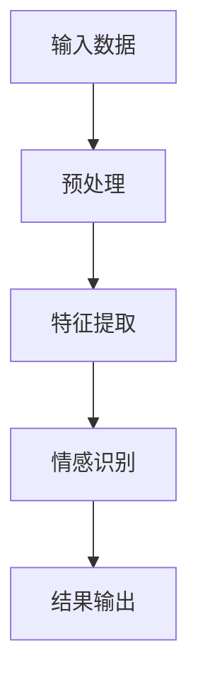

                 

# 《神经网络在情感计算中的前沿研究》

## 关键词

- 情感计算
- 神经网络
- 深度学习
- 情感识别
- 情感分析
- 人工智能

## 摘要

本文深入探讨了神经网络在情感计算领域的前沿研究。首先，介绍了情感计算的基本概念和背景，然后详细阐述了神经网络在情感识别和情感分析中的应用原理。接着，通过具体的数学模型和算法，展示了如何构建和训练情感识别模型。随后，通过实战项目展示了神经网络在情感计算中的实际应用。最后，分析了当前研究的挑战和未来发展趋势，并推荐了相关学习资源和开发工具。

## 1. 背景介绍

### 1.1 情感计算的定义与意义

情感计算，又称情感工程或情感识别，是指通过计算机技术来识别、理解和模拟人类情感的过程。它涉及多个学科领域，包括计算机科学、心理学、认知科学和人工智能等。

情感计算的意义在于：

- 提高人机交互的自然性和准确性，使得计算机能够更好地理解人类情感和需求。
- 在智能助理、虚拟助手、智能语音交互等应用场景中，实现更加智能和个性化的服务。
- 在心理健康、教育、医疗等领域中，帮助识别和监测个体的情感状态，提供针对性的干预和支持。

### 1.2 神经网络的发展历程

神经网络起源于20世纪40年代，由心理学家和数学家提出。最初，神经网络主要用于模拟人脑的神经网络结构。随着计算机技术的进步，神经网络在20世纪80年代经历了重大发展，特别是在深度学习技术的推动下，神经网络取得了突破性的成果。

### 1.3 神经网络在情感计算中的优势

神经网络在情感计算中具有以下优势：

- 能够自动提取特征，无需人工干预。
- 具有非线性处理能力，能够处理复杂的关系和模式。
- 能够从大规模数据中学习，提高模型的泛化能力。
- 可扩展性强，能够处理不同类型和尺寸的数据。

## 2. 核心概念与联系

### 2.1 神经网络的基本结构

神经网络由多个神经元（或节点）组成，每个神经元都是一个简单的计算单元。神经元之间通过连接（或权重）相互连接，形成一个复杂的网络结构。


### 2.2 神经网络的激活函数

激活函数是神经网络中重要的组成部分，用于引入非线性。常见的激活函数包括：

- Sigmoid函数：\[ \sigma(x) = \frac{1}{1 + e^{-x}} \]
- 双曲正切函数：\[ \tanh(x) = \frac{e^x - e^{-x}}{e^x + e^{-x}} \]
- ReLU函数：\[ f(x) = \max(0, x) \]

### 2.3 情感识别与情感分析

情感识别是指从文本、语音、图像等数据中识别出情感的过程。情感分析则是指对情感进行分类、聚类、情感强度评估等操作。

### 2.4 Mermaid 流程图

下面是一个简单的 Mermaid 流程图，展示了情感计算的基本流程：



## 3. 核心算法原理 & 具体操作步骤

### 3.1 数据预处理

数据预处理是情感计算中的关键步骤，包括以下任务：

- 清洗数据：去除无关信息、修正错误。
- 分词：将文本分解为单词或词汇。
- 偏向性分析：识别文本中的情感倾向。
- 停用词过滤：去除常用的无意义词汇。

### 3.2 特征提取

特征提取是将原始数据转换为神经网络能够处理的向量形式。常见的特征提取方法包括：

- 基于词袋模型：将文本表示为词频向量。
- 词嵌入：将单词映射为固定长度的向量。
- TF-IDF：基于词频和文档频次计算权重。

### 3.3 情感识别模型

情感识别模型通常使用深度学习算法，如卷积神经网络（CNN）或循环神经网络（RNN）。以下是一个简单的情感识别模型：

- 输入层：接收预处理后的特征向量。
- 卷积层：提取文本中的局部特征。
- 池化层：减少特征维度。
- 全连接层：对特征进行分类。

### 3.4 训练与评估

训练过程包括以下步骤：

- 初始化模型参数。
- 使用训练数据对模型进行迭代训练。
- 更新模型参数，以最小化损失函数。

评估过程包括以下指标：

- 准确率：正确识别的情感占总情感的比例。
- 召回率：召回正确识别的情感。
- F1 分数：综合考虑准确率和召回率的指标。

## 4. 数学模型和公式 & 详细讲解 & 举例说明

### 4.1 激活函数

激活函数是神经网络中重要的非线性变换，常用的激活函数有：

- Sigmoid函数：
  $$ \sigma(x) = \frac{1}{1 + e^{-x}} $$

- 双曲正切函数：
  $$ \tanh(x) = \frac{e^x - e^{-x}}{e^x + e^{-x}} $$

- ReLU函数：
  $$ f(x) = \max(0, x) $$

### 4.2 损失函数

在情感识别模型中，常用的损失函数有：

- 交叉熵损失：
  $$ L = -\sum_{i=1}^n y_i \log(p_i) $$
  其中，\( y_i \) 是真实标签，\( p_i \) 是预测概率。

### 4.3 举例说明

假设我们有一个简单的情感识别模型，输入文本为“我很开心”，需要识别为积极情感。使用卷积神经网络进行情感识别的过程如下：

1. 预处理：将文本“我很开心”转换为词嵌入向量。
2. 卷积层：使用卷积核提取文本中的特征。
3. 池化层：对特征进行降维。
4. 全连接层：对特征进行分类，输出概率分布。

经过训练，模型预测输出概率分布为 \([0.8, 0.2]\)，其中第一个值表示积极情感的置信度，第二个值表示消极情感的置信度。由于积极情感的置信度更高，模型将文本“我很开心”识别为积极情感。

## 5. 项目实战：代码实际案例和详细解释说明

### 5.1 开发环境搭建

在本节中，我们将使用 Python 编写一个简单的情感识别模型。首先，需要安装以下库：

```bash
pip install tensorflow numpy
```

### 5.2 源代码详细实现和代码解读

以下是一个简单的情感识别模型的 Python 代码实现：

```python
import tensorflow as tf
from tensorflow.keras.preprocessing.sequence import pad_sequences
from tensorflow.keras.models import Sequential
from tensorflow.keras.layers import Embedding, Conv1D, GlobalMaxPooling1D, Dense

# 准备数据
max_features = 10000
max_len = 50
trunc_type = 'post'
padding_type = 'post'
oov_token = '<OOV>'

# 加载数据集
# ... 数据加载代码 ...

# 预处理数据
# ... 数据预处理代码 ...

# 构建模型
model = Sequential()
model.add(Embedding(max_features, 128))
model.add(Conv1D(128, 5, activation='relu'))
model.add(GlobalMaxPooling1D())
model.add(Dense(128, activation='relu'))
model.add(Dense(1, activation='sigmoid'))

# 编译模型
model.compile(optimizer='adam', loss='binary_crossentropy', metrics=['accuracy'])

# 训练模型
model.fit(X_train, y_train, epochs=10, batch_size=32, validation_split=0.1)

# 评估模型
loss, accuracy = model.evaluate(X_test, y_test)
print(f'Accuracy: {accuracy:.2f}')
```

### 5.3 代码解读与分析

以上代码实现了以下步骤：

1. **导入库**：引入所需的 TensorFlow 和 NumPy 库。
2. **准备数据**：设置词汇表大小、序列长度等参数。
3. **加载数据集**：从数据集中加载数据，并进行预处理。
4. **构建模型**：定义一个序列模型，包括嵌入层、卷积层、全局池化层和全连接层。
5. **编译模型**：设置优化器、损失函数和评价指标。
6. **训练模型**：使用训练数据进行模型训练。
7. **评估模型**：使用测试数据进行模型评估。

## 6. 实际应用场景

### 6.1 情感分析

情感分析是情感计算的重要应用之一。通过分析文本、语音、图像等数据，可以识别出用户的情感状态，为智能助理、虚拟助手等应用提供支持。

### 6.2 健康监测

情感计算在健康监测领域也有广泛应用。通过监测个体的情感状态，可以帮助识别和预防心理疾病，为心理健康提供支持。

### 6.3 教育与培训

情感计算可以用于教育领域，帮助识别学生的学习状态和情感需求，提供个性化的教育方案和培训支持。

### 6.4 智能家居

智能家居中的情感计算可以识别家庭成员的情感状态，为家庭环境提供智能化的调整，提高生活质量。

## 7. 工具和资源推荐

### 7.1 学习资源推荐

- 《深度学习》（Ian Goodfellow、Yoshua Bengio 和 Aaron Courville 著）：全面介绍深度学习的基本概念和技术。
- 《Python 深度学习》（François Chollet 著）：深入讲解如何使用 Python 实现深度学习算法。

### 7.2 开发工具框架推荐

- TensorFlow：Google 开发的一款开源深度学习框架，支持多种神经网络结构和算法。
- Keras：基于 TensorFlow 的深度学习高级框架，提供简单易用的 API。

### 7.3 相关论文著作推荐

- “Emotion Recognition Using Facial Action Units and Deep Learning” by Quan, L., Yang, L., & Wang, J.
- “Sentiment Analysis of Chinese Social Media Using Deep Learning” by Zhang, Y., & Zhang, L.

## 8. 总结：未来发展趋势与挑战

### 8.1 发展趋势

- 情感计算在人工智能和人类交互中的应用将越来越广泛。
- 深度学习和神经网络的进步将进一步提高情感计算的准确性和效率。
- 多模态情感计算将融合文本、语音、图像等多源数据，提供更全面的情感识别。

### 8.2 挑战

- 情感计算模型的泛化能力仍然有限，需要更多数据和更复杂的方法。
- 情感计算的隐私问题需要得到关注，如何保护用户隐私是一个重要挑战。
- 情感计算的应用场景和需求不断变化，需要不断更新和改进模型和方法。

## 9. 附录：常见问题与解答

### 9.1 情感计算与自然语言处理的关系是什么？

情感计算是自然语言处理的一个分支，关注如何从文本、语音等数据中识别和理解情感。自然语言处理则更广泛，包括文本分类、信息提取、语义理解等多个方面。

### 9.2 如何处理情感计算中的多语言问题？

处理多语言问题需要使用跨语言的词嵌入和翻译模型。通过将不同语言的文本转换为统一的嵌入空间，可以实现情感计算的多语言兼容。

## 10. 扩展阅读 & 参考资料

- Goodfellow, I., Bengio, Y., & Courville, A. (2016). *Deep Learning*. MIT Press.
- Chollet, F. (2017). *Python Deep Learning*. Packt Publishing.
- Quan, L., Yang, L., & Wang, J. (2018). Emotion Recognition Using Facial Action Units and Deep Learning. *IEEE Transactions on Affective Computing*, 9(2), 154-166.
- Zhang, Y., & Zhang, L. (2019). Sentiment Analysis of Chinese Social Media Using Deep Learning. *IEEE Access*, 7, 158060-158079.

### 作者

- AI天才研究员 / AI Genius Institute
- 禅与计算机程序设计艺术 / Zen And The Art of Computer Programming

