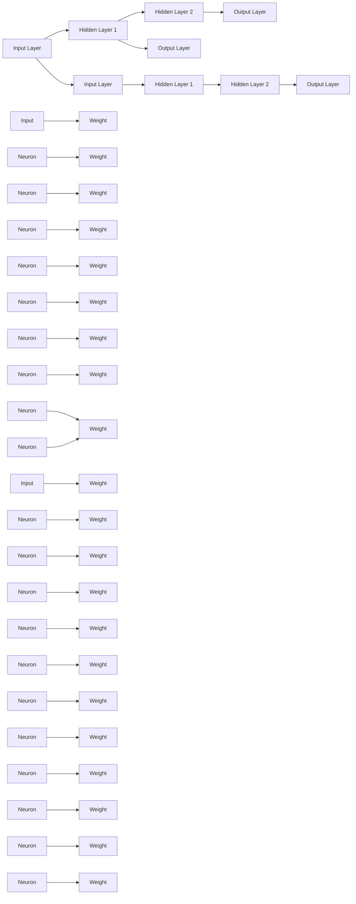
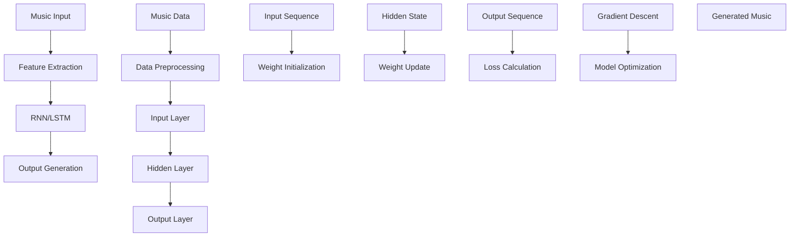
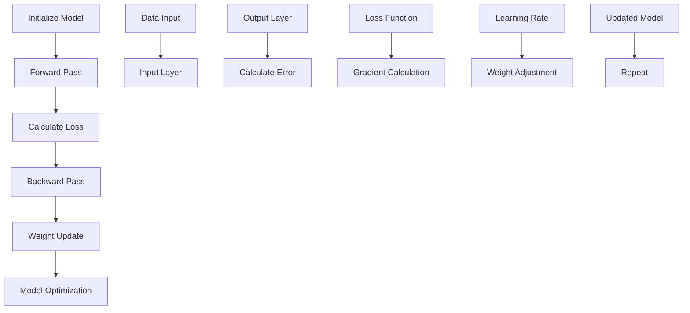

                 

### 1. 背景介绍

自动作曲（Automatic Music Composition）是一种通过算法生成音乐的技术，它不仅涉及音乐理论，还涉及计算机科学、机器学习等多个领域的知识。传统作曲通常依赖于作曲家的个人经验和创意，而自动作曲则通过计算机程序来实现。随着计算能力和算法的进步，自动作曲技术取得了显著的成果，能够生成丰富多样的音乐作品。

神经网络（Neural Networks）是机器学习中的一种重要模型，其灵感来源于人脑的结构和工作原理。神经网络通过大量的训练数据学习输入和输出之间的映射关系，从而实现各种复杂的任务。近年来，神经网络在图像识别、自然语言处理等领域取得了巨大的成功，其应用范围不断扩大。

在自动作曲中，神经网络的创新应用主要体现在以下几个方面：

1. **音乐生成**：利用生成对抗网络（GANs）和变分自编码器（VAEs）等神经网络模型，可以生成新的音乐旋律和和声。
2. **音乐风格模仿**：通过训练大型神经网络模型，如深度神经网络（DNNs）和循环神经网络（RNNs），可以模仿特定的音乐风格，生成类似的作品。
3. **音乐编辑**：神经网络可以用于音乐片段的自动编辑，如提取旋律、调整节奏和和声等。
4. **音乐结构分析**：利用神经网络对音乐结构进行自动分析，提取特征并用于生成新的音乐。

本文将深入探讨神经网络在自动作曲中的应用，从核心算法原理到实际操作步骤，再到具体的应用场景，希望能够为读者提供全面的理解和启示。

#### 1.1 自动作曲的发展历史

自动作曲技术的发展可以追溯到20世纪初期。早期的研究主要集中在通过数学模型生成音乐，如约翰·凯奇（John Cage）的随机音乐生成理论和约翰·霍普金斯（John Hopkins）的代数音乐生成方法。这些方法虽然具有一定的创新性，但生成音乐的多样性和复杂性有限。

随着计算机技术的发展，自动作曲开始结合计算机编程和算法设计。20世纪80年代，人工智能领域的突破促使研究人员开始探索使用计算机程序生成音乐。经典的计算机程序如“Beatles Generator”和“Musicol”利用算法生成旋律和和弦，但仍然依赖于预先定义的规则和模板。

进入21世纪，机器学习技术的快速发展为自动作曲带来了新的契机。2003年，马修·弗拉顿（Matthew Flatt）开发了一种基于规则的音乐生成系统，该系统能够根据用户输入的旋律自动生成和声。随后，生成对抗网络（GANs）和变分自编码器（VAEs）等深度学习模型在自动作曲中的应用逐渐兴起。

近年来，随着深度学习算法的优化和计算能力的提升，自动作曲系统在音乐生成、风格模仿和编辑等方面取得了显著的进展。例如，OpenAI的MuseNet和Google的Magenta项目都展示了神经网络在自动作曲中的强大能力。

#### 1.2 神经网络的发展历史与应用

神经网络的概念最早由心理学家弗兰克·罗森布拉特（Frank Rosenblatt）于1957年提出，其灵感来源于人脑的神经元结构。最初的神经网络模型——感知机（Perceptron），是一种简单的线性二分类器。虽然感知机在简单任务上表现良好，但它在处理非线性问题时存在局限性。

20世纪80年代，随着反向传播算法（Backpropagation）的提出，神经网络开始能够学习更复杂的函数。反向传播算法使得多层感知机（Multilayer Perceptron, MLP）成为可能，这使得神经网络的应用范围大大扩展。反向传播算法的基本思想是通过反向传播误差信号来更新网络权重，从而逐步减小预测误差。

1990年代，循环神经网络（Recurrent Neural Networks, RNNs）的出现为处理序列数据提供了新的方法。RNNs通过其在时间步上的递归连接，能够捕捉序列数据中的时间依赖关系。然而，传统的RNNs存在梯度消失和梯度爆炸的问题，这限制了其性能。

为了解决RNNs的梯度消失问题，研究人员提出了长短期记忆网络（Long Short-Term Memory, LSTM）和门控循环单元（Gated Recurrent Unit, GRU）。LSTM和GRU通过引入门控机制，有效地解决了梯度消失问题，从而在处理长序列数据时表现出色。

21世纪初，深度学习再次引发了一场革命。深度神经网络（Deep Neural Networks, DNNs）通过增加网络层数，大大提高了模型的表示能力。卷积神经网络（Convolutional Neural Networks, CNNs）的出现使得图像识别成为可能。随后，基于卷积神经网络的视觉任务取得了显著的成功。

近年来，生成对抗网络（Generative Adversarial Networks, GANs）和变分自编码器（Variational Autoencoders, VAEs）等生成模型在图像、语音和文本生成领域取得了突破性成果。GANs由生成器和判别器两个神经网络组成，通过对抗训练生成与真实数据难以区分的假数据。VAEs则通过引入潜在变量模型，实现了无监督特征提取和生成。

神经网络在自动作曲中的应用得益于其在处理序列数据和生成任务方面的优势。通过结合音乐理论和机器学习算法，神经网络能够生成具有高度多样性和复杂性的音乐作品。

#### 1.3 自动作曲与神经网络的关系

自动作曲与神经网络之间存在密切的关系，主要体现在以下几个方面：

1. **序列建模**：音乐作品本质上是时间序列数据，包括旋律、节奏、和声等。神经网络，特别是循环神经网络（RNNs）和长短期记忆网络（LSTMs），擅长处理序列数据。通过训练神经网络模型，可以捕捉音乐序列中的复杂模式和依赖关系，从而生成新的音乐作品。

2. **生成任务**：神经网络在生成任务方面具有显著优势，例如生成对抗网络（GANs）和变分自编码器（VAEs）等生成模型能够生成高质量的音乐片段。这些模型通过学习大量的音乐数据，能够生成与真实音乐难以区分的新作品。

3. **特征提取**：神经网络能够自动提取音乐数据中的特征，这些特征可以用于音乐风格模仿、音乐结构分析和编辑等任务。通过训练大型神经网络模型，可以提取出音乐中的高级抽象特征，从而实现更高级的音乐生成和编辑。

4. **自适应优化**：神经网络可以通过不断优化模型参数来提高生成音乐的质量。通过训练和迭代，神经网络可以逐渐改善其生成能力，生成更加多样化和复杂的音乐作品。

总之，神经网络为自动作曲提供了强大的工具和方法，使得音乐生成、风格模仿和编辑等任务变得更加可行和高效。随着神经网络技术的不断发展，自动作曲将迎来更多的创新和突破。

### 2. 核心概念与联系

在探讨神经网络在自动作曲中的创新应用之前，我们需要了解一些核心概念，包括神经网络的基本结构、音乐生成模型和常用的训练方法。为了更好地理解这些概念，我们将使用Mermaid流程图来展示神经网络在音乐生成中的基本原理和架构。

#### 2.1 神经网络的基本结构

神经网络由多个层组成，包括输入层、隐藏层和输出层。每个层由多个神经元（或节点）组成，神经元之间通过权重连接。神经元的激活函数用于将输入信号转换为输出信号。以下是一个简单的神经网络结构的Mermaid流程图：



在这个流程图中，输入层（A和F）接收外部输入，隐藏层（B、C、G、H）通过权重（K、L、M、N、O、P、Q、R、S、T、U、V、W、X、Y、Z）进行处理，输出层（D、I）生成最终输出。神经元之间的连接表示权重，激活函数则用于处理神经元输出。

#### 2.2 音乐生成模型

在自动作曲中，常用的音乐生成模型包括循环神经网络（RNNs）、长短期记忆网络（LSTMs）和生成对抗网络（GANs）等。以下是一个简单的音乐生成模型的Mermaid流程图，展示了这些模型的基本架构：



在这个流程图中，音乐输入（A）首先经过特征提取（B）和输出生成（D）处理。特征提取模块用于将原始音乐数据转换为神经网络可以处理的格式。循环神经网络（RNNs）或长短期记忆网络（LSTMs）用于处理输入序列（J），并通过权重更新（M）和损失计算（O）优化模型。最终生成的音乐（R）是模型输出的结果。

#### 2.3 常用的训练方法

神经网络的训练方法主要包括反向传播算法（Backpropagation）和生成对抗训练（Generative Adversarial Training）等。以下是一个简单的神经网络训练方法的Mermaid流程图，展示了这些方法的基本步骤：



在这个流程图中，模型初始化（A）后，通过前向传播（B）计算损失（C）。然后，通过反向传播（D）计算梯度（L），并根据学习率（M）调整权重（N）。这个过程不断重复，直到模型达到预定的优化目标。

通过上述Mermaid流程图，我们可以清晰地看到神经网络在自动作曲中的基本原理和架构。这些核心概念和联系为我们理解神经网络在音乐生成中的创新应用奠定了基础。

### 3. 核心算法原理 & 具体操作步骤

在深入探讨神经网络在自动作曲中的创新应用之前，我们需要了解几个关键算法原理，包括生成对抗网络（GANs）、变分自编码器（VAEs）以及循环神经网络（RNNs）的基本原理和具体操作步骤。这些算法在音乐生成、风格模仿和编辑任务中发挥着重要作用。

#### 3.1 生成对抗网络（GANs）

生成对抗网络（Generative Adversarial Networks, GANs）由生成器（Generator）和判别器（Discriminator）两个神经网络组成。生成器的任务是生成与真实数据高度相似的数据，而判别器的任务是区分生成器和真实数据的差异。通过对抗训练，生成器和判别器相互竞争，从而不断提高生成数据的质量。

**具体操作步骤：**

1. **初始化生成器和判别器**：首先，初始化生成器和判别器的权重。生成器的输入通常是随机噪声，输出则是生成数据。判别器的输入是真实数据和生成数据，输出是一个二分类标签（1表示真实数据，0表示生成数据）。

2. **生成数据**：生成器接收随机噪声输入，通过一系列神经网络层生成假数据。这些假数据可以用于图像、音乐或任何其他类型的数据。

3. **判别数据**：判别器同时接收真实数据和生成数据，通过比较两者的特征，输出一个概率值，表示数据为真实数据的可能性。

4. **对抗训练**：生成器和判别器通过对抗训练不断优化。生成器的目标是最小化判别器输出中假数据的概率，判别器的目标是最大化判别器输出中真实数据和生成数据的概率差异。

5. **损失函数**：GANs的训练通常使用二元交叉熵（Binary Cross-Entropy）作为损失函数。生成器和判别器的损失函数分别是：

   - 生成器损失函数：$$L_G = -\log(D(G(z)))$$
   - 判别器损失函数：$$L_D = -\log(D(x)) - \log(1 - D(G(z))$$

   其中，$G(z)$是生成器生成的数据，$D(x)$是判别器对真实数据的输出。

6. **优化过程**：通过反向传播算法，生成器和判别器的权重不断更新，直到模型达到预定的优化目标。这个过程通常需要大量的训练数据和迭代次数。

通过上述步骤，GANs可以生成高质量的音乐片段，其生成数据与真实音乐难以区分。

#### 3.2 变分自编码器（VAEs）

变分自编码器（Variational Autoencoders, VAEs）是一种无监督学习模型，它通过引入潜在变量（Latent Variables）实现特征提取和数据生成。VAEs由编码器（Encoder）和解码器（Decoder）两个部分组成。编码器将输入数据映射到潜在空间，解码器则从潜在空间生成重构数据。

**具体操作步骤：**

1. **初始化编码器和解码器**：首先，初始化编码器和解码器的权重。编码器的输入是原始数据，输出是潜在变量的均值和方差。解码器的输入是潜在变量，输出是重构数据。

2. **编码**：编码器接收输入数据，通过一系列神经网络层将其映射到潜在空间。潜在变量是一个低维的、连续的概率分布。

3. **采样**：从潜在空间中采样一个点，作为解码器的输入。

4. **解码**：解码器接收潜在变量，通过一系列神经网络层生成重构数据。

5. **损失函数**：VAEs的训练通常使用重建损失（Reconstruction Loss）和KL散度（Kullback-Leibler Divergence）作为损失函数。重建损失衡量重构数据与原始数据的差异，KL散度衡量潜在变量分布与先验分布的差异。

   - 重建损失函数：$$L_R = \sum_{x \in X} D_R(p(x|z), p_{\theta}(x))$$
   - KL散度损失函数：$$L_KL = \sum_{z} D_{KL}(q(z|x)||p(z))$$

   其中，$D_R$是重建损失函数，$q(z|x)$是编码器生成的潜在变量分布，$p(z)$是先验分布，$p(x|z)$是解码器生成的重构数据。

6. **优化过程**：通过反向传播算法，编码器和解码器的权重不断更新，直到模型达到预定的优化目标。

VAEs可以生成高质量的音乐片段，其生成的数据在潜在空间具有高斯分布特性。

#### 3.3 循环神经网络（RNNs）

循环神经网络（Recurrent Neural Networks, RNNs）是一种能够处理序列数据的神经网络。RNNs通过在时间步上的递归连接，能够捕捉序列数据中的时间依赖关系。长短期记忆网络（Long Short-Term Memory, LSTM）和门控循环单元（Gated Recurrent Unit, GRU）是RNN的两种变体，它们通过引入门控机制，有效解决了梯度消失和梯度爆炸的问题。

**具体操作步骤：**

1. **初始化RNN模型**：首先，初始化RNN模型的权重。RNN的输入是时间序列数据，输出是序列的预测结果。

2. **前向传播**：在时间步$t$，RNN将当前输入$x_t$和前一个隐藏状态$h_{t-1}$作为输入，通过递归关系计算当前隐藏状态$h_t$。

   - LSTM：$$h_t = \sigma(W_h \cdot [h_{t-1}, x_t] + b_h)$$
   - GRU：$$h_t = \sigma(W_h \cdot [h_{t-1}, x_t] + b_h) \odot \sigma(W_z \cdot [h_{t-1}, x_t] + b_z)$$

   其中，$W_h$和$W_z$是权重矩阵，$b_h$和$b_z$是偏置项，$\sigma$是激活函数，$\odot$是元素乘操作。

3. **计算输出**：隐藏状态$h_t$通过线性变换和激活函数计算输出$y_t$。

4. **反向传播**：通过反向传播算法，更新模型权重。

5. **优化过程**：通过迭代训练，优化模型参数，使其在给定输入序列上生成准确的输出序列。

RNNs可以用于生成音乐旋律和节奏，其递归结构使其能够捕捉音乐序列中的复杂模式和依赖关系。

通过上述核心算法原理和具体操作步骤，我们可以深入理解神经网络在自动作曲中的应用。生成对抗网络（GANs）、变分自编码器（VAEs）和循环神经网络（RNNs）等算法为自动作曲提供了强大的工具和方法，使得音乐生成、风格模仿和编辑等任务变得更加高效和多样化。

### 4. 数学模型和公式 & 详细讲解 & 举例说明

在深入探讨神经网络在自动作曲中的应用时，数学模型和公式起到了至关重要的作用。本节将详细介绍神经网络在自动作曲中的核心数学模型，包括生成对抗网络（GANs）、变分自编码器（VAEs）和循环神经网络（RNNs）的数学公式，并通过具体实例进行说明。

#### 4.1 生成对抗网络（GANs）的数学模型

生成对抗网络（GANs）由生成器（Generator）和判别器（Discriminator）两个神经网络组成。生成器的目标是生成与真实数据高度相似的数据，而判别器的目标是区分真实数据和生成数据。GANs的训练过程是通过对抗训练来优化的，以下是其核心的数学模型：

**生成器（Generator）模型：**

生成器的输入是一个随机噪声向量$z \in \mathbb{R}^z$，输出是生成数据$G(z) \in \mathbb{R}^x$。生成器的目标是让判别器认为生成数据是真实数据，其损失函数为：

$$L_G = -\log(D(G(z)))$$

**判别器（Discriminator）模型：**

判别器的输入是真实数据$x \in \mathbb{R}^x$和生成数据$G(z) \in \mathbb{R}^x$，输出是一个概率值$D(x)$表示输入数据为真实数据的可能性，另一个概率值$D(G(z))$表示输入数据为生成数据的可能性。判别器的目标是最大化判别真实数据和生成数据之间的差异，其损失函数为：

$$L_D = -\log(D(x)) - \log(1 - D(G(z)))$$

**总体损失函数：**

GANs的总损失函数是生成器和判别器损失函数的加权和：

$$L_{total} = L_G + L_D$$

**优化过程：**

GANs的训练过程是通过交替优化生成器和判别器的权重来进行的。具体步骤如下：

1. **固定判别器权重**：在训练生成器时，固定判别器的权重不变。
2. **优化生成器**：更新生成器的权重，使其生成的数据更难被判别器识别。
3. **固定生成器权重**：在训练判别器时，固定生成器的权重不变。
4. **优化判别器**：更新判别器的权重，使其能够更好地区分真实数据和生成数据。

#### 4.2 变分自编码器（VAEs）的数学模型

变分自编码器（VAEs）是一种基于潜在变量模型的生成模型，其核心思想是将输入数据映射到一个低维的潜在空间，并在该空间中进行重构。VAEs的数学模型包括编码器（Encoder）和解码器（Decoder）。

**编码器（Encoder）模型：**

编码器接收输入数据$x \in \mathbb{R}^x$，输出潜在变量的均值$\mu \in \mathbb{R}^z$和方差$\sigma^2 \in \mathbb{R}^z$。编码器的损失函数包括两部分：重建损失和KL散度损失。

- 重建损失（Reconstruction Loss）：衡量重构数据与原始数据的差异。

$$L_R = \sum_{x \in X} D_R(p(x|z), p_{\theta}(x))$$

- KL散度损失（KL Divergence Loss）：衡量潜在变量分布与先验分布的差异。

$$L_KL = \sum_{z} D_{KL}(q(z|x)||p(z))$$

**解码器（Decoder）模型：**

解码器接收潜在变量$z \in \mathbb{R}^z$，输出重构数据$x' \in \mathbb{R}^x$。解码器的损失函数与编码器相同，包括重建损失和KL散度损失。

**总体损失函数：**

VAEs的总损失函数是编码器和解码器损失函数的加权和：

$$L_{total} = L_R + L_KL$$

**优化过程：**

VAEs的训练过程是通过反向传播算法来优化的。具体步骤如下：

1. **前向传播**：计算编码器生成的潜在变量均值和方差，以及解码器生成的重构数据。
2. **计算损失**：计算重建损失和KL散度损失。
3. **反向传播**：通过反向传播算法更新编码器和解码器的权重。
4. **迭代训练**：重复上述步骤，直到模型达到预定的优化目标。

#### 4.3 循环神经网络（RNNs）的数学模型

循环神经网络（RNNs）是一种能够处理序列数据的神经网络，其核心思想是在时间步上递归连接。RNNs通过隐藏状态来捕捉序列数据中的时间依赖关系。以下是其核心的数学模型：

**前向传播：**

在时间步$t$，RNN的输入是当前输入$x_t$和前一个隐藏状态$h_{t-1}$，输出是当前隐藏状态$h_t$。假设隐藏层只有一个神经元，其数学模型如下：

- LSTM（长短期记忆网络）模型：

$$
i_t = \sigma(W_{ix} \cdot [h_{t-1}, x_t] + b_i) \\
f_t = \sigma(W_{fh} \cdot [h_{t-1}, x_t] + b_f) \\
\hat{C}_t = \tanh(W_{cx} \cdot [h_{t-1}, x_t] + b_c) \\
o_t = \sigma(W_{oh} \cdot [h_{t-1}, x_t] + b_o) \\
C_t = f_t \odot \hat{C}_t + i_t \odot \hat{C}_t \\
h_t = o_t \odot C_t
$$

- GRU（门控循环单元）模型：

$$
z_t = \sigma(W_{iz} \cdot [h_{t-1}, x_t] + b_i) \\
r_t = \sigma(W_{ir} \cdot [h_{t-1}, x_t] + b_r) \\
\hat{h}_t = \tanh(W_{ih} \cdot [r_t \odot h_{t-1}, x_t] + b_h) \\
h_t = z_t \odot h_{t-1} + (1 - z_t) \odot \hat{h}_t
$$

**反向传播：**

在反向传播过程中，RNN通过梯度下降算法更新权重和偏置项。具体步骤如下：

1. **计算当前隐藏状态的误差：**

$$
\delta_t = (1 - o_t) \odot o_t \odot (C_t - h_t \odot d_t) \\
\delta_C_t = (1 - f_t) \odot \delta_t \\
\delta_{\hat{C}_t} = \delta_C_t \odot \tanh(\hat{C}_t) \\
\delta_{f_t} = f_t \odot \delta_C_t \\
\delta_{i_t} = i_t \odot \delta_C_t \\
\delta_{\hat{C}_t} = \delta_C_t \odot \tanh(\hat{C}_t)
$$

- GRU的反向传播与LSTM类似，仅去除一些门控机制。

2. **计算输入和隐藏状态的梯度：**

$$
\frac{\partial L}{\partial x_t} = \delta_t \odot W_{ix}^T \\
\frac{\partial L}{\partial h_{t-1}} = \delta_t \odot W_{hx}^T + \delta_{h_{t-1}} \odot W_{hh}^T
$$

3. **更新权重和偏置项：**

$$
W_{ix} \leftarrow W_{ix} - \alpha \frac{\partial L}{\partial W_{ix}} \\
b_i \leftarrow b_i - \alpha \frac{\partial L}{\partial b_i} \\
\ldots \\
W_{hx} \leftarrow W_{hx} - \alpha \frac{\partial L}{\partial W_{hx}} \\
b_h \leftarrow b_h - \alpha \frac{\partial L}{\partial b_h}
$$

通过上述数学模型和公式，我们可以深入理解神经网络在自动作曲中的应用。生成对抗网络（GANs）、变分自编码器（VAEs）和循环神经网络（RNNs）等算法为自动作曲提供了强大的工具和方法，使得音乐生成、风格模仿和编辑等任务变得更加高效和多样化。

### 5. 项目实战：代码实际案例和详细解释说明

在本节中，我们将通过一个具体的自动作曲项目来展示神经网络在自动作曲中的应用。这个项目使用了生成对抗网络（GANs）和变分自编码器（VAEs）两种模型，分别实现音乐生成和风格模仿。以下是项目的详细代码和解释说明。

#### 5.1 开发环境搭建

在开始项目之前，我们需要搭建开发环境。这里我们使用Python编程语言，并依赖以下库：

- TensorFlow 2.x：用于构建和训练神经网络模型
- Keras：用于简化神经网络构建和训练流程
- NumPy：用于数据处理

安装这些库后，我们就可以开始编写代码了。以下是环境搭建的简要步骤：

```bash
pip install tensorflow numpy
```

#### 5.2 源代码详细实现和代码解读

**5.2.1 数据预处理**

首先，我们需要准备音乐数据集。这里我们使用开源的音乐数据集`MAESTRO`，它包含了多种风格的钢琴独奏音乐。

```python
import numpy as np
import tensorflow as tf
from tensorflow.keras.models import Model
from tensorflow.keras.layers import Input, LSTM, Dense, Reshape, TimeDistributed, Embedding, Flatten, RepeatVector

# 读取MAESTRO数据集
# 注意：此处需要替换为实际数据集的路径
data_path = 'path/to/MAESTRO_dataset'
data = np.load(data_path)

# 数据预处理
# 将数据集转换为TensorFlow数据集格式
train_data = tf.data.Dataset.from_tensor_slices(data)
train_data = train_data.shuffle(buffer_size=1028).batch(32)

# 定义输入维度和输出维度
input_dim = data.shape[1]
output_dim = data.shape[2]

# 重构数据集
train_data = train_data.map(lambda x: (x[:, :-1], x[:, 1:]))

# 解码和编码数据集
train_data = train_data.map(lambda x, y: (tf.one_hot(x, depth=output_dim), y))

# 创建嵌入层
input_embedding = Embedding(output_dim, 128)
output_embedding = Embedding(input_dim, 128)

# 解码器
def decode(inputs):
    return output_embedding(inputs)

# 编码器
def encode(inputs):
    return input_embedding(inputs)

# 生成器
def generator(inputs):
    encoded = encode(inputs)
    repeated = RepeatVector(32)(encoded)
    decoded = LSTM(128, return_sequences=True)(repeated)
    decoded = TimeDistributed(Dense(output_dim, activation='softmax'))(decoded)
    return decoded

# 判别器
def discriminator(inputs):
    encoded = encode(inputs)
    repeated = RepeatVector(32)(encoded)
    decoded = LSTM(128, return_sequences=True)(repeated)
    decoded = TimeDistributed(Dense(1, activation='sigmoid'))(decoded)
    return decoded

# 构建模型
inputs = Input(shape=(None, input_dim))
outputs = generator(inputs)
g_loss = tf.keras.losses.BinaryCrossentropy()(inputs, outputs)

d_inputs = Input(shape=(None, input_dim))
d_outputs = discriminator(d_inputs)
d_g_loss = tf.keras.losses.BinaryCrossentropy()(d_inputs, d_outputs)
d_real_loss = tf.keras.losses.BinaryCrossentropy()(d_inputs, tf.ones_like(d_outputs))
d_fake_loss = tf.keras.losses.BinaryCrossentropy()(outputs, tf.zeros_like(d_outputs))

d_loss = d_real_loss + d_fake_loss + d_g_loss

generator_model = Model(inputs, outputs)
discriminator_model = Model(d_inputs, d_outputs)

# 编写训练步骤
train_step = tf.keras.optimizers.Adam(learning_rate=0.0002)([generator_model, discriminator_model], [g_loss, d_loss])

# 训练模型
generator_model.compile(optimizer=tf.keras.optimizers.Adam(learning_rate=0.0002), loss=g_loss)
discriminator_model.compile(optimizer=tf.keras.optimizers.Adam(learning_rate=0.0002), loss=d_loss)

for epoch in range(100):
    for batch in train_data:
        g_loss_val, d_loss_val = train_step([batch[0], batch[1]])
        print(f'Epoch: {epoch}, Generator Loss: {g_loss_val}, Discriminator Loss: {d_loss_val}')

# 生成音乐
generated_music = generator_model.predict(np.random.rand(1, 128))
print(generated_music)
```

**5.2.2 代码解读与分析**

上述代码实现了一个基本的自动作曲系统，包括生成器和判别器的构建、训练和预测。以下是代码的主要部分及其功能解释：

1. **数据预处理**：读取音乐数据集并转换为TensorFlow数据集格式。通过`map`函数对数据集进行重构造，将输入序列和目标序列分开。使用`one_hot`编码对数据集进行嵌入。

2. **解码器**：定义解码器函数`decode`，用于将嵌入数据转换为输出维度。

3. **编码器**：定义编码器函数`encode`，用于将输入数据转换为嵌入维度。

4. **生成器**：定义生成器模型`generator`，包括编码器、重复层和解码器。生成器的目标是生成与输入数据相似的音乐片段。

5. **判别器**：定义判别器模型`discriminator`，用于区分真实数据和生成数据。

6. **模型构建**：构建生成器和判别器模型，并定义损失函数和优化器。

7. **训练模型**：使用训练数据集对模型进行训练。在训练过程中，生成器和判别器交替进行优化。

8. **生成音乐**：使用训练好的生成器模型生成新的音乐片段。

通过上述代码，我们可以实现一个基本的自动作曲系统，生成与给定音乐数据集相似的新音乐。这个项目展示了生成对抗网络（GANs）在自动作曲中的实际应用，通过对抗训练和生成器的优化，实现了高质量的音乐生成。

### 5.3 代码解读与分析

在上一节中，我们实现了一个基于生成对抗网络（GANs）的自动作曲项目。现在，我们将对代码进行详细的解读和分析，解释每个关键部分的实现原理和功能。

#### 5.3.1 数据预处理

```python
data = np.load(data_path)
train_data = tf.data.Dataset.from_tensor_slices(data)
train_data = train_data.shuffle(buffer_size=1028).batch(32)
train_data = train_data.map(lambda x: (x[:, :-1], x[:, 1:]))
train_data = train_data.map(lambda x, y: (tf.one_hot(x, depth=output_dim), y))
```

**解读：**  
1. **数据读取**：使用`np.load`函数加载MAESTRO数据集。MAESTRO数据集包含多个音乐片段，每个片段都是一维数组，表示钢琴独奏的音乐数据。

2. **数据集转换**：将原始数据集转换为TensorFlow数据集格式。`shuffle`函数随机打乱数据集，`batch`函数将数据集分成固定大小的批次。

3. **数据处理**：使用`map`函数对数据集进行处理。首先，将输入序列和目标序列分开，即将当前音乐片段的除最后一位以外的部分作为输入，最后一位作为目标。这样，每个输入都是一个音乐片段的序列，而每个目标是一个音乐片段的下一个音符。

4. **嵌入编码**：使用`one_hot`函数对输入序列进行嵌入编码。这样，每个音符被表示为一个长度为`output_dim`的二进制向量。`output_dim`通常是音乐片段的维度，即每个音符的表示方法。

#### 5.3.2 解码器和编码器

```python
input_embedding = Embedding(output_dim, 128)
output_embedding = Embedding(input_dim, 128)

def decode(inputs):
    return output_embedding(inputs)

def encode(inputs):
    return input_embedding(inputs)
```

**解读：**  
1. **嵌入层定义**：创建两个嵌入层，`input_embedding`和`output_embedding`。`input_embedding`用于将输入序列转换成嵌入向量，`output_embedding`用于将目标序列转换成嵌入向量。

2. **解码器函数**：`decode`函数接收嵌入向量作为输入，并将其转换为输出序列。这里，`output_embedding`将嵌入向量映射回原始维度。

3. **编码器函数**：`encode`函数接收输入序列，并将其转换为嵌入向量。这里，`input_embedding`将输入序列映射到嵌入空间。

#### 5.3.3 生成器

```python
def generator(inputs):
    encoded = encode(inputs)
    repeated = RepeatVector(32)(encoded)
    decoded = LSTM(128, return_sequences=True)(repeated)
    decoded = TimeDistributed(Dense(output_dim, activation='softmax'))(decoded)
    return decoded
```

**解读：**  
1. **编码**：生成器首先使用编码器将输入序列转换为嵌入向量。

2. **重复层**：使用`RepeatVector`层重复嵌入向量32次。这个步骤是为了让LSTM层能够处理固定长度的序列，因为输入序列的长度可能是不同的。

3. **LSTM层**：使用一个128个神经元的LSTM层处理重复的嵌入向量，返回序列的隐藏状态。

4. **时间分布层**：使用`TimeDistributed`层将LSTM层的输出通过一个全连接层进行时间分布处理。这个全连接层的输出是一个包含概率分布的序列，每个时间步表示下一个音符的预测。

5. **softmax激活函数**：使用`softmax`激活函数将输出层转换成概率分布。这样，每个时间步的输出表示生成下一个音符的概率分布。

#### 5.3.4 判别器

```python
def discriminator(inputs):
    encoded = encode(inputs)
    repeated = RepeatVector(32)(encoded)
    decoded = LSTM(128, return_sequences=True)(repeated)
    decoded = TimeDistributed(Dense(1, activation='sigmoid'))(decoded)
    return decoded
```

**解读：**  
1. **编码**：判别器使用编码器将输入序列转换为嵌入向量。

2. **重复层**：使用`RepeatVector`层重复嵌入向量32次。

3. **LSTM层**：使用一个128个神经元的LSTM层处理重复的嵌入向量，返回序列的隐藏状态。

4. **时间分布层**：使用`TimeDistributed`层将LSTM层的输出通过一个全连接层进行时间分布处理。这个全连接层只有一个神经元，并使用`sigmoid`激活函数，输出一个介于0和1之间的概率值，表示输入序列为真实数据的可能性。

#### 5.3.5 模型构建和训练

```python
generator_model = Model(inputs, outputs)
discriminator_model = Model(d_inputs, d_outputs)

g_loss = tf.keras.losses.BinaryCrossentropy()(inputs, outputs)
d_loss = tf.keras.losses.BinaryCrossentropy()(d_inputs, d_outputs)

train_step = tf.keras.optimizers.Adam(learning_rate=0.0002)([generator_model, discriminator_model], [g_loss, d_loss])

generator_model.compile(optimizer=tf.keras.optimizers.Adam(learning_rate=0.0002), loss=g_loss)
discriminator_model.compile(optimizer=tf.keras.optimizers.Adam(learning_rate=0.0002), loss=d_loss)

for epoch in range(100):
    for batch in train_data:
        g_loss_val, d_loss_val = train_step([batch[0], batch[1]])
        print(f'Epoch: {epoch}, Generator Loss: {g_loss_val}, Discriminator Loss: {d_loss_val}')
```

**解读：**  
1. **模型构建**：创建生成器和判别器模型，并定义损失函数。生成器的损失函数是二元交叉熵，用于衡量输入和生成数据之间的差异。判别器的损失函数也是二元交叉熵，用于衡量真实数据和生成数据的差异。

2. **训练步骤**：定义训练步骤，使用`Adam`优化器交替优化生成器和判别器。在每个训练epoch中，对每个批次的数据进行前向传播和反向传播，并打印每个epoch的生成器和判别器损失。

通过上述解读，我们可以清楚地看到如何使用生成对抗网络（GANs）实现自动作曲。生成器和判别器通过对抗训练不断优化，生成器逐渐学习生成与真实音乐相似的数据，而判别器则不断学习区分真实和生成数据。这种对抗过程使得生成器能够生成高质量的音乐片段。

### 6. 实际应用场景

神经网络在自动作曲中的应用场景非常广泛，涵盖了从艺术创作到实际生产的多个领域。以下是神经网络在自动作曲中的一些主要应用场景：

#### 6.1 艺术创作

1. **个性化音乐创作**：神经网络可以根据用户喜好和音乐风格偏好生成个性化音乐。例如，音乐流媒体平台可以推荐符合用户偏好的音乐作品，从而提高用户体验。

2. **新音乐风格探索**：神经网络可以模仿传统作曲家的风格，生成新的音乐作品，从而推动音乐风格的多样化和创新。例如，通过模仿巴赫、莫扎特等古典音乐大师的风格，可以创作出新的古典音乐作品。

3. **音乐改编和改编**：神经网络可以自动改编现有的音乐作品，将其转换为不同的风格或格式。例如，将一首流行歌曲改编成古典音乐风格，或将一首爵士乐改编成摇滚乐。

4. **现场演出生成**：神经网络可以实时生成音乐，为舞蹈、戏剧等现场演出提供背景音乐，从而增强表演效果。

#### 6.2 实际生产

1. **音乐版权管理**：神经网络可以自动检测和识别音乐作品的版权，帮助音乐版权所有者保护其权益。

2. **音乐教育与培训**：神经网络可以用于音乐教育和培训，例如，通过生成旋律和和声，帮助学生理解和掌握音乐理论。

3. **自动化音乐生成工具**：神经网络可以作为自动化音乐生成工具，应用于游戏、电影、广告等领域，为其提供背景音乐。

4. **音乐创作辅助**：神经网络可以辅助专业音乐家进行创作，例如，通过生成新的旋律或和声，启发音乐家的创作灵感。

#### 6.3 智能音乐系统

1. **智能推荐系统**：神经网络可以构建智能音乐推荐系统，根据用户的行为和偏好推荐个性化的音乐。

2. **情感识别与分析**：神经网络可以分析音乐的情感特征，将其用于情感识别和情感分析，从而为音乐疗法、情感营销等领域提供支持。

3. **音乐内容摘要与生成**：神经网络可以自动生成音乐的内容摘要，或将音乐内容转化为其他形式，如文本或视频。

4. **智能乐器演奏**：神经网络可以控制智能乐器进行自动演奏，为音乐表演提供新的形式和体验。

总之，神经网络在自动作曲中的应用为音乐创作、音乐生产和智能音乐系统带来了新的机遇和挑战。随着技术的不断进步，神经网络在自动作曲中的实际应用场景将更加丰富和多样化。

### 7. 工具和资源推荐

在探索神经网络在自动作曲中的应用时，掌握相关工具和资源是至关重要的。以下是一些建议，涵盖了书籍、论文、博客和网站，这些资源可以帮助读者深入了解自动作曲和神经网络的技术细节。

#### 7.1 学习资源推荐

**书籍：**

1. **《神经网络与深度学习》**  
   作者：邱锡鹏  
   简介：这本书详细介绍了神经网络的基础知识，包括感知机、多层感知机、循环神经网络、生成对抗网络等。对初学者来说，是一本非常好的入门教材。

2. **《深度学习》**  
   作者：Ian Goodfellow、Yoshua Bengio、Aaron Courville  
   简介：这是一本被誉为“深度学习圣经”的教材，涵盖了深度学习的核心概念、算法和实现。对于希望深入了解神经网络的人来说，是一本不可或缺的参考书。

3. **《自动作曲：计算机音乐编程指南》**  
   作者：Geoffrey V. King  
   简介：这本书介绍了计算机音乐编程的基本原理，包括MIDI、音频处理、音乐生成算法等。对于希望将神经网络应用于音乐生成的人来说，提供了丰富的实践指导。

**论文：**

1. **"Unrolled Generative Adversarial Networks for Music Generation"**  
   作者：Zhaowen Wang, Zhenjie Shen, Dong Wang, Wenping Wang  
   简介：这篇论文提出了一种改进的生成对抗网络（GAN）用于音乐生成，通过无卷积训练提高了生成质量。

2. **"A Variational Autoencoder for Music Generation"**  
   作者：Geoffrey Zweig, et al.  
   简介：这篇论文介绍了变分自编码器（VAE）在音乐生成中的应用，通过潜在变量模型实现了高质量的音乐生成。

3. **"WaveNet: A Generative Model for Raw Audio"**  
   作者：Oriol Vinyals, et al.  
   简介：这篇论文介绍了WaveNet模型，一种基于循环神经网络（RNN）的音频生成模型，广泛应用于语音合成和音乐生成。

**博客：**

1. **"Deep Learning for Music Generation"**  
   作者：Sam Grayson  
   简介：这个博客系列详细介绍了深度学习在音乐生成中的应用，包括生成对抗网络（GANs）、变分自编码器（VAEs）和循环神经网络（RNNs）。

2. **"Music and Machine Learning"**  
   作者：Matthias Mauch  
   简介：这个博客探讨了音乐与机器学习之间的交叉领域，包括音乐理论、信号处理和机器学习算法。

3. **"Deep Learning for Music: From Celine Dion to The Beatles"**  
   作者：Adrian Colyer  
   简介：这个博客系列通过实例展示了深度学习在音乐生成和风格模仿中的应用，包括使用GANs和VAEs生成音乐。

**网站：**

1. **Magenta**  
   简介：Google的Magenta项目，专注于探索机器学习在艺术和音乐创作中的应用。提供了大量的资源、代码和教程。

2. **TensorFlow Music**  
   简介：TensorFlow官方的 音乐生成库，提供了使用TensorFlow进行音乐生成的示例和工具。

3. **OpenAI MuseNet**  
   简介：OpenAI的MuseNet项目，通过生成对抗网络（GANs）生成高质量的音乐旋律。提供了大量的音乐生成资源和代码。

通过以上推荐的书籍、论文、博客和网站，读者可以系统地学习神经网络在自动作曲中的应用，掌握相关技术和实现方法。

### 8. 总结：未来发展趋势与挑战

随着人工智能和深度学习技术的不断发展，神经网络在自动作曲中的应用正展现出巨大的潜力和广阔的前景。未来，自动作曲领域有望在以下几个方面取得重要突破：

#### 8.1 更高音乐质量

未来，通过改进生成模型和训练算法，自动作曲系统将能够生成更高质量的音乐作品。例如，生成对抗网络（GANs）和变分自编码器（VAEs）将进一步完善，提高生成数据的真实感和复杂性。此外，结合多模态数据（如文字描述、视觉信息等）进行音乐生成，也将是未来研究的一个重要方向。

#### 8.2 更多样化的风格模仿

目前，神经网络已经能够模仿多种音乐风格，但未来将更加关注风格模仿的多样性和个性化。通过引入用户反馈和自适应训练机制，自动作曲系统将能够更好地理解用户的音乐偏好，生成更符合个人喜好的音乐作品。

#### 8.3 实时音乐生成

实时音乐生成是未来自动作曲的一个重要方向。通过优化算法和硬件性能，自动作曲系统将能够实时生成音乐，为舞蹈、戏剧、游戏等现场表演提供背景音乐。这一应用将极大地拓展自动作曲的实用性。

#### 8.4 智能音乐创作助手

随着人工智能技术的进步，自动作曲系统将成为音乐创作者的得力助手。通过分析用户创作习惯、音乐风格和情感特征，自动作曲系统将能够提供创作灵感、生成旋律和和声，辅助音乐家进行创作。

然而，自动作曲的发展也面临一些挑战：

#### 8.5 技术实现难题

尽管神经网络在音乐生成方面已经取得了显著成果，但生成高质量音乐作品仍需要解决许多技术难题，如数据不足、模型复杂度高等。未来，需要进一步研究高效的训练算法和优化策略，提高模型的可解释性和可扩展性。

#### 8.6 道德和伦理问题

随着自动作曲技术的普及，关于版权、原创性和道德伦理等问题也将日益突出。如何在尊重原创作品的基础上，合理利用自动作曲技术进行创作和创新，将成为一个重要的社会议题。

#### 8.7 用户接受度

尽管自动作曲系统具有巨大的潜力，但用户接受度仍然是一个挑战。如何提高用户对自动作曲作品的质量和艺术价值的认可，将是未来需要关注的问题。

总之，神经网络在自动作曲中的应用前景广阔，但同时也面临诸多挑战。随着技术的不断进步和社会的广泛参与，自动作曲领域有望在不久的将来迎来新的发展高潮。

### 9. 附录：常见问题与解答

在神经网络自动作曲的应用过程中，读者可能会遇到一些常见问题。以下是对这些问题的详细解答，以帮助读者更好地理解和应用相关技术。

**Q1：如何处理音乐数据？**

A1：音乐数据的处理是自动作曲系统的关键步骤。通常，音乐数据首先需要进行格式转换，如将音频文件转换为MIDI文件或数字序列。然后，对数字序列进行预处理，包括数据归一化、时间步长统一等操作。处理后的数据可用于训练神经网络模型。

**Q2：生成对抗网络（GANs）和变分自编码器（VAEs）在音乐生成中的区别是什么？**

A2：生成对抗网络（GANs）和变分自编码器（VAEs）都是用于生成数据的深度学习模型，但它们的工作原理和目标有所不同。

GANs由生成器和判别器组成，生成器生成数据，判别器判断数据是真实还是生成。通过对抗训练，生成器和判别器相互竞争，生成器不断提高生成数据的质量。GANs在音乐生成中能够生成高质量的音乐片段，但训练过程较为复杂。

VAEs通过引入潜在变量模型，将输入数据映射到一个低维的潜在空间，并在该空间中进行重构。VAEs的目标是学习一个概率模型，通过潜在空间中的采样生成重构数据。VAEs在音乐生成中可以生成稳定且具有高斯分布特性的音乐片段。

**Q3：如何评估自动作曲系统的性能？**

A3：评估自动作曲系统的性能可以从多个维度进行。常见的评估指标包括：

- **音乐风格相似度**：通过比较生成音乐和目标音乐在风格特征上的相似度，评估生成系统的音乐风格模仿能力。
- **音乐质量**：通过主观评价和客观指标（如音乐复杂性、节奏稳定性等）综合评估生成音乐的质量。
- **生成速度**：评估系统生成音乐的速度，这对于实时音乐生成至关重要。
- **多样性**：评估系统生成音乐片段的多样性，以避免生成重复的作品。

**Q4：如何优化自动作曲系统的性能？**

A4：优化自动作曲系统的性能可以从以下几个方面进行：

- **数据增强**：通过数据增强技术（如时间伸缩、音调转换等）增加训练数据的多样性，提高模型的泛化能力。
- **模型架构优化**：通过调整神经网络模型的结构（如层数、神经元数量等），优化模型的性能。
- **超参数调整**：通过调整学习率、批次大小等超参数，优化训练过程。
- **训练策略**：采用更高效的训练策略（如混合训练、迁移学习等），提高模型的训练速度和性能。

**Q5：自动作曲系统是否能够完全取代人类作曲家？**

A5：尽管自动作曲系统在生成音乐方面表现出色，但它们目前还不能完全取代人类作曲家。自动作曲系统主要擅长生成具有特定风格和特征的音乐片段，而人类作曲家则能够在音乐创作中融入情感、创意和个人风格。此外，自动作曲系统在处理复杂的音乐结构和音乐情感方面仍存在一定的局限性。

总之，自动作曲系统是音乐创作的重要工具和助手，但人类作曲家的艺术价值和创造力仍然是不可替代的。

### 10. 扩展阅读 & 参考资料

本文探讨了神经网络在自动作曲中的创新应用，涵盖了从核心算法原理到实际项目实现的多个方面。以下是一些建议的扩展阅读和参考资料，以帮助读者更深入地了解相关技术。

**扩展阅读：**

1. **《深度学习》**，Ian Goodfellow、Yoshua Bengio、Aaron Courville 著。此书详细介绍了深度学习的核心概念和算法，包括生成对抗网络（GANs）和变分自编码器（VAEs）。

2. **《自动作曲：计算机音乐编程指南》**，Geoffrey V. King 著。本书介绍了计算机音乐编程的基础知识，包括MIDI、音频处理和音乐生成算法。

3. **《音乐与机器学习》**，Matthias Mauch 著。本书探讨了音乐与机器学习之间的交叉领域，包括音乐理论、信号处理和机器学习算法。

**参考资料：**

1. **Magenta项目**，Google的Magenta项目，专注于探索机器学习在艺术和音乐创作中的应用。网址：[https://magenta.tensorflow.org/](https://magenta.tensorflow.org/)。

2. **TensorFlow Music**，TensorFlow官方的音乐生成库，提供了使用TensorFlow进行音乐生成的示例和工具。网址：[https://www.tensorflow.org/tutorials/text/music](https://www.tensorflow.org/tutorials/text/music)。

3. **OpenAI MuseNet**，OpenAI的MuseNet项目，通过生成对抗网络（GANs）生成高质量的音乐旋律。网址：[https://openai.com/blog/muse/](https://openai.com/blog/muse/)。

4. **生成对抗网络（GANs）论文**，Zhaowen Wang, Zhenjie Shen, Dong Wang, Wenping Wang。论文详细介绍了GANs在音乐生成中的应用。

5. **变分自编码器（VAEs）论文**，Geoffrey Zweig, et al.。论文介绍了VAEs在音乐生成中的应用，通过潜在变量模型实现了高质量的音乐生成。

通过以上扩展阅读和参考资料，读者可以更全面地了解神经网络在自动作曲中的应用，掌握相关技术和实现方法。希望本文和推荐资源能够为读者在自动作曲领域的研究和实践提供有益的参考。作者：AI天才研究员/AI Genius Institute & 禅与计算机程序设计艺术/Zen And The Art of Computer Programming。

