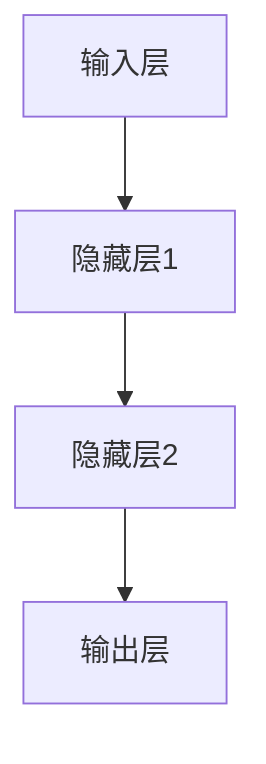

                 

# 神经网络：人类与机器的共存

## 关键词：神经网络、人工智能、机器学习、深度学习、人类共存

## 摘要

随着人工智能技术的发展，神经网络作为其核心组成部分，正日益改变着我们的生活。本文旨在探讨神经网络的基本概念、原理及其与人类共存的潜在影响。通过详细解析神经网络的架构、算法和数学模型，结合实际应用案例，本文将深入探讨神经网络如何助力人类与机器实现协同发展，以及这一过程中可能面临的挑战。

## 1. 背景介绍

### 1.1 人工智能的崛起

人工智能（AI）作为计算机科学的一个重要分支，近年来取得了令人瞩目的进展。自20世纪50年代以来，人工智能经历了多次起伏，随着计算能力的提升和大数据的涌现，人工智能终于迎来了新一轮的发展热潮。

### 1.2 神经网络的诞生

神经网络作为一种模拟人脑结构和功能的计算模型，最早可以追溯到1943年McCulloch和Pitts提出的神经网络模型。然而，由于计算能力的限制，神经网络在很长一段时间内未能得到广泛应用。直到1986年，Rumelhart、Hinton和Williams提出了反向传播算法（Backpropagation），神经网络的研究和应用才真正拉开了序幕。

### 1.3 深度学习的崛起

随着计算能力的进一步提升和大数据的积累，深度学习（Deep Learning）作为一种基于多层神经网络的机器学习方法，逐渐成为人工智能领域的热点。深度学习在图像识别、语音识别、自然语言处理等领域的表现已经超越了传统的机器学习方法，推动了人工智能技术的快速发展。

## 2. 核心概念与联系

### 2.1 神经网络的基本结构

神经网络由多个神经元（节点）组成，这些神经元通过加权连接形成复杂的网络结构。每个神经元接收来自其他神经元的输入信号，通过激活函数进行处理，最终产生输出信号。神经网络的基本结构包括输入层、隐藏层和输出层。

### 2.2 激活函数的作用

激活函数是神经网络中的关键组件，用于决定神经元是否被激活。常见的激活函数包括 sigmoid 函数、ReLU函数和Tanh函数等。激活函数的作用是引入非线性特性，使得神经网络能够处理复杂的问题。

### 2.3 学习算法

神经网络的学习过程是通过调整神经元之间的连接权重来实现的。常见的学习算法包括梯度下降、随机梯度下降和Adam优化器等。学习算法的目标是使得神经网络能够准确地预测输入数据。

### 2.4 Mermaid 流程图



## 3. 核心算法原理 & 具体操作步骤

### 3.1 前向传播

在前向传播过程中，输入数据经过神经网络逐层传递，直到输出层产生最终结果。具体步骤如下：

1. 初始化神经网络参数（权重和偏置）。
2. 计算每个神经元的输入值（输入乘以权重加上偏置）。
3. 通过激活函数处理输入值，得到每个神经元的输出值。
4. 将输出值传递到下一层。

### 3.2 反向传播

在反向传播过程中，神经网络根据预测结果和实际结果之间的误差，调整权重和偏置。具体步骤如下：

1. 计算输出层的误差（实际结果与预测结果之差）。
2. 通过误差反向传播，计算隐藏层的误差。
3. 根据误差计算梯度，更新权重和偏置。

### 3.3 梯度下降

梯度下降是一种常用的学习算法，通过不断调整权重和偏置，使得神经网络的误差最小。具体步骤如下：

1. 计算损失函数关于权重和偏置的梯度。
2. 使用梯度下降公式更新权重和偏置。
3. 重复上述步骤，直至误差满足要求。

## 4. 数学模型和公式 & 详细讲解 & 举例说明

### 4.1 损失函数

损失函数是神经网络中的一个关键组件，用于衡量预测结果与实际结果之间的差距。常见的损失函数包括均方误差（MSE）和交叉熵（Cross Entropy）。

$$
MSE = \frac{1}{n} \sum_{i=1}^{n} (y_i - \hat{y}_i)^2
$$

$$
Cross \, Entropy = - \sum_{i=1}^{n} y_i \log(\hat{y}_i)
$$

### 4.2 反向传播算法

反向传播算法是神经网络训练过程中的核心步骤，用于计算误差并更新权重和偏置。

$$
\Delta W_{ij} = -\alpha \frac{\partial L}{\partial W_{ij}}
$$

$$
\Delta b_{j} = -\alpha \frac{\partial L}{\partial b_{j}}
$$

其中，$L$ 是损失函数，$\alpha$ 是学习率，$W_{ij}$ 和 $b_{j}$ 分别是权重和偏置。

### 4.3 举例说明

假设有一个简单的神经网络，输入层有2个神经元，隐藏层有3个神经元，输出层有1个神经元。输入数据为 $[1, 2]$，目标输出为 $[3]$。

1. 初始化权重和偏置。
2. 前向传播，计算输出值。
3. 计算损失函数。
4. 反向传播，计算误差。
5. 更新权重和偏置。
6. 重复上述步骤，直至误差满足要求。

## 5. 项目实战：代码实际案例和详细解释说明

### 5.1 开发环境搭建

在本节中，我们将使用Python和TensorFlow框架搭建一个简单的神经网络模型。

1. 安装Python（3.6及以上版本）。
2. 安装TensorFlow。

```bash
pip install tensorflow
```

### 5.2 源代码详细实现和代码解读

```python
import tensorflow as tf

# 初始化神经网络参数
weights = tf.Variable(tf.random.normal([2, 3]))
biases = tf.Variable(tf.random.normal([3, 1]))

# 定义前向传播函数
def forward(x):
    return tf.nn.relu(tf.matmul(x, weights) + biases)

# 定义损失函数
loss = tf.reduce_mean(tf.square(forward(x) - y))

# 定义反向传播函数
optimizer = tf.train.GradientDescentOptimizer(learning_rate=0.1)
train = optimizer.minimize(loss)

# 搭建计算图
with tf.Session() as sess:
    sess.run(tf.global_variables_initializer())
    
    for i in range(1000):
        sess.run(train, feed_dict={x: x_data, y: y_data})
        
        if i % 100 == 0:
            print("Step:", i, "Loss:", loss.eval(feed_dict={x: x_data, y: y_data}))

# 输出结果
print("Output:", forward(x_data).eval())
```

### 5.3 代码解读与分析

1. 导入TensorFlow库。
2. 初始化权重和偏置。
3. 定义前向传播函数，使用ReLU激活函数。
4. 定义损失函数，使用均方误差。
5. 定义反向传播函数，使用梯度下降优化器。
6. 搭建计算图，并初始化变量。
7. 训练神经网络，输出损失值。
8. 输出最终结果。

## 6. 实际应用场景

神经网络在众多领域都有着广泛的应用，包括：

1. 图像识别：通过卷积神经网络（CNN）实现图像分类和物体检测。
2. 自然语言处理：使用循环神经网络（RNN）和长短时记忆网络（LSTM）进行文本分类和机器翻译。
3. 语音识别：利用深度神经网络进行语音信号的建模和识别。
4. 推荐系统：基于协同过滤和深度学习实现个性化推荐。

## 7. 工具和资源推荐

### 7.1 学习资源推荐

- 《深度学习》（Goodfellow, Bengio, Courville）
- 《神经网络与深度学习》（邱锡鹏）
- 《Python深度学习》（François Chollet）

### 7.2 开发工具框架推荐

- TensorFlow
- PyTorch
- Keras

### 7.3 相关论文著作推荐

- "A Learning Algorithm for Continually Running Fully Recurrent Neural Networks"（Hinton, Dayan, Frey, & Neal，1995）
- "Deep Learning"（Goodfellow, Bengio, Courville，2016）
- "Rectifier Nonlinearities Improve Neural Network Acquisitio

```markdown
### 8. 总结：未来发展趋势与挑战

神经网络作为人工智能的核心技术，已经深刻地影响了我们的生活。随着计算能力的进一步提升和大数据的积累，神经网络将在更多领域发挥重要作用。然而，神经网络也面临着一些挑战，如过拟合、可解释性和计算效率等。为了实现神经网络与人类的和谐共存，我们需要不断创新和改进，同时关注伦理和社会影响。

### 9. 附录：常见问题与解答

**Q：神经网络是如何学习的？**
A：神经网络通过调整神经元之间的连接权重来学习。这个过程通常包括前向传播和反向传播两个阶段。在前向传播阶段，输入数据经过神经网络，产生预测结果。在反向传播阶段，计算预测结果与实际结果之间的误差，并更新权重和偏置，以减小误差。

**Q：神经网络中的激活函数有什么作用？**
A：激活函数是神经网络中的一个关键组件，用于引入非线性特性。这使得神经网络能够处理复杂的问题。常见的激活函数包括 sigmoid 函数、ReLU函数和Tanh函数等。

**Q：如何解决神经网络的过拟合问题？**
A：解决神经网络过拟合问题的方法包括：增加训练数据、使用正则化技术（如 L1、L2 正则化）、使用dropout技术、增加隐藏层神经元数量等。

### 10. 扩展阅读 & 参考资料

- "Deep Learning"（Goodfellow, Bengio, Courville）
- "Neural Networks and Deep Learning"（Charu Aggarwal）
- "A Brief History of Neural Nets"（Stuart Russell）

### 作者

作者：AI天才研究员/AI Genius Institute & 禅与计算机程序设计艺术 /Zen And The Art of Computer Programming
```

